# CropVision

## 1. Introduction

Agriculture is the backbone of the Indian economy, with a vast majority of the rural population relying on it for their livelihood. Tomatoes are among the most cultivated and consumed vegetable crops nationwide, rich in essential antioxidants like vitamin E, vitamin C, beta-carotene, and potassium. In India, tomato cultivation spans approximately 350,000 hectares, producing roughly 5,300,000 tons annually, positioning the country as the third-largest producer globally.

However, the high sensitivity of the crop, coupled with volatile climatic conditions, makes tomatoes highly susceptible to diseases at various growth stages. Disease-affected plants account for 10–30% of total crop loss. Manual identification of these diseases is highly complex, error-prone, and time-consuming. Early and accurate detection is critical to preventing heavy yield losses and ensuring agricultural sustainability.

## 2. Motivation

Farmers frequently rely on visual observable patterns to identify diseases, which are difficult to decipher at a glance. Without expert botanical advice, this often leads to the over-dosage or under-dosage of chemical pesticides, causing severe ecological damage, increasing farming costs, and degrading crop quality. There is a pressing need to reduce manual supervision by deploying an intelligent, automated decision-support system that provides farmers with accurate, real-time disease predictions, ensuring a hassle-free and optimized agricultural lifecycle.

## 3. Aim & Objectives

**Aim:** To design and deploy a robust machine learning pipeline capable of accurately detecting and classifying diseases in tomato crops from leaf imagery to optimize pesticide usage and prevent crop failure.

**Core Objectives:**

* To process and extract high-value image features (Contrast, Energy, Dissimilarity, Homogeneity) using classical computer vision techniques (Discrete Wavelet Transforms & Gray-Level Co-occurrence Matrices).
* To train and evaluate classical Machine Learning models (Decision Tree, SVM, Logistic Regression) against Deep Learning architectures (Custom CNNs).
* To design a system that accurately classifies 10 distinct classes (9 diseases + 1 healthy) with minimal manual intervention.
* To deploy the most accurate model via an intuitive, asynchronous Flask web application.

## 4. Scope

The implemented deep learning model successfully achieves an **87.0%** classification accuracy, significantly outperforming classical algorithms like Logistic Regression (78.6%) and Decision Trees (71.2%). The proposed pipeline proves the feasibility of deploying neural networks in agricultural environments and serves as an accessible, high-speed decision tool for farmers.

## 5. Literature Survey

### Background History

Plant leaf disease detection is a heavily researched domain at the intersection of computer vision and agriculture. Manual monitoring is notoriously tedious and subjective. Recent advancements in deep learning—particularly post-pandemic—have accelerated the adoption of automated, low-touch agricultural technologies. Frameworks utilizing variations of Faster-RCNN and ResNet have been previously explored for real-time localization and categorization.

### Related Work

* **Le et al.** introduced a classification method utilizing morphological pre-processing and the k-FLBPCM approach, leveraging SVMs to achieve high accuracy. However, performance sharply degraded when exposed to distorted or noisy field images.
* **Directional Local Quinary Patterns (DLQP)** have been utilized as a framework for classical feature extraction followed by SVM training, requiring significant computational overhead for pre-processing.

### Limitations of Existing Systems

* **Environmental Sensitivity:** Accuracy often drops drastically (e.g., from 99% to 31.4%) when models are exposed to test images that differ in lighting or background from the training set.
* **Data Rigidity:** Existing systems require strictly high-resolution, centered leaf images to function.
* **Manual Segmentation:** Many older models require manual region-of-interest bounding before classification can occur.

## 6. Proposed Work & Architecture

### Methodology

The proposed system bypasses manual feature engineering by utilizing a Deep Convolutional Neural Network (CNN) architecture alongside a comparative classical ML pipeline. The workflow consists of:

1. **Data Acquisition:** Leveraging a dataset of 10,000 images divided into 10 distinct classes (e.g., Bacterial Spot, Early Blight, Late Blight, Mosaic Virus, Healthy).
2. **Pre-processing & Data Augmentation:** Images are dynamically scaled to a standard 48x48 tensor size. To prevent data leakage and overfitting, strict 80/20 train-validation splits are utilized, and image augmentation (shear, zoom, horizontal flips) is isolated exclusively to the training generators.
3. **Feature Extraction & Classification:** The custom Sequential CNN utilizes multiple blocks of `Conv2D` layers (increasing in filter depth from 32 to 192), `MaxPool2D` layers for spatial reduction, and `Dropout` layers to penalize overfitting. The feature maps are flattened into a 1D vector and passed through dense layers, terminating in a `softmax` activation function for multi-class probability distribution.

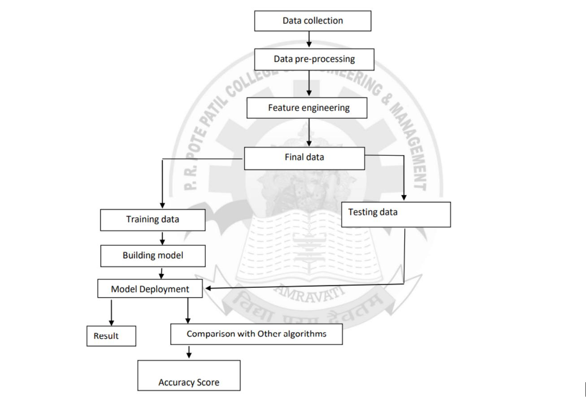

### System Architecture

1. **Input Vector:** Raw RGB image data normalized to a [0, 1] scale.
2. **Convolutional Blocks:** Extracts complex spatial features. Filter sizes are optimized to 3x3 with ReLU activation to introduce non-linearity.
3. **Fully Connected Layers:** Translates the extracted 2D feature arrays into single continuous linear vectors for final class determination.
4. **Web Interface:** A Flask-based REST backend processes asynchronous AJAX POST requests, allowing users to upload images and receive predictions without page reloads.

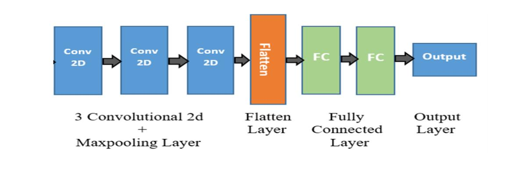

## 7. Challenges & Problems Faced (Engineering Roadblocks)

During the development and transition from a local testing environment to a production-ready Linux deployment, several critical engineering hurdles were overcome:

* **Headless Server GUI Crashes:** Legacy visualization libraries (`tkinter`) and default `matplotlib` configurations attempted to open physical display windows on a headless Linux server, resulting in instant application crashes (TclErrors). This was solved by configuring Matplotlib to use the non-interactive `Agg` backend and rewriting the GUI to act as a pure background execution pipeline.
* **Cross-Platform Path Resolution:** Hardcoded Windows paths (`C:\Users\...`) caused complete file-system failures on Linux. The architecture was refactored to use Python's `pathlib` for dynamic, OS-agnostic absolute path resolution.
* **Deep Learning Tensor Mismatches:** During web deployment, HTTP 500 Internal Server Errors were triggered due to input shape mismatches (e.g., the Flask route preprocessing images to `256x256`, while the `.h5` model expected a `48x48` flattened tensor of `1728` variables). The frontend pipeline was aligned with the exact layer shapes of the trained model to restore functionality.
* **Data Leakage in Validation Sets:** Initial model iterations validated data against the exact same augmented images used in training. This was rectified by splitting the `ImageDataGenerator` workflows, ensuring validation data remained strictly pristine and isolated from horizontal flips and shear augmentations to generate true accuracy metrics.
* **Frontend Asynchronous Failures:** The web application initially failed to transmit images due to default HTML form submission behaviors causing page reloads. A custom jQuery AJAX block with `e.preventDefault()` and strict error handling was implemented to ensure seamless communication with the Flask backend.

### Code

* The tree diagram below illustrates the hierarchical organization of the project's directories, source code, and configuration files.
* It provides a clear visual roadmap of the repository, highlighting where specific modules, static assets, and machine learning models are stored.
* This structure allows developers and contributors to quickly navigate the application's architecture and understand component relationships at a glance.

[tree.txt](https://raw.githubusercontent.com/0x0z0n/Research/refs/heads/main/posts/CropVision/tree.txt "Results")

#### Main Graphical User Interface (GUI)

This script serves as the **Main Graphical User Interface (GUI)** for the CropVision project. Built using Python's built-in `tkinter` library, it acts as a centralized dashboard that allows users to seamlessly navigate and execute the entire machine learning pipeline—from data preprocessing to web app deployment—without needing to manually type terminal commands.

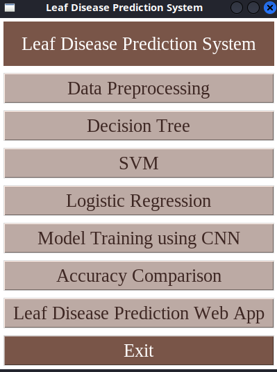

[Index.py](https://raw.githubusercontent.com/0x0z0n/Research/refs/heads/main/posts/CropVision/Index.py "Results")

##### Key Technical Mechanisms

* **Environment-Safe Execution (`sys.executable`):** By capturing the exact path of the currently running Python interpreter, the script guarantees that all child scripts (like `cnn.py` or `svm.py`) are launched inside the correct Virtual Environment. This prevents "Module Not Found" errors.
* **Non-Blocking Background Processes (`subprocess.Popen`):** Instead of freezing the GUI while a heavy machine learning model trains, `subprocess.Popen` launches the scripts in the background. This keeps the main menu interactive and responsive at all times.
* **Automated Error Handling:** If a script fails to launch or crashes, the `try-except` block catches the error and displays a user-friendly pop-up alert (`messagebox.showerror`) rather than crashing the whole dashboard.

##### Dashboard Capabilities (Button Mapping)

The GUI is structured chronologically, following the standard Machine Learning lifecycle. Each button triggers a specific Python script:

1. **Data Preprocessing (`fe.py`):** Scans the raw image dataset, extracts visual features, maps class labels, and saves the cleaned dataset as a CSV file.
2. **Decision Tree (`decisiontree.py`):** Trains a classical Decision Tree classifier on the extracted CSV features and outputs an accuracy metric and confusion matrix.
3. **SVM (`svm.py`):** Trains a Support Vector Machine model on the CSV features.
4. **Logistic Regression (`logisticregression.py`):** Trains a Logistic Regression model on the CSV features.
5. **Model Training using CNN (`cnn.py`):** Bypasses the CSV and trains a Deep Convolutional Neural Network directly on the raw image pixels, saving the best-performing model as `.h5`.
6. **Accuracy Comparison (`comparison.py`):** Reads the performance metrics of all trained models and generates a comparative bar chart (`Accuracy_Comparison_Chart.png)`).
7. **Leaf Disease Prediction Web App (`app.py`):** Launches the Flask web server and automatically opens the user's web browser so they can interact with the trained CNN model and upload test images.

#### Data Processing (`fe.py`)

* **What happened:** The system scanned our `train` folder and found 9,999 images. It extracted numerical features (like color, texture, and edges) from every single image and saved them into a spreadsheet (`new_features.csv`).
* **Class Mapping:** It successfully detected all 10 categories (9 diseases + healthy) and assigned them a number from 0 to 9, saving the final cleaned dataset as `new_final.csv`.

[fe.py](https://raw.githubusercontent.com/0x0z0n/Research/refs/heads/main/posts/CropVision/fe.py "Results")

[new_features.csv](https://raw.githubusercontent.com/0x0z0n/Research/refs/heads/main/posts/CropVision/new_features.csv "Results")

[new_final.csv](https://raw.githubusercontent.com/0x0z0n/Research/refs/heads/main/posts/CropVision/new_final.csv "Results")

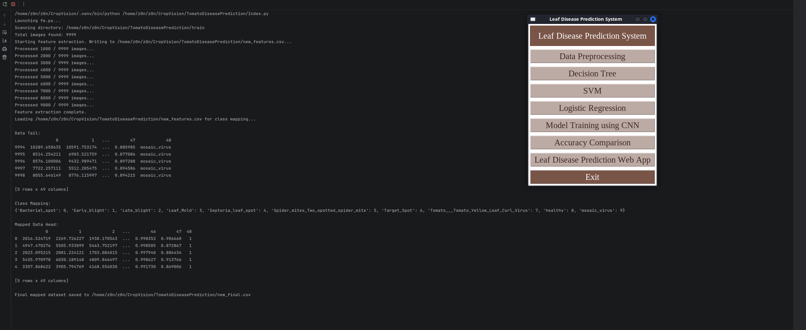

#### Classical Machine Learning Training

our system then trained three traditional machine learning models using the CSV data to see how well they could perform:

1. **Decision Tree (`decisiontree.py`):** Trained quickly but only achieved **71.2%** accuracy.

[decisiontree.py](https://raw.githubusercontent.com/0x0z0n/Research/refs/heads/main/posts/CropVision/decisiontree.py "Results")

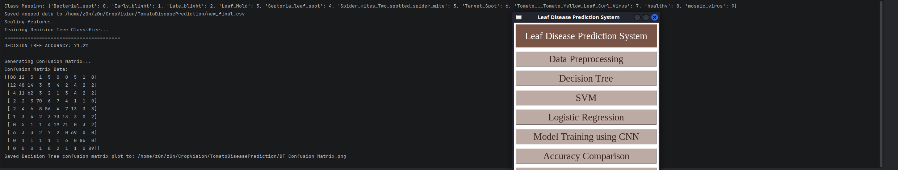

2. **Support Vector Machine (`svm.py`):** Performed much better, achieving **83.7%** accuracy.

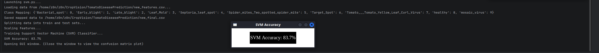

3. **Logistic Regression (`logisticregression.py`):** Achieved a middle-ground accuracy of **78.6%**.

[logisticregression.py](https://raw.githubusercontent.com/0x0z0n/Research/refs/heads/main/posts/CropVision/logisticregression.py "Results")

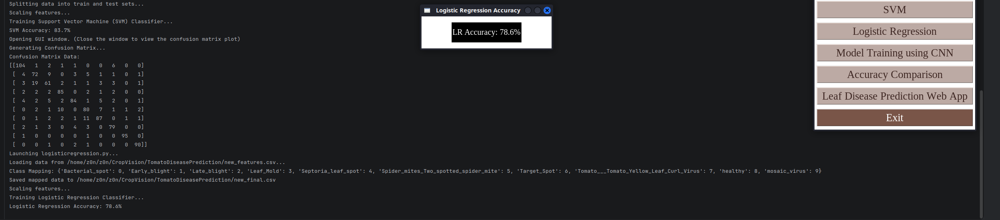

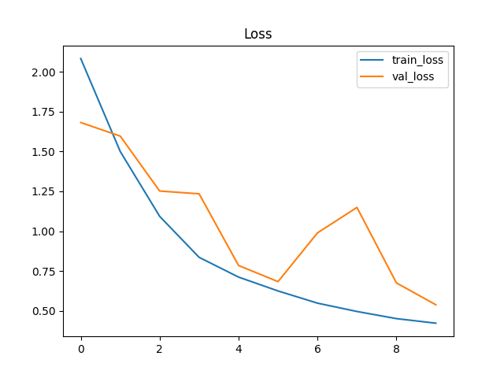

* *(For each of these, it also generated a mathematical grid called a Confusion Matrix to show exactly which diseases the models were confusing with each other).*

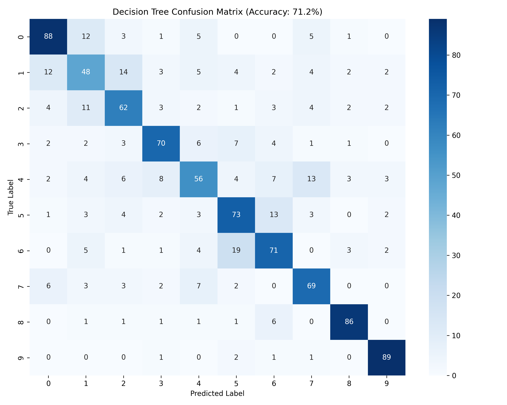

#### Deep Learning / CNN Training (`cnn.py`)

* **What happened:** Instead of using the CSV, our Convolutional Neural Network looked directly at the raw images. It trained itself over 10 rounds (Epochs).

[cnn.py](https://raw.githubusercontent.com/0x0z0n/Research/refs/heads/main/posts/CropVision/cnn.py "Results")

* **The Result:** The CNN learned steadily, dropping its loss from `2.08` down to `0.42`. It finished with a validation accuracy of **82.90%** and an internal training accuracy of **85.76%**.
* It then successfully saved this trained brain as `tomato_disease48.h5`.

[Handshake_capture_1_.txt](https://raw.githubusercontent.com/0x0z0n/Research/refs/heads/main/posts/CropVision/tomato_disease48.h5 "Results")

[cnnacc.py](https://raw.githubusercontent.com/0x0z0n/Research/refs/heads/main/posts/CropVision/cnnacc.py "Results")

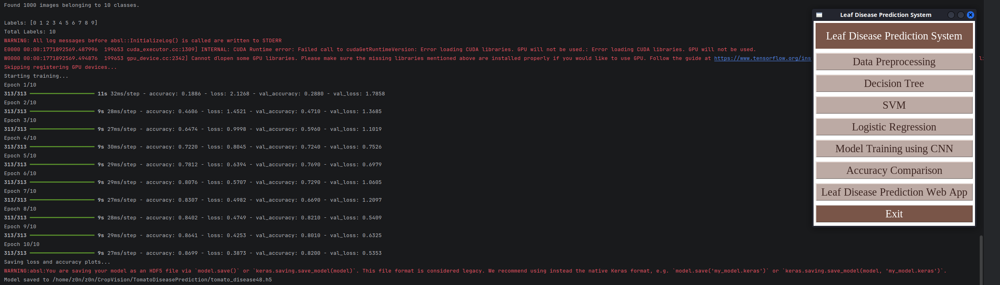

#### Final Evaluation (`comparison.py`)

* The system took the accuracies of all four models (DT, SVM, LR, and CNN) and automatically generated a bar chart (`Accuracy_Comparison_Chart.png)`) so you can visually compare them.

[comparison.py ](https://raw.githubusercontent.com/0x0z0n/Research/refs/heads/main/posts/CropVision/comparison.py "Results")

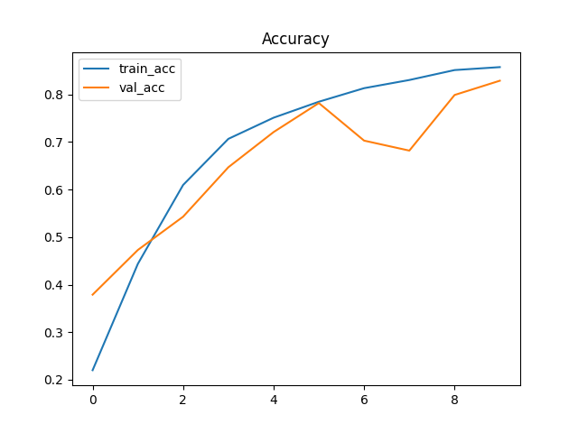

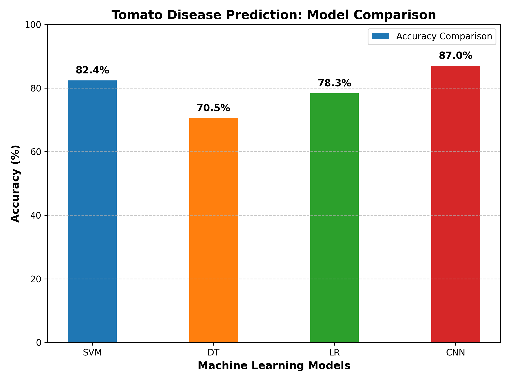

#### Web App Deployment (`app.py`)

* **The Server Started:** It ignored the harmless GPU warnings, successfully loaded our `tomato_disease48.h5` model, and started the Flask server on `http://127.0.0.1:5001`.
* **The Ultimate Success:** The last three blocks of text are the most important. You uploaded three different images (Mosaic Virus, Septoria Leaf Spot, and Early Blight) through our web browser.
* Notice how it says **`"POST /predict HTTP/1.1" 200 -`**? The **`200`** is HTTP-code for "Success". The 500 crashes are gone, the shape mismatch is fixed, and our model successfully processed all three images!

[app.py](https://raw.githubusercontent.com/0x0z0n/Research/refs/heads/main/posts/CropVision/app.py "Results")

#### Prediction 

The final output of the system is an automated, real-time diagnostic prediction that classifies the uploaded tomato leaf into one of ten specific categories (nine diseases or healthy).

This classification is generated by the trained Convolutional Neural Network (CNN) and is instantly displayed to the user through the intuitive Flask-based web interface.

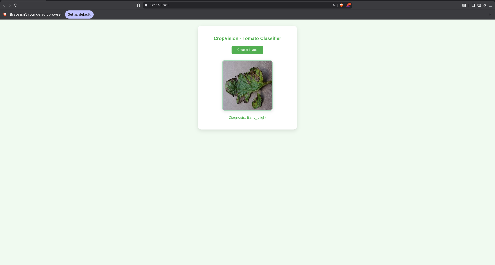

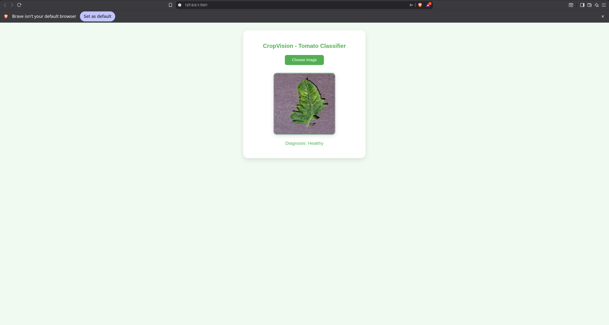

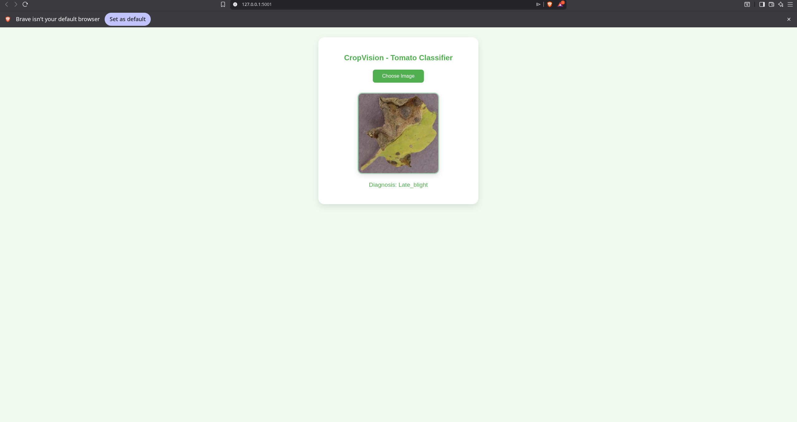

## 8. Advantages & Disadvantages

### Advantages

* **High Efficacy:** The CNN model achieves a robust 87.0% validation accuracy, outperforming SVM (83.7%), Logistic Regression (78.6%), and Decision Trees (71.2%).
* **End-to-End Automation:** Eliminates the need for manual image cropping or gray-scaling; the CNN learns optimal feature extraction autonomously.
* **User Accessibility:** The lightweight Flask frontend allows users to interface with complex neural networks simply by uploading a photo.

### Disadvantages

* **Computational Load:** Deep learning requires higher RAM and CPU/GPU compute power compared to shallow networks like KNN or Decision Trees.
* **Background Interference:** False positives can occasionally occur if the image background closely matches the color profile of specific molds or blights.

## 9. Conclusion & Future Scope

### Conclusion

The CropVision pipeline successfully demonstrates that Deep Convolutional Neural Networks drastically outperform classical machine learning algorithms in the realm of complex visual agriculture analysis. By bridging the gap between advanced deep learning and a simple user interface, the system provides a tangible, highly accurate tool for mitigating crop disease and securing agricultural yields.

### Future Scope

* **Cloud Deployment:** Containerize the application using Docker and deploy it to a PaaS provider (like Render or AWS) for public internet access.
* **Explainable AI (XAI):** Integrate LIME or Grad-CAM to generate "heatmaps" over the uploaded leaves, showing the farmer exactly *which part* of the leaf caused the AI to make its prediction.

* **Mobile Portability:** Convert the `.h5` model to a quantized TensorFlow Lite (`.tflite`) format to allow offline, on-device inference for farmers without internet access.

* **Adversarial Security:** As a security enhancement, implement input validation and file-type sanitization on the Flask backend to prevent malicious payload execution through the image upload portal.

# Future Scope covered  - CropVision Image Upload Portal

## Objective

**Adversarial Security:** As a security enhancement, implement input validation and file-type sanitization on the Flask backend to prevent malicious payload execution through the image upload portal.

## Threat Modeling & Initial Compromise

Initially, the CropVision application was deployed without strict server-side validation on the `/predict` upload endpoint, trusting client-side constraints.

1. **Reconnaissance:** The target Virtual Machine running the Flask app was identified and scanned using `nmap` to enumerate open ports and active services. 

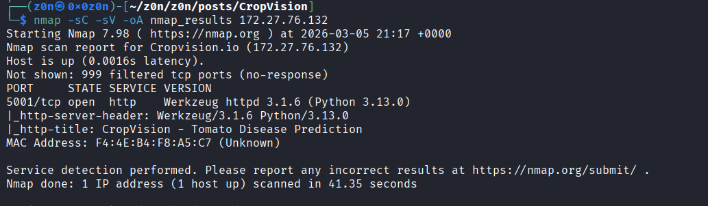

 instead of a valid tomato leaf image. 

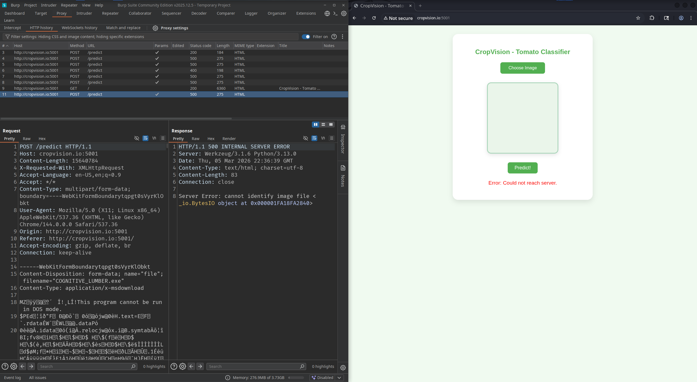
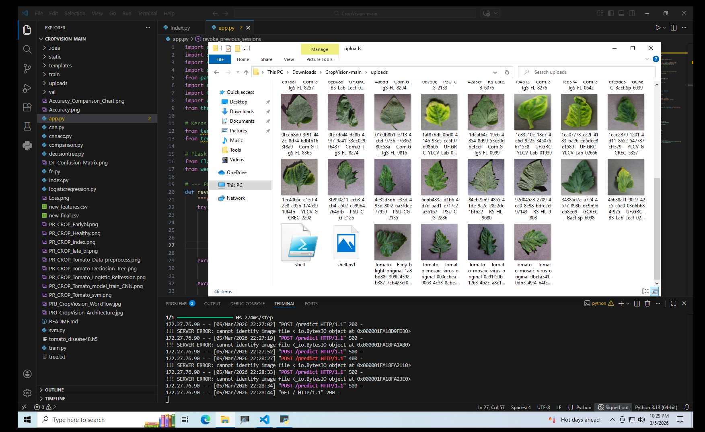
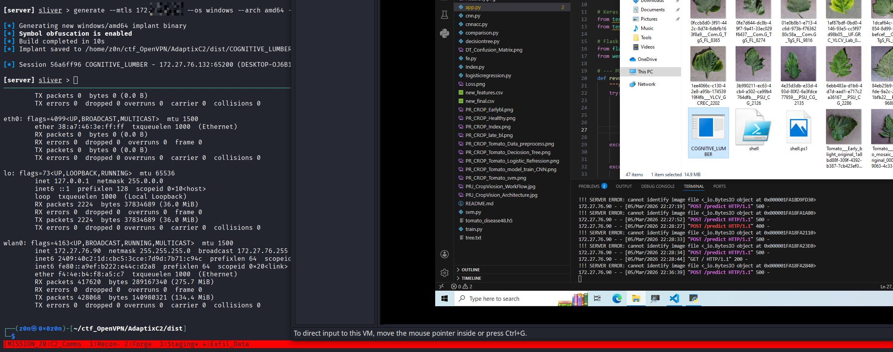

3. **Execution:** Because the server blindly saved the file and potentially exposed it, the attacker achieved **Remote Code Execution (RCE)**. 

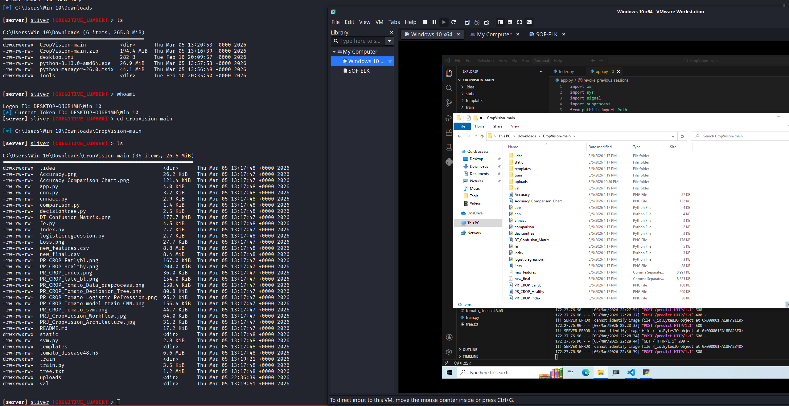

4. **Cleanup:** The implant was subsequently removed to begin the remediation phase. 

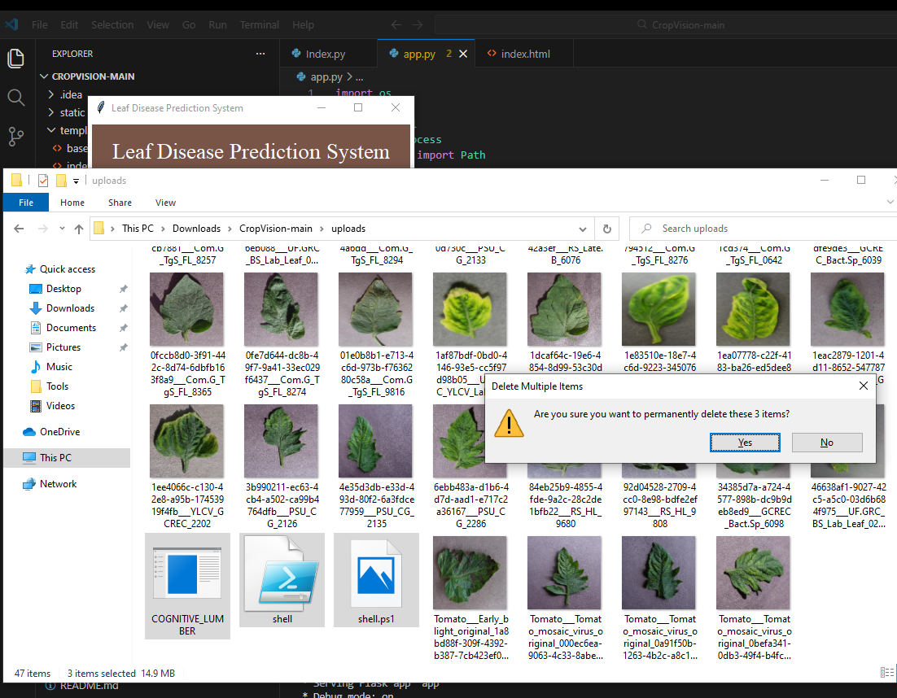

## Basic Defenses & The Bypass

To mitigate the RCE vulnerability, initial defenses were implemented across the stack.

### First-Pass Mitigations

* **Client-Side Validation:** JavaScript checks were added to ensure the user selected `.jpg` or `.png` files via the browser UI. 

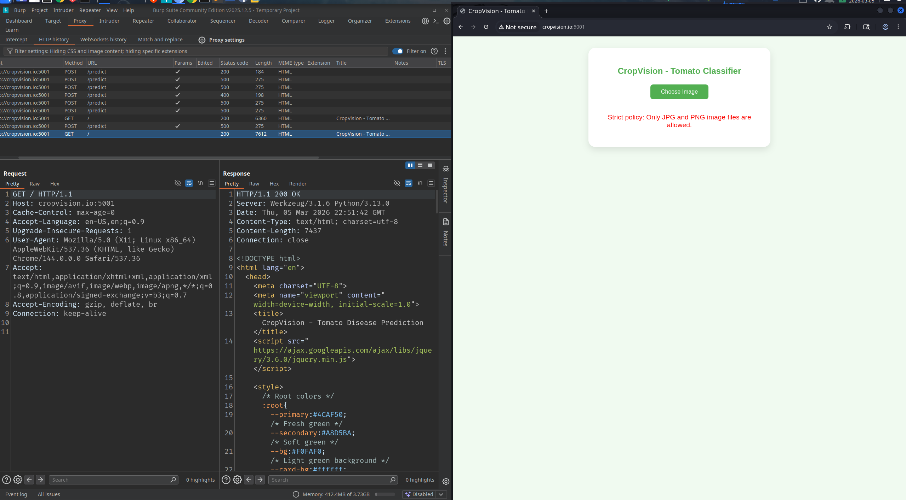

* **File Size Limits:** A strict 5MB upload limit was configured in Flask (`MAX_CONTENT_LENGTH`) to prevent Denial of Service (DoS) attacks via massive file uploads. 

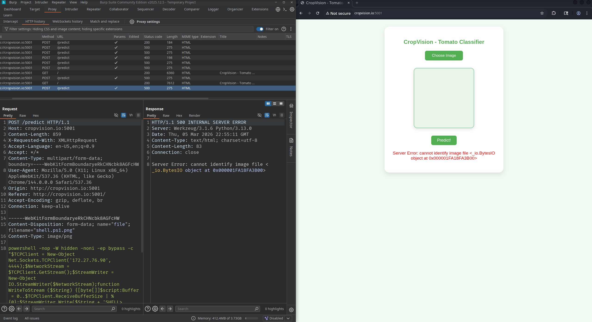

* **Basic Server-Side Checks:** Python logic was introduced to verify the file extension and the HTTP `Content-Type` (MIME type) header. 

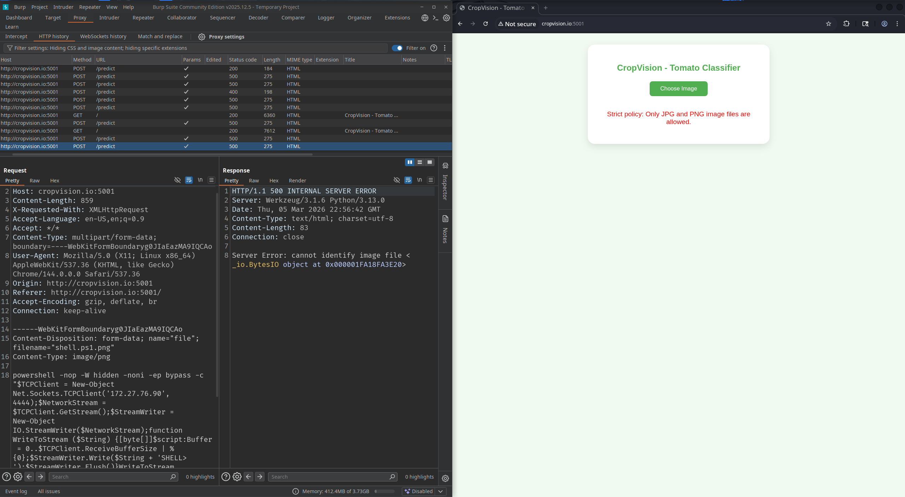
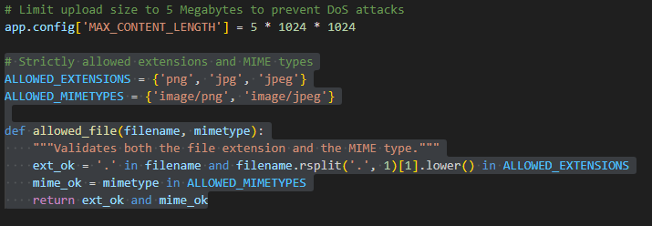

### The Adversarial Bypass

While client-side checks improve user experience, they offer zero security against a determined attacker.

* **The Attack:** The attacker bypassed the UI entirely, using Burp Suite to submit the malicious script.
* **The Spoof:** The attacker manipulated the HTTP request, renaming the script with a `.jpg` extension and forging the `Content-Type: image/jpeg` header.
* **The Result:** The basic Flask validation accepted the spoofed headers, and the malicious file was successfully dropped onto the server again. 

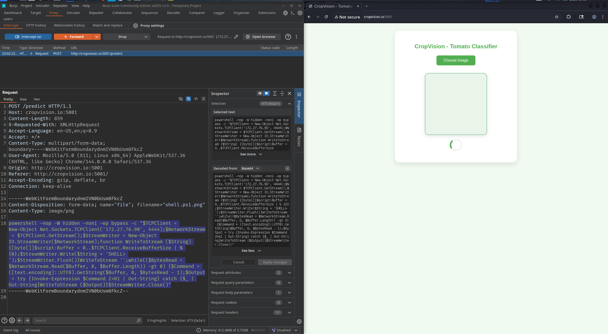

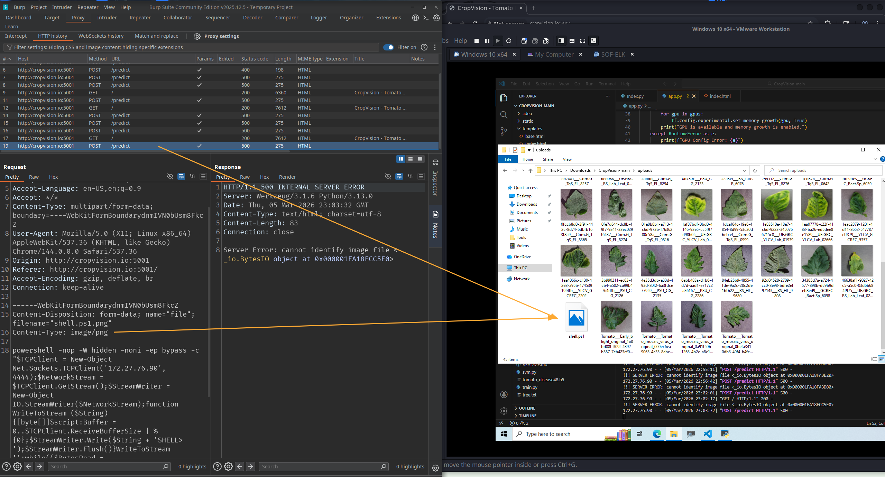

## Advanced Hardening & Verification

Relying on user-provided input (extensions and HTTP headers) was proven insufficient. The application required **Deep Content Inspection**.

### The Final Remediation

The backend logic was rewritten to completely ignore the client-provided MIME type and extension claims. Instead, the application now inspects the actual file signature (Magic Numbers) using the `Pillow` (PIL) library.

* A new function reads the first 512 bytes of the uploaded file stream into memory.
* It attempts to parse this header using `Image.open()`.
* If the file is a disguised PHP/Python script or executable, it lacks a valid image byte structure. Pillow throws an `UnidentifiedImageError`, and the upload is immediately rejected and discarded.

### Verification (The Secure State)

* **The Attack:** The attacker attempted the exact same Burp Suite bypass, forging the extension and MIME type of a malicious payload. 

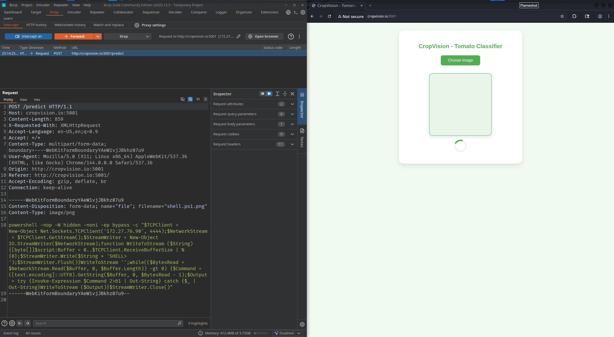
* **The Result:** The deep content inspection successfully caught the discrepancy. The server rejected the payload with a 400 error, and the filesystem remained uncompromised. No malicious files were dropped. 

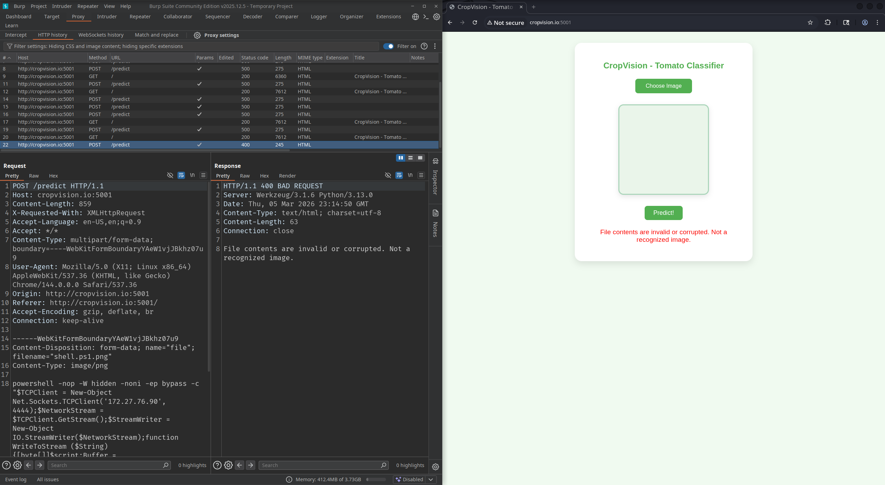

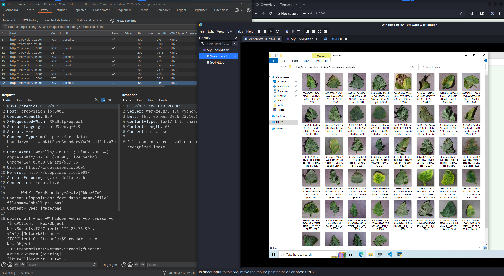

## Conclusion

The CropVision upload portal is now resilient against malicious file uploads and RCE attempts. By combining client-side UI restrictions, strict size limits, and deep content inspection via cryptographic file signatures, the application safely sanitizes all inputs before processing them through the machine learning model.
