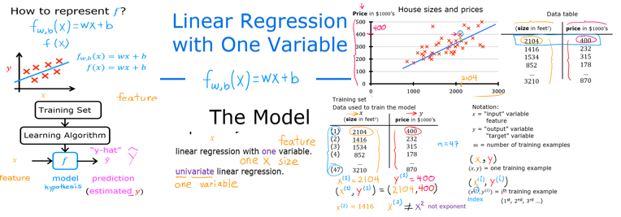
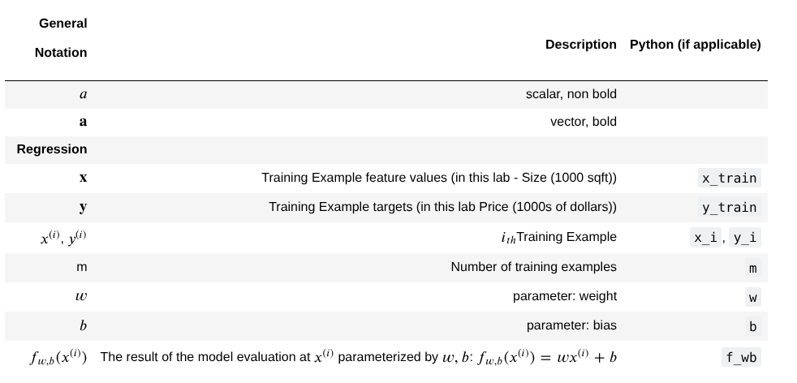

#  Machine Learning

# Week 1 Essentials

## 1. Introduction to Machine Learning
Machine learning is a subfield of **Artificial Intelligence (AI)** focused on building intelligent machines that learn from data rather than following explicit, hard-coded instructions.

*   **Arthur Samuel's Definition (1959):** The field of study that gives computers the ability to learn **without being explicitly programmed**.
*   **The Checkers Example:** Samuel wrote a program that played tens of thousands of games against itself. By observing which board positions led to wins, it eventually became a better player than Samuel himself.
*   **Economic Impact:** It is estimated that AI and machine learning will create **13 trillion** of value annually by 2030.

## 2. Supervised vs. Unsupervised Learning

### **Supervised Learning** (Learning with a "Teacher")
The algorithm learns from a dataset that includes the **"right answers"** (labels). It maps an input **X** to an output **Y**.

| Type | Goal | Example |
| : | : | : |
| **Regression** | Predict a **number** from infinitely many possibilities. | Predicting house prices based on square footage. |
| **Classification** | Predict a **category** or discrete class. | Detecting if a tumor is **Benign** (0) or **Malignant** (1). |

> **[Image Description: A scatter plot showing house prices. A straight line or curve is fitted through the data points to predict the price (Y) for a new house size (X).]**

### **Unsupervised Learning** (Finding Hidden Patterns)
The data comes with **no labels (Y)**. The goal is to find interesting structures or patterns within the data automatically.

*   **Clustering:** Groups similar data points together.
    *   *Example:* **Google News** groups related articles about the same topic (e.g., "Giant Panda Twins").
    *   *Example:* **Market Segmentation** groups customers by motivations (e.g., career seekers vs. knowledge seekers).
*   **Anomaly Detection:** Finding unusual data points (e.g., fraud detection).
*   **Dimensionality Reduction:** Compressing large datasets while losing minimal info.

## 3. The Linear Regression Model
Linear regression fits a **straight line** to the data. It is the most widely used learning algorithm today.

### **Notation & Terminology**:
*   **x**: Input variable / Feature (e.g., size of the house).
*   **y**: Output variable / Target (e.g., price of the house).
*   **m**: Total number of training examples.
*   **(x^{(i)}, y^{(i)})**: The i^{th} training example (row in a table).
*   **\hat{y}**: The prediction (estimate) produced by the model.

### **The Model Function (f):**
f_{w,b}(x) = wx + b
*   **w (Weight/Slope):** Determines the steepness of the line.
*   **b (Bias/y-intercept):** Determines where the line crosses the vertical axis.

## 4. The Cost Function: J(w,b)
To make the model accurate, we need a way to measure how well the line fits the data. We use the **Squared Error Cost Function**.

### **Formula:**
J(w,b) = \frac{1}{2m} \sum_{i=1}^{m} (f_{w,b}(x^{(i)}) - y^{(i)})^2
*   **Intuition:** We calculate the difference (error) between the prediction and the actual value, square it, and average it across all examples.
*   **Goal:** Find w and b that **minimise** J.

### **Visualising the Cost:**
*   **3D Surface Plot:** Looks like a "soup bowl" or hammock.
*   **Contour Plot:** 2D horizontal "slices" of the bowl. The center of the smallest circle represents the **minimum cost**.

## 5. Gradient Descent
An efficient algorithm to automatically find the values of w and b that minimise the cost function.

### **The Process:**
1.  Start with initial guesses (usually w=0, b=0).
2.  Look around and take a "baby step" in the direction of the **steepest descent**.
3.  Repeat until you reach a **local minimum**.

### **The Update Rule:**
You must update w and b **simultaneously**:
*   w = w - \alpha \frac{\partial}{\partial w} J(w,b)
*   b = b - \alpha \frac{\partial}{\partial b} J(w,b)

### **The Learning Rate (\alpha):**
*   **Too Small:** Gradient descent will be very slow.
*   **Too Large:** It may overshoot, fail to converge, or even diverge.
*   **Automatic Adjustment:** As we get closer to the minimum, the derivative gets smaller, so gradient descent automatically takes smaller steps even with a fixed \alpha.

> **Tip:** For linear regression with squared error, the cost function is **Convex** (bowl-shaped). This means it has no local minima only one **Global Minimum**. Gradient descent will always find it if \alpha is chosen correctly.

