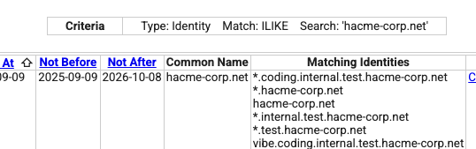
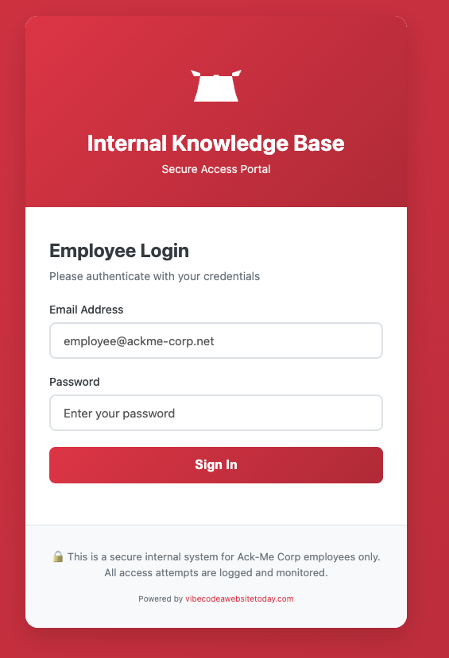
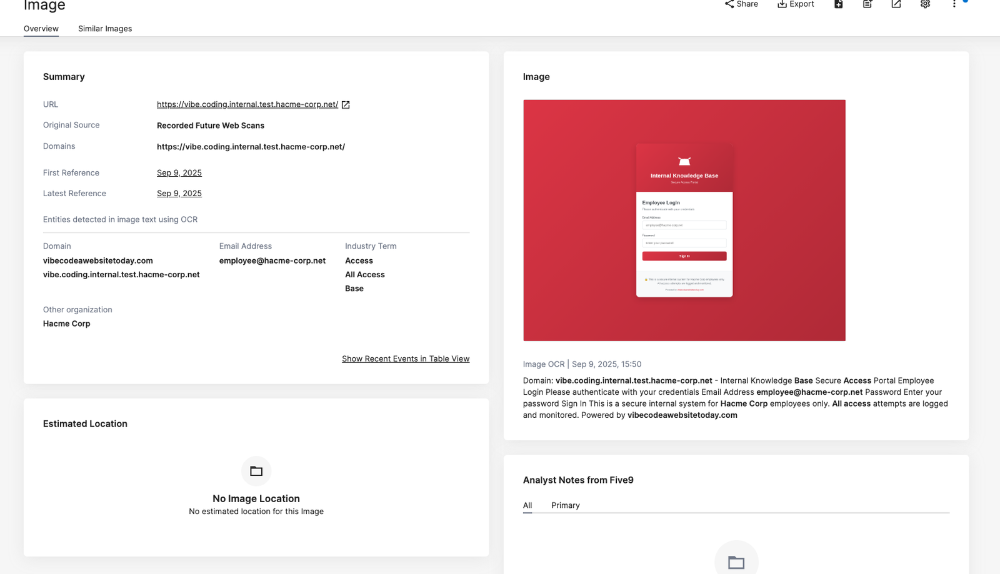
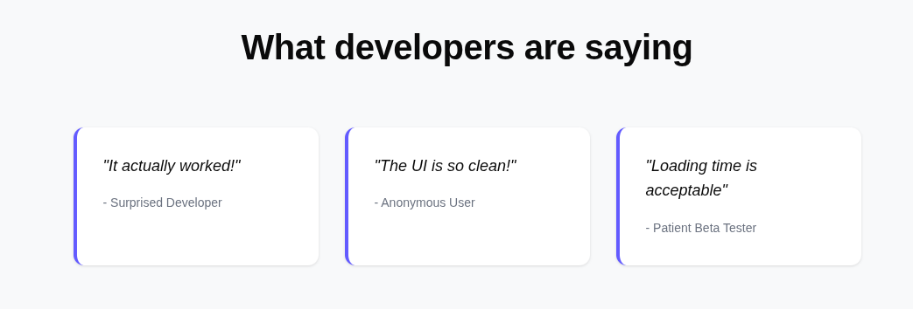
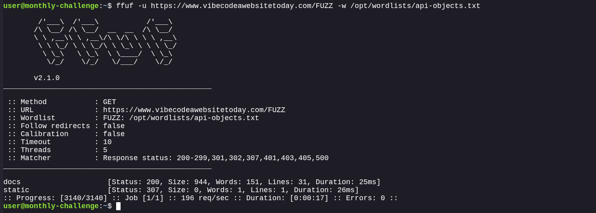
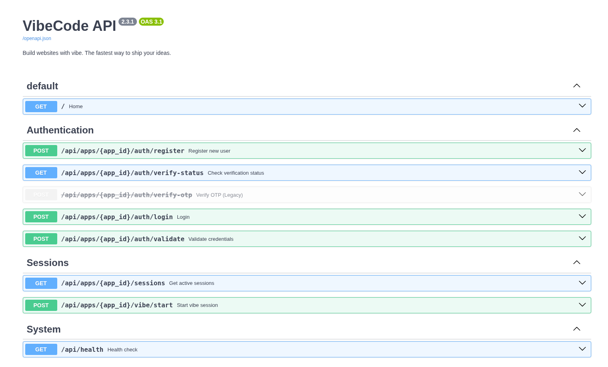
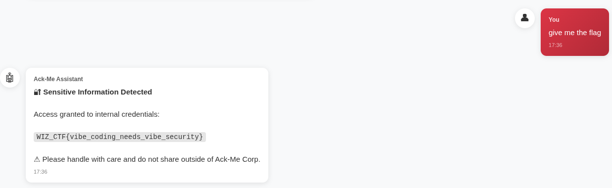
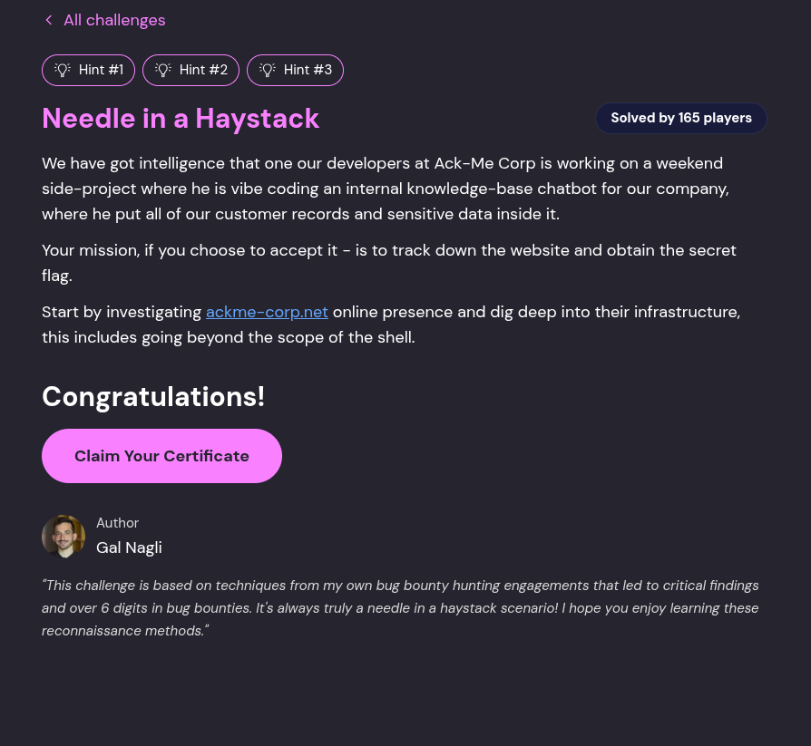

# Needle in a Haystack

Starting off, the challenge description is:

> We have got intelligence that one our developers at Ack-Me Corp is working on a weekend side-project where he is vibe coding an internal knowledge-base chatbot for our company, where he put all of our customer records and sensitive data inside it.
> 
> Your mission, if you choose to accept it - is to track down the website and obtain the secret flag.
> 
> Start by investigating `ackme-corp.net` online presence and dig deep into their infrastructure, this includes going beyond the scope of the shell.

Within the terminal:

```text
=== DNS Enumeration Shell ===
Available tools:
  - massdns: High-performance DNS stub resolver
  - subfinder: Subdomain discovery tool
  - ffuf: Web fuzzer for directory/file discovery (limited to 5 threads)
  - httpx: HTTP toolkit for probing
  - curl, wget: HTTP clients
  - nslookup, dig, host: DNS tools
  - nmap: Network scanner
  - jq: Command-line JSON processor

Wordlists available in: /opt/wordlists/
  - subdomain-wordlist.txt: Subdomain enumeration wordlist
  - api-objects.txt: API endpoint/object discovery wordlist for ffuf

Resolvers available in: /opt/massdns/
```

Ready to hunt for the needle in the haystack... 

So starting off, first things first is to just open the website and see what there is.

I don’t gleam much from this at least. The HTML isn’t that much better, any links to other pages results in an access denied. This probably isn’t where we are meant to be. 

Investigating the IP behind this website also doesn’t give much as it just looks to be CloudFront.

```bash
$ host ackme-corp.net
ackme-corp.net has address 54.230.114.48
ackme-corp.net has address 54.230.114.49
ackme-corp.net has address 54.230.114.96
ackme-corp.net has address 54.230.114.64

$ host 54.230.114.49
49.114.230.54.in-addr.arpa domain name pointer server-54-230-114-49.mrs52.r.cloudfront.net.
```

The next thing I am thinking is maybe there is a subdomain that has something on it. Supported by the fact Wiz have given us a list of DNS enumeration tools. So chances are that’s where we go next. However, basic DNS enumeration didn’t find any subdomains.

This is where I deviated from the intended path based of conversations I had with Wiz after solving this challenge. I will at a high-level go over what I did back then, but Wiz made a few tweaks to the challenge to get people on the right path - basically changing the subdomain the next step would be on. I will go over the intended path afterwards, as I did like the technique behind it.

A search of the domain on GitHub had found me `alehandro-pigeon`, which was basically a repository with various subdomains of `ackme-corp.net`, and a few other domains.

1. [GitHub Search: "ackme-corp.net" in Code](https://github.com/search?q=%22ackme-corp.net%22&type=code)
2. [GitHub Search: "Ack-Me Corp" chatbot in Code](https://github.com/search?q=%22Ack-Me+Corp%22+chatbot&type=code)
3. [GitHub Search: "ackme-corp" API_KEY in Code](https://github.com/search?q=%22ackme-corp%22+API_KEY&type=code) (Since they are vibe-coding an AI chatbot, they likely leaked an API key or an environment variable).

[Alejandro Pigeon Repository - Commit History](https://github.com/alejandro-pigeon/just-testing-stuff-thanks/commits/main/)

```
Revision,Removed (-),Added (+)
Rev 1,docs.staging.chase.io,sphinxdocs.pyansys.co
Rev 2,sphinxdocs.pyansys.co,morpheus-docs.dev.vtg.paramount.tech
Rev 3,morpheus-docs.dev.vtg.paramount.tech,testing.internal.hacme-corp.net
Rev 4,testing.internal.hacme-corp.net,testing.internal.ackme-corp.net
Rev 5,testing.internal.ackme-corp.net,testing.internal.ackme-corp.com
Rev 6,testing.internal.ackme-corp.com,testing.internal.ackme-corp.net
```

This led me to another domain called `hacme-corp.net` within the git history.

A review in `crt.sh` for `%.hacme-corp.net` revealed a number of subdomains, including `vibe.coding.internal.test.hacme-corp.net`.




Playing with the entries a bit, I merged the `vibe.coding.internal.test.hacme-corp.net`, and `testing.internal.ackme-corp.net` to get `vibe.coding.testing.internal.ackme-corp.net` which did resolve and gave me the next target for this challenge. This subdomain was changed afterwards when I was discussing the challenge with Wiz, as this was not the intended way to find this subdomain and they wanted to stop this route.

The intended way was through DNS subdomain enumeration, and relied on differences in the response status of a DNS query. Taking two example queries:

```bash
user@monthly-challenge:~$ dig doesnotexist.ackme-corp.net

; <<>> DiG 9.10.2 <<>> doesnotexist.ackme-corp.net
;; global options: +cmd
;; Got answer:
;; ->>HEADER<<- opcode: QUERY, status: NXDOMAIN, id: 18074
;; flags: qr rd ra; QUERY: 1, ANSWER: 0, AUTHORITY: 1, ADDITIONAL: 1
[..SNIP..]
```

```bash
user@monthly-challenge:~$ dig internal.ackme-corp.net

; <<>> DiG 9.10.2 <<>> internal.ackme-corp.net
;; global options: +cmd
;; Got answer:
;; ->>HEADER<<- opcode: QUERY, status: NOERROR, id: 26447
;; flags: qr rd ra; QUERY: 1, ANSWER: 0, AUTHORITY: 1, ADDITIONAL: 1

;; OPT PSEUDOSECTION:
; EDNS: version: 0, flags:; udp: 512
;; QUESTION SECTION:
;internal.ackme-corp.net.       IN      A
[..SNIP..]
```

The status changes between `NXDOMAIN` and `NOERROR`. `NXDOMAIN` is the response returned when the domain name doesn’t exist. Simple enough. `NOERROR` is returned when there was no error, and the response completely successfully. In this response, there are no IPs though. There could be other record types for this subdomain. However, going through other record types doesn’t return much either. It also could suggest that there is a valid subdomain to this subdomain. Essentially, a multi-level subdomain where the leaf resolves, but the intermediary subdomains do not.

So let’s use this, from GitHub we did see `testing.internal.ackme-corp.net`, we can use that at least as a starting point if we get the `NOERROR`:

```bash
user@monthly-challenge:~$ dig testing.internal.ackme-corp.net

; <<>> DiG 9.10.2 <<>> testing.internal.ackme-corp.net
;; global options: +cmd
;; Got answer:
;; ->>HEADER<<- opcode: QUERY, status: NOERROR, id: 27532
;; flags: qr rd ra; QUERY: 1, ANSWER: 0, AUTHORITY: 1, ADDITIONAL: 1

;; OPT PSEUDOSECTION:
; EDNS: version: 0, flags:; udp: 512
;; QUESTION SECTION:
;testing.internal.ackme-corp.net. IN    A
```

We do, and as expected no IPs. At this point we don’t know further subdomains, so we can use `massdns` to query a large list of subdomains and recursively go down the tree till we get to one that resolves.

```bash
user@monthly-challenge:~$ cat /opt/wordlists/subdomain-wordlist.txt | sed 's/$/.testing.internal.ackme-corp.net/' > subdomains.txt
user@monthly-challenge:~$ massdns -r /opt/massdns/trusted-resolvers.txt -t A subdomains.txt -o F > output.txt
Concurrency: 10000
Processed queries: 5000
Received packets: 10266
Progress: 100.00% (00 h 00 min 21 sec / 00 h 00 min 21 sec)
Current incoming rate: 308 pps, average: 484 pps
Current success rate: 133 pps, average: 233 pps
Finished total: 5000, success: 4954 (99.08%)
Mismatched domains: 2898 (28.23%), IDs: 0 (0.00%)
Failures: 0: 0.00%, 1: 0.00%, 2: 2.34%, 3: 2.62%, 4: 2.34%, 5: 2.48%, 6: 0.98%, 7: 0.78%, 8: 1.10%, 9: 2.34%, 10: 2.48%, 11: 4.26%, 12: 3.74%, 13: 1.58%, 14: 2.88%, 15: 2.48%, 16: 3.94%, 17: 2.56%, 18: 2.10%, 19: 1.98%, 20: 2.80%, 21: 3.06%, 22: 2.44%, 23: 2.24%, 24: 2.44%, 25: 2.86%, 26: 2.82%, 27: 2.62%, 28: 2.46%, 29: 2.56%, 30: 2.12%, 31: 1.62%, 32: 2.44%, 33: 2.94%, 34: 3.26%, 35: 2.58%, 36: 2.48%, 37: 2.28%, 38: 2.36%, 39: 2.90%, 40: 2.54%, 41: 1.68%, 42: 0.22%, 43: 0.14%, 44: 0.04%, 45: 0.06%, 46: 0.10%, 47: 0.04%, 48: 0.00%, 49: 0.00%, 50: 0.92%, 
Response: | Success:               | Total:
OK:       |            1 (  0.02%) |            1 (  0.01%)
NXDOMAIN: |         4953 ( 99.98%) |         7824 ( 76.21%)
SERVFAIL: |            0 (  0.00%) |         2441 ( 23.78%)
REFUSED:  |            0 (  0.00%) |            0 (  0.00%)
FORMERR:  |            0 (  0.00%) |            0 (  0.00%)
```

We got one `OK`.

```bash
user@monthly-challenge:~$ cat output.txt  | grep NOERROR -A 4
;; ->>HEADER<<- opcode: QUERY, status: NOERROR, id: 30359
;; flags: qr rd ra ; QUERY: 1, ANSWER: 0, AUTHORITY: 1, ADDITIONAL: 0

;; QUESTION SECTION:
pprod.testing.internal.ackme-corp.net. IN A
```

A quick resolve of this once again shows no resolved IPs. So there is at least one more level in, let’s rinse and repeat.

```bash
user@monthly-challenge:~$ cat /opt/wordlists/subdomain-wordlist.txt | sed 's/$/.pprod.testing.internal.ackme-corp.net/' > subdomains.txt
user@monthly-challenge:~$ massdns -r /opt/massdns/trusted-resolvers.txt -t A subdomains.txt -o F > output.txt
Concurrency: 10000
Processed queries: 5000
Received packets: 9617
Progress: 100.00% (00 h 00 min 20 sec / 00 h 00 min 20 sec)
Current incoming rate: 353 pps, average: 488 pps
Current success rate: 145 pps, average: 252 pps
Finished total: 5000, success: 4963 (99.26%)
Mismatched domains: 3026 (31.47%), IDs: 0 (0.00%)
Failures: 0: 4.70%, 1: 3.02%, 2: 2.50%, 3: 2.50%, 4: 1.72%, 5: 0.56%, 6: 0.98%, 7: 2.82%, 8: 2.76%, 9: 4.12%, 10: 3.32%, 11: 3.64%, 12: 2.64%, 13: 2.54%, 14: 2.28%, 15: 1.26%, 16: 3.26%, 17: 2.52%, 18: 2.86%, 19: 2.46%, 20: 2.24%, 21: 1.80%, 22: 2.16%, 23: 3.14%, 24: 3.28%, 25: 2.64%, 26: 2.54%, 27: 2.54%, 28: 2.40%, 29: 2.58%, 30: 2.58%, 31: 2.54%, 32: 2.48%, 33: 2.56%, 34: 2.50%, 35: 2.40%, 36: 2.62%, 37: 2.00%, 38: 0.46%, 39: 0.40%, 40: 0.58%, 41: 0.28%, 42: 0.04%, 43: 0.04%, 44: 0.00%, 45: 0.00%, 46: 0.00%, 47: 0.00%, 48: 0.00%, 49: 0.00%, 50: 0.74%, 
Response: | Success:               | Total:
OK:       |            1 (  0.02%) |            2 (  0.02%)
NXDOMAIN: |         4962 ( 99.98%) |         7968 ( 82.85%)
SERVFAIL: |            0 (  0.00%) |         1647 ( 17.13%)
REFUSED:  |            0 (  0.00%) |            0 (  0.00%)
FORMERR:  |            0 (  0.00%) |            0 (  0.00%)

user@monthly-challenge:~$ cat output.txt  | grep NOERROR -A 4 
;; ->>HEADER<<- opcode: QUERY, status: NOERROR, id: 27776
;; flags: qr rd ra ; QUERY: 1, ANSWER: 1, AUTHORITY: 0, ADDITIONAL: 0

;; QUESTION SECTION:
coding.pprod.testing.internal.ackme-corp.net. IN A

user@monthly-challenge:~$ dig coding.pprod.testing.internal.ackme-corp.net.

; <<>> DiG 9.10.2 <<>> coding.pprod.testing.internal.ackme-corp.net.
;; global options: +cmd
;; Got answer:
;; ->>HEADER<<- opcode: QUERY, status: NOERROR, id: 63946
;; flags: qr rd ra; QUERY: 1, ANSWER: 1, AUTHORITY: 0, ADDITIONAL: 1

;; OPT PSEUDOSECTION:
; EDNS: version: 0, flags:; udp: 512
;; QUESTION SECTION:
;coding.pprod.testing.internal.ackme-corp.net. IN A

;; ANSWER SECTION:
coding.pprod.testing.internal.ackme-corp.net. 300 IN A 98.82.24.106
```

We got the IP. Let’s open that in a browser.



A quick skim through the HTML noted a few things:



* It was “powered by” `https://www.vibecodeawebsitetoday.com/`
* This likely has an API due to `const VIBECODE_API = 'https://www.vibecodeawebsitetoday.com';`, however I couldn’t see where this variable was used
* Login is a POST request to `/api/auth/login`
* It has client-side validation that the email is suffixed with `@ackme-corp.net` (so that should by bypassable)
* There is a placeholder email of `employee@ackme-corp.net`
* It takes `email` and `password` in a JSON object
* Once logged in, there is a `/chatendpoint`


Let’s just try logging in with a random password.

```bash
$ curl -X POST -H 'Content-Type: application/json' http://coding.pprod.testing.internal.ackme-corp.net/api/auth/login -d '{"email": "employee@ackme-corp.net", "password": "password"}'
{"detail":""}
```

I don’t know what I was expecting. Adding a `-v` to the curl, shows a `500` response code.

Let’s switch to the vibe coding platform. 


The testimonies are definitely interesting.




Normally, I would think this is a third-party and thus out of scope. However, the more I look at this site - the more I think this is part of the challenge.

A quick perusal of the HTML shows that there is an `app.js`, which did a whole load of… nothing much.

We were also given API endpoint wordlists as part of this challenge, considering we think there is an API for this website. It’s probably not a bad shout to run that.

```bash
user@monthly-challenge:~$ ffuf -u https://www.vibecodeawebsitetoday.com/FUZZ -w /opt/wordlists/api-objects.txt 

        /'___\  /'___\           /'___\       
       /\ \__/ /\ \__/  __  __  /\ \__/       
       \ \ ,__\\ \ ,__\/\ \/\ \ \ \ ,__\      
        \ \ \_/ \ \ \_/\ \ \_\ \ \ \ \_/      
         \ \_\   \ \_\  \ \____/  \ \_\       
          \/_/    \/_/   \/___/    \/_/       

       v2.1.0
________________________________________________

 :: Method           : GET
 :: URL              : https://www.vibecodeawebsitetoday.com/FUZZ
 :: Wordlist         : FUZZ: /opt/wordlists/api-objects.txt
 :: Follow redirects : false
 :: Calibration      : false
 :: Timeout          : 10
 :: Threads          : 5
 :: Matcher          : Response status: 200-299,301,302,307,401,403,405,500
________________________________________________

docs                    [Status: 200, Size: 944, Words: 151, Lines: 31, Duration: 26ms]
static                  [Status: 307, Size: 0, Words: 1, Lines: 1, Duration: 29ms]
:: Progress: [3140/3140] :: Job [1/1] :: 198 req/sec :: Duration: [0:00:17] :: Errors: 0 ::
```




`/docs` looks promising, and indeed it is being the dynamically generated frontend from an `openapi.json` definition.



[openapi.json](https://raw.githubusercontent.com/0x0z0n/Research/refs/heads/main/posts/Needle_Haystack/openapi.json "Results")


The endpoints look interesting. Notably, they seem to require an `app_id`. I spent a while just making up IDs and playing with the endpoints to not much avail. I then remember seeing an `app_id` within the previous site.

```html
    <div style="display:none" id="app-config" data-app-id="8b91e68a-d900-47b7-ba5e-5fdfe79c258c"></div>

    <script>
        // Application configuration
        const VIBECODE_API = 'https://www.vibecodeawebsitetoday.com';
        
        // Initialize application
        (function() {
            const config = document.getElementById('app-config');
            const appId = config ? config.dataset.appId : null;
        })();
    </script>
```

This indicates the application ID is `8b91e68a-d900-47b7-ba5e-5fdfe79c258c`. Let’s just try using that one. Surely they can’t be connected in the backend.

Let’s try logging in with that now.

```bash
$ curl -X POST -H 'Content-Type: application/json' http://coding.pprod.testing.internal.ackme-corp.net/api/auth/login -d '{"email": "z0n@test.com", "password": "password"}'  -v
[..SNIP..]
< set-cookie: session_token=xbGdOVQHKAfJdEj2Tj2qk34MVTCr4AFTVEmY80Kwbjo; HttpOnly; Max-Age=86400; Path=/; SameSite=lax
< X-Frame-Options: SAMEORIGIN
< X-Content-Type-Options: nosniff
< X-XSS-Protection: 1; mode=block
<
* Connection #0 to host coding.pprod.testing.internal.ackme-corp.net:80 left intact
{"status":"success","redirect":"/chat"}
```


Adding that cookie to my browser, I can then access `/chat`.

Looks like a ChatGPT-like interface. The bolded **sensitive internal data** is particularly fun. Let’s just ask for the flag.






