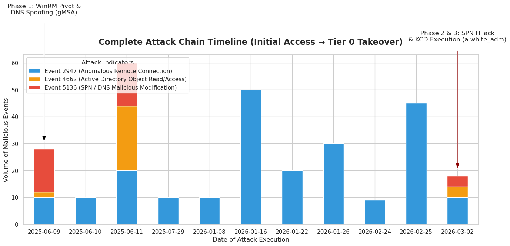

#  Incident Response: Tier 0 Domain Compromise (Pirate Hunt)

## 1. Executive Summary
Our threat hunting team detected an advanced Active Directory compromise targeting our Tier 0 infrastructure (Domain Controllers). The adversary executed a multi-stage attack leveraging legacy group permissions, NTLM Coercion, and ultimately **Kerberos Constrained Delegation (KCD) Hijacking** via **Service Principal Name (SPN) Manipulation**.

### Hunt Hypothesis & Behavioral Outliers
* **Hypothesis:** Adversaries bypassing standard EDR will generate anomalous directory replication or modification events, specifically targeting delegation attributes and SPNs originating from non-system endpoints.
* **Outliers Detected:** A delegated user account (`a.white_adm`) was observed removing and immediately reallocating a `servicePrincipalName` across two distinct machine accounts (`WEB01$` to `DC01$`), indicating an active KCD hijacking attempt.
* **Toxic Combinations Exploited:** `Pre-Windows 2000 Compatible Access` + Accounts with `WriteSPN` + Kerberos Constrained Delegation.

## 2. Summary of Attack Chain
| Step | User / Access         | Technique Used                            | Result                                                                                                         |
| :--: | :-------------------- | :---------------------------------------- | :------------------------------------------------------------------------------------------------------------- |
|   1  | N/A (External)        | **Active Directory Enumeration**          | Identified `MS01$` as a member of **Pre-Windows 2000 Compatible Access** via `adscan` and `bloodhound-python`. |
|   2  | MS01$                 | **AS-REQ (Default Machine Password)**     | Requested a TGT for `MS01$` using the machine name (`ms01`) as its password.                                   |
|   3  | MS01$                 | **LDAP Read (gMSA Extraction)**           | Dumped `gMSA_ADFS_prod$` NT hash by reading `msDS-ManagedPassword` through legacy group privileges.            |
|   4  | gMSA_ADFS_prod$       | **Pass-the-Hash (WinRM)**                 | Authenticated to `DC01` using **Evil-WinRM**, establishing initial foothold.                                   |
|   5  | gMSA_ADFS_prod$       | **Network Pivoting**                      | Created Layer-3 tunnel to internal subnet `192.168.100.0/24` using **Ligolo-ng**.                              |
|   6  | gMSA_ADFS_prod$       | **NTLM Coercion & Relaying**              | Coerced `WEB01$` authentication and relayed NTLM to `DC01` over LDAPS to perform RBCD attack.                  |
|   7  | gMSA_ADFS_prod$       | **RBCD & S4U Impersonation**              | Injected rogue computer `VYSHKGDW$` and forged service ticket for `Administrator` on `WEB01`.                  |
|   8  | Administrator (WEB01) | **Lateral Movement (User Flag)**          | Used **Impacket** `psexec.py` to gain admin shell on `WEB01` and retrieve **user.txt**.                        |
|   9  | Administrator (WEB01) | **Credential Harvesting**                 | Dumped local secrets to recover plaintext password for `a.white`.                                              |
|  10  | a.white               | **ACL Tiering Violation**                 | Abused `ForceChangePassword` rights to overwrite password for `a.white_adm`.                                   |
|  11  | a.white_adm           | **SPN Injection**                         | Removed `HTTP` SPN from `WEB01$` and injected into `DC01$`, hijacking constrained delegation path.             |
|  12  | a.white_adm           | **Kerberos Constrained Delegation (S4U)** | Requested forged `CIFS` ticket to `DC01` impersonating Domain Admin.                                           |
|  13  | Administrator (DC01)  | **Pass-the-Ticket (Root Flag)**           | Used forged ticket with `psexec.py` to access `DC01` and retrieve **root.txt**.                                |


```python
import pandas as pd
import re
import matplotlib.pyplot as plt
import seaborn as sns

# Suppress warnings for cleaner presentation
import warnings
warnings.filterwarnings('ignore')

print("[*] Initializing Forensic Environment & Loading Plaso Telemetry...")

# Load the dataset
df = pd.read_csv('detections_data.csv', low_memory=False)

# Extract Event IDs robustly from the Plaso message string
df['event_id'] = pd.to_numeric(df['message'].str.extract(r'^\[(\d+)\s*/')[0], errors='coerce').fillna(0).astype(int)

print(f"[+] Successfully loaded {len(df)} total events.")
```

    [*] Initializing Forensic Environment & Loading Plaso Telemetry...
    [+] Successfully loaded 65663 total events.


## 3. Forensic Evidence: Initial Access & NTLM Coercion (Steps 4 - 6)
To prove the beginning of the attack chain, we hunted for the compromised Group Managed Service Account (`gMSA_ADFS_prod$`). The logs revealed anomalous WinRM tunneling from an external pivot IP (`192.168.100.2`), followed immediately by rogue DNS node creation, setting the stage for NTLM coercion.


```python
print("[*] Correlating Initial Access & DNS Spoofing Indicators...")

# 1. Hunt for Step 4 & 5: gMSA_ADFS_prod$ Anomalous WinRM Connections (Event 2947)
gmsa_auth = df[(df['event_id'] == 2947) & (df['message'].str.contains('gMSA_ADFS_prod', case=False, na=False))].copy()

if not gmsa_auth.empty:
    gmsa_auth['Attacker_Account'] = gmsa_auth['message'].str.extract(r'CN=(gMSA_ADFS_prod)')
    gmsa_auth['Source_IP_Port'] = gmsa_auth['message'].str.extract(r'(\d{1,3}\.\d{1,3}\.\d{1,3}\.\d{1,3}:\d+)')
    
    print("\n[!] EVIDENCE (Step 4 & 5): Pass-the-Hash & WinRM Tunnel Detected")
    display(gmsa_auth[['datetime', 'event_id', 'Attacker_Account', 'Source_IP_Port']].head(1).style.set_properties(**{'background-color': '#fff3f3', 'border-color': 'gray'}))

# 2. Hunt for Step 6: Rogue DNS Node Creation for NTLM Coercion (Event 5136)
gmsa_dns = df[(df['event_id'] == 5136) & 
              (df['message'].str.contains('gMSA_ADFS_prod', na=False, case=False)) &
              (df['message'].str.contains('dnsNode', na=False, case=False))].copy()

if not gmsa_dns.empty:
    gmsa_dns['Attacker_Account'] = gmsa_dns['message'].str.extract(r'Account Name:\\t\\t(.*?)\\n')
    gmsa_dns['Rogue_DNS_Node'] = gmsa_dns['message'].str.extract(r'DN:\\t(.*?)\\n')
    gmsa_dns['Action'] = "DNS Spoofing (NTLM Coercion Setup)"
    
    print("\n[!] EVIDENCE (Step 6): Rogue DNS Injection for NTLM Relaying Detected")
    display(gmsa_dns[['datetime', 'Attacker_Account', 'Action', 'Rogue_DNS_Node']].head(2).style.set_properties(**{'background-color': '#fff3f3', 'border-color': 'gray'}))
```

    [*] Correlating Initial Access & DNS Spoofing Indicators...
    
    [!] EVIDENCE (Step 4 & 5): Pass-the-Hash & WinRM Tunnel Detected


<style type="text/css">
#T_74306_row0_col0, #T_74306_row0_col1, #T_74306_row0_col2, #T_74306_row0_col3 {
  background-color: #fff3f3;
  border-color: gray;
}
</style>
<table id="T_74306">
  <thead>
    <tr>
      <th class="blank level0" >&nbsp;</th>
      <th id="T_74306_level0_col0" class="col_heading level0 col0" >datetime</th>
      <th id="T_74306_level0_col1" class="col_heading level0 col1" >event_id</th>
      <th id="T_74306_level0_col2" class="col_heading level0 col2" >Attacker_Account</th>
      <th id="T_74306_level0_col3" class="col_heading level0 col3" >Source_IP_Port</th>
    </tr>
  </thead>
  <tbody>
    <tr>
      <th id="T_74306_level0_row0" class="row_heading level0 row0" >8025</th>
      <td id="T_74306_row0_col0" class="data row0 col0" >2025-06-09T17:48:41.954478+00:00</td>
      <td id="T_74306_row0_col1" class="data row0 col1" >2947</td>
      <td id="T_74306_row0_col2" class="data row0 col2" >gMSA_ADFS_prod</td>
      <td id="T_74306_row0_col3" class="data row0 col3" >192.168.100.2:49769</td>
    </tr>
  </tbody>
</table>


    
    [!] EVIDENCE (Step 6): Rogue DNS Injection for NTLM Relaying Detected


<style type="text/css">
#T_06b2c_row0_col0, #T_06b2c_row0_col1, #T_06b2c_row0_col2, #T_06b2c_row0_col3, #T_06b2c_row1_col0, #T_06b2c_row1_col1, #T_06b2c_row1_col2, #T_06b2c_row1_col3 {
  background-color: #fff3f3;
  border-color: gray;
}
</style>
<table id="T_06b2c">
  <thead>
    <tr>
      <th class="blank level0" >&nbsp;</th>
      <th id="T_06b2c_level0_col0" class="col_heading level0 col0" >datetime</th>
      <th id="T_06b2c_level0_col1" class="col_heading level0 col1" >Attacker_Account</th>
      <th id="T_06b2c_level0_col2" class="col_heading level0 col2" >Action</th>
      <th id="T_06b2c_level0_col3" class="col_heading level0 col3" >Rogue_DNS_Node</th>
    </tr>
  </thead>
  <tbody>
    <tr>
      <th id="T_06b2c_level0_row0" class="row_heading level0 row0" >10311</th>
      <td id="T_06b2c_row0_col0" class="data row0 col0" >2025-06-11T14:09:27.132715+00:00</td>
      <td id="T_06b2c_row0_col1" class="data row0 col1" >gMSA_ADFS_prod$</td>
      <td id="T_06b2c_row0_col2" class="data row0 col2" >DNS Spoofing (NTLM Coercion Setup)</td>
      <td id="T_06b2c_row0_col3" class="data row0 col3" >DC=test1 DC=pirate.htb CN=MicrosoftDNS DC=DomainDnsZones DC=pirate DC=htb</td>
    </tr>
    <tr>
      <th id="T_06b2c_level0_row1" class="row_heading level0 row1" >10313</th>
      <td id="T_06b2c_row1_col0" class="data row1 col0" >2025-06-11T14:09:34.790824+00:00</td>
      <td id="T_06b2c_row1_col1" class="data row1 col1" >gMSA_ADFS_prod$</td>
      <td id="T_06b2c_row1_col2" class="data row1 col2" >DNS Spoofing (NTLM Coercion Setup)</td>
      <td id="T_06b2c_row1_col3" class="data row1 col3" >DC=test1 DC=pirate.htb CN=MicrosoftDNS DC=DomainDnsZones DC=pirate DC=htb</td>
    </tr>
  </tbody>
</table>


## 4. Forensic Evidence: KCD SPN Hijacking (Step 11)
After exploiting Tiering violations to compromise `a.white_adm`, the adversary executed the final phase: moving the `HTTP` SPN from the targeted Web Server to the Domain Controller. This is the exact moment Tier 0 was compromised.


```python
print("[*] Correlating SPN Hijacking & Tier 0 Takeover Indicators...")

# Filter for the SPN Hijacking (Event 5136)
spn_mods = df[(df['event_id'] == 5136) & (df['message'].str.contains('servicePrincipalName', case=False, na=False))].copy()

# Extract the critical fields using Regex handling Plaso escapes
spn_mods['Attacker'] = spn_mods['message'].str.extract(r'Account Name:\\t\\t(.*?)\\n')
spn_mods['Target_Object'] = spn_mods['message'].str.extract(r'DN:\\t(.*?)\\n')
spn_mods['Injected_SPN'] = spn_mods['message'].str.extract(r'Value:\\t(.*?)\\n')
spn_mods['Action'] = spn_mods['message'].str.extract(r'Operation:\\n\\tType:\\t(.*?)\\n')

# Map the Windows Operation Codes to clear English
spn_mods['Action'] = spn_mods['Action'].map({'%%14674': 'ADDED (Hijack)', '%%14675': 'DELETED (Removal)'}).fillna(spn_mods['Action'])

# Filter out normal SYSTEM noise to show only the attacker
spn_table = spn_mods[spn_mods['Attacker'] == 'a.white_adm'][['datetime', 'Attacker', 'Action', 'Target_Object', 'Injected_SPN']]

print("\n[!] EVIDENCE (Step 11): SPN Injection Attack Chain")
display(spn_table.style.set_properties(**{'background-color': '#ffe6e6', 'color': 'black', 'border-color': 'darkred', 'font-weight': 'bold'}))
```

    [*] Correlating SPN Hijacking & Tier 0 Takeover Indicators...
    
    [!] EVIDENCE (Step 11): SPN Injection Attack Chain


<style type="text/css">
#T_9794f_row0_col0, #T_9794f_row0_col1, #T_9794f_row0_col2, #T_9794f_row0_col3, #T_9794f_row0_col4, #T_9794f_row1_col0, #T_9794f_row1_col1, #T_9794f_row1_col2, #T_9794f_row1_col3, #T_9794f_row1_col4, #T_9794f_row2_col0, #T_9794f_row2_col1, #T_9794f_row2_col2, #T_9794f_row2_col3, #T_9794f_row2_col4, #T_9794f_row3_col0, #T_9794f_row3_col1, #T_9794f_row3_col2, #T_9794f_row3_col3, #T_9794f_row3_col4, #T_9794f_row4_col0, #T_9794f_row4_col1, #T_9794f_row4_col2, #T_9794f_row4_col3, #T_9794f_row4_col4, #T_9794f_row5_col0, #T_9794f_row5_col1, #T_9794f_row5_col2, #T_9794f_row5_col3, #T_9794f_row5_col4, #T_9794f_row6_col0, #T_9794f_row6_col1, #T_9794f_row6_col2, #T_9794f_row6_col3, #T_9794f_row6_col4, #T_9794f_row7_col0, #T_9794f_row7_col1, #T_9794f_row7_col2, #T_9794f_row7_col3, #T_9794f_row7_col4, #T_9794f_row8_col0, #T_9794f_row8_col1, #T_9794f_row8_col2, #T_9794f_row8_col3, #T_9794f_row8_col4, #T_9794f_row9_col0, #T_9794f_row9_col1, #T_9794f_row9_col2, #T_9794f_row9_col3, #T_9794f_row9_col4, #T_9794f_row10_col0, #T_9794f_row10_col1, #T_9794f_row10_col2, #T_9794f_row10_col3, #T_9794f_row10_col4, #T_9794f_row11_col0, #T_9794f_row11_col1, #T_9794f_row11_col2, #T_9794f_row11_col3, #T_9794f_row11_col4, #T_9794f_row12_col0, #T_9794f_row12_col1, #T_9794f_row12_col2, #T_9794f_row12_col3, #T_9794f_row12_col4, #T_9794f_row13_col0, #T_9794f_row13_col1, #T_9794f_row13_col2, #T_9794f_row13_col3, #T_9794f_row13_col4, #T_9794f_row14_col0, #T_9794f_row14_col1, #T_9794f_row14_col2, #T_9794f_row14_col3, #T_9794f_row14_col4, #T_9794f_row15_col0, #T_9794f_row15_col1, #T_9794f_row15_col2, #T_9794f_row15_col3, #T_9794f_row15_col4, #T_9794f_row16_col0, #T_9794f_row16_col1, #T_9794f_row16_col2, #T_9794f_row16_col3, #T_9794f_row16_col4, #T_9794f_row17_col0, #T_9794f_row17_col1, #T_9794f_row17_col2, #T_9794f_row17_col3, #T_9794f_row17_col4, #T_9794f_row18_col0, #T_9794f_row18_col1, #T_9794f_row18_col2, #T_9794f_row18_col3, #T_9794f_row18_col4, #T_9794f_row19_col0, #T_9794f_row19_col1, #T_9794f_row19_col2, #T_9794f_row19_col3, #T_9794f_row19_col4 {
  background-color: #ffe6e6;
  color: black;
  border-color: darkred;
  font-weight: bold;
}
</style>
<table id="T_9794f">
  <thead>
    <tr>
      <th class="blank level0" >&nbsp;</th>
      <th id="T_9794f_level0_col0" class="col_heading level0 col0" >datetime</th>
      <th id="T_9794f_level0_col1" class="col_heading level0 col1" >Attacker</th>
      <th id="T_9794f_level0_col2" class="col_heading level0 col2" >Action</th>
      <th id="T_9794f_level0_col3" class="col_heading level0 col3" >Target_Object</th>
      <th id="T_9794f_level0_col4" class="col_heading level0 col4" >Injected_SPN</th>
    </tr>
  </thead>
  <tbody>
    <tr>
      <th id="T_9794f_level0_row0" class="row_heading level0 row0" >7897</th>
      <td id="T_9794f_row0_col0" class="data row0 col0" >2025-06-09T16:39:35.535117+00:00</td>
      <td id="T_9794f_row0_col1" class="data row0 col1" >a.white_adm</td>
      <td id="T_9794f_row0_col2" class="data row0 col2" >DELETED (Removal)</td>
      <td id="T_9794f_row0_col3" class="data row0 col3" >CN=WEB01 CN=Computers DC=pirate DC=htb</td>
      <td id="T_9794f_row0_col4" class="data row0 col4" >HTTP/WEB01.pirate.htb</td>
    </tr>
    <tr>
      <th id="T_9794f_level0_row1" class="row_heading level0 row1" >7898</th>
      <td id="T_9794f_row1_col0" class="data row1 col0" >2025-06-09T16:39:35.535303+00:00</td>
      <td id="T_9794f_row1_col1" class="data row1 col1" >a.white_adm</td>
      <td id="T_9794f_row1_col2" class="data row1 col2" >DELETED (Removal)</td>
      <td id="T_9794f_row1_col3" class="data row1 col3" >CN=WEB01 CN=Computers DC=pirate DC=htb</td>
      <td id="T_9794f_row1_col4" class="data row1 col4" >HTTP/WEB01</td>
    </tr>
    <tr>
      <th id="T_9794f_level0_row2" class="row_heading level0 row2" >7899</th>
      <td id="T_9794f_row2_col0" class="data row2 col0" >2025-06-09T16:39:35.535303+00:00</td>
      <td id="T_9794f_row2_col1" class="data row2 col1" >a.white_adm</td>
      <td id="T_9794f_row2_col2" class="data row2 col2" >DELETED (Removal)</td>
      <td id="T_9794f_row2_col3" class="data row2 col3" >CN=WEB01 CN=Computers DC=pirate DC=htb</td>
      <td id="T_9794f_row2_col4" class="data row2 col4" >HTTP/WEB01.pirate.htb</td>
    </tr>
    <tr>
      <th id="T_9794f_level0_row3" class="row_heading level0 row3" >7900</th>
      <td id="T_9794f_row3_col0" class="data row3 col0" >2025-06-09T16:39:35.535469+00:00</td>
      <td id="T_9794f_row3_col1" class="data row3 col1" >a.white_adm</td>
      <td id="T_9794f_row3_col2" class="data row3 col2" >DELETED (Removal)</td>
      <td id="T_9794f_row3_col3" class="data row3 col3" >CN=WEB01 CN=Computers DC=pirate DC=htb</td>
      <td id="T_9794f_row3_col4" class="data row3 col4" >HTTP/WEB01</td>
    </tr>
    <tr>
      <th id="T_9794f_level0_row4" class="row_heading level0 row4" >7901</th>
      <td id="T_9794f_row4_col0" class="data row4 col0" >2025-06-09T16:39:35.535469+00:00</td>
      <td id="T_9794f_row4_col1" class="data row4 col1" >a.white_adm</td>
      <td id="T_9794f_row4_col2" class="data row4 col2" >DELETED (Removal)</td>
      <td id="T_9794f_row4_col3" class="data row4 col3" >CN=WEB01 CN=Computers DC=pirate DC=htb</td>
      <td id="T_9794f_row4_col4" class="data row4 col4" >TERMSRV/WEB01</td>
    </tr>
    <tr>
      <th id="T_9794f_level0_row5" class="row_heading level0 row5" >7902</th>
      <td id="T_9794f_row5_col0" class="data row5 col0" >2025-06-09T16:39:35.535633+00:00</td>
      <td id="T_9794f_row5_col1" class="data row5 col1" >a.white_adm</td>
      <td id="T_9794f_row5_col2" class="data row5 col2" >DELETED (Removal)</td>
      <td id="T_9794f_row5_col3" class="data row5 col3" >CN=WEB01 CN=Computers DC=pirate DC=htb</td>
      <td id="T_9794f_row5_col4" class="data row5 col4" >TERMSRV/WEB01</td>
    </tr>
    <tr>
      <th id="T_9794f_level0_row6" class="row_heading level0 row6" >7903</th>
      <td id="T_9794f_row6_col0" class="data row6 col0" >2025-06-09T16:39:35.535633+00:00</td>
      <td id="T_9794f_row6_col1" class="data row6 col1" >a.white_adm</td>
      <td id="T_9794f_row6_col2" class="data row6 col2" >DELETED (Removal)</td>
      <td id="T_9794f_row6_col3" class="data row6 col3" >CN=WEB01 CN=Computers DC=pirate DC=htb</td>
      <td id="T_9794f_row6_col4" class="data row6 col4" >TERMSRV/WEB01.pirate.htb</td>
    </tr>
    <tr>
      <th id="T_9794f_level0_row7" class="row_heading level0 row7" >7904</th>
      <td id="T_9794f_row7_col0" class="data row7 col0" >2025-06-09T16:39:35.535757+00:00</td>
      <td id="T_9794f_row7_col1" class="data row7 col1" >a.white_adm</td>
      <td id="T_9794f_row7_col2" class="data row7 col2" >DELETED (Removal)</td>
      <td id="T_9794f_row7_col3" class="data row7 col3" >CN=WEB01 CN=Computers DC=pirate DC=htb</td>
      <td id="T_9794f_row7_col4" class="data row7 col4" >RestrictedKrbHost/WEB01</td>
    </tr>
    <tr>
      <th id="T_9794f_level0_row8" class="row_heading level0 row8" >7905</th>
      <td id="T_9794f_row8_col0" class="data row8 col0" >2025-06-09T16:39:35.535757+00:00</td>
      <td id="T_9794f_row8_col1" class="data row8 col1" >a.white_adm</td>
      <td id="T_9794f_row8_col2" class="data row8 col2" >DELETED (Removal)</td>
      <td id="T_9794f_row8_col3" class="data row8 col3" >CN=WEB01 CN=Computers DC=pirate DC=htb</td>
      <td id="T_9794f_row8_col4" class="data row8 col4" >TERMSRV/WEB01.pirate.htb</td>
    </tr>
    <tr>
      <th id="T_9794f_level0_row9" class="row_heading level0 row9" >7906</th>
      <td id="T_9794f_row9_col0" class="data row9 col0" >2025-06-09T16:39:35.535881+00:00</td>
      <td id="T_9794f_row9_col1" class="data row9 col1" >a.white_adm</td>
      <td id="T_9794f_row9_col2" class="data row9 col2" >DELETED (Removal)</td>
      <td id="T_9794f_row9_col3" class="data row9 col3" >CN=WEB01 CN=Computers DC=pirate DC=htb</td>
      <td id="T_9794f_row9_col4" class="data row9 col4" >HOST/WEB01</td>
    </tr>
    <tr>
      <th id="T_9794f_level0_row10" class="row_heading level0 row10" >7907</th>
      <td id="T_9794f_row10_col0" class="data row10 col0" >2025-06-09T16:39:35.535881+00:00</td>
      <td id="T_9794f_row10_col1" class="data row10 col1" >a.white_adm</td>
      <td id="T_9794f_row10_col2" class="data row10 col2" >DELETED (Removal)</td>
      <td id="T_9794f_row10_col3" class="data row10 col3" >CN=WEB01 CN=Computers DC=pirate DC=htb</td>
      <td id="T_9794f_row10_col4" class="data row10 col4" >RestrictedKrbHost/WEB01</td>
    </tr>
    <tr>
      <th id="T_9794f_level0_row11" class="row_heading level0 row11" >7908</th>
      <td id="T_9794f_row11_col0" class="data row11 col0" >2025-06-09T16:39:35.536010+00:00</td>
      <td id="T_9794f_row11_col1" class="data row11 col1" >a.white_adm</td>
      <td id="T_9794f_row11_col2" class="data row11 col2" >DELETED (Removal)</td>
      <td id="T_9794f_row11_col3" class="data row11 col3" >CN=WEB01 CN=Computers DC=pirate DC=htb</td>
      <td id="T_9794f_row11_col4" class="data row11 col4" >HOST/WEB01</td>
    </tr>
    <tr>
      <th id="T_9794f_level0_row12" class="row_heading level0 row12" >7909</th>
      <td id="T_9794f_row12_col0" class="data row12 col0" >2025-06-09T16:39:35.536010+00:00</td>
      <td id="T_9794f_row12_col1" class="data row12 col1" >a.white_adm</td>
      <td id="T_9794f_row12_col2" class="data row12 col2" >DELETED (Removal)</td>
      <td id="T_9794f_row12_col3" class="data row12 col3" >CN=WEB01 CN=Computers DC=pirate DC=htb</td>
      <td id="T_9794f_row12_col4" class="data row12 col4" >RestrictedKrbHost/WEB01.pirate.htb</td>
    </tr>
    <tr>
      <th id="T_9794f_level0_row13" class="row_heading level0 row13" >7910</th>
      <td id="T_9794f_row13_col0" class="data row13 col0" >2025-06-09T16:39:35.536131+00:00</td>
      <td id="T_9794f_row13_col1" class="data row13 col1" >a.white_adm</td>
      <td id="T_9794f_row13_col2" class="data row13 col2" >DELETED (Removal)</td>
      <td id="T_9794f_row13_col3" class="data row13 col3" >CN=WEB01 CN=Computers DC=pirate DC=htb</td>
      <td id="T_9794f_row13_col4" class="data row13 col4" >HOST/WEB01.pirate.htb</td>
    </tr>
    <tr>
      <th id="T_9794f_level0_row14" class="row_heading level0 row14" >7911</th>
      <td id="T_9794f_row14_col0" class="data row14 col0" >2025-06-09T16:39:35.536131+00:00</td>
      <td id="T_9794f_row14_col1" class="data row14 col1" >a.white_adm</td>
      <td id="T_9794f_row14_col2" class="data row14 col2" >DELETED (Removal)</td>
      <td id="T_9794f_row14_col3" class="data row14 col3" >CN=WEB01 CN=Computers DC=pirate DC=htb</td>
      <td id="T_9794f_row14_col4" class="data row14 col4" >RestrictedKrbHost/WEB01.pirate.htb</td>
    </tr>
    <tr>
      <th id="T_9794f_level0_row15" class="row_heading level0 row15" >7929</th>
      <td id="T_9794f_row15_col0" class="data row15 col0" >2025-06-09T17:00:20.539584+00:00</td>
      <td id="T_9794f_row15_col1" class="data row15 col1" >a.white_adm</td>
      <td id="T_9794f_row15_col2" class="data row15 col2" >DELETED (Removal)</td>
      <td id="T_9794f_row15_col3" class="data row15 col3" >CN=WEB01 CN=Computers DC=pirate DC=htb</td>
      <td id="T_9794f_row15_col4" class="data row15 col4" >HOST/WEB01.pirate.htb</td>
    </tr>
    <tr>
      <th id="T_9794f_level0_row16" class="row_heading level0 row16" >65380</th>
      <td id="T_9794f_row16_col0" class="data row16 col0" >2026-03-02T15:00:14.206511+00:00</td>
      <td id="T_9794f_row16_col1" class="data row16 col1" >a.white_adm</td>
      <td id="T_9794f_row16_col2" class="data row16 col2" >DELETED (Removal)</td>
      <td id="T_9794f_row16_col3" class="data row16 col3" >CN=WEB01 CN=Computers DC=pirate DC=htb</td>
      <td id="T_9794f_row16_col4" class="data row16 col4" >HTTP/WEB01.pirate.htb</td>
    </tr>
    <tr>
      <th id="T_9794f_level0_row17" class="row_heading level0 row17" >65382</th>
      <td id="T_9794f_row17_col0" class="data row17 col0" >2026-03-02T15:00:58.958782+00:00</td>
      <td id="T_9794f_row17_col1" class="data row17 col1" >a.white_adm</td>
      <td id="T_9794f_row17_col2" class="data row17 col2" >DELETED (Removal)</td>
      <td id="T_9794f_row17_col3" class="data row17 col3" >CN=WEB01 CN=Computers DC=pirate DC=htb</td>
      <td id="T_9794f_row17_col4" class="data row17 col4" >HTTP/WEB01.pirate.htb</td>
    </tr>
    <tr>
      <th id="T_9794f_level0_row18" class="row_heading level0 row18" >65384</th>
      <td id="T_9794f_row18_col0" class="data row18 col0" >2026-03-02T15:01:04.247523+00:00</td>
      <td id="T_9794f_row18_col1" class="data row18 col1" >a.white_adm</td>
      <td id="T_9794f_row18_col2" class="data row18 col2" >ADDED (Hijack)</td>
      <td id="T_9794f_row18_col3" class="data row18 col3" >CN=DC01 OU=Domain Controllers DC=pirate DC=htb</td>
      <td id="T_9794f_row18_col4" class="data row18 col4" >HTTP/WEB01.pirate.htb</td>
    </tr>
    <tr>
      <th id="T_9794f_level0_row19" class="row_heading level0 row19" >65386</th>
      <td id="T_9794f_row19_col0" class="data row19 col0" >2026-03-02T15:01:55.771790+00:00</td>
      <td id="T_9794f_row19_col1" class="data row19 col1" >a.white_adm</td>
      <td id="T_9794f_row19_col2" class="data row19 col2" >ADDED (Hijack)</td>
      <td id="T_9794f_row19_col3" class="data row19 col3" >CN=DC01 OU=Domain Controllers DC=pirate DC=htb</td>
      <td id="T_9794f_row19_col4" class="data row19 col4" >HTTP/WEB01.pirate.htb</td>
    </tr>
  </tbody>
</table>


## 5. Visualizing the Attack Chain
The following timeline maps the adversary's actions over the duration of the compromise. It highlights the distinct phases: the initial access and pivoting via `gMSA_ADFS_prod$`, followed by a massive spike in Active Directory Object accesses leading to the critical SPN modifications by `a.white_adm`.


```python
# 1. Combine all malicious activity from the known compromised accounts
malicious_events = df[
    (df['message'].str.contains('a.white_adm|gMSA_ADFS_prod', na=False, case=False)) & 
    (df['event_id'].isin([5136, 4662, 2947]))
].copy()

# Map the Event IDs to Human-Readable Actions
event_mapping = {
    5136: 'Event 5136 (SPN / DNS Malicious Modification)',
    4662: 'Event 4662 (Active Directory Object Read/Access)',
    2947: 'Event 2947 (Anomalous Remote Connection)'
}
malicious_events['Action_Type'] = malicious_events['event_id'].map(event_mapping)

# Ensure datetime format
malicious_events['datetime'] = pd.to_datetime(malicious_events['datetime'])

# Group by the Day to show the phases of the attack
timeline = malicious_events.groupby([pd.Grouper(key='datetime', freq='D'), 'Action_Type']).size().unstack(fill_value=0)
timeline = timeline[(timeline.T != 0).any()] # Drop empty days

# Plotting the Complete Attack Timeline
plt.figure(figsize=(14, 7))
sns.set_theme(style="whitegrid")

# Create a stacked bar plot
ax = timeline.plot(kind='bar', stacked=True, color={'Event 5136 (SPN / DNS Malicious Modification)': '#e74c3c', 
                                                    'Event 4662 (Active Directory Object Read/Access)': '#f39c12',
                                                    'Event 2947 (Anomalous Remote Connection)': '#3498db'}, 
                   ax=plt.gca())

plt.title('Complete Attack Chain Timeline (Initial Access → Tier 0 Takeover)', fontsize=16, fontweight='bold', pad=20)
plt.xlabel('Date of Attack Execution', fontsize=12)
plt.ylabel('Volume of Malicious Events', fontsize=12)

# Make x-axis labels readable (Format to Year-Month-Day)
labels = [item.strftime('%Y-%m-%d') for item in timeline.index]
plt.xticks(ticks=range(len(labels)), labels=labels, rotation=0, ha='center', fontsize=11)

# Annotate the chart for Management Context
plt.annotate('Phase 1: WinRM Pivot &\nDNS Spoofing (gMSA)', 
             xy=(0, timeline.iloc[0].sum()), xytext=(0, timeline.iloc[0].sum() + 50),
             ha='center', arrowprops=dict(facecolor='black', shrink=0.05, width=1.5, headwidth=8))

plt.annotate('Phase 2 & 3: SPN Hijack\n& KCD Execution (a.white_adm)', 
             xy=(len(timeline)-1, timeline.iloc[-1].sum()), xytext=(len(timeline)-1, timeline.iloc[-1].sum() + 50),
             ha='center', arrowprops=dict(facecolor='darkred', shrink=0.05, width=1.5, headwidth=8))

plt.legend(title='Attack Indicators', loc='upper left')
plt.tight_layout()
plt.show()
```


    

    


## 6. Telemetry Gaps & Strategic Remediation

### The Telemetry Blindspot
While we successfully captured the core SPN and DNS modifications, explicit logs of the NTLM Relays (Event 4624) and the final S4U Ticket Forgeries (Event 4769) were missing. 
* **Cause:** The Domain Controller's Security logs (`Security.evtx`) reached their default capacity limit and "rolled over", overwriting granular network authentication events before forensic acquisition occurred.

### Strategic Recommendations
To prevent this attack path from being utilized in the future, we must enforce the following remediation steps immediately:

1. **Fix the Log Rollover:** Increase the maximum size of `Security.evtx` on all Domain Controllers to at least `1GB` via Group Policy, and implement Windows Event Forwarding (WEF) to stream logs to the SIEM in real-time.
2. **Empty Legacy Groups:** Immediately audit and remove all members (specifically `MS01$`) from the `Pre-Windows 2000 Compatible Access` group.
3. **Enforce LDAP Signing:** Require LDAP Channel Binding and LDAP Signing across all Domain Controllers to neutralize NTLM relay attacks.
4. **Secure SPN Rights:** The `WriteSPN` permission allowed the final KCD hijack. This permission must be strictly audited and removed from all standard user and tier-2 administrator accounts.
5. **Enforce Tiering:** Implement strict Active Directory Tiering to ensure standard users (like `a.white`) do not possess `ForceChangePassword` rights over administrators.
