# Noxious

```
Difficulty: Very Easy
Category: DFIR / Network Analysis
```

### Summary of Attack Chain


| Step | User / Access      | Technique Used                 | Result                                                                                          |
| :--: | :----------------- | :----------------------------- | :---------------------------------------------------------------------------------------------- |
|   1  | N/A (Victim)       | **LLMNR broadcast (typo)**     | Victim mistyped `\\DC01` as `\\DCC01`, triggering a network-wide LLMNR name resolution request. |
|   2  | N/A (Attacker)     | **LLMNR poisoning**            | Attacker (Responder) spoofed the identity of `DCC01` and replied to the broadcast.              |
|   3  | john.deacon        | **SMB authentication capture** | Victim connected to attacker and transmitted a NetNTLMv2 authentication hash.                   |
|   4  | Attacker (Offline) | **Offline password cracking**  | Hashcat (mode 5600) cracked the NetNTLMv2 hash, revealing password `NotMyPassword0k?`.          |
|   5  | john.deacon (RDP)  | **Credential reuse via RDP**   | Attacker logged in remotely using valid credentials and established interactive access.         |


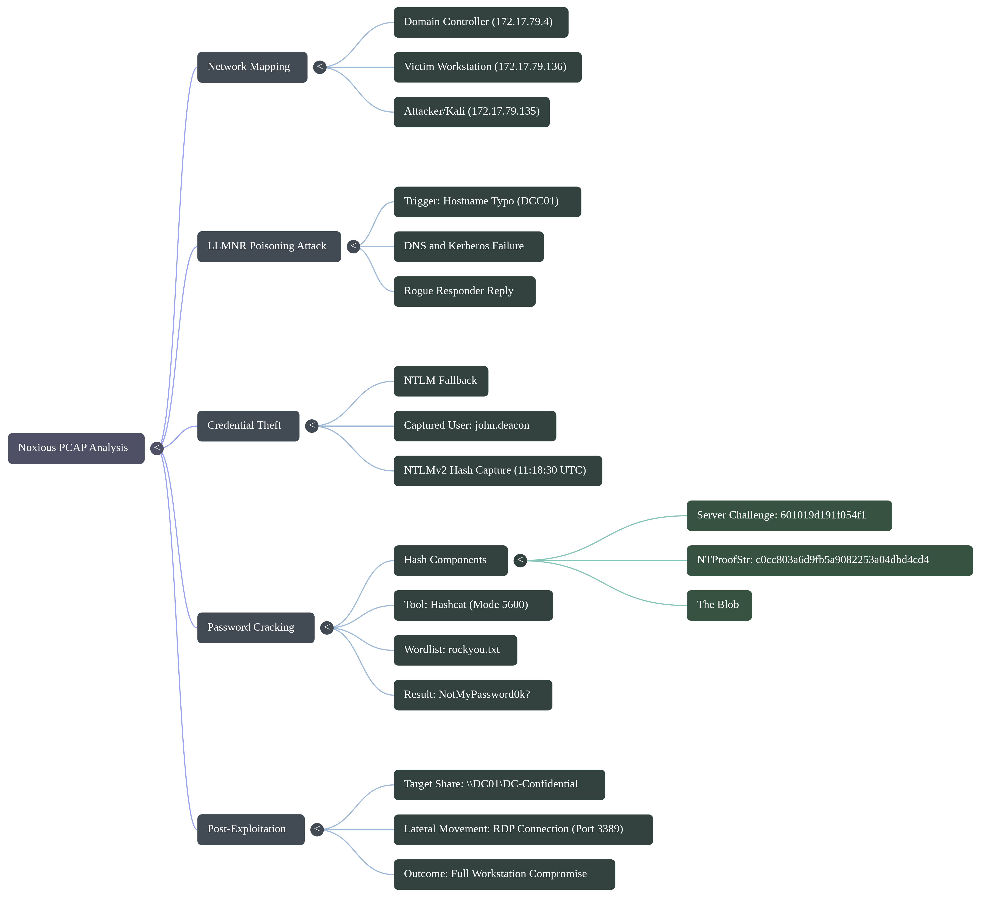


## Initial Reconnaissance & Statistics

Before diving into specific packets, we use standard tools to understand the scope of the capture.

### File Info (`capinfos`)
Using `capinfos`, we determine the capture timeframe.
```bash
$ TZ=UTC capinfos -a -e capture.pcap
File name:           capture.pcap
First packet time:   2024-06-24 11:17:22.462145
Last packet time:    2024-06-24 11:40:07.259807

```

[PCAP Logs](https://raw.githubusercontent.com/0x0z0n/Research/refs/heads/main/posts/noxious/capture.pcap "Informational")

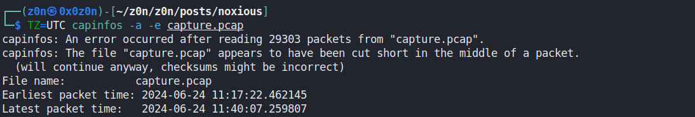

* **Date:** June 24, 2024
* **Duration:** ~13 minutes

### Network Mapping (Wireshark Endpoints)

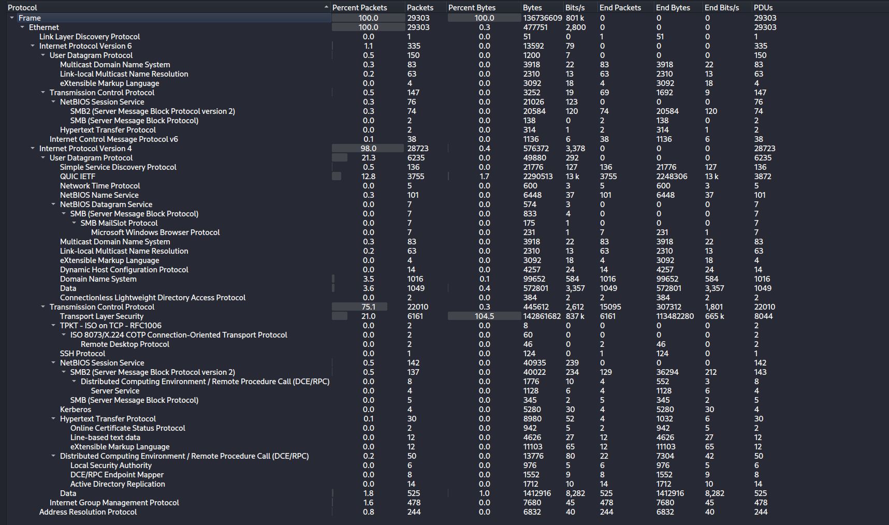

[RDP Dump](https://raw.githubusercontent.com/0x0z0n/Research/refs/heads/main/posts/noxious/RDP "Informational")


By navigating to **Statistics -> Endpoints**, we can map out key players in the subnet `172.17.79.0/24`.

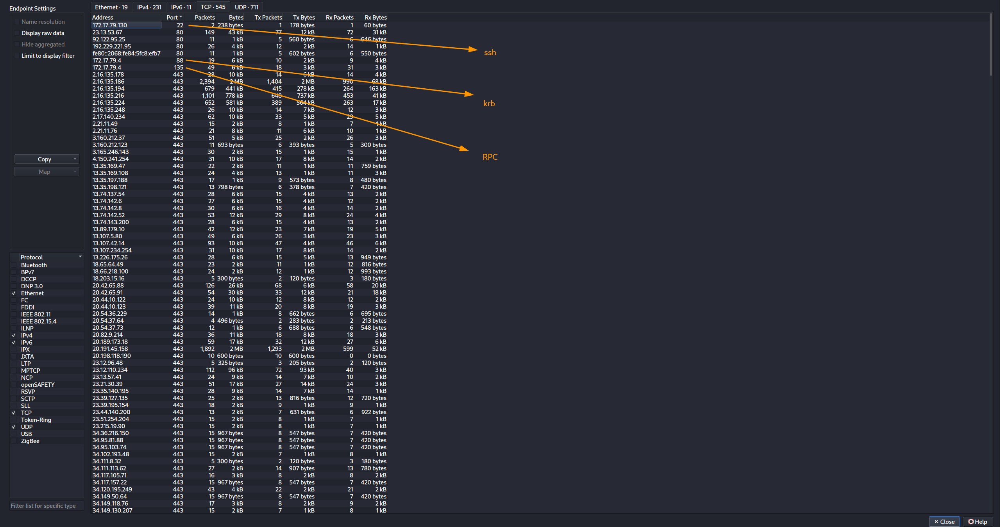

| IP Address        | Role                         | Evidence                                                                   |
| :---------------- | :--------------------------- | :------------------------------------------------------------------------- |
| **172.17.79.4**   | **Domain Controller (DC01)** | Ports 88 (Kerberos), 135 (RPC), 445 (SMB) open; broadcasts NetBIOS `DC01`. |
| **172.17.79.136** | **Victim (Workstation)**     | Initiates SMB connections; high outbound authentication attempts.          |
| **172.17.79.135** | **Rogue / Attacker**         | Suspicious SMB responses; later identified as `kali`.                      |


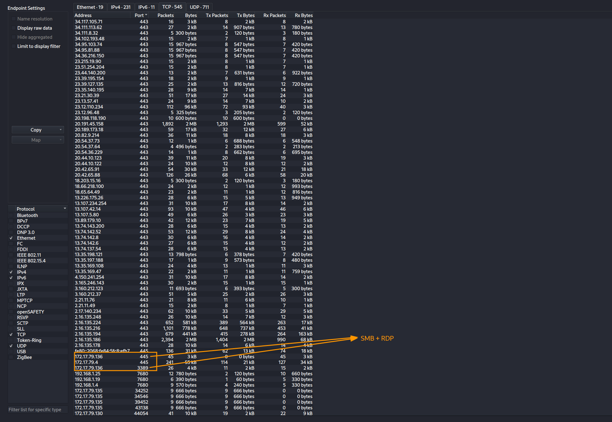


## 2. The Attack: LLMNR Poisoning

**Theory:** Link-Local Multicast Name Resolution (LLMNR) is used when DNS fails. If a user mistypes a hostname, the machine broadcasts an LLMNR query. An attacker can listen for these broadcasts and respond, pretending to be the requested host.

### Identifying the Trigger

Filter: `llmnr`

We see a query from the Victim (`.136`) looking for **`DCC01`**.

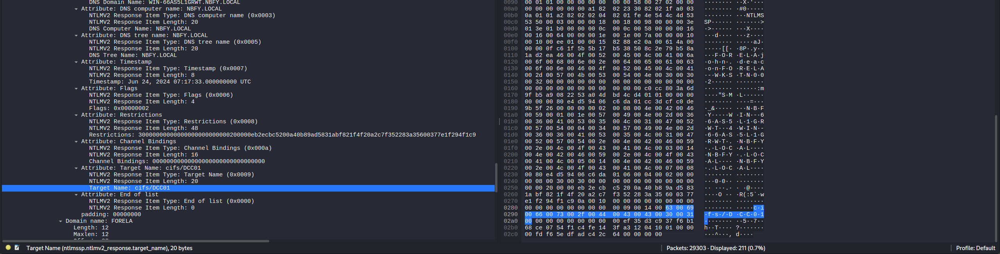

* **Context:** The legitimate DC is named `DC01`. The user likely made a typo.
* **The Poisoning:** Instead of the request timing out, IP **`172.17.79.135`** responds immediately, claiming to be `DCC01`.

### The Rogue Identity

To confirm the nature of the attacker's machine, we check for DHCP traffic.
**Filter:** `bootp` (or `dhcp`)

Looking at the DHCP Request from `172.17.79.135`:

* **Option 12 (Host Name):** `kali`
* **Conclusion:** The rogue device is a Kali Linux machine running tools like **Responder**.

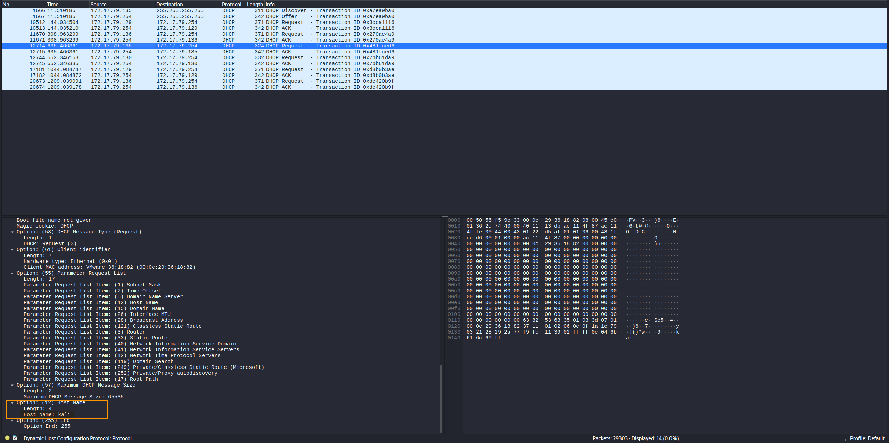


## 3. Credential Theft (SMB & NTLM)

Once the victim accepts the rogue's IP as the destination, they attempt to authenticate.

[SMB Dump](https://raw.githubusercontent.com/0x0z0n/Research/refs/heads/main/posts/noxious/SMB "Informational")

**Filter:** `smb2 || ntlmssp`

1. **Kerberos Failure:** The victim first tries Kerberos (Ticket Granting Service), but since `DCC01` doesn't exist in the KDC, this fails.
2. **NTLM Fallback:** The victim falls back to NTLM authentication.
3. **The Capture:** At **11:18:30 UTC**, the victim sends their NTLMv2 response to the attacker (`.135`).

[SMB Analysis](https://raw.githubusercontent.com/0x0z0n/Research/refs/heads/main/posts/noxious/SMB_analysis.txt "Informational")


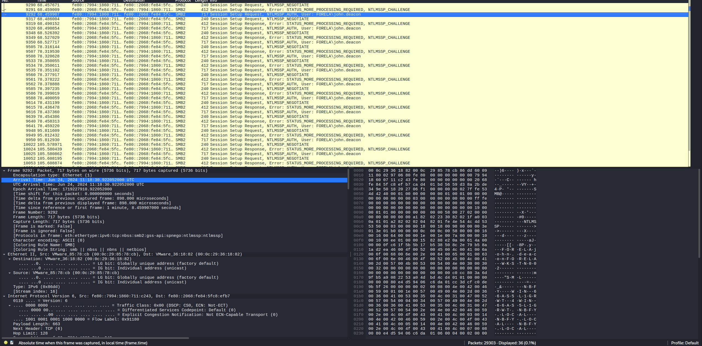


* **User:** `john.deacon`
* **Domain:** `FORELA`


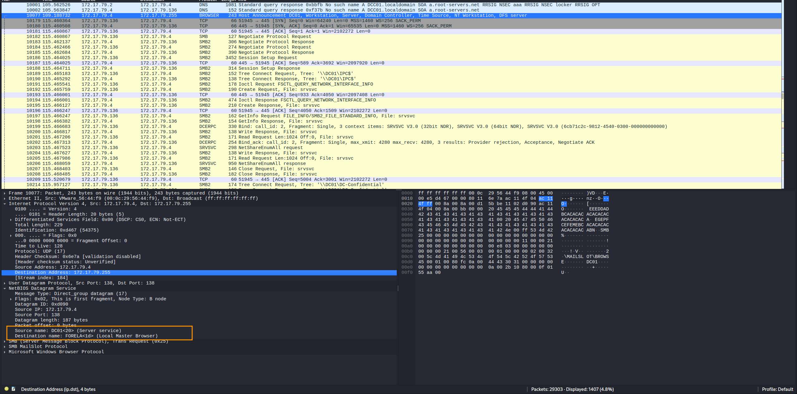

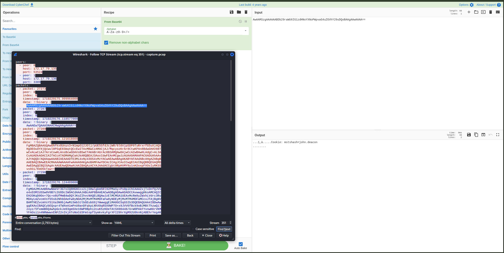

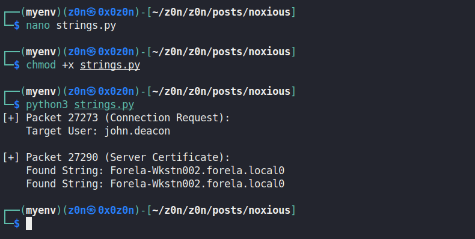

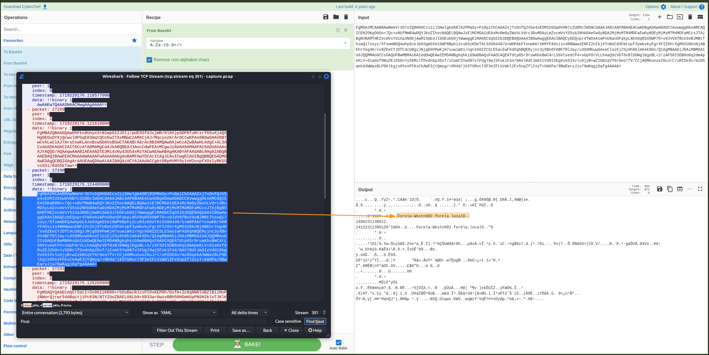

[Strings conversion basis of Frame](https://raw.githubusercontent.com/0x0z0n/Research/refs/heads/main/posts/noxious/strings.py "Informational")

[Decoder.py  YAML -> String](https://raw.githubusercontent.com/0x0z0n/Research/refs/heads/main/posts/noxious/decoder.py "Informational")

## 4. Recovering & Cracking the Password

To determine the severity of the breach, we must see if the password is weak enough to be cracked. We need to reconstruct the "hash" from the NTLMv2 handshake.

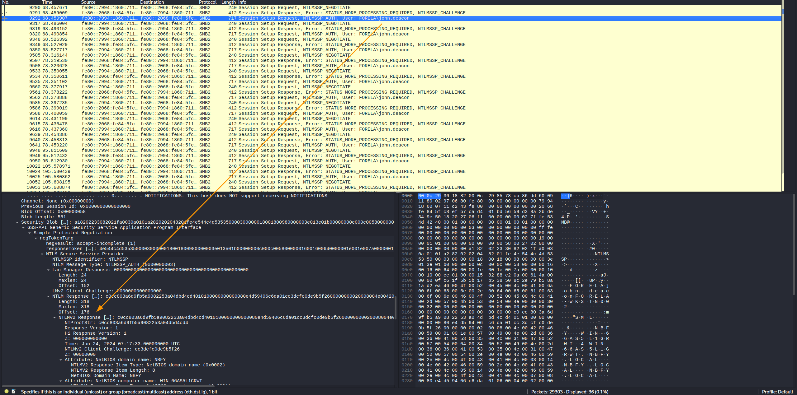

[NTLM Response Hash](https://raw.githubusercontent.com/0x0z0n/Research/refs/heads/main/posts/noxious/htb_noxious_NTLM_Captured_john_hash.txt "Informational")


### Extracting the Hash Parts

We need to stitch together specific fields from the NTLM handshake packets.

[Server Challenge](https://raw.githubusercontent.com/0x0z0n/Research/refs/heads/main/posts/noxious/htb_noxious_NTLM_serverchallenge_value_hash.txt  "Informational")

**1. Server Challenge (Packet 9291):**

* *Location:* NTLMSSP_CHALLENGE -> NTLM Server Challenge
* *Value:* `601019d191f054f1`

**2. NTProofStr (Packet 9292):**

* *Location:* NTLMSSP_AUTH -> NTLMv2 Response -> NTProofStr
* *Value:* `c0cc803a6d9fb5a9082253a04dbd4cd4`

**3. The Blob (Rest of Response):**

* *Location:* The NTLMv2 Response field, **minus** the first 16 bytes (which is the NTProofStr).
* *Value:* `010100000000000080e4d594...` (and so on)

### Constructing the Hash

The format for Hashcat (Module 5600) is:
`User::Domain:ServerChallenge:NTProofStr:Blob`

**Final Hash String:**

```text
JOHN.DEACON::FORELA:601019d191f054f1:c0cc803a6d9fb5a9082253a04dbd4cd4:010100000000000080e4d59406c6da01cc3dcfc0de9b5f2600000000020008004e0042004600590001001e00570049004e002d00360036004100530035004c003100470052005700540004003400570049004e002d00360036004100530035004c00310047005200570054002e004e004200460059002e004c004f00430041004c00030014004e004200460059002e004c004f00430041004c00050014004e004200460059002e004c004f00430041004c000700080080e4d59406c6da0106000400020000000800300030000000000000000000000000200000eb2ecbc5200a40b89ad5831abf821f4f20a2c7f352283a35600377e1f294f1c90a001000000000000000000000000000000000000900140063006900660073002f00440043004300300031000000000000000000
```

[HASH](https://raw.githubusercontent.com/0x0z0n/Research/refs/heads/main/posts/noxious/john.deacon.hash2  "Informational")

### Cracking with Hashcat

We run Hashcat against the `rockyou.txt` wordlist using mode 5600 (NetNTLMv2).

```bash
hashcat -m 5600 john.deacon.hash2 /opt/SecLists/rockyou.txt

```

**Result:**
The password is cracked in ~4 seconds:

> **Password:** `NotMyPassword0k?`

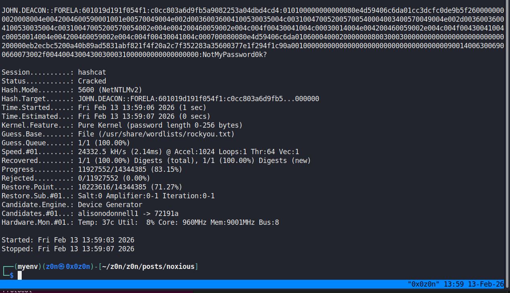

## 5. Post-Exploitation & Impact

Validating the compromise, we check if the attacker used these credentials.

1. **Correct Connection:** Later in the PCAP, the victim corrects their typo and connects to the legitimate share: `\\DC01\DC-Confidential`.
2. **Attacker Access:** We observe an **RDP Connection** (Port 3389) initiating from the attacker (`.135`) to the victim (`.136`). This confirms the attacker successfully used the cracked password to log in remotely.

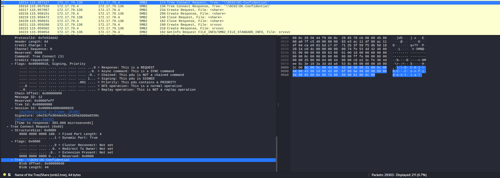


## Sherlock Solution Key

| Question                      | Answer                             |
| :---------------------------- | :--------------------------------- |
| **Malicious IP Address**      | `172.17.79.135`                    |
| **Hostname of Rogue Machine** | `kali`                             |
| **Compromised Username**      | `john.deacon`                      |
| **Time of First Capture**     | `2024-06-24 11:18:30`              |
| **Typo (Name Query)**         | `DCC01`                            |
| **NTLM Server Challenge**     | `601019d191f054f1`                 |
| **NTProofStr Value**          | `c0cc803a6d9fb5a9082253a04dbd4cd4` |
| **Cracked Password**          | `NotMyPassword0k?`                 |
| **Target File Share**         | `\\DC01\DC-Confidential`           |


```
(dns.qry.name contains "DCC01") || (kerberos.SNameString contains "DCC01") || (ip.addr == 172.17.79.135) || (ipv6.addr == fe80::2068:fe84:5fc8:efb7)
```

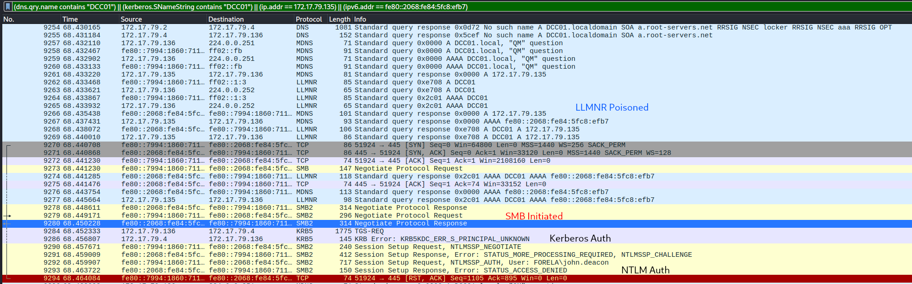


The attack begins with a simple user error when the victim, attempting to access a file share on the domain controller, mistakenly types `\\DCC01` instead of the correct `\\DC01`. This typo triggers a failed DNS lookup and a subsequent Kerberos service ticket request for `cifs/DCC01`, which the Domain Controller rejects because the hostname does not exist.

As the system falls back to legacy protocols for name resolution, it broadcasts an LLMNR query to the local network asking for the location of "DCC01." A rogue device running Responder instantly replies to this broadcast, fraudulently claiming to be the requested host. The victim's machine, trusting this response, initiates an SMB connection to the attacker and unwittingly sends the user's NetNTLMv2 hash (`john.deacon`) in an attempt to authenticate. The attacker captures this hash, cracks it offline to reveal the password `NotMyPassword0k?`, and finally uses these valid credentials to launch a Remote Desktop (RDP) session back into the victim's machine, completing the compromise.

[Attack Chain](https://raw.githubusercontent.com/0x0z0n/Research/refs/heads/main/posts/noxious/Evidence_Initial_vector.csv "Excel")

